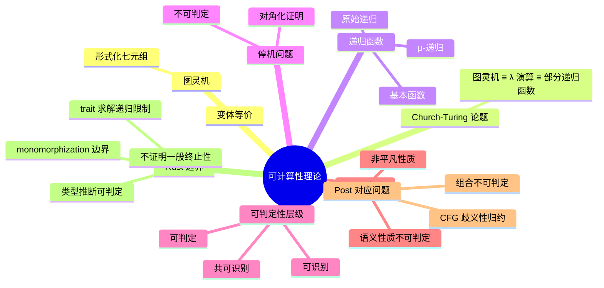

> **内容分级**: [专家级]

# 可计算性理论（Computability Theory）

> **EN**: Computability Theory
> **Summary**: Turing machines, recursive functions, the halting problem, decidability/recognizability, Rice's theorem, Post's correspondence problem, and the Church-Turing thesis — with Rust examples of computable and non-computable boundaries.

> **Rust 版本**: 1.97.0+ (Edition 2024)
> **Bloom 层级**: L4-L5
> **权威来源**: 本文件为 `concept/` 权威页。
> **定位**: 从图灵机、递归函数与 Church-Turing 论题出发，刻画「可计算」的形式边界，并通过 Rust 实例展示可判定性、不可判定性、Rice 定理与 Post 对应问题在语言实现中的投影。
> **前置概念**: [Concurrency](../../03_advanced/00_concurrency/01_concurrency.md) · [Lambda Calculus](../00_type_theory/05_lambda_calculus.md) · [Type Theory](../00_type_theory/01_type_theory.md)
> **后置概念**: [Mathematical Functions of Computation](04_mathematical_functions_of_computation.md) · [Formal Languages and Automata](03_formal_languages_and_automata.md) · [Equivalence of Computational Models](05_equivalence_of_computational_models.md)

---

## 📑 目录

- [可计算性理论（Computability Theory）](#可计算性理论computability-theory)
  - [📑 目录](#-目录)
  - [一、核心概念](#一核心概念)
    - [1.1 图灵机形式化](#11-图灵机形式化)
    - [1.2 Church-Turing 论题](#12-church-turing-论题)
    - [1.3 递归函数族](#13-递归函数族)
    - [1.4 停机问题](#14-停机问题)
    - [1.5 可判定 / 可识别 / 共可识别](#15-可判定--可识别--共可识别)
    - [1.6 Rice 定理：语义性质的不可判定性](#16-rice-定理语义性质的不可判定性)
    - [1.7 递归可枚举集合与共递归可枚举集合](#17-递归可枚举集合与共递归可枚举集合)
    - [1.8 Post 对应问题](#18-post-对应问题)
  - [二、Rust 视角下的可计算边界](#二rust-视角下的可计算边界)
    - [2.1 Rust 不能证明的一般递归](#21-rust-不能证明的一般递归)
    - [2.2 类型检查与类型推断的可判定性](#22-类型检查与类型推断的可判定性)
    - [2.3 Rust 类型系统不可判定性投影：trait 求解与 monomorphization 边界](#23-rust-类型系统不可判定性投影trait-求解与-monomorphization-边界)
      - [trait 求解的复杂度投影](#trait-求解的复杂度投影)
      - [monomorphization 边界](#monomorphization-边界)
      - [不可判定边界的 `compile_fail` 反例](#不可判定边界的-compile_fail-反例)
  - [三、反命题与边界分析](#三反命题与边界分析)
  - [四、相关概念](#四相关概念)
  - [五、嵌入式测验（Embedded Quiz）](#五嵌入式测验embedded-quiz)
    - [测验 1：停机问题的结论（理解层）](#测验-1停机问题的结论理解层)
    - [测验 2：可判定、可识别、共可识别的关系（应用层）](#测验-2可判定可识别共可识别的关系应用层)
    - [测验 3：Rice 定理的适用范围（分析层）](#测验-3rice-定理的适用范围分析层)
    - [测验 4：Rust 对递归函数的全性（分析层）](#测验-4rust-对递归函数的全性分析层)
    - [测验 5：不可判定问题的工程处理（评价层）](#测验-5不可判定问题的工程处理评价层)
  - [六、权威来源索引](#六权威来源索引)
  - [七、🧭 思维导图（Mindmap）](#七-思维导图mindmap)

---

## 一、核心概念

### 1.1 图灵机形式化

图灵机是经典计算模型：一个有限控制器、一条无限长的磁带和一个可左右移动读写头。

```text
图灵机七元组：M = (Q, Σ, Γ, δ, q₀, q_accept, q_reject)

  Q          : 有限状态集合
  Σ          : 输入字母表（不含空白符）
  Γ          : 磁带字母表，Σ ⊂ Γ，空白符 □ ∈ Γ
  δ          : 转移函数  Q × Γ → Q × Γ × {L, R}
  q₀         : 初始状态
  q_accept   : 接受状态
  q_reject   : 拒绝状态
```

> **认知要点**：图灵机的具体定义有变体（多带、非确定性、双向无限磁带），但它们在计算能力上都是等价的。

---

### 1.2 Church-Turing 论题

**Church-Turing 论题**不是定理，而是一个经验性/哲学性论断：

> 任何「有效可计算」的函数都可以被图灵机计算，也可以被 λ 演算表达，也可以被部分递归函数定义。

```text
等价链：
  图灵机  ≡  无类型 λ 演算  ≡  部分递归函数
           ≡  通用寄存器机  ≡  通用编程语言（无资源限制）
```

---

### 1.3 递归函数族

递归函数从基本函数出发，通过组合、原始递归和最小化构造所有可计算函数：

```text
基本函数：
  零函数      : Z(x) = 0
  后继函数    : S(x) = x + 1
  投影函数    : P_i^n(x₁,...,x_n) = x_i

构造规则：
  组合        : h(x) = f(g₁(x), ..., g_k(x))
  原始递归    : f(0, x) = g(x)
                f(n+1, x) = h(n, x, f(n, x))
  极小化      : f(x) = μy. g(x, y) = 0
                （寻找使 g 为零的最小 y；若不存在则无定义）

函数族：
  原始递归函数 ⊂ μ-递归函数 = 图灵可计算函数
```

---

### 1.4 停机问题

**停机问题（Halting Problem）**是最著名的不可判定问题：不存在一个通用算法，能够对任意程序 P 和输入 I 判定 P(I) 是否会停机。

证明草图（对角化）：

```text
假设存在停机判定器 H(P, I)：
  - 若 P(I) 停机，返回 true
  - 若 P(I) 不停机，返回 false

构造程序 D(P)：
  if H(P, P) == true then loop forever
  else halt

现在问 D(D) 是否停机？
  - 若 H(D, D) = true，则 D(D) 应该停机，但 D 的定义让它死循环
  - 若 H(D, D) = false，则 D(D) 应该死循环，但 D 的定义让它停机

矛盾 ⇒ H 不存在。
```

> **认知要点**：停机问题的不可判定性意味着「自动判断任意程序是否终止」在通用图灵机上不可行。Rust 编译器不尝试证明一般递归函数的终止性。

---

### 1.5 可判定 / 可识别 / 共可识别

```text
语言 L 关于问题/集合的分类：

  可判定的（Decidable）
    └── 存在图灵机总能在有限步内接受或拒绝任意输入

  可识别的（Recognizable / Recursively Enumerable）
    └── 若 x ∈ L，图灵机最终接受；若 x ∉ L，可能拒绝或不停机

  共可识别的（Co-recognizable）
    └── 若 x ∉ L，图灵机最终拒绝；若 x ∈ L，可能接受或不停机

  关系：
    可判定 = 可识别 ∩ 共可识别
```

**Rice 定理**：任何关于程序语义的非平凡性质（如「此程序是否对所有输入返回 0」）都是不可判定的。

---

### 1.6 Rice 定理：语义性质的不可判定性

**Rice 定理**（Rice, 1953）是可计算性理论中关于程序语义性质的基本限制定理。它指出：任何关于程序「计算什么函数」的非平凡性质都是不可判定的。

> **教学类比（Rice 定理）**
>
> 设 P 是图灵可计算函数的一个性质，且 P 是非平凡的（即至少存在一个函数满足 P，也至少存在一个函数不满足 P），并且 P 只依赖于函数的输入-输出行为（语义），则判定「给定图灵机是否计算满足 P 的函数」是不可判定的。

形式化表述：设 ℱ 是所有部分可计算函数的集合，S ⊆ ℱ 是一个非空且非全体的函数集合。则语言
$$
L_S = \{ \langle M \rangle \mid M\text{ 计算的函数 } f_M \in S \}
$$
是不可判定的。若进一步 S 满足某些闭包条件，则 L_S 要么是 RE-complete，要么 co-RE-complete，要么既非 RE 也非 co-RE。

```text
Rice 定理的推论（不可判定的语义问题）：
├── 这个程序是否对所有输入都停机？
├── 这个程序是否对所有输入返回 0？
├── 这个程序是否与另一个程序语义等价？
├── 这个程序是否会被某个输入触发 panic？
└── 这个程序是否具有某种优化后的行为？
```

> **关键区分**：Rice 定理说的是「语义性质」不可判定；纯语法性质（如「程序是否包含 `unsafe` 块」）通常是可判定的。编译器擅长语法/类型检查，但无法判断任意函数的最终语义行为。
>
> **来源**: [Sipser 2012 — Introduction to the Theory of Computation, 3rd ed., §5.1, pp. 217–221](https://math.mit.edu/~sipser/book.html) · [Soare 1987 — Recursively Enumerable Sets and Degrees, Ch. IV](https://doi.org/10.1007/978-3-662-21917-0)

---

### 1.7 递归可枚举集合与共递归可枚举集合

**递归可枚举集合（Recursively Enumerable, RE）**与**共递归可枚举集合（co-RE）**是停机问题之后最重要的可判定性分类。

```text
形式化定义：

  RE 集合：
    语言 L 是 RE 的，当且仅当存在图灵机 M，使得
    L = { x | M(x) 在有限步内接受 }
    （对 x ∉ L，M 可能拒绝或不停机）

  co-RE 集合：
    语言 L 是 co-RE 的，当且仅当它的补集 L̄ 是 RE 的
    （对 x ∉ L，M 必在有限步内拒绝；对 x ∈ L，可能接受或不停机）

  可判定集合：
    L 是可判定的  ⇔  L ∈ RE 且 L ∈ co-RE
```

经典例子：

| 语言 | 类别 | 说明 |
|:---|:---|:---|
| A_TM = {⟨M,w⟩ \| M 接受 w} | RE-complete | 停机问题的接受版本，不是 co-RE |
| A_TM 的补集 | co-RE | 不是 RE |
| E_TM = {⟨M⟩ \| L(M) = ∅} | co-RE-complete | 空语言问题是 co-RE-complete |
| TOTAL = {⟨M⟩ \| M 在所有输入上停机} | 既非 RE 也非 co-RE | Π₂-完全，超出 RE/co-RE 层级 |
| REGULAR_TM = {⟨M⟩ \| L(M) 是正则语言} | 既非 RE 也非 co-RE | Rice 定理只能推出不可判定，更精细分类需要额外证明 |

```text
可判定性层级（算术层级的一小部分）：

  可判定 ⊂ RE ⊂ 算术层级
  可判定 ⊂ co-RE ⊂ 算术层级
  RE ∪ co-RE ⊂ 既非 RE 也非 co-RE 的问题集合
```

> **认知要点**：RE/co-RE 分类解释了为什么某些问题可以「半自动」处理。静态分析器通常是 sound but incomplete：若程序有问题可能报告，但若无法判定则允许通过——这正是 RE 性质的工程对应物。
>
> **来源**: [Soare 2016 — Turing Computability. Theory and Applications, §§1.4–1.5, §3.4](https://doi.org/10.1007/978-3-642-31933-4) · [Sipser 2012 — §§4.1–4.2](https://math.mit.edu/~sipser/book.html)

---

### 1.8 Post 对应问题

**Post 对应问题（Post Correspondence Problem, PCP）**由 Emil Post 于 1946 年提出，是理论计算机科学中最重要的「中间」不可判定问题之一。它的价值在于：PCP 的表述非常组合化，便于归约到文法、平铺、协议验证等问题。

> **定义（PCP）**
>
> 给定一个有限的骨牌集合，每块骨牌上半部为字符串 `u_i`，下半部为字符串 `v_i`（两者来自同一字母表 Σ）。问：是否存在一个骨牌序列 `i₁, i₂, ..., i_k`（允许重复），使得拼接后的上半部等于拼接后的下半部：
> $$
> u_{i_1} u_{i_2} \cdots u_{i_k} = v_{i_1} v_{i_2} \cdots v_{i_k}
> $$

```text
PCP 实例示例：

  骨牌 1: [ a / ab ]
  骨牌 2: [ b / a  ]
  骨牌 3: [ ab / b ]

  是否存在序列使得上下字符串相等？
  例如序列 2, 1, 3：
    上: b + a  + ab = bab
    下: a + ab + b  = bab
  因此这是一个「是」实例。
```

**不可判定性**：PCP 是不可判定的。标准证明从 A_TM（或停机问题）通过图灵机计算历史（computation history）归约到 PCP。直观上，骨牌序列可以编码图灵机从初始格局到接受格局的完整计算历史，因此若能判定任意 PCP 实例，就能判定停机问题。

```text
PCP 的工程意义：
├── CFG 歧义性：判定一个 CFG 是否歧义是不可判定的（可归约自 PCP）
├── 协议/字符串重写：许多字符串方程的可解性问题可归约到 PCP
├── 类型系统与约束：某些复杂约束的可满足性问题可用 PCP 风格证明不可判定
└── 形式验证：PCP 是「局部匹配规则导致全局不可判定」的典型范例
```

> **来源**: [Post 1946 — A variant of a recursively unsolvable problem](https://doi.org/10.1090/S0002-9904-1946-08555-9) · [Sipser 2012 — §5.2, pp. 227–233](https://math.mit.edu/~sipser/book.html) · [Hopcroft, Motwani & Ullman 2006 — §9.4](https://en.wikipedia.org/wiki/Introduction_to_Automata_Theory,_Languages,_and_Computation)

---

## 二、Rust 视角下的可计算边界

### 2.1 Rust 不能证明的一般递归

Rust 编译器接受下面的阶乘函数，但它并不证明它对所有输入都终止：

```rust
fn factorial(n: u64) -> u64 {
    if n == 0 { 1 } else { n * factorial(n - 1) }
}

fn main() {
    assert_eq!(factorial(5), 120);
}
```

从可计算性角度看，`factorial` 是一个全递归函数；但 Rust 的类型系统不验证其全性（totality）。验证全性需要依赖外部工具（如 `termination` 证明器）或受限制的语言子集。

### 2.2 类型检查与类型推断的可判定性

Rust 的类型检查是**可判定的**：给定完整类型标注，编译器总能在有限步内判定程序是否 well-typed。但类型推断的边界更微妙。

```rust,compile_fail
fn main() {
    // ❌ 编译错误：需要显式类型标注
    let compose = |f, g| |x| f(g(x));
    let add1 = |x: i32| x + 1;
    let mul2 = |x: i32| x * 2;
    let _h = compose(add1, mul2);
}
```

```rust
fn compose<A, B, C, F, G>(f: F, g: G) -> impl Fn(A) -> C
where
    F: Fn(B) -> C,
    G: Fn(A) -> B,
{
    move |x| f(g(x))
}

fn main() {
    let add1 = |x: i32| x + 1;
    let mul2 = |x: i32| x * 2;
    assert_eq!(compose(add1, mul2)(5), 11);
}
```

> **认知要点**：Rust 使用受限制的类型推断（基于 HM 的扩展），在工程实践中是可判定的；但加入某些扩展（如不受限的 GATs）后，类型推断可能变成不可判定问题。Rust 编译器通过递归深度限制等措施避免实际不可终止。

> **来源**: [Rust Reference — Type inference](https://doc.rust-lang.org/reference/type-inference.html) · [a-mir-formality](https://github.com/rust-lang/a-mir-formality)

---

### 2.3 Rust 类型系统不可判定性投影：trait 求解与 monomorphization 边界

Rust 的类型系统在实践中被设计为可判定的，但其核心机制（trait 求解、关联类型、泛型 monomorphization）与可计算性理论的不可判定边界存在深刻联系。

#### trait 求解的复杂度投影

Rust 的 trait solver 本质上是在一个受限的逻辑程序中证明目标。类似 Haskell 的类型类，trait 约束满足问题在一般情况下是不可判定的；Rust 通过以下工程约束保证实际可终止：

1. **孤儿规则（orphan rules）**：限制 impl 的声明位置，减少搜索空间；
2. **递归深度限制**：避免无限递归的 trait bound；
3. **关联类型的确定性投影**：GATs 必须满足 well-formedness 条件。

下面的 compilable 示例展示了一个**有限深度**的 trait 求解链：

```rust
trait Transform<Input> {
    type Output;
    fn transform(&self, input: Input) -> Self::Output;
}

struct AddOne;
impl Transform<i32> for AddOne {
    type Output = i32;
    fn transform(&self, input: i32) -> i32 { input + 1 }
}

struct MulTwo;
impl Transform<i32> for MulTwo {
    type Output = i32;
    fn transform(&self, input: i32) -> i32 { input * 2 }
}

fn chain<A, B, C, F, G>(f: F, g: G) -> impl Transform<A, Output = C>
where
    F: Transform<A, Output = B>,
    G: Transform<B, Output = C>,
{
    move |x| g.transform(f.transform(x))
}

fn main() {
    let pipeline = chain(AddOne, MulTwo);
    assert_eq!(pipeline.transform(3), 8); // (3 + 1) * 2
}
```

> 这个例子能编译，是因为 trait bound 的依赖图是一个有向无环图（DAG）。若允许无限制的递归约束，求解就可能进入不可判定区域。

#### monomorphization 边界

Rust 的泛型通过**单态化（monomorphization）**实现零成本抽象：编译器为每个具体类型参数生成一份专用代码。这意味着：

- **可判定性**：单态化在「具体调用图有限」时是可判定的；
- **边界风险**：若泛型函数能递归地产生无限多个类型实例，单态化将不终止。

下面的例子展示了合法的单态化边界——两个具体类型各产生一份实例：

```rust
fn generic_id<T>(x: T) -> T { x }

fn main() {
    let a = generic_id(42i32);
    let b = generic_id("Rust");
    assert_eq!(a, 42);
    assert_eq!(b, "Rust");
}
```

> 编译后，`generic_id::<i32>` 与 `generic_id::<&str>` 是两份独立代码。若类型参数能在编译期递归展开出无限序列（例如 `T` 依赖于 `Vec<T>` 且调用链无界），单态化就会碰到停机问题的投影。

#### 不可判定边界的 `compile_fail` 反例

下面的代码触发了 `E0275`（overflow evaluating the requirement），直接展示了 trait 求解在递归约束下的不可判定风险：

```rust,compile_fail,E0275
trait Foo {}
impl<T> Foo for T where T: Foo {}

fn require_foo<T: Foo>() {}

fn main() {
    require_foo::<i32>();
}
```

错误原因：`i32: Foo` 要求 `i32: Foo`，形成无限递归。Rust 编译器通过递归深度限制检测并拒绝此类约束，但这也说明：在不受限的 trait 系统中，求解约束等价于证明一个可能不终止的命题。

> **认知要点**：Rust 的类型系统不是「任意强大」的；它通过语法限制（orphan rules、递归深度、GAT well-formedness）在工程可判定性与表达力之间取得平衡。理解这些限制，有助于解释为什么某些「显然正确」的泛型代码会被编译器拒绝。
>
> **来源**: [Rust Reference — Type inference](https://doc.rust-lang.org/reference/type-inference.html) · [Rust Reference — Traits](https://doc.rust-lang.org/reference/items/traits.html) · [a-mir-formality](https://github.com/rust-lang/a-mir-formality) · [Dreyer, Ahmed & Birkedal 2009 — Logical Step-Indexed Logical Relations](https://doi.org/10.2168/LMCS-7(2:16)2011)

---

## 三、反命题与边界分析

常见误判：**「如果一个问题是不可判定的，就无法做任何近似或实用处理」**。

这是错误的。不可判定性只排除了「对所有输入都完美判定」的通用算法，但不妨碍：

1. **实用子集可判定**：Rust 的类型推断对实际使用的子集是可判定的。
2. **部分判定器**：静态分析工具可以拒绝明显有问题的程序，同时允许无法判定的程序通过（sound but incomplete）。
3. **近似算法**：模型检测器使用有界模型检测（bounded model checking）给出近似保证。
4. **Rice 定理的限制**：它只针对语义性质；语法性质、类型性质通常仍可判定。

```text
边界极限：
├── 不可判定 ≠ 不可处理
├── 工程上通常采用「安全近似」策略
├── Rust 编译器拒绝已知错误，但不保证捕获所有潜在问题
├── 可识别/共可识别语言提供「单向」保证，常用于静态分析
└── PCP 等组合不可判定问题是许多实际问题的归约目标
```

---

## 四、相关概念

- [Lambda Calculus](../00_type_theory/05_lambda_calculus.md) — λ 演算与可计算性
- [Mathematical Functions of Computation](04_mathematical_functions_of_computation.md) — 可计算函数的数学对象
- [Formal Languages and Automata](03_formal_languages_and_automata.md) — 形式语言层级
- [Decidability Spectrum](../../00_meta/00_framework/decidability_spectrum.md) — 可判定性谱系
- [Equivalence of Computational Models](05_equivalence_of_computational_models.md) — 模型等价与表达力

---

## 五、嵌入式测验（Embedded Quiz）

### 测验 1：停机问题的结论（理解层）

停机问题告诉我们什么？

- A. 所有程序最终都会停机
- B. 不存在通用算法能判定任意程序是否停机
- C. 编译器可以证明所有递归函数终止
- D. 图灵机不是通用计算模型

<details>
<summary>✅ 答案</summary>

**B. 不存在通用算法能判定任意程序是否停机**。

停机问题通过对角化证明不可判定，说明通用终止判定器不可能存在。
</details>

---

### 测验 2：可判定、可识别、共可识别的关系（应用层）

若语言 L 同时是可识别的又是共可识别的，则 L 是什么？

- A. 一定是不可判定的
- B. 一定是可判定的
- C. 一定不可识别
- D. 与可判定性无关

<details>
<summary>✅ 答案</summary>

**B. 一定是可判定的**。可判定 = 可识别 ∩ 共可识别。
</details>

---

### 测验 3：Rice 定理的适用范围（分析层）

下列哪个性质**不受** Rice 定理保护（即可能是可判定的）？

- A. 程序是否对所有输入返回相同值
- B. 程序是否包含 `unsafe` 块
- C. 程序计算的函数是否总是停机
- D. 程序是否与另一个程序语义等价

<details>
<summary>✅ 答案</summary>

**B. 程序是否包含 `unsafe` 块**。

Rice 定理只适用于「语义性质」——即仅依赖于程序输入-输出行为的性质。「是否包含 `unsafe` 块」是语法/静态结构性质，可以通过词法/语法分析判定，因此不受 Rice 定理限制。
</details>

---

### 测验 4：Rust 对递归函数的全性（分析层）

Rust 编译器是否会拒绝一个它无法证明终止的递归函数？

- A. 会，因为 Rust 要求所有函数都可证明终止
- B. 不会，Rust 接受一般递归但不验证其全性
- C. 仅拒绝无 `return` 的函数
- D. 仅拒绝有 panic 的函数

<details>
<summary>✅ 答案</summary>

**B. 不会，Rust 接受一般递归但不验证其全性**。Rust 的类型系统不保证终止；`const fn` 有更强限制，但普通 `fn` 允许任意递归。
</details>

---

### 测验 5：不可判定问题的工程处理（评价层）

面对不可判定问题，工程上通常采用什么策略？

- A. 放弃所有静态分析
- B. 使用安全近似：拒绝已知错误，允许不确定情况通过
- C. 等待更快的计算机解决不可判定问题
- D. 限制语言使其变成非图灵完备

<details>
<summary>✅ 答案</summary>

**B. 使用安全近似：拒绝已知错误，允许不确定情况通过**。这正是 Rust 借用检查、Clippy 和许多静态分析器的设计哲学。
</details>

---

## 六、权威来源索引

| 来源 | 可信度 | 说明 |
|:---|:---:|:---|
| [Turing 1936 — On Computable Numbers](https://doi.org/10.1112/plms/s2-42.1.230) | ✅ 一级 | 图灵机奠基 |
| [Church 1936 — An Unsolvable Problem](https://doi.org/10.2307/1968981) | ✅ 一级 | λ 可定义函数 |
| [Kleene — Introduction to Metamathematics](https://en.wikipedia.org/wiki/Introduction_to_Metamathematics) | ✅ 一级 | 递归函数论 |
| [Rice 1953 — Classes of Recursively Enumerable Sets](https://doi.org/10.1090/S0002-9904-1953-09692-2) | ✅ 一级 | Rice 定理 |
| [Post 1946 — A variant of a recursively unsolvable problem](https://doi.org/10.1090/S0002-9904-1946-08555-9) | ✅ 一级 | Post 对应问题 |
| [Sipser — Introduction to the Theory of Computation, 3rd ed. (2012)](https://math.mit.edu/~sipser/book.html) | ✅ 一级 | 可计算性教材；Rice 定理 §5.1，PCP §5.2，RE/co-RE §§4.1–4.2 |
| [Soare 1987 — Recursively Enumerable Sets and Degrees](https://doi.org/10.1007/978-3-662-21917-0) | ✅ 一级 | 递归可枚举集合与度理论 |
| [Soare 2016 — Turing Computability. Theory and Applications](https://doi.org/10.1007/978-3-642-31933-4) | ✅ 一级 | 现代可计算性教材 |
| [Hopcroft, Motwani & Ullman — Introduction to Automata Theory, Languages, and Computation, 3rd ed. (2006)](https://en.wikipedia.org/wiki/Introduction_to_Automata_Theory,_Languages,_and_Computation) | ✅ 一级 | 自动机与形式语言；PCP §9.4 |
| [Rust Reference — Type inference](https://doc.rust-lang.org/reference/type-inference.html) | ✅ P0 | Rust 类型推断 |
| [Rust Reference — Traits](https://doc.rust-lang.org/reference/items/traits.html) | ✅ P0 | Rust trait 系统 |
| [a-mir-formality](https://github.com/rust-lang/a-mir-formality) | ✅ 一级 | Rust 形式化规格 |

---

## 七、🧭 思维导图（Mindmap）


