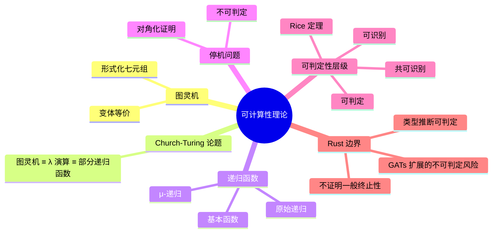

> **内容分级**: [专家级]

# 可计算性理论（Computability Theory）

> **EN**: Computability Theory
> **Summary**: Turing machines, recursive functions, the halting problem, decidability/recognizability, and the Church-Turing thesis — with Rust examples of computable and non-computable boundaries.

> **Rust 版本**: 1.97.0+ (Edition 2024)
> **Bloom 层级**: L4-L5
> **权威来源**: 本文件为 `concept/` 权威页。
> **定位**: 从图灵机、递归函数与 Church-Turing 论题出发，刻画「可计算」的形式边界，并通过 Rust 实例展示可判定性与不可判定性在语言实现中的投影。
> **前置概念**: [Concurrency](../../03_advanced/00_concurrency/01_concurrency.md) · [Lambda Calculus](../00_type_theory/05_lambda_calculus.md) · [Type Theory](../00_type_theory/01_type_theory.md)
> **后置概念**: [Mathematical Functions of Computation](04_mathematical_functions_of_computation.md) · [Formal Languages and Automata](03_formal_languages_and_automata.md) · [Equivalence of Computational Models](05_equivalence_of_computational_models.md)

---

## 📑 目录

- [可计算性理论（Computability Theory）](#可计算性理论computability-theory)
  - [📑 目录](#-目录)
  - [一、核心概念](#一核心概念)
    - [1.1 图灵机形式化](#11-图灵机形式化)
    - [1.2 Church-Turing 论题](#12-church-turing-论题)
    - [1.3 递归函数族](#13-递归函数族)
    - [1.4 停机问题](#14-停机问题)
    - [1.5 可判定 / 可识别 / 共可识别](#15-可判定--可识别--共可识别)
  - [二、Rust 视角下的可计算边界](#二rust-视角下的可计算边界)
    - [2.1 Rust 不能证明的一般递归](#21-rust-不能证明的一般递归)
    - [2.2 类型检查与类型推断的可判定性](#22-类型检查与类型推断的可判定性)
  - [三、反命题与边界分析](#三反命题与边界分析)
  - [四、相关概念](#四相关概念)
  - [五、嵌入式测验（Embedded Quiz）](#五嵌入式测验embedded-quiz)
    - [测验 1：停机问题的结论（理解层）](#测验-1停机问题的结论理解层)
    - [测验 2：可判定、可识别、共可识别的关系（应用层）](#测验-2可判定可识别共可识别的关系应用层)
    - [测验 3：Rust 对递归函数的全性（分析层）](#测验-3rust-对递归函数的全性分析层)
    - [测验 4：不可判定问题的工程处理（评价层）](#测验-4不可判定问题的工程处理评价层)
  - [六、权威来源索引](#六权威来源索引)
  - [七、🧭 思维导图（Mindmap）](#七-思维导图mindmap)

---

## 一、核心概念

### 1.1 图灵机形式化

图灵机是经典计算模型：一个有限控制器、一条无限长的磁带和一个可左右移动读写头。

```text
图灵机七元组：M = (Q, Σ, Γ, δ, q₀, q_accept, q_reject)

  Q          : 有限状态集合
  Σ          : 输入字母表（不含空白符）
  Γ          : 磁带字母表，Σ ⊂ Γ，空白符 □ ∈ Γ
  δ          : 转移函数  Q × Γ → Q × Γ × {L, R}
  q₀         : 初始状态
  q_accept   : 接受状态
  q_reject   : 拒绝状态
```

> **认知要点**：图灵机的具体定义有变体（多带、非确定性、双向无限磁带），但它们在计算能力上都是等价的。

---

### 1.2 Church-Turing 论题

**Church-Turing 论题**不是定理，而是一个经验性/哲学性论断：

> 任何「有效可计算」的函数都可以被图灵机计算，也可以被 λ 演算表达，也可以被部分递归函数定义。

```text
等价链：
  图灵机  ≡  无类型 λ 演算  ≡  部分递归函数
           ≡  通用寄存器机  ≡  通用编程语言（无资源限制）
```

---

### 1.3 递归函数族

递归函数从基本函数出发，通过组合、原始递归和最小化构造所有可计算函数：

```text
基本函数：
  零函数      : Z(x) = 0
  后继函数    : S(x) = x + 1
  投影函数    : P_i^n(x₁,...,x_n) = x_i

构造规则：
  组合        : h(x) = f(g₁(x), ..., g_k(x))
  原始递归    : f(0, x) = g(x)
                f(n+1, x) = h(n, x, f(n, x))
  极小化      : f(x) = μy. g(x, y) = 0
                （寻找使 g 为零的最小 y；若不存在则无定义）

函数族：
  原始递归函数 ⊂ μ-递归函数 = 图灵可计算函数
```

---

### 1.4 停机问题

**停机问题（Halting Problem）**是最著名的不可判定问题：不存在一个通用算法，能够对任意程序 P 和输入 I 判定 P(I) 是否会停机。

证明草图（对角化）：

```text
假设存在停机判定器 H(P, I)：
  - 若 P(I) 停机，返回 true
  - 若 P(I) 不停机，返回 false

构造程序 D(P)：
  if H(P, P) == true then loop forever
  else halt

现在问 D(D) 是否停机？
  - 若 H(D, D) = true，则 D(D) 应该停机，但 D 的定义让它死循环
  - 若 H(D, D) = false，则 D(D) 应该死循环，但 D 的定义让它停机

矛盾 ⇒ H 不存在。
```

> **认知要点**：停机问题的不可判定性意味着「自动判断任意程序是否终止」在通用图灵机上不可行。Rust 编译器不尝试证明一般递归函数的终止性。

---

### 1.5 可判定 / 可识别 / 共可识别

```text
语言 L 关于问题/集合的分类：

  可判定的（Decidable）
    └── 存在图灵机总能在有限步内接受或拒绝任意输入

  可识别的（Recognizable / Recursively Enumerable）
    └── 若 x ∈ L，图灵机最终接受；若 x ∉ L，可能拒绝或不停机

  共可识别的（Co-recognizable）
    └── 若 x ∉ L，图灵机最终拒绝；若 x ∈ L，可能接受或不停机

  关系：
    可判定 = 可识别 ∩ 共可识别
```

**Rice 定理**：任何关于程序语义的非平凡性质（如「此程序是否对所有输入返回 0」）都是不可判定的。

---

## 二、Rust 视角下的可计算边界

### 2.1 Rust 不能证明的一般递归

Rust 编译器接受下面的阶乘函数，但它并不证明它对所有输入都终止：

```rust
fn factorial(n: u64) -> u64 {
    if n == 0 { 1 } else { n * factorial(n - 1) }
}

fn main() {
    assert_eq!(factorial(5), 120);
}
```

从可计算性角度看，`factorial` 是一个全递归函数；但 Rust 的类型系统不验证其全性（totality）。验证全性需要依赖外部工具（如 `termination` 证明器）或受限制的语言子集。

### 2.2 类型检查与类型推断的可判定性

Rust 的类型检查是**可判定的**：给定完整类型标注，编译器总能在有限步内判定程序是否 well-typed。但类型推断的边界更微妙。

```rust,compile_fail
fn main() {
    // ❌ 编译错误：需要显式类型标注
    let compose = |f, g| |x| f(g(x));
    let add1 = |x: i32| x + 1;
    let mul2 = |x: i32| x * 2;
    let _h = compose(add1, mul2);
}
```

```rust
fn compose<A, B, C, F, G>(f: F, g: G) -> impl Fn(A) -> C
where
    F: Fn(B) -> C,
    G: Fn(A) -> B,
{
    move |x| f(g(x))
}

fn main() {
    let add1 = |x: i32| x + 1;
    let mul2 = |x: i32| x * 2;
    assert_eq!(compose(add1, mul2)(5), 11);
}
```

> **认知要点**：Rust 使用受限制的类型推断（基于 HM 的扩展），在工程实践中是可判定的；但加入某些扩展（如不受限的 GATs）后，类型推断可能变成不可判定问题。Rust 编译器通过递归深度限制等措施避免实际不可终止。

> **来源**: [Rust Reference — Type inference](https://doc.rust-lang.org/reference/type-inference.html) · [a-mir-formality](https://github.com/rust-lang/a-mir-formality)

---

## 三、反命题与边界分析

常见误判：**「如果一个问题是不可判定的，就无法做任何近似或实用处理」**。

这是错误的。不可判定性只排除了「对所有输入都完美判定」的通用算法，但不妨碍：

1. **实用子集可判定**：Rust 的类型推断对实际使用的子集是可判定的。
2. **部分判定器**：静态分析工具可以拒绝明显有问题的程序，同时允许无法判定的程序通过（sound but incomplete）。
3. **近似算法**：模型检测器使用有界模型检测（bounded model checking）给出近似保证。

```text
边界极限：
├── 不可判定 ≠ 不可处理
├── 工程上通常采用「安全近似」策略
├── Rust 编译器拒绝已知错误，但不保证捕获所有潜在问题
└── 可识别/共可识别语言提供「单向」保证，常用于静态分析
```

---

## 四、相关概念

- [Lambda Calculus](../00_type_theory/05_lambda_calculus.md) — λ 演算与可计算性
- [Mathematical Functions of Computation](04_mathematical_functions_of_computation.md) — 可计算函数的数学对象
- [Formal Languages and Automata](03_formal_languages_and_automata.md) — 形式语言层级
- [Decidability Spectrum](../../00_meta/00_framework/decidability_spectrum.md) — 可判定性谱系
- [Equivalence of Computational Models](05_equivalence_of_computational_models.md) — 模型等价与表达力

---

## 五、嵌入式测验（Embedded Quiz）

### 测验 1：停机问题的结论（理解层）

停机问题告诉我们什么？

- A. 所有程序最终都会停机
- B. 不存在通用算法能判定任意程序是否停机
- C. 编译器可以证明所有递归函数终止
- D. 图灵机不是通用计算模型

<details>
<summary>✅ 答案</summary>

**B. 不存在通用算法能判定任意程序是否停机**。

停机问题通过对角化证明不可判定，说明通用终止判定器不可能存在。
</details>

---

### 测验 2：可判定、可识别、共可识别的关系（应用层）

若语言 L 同时是可识别的又是共可识别的，则 L 是什么？

- A. 一定是不可判定的
- B. 一定是可判定的
- C. 一定不可识别
- D. 与可判定性无关

<details>
<summary>✅ 答案</summary>

**B. 一定是可判定的**。可判定 = 可识别 ∩ 共可识别。
</details>

---

### 测验 3：Rust 对递归函数的全性（分析层）

Rust 编译器是否会拒绝一个它无法证明终止的递归函数？

- A. 会，因为 Rust 要求所有函数都可证明终止
- B. 不会，Rust 接受一般递归但不验证其全性
- C. 仅拒绝无 `return` 的函数
- D. 仅拒绝有 panic 的函数

<details>
<summary>✅ 答案</summary>

**B. 不会，Rust 接受一般递归但不验证其全性**。Rust 的类型系统不保证终止；`const fn` 有更强限制，但普通 `fn` 允许任意递归。
</details>

---

### 测验 4：不可判定问题的工程处理（评价层）

面对不可判定问题，工程上通常采用什么策略？

- A. 放弃所有静态分析
- B. 使用安全近似：拒绝已知错误，允许不确定情况通过
- C. 等待更快的计算机解决不可判定问题
- D. 限制语言使其变成非图灵完备

<details>
<summary>✅ 答案</summary>

**B. 使用安全近似：拒绝已知错误，允许不确定情况通过**。这正是 Rust 借用检查、Clippy 和许多静态分析器的设计哲学。
</details>

---

## 六、权威来源索引

| 来源 | 可信度 | 说明 |
|:---|:---:|:---|
| [Turing 1936 — On Computable Numbers](https://doi.org/10.1112/plms/s2-42.1.230) | ✅ 一级 | 图灵机奠基 |
| [Church 1936 — An Unsolvable Problem](https://doi.org/10.2307/1968981) | ✅ 一级 | λ 可定义函数 |
| [Kleene — Introduction to Metamathematics](https://en.wikipedia.org/wiki/Introduction_to_Metamathematics) | ✅ 一级 | 递归函数论 |
| [Sipser — Introduction to the Theory of Computation](https://math.mit.edu/~sipser/book.html) | ✅ 一级 | 可计算性教材 |
| [Rust Reference — Type inference](https://doc.rust-lang.org/reference/type-inference.html) | ✅ 一级 | Rust 类型推断 |
| [a-mir-formality](https://github.com/rust-lang/a-mir-formality) | ✅ 一级 | Rust 形式化规格 |

---

## 七、🧭 思维导图（Mindmap）


