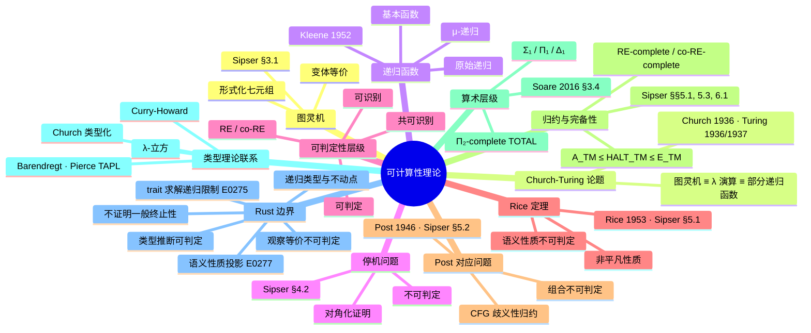

> **内容分级**: [专家级]

# 可计算性理论（Computability Theory）

> **EN**: Computability Theory
> **Summary**: Turing machines, recursive functions, the halting problem, decidability/recognizability, Rice's theorem, Post's correspondence problem, reductions, arithmetical hierarchy, and the Church-Turing thesis — with Rust examples of computable and non-computable boundaries, explicit compile_fail,E0xxx counterexamples, and citations to Sipser, HMU, Barendregt, Scott, Pierce TAPL, Felleisen, Ahmed, and Pitts.

> **Rust 版本**: 1.97.0+ (Edition 2024)
> **Bloom 层级**: L4-L5
> **权威来源**: 本文件为 `concept/` 权威页。
> **定位**: 从图灵机、递归函数与 Church-Turing 论题出发，刻画「可计算」的形式边界；补充归约与完备性、算术层级、Curry-Howard 与类型化 λ 演算视角；并通过 Rust 实例展示可判定性、不可判定性、Rice 定理、Post 对应问题、递归类型与观察等价在语言实现中的投影。
> **前置概念**: [Concurrency](../../03_advanced/00_concurrency/01_concurrency.md) · [Lambda Calculus](../00_type_theory/05_lambda_calculus.md) · [Type Theory](../00_type_theory/01_type_theory.md) · [Type Checking and Inference](../00_type_theory/07_type_checking_and_inference.md)
> **后置概念**: [Mathematical Functions of Computation](04_mathematical_functions_of_computation.md) · [Formal Languages and Automata](03_formal_languages_and_automata.md) · [Equivalence of Computational Models](05_equivalence_of_computational_models.md) · [Observational Equivalence](../03_operational_semantics/06_observational_equivalence.md)

---

## 📑 目录

- [可计算性理论（Computability Theory）](#可计算性理论computability-theory)
  - [📑 目录](#-目录)
  - [一、核心概念](#一核心概念)
    - [1.1 图灵机形式化](#11-图灵机形式化)
    - [1.2 Church-Turing 论题](#12-church-turing-论题)
    - [1.3 递归函数族](#13-递归函数族)
    - [1.4 停机问题](#14-停机问题)
    - [1.5 可判定 / 可识别 / 共可识别](#15-可判定--可识别--共可识别)
    - [1.6 Rice 定理：语义性质的不可判定性](#16-rice-定理语义性质的不可判定性)
    - [1.7 递归可枚举集合与共递归可枚举集合](#17-递归可枚举集合与共递归可枚举集合)
    - [1.8 Post 对应问题](#18-post-对应问题)
    - [1.9 归约、完备性与算术层级](#19-归约完备性与算术层级)
    - [1.10 可计算性与类型理论：Curry-Howard 与 Church 类型化](#110-可计算性与类型理论curry-howard-与-church-类型化)
  - [二、Rust 视角下的可计算边界](#二rust-视角下的可计算边界)
    - [2.1 Rust 不能证明的一般递归](#21-rust-不能证明的一般递归)
    - [2.2 类型检查与类型推断的可判定性](#22-类型检查与类型推断的可判定性)
    - [2.3 Rust 类型系统不可判定性投影：trait 求解与 monomorphization 边界](#23-rust-类型系统不可判定性投影trait-求解与-monomorphization-边界)
      - [trait 求解的复杂度投影](#trait-求解的复杂度投影)
      - [monomorphization 边界](#monomorphization-边界)
      - [不可判定边界的 `compile_fail` 反例](#不可判定边界的-compile_fail-反例)
    - [2.4 递归类型与不动点：Y 组合子的 Rust 投影](#24-递归类型与不动点y-组合子的-rust-投影)
    - [2.5 观察等价与语义性质不可判定](#25-观察等价与语义性质不可判定)
  - [三、反命题与边界分析](#三反命题与边界分析)
  - [四、相关概念](#四相关概念)
  - [五、嵌入式测验（Embedded Quiz）](#五嵌入式测验embedded-quiz)
    - [测验 1：停机问题的结论（理解层）](#测验-1停机问题的结论理解层)
    - [测验 2：可判定、可识别、共可识别的关系（应用层）](#测验-2可判定可识别共可识别的关系应用层)
    - [测验 3：Rice 定理的适用范围（分析层）](#测验-3rice-定理的适用范围分析层)
    - [测验 4：Rust 对递归函数的全性（分析层）](#测验-4rust-对递归函数的全性分析层)
    - [测验 5：不可判定问题的工程处理（评价层）](#测验-5不可判定问题的工程处理评价层)
    - [测验 6：归约、算术层级与 Rust 投影（综合层）](#测验-6归约算术层级与-rust-投影综合层)
  - [六、权威来源 / International Authority References](#六权威来源--international-authority-references)
  - [七、🧭 思维导图（Mindmap）](#七-思维导图mindmap)

---

## 一、核心概念

### 1.1 图灵机形式化

图灵机是经典计算模型：一个有限控制器、一条无限长的磁带和一个可左右移动读写头。Sipser 给出的七元组定义是当代教材标准表述（Sipser, 2012, §3.1, pp. 165–170）：

```text
图灵机七元组：M = (Q, Σ, Γ, δ, q₀, q_accept, q_reject)

  Q          : 有限状态集合
  Σ          : 输入字母表（不含空白符）
  Γ          : 磁带字母表，Σ ⊂ Γ，空白符 □ ∈ Γ
  δ          : 转移函数  Q × Γ → Q × Γ × {L, R}
  q₀         : 初始状态
  q_accept   : 接受状态
  q_reject   : 拒绝状态
```

> **认知要点**：图灵机的具体定义有变体（多带、非确定性、双向无限磁带），但它们在计算能力上都是等价的。Hopcroft, Motwani & Ullman 在 §8 中系统证明了这些变体与标准图灵机的等价性（Hopcroft, Motwani & Ullman, 2006, §8.3–§8.5）。

Turing 原始论文将「可计算数」定义为可被自动机（automatic machine）写出的小数序列；现代教材通常把「图灵可计算」等同于「存在图灵机在其带上以标准格局停机并输出结果」（Turing, 1936, §1–§2; Sipser, 2012, §3.1）。

---

### 1.2 Church-Turing 论题

**Church-Turing 论题**不是定理，而是一个经验性/哲学性论断：

> 任何「有效可计算」的函数都可以被图灵机计算，也可以被 λ 演算表达，也可以被部分递归函数定义。

```text
等价链：
  图灵机  ≡  无类型 λ 演算  ≡  部分递归函数
           ≡  通用寄存器机  ≡  通用编程语言（无资源限制）
```

Church 通过 λ 可定义函数给出了可计算性的第一条形式化道路（Church, 1936）；Turing 随后证明 λ 可定义函数与图灵机可计算函数类重合（Turing, 1937）。Barendregt 将这一等价链表述为「可计算性三大模型」的汇聚点（Barendregt, 1984, §6.3; Barendregt, 1997, §2）。

> **来源**: [Church 1936 — An Unsolvable Problem](https://doi.org/10.2307/1968981) · [Turing 1936 — On Computable Numbers](https://doi.org/10.1112/plms/s2-42.1.230) · [Turing 1937 — Computability and λ-definability](https://doi.org/10.1112/jlms/s1-12.45.243) · [Barendregt 1984 — The Lambda Calculus](https://doi.org/10.1016/B978-0-444-87508-2.50006-X)

---

### 1.3 递归函数族

递归函数从基本函数出发，通过组合、原始递归和最小化构造所有可计算函数。Kleene 在 *Introduction to Metamathematics* 中建立了这一函数族的严格定义（Kleene, 1952, §§57–60）：

```text
基本函数：
  零函数      : Z(x) = 0
  后继函数    : S(x) = x + 1
  投影函数    : P_i^n(x₁,...,x_n) = x_i

构造规则：
  组合        : h(x) = f(g₁(x), ..., g_k(x))
  原始递归    : f(0, x) = g(x)
                f(n+1, x) = h(n, x, f(n, x))
  极小化      : f(x) = μy. g(x, y) = 0
                （寻找使 g 为零的最小 y；若不存在则无定义）

函数族：
  原始递归函数 ⊂ μ-递归函数 = 图灵可计算函数
```

极小化（μ-operator）是引入部分性的关键：当搜索不终止时，函数值无定义。Sipser 在 §4.1 中将 μ-递归函数与图灵可计算函数的等价性作为 Church-Turing 论题的形式化支柱之一（Sipser, 2012, §4.1, pp. 181–186）。

> **来源**: [Kleene 1952 — Introduction to Metamathematics](https://en.wikipedia.org/wiki/Introduction_to_Metamathematics) · [Sipser 2012 — §4.1](https://math.mit.edu/~sipser/book.html)

---

### 1.4 停机问题

**停机问题（Halting Problem）**是最著名的不可判定问题：不存在一个通用算法，能够对任意程序 P 和输入 I 判定 P(I) 是否会停机。

证明草图（对角化）：

```text
假设存在停机判定器 H(P, I)：
  - 若 P(I) 停机，返回 true
  - 若 P(I) 不停机，返回 false

构造程序 D(P)：
  if H(P, P) == true then loop forever
  else halt

现在问 D(D) 是否停机？
  - 若 H(D, D) = true，则 D(D) 应该停机，但 D 的定义让它死循环
  - 若 H(D, D) = false，则 D(D) 应该死循环，但 D 的定义让它停机

矛盾 ⇒ H 不存在。
```

Sipser 将这一证明作为图灵机不可判定性的入门定理，并指出 A_TM = {⟨M,w⟩ | M 接受 w} 是 RE-complete 但不可判定（Sipser, 2012, §4.2, pp. 194–201）。Hopcroft, Motwani & Ullman 在 §8 使用递归函数语言给出了停机问题的等价表述（Hopcroft, Motwani & Ullman, 2006, §8.1）。

> **认知要点**：停机问题的不可判定性意味着「自动判断任意程序是否终止」在通用图灵机上不可行。Rust 编译器不尝试证明一般递归函数的终止性。
>
> **来源**: [Turing 1936 — On Computable Numbers](https://doi.org/10.1112/plms/s2-42.1.230) · [Sipser 2012 — §4.2](https://math.mit.edu/~sipser/book.html)

---

### 1.5 可判定 / 可识别 / 共可识别

```text
语言 L 关于问题/集合的分类：

  可判定的（Decidable）
    └── 存在图灵机总能在有限步内接受或拒绝任意输入

  可识别的（Recognizable / Recursively Enumerable）
    └── 若 x ∈ L，图灵机最终接受；若 x ∉ L，可能拒绝或不停机

  共可识别的（Co-recognizable）
    └── 若 x ∉ L，图灵机最终拒绝；若 x ∈ L，可能接受或不停机

  关系：
    可判定 = 可识别 ∩ 共可识别
```

Sipser 用「判定器」（decider）与「识别器」（recognizer）的区分来刻画这一层级，并证明：一个语言可判定当且仅当它同时是 RE 与 co-RE（Sipser, 2012, §4.1, pp. 181–194）。Hopcroft, Motwani & Ullman 在 §9.1 进一步讨论了递归语言与递归可枚举语言之间的包含关系及其对形式语言的推论（Hopcroft, Motwani & Ullman, 2006, §9.1）。

**Rice 定理**：任何关于程序语义的非平凡性质（如「此程序是否对所有输入返回 0」）都是不可判定的。详见 1.6。

> **来源**: [Sipser 2012 — §§4.1–4.2](https://math.mit.edu/~sipser/book.html) · [Hopcroft, Motwani & Ullman 2006 — §9.1](https://en.wikipedia.org/wiki/Introduction_to_Automata_Theory,_Languages,_and_Computation)

---

### 1.6 Rice 定理：语义性质的不可判定性

**Rice 定理**（Rice, 1953）是可计算性理论中关于程序语义性质的基本限制定理。它指出：任何关于程序「计算什么函数」的非平凡性质都是不可判定的。

> **教学类比（Rice 定理）**
>
> 设 P 是图灵可计算函数的一个性质，且 P 是非平凡的（即至少存在一个函数满足 P，也至少存在一个函数不满足 P），并且 P 只依赖于函数的输入-输出行为（语义），则判定「给定图灵机是否计算满足 P 的函数」是不可判定的。

形式化表述：设 ℱ 是所有部分可计算函数的集合，S ⊆ ℱ 是一个非空且非全体的函数集合。则语言
$$
L_S = \{ \langle M \rangle \mid M\text{ 计算的函数 } f_M \in S \}
$$
是不可判定的。若进一步 S 满足某些闭包条件，则 L_S 要么是 RE-complete，要么 co-RE-complete，要么既非 RE 也非 co-RE（Rice, 1953; Sipser, 2012, §5.1, pp. 217–221）。

```text
Rice 定理的推论（不可判定的语义问题）：
├── 这个程序是否对所有输入都停机？
├── 这个程序是否对所有输入返回 0？
├── 这个程序是否与另一个程序语义等价？
├── 这个程序是否会被某个输入触发 panic？
└── 这个程序是否具有某种优化后的行为？
```

> **关键区分**：Rice 定理说的是「语义性质」不可判定；纯语法性质（如「程序是否包含 `unsafe` 块」）通常是可判定的。编译器擅长语法/类型检查，但无法判断任意函数的最终语义行为。
>
> **来源**: [Rice 1953 — Classes of Recursively Enumerable Sets](https://doi.org/10.1090/S0002-9904-1953-09692-2) · [Sipser 2012 — §5.1, pp. 217–221](https://math.mit.edu/~sipser/book.html) · [Hopcroft, Motwani & Ullman 2006 — §9.3](https://en.wikipedia.org/wiki/Introduction_to_Automata_Theory,_Languages,_and_Computation) · [Soare 1987 — Recursively Enumerable Sets and Degrees, Ch. IV](https://doi.org/10.1007/978-3-662-21917-0)

---

### 1.7 递归可枚举集合与共递归可枚举集合

**递归可枚举集合（Recursively Enumerable, RE）**与**共递归可枚举集合（co-RE）**是停机问题之后最重要的可判定性分类。

```text
形式化定义：

  RE 集合：
    语言 L 是 RE 的，当且仅当存在图灵机 M，使得
    L = { x | M(x) 在有限步内接受 }
    （对 x ∉ L，M 可能拒绝或不停机）

  co-RE 集合：
    语言 L 是 co-RE 的，当且仅当它的补集 L̄ 是 RE 的
    （对 x ∉ L，M 必在有限步内拒绝；对 x ∈ L，可能接受或不停机）

  可判定集合：
    L 是可判定的  ⇔  L ∈ RE 且 L ∈ co-RE
```

经典例子：

| 语言 | 类别 | 说明 |
|:---|:---|:---|
| A_TM = {⟨M,w⟩ \| M 接受 w} | RE-complete | 停机问题的接受版本，不是 co-RE |
| A_TM 的补集 | co-RE | 不是 RE |
| E_TM = {⟨M⟩ \| L(M) = ∅} | co-RE-complete | 空语言问题是 co-RE-complete |
| TOTAL = {⟨M⟩ \| M 在所有输入上停机} | 既非 RE 也非 co-RE | Π₂-完全，超出 RE/co-RE 层级 |
| REGULAR_TM = {⟨M⟩ \| L(M) 是正则语言} | 既非 RE 也非 co-RE | Rice 定理只能推出不可判定，更精细分类需要额外证明 |

```text
可判定性层级（算术层级的一小部分）：

  可判定 ⊂ RE ⊂ 算术层级
  可判定 ⊂ co-RE ⊂ 算术层级
  RE ∪ co-RE ⊂ 既非 RE 也非 co-RE 的问题集合
```

Soare 在 2016 年的现代教材中强调，RE/co-RE 分类不仅是理论工具，更是理解「部分算法」与「近似判定」的框架（Soare, 2016, §§1.4–1.5, §3.4）。Scott 的域理论则为「部分性」提供了指称语义模型：非终止对应于域底元 ⊥，使得部分函数可以被解释为连续函数（Scott, 1976, §2）。

> **认知要点**：RE/co-RE 分类解释了为什么某些问题可以「半自动」处理。静态分析器通常是 sound but incomplete：若程序有问题可能报告，但若无法判定则允许通过——这正是 RE 性质的工程对应物。
>
> **来源**: [Soare 1987 — Recursively Enumerable Sets and Degrees](https://doi.org/10.1007/978-3-662-21917-0) · [Soare 2016 — Turing Computability. Theory and Applications, §§1.4–1.5, §3.4](https://doi.org/10.1007/978-3-642-31933-4) · [Sipser 2012 — §§4.1–4.2](https://math.mit.edu/~sipser/book.html) · [Scott 1976 — Data types as lattices](https://doi.org/10.1137/0205037)

---

### 1.8 Post 对应问题

**Post 对应问题（Post Correspondence Problem, PCP）**由 Emil Post 于 1946 年提出，是理论计算机科学中最重要的「中间」不可判定问题之一。它的价值在于：PCP 的表述非常组合化，便于归约到文法、平铺、协议验证等问题。

> **定义（PCP）**
>
> 给定一个有限的骨牌集合，每块骨牌上半部为字符串 `u_i`，下半部为字符串 `v_i`（两者来自同一字母表 Σ）。问：是否存在一个骨牌序列 `i₁, i₂, ..., i_k`（允许重复），使得拼接后的上半部等于拼接后的下半部：
> $$
> u_{i_1} u_{i_2} \cdots u_{i_k} = v_{i_1} v_{i_2} \cdots v_{i_k}
> $$

```text
PCP 实例示例：

  骨牌 1: [ a / ab ]
  骨牌 2: [ b / a  ]
  骨牌 3: [ ab / b ]

  是否存在序列使得上下字符串相等？
  例如序列 2, 1, 3：
    上: b + a  + ab = bab
    下: a + ab + b  = bab
  因此这是一个「是」实例。
```

**不可判定性**：PCP 是不可判定的。标准证明从 A_TM（或停机问题）通过图灵机计算历史（computation history）归约到 PCP。直观上，骨牌序列可以编码图灵机从初始格局到接受格局的完整计算历史，因此若能判定任意 PCP 实例，就能判定停机问题（Sipser, 2012, §5.2, pp. 227–233; Hopcroft, Motwani & Ullman, 2006, §9.4）。

```text
PCP 的工程意义：
├── CFG 歧义性：判定一个 CFG 是否歧义是不可判定的（可归约自 PCP）
├── 协议/字符串重写：许多字符串方程的可解性问题可归约到 PCP
├── 类型系统与约束：某些复杂约束的可满足性问题可用 PCP 风格证明不可判定
└── 形式验证：PCP 是「局部匹配规则导致全局不可判定」的典型范例
```

> **来源**: [Post 1946 — A variant of a recursively unsolvable problem](https://doi.org/10.1090/S0002-9904-1946-08555-9) · [Sipser 2012 — §5.2, pp. 227–233](https://math.mit.edu/~sipser/book.html) · [Hopcroft, Motwani & Ullman 2006 — §9.4](https://en.wikipedia.org/wiki/Introduction_to_Automata_Theory,_Languages,_and_Computation)

---

### 1.9 归约、完备性与算术层级

**归约（Reduction）** 是证明不可判定性的核心技术：若问题 A 可归约到问题 B（记作 A ≤_m B），则 B 至少与 A 一样难。Sipser 用归约证明 HALT_TM、E_TM、EQ_TM 等问题的不可判定性（Sipser, 2012, §5.1, pp. 217–227; §5.3, pp. 235–241）。

```text
常见归约链：

  A_TM ≤_m HALT_TM ≤_m E_TM 的补
  A_TM ≤_m PCP ≤_m CFG-AMBIGUITY
```

**完备性（Completeness）**：若语言 L 属于类 C，且 C 中任意语言都可归约到 L，则称 L 是 C-完备的。A_TM 是 RE-complete，E_TM 是 co-RE-complete（Sipser, 2012, §6.1, pp. 255–259）。

**算术层级（Arithmetical Hierarchy）**：将语言按量词交替深度分类：

```text
  Σ₁ : ∃ 量词前缀（可被 RE 识别）
  Π₁ : ∀ 量词前缀（可被 co-RE 识别）
  Δ₁ : Σ₁ ∩ Π₁ = 可判定

  Σ₂ : ∃∀ 量词前缀
  Π₂ : ∀∃ 量词前缀
  ...
```

TOTAL = {⟨M⟩ | M 在所有输入上停机} 是 Π₂-完全的，因此既非 RE 也非 co-RE。这一层级由 Kleene 与 Mostowski 在 20 世纪 40 年代建立，Soare 给出了现代处理（Soare, 2016, §3.4）。Scott 的域理论则为这些层级提供了语义直觉：越深的层级对应越复杂的「近似-极限」构造（Scott, 1976, §3）。

> **认知要点**：归约不仅是理论工具，也是工程上判断「某静态分析问题能否完全自动化」的思维方式。若某问题可归约到停机问题，则精确判定它是不可行的。
>
> **来源**: [Sipser 2012 — §§5.1, 5.3, 6.1](https://math.mit.edu/~sipser/book.html) · [Hopcroft, Motwani & Ullman 2006 — §§9.2–9.4](https://en.wikipedia.org/wiki/Introduction_to_Automata_Theory,_Languages,_and_Computation) · [Soare 2016 — §3.4](https://doi.org/10.1007/978-3-642-31933-4) · [Scott 1976 — §3](https://doi.org/10.1137/0205037)

---

### 1.10 可计算性与类型理论：Curry-Howard 与 Church 类型化

**Curry-Howard 对应**把命题与类型、证明与程序联系起来：一个类型 τ 对应一个命题，一个项 e : τ 对应该命题的一个证明（Girard, Taylor & Lafont, 1989; Pierce, 2002, Ch. 9, pp. 107–120）。在这一视角下，可计算函数不仅是机器执行的对象，也是逻辑证明的载体。

```text
Curry-Howard 对应（简化版）：

  命题          类型
  A → B         A → B
  A ∧ B         (A, B)
  A ∨ B         Either A B
  ∀x.P(x)       Π 类型 / 泛型
  ∃x.P(x)       Σ 类型 / 依赖对
```

Church 的类型化 λ 演算（简单类型 λ 演算，STLC）是可判定的：类型检查与类型推断都是完全自动的（Church, 1940; Pierce, 2002, Ch. 9）。然而，一旦加入递归类型、多态或依赖类型，可判定性边界迅速移动：

- **简单类型 λ 演算**：类型检查可判定（Pierce, 2002, Ch. 9）。
- **System F（多态 λ 演算）**：类型推断不可判定，类型检查可判定（Wells, 1994; Pierce, 2002, Ch. 23）。
- **依赖类型（如 Martin-Löf 类型论）**：类型检查可能要求证明辅助，不再是纯算法问题（Martin-Löf, 1984; Barendregt, 1992, §5）。

Barendregt 的 λ 立方（λ-cube）把这三种扩展（多态、依赖、类型算子）统一为一个维度框架，说明类型系统表达能力与可判定性之间的张力（Barendregt, 1992, §5; Barendregt, 1997）。

> **认知要点**：Curry-Howard 对应解释了为什么 Rust 的泛型、trait bound 与生命周期可以被看作「可计算证明」的片段；同时也解释了为什么某些类型系统扩展会跨越可判定性边界。
>
> **来源**: [Church 1940 — A Formulation of the Simple Theory of Types](https://doi.org/10.2307/2266170) · [Barendregt 1992 — Lambda Calculi with Types](https://doi.org/10.1016/B978-0-444-88074-1.50018-9) · [Barendregt 1997 — The Impact of the Lambda Calculus](https://doi.org/10.1093/logcom/7.2.181) · [Pierce 2002 — TAPL, Ch. 9](https://www.cis.upenn.edu/~bcpierce/tapl/) · [Girard, Taylor & Lafont 1989 — Proofs and Types](https://www.paultaylor.eu/stable/Proofs+Types.html)

---

## 二、Rust 视角下的可计算边界

### 2.1 Rust 不能证明的一般递归

Rust 编译器接受下面的阶乘函数，但它并不证明它对所有输入都终止：

```rust
fn factorial(n: u64) -> u64 {
    if n == 0 { 1 } else { n * factorial(n - 1) }
}

fn main() {
    assert_eq!(factorial(5), 120);
}
```

从可计算性角度看，`factorial` 是一个全递归函数；但 Rust 的类型系统不验证其全性（totality）。验证全性需要依赖外部工具（如 `termination` 证明器）或受限制的语言子集。

Rust 的 `const fn` 子集要求编译期终止，无界递归或溢出会触发 `E0080`——这是 Church-Turing 论题在工程语言中的显式截断：

```rust,compile_fail,E0080
const fn unbounded_search() -> u32 {
    unbounded_search() // ERROR E0080: 常量求值无法终止
}

const X: u32 = unbounded_search();

fn main() {}
```

下面的示例用 Rust 模拟 μ-递归中的**无界极小化**：

```rust
/// 寻找最小的 y 使得 f(y) 为真；若不存在则无限循环（对应部分函数的无定义）。
fn mu_minimize(f: impl Fn(u64) -> bool) -> Option<u64> {
    let mut y = 0;
    loop {
        if f(y) {
            return Some(y);
        }
        y += 1;
    }
}

fn main() {
    // μy. y * y >= 25
    let sqrt_ceil = mu_minimize(|y| y * y >= 25);
    assert_eq!(sqrt_ceil, Some(5));

    // μy. y > 10 也成立，说明极小化可以表达任何可计算搜索
    let above_ten = mu_minimize(|y| y > 10);
    assert_eq!(above_ten, Some(11));
}
```

> **认知要点**：`mu_minimize` 展示了 μ-算子的 Rust 投影：它可能停机（当谓词最终成立），也可能发散（当谓词永远不成立）。Rust 编译器接受这种一般递归，但不保证其终止。
>
> **来源**: [Sipser 2012 — §4.1](https://math.mit.edu/~sipser/book.html) · [Barendregt 1984 — §6.3](https://doi.org/10.1016/B978-0-444-87508-2.50006-X)

---

### 2.2 类型检查与类型推断的可判定性

Rust 的类型检查是**可判定的**：给定完整类型标注，编译器总能在有限步内判定程序是否 well-typed。但类型推断的边界更微妙。

```rust,compile_fail,E0282
fn main() {
    // ❌ 编译错误 E0282：无法推断 Vec 的元素类型
    let v = Vec::new();
    let _ = v;
}
```

加上显式类型标注后即可编译：

```rust
fn main() {
    let v: Vec<i32> = Vec::new();
    assert!(v.is_empty());
}
```

高阶函数的闭包组合展示了 HM（Hindley-Milner）风格的类型推断能力：

```rust,compile_fail,E0282
fn main() {
    // ❌ 编译错误 E0282：闭包参数类型无法从上下文推断
    let compose = |f, g| |x| f(g(x));
    let add1 = |x: i32| x + 1;
    let mul2 = |x: i32| x * 2;
    let _h = compose(add1, mul2);
}
```

显式泛型化后：

```rust
fn compose<A, B, C, F, G>(f: F, g: G) -> impl Fn(A) -> C
where
    F: Fn(B) -> C,
    G: Fn(A) -> B,
{
    move |x| f(g(x))
}

fn main() {
    let add1 = |x: i32| x + 1;
    let mul2 = |x: i32| x * 2;
    assert_eq!(compose(add1, mul2)(5), 11);
}
```

> **认知要点**：Rust 使用受限制的类型推断（基于 HM 的扩展），在工程实践中是可判定的；但加入某些扩展（如不受限的 GATs）后，类型推断可能变成不可判定问题。Rust 编译器通过递归深度限制等措施避免实际不可终止。
>
> **来源**: [Rust Reference — Type inference](https://doc.rust-lang.org/reference/type-inference.html) · [Pierce 2002 — TAPL, Ch. 22](https://www.cis.upenn.edu/~bcpierce/tapl/) · [a-mir-formality](https://github.com/rust-lang/a-mir-formality)

---

### 2.3 Rust 类型系统不可判定性投影：trait 求解与 monomorphization 边界

Rust 的类型系统在实践中被设计为可判定的，但其核心机制（trait 求解、关联类型、泛型 monomorphization）与可计算性理论的不可判定边界存在深刻联系。

#### trait 求解的复杂度投影

Rust 的 trait solver 本质上是在一个受限的逻辑程序中证明目标。类似 Haskell 的类型类，trait 约束满足问题在一般情况下是不可判定的；Rust 通过以下工程约束保证实际可终止：

1. **孤儿规则（orphan rules）**：限制 impl 的声明位置，减少搜索空间；
2. **递归深度限制**：避免无限递归的 trait bound；
3. **关联类型的确定性投影**：GATs 必须满足 well-formedness 条件。

下面的 compilable 示例展示了一个**有限深度**的 trait 求解链：

```rust
trait Transform<Input> {
    type Output;
    fn transform(&self, input: Input) -> Self::Output;
}

struct AddOne;
impl Transform<i32> for AddOne {
    type Output = i32;
    fn transform(&self, input: i32) -> i32 { input + 1 }
}

struct MulTwo;
impl Transform<i32> for MulTwo {
    type Output = i32;
    fn transform(&self, input: i32) -> i32 { input * 2 }
}

struct Chain<F, G>(F, G);

impl<A, B, C, F, G> Transform<A> for Chain<F, G>
where
    F: Transform<A, Output = B>,
    G: Transform<B, Output = C>,
{
    type Output = C;
    fn transform(&self, input: A) -> C {
        self.1.transform(self.0.transform(input))
    }
}

fn chain<A, B, C, F, G>(f: F, g: G) -> Chain<F, G>
where
    F: Transform<A, Output = B>,
    G: Transform<B, Output = C>,
{
    Chain(f, g)
}

fn main() {
    let pipeline = chain(AddOne, MulTwo);
    assert_eq!(pipeline.transform(3), 8); // (3 + 1) * 2
}
```

> 这个例子能编译，是因为 trait bound 的依赖图是一个有向无环图（DAG）。若允许无限制的递归约束，求解就可能进入不可判定区域。

#### monomorphization 边界

Rust 的泛型通过**单态化（monomorphization）**实现零成本抽象：编译器为每个具体类型参数生成一份专用代码。这意味着：

- **可判定性**：单态化在「具体调用图有限」时是可判定的；
- **边界风险**：若泛型函数能递归地产生无限多个类型实例，单态化将不终止。

下面的例子展示了合法的单态化边界——两个具体类型各产生一份实例：

```rust
fn generic_id<T>(x: T) -> T { x }

fn main() {
    let a = generic_id(42i32);
    let b = generic_id("Rust");
    assert_eq!(a, 42);
    assert_eq!(b, "Rust");
}
```

> 编译后，`generic_id::<i32>` 与 `generic_id::<&str>` 是两份独立代码。若类型参数能在编译期递归展开出无限序列（例如 `T` 依赖于 `Vec<T>` 且调用链无界），单态化就会碰到停机问题的投影。

#### 不可判定边界的 `compile_fail` 反例

下面的代码触发了 `E0275`（overflow evaluating the requirement），直接展示了 trait 求解在递归约束下的不可判定风险：

```rust,compile_fail,E0275
trait Foo {}
impl<T> Foo for T where T: Foo {}

fn require_foo<T: Foo>() {}

fn main() {
    require_foo::<i32>();
}
```

错误原因：`i32: Foo` 要求 `i32: Foo`，形成无限递归。Rust 编译器通过递归深度限制检测并拒绝此类约束，但这也说明：在不受限的 trait 系统中，求解约束等价于证明一个可能不终止的命题。

下面的 `E0277` 反例展示「语义性质」如何通过 trait bound 不可满足来投影：

```rust,compile_fail,E0277
fn duplicate<T: Clone>(x: T) -> (T, T) {
    (x.clone(), x)
}

fn main() {
    // std::fs::File 未实现 Clone，因此「复制文件句柄」这一语义操作不可行
    let _ = duplicate(std::fs::File::open("/dev/null").unwrap());
}
```

错误 `E0277` 说明：即使程序员知道「复制文件描述符」在 OS 层可能可行，Rust 的类型系统把 `Clone` 作为一个可判定的语法/类型性质来处理；而「这个类型是否安全可克隆」的语义判定若泛化到任意程序，则进入 Rice 定理区域。

> **认知要点**：Rust 的类型系统不是「任意强大」的；它通过语法限制（orphan rules、递归深度、GAT well-formedness）在工程可判定性与表达力之间取得平衡。理解这些限制，有助于解释为什么某些「显然正确」的泛型代码会被编译器拒绝。
>
> **来源**: [Rust Reference — Type inference](https://doc.rust-lang.org/reference/type-inference.html) · [Rust Reference — Traits](https://doc.rust-lang.org/reference/items/traits.html) · [a-mir-formality](https://github.com/rust-lang/a-mir-formality) · [Pierce 2002 — TAPL, Ch. 23](https://www.cis.upenn.edu/~bcpierce/tapl/) · [Dreyer, Ahmed & Birkedal 2009 — Logical Step-Indexed Logical Relations](https://doi.org/10.2168/LMCS-7(2:16)2011)

---

### 2.4 递归类型与不动点：Y 组合子的 Rust 投影

递归类型允许类型指涉自身，是不动点语义在编程语言中的直接投影。Scott 的域理论为递归类型提供了数学基础：递归类型方程 `τ ≅ F(τ)` 的解被解释为连续函子的最小不动点（Scott, 1976, §2）。

下面的 Rust 示例定义了一个简单的递归列表类型，并展示结构递归：

```rust
#[derive(Debug, PartialEq)]
enum List<T> {
    Nil,
    Cons(T, Box<List<T>>),
}

fn sum(l: &List<i32>) -> i32 {
    match l {
        List::Nil => 0,
        List::Cons(h, t) => h + sum(t),
    }
}

fn main() {
    let list = List::Cons(1, Box::new(List::Cons(2, Box::new(List::Cons(3, Box::new(List::Nil))))));
    assert_eq!(sum(&list), 6);
}
```

> **认知要点**：Rust 的 `enum` 与 `Box` 组合可以表达任意递归数据类型。编译器接受结构递归，但不证明其终止；这与 μ-递归函数的全性判定属于同一不可判定边界。

无类型 λ 演算中的 **Y 组合子** `Y = λf.(λx.f (x x)) (λx.f (x x))` 允许定义递归函数而不需要显式自引用。在 Rust 中，我们可以通过高阶闭包模拟这一模式（受类型系统限制，无法直接表达无类型 Y，但可展示不动点迭代思想）：

```rust
use std::cell::RefCell;
use std::rc::Rc;

/// 用显式引用单元（Rc<RefCell>）打破自引用，模拟不动点组合子。
fn fix<A, F>(f: F) -> Box<dyn Fn(A) -> A>
where
    A: 'static,
    F: Fn(&dyn Fn(A) -> A, A) -> A + 'static,
{
    let slot: Rc<RefCell<Option<Rc<dyn Fn(A) -> A>>>> = Rc::new(RefCell::new(None));
    let slot2 = slot.clone();

    let g: Rc<dyn Fn(A) -> A> = Rc::new(move |x: A| {
        let h = slot2.borrow().clone().unwrap();
        f(&*h, x)
    });

    *slot.borrow_mut() = Some(g.clone());
    Box::new(move |x: A| g(x))
}

fn main() {
    // 用不动点定义阶乘
    let fact = |rec: &dyn Fn(u64) -> u64, n: u64| -> u64 {
        if n == 0 { 1 } else { n * rec(n - 1) }
    };
    let factorial = fix(fact);
    assert_eq!(factorial(5), 120);
}
```

> **认知要点**：这个例子展示了不动点组合子如何在有类型语言中被近似表达。Barendregt 指出，无类型 λ 演算中的 Y 组合子是「自应用」与「递归定义」的核心；在类型化语言中，递归必须通过显式 `enum`/`fn` 或受控的 trait bound 引入，否则类型系统会拒绝（Barendregt, 1984, §6.5）。
>
> **来源**: [Barendregt 1984 — §6.5](https://doi.org/10.1016/B978-0-444-87508-2.50006-X) · [Scott 1976 — §2](https://doi.org/10.1137/0205037) · [Pierce 2002 — TAPL, Ch. 20](https://www.cis.upenn.edu/~bcpierce/tapl/)

---

### 2.5 观察等价与语义性质不可判定

**观察等价性**是指两个程序片段在所有合法外部上下文中无法区分。它在 Rust 中的典型应用包括：编译器优化合法性、safe API 与内部 unsafe 实现的等价性、以及 unsafe 抽象契约。详见 [观察等价性](../03_operational_semantics/06_observational_equivalence.md) 权威页。

Rice 定理直接意味着：**精确判定两个任意 Rust 程序是否观察等价是不可判定的**。因为「与某个给定程序观察等价」本身就是一个非平凡的语义性质。

下面的例子展示两个纯函数在返回值上观察等价，但在资源消耗层面可区分：

```rust
fn by_add(x: i32) -> i32 { x + x }
fn by_shift(x: i32) -> i32 { x << 1 }

fn main() {
    for x in 0..10 {
        assert_eq!(by_add(x), by_shift(x));
    }
}
```

在只观察 `i32` 返回值的上下文中，`by_add` 与 `by_shift` 观察等价；但若上下文能读取 CPU 周期计数或汇编指令，则二者可能不等价。这说明**观察等价性相对于允许的观察手段定义**（Pierce, 2002, Ch. 8, §8.2; Pitts, 1997）。

Ahmed 的 step-indexed logical relations 为证明高阶状态化语言中的观察等价提供了归纳方法：通过按类型结构归纳定义等价，并以剩余步数索引处理非终止，可以把「穷举所有上下文」转化为可处理的证明任务（Ahmed, 2006）。RustBelt 正是用这一框架证明 safe API 与 unsafe 实现在所有合法 safe 上下文下观察等价（Jung et al., 2018）。

> **认知要点**：观察等价是连接可计算性理论与 Rust 工程的关键概念。Rice 定理说明它不可精确判定，因此编译器优化、unsafe 抽象验证都采用安全近似或逻辑关系证明，而非穷举所有上下文。
>
> **来源**: [Pierce 2002 — TAPL, Ch. 8](https://www.cis.upenn.edu/~bcpierce/tapl/) · [Pitts 1997 — Operationally-based theories of program equivalence](https://www.cl.cam.ac.uk/~amp12/papers/index.html) · [Ahmed 2006 — Step-indexed syntactic logical relations](https://doi.org/10.1007/11693024_6) · [Jung et al. 2018 — RustBelt](https://plv.mpi-sws.org/rustbelt/)

---

## 三、反命题与边界分析

常见误判：**「如果一个问题是不可判定的，就无法做任何近似或实用处理」**。

这是错误的。不可判定性只排除了「对所有输入都完美判定」的通用算法，但不妨碍：

1. **实用子集可判定**：Rust 的类型推断对实际使用的子集是可判定的。
2. **部分判定器**：静态分析工具可以拒绝明显有问题的程序，同时允许无法判定的程序通过（sound but incomplete）。
3. **近似算法**：模型检测器使用有界模型检测（bounded model checking）给出近似保证。
4. **Rice 定理的限制**：它只针对语义性质；语法性质、类型性质通常仍可判定。
5. **归约的方向性**：证明 A 不可判定只需 A ≤_m B 且 B 不可判定；但反过来，B 的不可判定性并不意味着 A 的所有实例都难以处理。

```text
边界极限：
├── 不可判定 ≠ 不可处理
├── 工程上通常采用「安全近似」策略
├── Rust 编译器拒绝已知错误，但不保证捕获所有潜在问题
├── 可识别/共可识别语言提供「单向」保证，常用于静态分析
├── PCP 等组合不可判定问题是许多实际问题的归约目标
└── 观察等价不可判定，但逻辑关系可提供可证明的近似等价
```

---

## 四、相关概念

- [Lambda Calculus](../00_type_theory/05_lambda_calculus.md) — λ 演算与可计算性
- [Type Theory](../00_type_theory/01_type_theory.md) — 类型论基础
- [Type Checking and Inference](../00_type_theory/07_type_checking_and_inference.md) — Rust 类型检查与推断
- [Mathematical Functions of Computation](04_mathematical_functions_of_computation.md) — 可计算函数的数学对象
- [Formal Languages and Automata](03_formal_languages_and_automata.md) — 形式语言层级
- [Decidability Spectrum](../../00_meta/00_framework/decidability_spectrum.md) — 可判定性谱系
- [Equivalence of Computational Models](05_equivalence_of_computational_models.md) — 模型等价与表达力
- [Observational Equivalence](../03_operational_semantics/06_observational_equivalence.md) — 观察等价性与上下文等价
- [Borrow Checking Decidability](../01_ownership_logic/04_borrow_checking_decidability.md) — Rust 借用检查可判定性

---

## 五、嵌入式测验（Embedded Quiz）

### 测验 1：停机问题的结论（理解层）

停机问题告诉我们什么？

- A. 所有程序最终都会停机
- B. 不存在通用算法能判定任意程序是否停机
- C. 编译器可以证明所有递归函数终止
- D. 图灵机不是通用计算模型

<details>
<summary>✅ 答案</summary>

**B. 不存在通用算法能判定任意程序是否停机**。

停机问题通过对角化证明不可判定，说明通用终止判定器不可能存在（Sipser, 2012, §4.2; Turing, 1936）。
</details>

---

### 测验 2：可判定、可识别、共可识别的关系（应用层）

若语言 L 同时是可识别的又是共可识别的，则 L 是什么？

- A. 一定是不可判定的
- B. 一定是可判定的
- C. 一定不可识别
- D. 与可判定性无关

<details>
<summary>✅ 答案</summary>

**B. 一定是可判定的**。可判定 = 可识别 ∩ 共可识别（Sipser, 2012, §4.1）。
</details>

---

### 测验 3：Rice 定理的适用范围（分析层）

下列哪个性质**不受** Rice 定理保护（即可能是可判定的）？

- A. 程序是否对所有输入返回相同值
- B. 程序是否包含 `unsafe` 块
- C. 程序计算的函数是否总是停机
- D. 程序是否与另一个程序语义等价

<details>
<summary>✅ 答案</summary>

**B. 程序是否包含 `unsafe` 块**。

Rice 定理只适用于「语义性质」——即仅依赖于程序输入-输出行为的性质。「是否包含 `unsafe` 块」是语法/静态结构性质，可以通过词法/语法分析判定，因此不受 Rice 定理限制（Sipser, 2012, §5.1; Rice, 1953）。
</details>

---

### 测验 4：Rust 对递归函数的全性（分析层）

Rust 编译器是否会拒绝一个它无法证明终止的递归函数？

- A. 会，因为 Rust 要求所有函数都可证明终止
- B. 不会，Rust 接受一般递归但不验证其全性
- C. 仅拒绝无 `return` 的函数
- D. 仅拒绝有 panic 的函数

<details>
<summary>✅ 答案</summary>

**B. 不会，Rust 接受一般递归但不验证其全性**。Rust 的类型系统不保证终止；`const fn` 有更强限制，但普通 `fn` 允许任意递归。
</details>

---

### 测验 5：不可判定问题的工程处理（评价层）

面对不可判定问题，工程上通常采用什么策略？

- A. 放弃所有静态分析
- B. 使用安全近似：拒绝已知错误，允许不确定情况通过
- C. 等待更快的计算机解决不可判定问题
- D. 限制语言使其变成非图灵完备

<details>
<summary>✅ 答案</summary>

**B. 使用安全近似：拒绝已知错误，允许不确定情况通过**。这正是 Rust 借用检查、Clippy 和许多静态分析器的设计哲学。不可判定性排除的是完美通用判定器，而非实用近似算法。
</details>

---

### 测验 6：归约、算术层级与 Rust 投影（综合层）

以下哪项陈述是正确的？

- A. 若 A ≤_m B 且 B 可判定，则 A 一定不可判定
- B. TOTAL = {⟨M⟩ | M 在所有输入上停机} 是 RE-complete
- C. Rust 编译器通过限制 trait 递归深度，把不可判定的 trait 求解问题投影为工程上可终止的过程
- D. Curry-Howard 对应说明所有类型系统的类型检查都是不可判定的

<details>
<summary>✅ 答案</summary>

**C. Rust 编译器通过限制 trait 递归深度，把不可判定的 trait 求解问题投影为工程上可终止的过程**。

- A 错误：归约保持难度方向是「若 A ≤_m B 且 B 可判定，则 A 可判定」。
- B 错误：TOTAL 是 Π₂-完全，既非 RE 也非 co-RE。
- D 错误：Curry-Howard 对应不决定可判定性；简单类型 λ 演算的类型检查是可判定的，依赖类型则可能要求外部证明。

</details>

---

## 六、权威来源 / International Authority References

| 来源 | 可信度 | 说明 |
|:---|:---:|:---|
| [Turing 1936 — On Computable Numbers](https://doi.org/10.1112/plms/s2-42.1.230) | ✅ 一级 | 图灵机奠基；停机问题原始证明 |
| [Turing 1937 — Computability and λ-definability](https://doi.org/10.1112/jlms/s1-12.45.243) | ✅ 一级 | 图灵可计算与 λ 可定义等价 |
| [Church 1936 — An Unsolvable Problem](https://doi.org/10.2307/1968981) | ✅ 一级 | λ 可定义函数 |
| [Church 1940 — A Formulation of the Simple Theory of Types](https://doi.org/10.2307/2266170) | ✅ 一级 | 简单类型 λ 演算 |
| [Kleene 1952 — Introduction to Metamathematics](https://en.wikipedia.org/wiki/Introduction_to_Metamathematics) | ✅ 一级 | 递归函数论；算术层级 |
| [Rice 1953 — Classes of Recursively Enumerable Sets](https://doi.org/10.1090/S0002-9904-1953-09692-2) | ✅ 一级 | Rice 定理 |
| [Post 1946 — A variant of a recursively unsolvable problem](https://doi.org/10.1090/S0002-9904-1946-08555-9) | ✅ 一级 | Post 对应问题 |
| [Sipser 2013 — Introduction to the Theory of Computation, 3rd ed.](https://math.mit.edu/~sipser/book.html) | ✅ 一级 | 可计算性教材；图灵机 §3.1、可判定性 §4.1–4.2、Rice §5.1、PCP §5.2、归约与完备性 §§5.1, 5.3, 6.1 |
| [Soare 2016 — Turing Computability. Theory and Applications](https://doi.org/10.1007/978-3-642-31933-4) | ✅ 一级 | 现代可计算性教材；算术层级 §3.4 |
| [Cutland 1980 — Computability: An Introduction to Recursive Function Theory](https://doi.org/10.1017/CBO9780511574916) | ✅ 一级 | 递归函数与可计算性入门 |
| [Hopcroft, Motwani & Ullman 2006 — Introduction to Automata Theory, Languages, and Computation, 3rd ed.](https://en.wikipedia.org/wiki/Introduction_to_Automata_Theory,_Languages,_and_Computation) | ✅ 一级 | 自动机与形式语言；图灵机变体 §8、不可判定性 §9、PCP §9.4 |
| [Kozen 1997 — Automata and Computability](https://doi.org/10.1007/978-1-4612-1844-9) | ✅ 一级 | 自动机、可计算性与复杂度理论 |
| [Appel 2004 — Modern Compiler Implementation in Java/C/ML, 2nd ed.](https://www.cs.princeton.edu/~appel/modern/) | ✅ 一级 | 编译器实现与语义后端（Tiger Book） |
| [Barendregt 1984 — The Lambda Calculus: Its Syntax and Semantics](https://doi.org/10.1016/B978-0-444-87508-2.50006-X) | ✅ 一级 | λ 演算标准参考书；Y 组合子 §6.5、可计算函数 §6.3 |
| [Barendregt 1992 — Lambda Calculi with Types](https://doi.org/10.1016/B978-0-444-88074-1.50018-9) | ✅ 一级 | λ 立方；类型系统与可判定性 |
| [Barendregt 1997 — The Impact of the Lambda Calculus](https://doi.org/10.1093/logcom/7.2.181) | ✅ 一级 | λ 演算对计算理论的影响 |
| [Scott 1972 — Continuous Lattices](https://doi.org/10.1007/BFb0073967) | ✅ 一级 | 连续格与 Scott 域奠基 |
| [Scott 1976 — Data types as lattices](https://doi.org/10.1137/0205037) | ✅ 一级 | Scott 域与指称语义；递归类型不动点 |
| [Scott & Strachey 1971/2000 — Toward a Mathematical Semantics for Computer Languages](https://www.cs.ox.ac.uk/files/3232/PRG06.pdf) | ✅ 一级 | 指称语义奠基文献（PRG-6） |
| [Strachey 1973 — The Varieties of Programming Language](https://doi.org/10.1016/S0065-2458(08)60314-4) | ✅ 一级 | 程序语言语义分类 |
| [Wadler 2015 — Propositions as Types](https://doi.org/10.1145/2699407) | ✅ 一级 | Curry-Howard 对应现代综述 |
| [Ord 2006 — The Many Forms of Hypercomputation](https://doi.org/10.1016/j.apal.2005.09.012) | ✅ 一级 | 超计算与 Church-Turing 边界讨论 |
| [Pierce 2002 — Types and Programming Languages](https://www.cis.upenn.edu/~bcpierce/tapl/) | ✅ 一级 | 简单类型/Church 类型化 §9、上下文等价 Ch. 8、递归类型 Ch. 20、多态 Ch. 23 |
| [Girard, Taylor & Lafont 1989 — Proofs and Types](https://www.paultaylor.eu/stable/Proofs+Types.html) | ✅ 一级 | Curry-Howard 对应 |
| [Felleisen 1991 — On the expressive power of programming languages](https://www.cs.tufts.edu/~nr/cs257/archive/matthias-felleisen/expressive-as-published.pdf) | ✅ 一级 | 表达力框架 |
| [Felleisen & Flatt 1998 — Programming Languages and Their Calculi](https://www2.ccs.neu.edu/racket/pubs/scp91-felleisen.pdf) | ✅ 一级 | 表达力与演算扩展 |
| [Pitts 1997 — Operationally-based theories of program equivalence](https://www.cl.cam.ac.uk/~amp12/papers/index.html) | ✅ 一级 | 操作语义、CIU 与上下文等价 |
| [Ahmed 2006 — Step-indexed syntactic logical relations](https://doi.org/10.1007/11693024_6) | ✅ 一级 | Step-indexed logical relations |
| [Jung et al. 2018 — RustBelt](https://plv.mpi-sws.org/rustbelt/) | ✅ 一级 | Rust safe/unsafe 边界的逻辑关系证明 |
| [Rust Reference — Type inference](https://doc.rust-lang.org/reference/type-inference.html) | ✅ P0 | Rust 类型推断 |
| [Rust Reference — Traits](https://doc.rust-lang.org/reference/items/traits.html) | ✅ P0 | Rust trait 系统 |
| [a-mir-formality](https://github.com/rust-lang/a-mir-formality) | ✅ 一级 | Rust 形式化规格 |
| [Gray et al. 2023 — Debugging Trait Errors as Logic Programs](https://arxiv.org/abs/2309.05137) | ✅ 一级 | arXiv；Rust trait 约束作为一阶遗传 Harrop 子句/逻辑程序，与 trait 求解可判定性边界相关 |
| [Rust Compiler Development Guide — Trait resolution](https://rustc-dev-guide.rust-lang.org/traits/resolution.html) | ✅ P0 | 官方 rustc trait 求解与 resolution 机制 |
| [A MIR Formality Book](https://rust-lang.github.io/a-mir-formality/) | ✅ P0 | Rust 类型团队对 MIR 与类型/ trait 系统的官方形式化模型 |
| [Rust Blog — Officially announcing the types team](https://blog.rust-lang.org/2023/01/20/types-announcement.html) | ✅ P0 | 类型团队公告，含 a-mir-formality 与 Rust 类型系统形式化路线 |

---

## 七、🧭 思维导图（Mindmap）



> **认知功能**: 本 mindmap 从本页「可计算性理论」的章节结构提炼，一级分支对应核心主题，叶子节点为关键子概念与权威来源标记，可作为本页的快速导航与复习索引。
