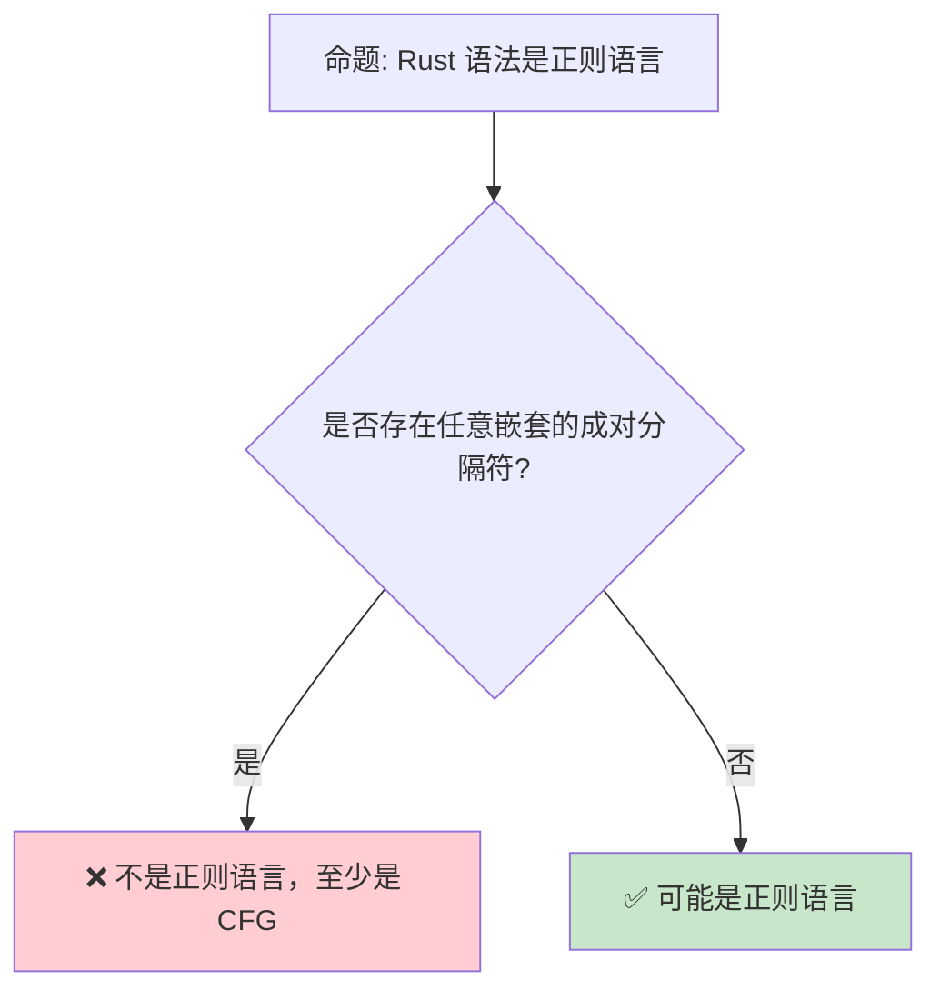
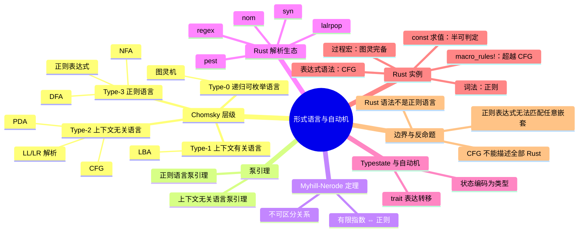

> **内容分级**: [专家级]

# 形式语言与自动机（Formal Languages and Automata）

> **EN**: Formal Languages and Automata
> **Summary**: The Chomsky hierarchy — regular, context-free, context-sensitive, and recursively enumerable languages — with pumping lemmas, Myhill-Nerode theorem, Rust parser ecosystem mapping, and typestate automata.

> **Rust 版本**: 1.97.0+ (Edition 2024)
> **Bloom 层级**: L4-L5
> **权威来源**: 本文件为 `concept/` 权威页。
> **定位**: 从 Chomsky 层级、泵引理、Myhill-Nerode 定理与自动机对应关系出发，定位 Rust 语法子集、解析生态（nom/pest/lalrpop/syn）与 typestate 模式在形式语言谱系中的位置。
> **前置概念**: [Lambda Calculus](../00_type_theory/05_lambda_calculus.md) · [Type Inference](../00_type_theory/03_type_inference.md)
> **后置概念**: [Computability Theory](02_computability_theory.md) · [Equivalence of Computational Models](05_equivalence_of_computational_models.md) · [Decidability Spectrum](../../00_meta/00_framework/decidability_spectrum.md)

---

## 📑 目录

- [形式语言与自动机（Formal Languages and Automata）](#形式语言与自动机formal-languages-and-automata)
  - [📑 目录](#-目录)
  - [一、核心概念](#一核心概念)
    - [1.1 为什么需要形式语言](#11-为什么需要形式语言)
    - [1.2 Chomsky 层级](#12-chomsky-层级)
    - [1.3 正则语言：DFA、NFA 与正则表达式](#13-正则语言dfanfa-与正则表达式)
    - [1.4 上下文无关语言：CFG 与 PDA](#14-上下文无关语言cfg-与-pda)
    - [1.5 图灵可识别与可判定语言](#15-图灵可识别与可判定语言)
    - [1.6 泵引理（Pumping Lemma）](#16-泵引理pumping-lemma)
      - [1.6.1 正则语言的泵引理](#161-正则语言的泵引理)
      - [1.6.2 上下文无关语言的泵引理](#162-上下文无关语言的泵引理)
    - [1.7 Myhill-Nerode 定理](#17-myhill-nerode-定理)
    - [1.8 Rust 解析生态映射](#18-rust-解析生态映射)
    - [1.9 自动机与 typestate / trait 的对应](#19-自动机与-typestate--trait-的对应)
    - [1.10 Rust 中的形式语言实例](#110-rust-中的形式语言实例)
  - [二、反命题与边界分析](#二反命题与边界分析)
    - [2.1 反命题：Rust 语法是正则语言](#21-反命题rust-语法是正则语言)
    - [2.2 边界极限](#22-边界极限)
  - [三、常见陷阱](#三常见陷阱)
  - [四、来源与延伸阅读](#四来源与延伸阅读)
  - [相关概念](#相关概念)
  - [嵌入式测验（Embedded Quiz）](#嵌入式测验embedded-quiz)
    - [测验 1：Chomsky 层级（理解层）](#测验-1chomsky-层级理解层)
    - [测验 2：正则语言边界（分析层）](#测验-2正则语言边界分析层)
    - [测验 3：CFG 与 Rust 解析（应用层）](#测验-3cfg-与-rust-解析应用层)
    - [测验 4：宏系统与 CFG（分析层）](#测验-4宏系统与-cfg分析层)
    - [测验 5：可判定性边界（评价层）](#测验-5可判定性边界评价层)
  - [🧭 思维导图（Mindmap）](#-思维导图mindmap)

---

## 一、核心概念

### 1.1 为什么需要形式语言

程序语言首先是**形式语言**：它的合法程序集合必须由精确、无歧义的规则定义，否则编译器实现者、程序员和验证工具会对「什么是合法代码」产生分歧。

```text
自然语言描述 vs 形式语言定义:

  自然语言："一个函数可以接受若干参数"
  ├── "若干"是多少？
  ├── 参数顺序是否重要？
  └── 不同实现可能理解不同

  形式语言：
  Fun ::= fn Ident ( ParamList ) -> Type { Body }
  ├── 每个符号有精确语法
  ├── 可用文法、自动机或推演系统判定成员资格
  └── 编译器可据此生成解析器

  Rust 的层面:
  ├── 词法：正则语言（标识符、关键字、字面量）
  ├── 语法：上下文无关语言（表达式、语句、块）
  ├── 类型：可判定约束求解（Hindley-Milner + traits）
  └── 宏扩展：比 CFG 更强（图灵完备）
```

> **认知功能**: 形式语言理论把「Rust 程序是否合法」转化为**成员资格判定问题**，从而可以用自动机、文法和复杂度理论分析编译器的各个阶段。
> (Source: [Hopcroft, Motwani & Ullman — Introduction to Automata Theory, Languages, and Computation](https://en.wikipedia.org/wiki/Introduction_to_Automata_Theory,_Languages,_and_Computation))

---

### 1.2 Chomsky 层级

Chomsky 层级把语言按**表达力**和**识别所需自动机**分为四类。每一类都有对应的文法、自动机和典型判定问题。

| 层级 | 语言类 | 文法 | 自动机 | 成员资格 |  Rust 对应 |
|:---|:---|:---|:---|:---:|:---|
| Type-3 | 正则语言 (Regular) | 正则文法 `A → aB \| a \| ε` | DFA / NFA / 正则表达式 | **可判定**（线性时间） | `regex` 模式、词法单元 |
| Type-2 | 上下文无关语言 (Context-Free) | CFG `A → α` | 下推自动机 (PDA) | **可判定**（多项式时间，CYK / LR） | Rust 表达式语法、匹配臂 |
| Type-1 | 上下文有关语言 (Context-Sensitive) | 上下文有关文法 `αAβ → αγβ` | 线性有界自动机 (LBA) | **可判定**（但非多项式） | 部分类型约束、宏 hygiene 的某些方面 |
| Type-0 | 递归可枚举语言 (Recursively Enumerable) | 无限制文法 | 图灵机 (TM) | **半可判定** | 过程宏展开、`const fn` 计算 |

> **层级洞察**: 每一层都是上一层的真子集。**表达力越强，判定问题越难**。Rust 编译器在不同阶段处理不同层级的对象：词法分析用正则，语法分析用 CFG，类型检查和宏扩展则进入可判定或半可判定领域。
> (Source: [Sipser — Introduction to the Theory of Computation](https://en.wikipedia.org/wiki/Introduction_to_the_Theory_of_Computation))

---

### 1.3 正则语言：DFA、NFA 与正则表达式

**正则语言**是能被有限自动机识别的语言类。其核心特征是：只需要有限状态即可判定成员资格，无法计数或匹配嵌套结构。

```text
确定有限自动机 (DFA):

  M = (Q, Σ, δ, q₀, F)
  ├── Q: 有限状态集
  ├── Σ: 有限字母表
  ├── δ: Q × Σ → Q 转移函数
  ├── q₀ ∈ Q: 初始状态
  └── F ⊆ Q: 接受状态集

  示例：识别二进制串中 0 的个数为偶数

      0         1
    ┌───┐     ┌───┐
    ▼   │     ▼   │
   (q0)─┘     (q1)─┘
    │0          │0
    ▼            ▼
   (q1)        (q0)

  q0 为偶数状态（接受），q1 为奇数状态。
```

Rust 中可用枚举模拟 DFA 状态：

```rust
#[derive(Clone, Copy, PartialEq, Eq)]
enum Parity { Even, Odd }

fn dfa_even_zeros(input: &str) -> bool {
    let mut state = Parity::Even;
    for ch in input.chars() {
        if ch == '0' {
            state = match state {
                Parity::Even => Parity::Odd,
                Parity::Odd => Parity::Even,
            };
        }
        // '1' 不改变状态
    }
    state == Parity::Even
}

fn main() {
    assert!(dfa_even_zeros("1001"));   // 两个 0
    assert!(!dfa_even_zeros("1000"));  // 三个 0
    assert!(dfa_even_zeros(""));       // 零个 0
}
```

**正则表达式引擎**（如 `regex` crate）通常将模式编译为 NFA 或 DFA，再通过子集构造或 Thompson 构造法求匹配。Rust 标准库未内置正则表达式，但 `regex` crate 是 Rust 生态的事实标准实现。

```rust,ignore
use regex::Regex;

fn main() {
    let re = Regex::new(r"^\d{4}-\d{2}-\d{2}$").unwrap();
    assert!(re.is_match("2026-07-28"));
    assert!(!re.is_match("28-07-2026"));
}
```

> **正则语言边界**: 正则语言对**交、并、连接、Kleene 星号**封闭，但对**补集与无限嵌套**能力有限。例如，无法用正则表达式精确匹配任意深度的成对括号。
> (Source: [Rust Reference — Lexical Structure](https://doc.rust-lang.org/reference/tokens.html))

---

### 1.4 上下文无关语言：CFG 与 PDA

**上下文无关语言 (CFL)** 由上下文无关文法 (CFG) 生成，可由**下推自动机 (PDA)** 识别。与正则语言相比，PDA 增加了一个栈，因此能够处理嵌套和匹配结构。

```text
上下文无关文法示例：平衡括号

  S → ( S )
  S → S S
  S → ε

推导 "(())":
  S ⇒ ( S ) ⇒ ( ( S ) ) ⇒ ( ( ε ) ) = (())

推导 "()()":
  S ⇒ S S ⇒ ( S ) S ⇒ ( ) S ⇒ ( ) ( S ) ⇒ ( ) ( ) = ()()
```

Rust 的表达式语法本质上是 CFG。例如，块表达式 ` { ... } `、匹配表达式 `match ... { ... }`、括号表达式以及嵌套结构都需求 CFG 能力。

```rust
fn main() {
    // Rust 表达式：嵌套深度任意，需要栈来解析
    let x = {
        let y = {
            let z = 1 + (2 + (3 + 4));
            z * 2
        };
        y + 1
    };
    assert_eq!(x, 21);
}
```

**LL/LR 解析**是编译器构造 CFG 解析器的两类经典算法：

- **LL(k)**：自顶向下、向前看 k 个符号。Rust 的 `macro_rules!` 部分匹配采用类似 LL 的预测策略。
- **LR(k)**：自底向上、向前看 k 个符号。rustc 的解析器基于 LR 思想的手写递归下降，而非纯表驱动 LR。

```text
Rust 解析策略:

  手写递归下降 + Pratt 表达式解析
  ├── 词法：表驱动（正则/NFA）
  ├── 语法：递归下降（等价于 CFG）
  └── 宏扩展：在语法树层面进行，超越纯 CFG
```

> **CFG 洞察**: Rust 的**表达式语法是上下文无关的**，但**宏系统不是**。`macro_rules!` 可以生成并匹配比 CFG 更复杂的模式，而过程宏则直接运行在图灵完备的 Rust 代码上。
> (Source: [Rust Reference — Macros By Example](https://doc.rust-lang.org/reference/macros-by-example.html))

---

### 1.5 图灵可识别与可判定语言

在 Chomsky 层级的顶端，**递归可枚举语言 (Type-0)** 由图灵机识别，**递归语言（可判定语言）**由总会停机的图灵机判定。

```text
可判定 (Decidable) vs 可识别 (Recognizable):

  可判定：
  ├── 对任意输入，图灵机必在有限步内停机
  ├── 回答是 / 否
  └── 例：DFA 成员资格、CFG 成员资格

  可识别（半可判定）：
  ├── 对「是」实例必停机接受
  ├── 对「否」实例可能永不停机
  └── 例：图灵机停机问题（自身不可判定）
```

Rust 编译器在类型检查和宏展开阶段会碰到可判定与半可判定的边界：

- **类型检查**：Rust 的类型系统被设计为可判定的（尽管某些扩展如 GATs 可能使推理更复杂）。
- **过程宏**：过程宏在编译期执行任意 Rust 代码，本质上是图灵完备的；宏展开可能不终止。
- `const fn` 求值：Rust 的常量求值器（Miri 引擎）有步数限制，因为任意 `const fn` 可能发散。

```rust,ignore
// ❌ 编译错误：过程宏虽然强大，但不能生成任意非法语法
// 以下不是合法 Rust 代码，宏展开后会被语法检查拒绝
macro_rules! bad {
    () => { fn };
}

fn main() {
    bad!(); // 会导致解析错误
}
```

> **判定性洞察**: 编译器前端（词法、语法）处理的是可判定问题；后端优化和宏展开则可能涉及半可判定甚至不可判定问题。区分这些阶段有助于理解「为什么 Rust 拒绝某些代码」与「为什么某些检查只能运行时进行」。
> (Source: [Rust Reference — Introduction](https://doc.rust-lang.org/reference/introduction.html))

---

### 1.6 泵引理（Pumping Lemma）

泵引理是证明语言**不**属于某一层级的标准工具。它给出的是必要条件：若语言属于该层级，则任意足够长的字符串都能被「泵」长或泵短后仍在语言中。通过找到反例字符串，可以证明某个语言不在该层级。

#### 1.6.1 正则语言的泵引理

> **正则语言泵引理**
>
> 若 L 是正则语言，则存在泵长度 `p ≥ 1`，使得对任意 `s ∈ L` 且 `|s| ≥ p`，`s` 可分解为 `s = xyz`，满足：
>
> 1. `|xy| ≤ p`
> 2. `|y| > 0`
> 3. 对所有 `i ≥ 0`，`xyⁱz ∈ L`

典型应用：证明 `L = {aⁿbⁿ | n ≥ 0}` 不是正则语言。取 `s = aᵖbᵖ`，则前缀 `xy` 全为 `a`；泵 `y` 会破坏 `a` 与 `b` 的数量平衡。

```text
泵引理不是充分条件：
├── 满足泵引理 ⇒ 不一定正则
├── 不满足泵引理 ⇒ 一定不正则
└── 工程意义：任意深度计数/匹配都需要 CFG 或更强模型
```

> **来源**: [Sipser 2012 — §1.4, pp. 77–82](https://math.mit.edu/~sipser/book.html) · [Hopcroft, Motwani & Ullman 2006 — §4.1](https://en.wikipedia.org/wiki/Introduction_to_Automata_Theory,_Languages,_and_Computation)

#### 1.6.2 上下文无关语言的泵引理

> **上下文无关语言泵引理**
>
> 若 L 是 CFL，则存在泵长度 `p ≥ 1`，使得对任意 `s ∈ L` 且 `|s| ≥ p`，`s` 可分解为 `s = uvxyz`，满足：
>
> 1. `|vxy| ≤ p`
> 2. `|vy| > 0`
> 3. 对所有 `i ≥ 0`，`uvⁱxyⁱz ∈ L`

典型应用：证明 `L = {aⁿbⁿcⁿ | n ≥ 0}` 不是 CFL。取 `s = aᵖbᵖcᵖ`，则 `vxy` 最多跨越两种字符；泵 `v` 和 `y` 会破坏三种字符数量相等。

```text
CFG 泵引理的工程含义：
├── Rust 表达式语法可以处理任意嵌套的 {}、()、[]
├── 但无法处理需要「三个并行计数」的语言结构
└── 某些语义约束（如变量绑定唯一性）需要超出 CFG 的工具
```

> **来源**: [Sipser 2012 — §2.3, pp. 125–130](https://math.mit.edu/~sipser/book.html) · [Hopcroft, Motwani & Ullman 2006 — §7.2](https://en.wikipedia.org/wiki/Introduction_to_Automata_Theory,_Languages,_and_Computation)

---

### 1.7 Myhill-Nerode 定理

**Myhill-Nerode 定理**给出了正则语言的另一种刻画：一个语言是正则的，当且仅当它的「不可区分关系」具有有限指数。这个定理比泵引理更强，因为它既是必要条件也是充分条件。

> **定义（不可区分关系）**
>
> 对语言 `L ⊆ Σ*`，定义关系 `≡_L` 如下：`x ≡_L y` 当且仅当对所有 `z ∈ Σ*`，
> $$
> xz \in L \iff yz \in L
> $$

> **Myhill-Nerode 定理**
>
> 语言 L 是正则的，当且仅当 `≡_L` 的等价类个数（指数）是有限的。

```text
直观理解：
├── 每个等价类对应 DFA 的一个状态
├── 等价类有限 ⇔ 只需要有限状态即可识别该语言
├── 这是构造最小 DFA 的理论基础
└── 泵引理只能证非正则；Myhill-Nerode 还能用来构造最小自动机
```

示例：语言 `L = {aⁿbⁿ | n ≥ 0}` 不是正则的，因为字符串 `a⁰, a¹, a², ...` 两两不等价：对 `aⁱ` 和 `aʲ`（i ≠ j），取 `z = bⁱ`，则 `aⁱbⁱ ∈ L` 但 `aʲbⁱ ∉ L`。

> **来源**: [Sipser 2012 — §1.4, Problem 1.52 及补充](https://math.mit.edu/~sipser/book.html) · [Hopcroft, Motwani & Ullman 2006 — §4.4](https://en.wikipedia.org/wiki/Introduction_to_Automata_Theory,_Languages,_and_Computation)

---

### 1.8 Rust 解析生态映射

Rust 生态提供了从正则表达式到完整语法解析的多层工具，分别对应形式语言层级的不同位置：

| 工具 / Crate | 形式能力 | 典型用途 | 与 Chomsky 层级关系 |
|:---|:---|:---|:---|
| `regex` | 正则语言 | 词法匹配、日志过滤、配置校验 | Type-3；编译为 DFA/NFA |
| `nom` | 解析器组合子；覆盖 CFG 及轻量上下文有关模式 | 二进制/文本协议解析、配置文件 | Type-2 为主，可扩展 |
| `pest` | PEG（解析表达式文法） | 领域特定语言（DSL）、配置文件 | 比 CFG 表达能力略有不同（无歧义，有序选择） |
| `lalrpop` | LR(1) / LALR | 完整编程语言语法、表达式语法 | Type-2；确定性 CFG 子集 |
| `syn` | 手写递归下降 | proc-macro 解析 Rust 语法树 | 实用 CFG + Rust 特定规则 |

```text
选择建议：
├── 需要快速正则匹配 → regex
├── 需要组合式、零拷贝解析 → nom
├── 需要声明式 DSL 且要求无歧义 → pest
├── 需要完整语言前端 → lalrpop / 手写递归下降（如 syn）
└── 需要解析 Rust 自身语法 → syn
```

> **认知要点**：这些工具不是「越强越好」。`regex` 虽然能力有限，但性能极高且可判定；`nom`/`pest`/`lalrpop` 进入 CFG 领域后，表达能力增强但错误恢复、歧义处理变得更复杂；`syn` 则直接面向 Rust 语法这一特定 CFG 变体。
>
> **来源**: [regex crate documentation](https://docs.rs/regex) · [nom crate documentation](https://docs.rs/nom) · [pest crate documentation](https://docs.rs/pest) · [lalrpop documentation](https://lalrpop.github.io/lalrpop/) · [syn crate documentation](https://docs.rs/syn)

---

### 1.9 自动机与 typestate / trait 的对应

**Typestate** 是一种将状态机编码进类型系统的设计模式：对象在不同状态下具有不同的类型，只有特定状态下才能调用特定方法。这与 DFA/PDA 的「状态 + 转移」思想直接对应。

Rust 的所有权与 trait 系统特别适合实现 typestate。下面的例子用类型模拟一个具有 `Open` 和 `Closed` 两种状态的门：

```rust
struct Closed;
struct Open;

struct Door<State> {
    state: State,
}

impl Door<Closed> {
    fn new() -> Self { Door { state: Closed } }
    fn open(self) -> Door<Open> { Door { state: Open } }
}

impl Door<Open> {
    fn close(self) -> Door<Closed> { Door { state: Closed } }
    fn walk_through(&self) -> &'static str { "walking through" }
}

fn main() {
    let door = Door::new();
    let door = door.open();
    println!("{}", door.walk_through());
    let _door = door.close();
}
```

> 这个模式的关键在于：**编译器在类型层面强制执行状态转移规则**。`Door<Closed>` 不能调用 `walk_through`，`Door<Open>` 不能调用 `open`。这相当于把 DFA 的转移函数编码为类型系统的 method 签名。

更复杂的例子可以用 trait 表达「在当前状态下允许的操作」：

```rust
trait State {}
struct Locked;
struct Unlocked;
impl State for Locked {}
impl State for Unlocked {}

struct Safe<S: State> { _state: S }

impl Safe<Locked> {
    fn unlock(self, key: u32) -> Result<Safe<Unlocked>, Self> {
        if key == 42 { Ok(Safe { _state: Unlocked }) } else { Err(self) }
    }
}

impl Safe<Unlocked> {
    fn retrieve(&self) -> &'static str { "secret" }
    fn lock(self) -> Safe<Locked> { Safe { _state: Locked } }
}

fn main() {
    let safe = Safe { _state: Locked };
    match safe.unlock(42) {
        Ok(open) => { println!("{}", open.retrieve()); let _ = open.lock(); }
        Err(_) => {}
    }
}
```

> **来源**: [Rust Reference — Items](https://doc.rust-lang.org/reference/items.html) · [Rust By Example — Generics](https://doc.rust-lang.org/rust-by-example/generics.html)

---

### 1.10 Rust 中的形式语言实例

Rust 程序在不同编译阶段对应形式语言层级的不同对象：

| Rust 对象 | 形式语言层级 | 识别工具 | 关键特征 |
|:---|:---|:---|:---|
| 词法 token（`fn`, `let`, 标识符） | 正则 | 词法分析器 | 有限状态即可识别 |
| 表达式/语句语法 | 上下文无关 | rustc 解析器 | 需要嵌套/匹配结构 |
| `macro_rules!` 匹配 | 超越 CFG | 宏展开器 | 可生成上下文有关模式 |
| 过程宏 (proc-macro) | 图灵完备 | proc-macro crate | 编译期执行任意 Rust 代码 |
| 类型约束求解 | 可判定（核心） | trait solver | 保证编译终止 |
| `const` 求值 | 半可判定 | CTFE / Miri | 可能有步数限制 |

```rust
// Rust 宏系统比 CFG 更强的简单示例：
// macro_rules! 可以重复匹配嵌套模式并生成新代码
macro_rules! count_tts {
    () => { 0usize };
    ($head:tt $($tail:tt)*) => { 1usize + count_tts!($($tail)*) };
}

fn main() {
    let n = count_tts!(a b c d e);
    assert_eq!(n, 5);
}
```

> **Rust 实例洞察**: `regex` crate 实现 DFA/NFA；rustc 解析器处理 CFG；`macro_rules!` 和过程宏进入图灵完备领域。理解这三层有助于判断「哪些编译错误来自语法，哪些来自语义/类型」。
> (Source: [Rust Reference — Items](https://doc.rust-lang.org/reference/items.html))

---

## 二、反命题与边界分析

本节检验形式语言学习中的三条常见误判：

1. **「Rust 语法是正则语言」**：错——任意嵌套的块和括号需要栈，已超出 DFA 能力；
2. **「正则表达式可以匹配任意嵌套结构」**：错——泵引理证明正则语言无法计数嵌套深度；
3. **「上下文无关语言足以描述全部 Rust」**：错——宏 hygiene、过程宏和某些语义约束需要更强的形式化工具。

每条误判附最小反例与形式语言层面的解释。

### 2.1 反命题：Rust 语法是正则语言



**形式化证明（泵引理反证）**：

假设 Rust 语法是正则语言，则存在泵长度 `p`。取程序：

```rust
fn main() { { { ... { } ... } } }
```

其中包含 `p+1` 层嵌套大括号。根据泵引理，这部分可被分解为 `xyz`，且 `|xy| ≤ p`、`|y| > 0`，使得对所有 `i ≥ 0`，`xyⁱz` 仍在语言中。 pumping `y` 会改变嵌套深度，导致括号不平衡——与 Rust 语法矛盾。因此 Rust 语法不是正则语言。

```rust,compile_fail
// ❌ 编译错误：不平衡的分隔符不是合法 Rust 语法
fn main() {
    {
        {  // 多一个开括号
}
```

> **反命题修正**: Rust 的**词法**可用正则处理，但**语法**需要 CFG 及以上。把「词法简单」误认为「语法简单」是常见错误。
> (Source: [Rust Reference — Expressions](https://doc.rust-lang.org/reference/expressions.html))

---

### 2.2 边界极限

```text
边界 1: 正则 vs CFG
├── 正则语言无法表达任意嵌套
├── Rust 的 {}、()、[] 必须成对匹配
└── 解析器必须维护栈结构

边界 2: CFG 的封闭性
├── CFG 对并、连接、Kleene 星号封闭
├── CFG 对交、补不封闭
└── 某些 Rust 语义约束（如变量作用域）不能用纯 CFG 表达

边界 3: 宏系统超越 CFG
├── macro_rules! 可生成上下文有关模式
├── 过程宏直接运行 Rust 代码
└── 宏展开后的代码才进入 CFG 解析阶段

边界 4: 判定性边界
├── 词法/语法分析时间可控
├── 类型检查在核心 Rust 中可判定
└── 某些泛型/关联类型场景接近判定性边界

边界 5: 工程实践
├── 形式语言给出的是「合法字符串集合」
├── 实际编译器还需处理错误恢复、 hygiene、span 信息
└── 形式化模型是理想化抽象
```

> **边界要点**: Rust 编译器是形式语言理论与工程实现的结合。形式层级决定「能识别什么」，工程细节决定「如何优雅地报告错误」。

---

## 三、常见陷阱

```text
陷阱 1: 用正则表达式解析 Rust 源代码
  ❌ 尝试用 regex 匹配任意嵌套结构
     let re = Regex::new(r"\{[^}]*\}").unwrap();
     // 无法匹配 { { } }

  ✅ 使用 syn / rustc 解析器处理 CFG

陷阱 2: 混淆「语法合法」与「类型正确」
  ❌ 认为通过解析就保证编译成功
     let x: String = 42; // 语法合法，类型错误

  ✅ 语法只是第一层过滤；类型/借用检查在更上层

陷阱 3: 低估宏系统的表达力
  ❌ 把 macro_rules! 等同于简单的文本替换

  ✅ macro_rules! 有 hygiene 和重复匹配；过程宏是完整程序

陷阱 4: 忽视泵引理的实际含义
  ❌ "这个语言看起来简单，应该是正则的"

  ✅ 只要需要任意深度计数或匹配，就需要 CFG 或更强模型

陷阱 5: 混淆可识别与可判定
  ❌ "编译器总能告诉我程序是否合法"

  ✅ 宏展开和 const 求值可能不终止；编译器有步数/超时限制
```

> **陷阱总结**: 形式语言理论的陷阱主要与**正则语言边界**、**语法与语义分层**、**宏系统表达力**、**泵引理应用**和**判定性边界**相关。

---

## 四、来源与延伸阅读

| 来源 | 可信度 | 说明 |
|:---|:---:|:---|
| [Hopcroft, Motwani & Ullman — Introduction to Automata Theory, Languages, and Computation, 3rd ed. (2006)](https://en.wikipedia.org/wiki/Introduction_to_Automata_Theory,_Languages,_and_Computation) | ✅ 一级 | 自动机理论经典教材；DFA/NFA §2，泵引理 §4.1/§7.2，Myhill-Nerode §4.4 |
| [Sipser — Introduction to the Theory of Computation, 3rd ed. (2012)](https://en.wikipedia.org/wiki/Introduction_to_the_Theory_of_Computation) | ✅ 一级 | 可计算性与复杂度理论；正则泵引理 §1.4，CFG 泵引理 §2.3，Myhill-Nerode §1.4 |
| [Rust Reference — Introduction](https://doc.rust-lang.org/reference/introduction.html) | ✅ P0 | Rust 官方参考手册 |
| [Rust Reference — Macros By Example](https://doc.rust-lang.org/reference/macros-by-example.html) | ✅ P0 | 声明宏官方规格 |
| [Rust Reference — Expressions](https://doc.rust-lang.org/reference/expressions.html) | ✅ P0 | Rust 表达式语法 |
| [regex crate documentation](https://docs.rs/regex) | ✅ 二级 | Rust 正则表达式实现 |
| [nom crate documentation](https://docs.rs/nom) | ✅ 二级 | 解析器组合子 |
| [pest crate documentation](https://docs.rs/pest) | ✅ 二级 | PEG 解析器生成器 |
| [lalrpop documentation](https://lalrpop.github.io/lalrpop/) | ✅ 二级 | LR(1)/LALR 解析器生成器 |
| [syn crate documentation](https://docs.rs/syn) | ✅ 二级 | Rust 语法树解析 |

---

## 相关概念

- [Type Inference](../00_type_theory/03_type_inference.md) — 类型推断与约束求解
- [Lambda Calculus](../00_type_theory/05_lambda_calculus.md) — 函数式计算模型
- [Macros](../../03_advanced/03_proc_macros/01_macros.md) — Rust 宏系统
- [Computability Theory](02_computability_theory.md) — 可计算性理论
- [Equivalence of Computational Models](05_equivalence_of_computational_models.md) — 计算模型等价性
- [Decidability Spectrum](../../00_meta/00_framework/decidability_spectrum.md) — 可判定性谱系

---

## 嵌入式测验（Embedded Quiz）

### 测验 1：Chomsky 层级（理解层）

Rust 源代码中的**标识符**（如 `foo`、`bar_baz`）属于 Chomsky 层级的哪一类？

- A. 上下文无关语言
- B. 正则语言
- C. 上下文有关语言
- D. 递归可枚举语言

<details>
<summary>✅ 答案</summary>

**B. 正则语言**。

标识符由有限字母表上的有限模式定义（字母/下划线开头，后跟字母/数字/下划线），可用正则表达式 `[A-Za-z_][A-Za-z0-9_]*` 描述，因此属于正则语言。Rust 的词法分析阶段使用正则/NFA 类方法识别 token。

</details>

---

### 测验 2：正则语言边界（分析层）

下列哪个 Rust 结构**不能**用正则语言精确描述？

- A. `let x = 1;` 形式的简单变量声明
- B. 任意嵌套深度的 `{ ... { ... } ... }` 块表达式
- C. 由逗号分隔的标识符列表
- D. 十六进制整数字面量

<details>
<summary>✅ 答案</summary>

**B. 任意嵌套深度的 `{ ... { ... } ... }` 块表达式**。

正则语言无法计数或匹配任意深度的嵌套结构（泵引理可证）。块表达式需要 CFG 或更强的文法。其余选项都是局部、有限状态可识别的模式。

</details>

---

### 测验 3：CFG 与 Rust 解析（应用层）

Rust 的 `match` 表达式为什么需要 CFG 而不是正则语言？

- A. 因为 `match` 关键字太长
- B. 因为 `match` 分支之间可能嵌套块和花括号
- C. 因为 `match` 会调用 trait 方法
- D. 因为 `match` 只能在函数内部使用

<details>
<summary>✅ 答案</summary>

**B. 因为 `match` 分支之间可能嵌套块和花括号**。

`match expr { pat => { ... }, ... }` 的语法包含成对且可能嵌套的花括号，这种匹配结构需要栈来解析，已超出 DFA/正则的能力范围。

</details>

---

### 测验 4：宏系统与 CFG（分析层）

`macro_rules!` 和过程宏在形式语言层级上通常位于哪一层？

- A. 正则语言层
- B. 上下文无关语言层
- C. 上下文有关语言层
- D. 图灵完备层

<details>
<summary>✅ 答案</summary>

**D. 图灵完备层**。

`macro_rules!` 的重复匹配和 substitution 已经超越纯 CFG；过程宏更是在编译期执行任意 Rust 代码，因此是图灵完备的。宏展开的结果才进入 CFG 解析阶段。

</details>

---

### 测验 5：可判定性边界（评价层）

下列 Rust 编译阶段中，哪一项可能涉及**半可判定**问题？

- A. 词法分析（tokenization）
- B. 语法分析（parsing）
- C. `const fn` 的编译期求值
- D. 识别关键字 `fn`

<details>
<summary>✅ 答案</summary>

**C. `const fn` 的编译期求值**。

词法分析、语法分析和关键字识别都是可判定问题（有限时间内必有结果）。`const fn` 可能包含任意循环/递归，其终止性由停机问题限制，因此编译器只能设置步数上限，属于半可判定问题。

</details>

---

## 🧭 思维导图（Mindmap）



> **认知功能**: 本 mindmap 从本页「形式语言与自动机」的章节结构提炼，一级分支对应核心主题，叶子节点为关键子概念，可作为本页的快速导航与复习索引。
