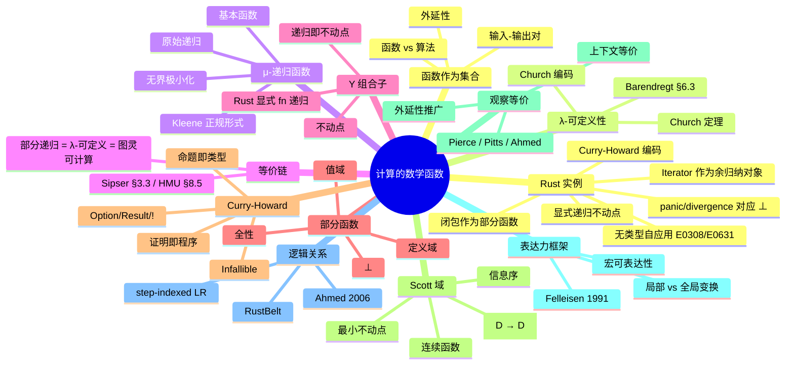

> **内容分级**: [专家级]

# 计算的数学函数（Mathematical Functions of Computation）

> **EN**: Mathematical Functions of Computation
> **Summary**: Computable functions as mathematical objects — λ-definability, μ-recursion, fixed-point combinators, partiality, Curry-Howard correspondence, Scott domains, and their relationship to observational equivalence and expressive power, illustrated with Rust 1.97 Edition 2024.

> **Rust 版本**: 1.97.0+ (Edition 2024)
> **Bloom 层级**: L4-L5
> **权威来源**: 本文件为 `concept/` 权威页。
> **定位**: 把可计算函数视为数学对象，连接 λ 可定义性、不动点组合子、μ-递归、部分递归函数、Curry-Howard 对应、Scott 域、观察等价与 Felleisen 表达力框架，并通过 Rust 函数/闭包/迭代器展示理论与实现的对应与张力。
> **前置概念**: [Unsafe Rust](../../03_advanced/02_unsafe/01_unsafe.md) · [Lambda Calculus](../00_type_theory/05_lambda_calculus.md) · [Computability Theory](02_computability_theory.md)
> **后置概念**: [Denotational Semantics](../03_operational_semantics/01_denotational_semantics.md) · [Equivalence of Computational Models](05_equivalence_of_computational_models.md) · [Observational Equivalence](../03_operational_semantics/06_observational_equivalence.md)

> **来源**: [Sipser 2012 — Introduction to the Theory of Computation](https://math.mit.edu/~sipser/book.html) · [Hopcroft, Motwani & Ullman 2006 — Introduction to Automata Theory, Languages, and Computation](https://en.wikipedia.org/wiki/Introduction_to_Automata_Theory,_Languages,_and_Computation) · [Barendregt 1984 — The Lambda Calculus: Its Syntax and Semantics](https://doi.org/10.1016/S0049-237X(09)70349-9) · [Scott 1976 — Data Types as Lattices](https://doi.org/10.1137/0205037) · [Pierce 2002 — Types and Programming Languages](https://www.cis.upenn.edu/~bcpierce/tapl/) · [Felleisen 1991 — On the Expressive Power of Programming Languages](https://doi.org/10.1007/BF00119888) · [Ahmed 2006 — Step-indexed syntactic logical relations](https://doi.org/10.1007/11693024_6) · [Pitts 1997 — Operationally-based theories of program equivalence](https://www.cl.cam.ac.uk/~amp12/papers/index.html)

---

## 📑 目录

- [计算的数学函数（Mathematical Functions of Computation）](#计算的数学函数mathematical-functions-of-computation)
  - [📑 目录](#-目录)
  - [一、核心概念](#一核心概念)
    - [1.1 函数作为输入-输出对的集合](#11-函数作为输入-输出对的集合)
    - [1.2 λ-可定义函数](#12-λ-可定义函数)
    - [1.3 μ-递归函数](#13-μ-递归函数)
    - [1.4 部分递归函数 = 图灵可计算函数](#14-部分递归函数--图灵可计算函数)
    - [1.5 Y 组合子与不动点组合子](#15-y-组合子与不动点组合子)
    - [1.6 部分函数：定义域、值域与全性](#16-部分函数定义域值域与全性)
    - [1.7 Curry-Howard 对应：命题即类型](#17-curry-howard-对应命题即类型)
    - [1.8 Scott 域与指称语义](#18-scott-域与指称语义)
    - [1.9 从数学函数到观察等价：外延性与上下文等价](#19-从数学函数到观察等价外延性与上下文等价)
    - [1.10 表达力 vs 计算能力：Felleisen 框架](#110-表达力-vs-计算能力felleisen-框架)
    - [1.11 逻辑关系与 step-indexed 近似](#111-逻辑关系与-step-indexed-近似)
  - [二、Rust 中的函数与数学函数](#二rust-中的函数与数学函数)
    - [2.1 闭包作为部分函数](#21-闭包作为部分函数)
    - [2.2 `fn` 的全性 vs 部分性](#22-fn-的全性-vs-部分性)
    - [2.3 `Iterator` 作为余归纳对象](#23-iterator-作为余归纳对象)
    - [2.4 高阶函数与不动点：显式递归 vs Y 组合子](#24-高阶函数与不动点显式递归-vs-y-组合子)
    - [2.5 Curry-Howard 的 Rust 编码：空类型、析取、合取](#25-curry-howard-的-rust-编码空类型析取合取)
    - [2.6 闭包/迭代器与数学函数的精确对应与张力](#26-闭包迭代器与数学函数的精确对应与张力)
      - [张力 1：闭包捕获环境 vs 数学函数的纯输入](#张力-1闭包捕获环境-vs-数学函数的纯输入)
      - [张力 2：迭代器作为部分函数序列](#张力-2迭代器作为部分函数序列)
      - [张力 3：全函数类型 vs 部分函数行为](#张力-3全函数类型-vs-部分函数行为)
      - [`compile_fail` 反例：无类型自应用](#compile_fail-反例无类型自应用)
  - [三、反命题与边界分析](#三反命题与边界分析)
  - [四、相关概念](#四相关概念)
  - [五、嵌入式测验（Embedded Quiz）](#五嵌入式测验embedded-quiz)
    - [测验 1：λ-可定义函数与可计算性（理解层）](#测验-1λ-可定义函数与可计算性理解层)
    - [测验 2：Rust 函数与全函数（应用层）](#测验-2rust-函数与全函数应用层)
    - [测验 3：Scott 域解决的核心问题（分析层）](#测验-3scott-域解决的核心问题分析层)
    - [测验 4：Curry-Howard 对应（分析层）](#测验-4curry-howard-对应分析层)
    - [测验 5：观察等价与所有权移动（应用层）](#测验-5观察等价与所有权移动应用层)
    - [测验 6：Felleisen 表达力判定（分析层）](#测验-6felleisen-表达力判定分析层)
    - [测验 7：逻辑关系与 step-indexing（综合层）](#测验-7逻辑关系与-step-indexing综合层)
  - [六、权威来源索引](#六权威来源索引)
  - [七、🧭 思维导图（Mindmap）](#七-思维导图mindmap)

---

## 一、核心概念

### 1.1 函数作为输入-输出对的集合

在数学中，函数 `f : A → B` 可以等价地看作集合 `A × B` 的一个子集，满足对每个 `a ∈ A` 至多有一个 `b ∈ B` 使得 `(a, b) ∈ f`。这一**外延（extensional）**视角把函数与其算法实现分离开：同一函数可由多种算法计算，但外延只关心输入-输出关系。

```text
函数 vs 算法：
├── 函数：输入与输出的静态关系
│   └── 例：f(n) = n! 是一个数学函数
├── 算法：计算函数的具体步骤
│   └── 例：阶乘可以用递归、循环或查表实现
└── 同一函数可由多种算法实现
```

> **认知要点**：可计算性理论研究的是「哪些函数存在算法」，而不是「某个具体算法是否正确」。Sipser 在讨论图灵机计算函数时即采用此外延观点：一台图灵机 `M` **计算**函数 `f`，当且仅当对每个输入 `w`，`M` 停机时带上留下的结果恰好为 `f(w)`（Sipser, 2012, §3.1, pp. 165–170）。Hopcroft, Motwani & Ullman 亦将 Turing 机视为字符串到字符串的部分函数（HMU, 2006, §8.2, pp. 327–336）。

---

### 1.2 λ-可定义函数

Church（1936）证明了一个数论函数是 **λ-可定义**的，当且仅当它可以被无类型 λ 演算中的项表达。Barendregt 将这一结果系统阐述为：无类型 λ 演算中的项通过 Church 编码可定义所有部分递归函数（Barendregt, 1984, §6.3）。Pierce 在 TAPL 第 5 章从无类型 λ 演算的语法、β-归约与求值策略出发，给出了 λ 可定义性的现代教学表述（Pierce, 2002, Ch. 5）。

```text
Church 定理（直觉表述）：
  一个数论函数是 λ-可定义的  ⇔  它是部分递归的  ⇔  它是图灵可计算的

例子：
  加法：add = λm.λn.λf.λx. m f (n f x)
  乘法：mul = λm.λn.λf. m (n f)
```

Church 编码把数据（数、布尔值、序对）直接编码为高阶函数，从而说明 λ 演算无需原生数据类型即可表达任意可计算函数。λ 演算与 Rust 闭包的详细对应见 [Lambda Calculus](../00_type_theory/05_lambda_calculus.md)。

> **来源**: [Church 1936 — An Unsolvable Problem of Elementary Number Theory](https://doi.org/10.2307/1968981) · [Barendregt 1984 — The Lambda Calculus: Its Syntax and Semantics, §6.3](https://doi.org/10.1016/S0049-237X(09)70349-9) · [Pierce 2002 — Types and Programming Languages, Ch. 5](https://www.cis.upenn.edu/~bcpierce/tapl/)

---

### 1.3 μ-递归函数

μ-递归函数通过基本函数和三种规则构造所有可计算函数。Kleene 在《元数学导论》中将其形式化为递归函数论的核心工具（Kleene, 1952, §54）；Soare 的现代教材则将其与图灵可计算性并置，作为「可计算」的等价刻画之一（Soare, 2016, §1.3）。HMU 在讨论不可判定性时亦将递归函数作为图灵机之外的标准模型引用（HMU, 2006, §9.1）。

```text
基本函数：
  零函数    : Z(x) = 0
  后继函数  : S(x) = x + 1
  投影函数  : P_i^n(x₁,...,x_n) = x_i

构造规则：
  组合        : h(x) = f(g₁(x), ..., g_k(x))
  原始递归    : f(0, x) = g(x)
                f(n+1, x) = h(n, x, f(n, x))
  无界极小化  : f(x) = μy. g(x, y) = 0
                （若不存在这样的 y，则 f(x) 无定义）
```

原始递归函数对应保证终止的循环；加入 μ 算子后得到**部分递归函数**，对应可能不终止的通用计算。μ-递归函数与图灵可计算函数的等价性构成了 Church-Turing 论题的代数侧面。

> **来源**: [Kleene 1952 — Introduction to Metamathematics, §54](https://en.wikipedia.org/wiki/Introduction_to_Metamathematics) · [Soare 2016 — Turing Computability. Theory and Applications, §1.3](https://doi.org/10.1007/978-3-642-31933-4) · [Hopcroft, Motwani & Ullman 2006 — Introduction to Automata Theory, Languages, and Computation, §9.1](https://en.wikipedia.org/wiki/Introduction_to_Automata_Theory,_Languages,_and_Computation)

---

### 1.4 部分递归函数 = 图灵可计算函数

以下三个概念刻画的是同一类函数：

```text
等价链：
  部分递归函数  =  λ-可定义函数  =  图灵可计算函数
```

这正是 Church-Turing 论题的强形式。Church（1936）从 λ 可定义性出发，Turing（1936）从机械可计算性出发，Kleene 从 μ-递归出发，三者后来被证明等价。Sipser 将这一等价链作为 Church-Turing 论题稳定性的核心证据（Sipser, 2012, §3.3, pp. 184–187）；HMU 亦在图灵机变体与递归可枚举语言之间建立等价关系（HMU, 2006, §8.5）。它说明「可计算函数」这一直观概念具有惊人的稳定性：无论用递归函数、λ 演算还是图灵机形式化，得到的集合都相同。

> **来源**: [Church 1936 — An Unsolvable Problem of Elementary Number Theory](https://doi.org/10.2307/1968981) · [Turing 1936 — On Computable Numbers](https://doi.org/10.1112/plms/s2-42.1.230) · [Kleene 1952 — Introduction to Metamathematics](https://en.wikipedia.org/wiki/Introduction_to_Metamathematics) · [Sipser 2012 — §3.3](https://math.mit.edu/~sipser/book.html) · [Hopcroft, Motwani & Ullman 2006 — §8.5](https://en.wikipedia.org/wiki/Introduction_to_Automata_Theory,_Languages,_and_Computation)

---

### 1.5 Y 组合子与不动点组合子

在 λ 演算中，递归函数可以通过**不动点组合子（fixed-point combinator）**定义，而无需语言原生支持递归。最著名的不动点组合子是 **Y 组合子**：

```text
Y = λf. (λx. f (x x)) (λx. f (x x))

性质：对任意 λ 项 F，有 Y F = F (Y F)
      因此 Y F 是 F 的不动点
```

Y 组合子的意义在于：它把「递归定义」转化为「寻找不动点」。任何递归函数 `f = F f` 都可以写成 `f = Y F`，其中 `F` 是一个高阶函数，描述了一次递归步的行为。Barendregt 在 §6.5 中证明了 Y 组合子的不动点性质，并讨论了它与 Curry 不动点组合子 Θ 的关系（Barendregt, 1984, §6.5, pp. 139–143）。

> **教学类比**：可以把 `Y` 看作「重复应用直到稳定」的算子。`Y F` 先产生 `F (Y F)`，再产生 `F (F (Y F))`，依此类推，最终收敛到最小不动点。

在 Rust 中，由于类型系统要求显式类型且禁止无类型的自应用（`x x`），不能直接写出 Y 组合子。Rust 使用**显式 `fn` 递归**或**高阶函数组合**来达到同样的表达目的：

```rust
fn factorial(n: u64) -> u64 {
    if n == 0 { 1 } else { n * factorial(n - 1) }
}

fn main() {
    assert_eq!(factorial(5), 120);
}
```

这里的 `factorial` 是 `F` 的不动点，其中 `F` 可以看作：

```text
F(f)(n) = if n == 0 then 1 else n * f(n - 1)
```

Rust 编译器通过名字解析和调用栈实现这个不动点，而不是通过 λ 演算中的 Y 组合子。用 trait 对象模拟 Y 组合子的细节见 [计算模型等价性](05_equivalence_of_computational_models.md#y-组合子与不动点)。

下面的 `compile_fail,E0275` 反例展示：若试图在类型层面直接表达不动点 `T = F(T)` 的无限展开，Rust 的 trait solver 会因递归溢出而拒绝——这正是类型化语言需要显式不动点构造的原因。

```rust,compile_fail,E0275
trait Fix<F> {
    type Out;
}
impl<T, F> Fix<F> for T where T: Fix<F> {
    type Out = T;
}
fn resolve<T, F>() -> T where T: Fix<F, Out = T> { unimplemented!() }

fn main() {
    resolve::<i32, ()>();
}
```

> **来源**: [Barendregt 1984 — The Lambda Calculus: Its Syntax and Semantics, §6.5](https://doi.org/10.1016/S0049-237X(09)70349-9) · [Scott 1976 — Data types as lattices](https://doi.org/10.1137/0205037)

---

### 1.6 部分函数：定义域、值域与全性

**部分函数（partial function）** `f : A ⇀ B` 与**全函数（total function）** `f : A → B` 的关键区别在于：部分函数不一定对所有输入都有定义。

```text
部分函数的形式化：

  定义域  dom(f) = { a ∈ A | ∃b ∈ B. f(a) = b }
  值域    rng(f) = { b ∈ B | ∃a ∈ A. f(a) = b }

  全函数：dom(f) = A
  部分函数：dom(f) ⊂ A
  无定义输入：f(a) ↑ 或 f(a) = ⊥
```

在可计算性理论中，**部分递归函数**允许对某些输入不终止；而**全递归函数**要求对所有输入都停机。Church-Turing 论题的「强形式」通常使用部分函数，因为通用计算必然包含不终止的程序。Sipser 在讨论可判定性与可识别性时区分了「对所有输入停机」与「仅对接受输入停机」，这正是全函数与部分函数在语言识别中的投影（Sipser, 2012, §4.1, pp. 193–198）。

> **认知要点**：程序设计语言中的函数大多是部分的。即使类型签名是 `fn(T) -> U`，函数仍可能 panic、diverge 或触发 UB——这些在数学上都对应 ⊥。

---

### 1.7 Curry-Howard 对应：命题即类型

**Curry-Howard 对应**（Curry 1934; Howard 1969/1980; 系统阐述见 Girard, Lafont & Taylor 1989）揭示了逻辑命题与类型系统之间的深刻同构。Pierce 在 TAPL 第 9 章（Simply Typed Lambda-Calculus）和第 12 章（Normalization）中将其作为类型系统语义的核心线索：类型推导即是证明构造，类型检查即是证明校验（Pierce, 2002, Ch. 9 & Ch. 12）。Barendregt 在《Lambda Calculi with Types》第 5 章给出了 Curry-Howard 在简单类型、系统 F 与依赖类型中的分层表述（Barendregt, 1992, §5）。

| 逻辑 | 类型论 | Rust 类型示例 |
|:---|:---|:---|
| 命题 A | 类型 A | `i32`, `String` |
| 证明 | 程序 / 项 | `42`, `"hello"` |
| A ⇒ B | 函数类型 A → B | `fn(A) -> B` |
| A ∧ B | 乘积类型 A × B | `(A, B)` |
| A ∨ B | 和类型 A + B | `enum E { A(A), B(B) }` |
| ⊤（真） | 单元类型 | `()` |
| ⊥（假） | 空类型 | `!`（never type）/ `std::convert::Infallible` |
| ∀x.P(x) | 依赖乘积 / 泛型 | `fn<T>(x: T) -> ...` |
| ∃x.P(x) | 依赖和 | 可用泛型 + trait 模拟 |

```text
Curry-Howard 的工程含义：
├── 类型检查 = 证明检查
├── 编写类型安全的程序 = 构造逻辑证明
├── 无法构造类型为 ⊥ 的值 = 矛盾命题无证明
└── 泛型程序对应于全称量词 ∀ 的证明
```

Rust 示例：`Result<T, E>` 对应于逻辑析取「成功返回 T 或失败返回 E」。构造 `Ok(x)` 相当于证明左析取支，构造 `Err(e)` 相当于证明右析取支。

```rust
fn safe_divide(x: f64, y: f64) -> Result<f64, &'static str> {
    if y == 0.0 { Err("division by zero") } else { Ok(x / y) }
}

fn main() {
    assert_eq!(safe_divide(10.0, 2.0), Ok(5.0));
    assert_eq!(safe_divide(10.0, 0.0), Err("division by zero"));
}
```

> **来源**: [Girard, Lafont & Taylor 1989 — Proofs and Types](https://www.paultaylor.eu/stable/Proofs+Types.html) · [Wadler 2015 — Propositions as Types](https://doi.org/10.1145/2699407) · [Barendregt 1984 — §4.4](https://doi.org/10.1016/S0049-237X(09)70349-9) · [Pierce 2002 — Types and Programming Languages, Ch. 9 & Ch. 12](https://www.cis.upenn.edu/~bcpierce/tapl/) · [Barendregt 1992 — Lambda Calculi with Types, §5](https://doi.org/10.1016/B978-0-444-88074-1.50009-9)

---

### 1.8 Scott 域与指称语义

无类型 λ 演算中的自应用（如 `x x`）无法直接用普通集合论函数解释，因为不存在集合 `D` 使得 `D ≅ D → D`。Dana Scott 引入了**Scott 域**来解决这一问题。Scott 在 1976 年的经典论文中将数据类型建模为完备偏序（complete partial orders / lattices），并在其上定义连续函数空间，从而得到 `D ≅ [D → D]` 的解（Scott, 1976, §1–2, pp. 522–587）。Scott 1982 年的讲义进一步把这一框架发展为面向程序语言指称语义的标准域论工具（Scott, 1982）。Scott 与 Strachey 的 PRG-6 技术报告则被公认为指称语义方法的奠基文献（Scott & Strachey, 1971）。

```text
Scott 域的关键思想：
├── 在域上引入偏序关系 ⊑（信息序）
├── 元素可以是「部分定义」的（⊥ 表示无信息）
├── 只考虑连续函数（continuous functions）
└── 存在域 D 使得 D ≅ [D → D]（连续函数空间）

不动点定理：
  对任意连续函数 f : D → D，存在最小不动点 fix(f) = ⊔{fⁿ(⊥) | n ≥ 0}
  这为递归定义提供了数学基础。
```

> **来源**: [Scott 1976 — Data types as lattices](https://doi.org/10.1137/0205037) · [Scott 1982 — Domains for Denotational Semantics](https://www.cs.ox.ac.uk/files/3287/PRG19.pdf) · [Scott & Strachey — Toward a Mathematical Semantics](https://www.cs.ox.ac.uk/files/3232/PRG06.pdf)

---

### 1.9 从数学函数到观察等价：外延性与上下文等价

数学函数的外延性说：两个函数相等当且仅当它们对所有输入给出相同输出。在程序语言中，这一思想被推广为**观察等价性（observational equivalence）**：两个程序片段在任意合法上下文中都无法被外部观察者区分，则它们观察等价。Pierce 在 TAPL 的操作语义框架中将上下文等价作为 typed lambda calculus 中程序等价的标准定义（Pierce, 2002, Ch. 3 & Ch. 9）。Pitts 系统地发展了基于操作语义的程序等价理论，给出 CIU 等价与上下文等价的联系，并讨论高阶状态化语言中的推理方法（Pitts, 1997; Pitts & Stark, 1998）。Rice 定理进一步说明：任何关于程序所计算函数的非平凡语义性质都不可判定，因此「两个程序是否观察等价」在一般情况下没有通用判定器（Rice, 1953; Sipser, 2013, §5.1）。

> **教学类比（上下文等价）**
>
> 对两个良类型 Rust 表达式 `e₁` 与 `e₂`，若对任意类型匹配且借用检查合法的程序上下文 `C[-]`，填充后得到的完整程序 `C[e₁]` 与 `C[e₂]` 具有相同的外部可观察行为（终止/发散、返回值、I/O、panic 模式），则称二者观察等价。详细形式化与 Rust 示例见 [观察等价性](../03_operational_semantics/06_observational_equivalence.md)。

下面的 Rust 示例说明：从纯返回值角度看，`double` 与 `shift_left` 在 `i32` 不溢出时观察等价；但如果在更强观察力（如地址、所有权移动）下比较，二者可能不等价。

```rust
fn double(x: i32) -> i32 { x * 2 }
fn shift_left(x: i32) -> i32 { x << 1 }

fn main() {
    assert_eq!(double(5), shift_left(5));
}
```

下面的 `compile_fail,E0382` 反例说明：`consume(v)` 会移动 `v` 的所有权，而 `v.len()` 不会；因此二者在某些上下文中行为不同，**不是**观察等价的合法替换。

```rust,compile_fail,E0382
fn main() {
    let v = vec![1, 2, 3];
    let n = consume(v);
    println!("{} {}", n, v.len());
}

fn consume(v: Vec<i32>) -> usize { v.len() }
```

> **来源**: [Pierce 2002 — Types and Programming Languages, Ch. 3 & Ch. 9](https://www.cis.upenn.edu/~bcpierce/tapl/) · [Pitts 1997 — Operationally-based theories of program equivalence](https://www.cl.cam.ac.uk/~amp12/papers/index.html) · [Pitts & Stark 1998 — Operational Reasoning for Functions with Local State](https://www.cl.cam.ac.uk/~amp12/papers/operfl/operfl.pdf) · [观察等价性](../03_operational_semantics/06_observational_equivalence.md)

---

### 1.10 表达力 vs 计算能力：Felleisen 框架

Church-Turing 论题说明所有图灵完备模型能计算相同的函数集合，但这并不意味着所有语言在工程上等价。Felleisen（1991）区分了**计算能力（computational power）**与**表达能力（expressive power）**：前者问「能算什么」，后者问「表达一个概念需要多少语法/语义代价」。如果一种新构造可以通过局部宏或局部去糖展开为已有构造，则它没有提升表达力；只有当模拟它必须引入新的语义原语或全局重写程序时，它才真正增强了表达力（Felleisen, 1991, pp. 35–75）。

```text
Felleisen 框架的核心概念：
├── 宏可表达性（macro-expressibility）
│   └── 构造 C 能被局部展开为已有构造的语法组合
├── 局部变换（local transformation）
│   └── 仅影响包含 C 的表达式，不波及上下文
├── 全局变换（global transformation）
│   └── 需要重写整个模块/程序的控制流或数据结构
└── 表达力提升（expressiveness increase）
    └── 无法用局部宏表达，必须引入新的语义原语
```

对 Rust 而言，`async/await`、`?`、`try` 块等构造并未扩展可计算函数集合，但显著改变了表达特定控制流模式所需的局部/全局代价。这些构造在 Felleisen 框架中的具体分析见 [计算模型等价性](05_equivalence_of_computational_models.md#二felleisen-表达力框架)。

> **来源**: [Felleisen 1991 — On the Expressive Power of Programming Languages](https://doi.org/10.1007/BF00119888) · [Felleisen & Flatt 1998 — Programming Languages and Their Calculi](https://www2.ccs.neu.edu/racket/pubs/scp91-felleisen.pdf) · [计算模型等价性](05_equivalence_of_computational_models.md)

---

### 1.11 逻辑关系与 step-indexed 近似

直接枚举所有程序上下文来证明观察等价往往不可行。**逻辑关系（logical relations）**通过按类型结构归纳定义等价来规避这一困难：两个值在基础类型上等价当且仅当它们产生相同观察；在函数类型上等价当且仅当把等价参数映射到等价结果；在递归类型、引用类型、多态类型上则通过相应的 clauses 扩展。

Ahmed（2006）针对递归类型和量词类型提出的 **step-indexed logical relations** 解决了非终止（divergence）与自引用类型带来的循环定义问题：关系不是直接定义在完整执行上，而是定义在「剩余 `k` 步」的近似上。若两个项在任意 `k` 步内都无法区分，则它们观察等价（Ahmed, 2006, §1–3）。Pitts 在讨论参数多态与操作等价时亦使用逻辑关系来形式化「相同类型的不同实现为何等价」（Pitts, 2000）。Ahmed, Dreyer & Rossberg（2009）将 step-indexed logical relations 扩展到高阶状态化抽象，为 RustBelt 等验证项目奠定了方法论基础。

在 Rust 中，**RustBelt**（Jung et al., 2018）使用 Iris 高阶分离逻辑与 step-indexed logical relations 来证明：safe API 与其内部 unsafe 实现在所有合法 safe 上下文下观察等价。因此，unsafe 抽象的正确性可以被精确表述为逻辑关系问题：内部实现必须落在 safe 接口所诱导的逻辑关系之内。

```rust
/// 一个简化的 safe/unsafe 抽象：内部使用裸指针，
/// 但对外提供与“理想借用交换”不可区分的行为。
pub fn safe_swap<T>(a: &mut T, b: &mut T) {
    // std::mem::swap 内部使用 unsafe，但其规约保证：
    // 对任何满足借用检查的 safe 上下文，效果等同于逻辑上的值交换。
    std::mem::swap(a, b);
}
```

> **来源**: [Ahmed 2006 — Step-indexed syntactic logical relations for recursive and quantified types, §1–3](https://doi.org/10.1007/11693024_6) · [Pitts 2000 — Parametric polymorphism and operational equivalence](https://doi.org/10.1017/S0960129500003046) · [Ahmed, Dreyer & Rossberg 2009 — State-dependent representation independence](https://doi.org/10.1145/1480881.1480925) · [Jung et al. 2018 — RustBelt: Securing the Foundations of the Rust Programming Language](https://plv.mpi-sws.org/rustbelt/) · [观察等价性](../03_operational_semantics/06_observational_equivalence.md)

---

## 二、Rust 中的函数与数学函数

### 2.1 闭包作为部分函数

Rust 闭包在运行时可能 panic 或无限循环，因此它们对应的是**部分函数**而非全函数：

```rust
fn reciprocal(x: f64) -> f64 {
    if x == 0.0 {
        panic!("division by zero")
    } else {
        1.0 / x
    }
}

fn main() {
    assert_eq!(reciprocal(2.0), 0.5);
}
```

从数学上看，`reciprocal` 在 `0.0` 处无定义（⊥）。Rust 选择 panic 来表示这种无定义，而不是像指称语义那样把结果映射为 ⊥。

---

### 2.2 `fn` 的全性 vs 部分性

Rust 不保证函数对所有输入都终止或都不 panic。因此 Rust 函数类型 `fn(T) -> U` 更准确地说是**部分函数**的承诺：对合法输入返回 `U`，对非法输入可能 panic 或发散。

```rust
fn diverges() -> ! {
    loop {}
}

fn main() {
    // diverges() 永远不会返回，对应数学函数中的 ⊥
}
```

---

### 2.3 `Iterator` 作为余归纳对象

Rust 的 `Iterator` trait 可以被看作一个**余归纳（coinductive）**对象：它通过反复调用 `next` 产生潜在无限的元素流。

```rust
fn main() {
    let naturals = std::iter::successors(Some(0), |n| Some(n + 1));
    let first_five: Vec<_> = naturals.take(5).collect();
    assert_eq!(first_five, vec![0, 1, 2, 3, 4]);
}
```

从指称语义看，无限流是最终余代数（final coalgebra）的元素；从操作语义看，它是按需生成下一个元素的过程。

> **来源**: [Rust Reference — Closures](https://doc.rust-lang.org/reference/types/closure.html) · [TRPL — Iterators](https://doc.rust-lang.org/book/ch13-02-iterators.html)

---

### 2.4 高阶函数与不动点：显式递归 vs Y 组合子

Rust 的 `fn` 声明本身就是一种不动点构造：函数体中可以引用自己的名字，从而得到最小不动点。

```rust
fn factorial(n: u64) -> u64 {
    if n == 0 { 1 } else { n * factorial(n - 1) }
}

fn main() {
    assert_eq!(factorial(5), 120);
}
```

把它写成高阶函数 `F` 的不动点，可更清晰地与 λ 演算对应：

```text
F(f)(n) = if n == 0 then 1 else n * f(n - 1)
factorial = fix(F)
```

其中 `fix` 是数学上的最小不动点算子。Rust 不允许直接写无类型的 Y 组合子，因为 `x x` 要求无限类型 `X = X → Y`；用 trait 对象打破递归类型的具体实现见 [计算模型等价性](05_equivalence_of_computational_models.md#y-组合子与不动点)。

下面的 `compile_fail,E0308,E0631` 反例展示：即便使用 trait 对象，Rust 也会拒绝一个要求参数类型同时是「函数」与「该函数的参数」的无类型自应用。

```rust,compile_fail,E0308,E0631
fn main() {
    let self_apply = |x: &dyn Fn(&dyn Fn())| x(x);
    let id = |()| ();
    self_apply(&id);
}
```

错误 `E0308`/`E0631` 表明：无类型 λ 演算中的 `x x` 在 Rust 类型系统中没有 well-founded 类型。这与 1.5 节中 `compile_fail,E0275` 的类型级无限递归共同说明，Rust 使用显式 `fn` 递归或间接 `Box<dyn Fn>` 不动点，而非无类型的 Y 组合子。

---

### 2.5 Curry-Howard 的 Rust 编码：空类型、析取、合取

Rust 的类型系统可以编码命题逻辑中的核心连接词。

**蕴含（A ⇒ B）**对应函数类型：`fn(A) -> B` 或 `impl Fn(A) -> B`。

```rust
// 逻辑规则 A ∧ (A ⇒ B) ⇒ B：模态 ponens
fn modus_ponens<A, B>(evidence: (A, impl Fn(A) -> B)) -> B {
    evidence.1(evidence.0)
}

// 逻辑规则 A ⇒ (B ⇒ A)
fn k<A: Clone, B>(a: A) -> impl Fn(B) -> A {
    move |_| a.clone()
}

fn main() {
    let proof_a = 42;
    let proof_a_implies_b = |x: i32| x.to_string();
    assert_eq!(modus_ponens((proof_a, proof_a_implies_b)), "42");
    assert_eq!(k(7)("ignored"), 7);
}
```

**合取（A ∧ B）**对应积类型 `(A, B)`；**析取（A ∨ B）**对应和类型 `Result<A, B>` / `Either<A, B>`。**假（⊥）**对应空类型 `std::convert::Infallible`（在稳定 Rust 中可直接使用；`!` 是其最终稳定对应物）。

```rust
// ex falso quodlibet：从假命题可推出任意命题
fn ex_falso<A>(bottom: std::convert::Infallible) -> A {
    match bottom {}
}

fn main() {}
```

下面的 `compile_fail,E0308` 反例说明：空类型没有任何值，因此无法像普通类型那样构造一个具体返回值。

```rust,compile_fail,E0308
fn produce_false() -> std::convert::Infallible {
    42i32
}

fn main() {}
```

Rust 类型系统被设计为可判定的，因此无法表达任意逻辑命题。下面这个 `compile_fail,E0275` 反例展示了**类型层面尝试表达自指/不可判定性质**时，trait solver 因递归溢出而拒绝——这正是 Curry-Howard 对应中「可判定类型系统 vs 不可判定逻辑」张力的工程投影：

```rust,compile_fail,E0275
// 试图用一个自指的 trait 表达「所有类型都满足某性质」：
// 这对应于逻辑中的非直谓（impredicative）自指，会导致求解无限递归。
trait UniversalProperty {}
impl<T> UniversalProperty for T where T: UniversalProperty {}

fn prove<T: UniversalProperty>() {}

fn main() {
    prove::<()>(); // ERROR E0275: overflow evaluating the requirement
}
```

> **来源**: [Pierce 2002 — Types and Programming Languages, Ch. 9](https://www.cis.upenn.edu/~bcpierce/tapl/) · [Girard, Lafont & Taylor 1989 — Proofs and Types](https://www.paultaylor.eu/stable/Proofs+Types.html) · [Barendregt 1992 — Lambda Calculi with Types, §5](https://doi.org/10.1016/B978-0-444-88074-1.50009-9)

---

### 2.6 闭包/迭代器与数学函数的精确对应与张力

Rust 的闭包和迭代器在直觉上对应数学函数，但存在若干张力：

#### 张力 1：闭包捕获环境 vs 数学函数的纯输入

数学函数只依赖于显式参数；Rust 闭包可以捕获外部环境，从而隐式依赖于运行时状态。

```rust
fn main() {
    let mut counter = 0;
    let mut bump = || {
        counter += 1;
        counter
    };
    assert_eq!(bump(), 1);
    assert_eq!(bump(), 2);
}
```

> 同一个闭包 `bump` 在两次调用时返回不同结果，这在数学上不是函数（函数要求相同输入产生相同输出）。但在 Rust 中，这是通过 `&mut self` 实现的合法副作用。

#### 张力 2：迭代器作为部分函数序列

`Iterator::next` 的类型签名是 `fn next(&mut self) -> Option<Self::Item>`。它可以被看作一个**部分函数序列**：

```text
next⁰ : () → Option<Item>   （第一次调用）
next¹ : () → Option<Item>   （第二次调用）
...
```

每次调用都消耗迭代器的内部状态，因此它不是一个单纯的数学函数 `() → Option<Item>`，而是一个**状态迁移函数**。

#### 张力 3：全函数类型 vs 部分函数行为

Rust 的类型系统把所有函数都看作全函数：每个 `fn(T) -> U` 都对所有 `T` 有定义。但运行时的 panic、发散和 UB 使得实际行为是部分的。类型系统用 `Option<T>`、`Result<T,E>`、`!` 等类型显式编码部分性，但普通 `fn` 的 ⊥ 行为仍被隐藏。

#### `compile_fail` 反例：无类型自应用

下面的代码展示了 Rust 类型系统如何拒绝 λ 演算中的无类型自应用 `x x`，这正是 Curry-Howard 与 Scott 域需要处理的核心问题：

```rust,compile_fail,E0308,E0631
fn main() {
    let self_apply = |x: &dyn Fn(&dyn Fn())| x(x);
    let id = |()| ();
    self_apply(&id);
}
```

错误原因：Rust 要求函数类型显式、有界，不允许无约束的自引用类型。这与无类型 λ 演算形成鲜明对比，也说明为什么 Scott 域需要在**有结构的域**上才能一致地解释自应用。

> **来源**: [Rust Reference — Closures](https://doc.rust-lang.org/reference/types/closure.html) · [Rust Reference — Iterators](https://doc.rust-lang.org/std/iter/trait.Iterator.html) · [Barendregt 1984 — §6.1](https://doi.org/10.1016/S0049-237X(09)70349-9)

---

## 三、反命题与边界分析

常见误判：**「每个 Rust 函数都对应一个全数学函数」**。

这是错误的。Rust 函数可能因为以下原因对应部分函数：

1. **panic**：如 `reciprocal(0.0)` 在数学上无定义，Rust 用 panic 表示 ⊥。
2. **发散**：如 `diverges()` 永远不返回，对应无定义。
3. **副作用与 IO**：数学函数是纯映射，Rust 函数可以读写外部状态。
4. **非确定性**：多线程或随机数函数在相同输入下可能产生不同输出。
5. **闭包捕获**：相同参数在不同调用下可能返回不同结果。
6. **Curry-Howard 限制**：Rust 类型系统不能表达所有逻辑命题；某些「显然正确」的程序因类型表达能力不足而无法通过检查。
7. **观察等价≠语法等价**：两个函数即使对所有输入返回值相同，也可能因所有权移动、副作用或资源消耗而在某些上下文中被区分。

```text
边界极限：
├── Rust 函数 ≈ 部分数学函数 + 副作用 + 资源管理
├── panic/divergence 对应数学中的 ⊥
├── 闭包捕获环境使函数带有隐式参数
├── 迭代器/流引入余归纳对象，超越有限集合论函数
├── 类型系统通过 Option/Result/! 显式编码部分性
└── 观察等价性限定了「相同函数」的比较范围
```

---

## 四、相关概念

- [Lambda Calculus](../00_type_theory/05_lambda_calculus.md) — λ 演算与函数抽象
- [Computability Theory](02_computability_theory.md) — 可计算性理论与部分递归函数
- [Denotational Semantics](../03_operational_semantics/01_denotational_semantics.md) — 程序到数学对象的映射
- [Type Semantics](../00_type_theory/06_type_semantics.md) — 类型作为语义分类
- [Equivalence of Computational Models](05_equivalence_of_computational_models.md) — 模型等价与表达力
- [Observational Equivalence](../03_operational_semantics/06_observational_equivalence.md) — 程序行为的外部不可区分性
- [RustBelt](../02_separation_logic/01_rustbelt.md) — Rust 抽象安全的逻辑关系证明

---

## 五、嵌入式测验（Embedded Quiz）

### 测验 1：λ-可定义函数与可计算性（理解层）

一个数论函数是 λ-可定义的，当且仅当它是：

- A. 原始递归的
- B. 图灵可计算的
- C. 多项式时间可计算的
- D. 全递归的

<details>
<summary>✅ 答案</summary>

**B. 图灵可计算的**。Church 定理说明 λ-可定义函数、部分递归函数和图灵可计算函数三者等价。
</details>

---

### 测验 2：Rust 函数与全函数（应用层）

下面的 Rust 函数 `reciprocal` 对应数学上的什么？

```rust
fn reciprocal(x: f64) -> f64 {
    if x == 0.0 { panic!("zero") } else { 1.0 / x }
}
```

- A. 全函数，对所有 f64 有定义
- B. 部分函数，在 0.0 处无定义
- C. 多值函数，对 0.0 返回多个值
- D. 常量函数

<details>
<summary>✅ 答案</summary>

**B. 部分函数，在 0.0 处无定义**。panic 表示该输入在数学上对应 ⊥。
</details>

---

### 测验 3：Scott 域解决的核心问题（分析层）

Scott 域引入连续函数和偏序的主要目的是什么？

- A. 让无类型 λ 演算可以被普通集合论解释
- B. 让自引用类型（如 `D ≅ D → D`）有一致的数学模型
- C. 提高程序运行速度
- D. 简化类型检查算法

<details>
<summary>✅ 答案</summary>

**B. 让自引用类型（如 `D ≅ D → D`）有一致的数学模型**。普通集合论中不存在这样的集合，Scott 域通过信息序和连续函数解决这一矛盾。
</details>

---

### 测验 4：Curry-Howard 对应（分析层）

在 Curry-Howard 对应中，Rust 的 `Result<T, E>` 最接近于哪种逻辑构造？

- A. 合取 A ∧ B
- B. 析取 T ∨ E
- C. 蕴含 T → E
- D. 否定 ¬T

<details>
<summary>✅ 答案</summary>

**B. 析取 T ∨ E**。`Result<T, E>` 表示「要么是 T，要么是 E」，对应逻辑析取。`Ok(t)` 证明左支，`Err(e)` 证明右支。
</details>

---

### 测验 5：观察等价与所有权移动（应用层）

以下哪个论断是正确的？

```rust
fn consume(v: Vec<i32>) -> usize { v.len() }
```

- A. `consume(v)` 与 `v.len()` 在所有上下文中都观察等价
- B. `consume(v)` 与 `v.len()` 在只读取返回值的上下文中观察等价，但在需要继续使用 `v` 的上下文中不等价
- C. `consume(v)` 比 `v.len()` 表达力更强
- D. 二者计算不同函数

<details>
<summary>✅ 答案</summary>

**B. `consume(v)` 与 `v.len()` 在只读取返回值的上下文中观察等价，但在需要继续使用 `v` 的上下文中不等价**。因为 `consume` 移动所有权，替换后可能导致 `E0382`。
</details>

---

### 测验 6：Felleisen 表达力判定（分析层）

根据 Felleisen 的表达力框架，下列哪种情况说明构造 C 真正提升了语言的表达力？

- A. C 让代码变短了
- B. C 能通过局部宏完全展开为已有构造
- C. 模拟 C 必须引入新的语义原语或全局重写程序
- D. C 提高了运行时性能

<details>
<summary>✅ 答案</summary>

**C. 模拟 C 必须引入新的语义原语或全局重写程序**。Felleisen 认为只有无法通过局部宏表达的构造才提升表达力。代码长度、性能或局部语法糖都不是表达力提升的判据。
</details>

---

### 测验 7：逻辑关系与 step-indexing（综合层）

Ahmed 提出的 step-indexed logical relations 主要解决什么问题？

- A. 让 Rust 编译器自动证明所有 unsafe 代码安全
- B. 用剩余计算步数近似地定义递归类型与非终止程序上的等价关系
- C. 加速类型推断
- D. 消除数据竞争

<details>
<summary>✅ 答案</summary>

**B. 用剩余计算步数近似地定义递归类型与非终止程序上的等价关系**。Step-indexing 把「所有上下文」转化为按类型结构归纳、按步数索引的关系，使 RustBelt 等工具能够证明 safe API 与 unsafe 实现之间的观察等价。
</details>

---

## 六、权威来源 / International Authority References

| 来源 | 可信度 | 说明 |
|:---|:---:|:---|
| [Turing 1936 — On computable numbers, with an application to the Entscheidungsproblem](https://doi.org/10.1112/plms/s2-42.1.230) | ✅ 一级 | 图灵机奠基；停机问题原始证明 |
| [Church 1936 — An Unsolvable Problem of Elementary Number Theory](https://doi.org/10.2307/1968981) | ✅ 一级 | λ 可定义函数与 Church-Turing 论题 |
| [Church 1941 — The Calculi of Lambda-Conversion](https://doi.org/10.2307/2267173) | ✅ 一级 | λ 可定义性 |
| [Rice 1953 — Classes of Recursively Enumerable Sets and Their Decision Problems](https://doi.org/10.1090/S0002-9904-1953-09692-2) | ✅ 一级 | 语义性质不可判定性（Rice 定理） |
| [Kleene 1943 — Recursive Predicates and Quantifiers](https://doi.org/10.2307/2268819) | ✅ 一级 | μ-递归函数 |
| [Kleene 1952 — Introduction to Metamathematics](https://en.wikipedia.org/wiki/Introduction_to_Metamathematics) | ✅ 一级 | 递归函数论系统阐述 |
| [Barendregt 1984 — The Lambda Calculus: Its Syntax and Semantics](https://doi.org/10.1016/S0049-237X(09)70349-9) | ✅ 一级 | λ 演算、Y 组合子、Curry-Howard |
| [Barendregt 1992 — Lambda Calculi with Types](https://doi.org/10.1016/B978-0-444-88074-1.50009-9) | ✅ 一级 | 类型化 λ 演算与 Curry-Howard 分层 |
| [Scott 1972 — Continuous Lattices](https://doi.org/10.1007/BFb0073967) | ✅ 一级 | 连续格与 Scott 域奠基 |
| [Scott 1976 — Data types as lattices](https://doi.org/10.1137/0205037) | ✅ 一级 | Scott 域、不动点语义 |
| [Scott 1982 — Domains for Denotational Semantics](https://www.cs.ox.ac.uk/files/3287/PRG19.pdf) | ✅ 一级 | Scott 域与指称语义教学 |
| [Scott & Strachey 1971/2000 — Toward a Mathematical Semantics for Computer Languages](https://www.cs.ox.ac.uk/files/3232/PRG06.pdf) | ✅ 一级 | 指称语义奠基（PRG-6） |
| [Strachey 1973 — The Varieties of Programming Language](https://doi.org/10.1016/S0065-2458(08)60314-4) | ✅ 一级 | 程序语言语义分类 |
| [Girard, Lafont & Taylor 1989 — Proofs and Types](https://www.paultaylor.eu/stable/Proofs+Types.html) | ✅ 一级 | Curry-Howard 对应系统阐述 |
| [Wadler 2015 — Propositions as Types](https://doi.org/10.1145/2699407) | ✅ 一级 | Curry-Howard 现代综述 |
| [Pierce 2002 — Types and Programming Languages](https://www.cis.upenn.edu/~bcpierce/tapl/) | ✅ 一级 | 类型化 λ 演算、操作语义、上下文等价 |
| [Sipser 2013 — Introduction to the Theory of Computation, 3rd ed.](https://math.mit.edu/~sipser/book.html) | ✅ 一级 | 可计算性教材；图灵机计算函数 §3.1，Church-Turing 论题 §3.3，可判定性 §4.1 |
| [Hopcroft, Motwani & Ullman 2006 — Introduction to Automata Theory, Languages, and Computation, 3rd ed.](https://en.wikipedia.org/wiki/Introduction_to_Automata_Theory,_Languages,_and_Computation) | ✅ 一级 | 图灵机 §8.2，模型等价 §8.5，递归函数/不可判定性 §9.1 |
| [Soare 1987 — Recursively Enumerable Sets and Degrees](https://doi.org/10.1007/978-3-662-21917-0) | ✅ 一级 | 递归可枚举集合与度理论 |
| [Soare 2016 — Turing Computability. Theory and Applications](https://doi.org/10.1007/978-3-642-31933-4) | ✅ 一级 | 现代可计算性教材，μ-递归 §1.3 |
| [Cutland 1980 — Computability: An Introduction to Recursive Function Theory](https://doi.org/10.1017/CBO9780511574916) | ✅ 一级 | 递归函数与可计算性入门 |
| [Kozen 1997 — Automata and Computability](https://doi.org/10.1007/978-1-4612-1844-9) | ✅ 一级 | 自动机、可计算性与复杂度理论 |
| [Appel 2004 — Modern Compiler Implementation in Java/C/ML, 2nd ed.](https://www.cs.princeton.edu/~appel/modern/) | ✅ 一级 | 编译器实现与语义后端（Tiger Book） |
| [Ord 2006 — The Many Forms of Hypercomputation](https://doi.org/10.1016/j.apal.2005.09.012) | ✅ 一级 | 超计算与 Church-Turing 边界讨论 |
| [Felleisen 1991 — On the Expressive Power of Programming Languages](https://doi.org/10.1007/BF00119888) | ✅ 一级 | 表达力比较框架 |
| [Felleisen & Flatt 1998 — Programming Languages and Their Calculi](https://www2.ccs.neu.edu/racket/pubs/scp91-felleisen.pdf) | ✅ 一级 | 表达力与演算扩展 |
| [Pitts 1997 — Operationally-based theories of program equivalence](https://www.cl.cam.ac.uk/~amp12/papers/index.html) | ✅ 一级 | 上下文等价、CIU 等价与逻辑关系 |
| [Pitts 2000 — Parametric polymorphism and operational equivalence](https://doi.org/10.1017/S0960129500003046) | ✅ 一级 | 参数多态与操作等价 |
| [Pitts & Stark 1998 — Operational reasoning for functions with local state](https://www.cl.cam.ac.uk/~amp12/papers/operfl/operfl.pdf) | ✅ 一级 | 高阶状态化语言中的操作推理 |
| [Ahmed 2006 — Step-indexed syntactic logical relations for recursive and quantified types](https://doi.org/10.1007/11693024_6) | ✅ 一级 | Step-indexed logical relations |
| [Ahmed, Dreyer & Rossberg 2009 — State-dependent representation independence](https://doi.org/10.1145/1480881.1480925) | ✅ 一级 | 高阶状态化抽象的逻辑关系 |
| [Jung et al. 2018 — RustBelt: Securing the Foundations of the Rust Programming Language](https://plv.mpi-sws.org/rustbelt/) | ✅ 一级 | Rust safe/unsafe 边界的逻辑关系证明 |
| [Rust Reference — Closures](https://doc.rust-lang.org/reference/types/closure.html) | ✅ 一级 | Rust 闭包 |
| [TRPL — Iterators](https://doc.rust-lang.org/book/ch13-02-iterators.html) | ✅ 一级 | Rust 迭代器 |
| [Shen 2005 — Church-Turing Thesis: A Survey (arXiv:cs/0503082)](https://arxiv.org/abs/cs/0503082) | ✅ 二级 | Church-Turing 论题综述，支撑「部分递归 = λ-可定义 = 图灵可计算」等价链 |
| [Jung et al. 2018 — RustBelt (POPL 2018, ACM DL)](https://dl.acm.org/doi/10.1145/3158154) | ✅ 一级 | Rust safe/unsafe 边界的 step-indexed logical relations 正式证明 |
| [Jung et al. 2018 — RustBelt (arXiv:1705.05376)](https://arxiv.org/abs/1705.05376) | ✅ 一级 | RustBelt 预印本，与 ACM 正式版互补 |
| [Rust Reference — Functions](https://doc.rust-lang.org/reference/items/functions.html) | ✅ 一级 | Rust 函数项语法与语义 |

---

## 七、🧭 思维导图（Mindmap）



> **认知功能**: 本 mindmap 从本页「计算的数学函数」的章节结构提炼，一级分支对应核心主题，叶子节点为关键子概念与国际权威来源，可作为本页的快速导航与复习索引。


## 补充国际权威来源（P1/P2 覆盖）

- [Aeneas](https://github.com/AeneasVerif/aeneas)
- [Verus](https://github.com/verus-lang/verus)
