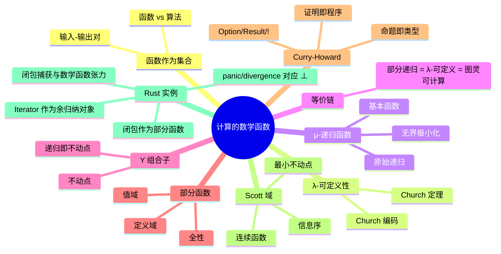

> **内容分级**: [专家级]

# 计算的数学函数（Mathematical Functions of Computation）

> **EN**: Mathematical Functions of Computation
> **Summary**: Computable functions as mathematical objects — λ-definability, fixed-point combinators, partial functions, μ-recursion, Curry-Howard correspondence, and their connection to denotational semantics via Scott domains.

> **Rust 版本**: 1.97.0+ (Edition 2024)
> **Bloom 层级**: L4-L5
> **权威来源**: 本文件为 `concept/` 权威页。
> **定位**: 把可计算函数视为数学对象，连接 λ 可定义性、不动点组合子、μ-递归、部分递归函数、Curry-Howard 对应与指称语义中的 Scott 域，并通过 Rust 函数/闭包/迭代器展示理论与实现的对应与张力。
> **前置概念**: [Unsafe Rust](../../03_advanced/02_unsafe/01_unsafe.md) · [Lambda Calculus](../00_type_theory/05_lambda_calculus.md) · [Computability Theory](02_computability_theory.md)
> **后置概念**: [Denotational Semantics](../03_operational_semantics/01_denotational_semantics.md) · [Equivalence of Computational Models](05_equivalence_of_computational_models.md)

---

## 📑 目录

- [计算的数学函数（Mathematical Functions of Computation）](#计算的数学函数mathematical-functions-of-computation)
  - [📑 目录](#-目录)
  - [一、核心概念](#一核心概念)
    - [1.1 函数作为输入-输出对的集合](#11-函数作为输入-输出对的集合)
    - [1.2 λ-可定义函数](#12-λ-可定义函数)
    - [1.3 μ-递归函数](#13-μ-递归函数)
    - [1.4 部分递归函数 = 图灵可计算函数](#14-部分递归函数--图灵可计算函数)
    - [1.5 Y 组合子与不动点组合子](#15-y-组合子与不动点组合子)
    - [1.6 部分函数：定义域、值域与全性](#16-部分函数定义域值域与全性)
    - [1.7 Curry-Howard 对应：命题即类型](#17-curry-howard-对应命题即类型)
    - [1.8 Scott 域与指称语义](#18-scott-域与指称语义)
  - [二、Rust 中的函数与数学函数](#二rust-中的函数与数学函数)
    - [2.1 闭包作为部分函数](#21-闭包作为部分函数)
    - [2.2 `fn` 的全性 vs 部分性](#22-fn-的全性-vs-部分性)
    - [2.3 `Iterator` 作为余归纳对象](#23-iterator-作为余归纳对象)
    - [2.4 闭包/迭代器与数学函数的精确对应与张力](#24-闭包迭代器与数学函数的精确对应与张力)
  - [三、反命题与边界分析](#三反命题与边界分析)
  - [四、相关概念](#四相关概念)
  - [五、嵌入式测验（Embedded Quiz）](#五嵌入式测验embedded-quiz)
    - [测验 1：λ-可定义函数与可计算性（理解层）](#测验-1λ-可定义函数与可计算性理解层)
    - [测验 2：Rust 函数与全函数（应用层）](#测验-2rust-函数与全函数应用层)
    - [测验 3：Scott 域解决的核心问题（分析层）](#测验-3scott-域解决的核心问题分析层)
    - [测验 4：Curry-Howard 对应（分析层）](#测验-4curry-howard-对应分析层)
  - [六、权威来源索引](#六权威来源索引)
  - [七、🧭 思维导图（Mindmap）](#七-思维导图mindmap)

---

## 一、核心概念

### 1.1 函数作为输入-输出对的集合

在数学中，函数 `f : A → B` 可以等价地看作集合 `A × B` 的一个子集，满足对每个 `a ∈ A` 至多有一个 `b ∈ B` 使得 `(a, b) ∈ f`。

```text
函数 vs 算法：
├── 函数：输入与输出的静态关系
│   └── 例：f(n) = n! 是一个数学函数
├── 算法：计算函数的具体步骤
│   └── 例：阶乘可以用递归、循环或查表实现
└── 同一函数可由多种算法实现
```

> **认知要点**：可计算性理论研究的是「哪些函数存在算法」，而不是「某个具体算法是否正确」。

---

### 1.2 λ-可定义函数

Church 证明了一个函数是 **λ-可定义**的，当且仅当它可以被无类型 λ 演算中的项表达。

```text
Church 定理（直觉表述）：
  一个数论函数是 λ-可定义的  ⇔  它是部分递归的  ⇔  它是图灵可计算的

例子：
  加法：add = λm.λn.λf.λx. m f (n f x)
  乘法：mul = λm.λn.λf. m (n f)
```

Church 编码把数据（数、布尔值、序对）直接编码为高阶函数，从而说明 λ 演算无需原生数据类型即可表达任意可计算函数。

---

### 1.3 μ-递归函数

μ-递归函数通过基本函数和三种规则构造所有可计算函数：

```text
基本函数：
  零函数    : Z(x) = 0
  后继函数  : S(x) = x + 1
  投影函数  : P_i^n(x₁,...,x_n) = x_i

构造规则：
  组合        : h(x) = f(g₁(x), ..., g_k(x))
  原始递归    : f(0, x) = g(x)
                f(n+1, x) = h(n, x, f(n, x))
  无界极小化  : f(x) = μy. g(x, y) = 0
                （若不存在这样的 y，则 f(x) 无定义）
```

原始递归函数对应保证终止的循环；加入 μ 算子后得到**部分递归函数**，对应可能不终止的通用计算。

---

### 1.4 部分递归函数 = 图灵可计算函数

以下三个概念刻画的是同一类函数：

```text
等价链：
  部分递归函数  =  λ-可定义函数  =  图灵可计算函数
```

这正是 Church-Turing 论题的强形式。它说明「可计算函数」这一直观概念具有惊人的稳定性：无论用递归函数、λ 演算还是图灵机形式化，得到的集合都相同。

---

### 1.5 Y 组合子与不动点组合子

在 λ 演算中，递归函数可以通过**不动点组合子（fixed-point combinator）**定义，而无需语言原生支持递归。最著名的不动点组合子是 **Y 组合子**：

```text
Y = λf. (λx. f (x x)) (λx. f (x x))

性质：对任意 λ 项 F，有 Y F = F (Y F)
      因此 Y F 是 F 的不动点
```

Y 组合子的意义在于：它把「递归定义」转化为「寻找不动点」。任何递归函数 `f = F f` 都可以写成 `f = Y F`，其中 `F` 是一个高阶函数，描述了一次递归步的行为。

> **教学类比**：可以把 `Y` 看作「重复应用直到稳定」的算子。`Y F` 先产生 `F (Y F)`，再产生 `F (F (Y F))`，依此类推，最终收敛到最小不动点。

在 Rust 中，由于类型系统要求显式类型且禁止无类型的自应用（`x x`），不能直接写出 Y 组合子。Rust 使用**显式 `fn` 递归**或**高阶函数组合**来达到同样的表达目的：

```rust
fn factorial(n: u64) -> u64 {
    if n == 0 { 1 } else { n * factorial(n - 1) }
}

fn main() {
    assert_eq!(factorial(5), 120);
}
```

这里的 `factorial` 是 `F` 的不动点，其中 `F` 可以看作：

```text
F(f)(n) = if n == 0 then 1 else n * f(n - 1)
```

Rust 编译器通过名字解析和调用栈实现这个不动点，而不是通过 λ 演算中的 Y 组合子。

> **来源**: [Barendregt 1984 — The Lambda Calculus: Its Syntax and Semantics, §6.5](https://doi.org/10.1016/S0049-237X(09)70349-9) · [Scott 1976 — Data types as lattices](https://doi.org/10.1137/0205037)

---

### 1.6 部分函数：定义域、值域与全性

**部分函数（partial function）** `f : A ⇀ B` 与**全函数（total function）** `f : A → B` 的关键区别在于：部分函数不一定对所有输入都有定义。

```text
部分函数的形式化：

  定义域  dom(f) = { a ∈ A | ∃b ∈ B. f(a) = b }
  值域    rng(f) = { b ∈ B | ∃a ∈ A. f(a) = b }

  全函数：dom(f) = A
  部分函数：dom(f) ⊂ A
  无定义输入：f(a) ↑ 或 f(a) = ⊥
```

在可计算性理论中，**部分递归函数**允许对某些输入不终止；而**全递归函数**要求对所有输入都停机。Church-Turing 论题的「强形式」通常使用部分函数，因为通用计算必然包含不终止的程序。

> **认知要点**：程序设计语言中的函数大多是部分的。即使类型签名是 `fn(T) -> U`，函数仍可能 panic、diverge 或触发 UB——这些在数学上都对应 ⊥。

---

### 1.7 Curry-Howard 对应：命题即类型

**Curry-Howard 对应**（Curry 1934; Howard 1969; 系统阐述见 Girard 1989）揭示了逻辑命题与类型系统之间的深刻同构：

| 逻辑 | 类型论 | Rust 类型示例 |
|:---|:---|:---|
| 命题 A | 类型 A | `i32`, `String` |
| 证明 | 程序 / 项 | `42`, `"hello"` |
| A ⇒ B | 函数类型 A → B | `fn(A) -> B` |
| A ∧ B | 乘积类型 A × B | `(A, B)` |
| A ∨ B | 和类型 A + B | `enum E { A(A), B(B) }` |
| ⊤（真） | 单元类型 | `()` |
| ⊥（假） | 空类型 | `!`（never type） |
| ∀x.P(x) | 依赖乘积 / 泛型 | `fn<T>(x: T) -> ...` |
| ∃x.P(x) | 依赖和 | 可用泛型 + trait 模拟 |

```text
Curry-Howard 的工程含义：
├── 类型检查 = 证明检查
├── 编写类型安全的程序 = 构造逻辑证明
├── 无法构造类型为 ⊥ 的值 = 矛盾命题无证明
└── 泛型程序对应于全称量词 ∀ 的证明
```

Rust 示例：`Result<T, E>` 对应于逻辑析取「成功返回 T 或失败返回 E」。构造 `Ok(x)` 相当于证明左析取支，构造 `Err(e)` 相当于证明右析取支。

```rust
fn safe_divide(x: f64, y: f64) -> Result<f64, &'static str> {
    if y == 0.0 { Err("division by zero") } else { Ok(x / y) }
}

fn main() {
    assert_eq!(safe_divide(10.0, 2.0), Ok(5.0));
    assert_eq!(safe_divide(10.0, 0.0), Err("division by zero"));
}
```

> **来源**: [Girard, Lafont & Taylor 1989 — Proofs and Types](https://www.paultaylor.eu/stable/Proofs+Types.html) · [Wadler 2015 — Propositions as Types](https://doi.org/10.1145/2699407) · [Barendregt 1984 — §4.4](https://doi.org/10.1016/S0049-237X(09)70349-9)

---

### 1.8 Scott 域与指称语义

无类型 λ 演算中的自应用（如 `x x`）无法直接用普通集合论函数解释，因为不存在集合 `D` 使得 `D ≅ D → D`。Dana Scott 引入了**Scott 域**来解决这一问题。

```text
Scott 域的关键思想：
├── 在域上引入偏序关系 ⊑（信息序）
├── 元素可以是「部分定义」的（⊥ 表示无信息）
├── 只考虑连续函数（continuous functions）
└── 存在域 D 使得 D ≅ [D → D]（连续函数空间）

不动点定理：
  对任意连续函数 f : D → D，存在最小不动点 fix(f) = ⊔{fⁿ(⊥) | n ≥ 0}
  这为递归定义提供了数学基础。
```

> **来源**: [Scott 1976 — Data types as lattices](https://doi.org/10.1137/0205037) · [Scott 1982 — Domains for Denotational Semantics](https://www.cs.ox.ac.uk/files/3287/PRG19.pdf) · [Scott & Strachey — Toward a Mathematical Semantics](https://www.cs.ox.ac.uk/files/3232/PRG06.pdf)

---

## 二、Rust 中的函数与数学函数

### 2.1 闭包作为部分函数

Rust 闭包在运行时可能 panic 或无限循环，因此它们对应的是**部分函数**而非全函数：

```rust
fn reciprocal(x: f64) -> f64 {
    if x == 0.0 {
        panic!("division by zero")
    } else {
        1.0 / x
    }
}

fn main() {
    assert_eq!(reciprocal(2.0), 0.5);
}
```

从数学上看，`reciprocal` 在 `0.0` 处无定义（⊥）。Rust 选择 panic 来表示这种无定义，而不是像指称语义那样把结果映射为 ⊥。

### 2.2 `fn` 的全性 vs 部分性

Rust 不保证函数对所有输入都终止或都不 panic。因此 Rust 函数类型 `fn(T) -> U` 更准确地说是**部分函数**的承诺：对合法输入返回 `U`，对非法输入可能 panic 或发散。

```rust
fn diverges() -> ! {
    loop {}
}

fn main() {
    // diverges() 永远不会返回，对应数学函数中的 ⊥
}
```

### 2.3 `Iterator` 作为余归纳对象

Rust 的 `Iterator` trait 可以被看作一个**余归纳（coinductive）**对象：它通过反复调用 `next` 产生潜在无限的元素流。

```rust
fn main() {
    let naturals = std::iter::successors(Some(0), |n| Some(n + 1));
    let first_five: Vec<_> = naturals.take(5).collect();
    assert_eq!(first_five, vec![0, 1, 2, 3, 4]);
}
```

从指称语义看，无限流是最终余代数（final coalgebra）的元素；从操作语义看，它是按需生成下一个元素的过程。

> **来源**: [Rust Reference — Closures](https://doc.rust-lang.org/reference/types/closure.html) · [TRPL — Iterators](https://doc.rust-lang.org/book/ch13-02-iterators.html)

---

### 2.4 闭包/迭代器与数学函数的精确对应与张力

Rust 的闭包和迭代器在直觉上对应数学函数，但存在若干张力：

#### 张力 1：闭包捕获环境 vs 数学函数的纯输入

数学函数只依赖于显式参数；Rust 闭包可以捕获外部环境，从而隐式依赖于运行时状态。

```rust
fn main() {
    let mut counter = 0;
    let mut bump = || {
        counter += 1;
        counter
    };
    assert_eq!(bump(), 1);
    assert_eq!(bump(), 2);
}
```

> 同一个闭包 `bump` 在两次调用时返回不同结果，这在数学上不是函数（函数要求相同输入产生相同输出）。但在 Rust 中，这是通过 `&mut self` 实现的合法副作用。

#### 张力 2：迭代器作为部分函数序列

`Iterator::next` 的类型签名是 `fn next(&mut self) -> Option<Self::Item>`。它可以被看作一个**部分函数序列**：

```text
next⁰ : () → Option<Item>   （第一次调用）
next¹ : () → Option<Item>   （第二次调用）
...
```

每次调用都消耗迭代器的内部状态，因此它不是一个单纯的数学函数 `() → Option<Item>`，而是一个**状态迁移函数**。

#### 张力 3：全函数类型 vs 部分函数行为

Rust 的类型系统把所有函数都看作全函数：每个 `fn(T) -> U` 都对所有 `T` 有定义。但运行时的 panic、发散和 UB 使得实际行为是部分的。类型系统用 `Option<T>`、`Result<T,E>`、`!` 等类型显式编码部分性，但普通 `fn` 的 ⊥ 行为仍被隐藏。

#### `compile_fail` 反例：无类型自应用

下面的代码展示了 Rust 类型系统如何拒绝 λ 演算中的无类型自应用 `x x`，这正是 Curry-Howard 与 Scott 域需要处理的核心问题：

```rust,compile_fail,E0277
fn main() {
    // 试图构造 |x| x(x) 会被类型系统拒绝
    let self_apply = |x: &dyn Fn(&dyn Fn())| x(x);
    let id = |()| ();
    self_apply(&id);
}
```

错误原因：Rust 要求函数类型显式、有界，不允许无约束的自引用类型。这与无类型 λ 演算形成鲜明对比，也说明为什么 Scott 域需要在**有结构的域**上才能一致地解释自应用。

> **来源**: [Rust Reference — Closures](https://doc.rust-lang.org/reference/types/closure.html) · [Rust Reference — Iterators](https://doc.rust-lang.org/std/iter/trait.Iterator.html) · [Barendregt 1984 — §6.1](https://doi.org/10.1016/S0049-237X(09)70349-9)

---

## 三、反命题与边界分析

常见误判：**「每个 Rust 函数都对应一个全数学函数」**。

这是错误的。Rust 函数可能因为以下原因对应部分函数：

1. **panic**：如 `reciprocal(0.0)` 在数学上无定义，Rust 用 panic 表示 ⊥。
2. **发散**：如 `diverges()` 永远不返回，对应无定义。
3. **副作用与 IO**：数学函数是纯映射，Rust 函数可以读写外部状态。
4. **非确定性**：多线程或随机数函数在相同输入下可能产生不同输出。
5. **闭包捕获**：相同参数在不同调用下可能返回不同结果。
6. **Curry-Howard 限制**：Rust 类型系统不能表达所有逻辑命题；某些「显然正确」的程序因类型表达能力不足而无法通过检查。

```text
边界极限：
├── Rust 函数 ≈ 部分数学函数 + 副作用 + 资源管理
├── panic/divergence 对应数学中的 ⊥
├── 闭包捕获环境使函数带有隐式参数
├── 迭代器/流引入余归纳对象，超越有限集合论函数
└── 类型系统通过 Option/Result/! 显式编码部分性
```

---

## 四、相关概念

- [Lambda Calculus](../00_type_theory/05_lambda_calculus.md) — λ 演算与函数抽象
- [Computability Theory](02_computability_theory.md) — 可计算性理论与部分递归函数
- [Denotational Semantics](../03_operational_semantics/01_denotational_semantics.md) — 程序到数学对象的映射
- [Type Semantics](../00_type_theory/06_type_semantics.md) — 类型作为语义分类
- [Equivalence of Computational Models](05_equivalence_of_computational_models.md) — 模型等价与表达力

---

## 五、嵌入式测验（Embedded Quiz）

### 测验 1：λ-可定义函数与可计算性（理解层）

一个数论函数是 λ-可定义的，当且仅当它是：

- A. 原始递归的
- B. 图灵可计算的
- C. 多项式时间可计算的
- D. 全递归的

<details>
<summary>✅ 答案</summary>

**B. 图灵可计算的**。Church 定理说明 λ-可定义函数、部分递归函数和图灵可计算函数三者等价。
</details>

---

### 测验 2：Rust 函数与全函数（应用层）

下面的 Rust 函数 `reciprocal` 对应数学上的什么？

```rust
fn reciprocal(x: f64) -> f64 {
    if x == 0.0 { panic!("zero") } else { 1.0 / x }
}
```

- A. 全函数，对所有 f64 有定义
- B. 部分函数，在 0.0 处无定义
- C. 多值函数，对 0.0 返回多个值
- D. 常量函数

<details>
<summary>✅ 答案</summary>

**B. 部分函数，在 0.0 处无定义**。panic 表示该输入在数学上对应 ⊥。
</details>

---

### 测验 3：Scott 域解决的核心问题（分析层）

Scott 域引入连续函数和偏序的主要目的是什么？

- A. 让无类型 λ 演算可以被普通集合论解释
- B. 让自引用类型（如 `D ≅ D → D`）有一致的数学模型
- C. 提高程序运行速度
- D. 简化类型检查算法

<details>
<summary>✅ 答案</summary>

**B. 让自引用类型（如 `D ≅ D → D`）有一致的数学模型**。普通集合论中不存在这样的集合，Scott 域通过信息序和连续函数解决这一矛盾。
</details>

---

### 测验 4：Curry-Howard 对应（分析层）

在 Curry-Howard 对应中，Rust 的 `Result<T, E>` 最接近于哪种逻辑构造？

- A. 合取 A ∧ B
- B. 析取 T ∨ E
- C. 蕴含 T → E
- D. 否定 ¬T

<details>
<summary>✅ 答案</summary>

**B. 析取 T ∨ E**。`Result<T, E>` 表示「要么是 T，要么是 E」，对应逻辑析取。`Ok(t)` 证明左支，`Err(e)` 证明右支。
</details>

---

## 六、权威来源索引

| 来源 | 可信度 | 说明 |
|:---|:---:|:---|
| [Church 1941 — The Calculi of Lambda-Conversion](https://doi.org/10.2307/2267173) | ✅ 一级 | λ 可定义性 |
| [Kleene 1943 — Recursive Predicates and Quantifiers](https://doi.org/10.2307/2268819) | ✅ 一级 | μ-递归函数 |
| [Barendregt 1984 — The Lambda Calculus: Its Syntax and Semantics](https://doi.org/10.1016/S0049-237X(09)70349-9) | ✅ 一级 | λ 演算、Y 组合子、Curry-Howard |
| [Scott 1976 — Data types as lattices](https://doi.org/10.1137/0205037) | ✅ 一级 | Scott 域、不动点语义 |
| [Scott 1982 — Domains for Denotational Semantics](https://www.cs.ox.ac.uk/files/3287/PRG19.pdf) | ✅ 一级 | Scott 域 |
| [Scott & Strachey — Denotational Semantics](https://www.cs.ox.ac.uk/files/3232/PRG06.pdf) | ✅ 一级 | 指称语义奠基 |
| [Girard, Lafont & Taylor 1989 — Proofs and Types](https://www.paultaylor.eu/stable/Proofs+Types.html) | ✅ 一级 | Curry-Howard 对应系统阐述 |
| [Wadler 2015 — Propositions as Types](https://doi.org/10.1145/2699407) | ✅ 一级 | Curry-Howard 现代综述 |
| [Rust Reference — Closures](https://doc.rust-lang.org/reference/types/closure.html) | ✅ 一级 | Rust 闭包 |
| [TRPL — Iterators](https://doc.rust-lang.org/book/ch13-02-iterators.html) | ✅ 一级 | Rust 迭代器 |

---

## 七、🧭 思维导图（Mindmap）


