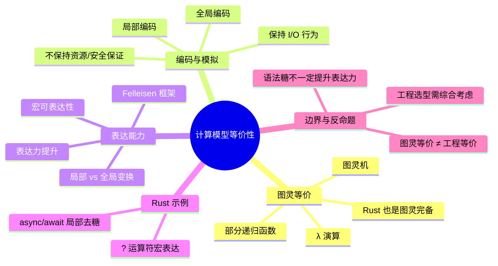

> **内容分级**: [专家级]

# 计算模型等价性（Equivalence of Computational Models）

> **EN**: Equivalence of Computational Models
> **Summary**: Turing equivalence, expressiveness comparisons, and Felleisen's framework for measuring the expressive power of programming language constructs.

> **Rust 版本**: 1.97.0+ (Edition 2024)
> **Bloom 层级**: L4-L5
> **权威来源**: 本文件为 `concept/` 权威页。
> **定位**: 从图灵等价、模型间编码与 Felleisen 表达力三个角度，说明「所有图灵完备语言计算能力相同」与「工程语言表达能力不同」为何同时成立，并把这一理论映射到 Rust 的 `async/await` 与 `?` 等语法构造。
> **前置概念**: [Concurrency](../../03_advanced/00_concurrency/01_concurrency.md) · [Computational Semantics Framework](01_computational_semantics_framework.md) · [Computability Theory](02_computability_theory.md) · [Mathematical Functions of Computation](04_mathematical_functions_of_computation.md)
> **后置概念**: [Algorithm Equivalence](../08_algorithm_semantics/05_algorithm_equivalence.md) · [Concurrency Models](../12_concurrency_models/README.md) · [Semantic Space](../../00_meta/00_framework/semantic_space.md)

---

## 📑 目录

- [计算模型等价性（Equivalence of Computational Models）](#计算模型等价性equivalence-of-computational-models)
  - [📑 目录](#-目录)
  - [一、核心概念](#一核心概念)
    - [1.1 图灵等价](#11-图灵等价)
    - [1.2 编码：从一种模型到另一种模型](#12-编码从一种模型到另一种模型)
    - [1.3 表达能力 ≠ 计算能力](#13-表达能力--计算能力)
  - [二、Felleisen 表达力框架](#二felleisen-表达力框架)
  - [三、Rust 中的局部变换与宏表达](#三rust-中的局部变换与宏表达)
    - [3.1 `async/await`：Future 状态机的局部去糖](#31-asyncawaitfuture-状态机的局部去糖)
    - [3.2 `?` 运算符：`Try` 分支的宏表达](#32--运算符try-分支的宏表达)
  - [四、反命题与边界分析](#四反命题与边界分析)
  - [五、相关概念](#五相关概念)
  - [六、嵌入式测验（Embedded Quiz）](#六嵌入式测验embedded-quiz)
    - [测验 1：图灵等价的含义（理解层）](#测验-1图灵等价的含义理解层)
    - [测验 2：`async/await` 的表达力地位（应用层）](#测验-2asyncawait-的表达力地位应用层)
    - [测验 3：`?` 运算符的可表达性（应用层）](#测验-3-运算符的可表达性应用层)
    - [测验 4：Felleisen 表达力提升的判定标准（分析层）](#测验-4felleisen-表达力提升的判定标准分析层)
    - [测验 5：图灵等价与工程等价（评价层）](#测验-5图灵等价与工程等价评价层)
  - [七、权威来源索引](#七权威来源索引)
  - [八、🧭 思维导图（Mindmap）](#八-思维导图mindmap)

---

## 一、核心概念

### 1.1 图灵等价

如果两种计算模型都能计算完全相同的部分可计算函数集合，则称它们是**图灵等价（Turing-equivalent）**的。直观地说：只要一种语言可以模拟通用图灵机，它就能表达任何其他图灵完备模型所能表达的算法。

```text
图灵等价的典型模型：
├── 图灵机（Turing machine）
├── 无类型 λ 演算（Untyped λ-calculus）
├── 部分递归函数（Partial recursive functions）
├── 寄存器机 / RAM 模型
├── 细胞自动机（如 Conway's Game of Life）
└── 所有主流通用编程语言（包括 Rust）
```

> **认知要点**：图灵等价只说明「能算什么」，不说明「算得多快」「写得多自然」「编译器能多有效地优化」。Rust 的所有权系统、类型系统、零成本抽象都不改变其图灵完备性，却显著改变了可维护的代码形态。

---

### 1.2 编码：从一种模型到另一种模型

模型 A 可以被**编码（encoded）**进模型 B，当且仅当存在一个完全可计算的翻译函数 `⟦·⟧`，使得 A 中程序 `p` 在输入 `i` 上的输出，与 B 中程序 `⟦p⟧` 在编码后的输入 `⟦i⟧` 上的输出一致：

```text
  A(p, i) ↓ o    ⇔    B(⟦p⟧, ⟦i⟧) ↓ ⟦o⟧
```

这里的关键是翻译的**复杂度**：

- **局部编码（local encoding）**：把 A 的某个构造替换为 B 的一段局部代码，不影响程序其余结构。例如把 `?` 替换为 `match`。
- **全局编码（global encoding）**：需要重写整个程序结构。例如把有 `goto` 的汇编翻译为结构化控制流，往往需要引入辅助变量和状态机。

```text
编码 preserving 的性质：
├── 输入/输出行为（I/O behavior）          — 必须保持
├── 终止性（termination）                  — 通常保持
├── 资源使用（时间/空间复杂度）            — 通常不保持
├── 类型安全/内存安全保证                  — 通常不保持
└── 可组合性与模块化                       — 通常不保持
```

---

### 1.3 表达能力 ≠ 计算能力

「图灵等价」经常被误解为「所有语言都一样强」。这是把**计算能力（computational power）**与**表达能力（expressive power）**混为一谈。

| 维度 | 图灵等价关心 | 表达能力关心 |
|:---|:---|:---|
| 核心问题 | 能计算哪些函数 | 表达一个概念需要多少语法/语义代价 |
| 比较单位 | 可计算函数集合 | 构造是否需要全局重写、是否引入运行时开销 |
| 典型例子 | Rust 与 Brainfuck 等价 | Rust 的 `async/await` 比手写状态机更易维护 |
| 形式化工具 | 可计算性理论 | Felleisen 表达力框架 |

> **关键结论**：图灵等价是「能力下限」的等价，表达能力是「工程成本」的差异。

---

## 二、Felleisen 表达力框架

Matthias Felleisen 在 1991 年提出了一种比较语言构造表达力的方法，核心问题是：

> 给语言 L 增加一个构造 C 后，是否必须对 L 程序进行全局重组才能模拟 C 的语义？

如果 C 可以通过**宏（macro）**或局部语法糖消除（desugar）而不改变程序整体结构，则 C 没有提高表达力；如果需要全局变换，则 C 真正增强了表达力。

```text
Felleisen 框架的核心概念：
├── 宏可表达性（macro-expressibility）
│   └── 构造 C 能被局部展开为已有构造的语法组合
├── 局部变换（local transformation）
│   └── 仅影响包含 C 的表达式，不波及上下文
├── 全局变换（global transformation）
│   └── 需要重写整个模块/程序的控制流或数据结构
└── 表达力提升（expressiveness increase）
    └── 无法用局部宏表达，必须引入新的语义原语
```

经典例子：

- **`let` 表达式**：仅是 λ 抽象的语法糖，不增加表达力。
- **异常处理 `try/catch`**：在纯 λ 演算中无法通过局部宏表达而不改变所有可能抛出异常的函数签名，因此通常被认为是表达力提升。
- **可变状态（assignment）**：在纯函数式语言中需要全局引入存储（store）概念，表达力提升。

> **来源**: [Felleisen 1991 — On the Expressive Power of Programming Languages](https://doi.org/10.1007/BF00119888)

---

## 三、Rust 中的局部变换与宏表达

Rust 的许多「语法糖」都是**局部变换**或**宏可表达**的：它们让代码更简洁，却不要求程序员重写整个程序结构。下面以 `async/await` 和 `?` 为例。

### 3.1 `async/await`：Future 状态机的局部去糖

`async fn` 和 `.await` 并不引入新的计算能力——任何 `async` 函数都可以被手动改写为一个实现 `std::future::Future` 的状态机。然而，它们把「状态保存、挂起点恢复、waker 注册」这些原本需要全局重写的机械劳动，压缩成编译器自动生成的局部转换。

```rust
async fn say_hello() -> String {
    "hello".to_string()
}

fn main() {
    // 调用 async fn 只是构造 Future 状态机，并不执行 body
    let _future = say_hello();

    // .await 是状态机的一次 poll 挂起/恢复点
    let _ = async {
        let s = say_hello().await;
        println!("{}", s);
    };
}
```

从 Felleisen 框架看，`async/await` 是一种**局部变换**：`async {}` 块的语义可以通过局部去糖为状态机类型，`.await` 可以局部替换为对 `Future::poll` 的调用，而不需要改写调用者以外的代码。

> **来源**: [Rust Reference — Async functions](https://doc.rust-lang.org/reference/items/functions.html#async-functions) · [RFC 2394 — async/await](https://rust-lang.github.io/rfcs/2394-async_await.html)

---

### 3.2 `?` 运算符：`Try` 分支的宏表达

`?` 运算符是 Rust 中典型的**宏可表达**构造。表达式 `expr?` 在语义上等价于：

```text
match Try::branch(expr) {
    ControlFlow::Continue(v) => v,
    ControlFlow::Break(e) => return Try::from_residual(e),
}
```

下面的代码在语义上是等价的：

```rust
use std::num::ParseIntError;

fn with_question(s: &str) -> Result<i32, ParseIntError> {
    let n: i32 = s.parse()?;
    Ok(n + 1)
}

fn desugared(s: &str) -> Result<i32, ParseIntError> {
    match s.parse() {
        Ok(n) => Ok(n + 1),
        Err(e) => return Err(e),
    }
}

fn main() {
    assert_eq!(with_question("5"), Ok(6));
    assert_eq!(desugared("5"), Ok(6));
}
```

`?` 不改变可计算函数集合，也不改变调用者/被调用者的结构；它只是一个局部的错误传播缩写。因此它不提升 Felleisen 意义上的表达力，但显著降低了错误处理的心智负担。

> **来源**: [Rust Reference — The ? operator](https://doc.rust-lang.org/reference/expressions/operator-expr.html#the-question-mark-operator) · [RFC 3058 — Try trait v2](https://rust-lang.github.io/rfcs/3058-try-trait-v2.html)

---

## 四、反命题与边界分析

本节澄清关于「图灵等价」与「表达力」的两个常见误判：

1. **「图灵等价 ⇒ 所有语言在工程上等价」**：错。Brainfuck 与 Rust 图灵等价，但前者无法表达 Rust 的所有权、模块化、类型安全等工程概念。图灵等价只保证可计算函数集合相同，不保证代码可读性、可维护性、性能或可验证性。
2. **「语言构造越方便，表达力就越高」**：错。`?` 和 `async/await` 极大改善了 ergonomics，但它们分别是宏可表达和局部可去糖的，因此并未在 Felleisen 意义上提升表达力。真正提升表达力的构造往往需要引入新的语义原语（如 first-class continuations、unrestricted mutable state）。

```text
边界极限：
├── 图灵等价不关心「变换复杂度」
├── 表达能力度量的是「表达概念的局部/全局代价」
├── Rust 的类型系统/所有权系统不扩展可计算函数集合
│   但限制了可表达的「安全程序」集合
└── 工程选型应同时考虑计算能力、表达能力、性能与可验证性
```

> **P0 官方来源**: [Rust Reference — Async functions](https://doc.rust-lang.org/reference/items/functions.html#async-functions) · [a-mir-formality — Rust 形式化规格](https://github.com/rust-lang/a-mir-formality)

---

## 五、相关概念

- [Computational Semantics Framework](01_computational_semantics_framework.md) — 四种语义视角的统一框架
- [Computability Theory](02_computability_theory.md) — 图灵机、可计算函数与停机问题
- [Mathematical Functions of Computation](04_mathematical_functions_of_computation.md) — 可计算函数的数学对象
- [Lambda Calculus](../00_type_theory/05_lambda_calculus.md) — λ 演算与函数式计算模型
- [Operational Semantics](../03_operational_semantics/03_operational_semantics.md) — 程序行为的小步/大步形式化
- [Algorithm Equivalence](../08_algorithm_semantics/05_algorithm_equivalence.md) — 算法层面的等价与优化保持
- [Semantic Space](../../00_meta/00_framework/semantic_space.md) — 概念空间中的「能表达边界」

---

## 六、嵌入式测验（Embedded Quiz）

### 测验 1：图灵等价的含义（理解层）

如果两种编程语言是图灵等价的，这意味着什么？

- A. 它们编译后的机器码完全相同
- B. 它们能计算完全相同的部分可计算函数集合
- C. 它们写出的程序性能相同
- D. 它们的类型系统能力相同

<details>
<summary>✅ 答案</summary>

**B. 它们能计算完全相同的部分可计算函数集合**。

图灵等价只关乎「可计算函数集合」是否相同，与编译产物、运行时性能、类型系统或工程 ergonomics 无关。
</details>

---

### 测验 2：`async/await` 的表达力地位（应用层）

在 Felleisen 表达力框架中，`async/await` 主要属于哪一类？

- A. 全局变换：必须重写整个程序结构
- B. 局部变换：可把 async 块局部去糖为状态机
- C. 表达力提升：引入了图灵机无法表达的新能力
- D. 与手写 Future 状态机相比计算能力更强

<details>
<summary>✅ 答案</summary>

**B. 局部变换：可把 async 块局部去糖为状态机**。

`async/await` 不扩展可计算函数集合；它只是把「手写 Future 状态机」这一机械工作交给编译器完成，属于局部语法/语义转换。
</details>

---

### 测验 3：`?` 运算符的可表达性（应用层）

`expr?` 在语义上等价于哪种构造？

- A. `expr.unwrap()`
- B. 一个 `match` 分支，遇到错误时提前返回
- C. `expr.map(|v| v)`
- D. `panic!()`

<details>
<summary>✅ 答案</summary>

**B. 一个 `match` 分支，遇到错误时提前返回**。

`?` 展开为对 `Try::branch` 的匹配：成功则继续，失败则通过 `from_residual` 返回错误。它等价于手写 `match`，但 ergonomics 更好。
</details>

---

### 测验 4：Felleisen 表达力提升的判定标准（分析层）

下列哪种情况说明构造 C 真正提升了语言的表达力？

- A. C 让代码变短了
- B. C 能用局部宏完全展开为已有构造
- C. 模拟 C 必须引入新的语义原语或全局重写程序
- D. C 提高了运行时性能

<details>
<summary>✅ 答案</summary>

**C. 模拟 C 必须引入新的语义原语或全局重写程序**。

Felleisen 框架认为，只有无法通过局部宏表达的构造才提升表达力。代码长度、性能或局部语法糖都不是表达力提升的判据。
</details>

---

### 测验 5：图灵等价与工程等价（评价层）

以下论断哪一个是**错误**的？

- A. Rust 与 Brainfuck 在计算能力上是等价的
- B. 图灵等价意味着两种语言表达同一算法的工程成本相同
- C. 表达一个概念所需的全局重写越多，语言的表达力在该维度上越弱
- D. Rust 的所有权系统不改变其图灵完备性

<details>
<summary>✅ 答案</summary>

**B. 图灵等价意味着两种语言表达同一算法的工程成本相同**。

这是常见误解。图灵等价只说明「能算什么」相同，工程成本、可维护性、安全性、性能可以天差地别。表达力框架正是为了度量这种差异。
</details>

---

## 七、权威来源索引

| 来源 | 可信度 | 说明 |
|:---|:---:|:---|
| [Turing 1936 — On Computable Numbers](https://doi.org/10.1112/plms/s2-42.1.230) | ✅ 一级 | 图灵机与可计算性奠基 |
| [Church 1936 — An Unsolvable Problem of Elementary Number Theory](https://doi.org/10.2307/1968981) | ✅ 一级 | λ 可定义函数与 Church-Turing 论题 |
| [Felleisen 1991 — On the Expressive Power of Programming Languages](https://doi.org/10.1007/BF00119888) | ✅ 一级 | 表达力比较框架 |
| [Plotkin 1981 — SOS](https://homepages.inf.ed.ac.uk/gdp/publications/sos_jlap.pdf) | ✅ 一级 | 结构化操作语义 |
| [Rust Reference — Async functions](https://doc.rust-lang.org/reference/items/functions.html#async-functions) | ✅ 一级 | Rust async 函数语义 |
| [RFC 2394 — async/await](https://rust-lang.github.io/rfcs/2394-async_await.html) | ✅ 一级 | Rust async/await 设计 |
| [a-mir-formality](https://github.com/rust-lang/a-mir-formality) | ✅ 一级 | Rust 形式化规格官方项目 |

---

## 八、🧭 思维导图（Mindmap）



> **认知功能**: 本思维导图从「等价」「编码」「表达力」「Rust 实例」「边界」五个维度组织本页内容，帮助把图灵等价这一抽象结论与 `async/await`、`?` 等具体语言构造联系起来。
