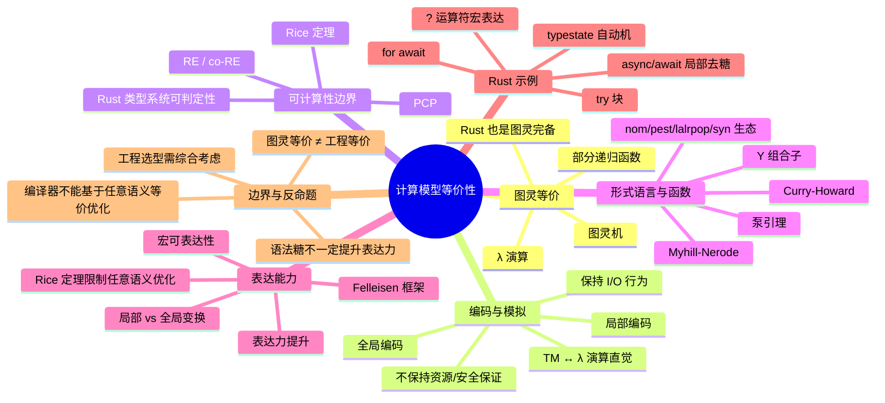

> **内容分级**: [专家级]

# 计算模型等价性（Equivalence of Computational Models）

> **EN**: Equivalence of Computational Models
> **Summary**: Turing equivalence, expressiveness comparisons, and Felleisen's framework for measuring the expressive power of programming language constructs.

> **Rust 版本**: 1.97.0+ (Edition 2024)
> **Bloom 层级**: L4-L5
> **权威来源**: 本文件为 `concept/` 权威页。
> **定位**: 从图灵等价、模型间编码与 Felleisen 表达力三个角度，说明「所有图灵完备语言计算能力相同」与「工程语言表达能力不同」为何同时成立，并把这一理论映射到 Rust 的 `async/await` 与 `?` 等语法构造。
> **前置概念**: [Concurrency](../../03_advanced/00_concurrency/01_concurrency.md) · [Computational Semantics Framework](01_computational_semantics_framework.md) · [Computability Theory](02_computability_theory.md) · [Mathematical Functions of Computation](04_mathematical_functions_of_computation.md)
> **后置概念**: [Algorithm Equivalence](../08_algorithm_semantics/05_algorithm_equivalence.md) · [Concurrency Models](../12_concurrency_models/README.md) · [Semantic Space](../../00_meta/00_framework/semantic_space.md)

---

## 📑 目录

- [计算模型等价性（Equivalence of Computational Models）](#计算模型等价性equivalence-of-computational-models)
  - [📑 目录](#-目录)
  - [一、核心概念](#一核心概念)
    - [1.1 图灵等价](#11-图灵等价)
    - [1.2 编码：从一种模型到另一种模型](#12-编码从一种模型到另一种模型)
    - [1.3 表达能力 ≠ 计算能力](#13-表达能力--计算能力)
    - [1.4 Rice 定理与程序语义性质的不可判定性](#14-rice-定理与程序语义性质的不可判定性)
    - [1.5 递归可枚举 / 共递归可枚举与 Rust 类型系统判定性](#15-递归可枚举--共递归可枚举与-rust-类型系统判定性)
    - [1.6 具体编码直觉：图灵机 ↔ λ 演算](#16-具体编码直觉图灵机--λ-演算)
      - [图灵机模拟 λ 演算](#图灵机模拟-λ-演算)
      - [λ 演算模拟图灵机](#λ-演算模拟图灵机)
      - [Rust 投影：async/await 作为局部编码](#rust-投影asyncawait-作为局部编码)
    - [1.7 形式语言边界：泵引理、Myhill-Nerode 与 Rust 解析生态](#17-形式语言边界泵引理myhill-nerode-与-rust-解析生态)
      - [泵引理与正则/上下文无关边界](#泵引理与正则上下文无关边界)
      - [Myhill-Nerode 定理](#myhill-nerode-定理)
      - [Rust 解析生态映射](#rust-解析生态映射)
    - [1.8 数学函数视角：Y 组合子、Curry-Howard 与 Rust 闭包 / 迭代器](#18-数学函数视角y-组合子curry-howard-与-rust-闭包--迭代器)
      - [Y 组合子与不动点](#y-组合子与不动点)
      - [部分函数的定义域与值域](#部分函数的定义域与值域)
      - [Curry-Howard 对应：命题即类型](#curry-howard-对应命题即类型)
      - [Rust 闭包 / 迭代器与数学函数的精确对应与张力](#rust-闭包--迭代器与数学函数的精确对应与张力)
  - [二、Felleisen 表达力框架](#二felleisen-表达力框架)
    - [Rice 定理与编译器优化正确性](#rice-定理与编译器优化正确性)
  - [三、Rust 中的局部变换与宏表达](#三rust-中的局部变换与宏表达)
    - [3.1 `async/await`：Future 状态机的局部去糖](#31-asyncawaitfuture-状态机的局部去糖)
    - [3.2 `?` 运算符：`Try` 分支的宏表达](#32--运算符try-分支的宏表达)
    - [3.3 `try` 块：受控的错误作用域](#33-try-块受控的错误作用域)
    - [3.4 `for await` 与异步迭代：状态机的局部去糖](#34-for-await-与异步迭代状态机的局部去糖)
  - [四、反命题与边界分析](#四反命题与边界分析)
  - [五、相关概念](#五相关概念)
  - [六、嵌入式测验（Embedded Quiz）](#六嵌入式测验embedded-quiz)
    - [测验 1：图灵等价的含义（理解层）](#测验-1图灵等价的含义理解层)
    - [测验 2：`async/await` 的表达力地位（应用层）](#测验-2asyncawait-的表达力地位应用层)
    - [测验 3：`?` 运算符的可表达性（应用层）](#测验-3-运算符的可表达性应用层)
    - [测验 4：Felleisen 表达力提升的判定标准（分析层）](#测验-4felleisen-表达力提升的判定标准分析层)
    - [测验 5：图灵等价与工程等价（评价层）](#测验-5图灵等价与工程等价评价层)
    - [测验 6：Rice 定理对编译器优化的限制（分析层）](#测验-6rice-定理对编译器优化的限制分析层)
    - [测验 7：Rust 解析工具与形式语言层级（应用层）](#测验-7rust-解析工具与形式语言层级应用层)
  - [七、权威来源 / International Authority References](#七权威来源--international-authority-references)
  - [八、🧭 思维导图（Mindmap）](#八-思维导图mindmap)

---

## 一、核心概念

### 1.1 图灵等价

如果两种计算模型都能计算完全相同的部分可计算函数集合，则称它们是**图灵等价（Turing-equivalent）**的。直观地说：只要一种语言可以模拟通用图灵机，它就能表达任何其他图灵完备模型所能表达的算法。Turing 的原始论文与 Church 的 λ 可定义性研究共同奠定了这一等价观察（Turing, 1936; Church, 1936; Sipser, 2013, §3.3）。

```text
图灵等价的典型模型：
├── 图灵机（Turing machine）
├── 无类型 λ 演算（Untyped λ-calculus）
├── 部分递归函数（Partial recursive functions）
├── 寄存器机 / RAM 模型
├── 细胞自动机（如 Conway's Game of Life）
└── 所有主流通用编程语言（包括 Rust）
```

> **认知要点**：图灵等价只说明「能算什么」，不说明「算得多快」「写得多自然」「编译器能多有效地优化」。Rust 的所有权系统、类型系统、零成本抽象都不改变其图灵完备性，却显著改变了可维护的代码形态。

---

### 1.2 编码：从一种模型到另一种模型

模型 A 可以被**编码（encoded）**进模型 B，当且仅当存在一个完全可计算的翻译函数 `⟦·⟧`，使得 A 中程序 `p` 在输入 `i` 上的输出，与 B 中程序 `⟦p⟧` 在编码后的输入 `⟦i⟧` 上的输出一致：

```text
  A(p, i) ↓ o    ⇔    B(⟦p⟧, ⟦i⟧) ↓ ⟦o⟧
```

这里的关键是翻译的**复杂度**：

- **局部编码（local encoding）**：把 A 的某个构造替换为 B 的一段局部代码，不影响程序其余结构。例如把 `?` 替换为 `match`。
- **全局编码（global encoding）**：需要重写整个程序结构。例如把有 `goto` 的汇编翻译为结构化控制流，往往需要引入辅助变量和状态机。

```text
编码 preserving 的性质：
├── 输入/输出行为（I/O behavior）          — 必须保持
├── 终止性（termination）                  — 通常保持
├── 资源使用（时间/空间复杂度）            — 通常不保持
├── 类型安全/内存安全保证                  — 通常不保持
└── 可组合性与模块化                       — 通常不保持
```

---

### 1.3 表达能力 ≠ 计算能力

「图灵等价」经常被误解为「所有语言都一样强」。这是把**计算能力（computational power）**与**表达能力（expressive power）**混为一谈。

| 维度 | 图灵等价关心 | 表达能力关心 |
|:---|:---|:---|
| 核心问题 | 能计算哪些函数 | 表达一个概念需要多少语法/语义代价 |
| 比较单位 | 可计算函数集合 | 构造是否需要全局重写、是否引入运行时开销 |
| 典型例子 | Rust 与 Brainfuck 等价 | Rust 的 `async/await` 比手写状态机更易维护 |
| 形式化工具 | 可计算性理论 | Felleisen 表达力框架 |

> **关键结论**：图灵等价是「能力下限」的等价，表达能力是「工程成本」的差异。

---

### 1.4 Rice 定理与程序语义性质的不可判定性

**Rice 定理**指出：任何关于程序所计算部分递归函数的非平凡性质都是不可判定的。所谓「非平凡」，是指该性质对部分程序成立、对部分程序不成立；所谓「语义性质」，是指只依赖于程序的外部行为（输入-输出关系），而不依赖于其具体语法实现。

```text
Rice 定理的直觉：
├── 可判定性质：程序的文本长度是否为偶数（语法性质）
├── 不可判定性质：程序是否对所有输入返回 0（语义性质）
├── 不可判定性质：两个程序是否计算同一函数
├── 不可判定性质：程序是否总是停机
└── 推论：不存在通用的「程序等价性判定器」
```

对 Rust 工程实践而言，Rice 定理意味着编译器**不能**在一般情况下判定两个函数是否语义等价。因此，编译器优化必须基于被严格证明的**局部观察等价性**（如常量折叠、内联、死代码消除），而不是任意语义比较。

```rust
// ✅ 编译器可以做的：基于纯语法/局部语义的常量折叠
fn foldable() -> i32 {
    let x = 2 + 3;
    x * 2
}
// 等价于返回 10；这是由算术定律保证的局部变换

fn main() {
    assert_eq!(foldable(), 10);
}
```

```rust,compile_fail,E0275
// ❌ 编译错误：不受限的关联类型递归会触发 trait solver 的递归深度限制。
// Rust 刻意将类型约束求解限制在可判定片段内，避免跌入不可判定区域。
trait Rec {
    type Out;
}
impl<T: Rec> Rec for T {
    type Out = <T as Rec>::Out;
}

fn check<T: Rec>() -> T::Out { loop {} }

fn main() {
    let _: i32 = check::<i32>();
}
```

> **来源**: [Sipser 1996/2012 — Introduction to the Theory of Computation, Ch4-5](https://math.mit.edu/~sipser/book.html) · [Soare 1987 — Recursively Enumerable Sets and Degrees](https://doi.org/10.1007/978-3-662-02460-7) · [Soare 2016 — Turing Computability: Theory and Applications](https://doi.org/10.1007/978-3-642-31933-4)

---

### 1.5 递归可枚举 / 共递归可枚举与 Rust 类型系统判定性

在可计算性理论中，语言/集合可按判定能力分类：

```text
可判定（Decidable）        = 可识别（RE） ∩ 共可识别（co-RE）
可识别 / 递归可枚举（RE）   = 「是」实例必停机接受
共可识别（co-RE）          = 「否」实例必停机拒绝
```

Rust 编译器在不同阶段处理的问题正好落在不同类别：

| 编译阶段 | 判定性类别 | 说明 |
|:---|:---|:---|
| 词法分析 | 可判定 | DFA/NFA 线性时间判定 |
| 语法分析 | 可判定 | CFG 成员资格（rustc 手写递归下降） |
| 类型检查（核心 Rust） | 可判定 | HM + 受控 trait 扩展保证终止 |
| 类型推断（含复杂 GATs） | 可能接近不可判定边界 | Rust 用递归深度/超时限制兜底 |
| 过程宏展开 | 半可判定（RE） | 可能发散，编译器设置步数上限 |
| 常量求值（const fn） | 半可判定（RE） | CTFE 有步数上限 |

`const fn` 中的无界递归或计算溢出会被编译器以 `E0080` 拒绝，这正是把半可判定问题限制在可判定工程片段中的显式截断：

```rust,compile_fail,E0080
const fn diverge_in_const() -> i32 {
    diverge_in_const() // ERROR E0080: 常量求值无法终止
}

const X: i32 = diverge_in_const();

fn main() {}
```

**Post 对应问题（PCP）**是另一个经典不可判定问题：给定一组「多米诺骨牌」，每块上下各有一个字符串，问是否存在一个排列使得拼接后的上串等于下串。PCP 常被用来证明各种程序分析问题的不可判定性（Sipser, 2013, §5.2; Hopcroft, Motwani & Ullman, 2006, §9.4）。

```rust
// Rust 视角：以下函数在输入上串 == 下串时返回 true，否则可能不停机
// 它说明了「存在性搜索」程序的典型半可判定特征
fn has_pcp_solution(dominoes: &[(&str, &str)]) -> bool {
    // 教学简化：仅演示搜索结构，非完整 PCP 求解器
    let mut queue: Vec<String> = vec!["".to_string()];
    loop {
        let current = match queue.pop() {
            Some(s) => s,
            None => return false,
        };
        for (top, bottom) in dominoes {
            let next = current.clone() + top;
            let bottom_side: String = current.chars().chain(bottom.chars()).collect();
            if next == bottom_side && !next.is_empty() {
                return true;
            }
            if next.len() < 100 {
                queue.push(next);
            }
        }
    }
}

fn main() {
    // 这个简单实例有解：一次使用 (a, aa) 无法匹配；
    // 完整 PCP 的判定能力等价于停机问题
    let _ = has_pcp_solution(&[("a", "aa"), ("b", "ab")]);
}
```

> **来源**: [Hopcroft & Ullman 1979 — Introduction to Automata Theory, Languages, and Computation](https://en.wikipedia.org/wiki/Introduction_to_Automata_Theory,_Languages,_and_Computation) · [Sipser 2012 — Ch5](https://math.mit.edu/~sipser/book.html) · [Rust Reference — Type inference](https://doc.rust-lang.org/reference/type-inference.html)

---

### 1.6 具体编码直觉：图灵机 ↔ λ 演算

图灵等价不是抽象口号，而是可以通过**显式编码**构造出来的事实。下面给出两个方向的直觉，并把这种编码与 Rust 的 `async/await` 状态机去糖联系起来。

#### 图灵机模拟 λ 演算

图灵机可以把 λ 项编码为字符串，把 β 归约编码为状态转移：

```text
λ 项的线性表示：
  λx.x          →  "Lx.x"
  (λx.x) y      →  "(Lx.x) y"
  β 归约        →  磁带重写规则：把 "(Lx.M) N" 替换为 "M[x := N]"
```

由于 λ 项的替换是局部的、可机械执行的，图灵机可以通过扫描磁带、执行替换来模拟每一步 β 归约。

#### λ 演算模拟图灵机

无类型 λ 演算可以编码图灵机的所有组件：

```text
编码方案（直觉）：
├── 磁带      →  Church 编码的左右字符串（数字/字符列表）
├── 状态      →  高阶函数（状态接受磁带返回下一状态 + 新磁带）
├── 转移函数  →  用模式匹配（case 分析）选择分支
└── 停机      →  到达不动点 / 返回特殊编码
```

λ 演算通过 Church 编码把数据变成高阶函数，从而无需原生数据类型即可表达图灵机的全部行为。

#### Rust 投影：async/await 作为局部编码

Rust 的 `async fn` 本质上是把「可能挂起的顺序计算」编码为 `Future` 状态机。这与 λ 演算模拟图灵机类似：都是把一种高层的、便于人类理解的表示，机械地翻译为另一种等价的、便于机器执行的表示。

```rust
// 高层表示：看起来像顺序代码
async fn hello() -> String {
    let s = "hello".to_string();
    s
}

// 编译器生成的底层表示：一个实现 Future 的匿名类型，
// 其 poll 方法根据当前状态分发。
// 程序员无需手动写这个状态机，这正是「局部编码」的价值。
fn main() {
    let _fut = hello();
}
```

> **来源**: [Turing 1936 — On Computable Numbers](https://doi.org/10.1112/plms/s2-42.1.230) · [Church 1936 — An Unsolvable Problem of Elementary Number Theory](https://doi.org/10.2307/1968981) · [Barendregt 1984 — The Lambda Calculus: Its Syntax and Semantics](https://doi.org/10.1016/S0049-237X(09)70070-8)

---

### 1.7 形式语言边界：泵引理、Myhill-Nerode 与 Rust 解析生态

形式语言理论为「Rust 解析器能识别什么」提供了下界和上界。核心工具包括**泵引理**和**Myhill-Nerode 定理**。

#### 泵引理与正则/上下文无关边界

- **正则语言泵引理**：若语言 L 正则，则任意足够长的串都可以被「泵」而仍留在 L 中。这证明任意深度嵌套的括号不是正则语言。
- **上下文无关泵引理（uvwxy 定理）**：类似地证明某些需要「两次无限计数」的语言（如 `{a^n b^n c^n | n ≥ 0}`）不是上下文无关。

Rust 源代码中，`{}`、`()`、`[]` 必须成对匹配，因此 Rust 的**表达式语法**至少需要上下文无关能力；而 `macro_rules!` 的重复匹配和过程宏则超越了纯 CFG。

#### Myhill-Nerode 定理

Myhill-Nerode 定理通过**可区分后缀**给出了正则语言的精确刻画：语言 L 正则，当且仅当 L 上的「右不变等价关系」只有有限个等价类。这个视角在 Rust 中对应于：

```text
有限状态 ↔ 类型状态（typestate）
```

例如，一个文件句柄可以是 `Open` 或 `Closed` 两种类型状态，类型系统确保状态转移合法。

```rust
use std::marker::PhantomData;

struct Open;
struct Closed;

struct File<State> {
    _state: PhantomData<State>,
}

impl File<Closed> {
    fn new() -> Self {
        File { _state: PhantomData }
    }
    fn open(self) -> File<Open> {
        File { _state: PhantomData }
    }
}
impl File<Open> {
    fn read(&self) -> &'static str { "data" }
    fn close(self) -> File<Closed> {
        File { _state: PhantomData }
    }
}

fn main() {
    let f = File::<Closed>::new();
    let f = f.open();
    let _ = f.read();
    let _ = f.close();
}
```

```rust,compile_fail,E0599
use std::marker::PhantomData;
struct Open; struct Closed;
struct File<State> { _state: PhantomData<State> }
impl File<Closed> {
    fn new() -> Self { File { _state: PhantomData } }
}

fn main() {
    let f = File::<Closed>::new();
    // ❌ 编译错误：关闭状态的文件没有 read 方法
    let _ = f.read();
}
```

#### Rust 解析生态映射

| 工具 | 形式模型 | 表达能力 | 典型用途 |
|:---|:---|:---|:---|
| `regex` | DFA/NFA（正则语言） | Type-3 | 词法、模式匹配 |
| `nom` | Parser combinators / 递归下降 | ≥ CFG，可处理嵌套 | 二进制/文本协议、DSL |
| `pest` / `rust-peg` | PEG（Parsing Expression Grammar） | 识别型，确定有序选择 | 配置文件、小型语言 |
| `lalrpop` | LR(1) / LALR | Type-2 CFG 子集（无歧义） | 编程语言前端 |
| `syn` | 手写递归下降 | Rust Token 流 → AST | 过程宏、代码分析 |

> **来源**: [Hopcroft, Motwani & Ullman 2006 — Introduction to Automata Theory, Languages, and Computation, Ch1-2, 4, 7](https://en.wikipedia.org/wiki/Introduction_to_Automata_Theory,_Languages,_and_Computation) · [Sipser 2012 — Ch1-2](https://math.mit.edu/~sipser/book.html) · [nom documentation](https://docs.rs/nom) · [pest.rs](https://pest.rs/) · [LALRPOP book](https://lalrpop.github.io/lalrpop/)

---

### 1.8 数学函数视角：Y 组合子、Curry-Howard 与 Rust 闭包 / 迭代器

#### Y 组合子与不动点

在 λ 演算中，**Y 组合子**允许定义递归函数而无需显式自引用：

```text
Y = λf.(λx.f (x x)) (λx.f (x x))
Y g = g (Y g)          // Y g 是 g 的不动点
```

Rust 的类型系统要求递归必须通过命名函数或显式 self-reference 解决，但可以用 trait 对象编码 Y 组合子的精神：

```rust
use std::rc::Rc;

// 教学演示：用 Rc<dyn Fn> 编码高阶不动点组合子
fn y_comb<A: 'static, B: 'static>(
    f: Rc<dyn Fn(Rc<dyn Fn(A) -> B>, A) -> B>,
) -> Rc<dyn Fn(A) -> B> {
    Rc::new(move |x: A| f(y_comb(f.clone()), x))
}

fn factorial_step(rec: Rc<dyn Fn(u64) -> u64>, n: u64) -> u64 {
    if n == 0 { 1 } else { n * rec(n - 1) }
}

fn main() {
    let fact = y_comb(Rc::new(factorial_step));
    assert_eq!(fact(5), 120);
}
```

#### 部分函数的定义域与值域

数学中的**部分函数**对某些输入无定义（⊥）。Rust 用 `Option<T>`、`Result<T, E>`、panic 或发散（`!`）来表达这种部分性：

```rust
fn safe_reciprocal(x: f64) -> Option<f64> {
    if x == 0.0 { None } else { Some(1.0 / x) }
}

fn main() {
    assert_eq!(safe_reciprocal(2.0), Some(0.5));
    assert_eq!(safe_reciprocal(0.0), None);
}
```

#### Curry-Howard 对应：命题即类型

Curry-Howard 同构指出：

```text
逻辑命题  ↔  类型
证明      ↔  程序
蕴涵 A⇒B  ↔  函数类型 A → B
合取 A∧B  ↔  积类型 (A, B)
析取 A∨B  ↔  和类型 enum { A, B }
假        ↔  空类型 !
```

在 Rust 中：

```rust
enum Either<A, B> { Left(A), Right(B) }

// A ⇒ (B ⇒ A)：如果 A 成立，则无论 B 如何都可得到 A
fn k<A, B>(a: A) -> impl FnOnce(B) -> A {
    move |_| a
}

// (A ∧ B) ⇒ A：从合取中提取左分量
fn fst<A, B>(pair: (A, B)) -> A {
    pair.0
}

// A ⇒ (B ⇒ (A ∧ B))：给定 A 和 B 可构造合取
fn pair<A: Clone, B>(a: A) -> impl Fn(B) -> (A, B) {
    move |b| (a.clone(), b)
}

fn main() {
    let proof_of_a = k(42);
    assert_eq!(proof_of_a("anything"), 42);
}
```

#### Rust 闭包 / 迭代器与数学函数的精确对应与张力

| 数学概念 | Rust 对应 | 张力 |
|:---|:---|:---|
| 全函数 | 纯 `fn(T) -> U`，对所有输入终止且不 panic | Rust 不强制全性 |
| 部分函数 | `fn(T) -> Option<U>` / panic / 发散 | panic 不是数学 ⊥ 的唯一表示 |
| 高阶函数 | 闭包、trait 对象 `dyn Fn` | 类型推断需要显式标注 |
| 无限序列 | `Iterator` / `Stream` | 按需求值，不是集合论函数 |

```rust
fn main() {
    // 数学函数 f(n) = n²，定义域为自然数
    let squares = std::iter::successors(Some(0u64), |n| Some(n + 1))
        .map(|n| n * n);
    let first: Vec<_> = squares.take(5).collect();
    assert_eq!(first, vec![0, 1, 4, 9, 16]);
}
```

> **来源**: [Barendregt 1984 — The Lambda Calculus: Its Syntax and Semantics](https://doi.org/10.1016/S0049-237X(09)70070-8) · [Scott 1976 — Data Types as Lattices](https://doi.org/10.1137/0205037) · [Girard, Lafont & Taylor 1989 — Proofs and Types](https://doi.org/10.1017/CBO9780511569907) · [Rust Reference — Closures](https://doc.rust-lang.org/reference/types/closure.html)

---

## 二、Felleisen 表达力框架

Matthias Felleisen 在 1991 年提出了一种比较语言构造表达力的方法，核心问题是：

> 给语言 L 增加一个构造 C 后，是否必须对 L 程序进行全局重组才能模拟 C 的语义？

如果 C 可以通过**宏（macro）**或局部语法糖消除（desugar）而不改变程序整体结构，则 C 没有提高表达力；如果需要全局变换，则 C 真正增强了表达力。

```text
Felleisen 框架的核心概念：
├── 宏可表达性（macro-expressibility）
│   └── 构造 C 能被局部展开为已有构造的语法组合
├── 局部变换（local transformation）
│   └── 仅影响包含 C 的表达式，不波及上下文
├── 全局变换（global transformation）
│   └── 需要重写整个模块/程序的控制流或数据结构
└── 表达力提升（expressiveness increase）
    └── 无法用局部宏表达，必须引入新的语义原语
```

#### Rice 定理与编译器优化正确性

Felleisen 框架与 Rice 定理共同决定了编译器优化的安全边界：

1. Rice 定理告诉我们，**任意语义等价性不可判定**；
2. 因此编译器不能依赖通用语义比较来做优化；
3. 每一项优化必须被证明为**保持特定观察等价关系**的局部/全局变换。

```text
合法优化的结构：
├── 常量折叠：e + 0 ≅ e，由算术定律保证
├── 内联：f(x) 的体替换调用点，要求无副作用
├── 死代码消除：不可观察的表达式可移除
└── LTO：跨模块的观察等价保持变换
```

Rust 的 `rustc` 和 LLVM 后端正是基于这类被证明的等价关系进行优化，而不是试图「理解」程序的完整语义。

经典例子：

- **`let` 表达式**：仅是 λ 抽象的语法糖，不增加表达力。
- **异常处理 `try/catch`**：在纯 λ 演算中无法通过局部宏表达而不改变所有可能抛出异常的函数签名，因此通常被认为是表达力提升。
- **可变状态（assignment）**：在纯函数式语言中需要全局引入存储（store）概念，表达力提升。

> **来源**: [Felleisen 1991 — On the Expressive Power of Programming Languages](https://doi.org/10.1007/BF00119888) · [Felleisen & Flatt 1998 — Programming Languages and Their Calculi](https://www2.ccs.neu.edu/racket/pubs/scp91-felleisen.pdf)

---

## 三、Rust 中的局部变换与宏表达

Rust 的许多「语法糖」都是**局部变换**或**宏可表达**的：它们让代码更简洁，却不要求程序员重写整个程序结构。下面以 `async/await` 和 `?` 为例。

### 3.1 `async/await`：Future 状态机的局部去糖

`async fn` 和 `.await` 并不引入新的计算能力——任何 `async` 函数都可以被手动改写为一个实现 `std::future::Future` 的状态机。然而，它们把「状态保存、挂起点恢复、waker 注册」这些原本需要全局重写的机械劳动，压缩成编译器自动生成的局部转换。

```rust
async fn say_hello() -> String {
    "hello".to_string()
}

fn main() {
    // 调用 async fn 只是构造 Future 状态机，并不执行 body
    let _future = say_hello();

    // .await 是状态机的一次 poll 挂起/恢复点
    let _ = async {
        let s = say_hello().await;
        println!("{}", s);
    };
}
```

从 Felleisen 框架看，`async/await` 是一种**局部变换**：`async {}` 块的语义可以通过局部去糖为状态机类型，`.await` 可以局部替换为对 `Future::poll` 的调用，而不需要改写调用者以外的代码。

> **来源**: [Rust Reference — Async functions](https://doc.rust-lang.org/reference/items/functions.html#async-functions) · [RFC 2394 — async/await](https://rust-lang.github.io/rfcs/2394-async_await.html)

---

### 3.2 `?` 运算符：`Try` 分支的宏表达

`?` 运算符是 Rust 中典型的**宏可表达**构造。表达式 `expr?` 在语义上等价于：

```text
match Try::branch(expr) {
    ControlFlow::Continue(v) => v,
    ControlFlow::Break(e) => return Try::from_residual(e),
}
```

下面的代码在语义上是等价的：

```rust
use std::num::ParseIntError;

fn with_question(s: &str) -> Result<i32, ParseIntError> {
    let n = s.parse::<i32>()?;
    Ok(n + 1)
}

fn desugared(s: &str) -> Result<i32, ParseIntError> {
    match s.parse::<i32>() {
        Ok(n) => Ok(n + 1),
        Err(e) => return Err(e),
    }
}

fn main() {
    assert_eq!(with_question("5"), Ok(6));
    assert_eq!(desugared("5"), Ok(6));
}
```

`?` 不改变可计算函数集合，也不改变调用者/被调用者的结构；它只是一个局部的错误传播缩写。因此它不提升 Felleisen 意义上的表达力，但显著降低了错误处理的心智负担。

> **来源**: [Rust Reference — The ? operator](https://doc.rust-lang.org/reference/expressions/operator-expr.html#the-question-mark-operator) · [RFC 3058 — Try trait v2](https://rust-lang.github.io/rfcs/3058-try-trait-v2.html)

---

### 3.3 `try` 块：受控的错误作用域

`try { ... }` 块把 `?` 的错误传播范围限制在一个表达式内，避免 `?` 直接返回外层函数。它在语义上可以局部去糖为对 `Try` trait 的显式 match 组合：

```rust,ignore
use std::num::ParseIntError;

fn with_try_block(s: &str, t: &str) -> Result<i32, ParseIntError> {
    let sum = try {
        let a: i32 = s.parse()?;
        let b: i32 = t.parse()?;
        a + b
    };
    Ok(sum? + 1)
}

fn desugared(s: &str, t: &str) -> Result<i32, ParseIntError> {
    let sum = match s.parse() {
        Ok(a) => match t.parse() {
            Ok(b) => Ok(a + b),
            Err(e) => Err(e),
        },
        Err(e) => Err(e),
    };
    match sum {
        Ok(v) => Ok(v + 1),
        Err(e) => Err(e),
    }
}

fn main() {
    assert_eq!(with_try_block("3", "4"), Ok(8));
    assert_eq!(desugared("3", "4"), Ok(8));
}
```

从 Felleisen 框架看，`try` 块没有引入新的语义原语，只是 `?` 的错误作用域局部化，因此属于**局部变换 / 宏可表达**。

> **来源**: [RFC 3058 — Try trait v2](https://rust-lang.github.io/rfcs/3058-try-trait-v2.html) · [Rust Reference — Try blocks](https://doc.rust-lang.org/reference/expressions/block-expr.html#try-blocks)

---

### 3.4 `for await` 与异步迭代：状态机的局部去糖

`for await`（在异步块中对异步迭代器 `Stream` 进行循环）可以局部去糖为对 `Stream::poll_next` 的显式轮询循环。它把「在每次 yield 点挂起并恢复」编码为编译器生成的状态机，与 `async/await` 同属局部变换。

```rust,ignore
// 概念性去糖（Stream trait 来自 futures 或标准库异步迭代器）：
// for await item in stream { body }
// ≈
// loop {
//     match stream.poll_next(cx) {
//         Poll::Ready(Some(item)) => body,
//         Poll::Ready(None) => break,
//         Poll::Pending => yield,
//     }
// }
```

`for await` 不扩展可计算函数集合；它把异步迭代的手动状态机编写工作交给编译器。因此，与 `async/await` 一样，它属于**局部变换**而非表达力提升。

> **来源**: [RFC 2996 — Async await for streams](https://rust-lang.github.io/rfcs/2996-async-await-for-streams.html)

---

## 四、反命题与边界分析

本节澄清关于「图灵等价」与「表达力」的三个常见误判：

1. **「图灵等价 ⇒ 所有语言在工程上等价」**：错。Brainfuck 与 Rust 图灵等价，但前者无法表达 Rust 的所有权、模块化、类型安全等工程概念。图灵等价只保证可计算函数集合相同，不保证代码可读性、可维护性、性能或可验证性。
2. **「语言构造越方便，表达力就越高」**：错。`?`、`try`、`async/await`、`for await` 极大改善了 ergonomics，但它们分别是宏可表达或局部可去糖的，因此并未在 Felleisen 意义上提升表达力。真正提升表达力的构造往往需要引入新的语义原语（如 first-class continuations、unrestricted mutable state）。
3. **「编译器可以基于任意语义等价性做优化」**：错。由 Rice 定理，非平凡的语义等价性不可判定；编译器只能使用被严格证明保持观察等价的变换（常量折叠、内联、LTO 等），并依赖 safe/unsafe 边界约束。

```text
边界极限：
├── 图灵等价不关心「变换复杂度」
├── 表达能力度量的是「表达概念的局部/全局代价」
├── Rust 的类型系统/所有权系统不扩展可计算函数集合
│   但限制了可表达的「安全程序」集合
├── Rice 定理限制编译器不能进行任意语义优化
└── 工程选型应同时考虑计算能力、表达能力、性能与可验证性
```

> **P0 官方来源**: [Rust Reference — Async functions](https://doc.rust-lang.org/reference/items/functions.html#async-functions) · [a-mir-formality — Rust 形式化规格](https://github.com/rust-lang/a-mir-formality)

---

## 五、相关概念

- [Computational Semantics Framework](01_computational_semantics_framework.md) — 四种语义视角的统一框架
- [Computability Theory](02_computability_theory.md) — 图灵机、可计算函数与停机问题
- [Mathematical Functions of Computation](04_mathematical_functions_of_computation.md) — 可计算函数的数学对象
- [Lambda Calculus](../00_type_theory/05_lambda_calculus.md) — λ 演算与函数式计算模型
- [Operational Semantics](../03_operational_semantics/03_operational_semantics.md) — 程序行为的小步/大步形式化
- [Algorithm Equivalence](../08_algorithm_semantics/05_algorithm_equivalence.md) — 算法层面的等价与优化保持
- [Semantic Space](../../00_meta/00_framework/semantic_space.md) — 概念空间中的「能表达边界」

---

## 六、嵌入式测验（Embedded Quiz）

### 测验 1：图灵等价的含义（理解层）

如果两种编程语言是图灵等价的，这意味着什么？

- A. 它们编译后的机器码完全相同
- B. 它们能计算完全相同的部分可计算函数集合
- C. 它们写出的程序性能相同
- D. 它们的类型系统能力相同

<details>
<summary>✅ 答案</summary>

**B. 它们能计算完全相同的部分可计算函数集合**。

图灵等价只关乎「可计算函数集合」是否相同，与编译产物、运行时性能、类型系统或工程 ergonomics 无关。
</details>

---

### 测验 2：`async/await` 的表达力地位（应用层）

在 Felleisen 表达力框架中，`async/await` 主要属于哪一类？

- A. 全局变换：必须重写整个程序结构
- B. 局部变换：可把 async 块局部去糖为状态机
- C. 表达力提升：引入了图灵机无法表达的新能力
- D. 与手写 Future 状态机相比计算能力更强

<details>
<summary>✅ 答案</summary>

**B. 局部变换：可把 async 块局部去糖为状态机**。

`async/await` 不扩展可计算函数集合；它只是把「手写 Future 状态机」这一机械工作交给编译器完成，属于局部语法/语义转换。
</details>

---

### 测验 3：`?` 运算符的可表达性（应用层）

`expr?` 在语义上等价于哪种构造？

- A. `expr.unwrap()`
- B. 一个 `match` 分支，遇到错误时提前返回
- C. `expr.map(|v| v)`
- D. `panic!()`

<details>
<summary>✅ 答案</summary>

**B. 一个 `match` 分支，遇到错误时提前返回**。

`?` 展开为对 `Try::branch` 的匹配：成功则继续，失败则通过 `from_residual` 返回错误。它等价于手写 `match`，但 ergonomics 更好。
</details>

---

### 测验 4：Felleisen 表达力提升的判定标准（分析层）

下列哪种情况说明构造 C 真正提升了语言的表达力？

- A. C 让代码变短了
- B. C 能用局部宏完全展开为已有构造
- C. 模拟 C 必须引入新的语义原语或全局重写程序
- D. C 提高了运行时性能

<details>
<summary>✅ 答案</summary>

**C. 模拟 C 必须引入新的语义原语或全局重写程序**。

Felleisen 框架认为，只有无法通过局部宏表达的构造才提升表达力。代码长度、性能或局部语法糖都不是表达力提升的判据。
</details>

---

### 测验 5：图灵等价与工程等价（评价层）

以下论断哪一个是**错误**的？

- A. Rust 与 Brainfuck 在计算能力上是等价的
- B. 图灵等价意味着两种语言表达同一算法的工程成本相同
- C. 表达一个概念所需的全局重写越多，语言的表达力在该维度上越弱
- D. Rust 的所有权系统不改变其图灵完备性

<details>
<summary>✅ 答案</summary>

**B. 图灵等价意味着两种语言表达同一算法的工程成本相同**。

这是常见误解。图灵等价只说明「能算什么」相同，工程成本、可维护性、安全性、性能可以天差地别。表达力框架正是为了度量这种差异。
</details>

---

### 测验 6：Rice 定理对编译器优化的限制（分析层）

根据 Rice 定理，以下哪一项是编译器**不能**在一般情况下做到的？

- A. 把 `2 + 3` 常量折叠为 `5`
- B. 删除从未被使用的局部变量
- C. 判定任意两个函数是否对所有输入产生相同结果
- D. 把 `async fn` 去糖为 `Future` 状态机

<details>
<summary>✅ 答案</summary>

**C. 判定任意两个函数是否对所有输入产生相同结果**。

「两个函数是否语义等价」是关于程序所计算函数的非平凡性质，由 Rice 定理可知不可判定。编译器只能使用被证明保持特定观察等价的局部/全局变换，而不能进行任意语义比较。
</details>

---

### 测验 7：Rust 解析工具与形式语言层级（应用层）

下列哪个 Rust 解析工具最适合处理**无歧义的上下文无关文法**？

- A. `regex`（正则表达式库）
- B. `nom`（parser combinator）
- C. `lalrpop`（LR 解析器生成器）
- D. `pest`（PEG 解析器）

<details>
<summary>✅ 答案</summary>

**C. `lalrpop`（LR 解析器生成器）**。

`lalrpop` 基于 LR(1)/LALR，专门处理无歧义的上下文无关文法；`regex` 只处理正则语言；`nom` 更灵活但通常用于递归下降/组合子风格；`pest` 使用 PEG，按有序选择解析，不保证无歧义 CFG 的完整覆盖。
</details>

---

## 七、权威来源 / International Authority References

| 来源 | 可信度 | 说明 |
|:---|:---:|:---|
| [Turing 1936 — On computable numbers, with an application to the Entscheidungsproblem](https://doi.org/10.1112/plms/s2-42.1.230) | ✅ 一级 | 图灵机奠基；停机问题原始证明 |
| [Church 1936 — An Unsolvable Problem of Elementary Number Theory](https://doi.org/10.2307/1968981) | ✅ 一级 | λ 可定义函数与 Church-Turing 论题 |
| [Rice 1953 — Classes of Recursively Enumerable Sets and Their Decision Problems](https://doi.org/10.1090/S0002-9904-1953-09692-2) | ✅ 一级 | 语义性质不可判定性（Rice 定理） |
| [Sipser 2013 — Introduction to the Theory of Computation, 3rd ed.](https://math.mit.edu/~sipser/book.html) | ✅ 一级 | Rice 定理、RE/co-RE、泵引理、PCP（Ch4-5, Ch1-2） |
| [Soare 1987 — Recursively Enumerable Sets and Degrees](https://doi.org/10.1007/978-3-662-02460-7) | ✅ 一级 | 递归可枚举集合与度理论 |
| [Soare 2016 — Turing Computability: Theory and Applications](https://doi.org/10.1007/978-3-642-31933-4) | ✅ 一级 | 可计算性理论现代教材 |
| [Cutland 1980 — Computability: An Introduction to Recursive Function Theory](https://doi.org/10.1017/CBO9780511574916) | ✅ 一级 | 递归函数与可计算性入门 |
| [Hopcroft & Ullman 1979 — Introduction to Automata Theory, Languages, and Computation](https://en.wikipedia.org/wiki/Introduction_to_Automata_Theory,_Languages,_and_Computation) | ✅ 一级 | 自动机与形式语言奠基 |
| [Hopcroft, Motwani & Ullman 2006 — Introduction to Automata Theory, Languages, and Computation, 3rd ed.](https://en.wikipedia.org/wiki/Introduction_to_Automata_Theory,_Languages,_and_Computation) | ✅ 一级 | 泵引理、Myhill-Nerode、CFG（Ch1-2, 4, 7） |
| [Kozen 1997 — Automata and Computability](https://doi.org/10.1007/978-1-4612-1844-9) | ✅ 一级 | 自动机、可计算性与复杂度理论 |
| [Appel 2004 — Modern Compiler Implementation in Java/C/ML, 2nd ed.](https://www.cs.princeton.edu/~appel/modern/) | ✅ 一级 | 编译器实现与语义后端（Tiger Book） |
| [Myhill 1957 — Finite Automata and the Representation of Events](https://doi.org/10.1515/9781400882618-008) | ✅ 一级 | Myhill-Nerode 定理前身 |
| [Nerode 1958 — Linear Automaton Transformations](https://doi.org/10.2307/1993204) | ✅ 一级 | Myhill-Nerode 定理的代数形式 |
| [Barendregt 1984 — The Lambda Calculus: Its Syntax and Semantics](https://doi.org/10.1016/S0049-237X(09)70070-8) | ✅ 一级 | λ 演算、Y 组合子 |
| [Scott 1972 — Continuous Lattices](https://doi.org/10.1007/BFb0073967) | ✅ 一级 | 连续格与 Scott 域奠基 |
| [Scott 1976 — Data Types as Lattices](https://doi.org/10.1137/0205037) | ✅ 一级 | Scott 域与指称语义 |
| [Scott & Strachey 1971/2000 — Toward a Mathematical Semantics for Computer Languages](https://www.cs.ox.ac.uk/files/3232/PRG06.pdf) | ✅ 一级 | 指称语义奠基（PRG-6） |
| [Strachey 1973 — The Varieties of Programming Language](https://doi.org/10.1016/S0065-2458(08)60314-4) | ✅ 一级 | 程序语言语义分类 |
| [Girard, Lafont & Taylor 1989 — Proofs and Types](https://doi.org/10.1017/CBO9780511569907) | ✅ 一级 | Curry-Howard 对应 |
| [Wadler 2015 — Propositions as Types](https://doi.org/10.1145/2699407) | ✅ 一级 | Curry-Howard 现代综述 |
| [Felleisen 1991 — On the Expressive Power of Programming Languages](https://doi.org/10.1007/BF00119888) | ✅ 一级 | 表达力比较框架 |
| [Felleisen & Flatt 1998 — Programming Languages and Their Calculi](https://www2.ccs.neu.edu/racket/pubs/scp91-felleisen.pdf) | ✅ 一级 | 表达力与演算扩展 |
| [Pierce 2002 — Types and Programming Languages](https://www.cis.upenn.edu/~bcpierce/tapl/) | ✅ 一级 | 类型化 λ 演算、上下文等价与类型系统 |
| [Pitts 1997 — Operationally-based theories of program equivalence](https://www.cl.cam.ac.uk/~amp12/papers/index.html) | ✅ 一级 | 基于操作语义的程序等价 |
| [Ahmed 2006 — Step-indexed syntactic logical relations](https://doi.org/10.1007/11693024_6) | ✅ 一级 | Step-indexed logical relations |
| [Ord 2006 — The Many Forms of Hypercomputation](https://doi.org/10.1016/j.apal.2005.09.012) | ✅ 一级 | 超计算与 Church-Turing 边界讨论 |
| [Plotkin 1981 — SOS](https://homepages.inf.ed.ac.uk/gdp/publications/sos_jlap.pdf) | ✅ 一级 | 结构化操作语义 |
| [Rust Reference — Async functions](https://doc.rust-lang.org/reference/items/functions.html#async-functions) | ✅ P0 | Rust async 函数语义 |
| [RFC 2394 — async/await](https://rust-lang.github.io/rfcs/2394-async_await.html) | ✅ 一级 | Rust async/await 设计 |
| [RFC 3058 — Try trait v2](https://rust-lang.github.io/rfcs/3058-try-trait-v2.html) | ✅ 一级 | `?` / `try` 块设计 |
| [RFC 2996 — Async await for streams](https://rust-lang.github.io/rfcs/2996-async-await-for-streams.html) | ✅ 一级 | `for await` 异步迭代设计 |
| [a-mir-formality](https://github.com/rust-lang/a-mir-formality) | ✅ 一级 | Rust 形式化规格官方项目 |
| [nom documentation](https://docs.rs/nom) | ✅ 二级 | Rust parser combinator 框架 |
| [pest.rs](https://pest.rs/) | ✅ 二级 | Rust PEG 解析器 |
| [LALRPOP book](https://lalrpop.github.io/lalrpop/) | ✅ 二级 | Rust LR 解析器生成器 |
| [Weiss, Patterson & Ahmed 2018 — Rust Distilled: An Expressive Tower of Languages](https://arxiv.org/abs/1806.02693) | ✅ 一级 | Rust 的形式化语义塔与表达力分层 |
| [Jung et al. 2018 — RustBelt: Securing the Foundations of the Rust Programming Language](https://plv.mpi-sws.org/rustbelt/popl18/) | ✅ 一级 | Rust 不安全代码的机器检测安全证明（Iris 分离逻辑） |
| [Aeneas — Rust Verification Toolchain](https://github.com/AeneasVerif/aeneas) | ✅ 二级 | 将 Rust 翻译为纯函数式表示以进行等价性/正确性证明 |

---

## 八、🧭 思维导图（Mindmap）



> **认知功能**: 本思维导图从「等价」「编码」「表达力」「Rust 实例」「边界」五个维度组织本页内容，帮助把图灵等价这一抽象结论与 `async/await`、`?` 等具体语言构造联系起来。
