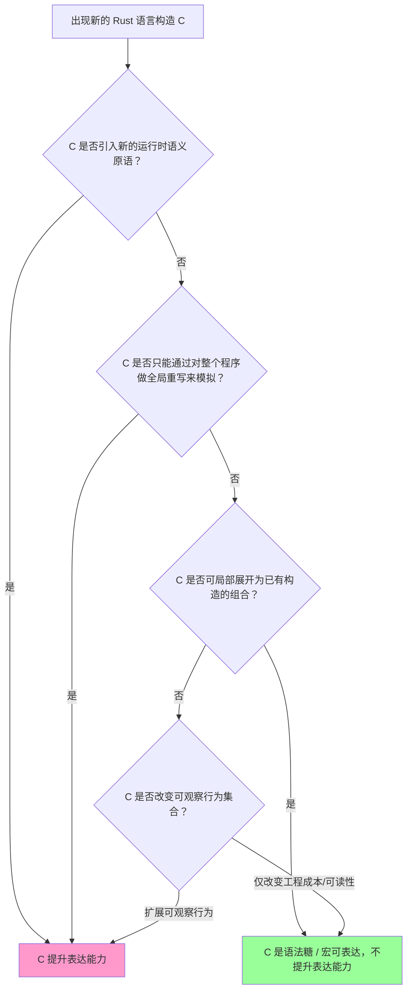
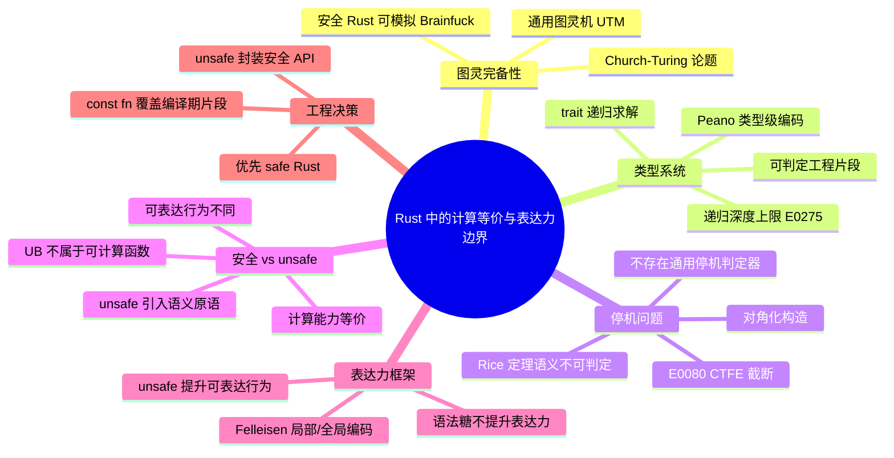

> **内容分级**: [专家级]

# Rust 中的计算等价与表达力边界

**EN**: Computational Equivalence and Expressiveness Boundaries in Rust
**Summary**: A systematic analysis of Rust's Turing completeness, the undecidability of the halting problem, type-system Turing completeness, and the expressive-power gap between safe and unsafe Rust.

> **Rust 版本**: 1.97.0+ (Edition 2024)
> **Bloom 层级**: L4-L5
> **权威来源**: 本文件为 `concept/` 权威页。
> **定位**: 从可计算性与形式语义视角回答「Rust 能算什么、不能算什么、安全子集与 unsafe 子集在计算能力与表达能力上有何差异」，并把这些结论映射到工程决策（何时必须用 unsafe、何时 safe Rust 足够）。
> **前置概念**:
> [Computability Theory](02_computability_theory.md) ·
> [Mathematical Functions of Computation](04_mathematical_functions_of_computation.md) ·
> [Equivalence of Computational Models](05_equivalence_of_computational_models.md) ·
> [Operational Semantics](../03_operational_semantics/03_operational_semantics.md)
> **后置概念**:
> [Algorithm Equivalence](../08_algorithm_semantics/05_algorithm_equivalence.md) ·
> [Unsafe Rust](../../03_advanced/02_unsafe/01_unsafe.md) ·
> [Semantic Space](../../00_meta/00_framework/semantic_space.md)

---

## 📑 目录

- [Rust 中的计算等价与表达力边界](#rust-中的计算等价与表达力边界)
  - [📑 目录](#-目录)
  - [一、核心概念](#一核心概念)
    - [1.1 Rust 的图灵完备性：用安全代码模拟通用图灵机](#11-rust-的图灵完备性用安全代码模拟通用图灵机)
    - [1.2 Rust 类型系统的图灵完备性](#12-rust-类型系统的图灵完备性)
    - [1.3 停机问题：Rust 编译器无法判定程序是否终止](#13-停机问题rust-编译器无法判定程序是否终止)
    - [1.4 安全 Rust 与 unsafe Rust 的表达力差异](#14-安全-rust-与-unsafe-rust-的表达力差异)
    - [1.5 计算能力 ≠ 表达能力：Felleisen 框架回顾](#15-计算能力--表达能力felleisen-框架回顾)
  - [二、多维矩阵：Rust 子集的能力对比](#二多维矩阵rust-子集的能力对比)
  - [三、决策树：判定一个 Rust 构造是否提升表达力](#三决策树判定一个-rust-构造是否提升表达力)
  - [四、正向推理与反向推理示例](#四正向推理与反向推理示例)
    - [4.1 正向推理：Brainfuck 解释器 ⇒ Rust 图灵完备](#41-正向推理brainfuck-解释器--rust-图灵完备)
    - [4.2 反向推理：若 safe Rust 与 unsafe Rust 计算能力不同会怎样？](#42-反向推理若-safe-rust-与-unsafe-rust-计算能力不同会怎样)
  - [五、反例与边界分析](#五反例与边界分析)
  - [六、嵌入式测验（Embedded Quiz）](#六嵌入式测验embedded-quiz)
    - [测验 1：Rust 图灵完备性的证据](#测验-1rust-图灵完备性的证据)
    - [测验 2：安全 Rust 与 unsafe Rust 的计算能力](#测验-2安全-rust-与-unsafe-rust-的计算能力)
    - [测验 3：停机问题对编译器优化的限制](#测验-3停机问题对编译器优化的限制)
    - [测验 4：类型系统图灵完备性与工程实践](#测验-4类型系统图灵完备性与工程实践)
  - [七、相关概念](#七相关概念)
  - [八、权威来源 / International Authority References](#八权威来源--international-authority-references)
  - [九、🧭 思维导图（Mindmap）](#九-思维导图mindmap)

---

## 一、核心概念

### 1.1 Rust 的图灵完备性：用安全代码模拟通用图灵机

**图灵完备（Turing-complete）**的判定标准不是语言有多复杂，而是它能否在有限时间内模拟任意一台通用图灵机（UTM）。一种工程上最简洁的判定方式是：在该语言中实现一个已知的图灵完备形式系统的解释器。Brainfuck 是经典的图灵完备语言，下面给出一个用**纯安全 Rust**实现的 Brainfuck 解释器。

```rust
use std::collections::HashMap;

/// 预计算 `[` 与 `]` 的跳转目标。
fn bracket_map(program: &[u8]) -> HashMap<usize, usize> {
    let mut map = HashMap::new();
    let mut stack = Vec::new();
    for (i, &c) in program.iter().enumerate() {
        match c {
            b'[' => stack.push(i),
            b']' => {
                let j = stack.pop().expect("unmatched ']'");
                map.insert(j, i);
                map.insert(i, j);
            }
            _ => {}
        }
    }
    assert!(stack.is_empty(), "unmatched '['");
    map
}

/// 运行 Brainfuck 程序，返回标准输出字节。
fn run_bf(program: &[u8], input: &[u8]) -> Vec<u8> {
    let map = bracket_map(program);
    let mut tape = vec![0u8; 30_000];
    let mut pc = 0usize;
    let mut head = 0usize;
    let mut input_pos = 0usize;
    let mut output = Vec::new();

    while pc < program.len() {
        match program[pc] {
            b'>' => head += 1,
            b'<' => head -= 1,
            b'+' => tape[head] = tape[head].wrapping_add(1),
            b'-' => tape[head] = tape[head].wrapping_sub(1),
            b'.' => output.push(tape[head]),
            b',' => {
                tape[head] = *input.get(input_pos).unwrap_or(&0);
                input_pos += 1;
            }
            b'[' => {
                if tape[head] == 0 {
                    pc = *map.get(&pc).expect("missing bracket");
                }
            }
            b']' => {
                if tape[head] != 0 {
                    pc = *map.get(&pc).expect("missing bracket");
                }
            }
            _ => {}
        }
        pc += 1;
    }
    output
}

fn main() {
    // 该程序把输入的第一个字节复制到输出（',' 读取，'.' 输出）。
    let program = b",.";
    let out = run_bf(program, b"A");
    assert_eq!(out, b"A");

    // 该程序把 0 号单元递增到 65 ('A') 后输出。
    let program2 = b"+++++++++++++++++++++++++++++++++++++++++++++++++++++++++++++++++.";
    assert_eq!(run_bf(program2, b""), b"A");
}
```

> **认知功能**：这个解释器证明，**安全 Rust 本身就足以模拟任意 Brainfuck 程序**。因为 Brainfuck 图灵完备，所以安全 Rust 也是图灵完备的。它同时也能计算任何其他图灵完备模型可计算的部分递归函数集合。

图灵完备只关乎「能不能算」，不关乎「算得快不快」「类型是否安全」。Rust 的所有权系统、借用检查器和类型系统不改变它的图灵完备性，只是**约束了可以安全表达的程序形态**。

---

### 1.2 Rust 类型系统的图灵完备性

Rust 的 trait 系统允许在**类型层面**进行通用递归计算。通过把自然数编码为类型（Peano 编码），可以在编译期完成加法、甚至受限的递归函数求值。下面是一个类型级 Peano 自然数与加法的实现。

```rust
use std::marker::PhantomData;

struct Zero;
struct Succ<N>(PhantomData<N>);

trait Add<Rhs> {
    type Sum;
}

impl<Rhs> Add<Rhs> for Zero {
    type Sum = Rhs;
}

impl<N, Rhs> Add<Rhs> for Succ<N>
where
    N: Add<Rhs>,
{
    type Sum = Succ<<N as Add<Rhs>>::Sum>;
}

trait NatVal {
    const VALUE: usize;
}
impl NatVal for Zero {
    const VALUE: usize = 0;
}
impl<N: NatVal> NatVal for Succ<N> {
    const VALUE: usize = 1 + N::VALUE;
}

fn nat_val<T: NatVal>() -> usize {
    T::VALUE
}

fn main() {
    type One = Succ<Zero>;
    type Two = Succ<One>;
    type Three = <One as Add<Two>>::Sum;

    assert_eq!(nat_val::<Three>(), 3);
}
```

类型级计算的图灵完备性意味着：如果把递归深度限制去掉，Rust 的 trait 求解理论上可以模拟任意图灵完备系统（Jones 1993; Pierce 2002）。但工程上 Rust 通过以下方式把类型求解限制在**可判定片段**内：

- trait 求解递归深度上限（默认 128，超过报 `E0275`）；
- 单态化膨胀与编译时间限制；
- 不允许无类型递归类型。

```rust,compile_fail,E0275
// ❌ 编译错误：不受限的关联类型递归触发 trait solver 递归深度限制。
// 这是 Rust 主动把类型系统「图灵完备潜力」限制在可判定工程片段的证据。
trait Rec {
    type Out;
}
impl<T: Rec> Rec for T {
    type Out = <T as Rec>::Out;
}

fn check<T: Rec>() -> T::Out { loop {} }

fn main() {
    let _: i32 = check::<i32>();
}
```

> **关键结论**：Rust 的类型系统**具备图灵完备的表达能力潜力**，但编译器通过硬性边界把它约束在可判定的工程子集内。这与 `const fn` 的 CTFE 步数上限、过程宏展开步数上限属于同一类「把半可判定问题截断为可判定片段」的工程策略。

---

### 1.3 停机问题：Rust 编译器无法判定程序是否终止

即使 Rust 的类型系统被限制在可判定片段，**运行时终止性**仍然不可判定。停机问题（Halting Problem）指出：不存在通用算法，能够对任意程序-输入对判定该程序是否停机。下面用 Rust 伪代码给出经典对角化论证的结构。

```rust
/// 假设存在一个「停机判定神谕」。现实中它不可能存在。
fn halts(program: &dyn Fn(), _input: ()) -> bool {
    unimplemented!("no such oracle can exist")
}

/// 对角化构造：如果神谕说我会停机，我就无限循环；反之则立即返回。
fn diagonal() {
    if halts(&diagonal, ()) {
        loop {} // 永远不停机
    } else {
        return; // 立即停机
    }
}

fn main() {
    // 若 halts(diagonal) == true，则 diagonal 会 loop，矛盾。
    // 若 halts(diagonal) == false，则 diagonal 会 return，也矛盾。
    // 因此 halts 不可能同时正确且完全。
    println!("this demonstrates the structure of the contradiction");
}
```

Rust 编译器在编译期同样面临这一极限：

- `const fn` 中如果出现无界递归，编译器会在 CTFE 步数上限处报 `E0080`，而不是判定它是否真的会停机；
- 过程宏展开如果被设置为无限循环，编译器会在宏展开步数上限处截断；
- 类型求解如果进入无限递归，会在递归深度上限处报 `E0275`。

```rust,compile_fail,E0080
const fn diverge_in_const() -> i32 {
    diverge_in_const() // ERROR E0080: 常量求值无法终止
}

const X: i32 = diverge_in_const();

fn main() {}
```

> **工程推论**：因为停机问题不可判定，编译器不可能在一般情况下判定两个 Rust 函数是否语义等价。所有优化（常量折叠、内联、LTO）都必须基于被证明保持特定观察等价的局部/全局变换，而不能依赖通用语义比较。

---

### 1.4 安全 Rust 与 unsafe Rust 的表达力差异

**安全 Rust（safe Rust）**与 **unsafe Rust** 在**计算能力**上是等价的：两者都能计算完全相同的部分可计算函数集合。但它们在**表达能力**和**可表达的行为集合**上显著不同。

| 维度 | 安全 Rust | unsafe Rust | 是否影响计算能力 |
|:---|:---|:---|:---:|
| 可计算的函数集合 | 所有部分递归函数 | 所有部分递归函数 | ❌ 否 |
| 内存模型假设 | 别名 XOR 可变严格保证 | 可绕过借用检查，允许多重可变别名 | ❌ 否（能力等价） |
| 可表达的底层行为 | 限于内存安全 + 类型安全 | 可执行 raw pointer、transmute、FFI、内联汇编 | ✅ 可表达更多「行为」，但非更多「可计算函数」 |
| 优化保证 | 基于 safe/unsafe 边界的强优化假设 | 需要程序员自行维护不变量，优化空间受限 | ❌ 否 |
| 验证成本 | 由编译器保证 | 需人工 SAFETY 注释 + Miri/形式化工具验证 | ❌ 否 |

```rust
/// 安全 Rust：通过 Vec 模拟「全局磁带」，无未定义行为。
fn safe_tape_read(tape: &[u8], head: usize) -> u8 {
    tape[head]
}

/// unsafe Rust：通过裸指针访问同一内存，可表达但需人工保证安全。
unsafe fn unsafe_tape_read(tape: *const u8, head: usize) -> u8 {
    // SAFETY: 调用者必须保证 tape + head 指向有效且未越界的 u8。
    *tape.add(head)
}

fn main() {
    let tape = vec![0u8, 1, 2, 3];
    assert_eq!(safe_tape_read(&tape, 2), 2);
    unsafe {
        assert_eq!(unsafe_tape_read(tape.as_ptr(), 2), 2);
    }
}
```

> **关键区分**：unsafe Rust 能表达的「更多」是**违反安全不变量的行为**（例如 data race、use-after-free、类型混淆），而不是「更多的可计算函数」。一旦 unsafe 代码产生未定义行为（UB），它已经脱离了形式语义可讨论的函数范畴；从可计算性角度，它并没有让 Rust 变得「更强大」。

---

### 1.5 计算能力 ≠ 表达能力：Felleisen 框架回顾

Felleisen（1991）区分了两种「强」：

- **计算能力（computational power）**：能否计算某个函数集合。图灵完备语言在此维度上等价。
- **表达能力（expressive power）**：表达一个概念需要局部重写还是全局重写，是否需要引入新的语义原语。

Rust 的所有权系统、生命周期、`async/await`、`?` 等构造主要影响**表达能力**，而非**计算能力**：

- `async/await` 可局部去糖为 `Future` 状态机；
- `?` 可局部展开为 `match` + `return`；
- `unsafe` 引入了新的语义原语（raw pointer、transmute、FFI），因此在 Felleisen 意义上真正扩展了**可表达行为**（但仍不扩展可计算函数集合）。

> 更详细的 Felleisen 框架、局部/全局编码与 Rice 定理对编译器优化的限制，请参见 [`05_equivalence_of_computational_models.md`](05_equivalence_of_computational_models.md)。

---

## 二、多维矩阵：Rust 子集的能力对比

| 能力维度 | 安全 Rust | unsafe Rust | 受限 const 子集 | 说明 |
|:---|:---:|:---:|:---:|:---|
| 图灵完备 | ✅ | ✅ | ❌（受限） | 安全/unsafe 运行时都能模拟 UTM；`const` 子集受步数/语法限制 |
| 可计算函数集合 | 全部 | 全部 | 部分 | const 不能分配堆、不能调用任意运行时函数 |
| 类型系统图灵完备潜力 | ✅ | ✅ | — | trait 类型级计算在安全/unsafe 代码中均可触发 |
| 停机问题可判定 | ❌ | ❌ | ❌（主动截断） | 所有子集的终止性都不可判定；const 用步数上限兜底 |
| 可表达 UB/平台细节 | ❌ | ✅ | ❌ | 只有 unsafe 能直接表达 data race、type punning 等 |
| 编译器可验证性 | 高 | 低 | 高 | safe/const 由 rustc 保证；unsafe 需额外工具 |
| 零成本抽象保证 | ✅ | 部分 | 部分 | safe 抽象可完全零成本；unsafe 可能因保守优化损失性能 |

> **使用建议**：
>
> - 若目标函数可在安全 Rust 中表达，优先使用安全 Rust；
> - 若需要与硬件、C ABI 或特殊内存布局交互，使用 unsafe 并在边界处封装为安全 API；
> - 若需要在编译期计算，使用 `const fn`，但注意它只覆盖可判定片段。

---

## 三、决策树：判定一个 Rust 构造是否提升表达力



**应用示例**：

| 构造 | 决策路径 | 结论 |
|:---|:---|:---|
| `let` 绑定 | 局部展开为 λ 抽象/立即求值 | 不提升 |
| `?` 运算符 | 局部展开为 `match` + `return` | 不提升 |
| `async/await` | 局部去糖为 `Future` 状态机 | 不提升（计算能力），但显著降低工程成本 |
| `unsafe` 块 | 引入 raw pointer、transmute 等新语义原语 | 提升**可表达行为** |
| `const fn` | 在编译期求值，受可判定片段限制 | 不提升运行时表达力，扩展编译期能力 |

---

## 四、正向推理与反向推理示例

### 4.1 正向推理：Brainfuck 解释器 ⇒ Rust 图灵完备

**前提**：

1. Brainfuck 是图灵完备的（已被 Church-Turing 论题与构造性证明确认）。
2. 上面的 `run_bf` 是一个用安全 Rust 实现的、语义正确的 Brainfuck 解释器。

**推理**：

- 若语言 L 能实现图灵完备语言 M 的解释器，则 L 至少与 M 一样强；
- 又因为任何图灵完备语言都已被证明可以模拟通用图灵机；
- 所以安全 Rust 可以模拟通用图灵机，即安全 Rust 图灵完备。

**结论**：安全 Rust 的可计算函数集合等于部分递归函数集合。

> 这一结论并不说明安全 Rust 与 Brainfuck 在工程上等价；它只说明二者在「能算什么」上等价。

### 4.2 反向推理：若 safe Rust 与 unsafe Rust 计算能力不同会怎样？

**假设**：存在某个部分递归函数 `f`，只能用 unsafe Rust 计算，而无法用 safe Rust 计算。

**推导**：

1. 我们已经证明安全 Rust 能模拟 Brainfuck，因此安全 Rust 图灵完备；
2. unsafe Rust 是 Rust 的超集（所有安全代码也是合法的 Rust 代码，只是未显式标注 `unsafe` 块），因此 unsafe Rust 也图灵完备；
3. 根据 Church-Turing 论题，所有图灵完备模型恰好计算部分递归函数集合；
4. 若 safe Rust 比 unsafe Rust 少计算某个部分递归函数，则 safe Rust 不是图灵完备，与 (1) 矛盾。

**反设不成立**：safe Rust 与 unsafe Rust 计算能力相同。

> 反向推理揭示了「安全 vs unsafe」争论的核心：**差异在于可表达行为与验证责任，而不是可计算函数集合**。

---

## 五、反例与边界分析

```text
反例 1: "Rust 类型系统能判定所有程序是否安全"
  └── ❌ 否
      ├── 借用检查是保守的（sound but incomplete）：某些安全程序会被拒绝
      ├── unsafe 代码的安全条件无法被类型系统完全自动验证
      └── ✅ 正确表述: Rust 类型系统保证「通过检查的 safe 代码无 UB」，但不保证「所有无 UB 的代码都能通过检查"

反例 2: "unsafe Rust 比 safe Rust 计算能力更强"
  └── ❌ 否
      ├── 二者都是图灵完备的
      ├── unsafe 能表达更多「行为」（包括 UB），但这些行为不属于可计算函数
      └── ✅ 正确表述: unsafe 扩展的是可表达行为与工程场景，不是可计算函数集合

反例 3: "const fn 能计算所有可计算函数"
  └── ❌ 否
      ├── const 上下文禁止堆分配、I/O、线程等
      ├── CTFE 有步数上限，无法完成无界递归
      └── ✅ 正确表述: const fn 是 Rust 的编译期可判定片段，覆盖部分而非全部可计算函数

反例 4: "如果两个 Rust 函数对所有测试输入输出相同，则它们语义等价"
  └── ❌ 否
      ├── 测试集有限，而输入空间通常无限
      ├── 即使对所有输入输出相同，也可能在终止性、panic、副作用上不同
      └── ✅ 正确表述: 语义等价需要在精化规范/观察集下形式化证明，不能仅靠测试
```

**边界极限**：

1. **图灵等价不保证工程等价**：安全 Rust 与 C 都是图灵完备的，但 Rust 的所有权系统让大量常见模式在编译期即可排除内存错误。
2. **表达能力边界不等于计算能力边界**：`unsafe` 扩展了可表达行为，但未扩展可计算函数集合。
3. **停机问题不可判定意味着编译器优化必须保守**：任何需要判定任意程序语义的优化都是不可能的；只能依赖被证明的局部观察等价。
4. **类型系统图灵完备潜力被主动截断**：Rust 通过递归深度、CTFE 步数等限制，把类型求解保留在可判定工程片段内。

---

## 六、嵌入式测验（Embedded Quiz）

### 测验 1：Rust 图灵完备性的证据

以下哪个事实最能直接证明**安全 Rust**是图灵完备的？

- A. Rust 能调用 C 函数
- B. Rust 能使用 `unsafe` 写裸指针
- C. Rust 能完整实现一个 Brainfuck 解释器
- D. Rust 的类型系统能推断所有类型

<details>
<summary>✅ 答案</summary>

**C. Rust 能完整实现一个 Brainfuck 解释器**。

Brainfuck 已被证明是图灵完备的；若安全 Rust 能正确解释 Brainfuck，则安全 Rust 至少与 Brainfuck 一样强，因而也是图灵完备的。A、B 涉及 unsafe/FFI，与「安全 Rust」无关；D 是类型推断能力，不是图灵完备性证据。

</details>

---

### 测验 2：安全 Rust 与 unsafe Rust 的计算能力

关于安全 Rust 与 unsafe Rust 的关系，下列说法正确的是？

- A. unsafe Rust 能计算安全 Rust 无法计算的函数
- B. 二者可计算的函数集合相同
- C. 安全 Rust 的类型系统使它能计算更多函数
- D. 只有 unsafe Rust 是图灵完备的

<details>
<summary>✅ 答案</summary>

**B. 二者可计算的函数集合相同**。

安全 Rust 已经能模拟 Brainfuck，因此图灵完备；unsafe Rust 是 Rust 的超集，也图灵完备。Church-Turing 论题指出所有图灵完备模型计算相同的部分递归函数集合。unsafe 的差异在于可表达行为（包括 UB），而非可计算函数。

</details>

---

### 测验 3：停机问题对编译器优化的限制

根据停机问题，编译器**不能**做到的是？

- A. 常量折叠 `2 + 3` 为 `5`
- B. 内联一个无副作用的函数
- C. 判定任意两个函数是否对所有输入行为一致
- D. 把 `async fn` 去糖为 `Future` 状态机

<details>
<summary>✅ 答案</summary>

**C. 判定任意两个函数是否对所有输入行为一致**。

这是关于程序语义性质的非平凡判定问题，由 Rice/停机问题可知不可判定。A、B、D 都是基于被证明保持特定观察等价的局部变换，是安全的。

</details>

---

### 测验 4：类型系统图灵完备性与工程实践

Rust 的类型系统理论上可以进行通用递归计算，但编译器通过什么方式保证工程可用性？

- A. 完全禁止递归类型
- B. 对 trait 求解设置递归深度上限
- C. 把所有类型推断交给运行时
- D. 只允许常量泛型

<details>
<summary>✅ 答案</summary>

**B. 对 trait 求解设置递归深度上限**。

Rust 通过 trait 求解深度上限、CTFE 步数上限、monomorphization 限制等手段，把类型系统从「理论上图灵完备」约束到「工程上可判定」。A 不完全正确（递归类型在受控场景允许）；C、D 与事实不符。

</details>

---

## 七、相关概念

- [Computability Theory](02_computability_theory.md) — 图灵机、部分递归函数、停机问题
- [Mathematical Functions of Computation](04_mathematical_functions_of_computation.md) — λ-可定义性、Curry-Howard、Scott 域
- [Equivalence of Computational Models](05_equivalence_of_computational_models.md) — 图灵等价、Felleisen 表达力框架、局部/全局编码
- [Operational Semantics](../03_operational_semantics/03_operational_semantics.md) — 小步/大步操作语义
- [Algorithm Equivalence](../08_algorithm_semantics/05_algorithm_equivalence.md) — 算法实现层面的观察等价
- [Unsafe Rust](../../03_advanced/02_unsafe/01_unsafe.md) — unsafe 契约、不变量、Miri 验证
- [Semantic Space](../../00_meta/00_framework/semantic_space.md) — 概念空间中的表达边界

---

## 八、权威来源 / International Authority References

| 来源 | 可信度 | 说明 |
|:---|:---:|:---|
| [Turing 1936 — On computable numbers](https://doi.org/10.1112/plms/s2-42.1.230) | ✅ 一级 | 图灵机与停机问题奠基 |
| [Church 1936 — An Unsolvable Problem of Elementary Number Theory](https://doi.org/10.2307/1968981) | ✅ 一级 | λ 可定义函数与 Church-Turing 论题 |
| [Rice 1953 — Classes of Recursively Enumerable Sets](https://doi.org/10.1090/S0002-9904-1953-09692-2) | ✅ 一级 | 语义性质不可判定性 |
| [Sipser 2013 — Introduction to the Theory of Computation](https://math.mit.edu/~sipser/book.html) | ✅ 一级 | 可计算性、停机问题、Rice 定理标准教材 |
| [Felleisen 1991 — On the Expressive Power of Programming Languages](https://doi.org/10.1007/BF00119888) | ✅ 一级 | 表达力比较框架 |
| [Pierce 2002 — Types and Programming Languages](https://www.cis.upenn.edu/~bcpierce/tapl/) | ✅ 一级 | 类型系统、上下文等价、逻辑关系 |
| [Pitts 1997 — Operationally-based theories of program equivalence](https://www.cl.cam.ac.uk/~amp12/papers/index.html) | ✅ 一级 | 操作语义与观察等价 |
| [Weiss, Patterson & Ahmed 2018 — Rust Distilled](https://arxiv.org/abs/1806.02693) | ✅ 一级 | Rust 形式化语义塔与表达力分层 |
| [Jung et al. 2018 — RustBelt](https://plv.mpi-sws.org/rustbelt/popl18/) | ✅ 一级 | Rust unsafe 代码的机器可验证安全证明 |
| [Aeneas — Rust Verification Toolchain](https://github.com/AeneasVerif/aeneas) | ✅ 二级 | Rust 到纯函数式表示的等价性证明 |
| [Rust Reference — Unsafe Rust](https://doc.rust-lang.org/reference/unsafe-keyword.html) | ✅ P0 | unsafe 语义边界 |
| [Rust Reference — const evaluation](https://doc.rust-lang.org/reference/const_evaluation.html) | ✅ P0 | CTFE 与 E0080 语义 |

---

## 九、🧭 思维导图（Mindmap）



> **认知功能**：本思维导图把抽象的可计算性结论与具体 Rust 构造（Brainfuck 解释器、Peano 类型编码、E0275/E0080、unsafe 边界）联系起来，帮助在工程决策中区分「计算能力」与「表达能力」。
