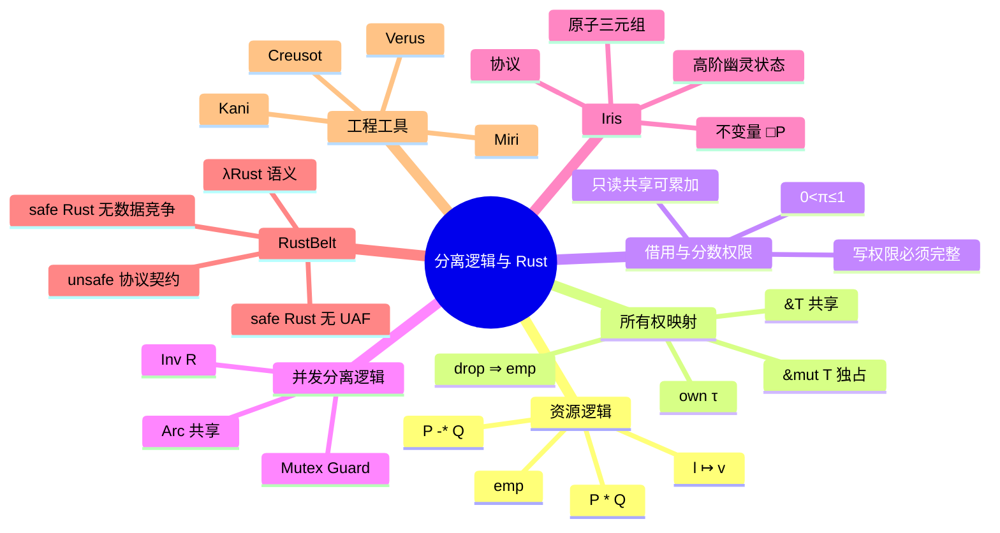

> **内容分级**: [专家级]

# 分离逻辑与 Rust：Iris / RustBelt 视角（Separation Logic for Rust）

> **EN**: Separation Logic for Rust: An Iris and RustBelt Perspective
> **Summary**: Presents separation logic and concurrent separation logic as computational models for Rust ownership, borrowing, and thread-shared resources, with a focus on the Iris framework and RustBelt's mechanized soundness proof for safe and unsafe Rust abstractions.

> **Rust 版本**: 1.97.0+ (Edition 2024)
> **Bloom 层级**: L4-L5
> **权威来源**: 本文件为 `concept/` 权威页。
> **定位**: 从**计算模型**视角组织分离逻辑与 Rust 的关系：把堆内存、所有权、借用、并发原语都视为**可组合、可分离的资源**，并说明 Iris/RustBelt 如何用这些资源证明 Rust 程序的安全契约。
> **前置概念**:
> [Separation Logic](../02_separation_logic/02_separation_logic.md) ·
> [RustBelt](../02_separation_logic/01_rustbelt.md) ·
> [Linear Logic](../01_ownership_logic/01_linear_logic.md) ·
> [Ownership Formalization](../01_ownership_logic/02_ownership_formal.md) ·
> [Concurrency](../../03_advanced/00_concurrency/01_concurrency.md)
> **后置概念**:
> [Type Theory and Rust](07_type_theory_and_rust.md) ·
> [Concurrency Models](09_concurrency_models_actors_csp.md) ·
> [Verification Toolchain](../04_model_checking/01_verification_toolchain.md) ·
> [Formal Methods](../../07_future/04_research_and_experimental/02_formal_methods.md)

---

## 📑 目录

- [分离逻辑与 Rust：Iris / RustBelt 视角（Separation Logic for Rust）](#分离逻辑与-rustiris--rustbelt-视角separation-logic-for-rust)
  - [📑 目录](#-目录)
  - [一、核心概念](#一核心概念)
    - [1.1 分离逻辑：把堆当作可分离的资源](#11-分离逻辑把堆当作可分离的资源)
    - [1.2 Rust 所有权的分离逻辑映射](#12-rust-所有权的分离逻辑映射)
    - [1.3 借用与分数权限](#13-借用与分数权限)
    - [1.4 并发分离逻辑与线程共享](#14-并发分离逻辑与线程共享)
    - [1.5 Iris：高阶幽灵状态与不变量](#15-iris高阶幽灵状态与不变量)
    - [1.6 RustBelt 的证明架构](#16-rustbelt-的证明架构)
    - [1.7 工程映射：何时把代码交给形式化工具](#17-工程映射何时把代码交给形式化工具)
  - [二、形式化属性矩阵](#二形式化属性矩阵)
  - [三、正向示例](#三正向示例)
    - [示例 1：独占资源的分割与重组](#示例-1独占资源的分割与重组)
    - [示例 2：`Mutex<T>` 作为资源不变量](#示例-2mutext-作为资源不变量)
    - [示例 3：借用归还后恢复独占权限](#示例-3借用归还后恢复独占权限)
  - [四、反例与边界测试](#四反例与边界测试)
    - [反例 1：创建两个 `&mut` 破坏独占权限（E0499）](#反例-1创建两个-mut-破坏独占权限e0499)
    - [反例 2：只读与可变借用共存破坏不变量（E0502）](#反例-2只读与可变借用共存破坏不变量e0502)
    - [反例 3：返回引用局部 Mutex 的 Guard（E0515）](#反例-3返回引用局部-mutex-的-guarde0515)
  - [五、反命题决策树](#五反命题决策树)
    - [命题：「分离逻辑只适用于堆内存」](#命题分离逻辑只适用于堆内存)
    - [命题：「RustBelt 证明了所有 Rust 程序都安全」](#命题rustbelt-证明了所有-rust-程序都安全)
  - [六、嵌入式测验（Embedded Quiz）](#六嵌入式测验embedded-quiz)
    - [测验 1：分离逻辑中的 `P * Q` 表示什么？](#测验-1分离逻辑中的-p--q-表示什么)
    - [测验 2：`Mutex<T>` 在并发分离逻辑中最接近哪个概念？](#测验-2mutext-在并发分离逻辑中最接近哪个概念)
    - [测验 3：RustBelt 对 unsafe 代码的安全保证是？](#测验-3rustbelt-对-unsafe-代码的安全保证是)
  - [七、权威来源 / International Authority References](#七权威来源--international-authority-references)
  - [八、🧭 思维导图（Mindmap）](#八-思维导图mindmap)

---

## 一、核心概念

### 1.1 分离逻辑：把堆当作可分离的资源

传统霍尔逻辑 `{P} C {Q}` 无法简洁地表达「指针 `p` 和 `q` 指向不重叠的内存」。分离逻辑（Separation Logic, Reynolds 2002; O'Hearn et al.）引入 **分离合取 `*`** 和 **指向断言 `l ↦ v`**，把堆分解为互不干涉的部分：

```text
基本断言
  emp              : 空堆
  l ↦ v            : 位置 l 存储值 v
  P * Q            : 堆可被拆分为满足 P 和 Q 的两部分
  P -* Q           : 把满足 P 的堆合并进来后得到 Q

关键规则
  框架规则（Frame Rule）:
    {P} C {Q}
  ───────────────────
    {P * R} C {Q * R}
  含义：C 只操作 P 中的资源，R 中的资源不受影响。
```

框架规则是**局部推理**的基础：证明一个函数时，只需关心它实际使用的内存，其余资源可以「帧」出去。

> **来源**: [Reynolds 2002, *Separation Logic: A Logic for Shared Mutable Data Structures*](https://www.cs.cmu.edu/~jcr/seplogic.pdf)

---

### 1.2 Rust 所有权的分离逻辑映射

Rust 的所有权系统可以读作分离逻辑的一个**工程化实现**：

| Rust 概念 | 分离逻辑断言 | 含义 |
|:---|:---|:---|
| `let x = Box::new(v)` | `own(x, τ)` | 独占拥有类型 τ 的内存 |
| `let y = x;` | `own(x, τ) ⊢ own(y, τ)` | 权限从 x 转移到 y，x 失效 |
| `let r = &x;` | `shr(r, τ)` 或 `&x ↦ v` | 只读共享引用，可复制 |
| `let r = &mut x;` | `own(r, τ)` 的临时转移 | 独占借用，不可复制 |
| `drop(x)` | `own(x, τ) ⊢ emp` | 释放资源，权限消失 |

```rust
fn main() {
    let s = String::from("separation"); // own(s, String)
    let t = s;                           // own(s, String) ⊢ own(t, String)
    println!("{}", t);                   // ✅ t 持有权限
    // println!("{}", s);                // ❌ own(s, String) 已空
}
```

> **关键洞察**: 借用检查器在分离逻辑中扮演着「断言检查器」的角色：它确保任意时刻 `own` 与 `&mut` 的权限不重叠，`&` 的权限可以复制但不能写入。

---

### 1.3 借用与分数权限

分离逻辑中的 **分数权限（fractional permissions）** 允许多个只读共享引用共存，但独占写权限必须完整：

```text
分数权限模型
  own(x, τ)           : 1.0 份独占权限
  0 < π < 1, shr_π(x, τ) : π 份只读权限，多份可相加为 ≤1
  &mut x              : 1.0 份独占权限，但可临时「借用」后归还
```

```rust
fn main() {
    let mut v = vec![1, 2, 3];
    {
        let r1 = &v;        // 0.5 份只读权限
        let r2 = &v;        // 再加 0.5 份只读权限
        println!("{:?} {:?}", r1, r2);
    }                       // 所有只读权限归还
    v.push(4);              // 重新获得独占权限
    println!("{:?}", v);
}
```

编译器拒绝「写引用与任何其他引用共存」，因为这会破坏分数权限的总和约束（不能超过 1.0）。

---

### 1.4 并发分离逻辑与线程共享

**并发分离逻辑（Concurrent Separation Logic, CSL）** 把资源不变量 `Inv(R)` 作为线程间共享资源的安全契约。`Mutex<T>` 的形式化含义就是：锁保护着资源 `T` 的不变量，只有持有 `MutexGuard` 的线程才能访问该资源。

```rust
use std::sync::{Arc, Mutex};
use std::thread;

fn main() {
    let data = Arc::new(Mutex::new(0));
    let data2 = Arc::clone(&data);

    let handle = thread::spawn(move || {
        let mut guard = data2.lock().unwrap();
        *guard += 1; // 只有持有 guard 时才拥有 *data 的权限
    });

    {
        let mut guard = data.lock().unwrap();
        *guard += 1;
    } // guard 释放，权限归还锁

    handle.join().unwrap();
    assert_eq!(*data.lock().unwrap(), 2);
}
```

`Arc<T>` 提供共享所有权，对应于分离逻辑中的「可共享的不可变指针」；`Mutex<T>` 在其上叠加了**可变的资源不变量**。

> **来源**: [O'Hearn 2007, *Resources, Concurrency and Local Reasoning*](https://doi.org/10.1016/j.tcs.2006.12.035)

---

### 1.5 Iris：高阶幽灵状态与不变量

Iris 是一个**高阶并发分离逻辑**框架，核心能力包括：

1. **高阶幽灵状态（higher-order ghost state）**：可以在证明中携带任意（包括高阶）不变量。
2. **不变量（invariants）**：`□(P)` 表示资源 P 在所有执行点都成立。
3. **协议（protocols）**：描述共享资源允许的状态转移。
4. **view shifts / atomic updates**：支持对原子操作的精细推理。

```text
Iris 断言示例
  own(x, τ)            : 独占资源
  □(x ↦ v)             : 资源不变量（持久）
  x ↦ v \* y ↦ w       : 两个不重叠的堆资源
  <<{ P }>> e <<{ v. Q }>> : 原子霍尔三元组
```

Iris 不直接检查 Rust 代码，而是为 RustBelt 提供**证明语言**：RustBelt 把 Rust 程序翻译成 Iris 断言，再证明这些断言成立。

> **来源**: [Jung et al. 2018, *Iris from the Ground Up*](https://iris-project.org/pdfs/2018-jfp-iris-ground-up.pdf)

---

### 1.6 RustBelt 的证明架构

RustBelt（Jung et al., POPL 2018）在 **λRust** 操作语义之上，使用 Iris 证明 Rust 的 safe 子集满足：

1. **内存安全**：不存在 use-after-free、double-free、悬垂指针。
2. **数据竞争自由**：safe Rust 中不存在数据竞争。

对于 `unsafe` 代码，RustBelt 使用 **Iris 协议** 把安全抽象封装起来：只要 unsafe 代码满足其协议契约，就不会破坏 safe 抽象边界。

```text
RustBelt 证明链
λRust 操作语义
    ↓
Iris 分离逻辑断言（own / shr / protocols）
    ↓
类型 soundness 引理：well-typed safe Rust ⇒ Iris 资源良好
    ↓
安全定理：safe Rust 程序无 UAF / 无数据竞争
```

```rust
// RustBelt 视角下的安全封装示例：
// 内部使用 raw pointer，但公开 API 保持独占所有权不变式
pub struct UniqueBox<T>(*mut T, std::marker::PhantomData<T>);

impl<T> UniqueBox<T> {
    pub fn new(x: T) -> Self {
        Self(Box::into_raw(Box::new(x)), std::marker::PhantomData)
    }

    pub fn get(&mut self) -> &mut T {
        unsafe { &mut *self.0 }
    }
}

impl<T> Drop for UniqueBox<T> {
    fn drop(&mut self) {
        unsafe { drop(Box::from_raw(self.0)); }
    }
}

fn main() {
    let mut b = UniqueBox::new(42);
    *b.get() += 1;
    assert_eq!(*b.get(), 43);
}
```

> **来源**: [Jung et al. 2018, *RustBelt: Securing the Foundations of the Rust Programming Language*](https://plv.mpi-sws.org/rustbelt/popl18/)

---

### 1.7 工程映射：何时把代码交给形式化工具

| 场景 | 是否需要形式化 | 推荐工具 |
|:---|:---|:---|
| 普通业务逻辑 | 通常不需要 | 单元测试 + 类型系统 |
| unsafe 抽象封装 | 推荐 | Miri、Kani、RustBelt 风格手写不变量 |
| 并发原语实现 | 推荐 | Kani、TLA+、Iris（研究级） |
| 密码学/安全关键 | 强烈建议 | Kani、Verus、Creusot、TLA+ |
| 操作系统/驱动 | 强烈建议 | Kani、Verus、seL4 式验证 |

形式化不是替代测试，而是**在类型系统之外补充更强的不变量证明**。

---

## 二、形式化属性矩阵

| 分离逻辑概念 | Rust 工程机制 | 形式化含义 | 权威来源 |
|:---|:---|:---|:---|
| `l ↦ v` | `Box::new(v)` / 堆分配 | 位置到值的独占断言 | Reynolds 2002 |
| `*` | 所有权拆分、字段借用 | 资源不重叠 | Separation Logic |
| Frame Rule | 局部推理、借用归还 | 未使用资源不受影响 | Reynolds 2002 |
| `Inv(R)` | `Mutex<T>` | 共享资源不变量 | O'Hearn 2007 |
| 分数权限 | `&T` / `&mut T` | 只读共享 vs 独占写 | Boyland 2003 |
| Ghost State | `PhantomData` / 证明中辅助状态 | 不占用运行时的逻辑资源 | Iris |
| Protocol | unsafe 抽象契约 | 允许的状态转移集合 | RustBelt 2018 |

---

## 三、正向示例

### 示例 1：独占资源的分割与重组

```rust
fn main() {
    let mut pair = (String::from("left"), String::from("right"));
    let (l, r) = &mut pair; // 独占权限被拆分到两个不重叠的借用
    l.push_str("-side");
    r.push_str("-side");
    println!("{:?}", pair);
}
```

### 示例 2：`Mutex<T>` 作为资源不变量

```rust
use std::sync::{Arc, Mutex};

fn main() {
    let counter = Arc::new(Mutex::new(0));
    let mut handles = vec![];

    for _ in 0..10 {
        let c = Arc::clone(&counter);
        handles.push(std::thread::spawn(move || {
            let mut num = c.lock().unwrap();
            *num += 1;
        }));
    }

    for h in handles {
        h.join().unwrap();
    }

    assert_eq!(*counter.lock().unwrap(), 10);
}
```

### 示例 3：借用归还后恢复独占权限

```rust
fn main() {
    let mut s = String::from("borrow");
    {
        let r = &s;
        println!("{}", r);
    } // 只读借用归还
    s.push_str("ed");
    println!("{}", s);
}
```

---

## 四、反例与边界测试

### 反例 1：创建两个 `&mut` 破坏独占权限（E0499）

```rust,compile_fail,E0499
fn main() {
    let mut x = 0;
    let r1 = &mut x;
    let r2 = &mut x;
    println!("{} {}", r1, r2);
}
```

> **错误诊断**: `error[E0499]: cannot borrow x as mutable more than once at a time`。
> **修正**: 将第二个可变借用移到第一个借用作用域结束后，或使用内部可变性原语。

### 反例 2：只读与可变借用共存破坏不变量（E0502）

```rust,compile_fail,E0502
fn main() {
    let mut v = vec![1, 2, 3];
    let r = &v[0];
    v.push(4);
    println!("{}", r);
}
```

> **错误诊断**: `error[E0502]: cannot borrow v as mutable because it is also borrowed as immutable`。
> **修正**: 在调用 `push` 前结束 `r` 的生命周期，或复制所需值。

### 反例 3：返回引用局部 Mutex 的 Guard（E0515）

```rust,compile_fail,E0515
use std::sync::Mutex;

fn bad() -> std::sync::MutexGuard<'static, i32> {
    let m = Mutex::new(0);
    m.lock().unwrap() // guard 引用了局部 mutex
}

fn main() {
    let _g = bad();
}
```

> **错误诊断**: `error[E0515]: cannot return value referencing local variable m`。
> **修正**: 使用 `Arc<Mutex<T>>` 让锁比 guard 活得更长。

---

## 五、反命题决策树

### 命题：「分离逻辑只适用于堆内存」

```text
该命题成立吗？
├── 是 → 错误。分离逻辑的「资源」可以是：
│   ├── 堆内存（l ↦ v）
│   ├── 锁权限（MutexGuard）
│   ├── 文件描述符
│   ├── 网络连接
│   └── Iris 中的幽灵状态
└── 否 → 正确。分离逻辑是一种通用的**资源逻辑**。
```

### 命题：「RustBelt 证明了所有 Rust 程序都安全」

```text
该命题成立吗？
├── 是 → 错误。RustBelt 证明的是：
│   ├── safe Rust 子集满足内存安全与数据竞争自由
│   └── unsafe 代码在**满足 Iris 协议**的前提下不破坏 safe 边界
└── 否 → 正确。RustBelt 不证明具体 unsafe 代码正确，只证明其契约。
```

---

## 六、嵌入式测验（Embedded Quiz）

### 测验 1：分离逻辑中的 `P * Q` 表示什么？

A. P 与 Q 的逻辑与
B. P 与 Q 的资源可以被拆分到不重叠的堆中
C. P 与 Q 必须同时发生
D. P 蕴含 Q

<details>
<summary>✅ 答案</summary>

**B. P 与 Q 的资源可以被拆分到不重叠的堆中**。`*` 是分离合取，核心含义是「资源不重叠」。

</details>

### 测验 2：`Mutex<T>` 在并发分离逻辑中最接近哪个概念？

A. 指向断言 `l ↦ v`
B. 资源不变量 `Inv(R)`
C. 空堆 `emp`
D. 魔法棒 `P -* Q`

<details>
<summary>✅ 答案</summary>

**B. 资源不变量 `Inv(R)`**。锁保护着受保护资源的不变量，只有持有 guard 的线程才能访问。

</details>

### 测验 3：RustBelt 对 unsafe 代码的安全保证是？

A. 所有 unsafe 代码都被机械证明为正确
B. unsafe 代码若满足 Iris 协议则不破坏 safe 边界
C. unsafe 代码不可能存在
D. unsafe 代码不需要满足任何契约

<details>
<summary>✅ 答案</summary>

**B. unsafe 代码若满足 Iris 协议则不破坏 safe 边界**。RustBelt 把 unsafe 抽象封装成协议，safe 端依赖该协议。

</details>

---

## 七、权威来源 / International Authority References

| 来源 | 可信度 | 说明 |
|:---|:---:|:---|
| [Reynolds 2002, *Separation Logic*](https://www.cs.cmu.edu/~jcr/seplogic.pdf) | ✅ 一级 | 分离逻辑奠基论文 |
| [O'Hearn 2007, *Resources, Concurrency and Local Reasoning*](https://doi.org/10.1016/j.tcs.2006.12.035) | ✅ 一级 | 并发分离逻辑 CSL |
| [Jung et al. 2018, *Iris from the Ground Up*](https://iris-project.org/pdfs/2018-jfp-iris-ground-up.pdf) | ✅ 一级 | Iris 高阶分离逻辑 |
| [Jung et al. 2018, RustBelt](https://plv.mpi-sws.org/rustbelt/popl18/) | ✅ 一级 | Rust 安全性的 Iris 机械证明 |
| [Boyland 2003, *Checking Interference with Fractional Permissions*](https://doi.org/10.1007/3-540-44898-5_4) | ✅ 一级 | 分数权限理论 |
| [Rust Reference — Ownership](https://doc.rust-lang.org/reference/ownership.html) | ✅ P0 | Rust 官方所有权语义 |
| [Rust Reference — Unsafe Rust](https://doc.rust-lang.org/reference/unsafe-keyword.html) | ✅ P0 | unsafe 语义边界 |
| [Creusot — deductive verification for Rust](https://docs.rs/creusot-contracts/) | ✅ P2 | Rust 形式化验证生态 |

---

## 八、🧭 思维导图（Mindmap）


