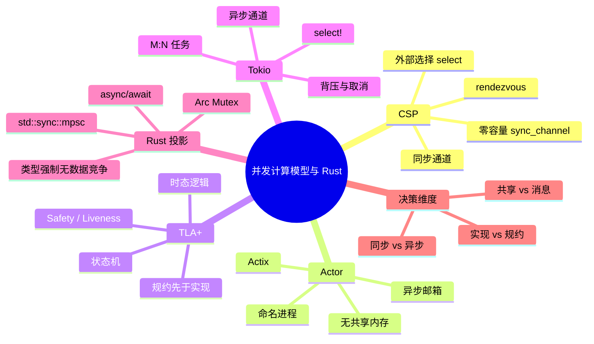

> **内容分级**: [专家级]

# 并发计算模型：CSP、Actor、TLA+ 与 Rust（Concurrency Models: CSP, Actors, TLA+, and Rust）

> **EN**: Concurrency Models as Computational Models: CSP, Actors, TLA+, and Rust
> **Summary**: Surveys three foundational concurrency models — Communicating Sequential Processes, the Actor model, and TLA+ — and maps them to Rust engineering artifacts such as std channels, Actix actors, Tokio tasks/select, and state-machine specifications.

> **Rust 版本**: 1.97.0+ (Edition 2024)
> **Bloom 层级**: L4-L5
> **权威来源**: 本文件为 `concept/` 权威页。
> **定位**: 从**计算模型**视角比较 CSP、Actor、TLA+ 三种并发形式化方法，并把它们投影到 Rust 的通道、Actor 框架、异步运行时与形式化规约上，避免把工程原语直接等同于理论模型。
> **前置概念**:
> [Concurrency](../../03_advanced/00_concurrency/01_concurrency.md) ·
> [Process Calculi for Rust](../07_concurrency_semantics/01_process_calculi_for_rust.md) ·
> [Actor Semantics](../07_concurrency_semantics/03_actor_semantics.md) ·
> [Models of Concurrency](../12_concurrency_models/01_models_of_concurrency.md) ·
> [Separation Logic for Rust](08_separation_logic_for_rust.md)
> **后置概念**:
> [Distributed Systems Semantics](../09_system_semantics/04_distributed_systems_semantics.md) ·
> [Reactive Systems Semantics](../09_system_semantics/05_reactive_systems_semantics.md) ·
> [Stream Algebra](../../03_advanced/01_async/09_stream_algebra_and_backpressure.md)

---

## 📑 目录

- [并发计算模型：CSP、Actor、TLA+ 与 Rust（Concurrency Models: CSP, Actors, TLA+, and Rust）](#并发计算模型cspactortla-与-rustconcurrency-models-csp-actors-tla-and-rust)
  - [📑 目录](#-目录)
  - [一、核心概念](#一核心概念)
    - [1.1 三种并发计算模型概览](#11-三种并发计算模型概览)
    - [1.2 CSP：同步通道与会合](#12-csp同步通道与会合)
    - [1.3 Actor 模型：命名进程与异步邮箱](#13-actor-模型命名进程与异步邮箱)
    - [1.4 TLA+：时态逻辑与状态机规约](#14-tla时态逻辑与状态机规约)
    - [1.5 Tokio 并发模型：任务、消息与 select](#15-tokio-并发模型任务消息与-select)
    - [1.6 模型对比矩阵](#16-模型对比矩阵)
    - [1.7 工程决策树](#17-工程决策树)
  - [二、正向示例](#二正向示例)
    - [示例 1：CSP 风格同步会合](#示例-1csp-风格同步会合)
    - [示例 2：Actor 风格计数器](#示例-2actor-风格计数器)
    - [示例 3：Actix Actor 接口（概念性）](#示例-3actix-actor-接口概念性)
  - [三、反例与边界测试](#三反例与边界测试)
    - [反例 1：`Rc` 不能跨线程共享（E0277）](#反例-1rc-不能跨线程共享e0277)
    - [反例 2：误把异步 `mpsc` 当作 CSP rendezvous](#反例-2误把异步-mpsc-当作-csp-rendezvous)
    - [反例 3：Actor 邮箱不保证跨 Actor 的全局 FIFO](#反例-3actor-邮箱不保证跨-actor-的全局-fifo)
  - [四、嵌入式测验（Embedded Quiz）](#四嵌入式测验embedded-quiz)
    - [测验 1：Rust 中哪个通道最接近 CSP 的同步 rendezvous？](#测验-1rust-中哪个通道最接近-csp-的同步-rendezvous)
    - [测验 2：Actor 模型的核心设计原则是什么？](#测验-2actor-模型的核心设计原则是什么)
    - [测验 3：TLA+ 与 Rust 代码的关系最接近？](#测验-3tla-与-rust-代码的关系最接近)
  - [五、权威来源 / International Authority References](#五权威来源--international-authority-references)
  - [六、🧭 思维导图（Mindmap）](#六-思维导图mindmap)

---

## 一、核心概念

### 1.1 三种并发计算模型概览

并发不是单一现象，而是多种**形式化计算模型**的工程投影。本页聚焦三个互补模型：

```text
并发计算模型谱系
├── CSP（Communicating Sequential Processes）
│   └── 同步消息传递，通道是基本原语，强调会合（rendezvous）
├── Actor Model
│   └── 异步消息传递，Actor 是基本原语，强调邮箱与无共享状态
└── TLA+（Temporal Logic of Actions）
    └── 状态机 + 时态逻辑，强调安全（safety）与活性（liveness）
```

Rust 的 `std::sync::mpsc`、Actix、Tokio 分别是这三个模型在工业语境下的**近似实现**，而不是一一对应的形式化翻译。

---

### 1.2 CSP：同步通道与会合

CSP（Hoare, 1985）的核心实体是**进程（process）**和**通道（channel）**。两个进程通过通道进行**同步会合**：发送方和接收方必须同时就绪，通信才能完成。

```text
CSP 形式骨架
  P, Q ::= STOP | a → P | P □ Q | P ||| Q | P \ A
  通信：c!v  发送值 v 到通道 c
        c?x  从通道 c 接收 x
        c!v ↔ c?x  同步会合
```

Rust 的 `std::sync::mpsc::sync_channel(0)` 最接近 CSP 的**零容量同步通道**：发送者会被阻塞，直到接收者取走消息。

```rust
use std::sync::mpsc::sync_channel;
use std::thread;

fn main() {
    let (tx, rx) = sync_channel::<i32>(0); // 零容量 => 同步会合

    let handle = thread::spawn(move || {
        tx.send(42).unwrap();
        println!("sender rendezvous complete");
    });

    let v = rx.recv().unwrap();
    assert_eq!(v, 42);
    handle.join().unwrap();
}
```

> **关键差异**: 标准库的 `mpsc::channel()` 是**有界/无界异步队列**，发送方不阻塞（除非缓冲区满），因此它**不是**严格的 CSP 实现。只有 `sync_channel(0)` 才接近 CSP 的 rendezvous。

---

### 1.3 Actor 模型：命名进程与异步邮箱

Actor 模型（Hewitt, 1973; Agha, 1986）把并发单元称为 **Actor**，每个 Actor 拥有私有状态和一个**邮箱（mailbox）**。Actor 之间只能通过**异步消息**通信，没有共享内存。

```text
Actor 形式骨架
  Actor = { state, mailbox, behavior }
  行为：receive(pattern) → send(target, msg) + become(new_behavior)
  关键性质：
    ├── 无共享内存
    ├── 异步、非阻塞发送
    ├── 单线程 Actor 内消息按邮箱顺序处理
    └── 不同 Actor 之间不保证全局顺序
```

Rust 的 Actix 框架是 Actor 模型的典型实现。下面给出一个**纯标准库**的最小 Actor，以说明核心机制：

```rust
use std::sync::mpsc::{channel, Sender};

enum Msg {
    Increment(u32),
    Get,
}

struct Counter {
    tx: Sender<Msg>,
}

impl Counter {
    fn new() -> Self {
        let (tx, rx) = channel::<Msg>();
        std::thread::spawn(move || {
            let mut count = 0u32;
            while let Ok(m) = rx.recv() {
                match m {
                    Msg::Increment(n) => count += n,
                    Msg::Get => println!("count = {}", count),
                }
            }
        });
        Self { tx }
    }

    fn inc(&self, n: u32) {
        self.tx.send(Msg::Increment(n)).unwrap();
    }

    fn get(&self) {
        self.tx.send(Msg::Get).unwrap();
    }
}

fn main() {
    let c = Counter::new();
    c.inc(2);
    c.inc(3);
    c.get();
}
```

> **关键差异**: Actor 模型的「无共享内存」是设计原则，不是 Rust 强制。Rust Actor 框架内部仍可能使用 `Arc<Mutex<T>>`，但对外暴露的接口遵循 Actor 消息契约。

---

### 1.4 TLA+：时态逻辑与状态机规约

TLA+（Lamport, 1994）不是编程模型，而是**规约语言**。它用 **状态机**（states + actions）描述系统，用 **时态逻辑** 表达安全与活性性质：

```text
TLA+ 核心记号
  Init   : 初始状态谓词
  Next   : 下一步动作关系
  Spec   : Init ∧ □[Next]_vars
  Safety : □Invariant        （不变量始终成立）
  Liveness : ◇Goal            （最终达成目标）
```

TLA+ 与 Rust 的关系是**设计时规约 vs 实现时类型检查**：

| TLA+ 概念 | Rust 对应 | 说明 |
|:---|:---|:---|
| 状态变量 | `struct` / `enum` | 系统状态的数据表示 |
| Action | `fn` / `async fn` | 状态转移函数 |
| Invariant | 类型不变量 / `assert!` | 编译期或运行时检查 |
| Liveness | 进度保证 | 通常由运行时调度器提供 |

```text
TLA+ 风格规约示例：单生产者单消费者缓冲区
VARIABLES buf, p, c
Init == buf = << >> ∧ p = 0 ∧ c = 0
Produce(v) == Len(buf) < N ∧ buf' = Append(buf, v) ∧ p' = p + 1
Consume(v) == Len(buf) > 0 ∧ Head(buf) = v ∧ buf' = Tail(buf) ∧ c' = c + 1
Invariant == c ≤ p ∧ Len(buf) = p - c
```

> **来源**: [Lamport 2002, *Specifying Systems*](https://lamport.azurewebsites.net/tla/book.html)

---

### 1.5 Tokio 并发模型：任务、消息与 select

Tokio 不是单一形式模型，而是**M:N 协作式任务调度 + 消息传递 + 共享状态**的工程混合体：

```text
Tokio 并发原语
├── task       : 轻量协程，由 work-stealing 调度器执行
├── mpsc/oneshot/broadcast/watch : 异步通道
├── select!    : 等待多个异步事件，类似 CSP 外部选择（但非确定性）
├── Mutex/RwLock : 共享可变状态（需要 .await 感知）
└── spawn      : 创建独立任务，消息是主要通信方式
```

Tokio 的 `mpsc` 是**异步、有界队列**，更接近 Actor 邮箱而非 CSP rendezvous；`select!` 则借鉴了 CSP 的 **外部选择（external choice）** 思想。

```rust,ignore
// 需要 tokio 依赖；此处为概念性示例
tokio::select! {
    Some(msg) = rx.recv() => {
        println!("received: {:?}", msg);
    }
    _ = tokio::time::sleep(Duration::from_secs(1)) => {
        println!("timeout");
    }
}
```

> **关键洞察**: Tokio 把「Actor 式异步消息」和「CSP 式选择」融合在同一个运行时中；理解其背后的形式模型有助于正确设计背压、取消与错误传播策略。

---

### 1.6 模型对比矩阵

| 维度 | CSP | Actor | TLA+ | Rust 工程投影 |
|:---|:---|:---|:---|:---|
| 基本单元 | 进程 | Actor | 状态/动作 | thread / task / Actor |
| 通信方式 | 同步通道 | 异步邮箱 | 状态转移 | `sync_channel` / `mpsc` / `tokio::sync` |
| 共享状态 | 无 | 无 | 显式状态变量 | `Mutex` / `RwLock` / `Cell` |
| 确定性 | 可设计为确定性 | 非确定性（邮箱调度） | 非确定性 + 性质 | 默认非确定性 |
| 组合性 | 代数组合（□, |||） | 消息驱动组合 | 模块化规约 | trait / module |
| 主要用途 | 协议设计 | 分布式组件 | 系统规约与验证 | 实现 |
| 验证目标 | 死锁/活锁 | 消息协议 | safety / liveness | 类型 + 测试 + Miri/Kani |

---

### 1.7 工程决策树

```text
如何选择 Rust 并发模型？
├── 需要严格的同步协议 / 进程代数推理？
│   └── 使用 std::sync::mpsc::sync_channel(0) 或 crossbeam 通道
│       └── 并用 TLA+ 规约关键不变量
├── 组件边界清晰、需要位置透明 / 容错？
│   └── 使用 Actix 或自定义 Actor 框架
│       └── 注意：Actor 之间不保证全局消息顺序
├── 高并发 I/O、大量异步任务、需要背压？
│   └── 使用 Tokio + async/await
│       └── 用 select! 组合多个事件源
└── 需要共享可变状态？
    └── 使用 tokio::sync::Mutex / std::sync::Mutex + Arc
        └── 结合 CSL 资源不变量思考锁契约
```

---

## 二、正向示例

### 示例 1：CSP 风格同步会合

```rust
use std::sync::mpsc::sync_channel;
use std::thread;

fn main() {
    let (tx, rx) = sync_channel::<String>(0);

    thread::spawn(move || {
        tx.send(String::from("rendezvous")).unwrap();
    });

    let msg = rx.recv().unwrap();
    assert_eq!(msg, "rendezvous");
}
```

### 示例 2：Actor 风格计数器

```rust
use std::sync::mpsc::{channel, Sender};

enum Msg { Add(u32), Print }

struct Actor(Sender<Msg>);

impl Actor {
    fn new() -> Self {
        let (tx, rx) = channel();
        std::thread::spawn(move || {
            let mut n = 0u32;
            for m in rx {
                match m {
                    Msg::Add(v) => n += v,
                    Msg::Print => println!("{}", n),
                }
            }
        });
        Actor(tx)
    }
    fn add(&self, v: u32) { self.0.send(Msg::Add(v)).unwrap(); }
    fn print(&self) { self.0.send(Msg::Print).unwrap(); }
}

fn main() {
    let a = Actor::new();
    a.add(10);
    a.add(20);
    a.print();
}
```

### 示例 3：Actix Actor 接口（概念性）

```rust,ignore
use actix::prelude::*;

struct MyActor { count: usize }
impl Actor for MyActor { type Context = Context<Self>; }

struct Ping;
impl Message for Ping { type Result = usize; }

impl Handler<Ping> for MyActor {
    type Result = usize;
    fn handle(&mut self, _msg: Ping, _ctx: &mut Self::Context) -> Self::Result {
        self.count += 1;
        self.count
    }
}
```

---

## 三、反例与边界测试

### 反例 1：`Rc` 不能跨线程共享（E0277）

Actor 和 CSP 都强调**不共享内存**，但 Rust 的类型系统会强制检查这一点：

```rust,compile_fail,E0277
use std::rc::Rc;
use std::thread;

fn main() {
    let r = Rc::new(42);
    thread::spawn(move || {
        println!("{}", r);
    }).join().unwrap();
}
```

> **错误诊断**: `error[E0277]: Rc<i32> cannot be sent between threads safely`。
> **修正**: 改用 `Arc<T>` 进行线程间共享，或使用消息传递转移所有权。

### 反例 2：误把异步 `mpsc` 当作 CSP rendezvous

```rust,ignore
// 错误直觉：下面代码会被阻塞直到接收者就绪
let (tx, rx) = tokio::sync::mpsc::channel(128);
tx.send(42).await.unwrap(); // 实际：只要缓冲区未满就不会阻塞
```

> **错误诊断**: Tokio `mpsc` 是有界异步队列，不是 CSP 同步通道。
> **修正**: 若需要严格 rendezvous，使用 `tokio::sync::oneshot` 或 `std::sync::mpsc::sync_channel(0)`。

### 反例 3：Actor 邮箱不保证跨 Actor 的全局 FIFO

```rust
use std::sync::mpsc::channel;

fn main() {
    let (tx_a, rx_a) = channel::<i32>();
    let (tx_b, rx_b) = channel::<i32>();

    tx_a.send(1).unwrap();
    tx_b.send(2).unwrap();

    // 下面两个接收的相对顺序无法保证
    let _ = rx_a.try_recv();
    let _ = rx_b.try_recv();
}
```

> **错误诊断**: 两个独立 Actor 的邮箱之间没有全局顺序。
> **修正**: 若需要全局顺序，使用单个 Actor 或显式序列号协议。

---

## 四、嵌入式测验（Embedded Quiz）

### 测验 1：Rust 中哪个通道最接近 CSP 的同步 rendezvous？

A. `mpsc::channel()`
B. `mpsc::sync_channel(0)`
C. `tokio::sync::mpsc::channel(128)`
D. `crossbeam::channel::unbounded()`

<details>
<summary>✅ 答案</summary>

**B. `mpsc::sync_channel(0)`**。零容量通道要求发送者和接收者同时就绪，才能完成通信。

</details>

### 测验 2：Actor 模型的核心设计原则是什么？

A. 共享内存 + 锁
B. 异步消息 + 无共享状态
C. 同步通道 + 进程代数
D. 时态逻辑 + 状态机

<details>
<summary>✅ 答案</summary>

**B. 异步消息 + 无共享状态**。Actor 之间通过异步消息通信，彼此不共享内存。

</details>

### 测验 3：TLA+ 与 Rust 代码的关系最接近？

A. TLA+ 是 Rust 的替代实现语言
B. TLA+ 用于规约设计，Rust 用于实现
C. TLA+ 编译成 Rust
D. TLA+ 只能验证单线程程序

<details>
<summary>✅ 答案</summary>

**B. TLA+ 用于规约设计，Rust 用于实现**。TLA+ 是规约语言，帮助设计者在写代码前验证并发协议。

</details>

---

## 五、权威来源 / International Authority References

| 来源 | 可信度 | 说明 |
|:---|:---:|:---|
| [Hoare 1985, *Communicating Sequential Processes*](https://dl.acm.org/doi/10.1145/214619.214620) | ✅ 一级 | CSP 奠基专著 |
| [Hewitt, Bishop & Steiger 1973, *A Universal Modular ACTOR Formalism*](https://dl.acm.org/doi/10.1145/1624775.1624804) | ✅ 一级 | Actor 模型起源 |
| [Agha 1986, *Actors: A Model of Concurrent Computation*](https://dl.acm.org/doi/10.5555/7920) | ✅ 一级 | Actor 理论系统化 |
| [Lamport 2002, *Specifying Systems*](https://lamport.azurewebsites.net/tla/book.html) | ✅ 一级 | TLA+ 标准教材 |
| [Tokio Documentation](https://tokio.rs/) | ✅ P0 | Rust 异步运行时官方文档 |
| [Actix Documentation](https://actix.rs/) | ✅ 二级 | Rust Actor 框架 |
| [Rust Reference — Threads](https://doc.rust-lang.org/reference/items/associated-items.html) | ✅ P0 | Rust 线程与并发参考 |
| [docs.rs/tokio](https://docs.rs/tokio/) | ✅ P2 | Rust 异步运行时生态 |
| [The Rust Blog](https://blog.rust-lang.org/) | ✅ P2 | Rust 官方社区博客 |

---

## 六、🧭 思维导图（Mindmap）


