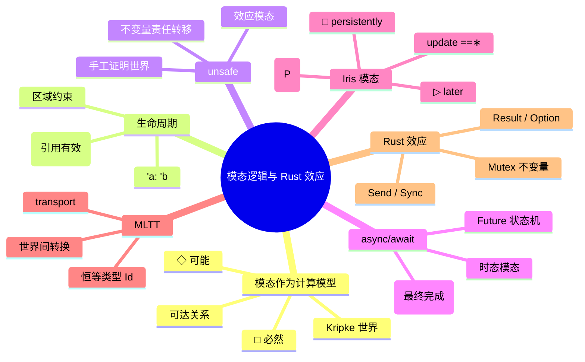

> **内容分级**: [专家级]

# 模态逻辑与 Rust 计算效应（Modal Logic and Rust Effects）

> **EN**: Modal Logic and Rust Effects
> **Summary**: Treats modal logic and Iris modal separation logic as computational models for Rust effects, mapping Kripke necessity/possibility, temporal modalities, and Iris's persistently/later/update modalities to lifetimes, unsafe boundaries, async/await, and formal reasoning about ownership.

> **Rust 版本**: 1.97.0+ (Edition 2024)
> **Bloom 层级**: L4-L5
> **权威来源**: 本文件为 `concept/` 权威页。
> **定位**: 从**计算模型**视角把模态逻辑当作 Rust 计算效应的语义框架：将生命周期、unsafe、`async/await` 等工程机制解释为**模态算子**，并说明 Iris 的 □ / ▷ / update 模态如何在机械证明中建模这些效应，与 [范畴论与 Rust](10_category_theory_and_rust.md) 共同构成「结构语义 + 效应语义」的形式化双翼。
> **前置概念**:
> [Category Theory and Rust](10_category_theory_and_rust.md) ·
> [Type Theory and Rust](07_type_theory_and_rust.md) ·
> [Separation Logic for Rust](08_separation_logic_for_rust.md) ·
> [Algebraic Effects](../07_concurrency_semantics/04_algebraic_effects.md) ·
> [Lifetimes Advanced](../../01_foundation/01_ownership_borrow_lifetime/04_lifetimes_advanced.md)
> **后置概念**:
> [Iris](../02_separation_logic/01_rustbelt.md) ·
> [RustBelt](../02_separation_logic/01_rustbelt.md) ·
> [Async State Machine Semantics](../03_operational_semantics/11_async_state_machine_semantics.md) ·
> [Send/Sync Semantics](../07_concurrency_semantics/08_send_sync_semantics.md) ·
> [Unsafe Rust](../../03_advanced/02_unsafe/01_unsafe.md) ·
> [Async/Await](../../03_advanced/01_async/01_async.md)

---

## 📑 目录

- [模态逻辑与 Rust 计算效应（Modal Logic and Rust Effects）](#模态逻辑与-rust-计算效应modal-logic-and-rust-effects)
  - [📑 目录](#-目录)
  - [一、核心概念](#一核心概念)
    - [1.1 模态逻辑作为计算模型](#11-模态逻辑作为计算模型)
    - [1.2 Kripke 语义：可能世界与可达关系](#12-kripke-语义可能世界与可达关系)
    - [1.3 必然 □ 与可能 ◇](#13-必然--与可能-)
    - [1.4 生命周期作为模态约束](#14-生命周期作为模态约束)
    - [1.5 `unsafe` 作为效应模态](#15-unsafe-作为效应模态)
    - [1.6 `async/await` 作为时态模态](#16-asyncawait-作为时态模态)
    - [1.7 Iris 模态分离逻辑：□ / ▷ / update](#17-iris-模态分离逻辑----update)
    - [1.8 MLTT 中的模态：恒等类型与 transport](#18-mltt-中的模态恒等类型与-transport)
  - [二、形式化属性矩阵](#二形式化属性矩阵)
  - [三、正向示例](#三正向示例)
    - [示例 1：生命周期作为「必然有效」](#示例-1生命周期作为必然有效)
    - [示例 2：unsafe 边界作为模态转换](#示例-2unsafe-边界作为模态转换)
    - [示例 3：async 作为「最终完成」](#示例-3async-作为最终完成)
  - [四、反例与边界测试](#四反例与边界测试)
    - [反例 1：悬垂引用违反 □（E0106 / E0597）](#反例-1悬垂引用违反-e0106--e0597)
    - [反例 2：unsafe 块不等于安全证明](#反例-2unsafe-块不等于安全证明)
    - [反例 3：在同步函数中 await（E0728）](#反例-3在同步函数中-awaite0728)
  - [五、反命题决策树](#五反命题决策树)
    - [命题：「生命周期就是类型参数」](#命题生命周期就是类型参数)
    - [命题：「unsafe 代码只要不加 unsafe 块就不危险」](#命题unsafe-代码只要不加-unsafe-块就不危险)
  - [六、嵌入式测验（Embedded Quiz）](#六嵌入式测验embedded-quiz)
    - [测验 1：Kripke 框架中的「可能世界」在 Rust 中最接近什么？](#测验-1kripke-框架中的可能世界在-rust-中最接近什么)
    - [测验 2：Iris 中的 □P（persistently）表示什么？](#测验-2iris-中的-ppersistently表示什么)
    - [测验 3：`async fn` 的语义最接近哪个模态算子？](#测验-3async-fn-的语义最接近哪个模态算子)
  - [七、权威来源 / International Authority References](#七权威来源--international-authority-references)
  - [八、🧭 思维导图（Mindmap）](#八-思维导图mindmap)

---

## 一、核心概念

### 1.1 模态逻辑作为计算模型

模态逻辑（modal logic）在传统上研究「必然」与「可能」等模态概念。从**计算模型**视角看，模态算子提供了一种**限定命题有效范围**的语言：

```text
模态逻辑作为计算模型
├── 命题 P: 程序满足某个性质
├── □P:     在所有可达世界中 P 都成立
├── ◇P:     在至少一个可达世界中 P 成立
└── 可达关系: 程序执行中的状态转移 / 时间推进 / 引用有效性变化
```

在 Rust 中，生命周期、unsafe 边界、`async/await`、并发共享等机制都可以被读作**模态算子**：它们告诉我们「某个性质在何时、何地、以何种权限成立」。这与类型系统（回答「什么值具有什么类型」）互补，回答「某个性质在什么条件下成立」。

> **来源**: [Blackburn, Rijke & Venema, *Modal Logic*](https://doi.org/10.1017/CBO9781107050884) · [Jung et al., *Iris from the Ground Up*](https://iris-project.org/pdfs/2018-jfp-iris-ground-up.pdf)

---

### 1.2 Kripke 语义：可能世界与可达关系

**Kripke 语义**把模态公式解释为在**可能世界**（possible worlds）集合上的真值，世界之间通过**可达关系**（accessibility relation）连接。

```text
Kripke 框架
  W: 世界集合（如程序状态、时间点、引用有效范围）
  R ⊆ W × W: 可达关系
  w ⊨ □P  ⇔  对所有 w'，若 wRw'，则 w' ⊨ P
  w ⊨ ◇P  ⇔  存在 w'，wRw' 且 w' ⊨ P
```

在 Rust 中，一个「世界」可以是**程序执行的某个程序点**，而可达关系可以是**后续执行路径**。例如：

- 生命周期 `'a` 对应一组程序点：从引用创建到引用最后一次使用的所有点。
- `&'a T` 表示「在所有 `'a` 可达的世界里，`T` 都有效」。
- `unsafe {}` 表示「在这个世界里，程序员手动保证某些不变量成立」。

---

### 1.3 必然 □ 与可能 ◇

- **□P（必然）**: 在所有可达未来都成立。对应 Rust 中的**全局不变量**、**类型安全保证**、**生命周期约束**。
- **◇P（可能）**: 至少在一个可达未来成立。对应 Rust 中的**可能失败**（`Option`、`Result`）、**最终完成**（`Future`）、**存在某个执行路径**。

```text
Rust 中的 □ / ◇ 直觉
  □(x 是有效的)   → 生命周期保证引用始终有效
  ◇(操作成功)     → Result / Option 编码可失败性
  □(无数据竞争)   → Send/Sync + 借用检查器保证
  ◇(任务最终完成) → async Future 的 liveness 性质
```

---

### 1.4 生命周期作为模态约束

Rust 的生命周期 `'a` 不是普通类型参数，而是一个**对世界集合的约束**。形式化上，可以把 `'a` 看作一个 Kripke 框架中的**可达区域**：

```text
'a: 'b  ⇔  在 a 有效的所有世界里，b 也有效
&'a T   ⇔  □_a (T 有效)   在 a 区域的所有未来世界都有效
&'a mut T ⇔  □_a (独占持有 T)
```

```rust
fn longest<'a>(x: &'a str, y: &'a str) -> &'a str {
    if x.len() > y.len() { x } else { y }
}

fn main() {
    let s1 = String::from("hello");
    let s2 = String::from("world!");
    let r = longest(&s1, &s2); // r 的效域受 s1, s2 共同约束
    println!("{}", r);
}
```

> **关键洞察**: 借用检查器本质上是在 Kripke 框架上求解一组**可达性约束**：确保返回的引用不会在它所依赖的数据失效之后被使用。

> **来源**: [Weiss, Patterson & Ahmed 2018, *Rust Distilled*](https://arxiv.org/abs/1806.02693)

---

### 1.5 `unsafe` 作为效应模态

`unsafe` 可以被视为一个**模态算子**：它标记了一段代码处于「手工保证世界」中，在这个世界里，编译器不再验证某些不变量，但程序员必须手动维持它们。

```text
unsafe 模态
  safe Rust:  □(内存安全 ∧ 无数据竞争)   编译器保证
  unsafe {}:  ◇(程序员保证不变量)         进入手工证明世界
  unsafe fn:  调用者必须具备 □(前置条件)   才能安全进入
```

```rust
fn main() {
    let mut x = 5;
    let r = &mut x as *mut i32;

    unsafe {
        // 在这个世界里，程序员保证 r 指向有效、唯一的可变内存
        *r += 1;
    }

    assert_eq!(x, 6);
}
```

> **关键洞察**: `unsafe` 不是「关闭类型系统」，而是把某些证明责任从编译器转移到程序员。这与模态逻辑中「在不同世界里真值不同」的直觉一致。

---

### 1.6 `async/await` 作为时态模态

`async/await` 可以被解读为**时态逻辑**（temporal logic）中的算子：

```text
async/await 的时态直觉
  async fn f() -> T:  一个最终会产生 T 的计算，即 ◇(返回值是 T)
  .await:             等待直到该 ◇ 变为真
  Future::poll:       在每个时间点检查是否已经到达目标世界
```

```rust
use std::future::Future;
use std::pin::Pin;
use std::task::{Context, Poll, RawWaker, RawWakerVTable, Waker};

fn noop_waker() -> Waker {
    const VT: RawWakerVTable = RawWakerVTable::new(
        |_| RawWaker::new(std::ptr::null(), &VT),
        |_| {},
        |_| {},
        |_| {},
    );
    unsafe { Waker::from_raw(RawWaker::new(std::ptr::null(), &VT)) }
}

fn block_on<F: Future>(mut fut: F) -> F::Output {
    let waker = noop_waker();
    let mut cx = Context::from_waker(&waker);
    let mut pin = unsafe { Pin::new_unchecked(&mut fut) };
    loop {
        match pin.as_mut().poll(&mut cx) {
            Poll::Ready(v) => return v,
            Poll::Pending => {}
        }
    }
}

async fn compute() -> i32 { 42 }

async fn caller() -> i32 {
    let x = compute().await; // 等待 ◇(compute 完成)
    x + 1
}

fn main() {
    let ans = block_on(caller());
    assert_eq!(ans, 43);
}
```

> **关键洞察**: `async` 计算不是立即求值，而是在未来某个世界给出结果。`await` 是跨越时间世界的「模态转换」：把未来的值拉回到当前世界。

---

### 1.7 Iris 模态分离逻辑：□ / ▷ / update

Iris 是一个**高阶并发分离逻辑**框架，它为 RustBelt 等验证项目提供了模态断言语言。Iris 中的几个关键模态算子：

| Iris 模态 | 记号 | 含义 | Rust 直觉 |
|:---|:---|:---|:---|
| Persistently | `□P` | P 是持久的，可以被任意复制而不消耗 | `&T`、共享引用、`'static` 数据 |
| Later | `▷P` | P 在下一步 / 稍后成立 | 归纳定义、递归类型、步进索引语义 |
| Update | `==∗` | 可以通过原子更新使 P 变为 Q | 释放/获取原子操作、所有权转移 |
| Invariant | `inv(P)` | P 在所有执行点都成立 | `Mutex<T>` 保护的不变量 |

```text
Iris 断言示例
  own(x, τ)            : 独占拥有资源 x（非持久，不可复制）
  □(x ↦ v)             : x 指向 v 是一个持久事实（如共享只读）
  ▷(list(x))           : 链表结构在「下一步」成立（用于递归定义）
  <<{ P }>> e <<{ v. Q }>> : 原子霍尔三元组，e 把 P update 到 Q
```

Iris 的 `□` 与 Rust 的共享借用 `&T` 有深刻对应：两者都表示「可以被复制、不会被消耗」的权限。

> **来源**: [Jung et al. 2018, *Iris from the Ground Up*](https://iris-project.org/pdfs/2018-jfp-iris-ground-up.pdf) · [Jung et al. 2018, RustBelt](https://plv.mpi-sws.org/rustbelt/popl18/)

---

### 1.8 MLTT 中的模态：恒等类型与 transport

**Martin-Löf Type Theory (MLTT)** 提供了依赖类型与**恒等类型**（identity type）`Id_A(x, y)`。在 MLTT 中，相等性本身是一种类型，**transport**（代换）允许把证明沿等式传递到另一个世界：

```text
MLTT 核心构造
  Id_A(x, y):  类型，其元素是 x = y 的证明
  refl(x):     自反证明
  transport:   若 P: A → Type 且 p: Id_A(x, y)，则 transport_P(p): P(x) → P(y)
```

Rust 中没有原生依赖类型，但**常量泛型**、**类型相等约束**和 `PhantomData` 可以编码部分 MLTT 直觉：

```rust
use std::marker::PhantomData;

// 用一个类型层恒等标记来编码 "N == M"
struct Eq<N, M>(PhantomData<(N, M)>);

trait Same<Rhs = Self> {
    type Output;
}

impl<T> Same<T> for T {
    type Output = T;
}

fn main() {
    // 类型相等通过 trait 求解；transport 对应于类型转换
    let x: <i32 as Same<i32>>::Output = 42;
    assert_eq!(x, 42);
}
```

> **关键洞察**: MLTT 的模态/相等视角说明：Rust 中的生命周期子类型 `'a: 'b` 可以被视为一种**世界之间的可达关系**，而类型转换与借用检查则是「transport」的工程近似。

> **来源**: [Martin-Löf, *Intuitionistic Type Theory*](https://doi.org/10.2307/2274116) · [HoTT Book](https://homotopytypetheory.org/book/)

---

## 二、形式化属性矩阵

| 模态逻辑概念 | Rust 工程机制 | 形式化含义 | 权威来源 |
|:---|:---|:---|:---|
| Kripke 世界 | 程序点 / 执行状态 | 模态公式求值的位置 | Blackburn et al. 2001 |
| 可达关系 R | 控制流 / 生命周期包含 | 世界之间的转移 | Kripke 1963 |
| □P（必然） | 类型安全、生命周期有效 | 所有可达世界成立 | Modal Logic |
| ◇P（可能） | `Option<T>`、`Result<T,E>`、`Future` | 某个可达世界成立 | Modal Logic |
| 生命周期 `'a` | 区域约束 | Kripke 可达区域 | Rust Distilled 2018 |
| `unsafe` | 手工证明边界 | 进入不同真值世界 | Rust Reference |
| `async/await` | Future / 状态机 | 时态模态 / 最终完成 | Tokio / Rust Reference |
| Iris `□P` | `&T`、共享只读 | 持久断言，可复制 | Iris 2018 |
| Iris `▷P` | 递归类型、归纳定义 | 步进索引 / 稍后成立 | Iris 2018 |
| Iris update | 原子操作、所有权转移 | 模态 update | RustBelt 2018 |
| MLTT `Id_A` | 类型相等约束 | 世界间 transport | Martin-Löf 1984 |

---

## 三、正向示例

### 示例 1：生命周期作为「必然有效」

```rust
fn always_valid<'a>(s: &'a str) -> &'a str {
    // 返回的引用在所有 'a 可达世界都有效
    &s[0..1]
}

fn main() {
    let text = String::from("hello");
    let first = always_valid(&text);
    println!("{}", first);
}
```

### 示例 2：unsafe 边界作为模态转换

```rust
fn main() {
    let mut data = [1, 2, 3];
    let ptr = data.as_mut_ptr();

    // safe 世界：借用检查器保证 &mut data 唯一
    {
        let _ref = &mut data;
    }

    // unsafe 世界：程序员手动保证 ptr 有效且唯一
    unsafe {
        *ptr.add(1) = 42;
    }

    assert_eq!(data, [1, 42, 3]);
}
```

### 示例 3：async 作为「最终完成」

```rust
use std::future::Future;
use std::pin::Pin;
use std::task::{Context, Poll, RawWaker, RawWakerVTable, Waker};

fn noop_waker() -> Waker {
    const VT: RawWakerVTable = RawWakerVTable::new(
        |_| RawWaker::new(std::ptr::null(), &VT),
        |_| {},
        |_| {},
        |_| {},
    );
    unsafe { Waker::from_raw(RawWaker::new(std::ptr::null(), &VT)) }
}

fn block_on<F: Future>(mut fut: F) -> F::Output {
    let waker = noop_waker();
    let mut cx = Context::from_waker(&waker);
    let mut pin = unsafe { Pin::new_unchecked(&mut fut) };
    loop {
        match pin.as_mut().poll(&mut cx) {
            Poll::Ready(v) => return v,
            Poll::Pending => {}
        }
    }
}

async fn eventually() -> i32 {
    // 这个计算不立即返回，但最终会完成
    42
}

async fn compose() -> i32 {
    let x = eventually().await; // 等待最终完成
    x * 2
}

fn main() {
    let result = block_on(compose());
    assert_eq!(result, 84);
}
```

---

## 四、反例与边界测试

### 反例 1：悬垂引用违反 □（E0106 / E0597）

```rust,compile_fail,E0106
fn dangling() -> &i32 {
    let x = 42;
    &x // x 的世界在函数返回后结束，返回的引用失去 □(有效)
}

fn main() {
    let r = dangling();
    println!("{}", r);
}
```

> **错误诊断**: `error[E0106]: missing lifetime specifier`。借用检查器发现返回的引用指向一个局部世界，无法保证在所有调用者的可达世界中有效。
> **修正**: 返回 owned 值，或将生命周期与输入参数绑定。

### 反例 2：unsafe 块不等于安全证明

```rust
// 错误直觉：加了 unsafe 块就自动安全
fn main() {
    let ptr: *mut i32 = std::ptr::null_mut();
    unsafe {
        *ptr = 42; // 未定义行为：空指针解引用
    }
}
```

> **错误诊断**: 运行时 SIGSEGV / UB。`unsafe` 只标记了「手工世界」，不提供自动证明。
> **修正**: 在 unsafe 块内显式维护不变量：指针非空、对齐、唯一、生命周期有效。必要时使用 Miri 或形式化工具验证。

### 反例 3：在同步函数中 await（E0728）

```rust,compile_fail,E0728
async fn async_value() -> i32 { 42 }

fn main() {
    let _ = async_value().await; // .await 只能出现在 async 上下文中
}
```

> **错误诊断**: `error[E0728]: await is only allowed inside async functions and blocks`。
> **修正**: 将调用者改为 `async` 函数/块，或使用 `std::future::block_on` 等执行器同步轮询。

---

## 五、反命题决策树

### 命题：「生命周期就是类型参数」

```text
该命题成立吗？
├── 是 → 不完全。生命周期在语法上像类型参数，但语义上是模态/区域约束：
│   └── 'a: 'b 表示「a 区域包含 b 区域」，不是普通的子类型多态。
└── 否 → 更准确。生命周期是对「可能世界可达关系」的约束；
    └── 它把 Kripke 语义中的可达关系编码进类型系统。
```

### 命题：「unsafe 代码只要不加 unsafe 块就不危险」

```text
该命题成立吗？
├── 是 → 错误。unsafe 不是危险的来源，危险的是违反不变量。
│   └── 不加 unsafe 块的 safe Rust 代码不可能触发未定义行为（由编译器保证）。
└── 否 → 正确。真正的问题是不变量是否被满足；
    └── unsafe 块只是标记了「证明责任转移给程序员」的模态边界。
```

---

## 六、嵌入式测验（Embedded Quiz）

### 测验 1：Kripke 框架中的「可能世界」在 Rust 中最接近什么？

A. 不同的 trait 实现
B. 程序执行中的不同程序点 / 状态
C. 不同的 Cargo feature
D. 不同的编译目标

<details>
<summary>✅ 答案</summary>

**B. 程序执行中的不同程序点 / 状态**。在 Rust 中，生命周期、引用有效性和执行阶段都可以被看作 Kripke 框架中的「世界」。

</details>

### 测验 2：Iris 中的 □P（persistently）表示什么？

A. P 只在当前世界成立
B. P 是持久的，可以被任意复制而不消耗资源
C. P 永远不可能成立
D. P 只在 unsafe 块中成立

<details>
<summary>✅ 答案</summary>

**B. P 是持久的，可以被任意复制而不消耗资源**。这与 Rust 的共享只读引用 `&T` 和 `'static` 数据有深刻对应。

</details>

### 测验 3：`async fn` 的语义最接近哪个模态算子？

A. □（必然）
B. ◇（可能 / 最终）
C. ¬（否定）
D. ⊥（假）

<details>
<summary>✅ 答案</summary>

**B. ◇（可能 / 最终）**。`async fn` 表示一个最终会产生结果的未来计算，`.await` 等待这个「最终」世界到达。

</details>

---

## 七、权威来源 / International Authority References

| 来源 | 可信度 | 说明 |
|:---|:---:|:---|
| [Blackburn, Rijke & Venema, *Modal Logic*](https://doi.org/10.1017/CBO9781107050884) | ✅ 一级 | 模态逻辑标准教材，Kripke 语义 |
| [Kripke, *Semantical Analysis of Modal Logic*](https://doi.org/10.2307/2964560) | ✅ 一级 | Kripke 语义奠基论文 |
| [Jung et al., *Iris from the Ground Up*](https://iris-project.org/pdfs/2018-jfp-iris-ground-up.pdf) | ✅ 一级 | Iris 高阶模态分离逻辑 |
| [Jung et al., RustBelt](https://plv.mpi-sws.org/rustbelt/popl18/) | ✅ 一级 | Rust 安全的 Iris 机械证明 |
| [Weiss, Patterson & Ahmed, *Rust Distilled*](https://arxiv.org/abs/1806.02693) | ✅ 一级 | Rust 类型系统的形式化语义 |
| [Martin-Löf, *Intuitionistic Type Theory*](https://doi.org/10.2307/2274116) | ✅ 一级 | MLTT 奠基著作 |
| [HoTT Book](https://homotopytypetheory.org/book/) | ✅ 一级 | 同伦类型论，恒等类型与 transport |
| [Moggi, *Notions of Computation and Monads*](https://doi.org/10.1016/0890-5401(91)90052-4) | ✅ 一级 | 计算效应的单子模型 |
| [Tokio Documentation](https://tokio.rs/) | ✅ P0 | Rust 异步运行时官方文档 |
| [Rust Reference — Unsafe Rust](https://doc.rust-lang.org/reference/unsafe-keyword.html) | ✅ P0 | unsafe 语义边界 |
| [Verus on GitHub](https://github.com/verus-lang/verus) | ✅ P2 | Rust 机械化验证框架 |
| [ghost-cell on docs.rs](https://docs.rs/ghost-cell/) | ✅ P2 | 编译期不变量与共享可变借用（□ 持久资源直觉） |

---

## 八、🧭 思维导图（Mindmap）


