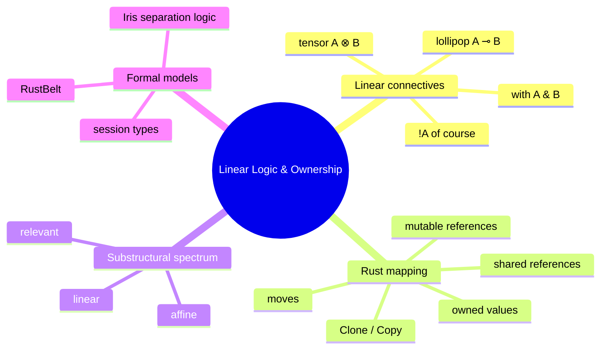
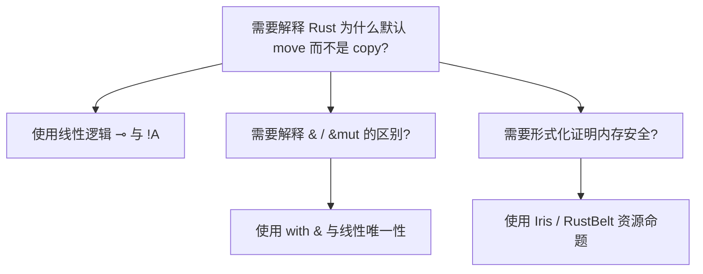

# 线性逻辑与 Rust 所有权

**EN**: Linear Logic and Rust Ownership
**Summary**: Introduce linear logic as the proof-theoretic foundation of Rust's ownership discipline, explaining how !A (of course), ⊗ (tensor), ⊸ (lollipop), and & (with) map to owned values, moves, borrows, and shared references.



> **Rust 版本**: 1.97.1+ (Edition 2024)
> **Bloom 层级**: L4
> **权威来源**: 本文件为 `concept/` 权威页。
> **对齐来源**: [Linear Logic (Girard 1987)](https://girard.perso.math.cnrs.fr/Synsem.pdf) · [RustBelt (Jung et al., POPL 2018)](https://plv.mpi-sws.org/rustbelt/) · [Substructural Type Systems (Walker 2005)](https://www.cs.cmu.edu/~fp/courses/158hr-s12/lectures/19-substructural.pdf) · [Rust Reference — Ownership](https://doc.rust-lang.org/reference/ownership.html) · [Rustonomicon — Ownership](https://doc.rust-lang.org/nomicon/ownership.html) · [Iris Project](https://iris-project.org/)
> **前置概念**: [`01_ownership.md`](../../01_foundation/01_ownership_borrow_lifetime/01_ownership.md)、[`03_lifetimes.md`](../../01_foundation/01_ownership_borrow_lifetime/03_lifetimes.md)、[`02_borrowing.md`](../../01_foundation/01_ownership_borrow_lifetime/02_borrowing.md)、[`06_memory_model.md`](../../03_advanced/02_unsafe/06_memory_model.md)、[`08_memory_allocation_and_lifetime.md`](../../03_advanced/06_low_level_patterns/08_memory_allocation_and_lifetime.md)
> **后置概念**: [`16_rustbelt_ownership_logic.md`](16_rustbelt_ownership_logic.md)、[`06_computational_equivalence_in_rust.md`](06_computational_equivalence_in_rust.md)、[`08_separation_logic_for_rust.md`](08_separation_logic_for_rust.md)

---

## 1. 为什么线性逻辑能解释所有权

经典逻辑中，命题 `A` 为真后可以被任意复制或丢弃（structural rules：weakening 与 contraction）。线性逻辑去掉这两条规则，要求每个假设必须**恰好使用一次**。这与 Rust 所有权高度同构：

| 线性逻辑 | Rust 概念 | 直观含义 |
|---|---|---|
| `A` 作为线性假设 | `T` 的 owned value | 必须被使用，不能凭空消失 |
| 不能 weaken | 不能 drop 未实现 `Drop` 的未使用值 | 资源必须被处理 |
| 不能 contract | 默认不能复制 | 移动语义 |
| `!A`（of course） | `Clone` / `Copy` | 可无限复制 |
| `A ⊗ B` | 元组 `(T, U)` | 同时拥有两个资源 |
| `A ⊸ B` | 函数 `T -> U` | 消耗 `T` 得到 `U` |
| `A & B` | 共享引用 `&T` | 选择使用 `A` 或 `B`，不消耗 |

---

## 2. 线性连接词到 Rust 的映射

### 2.1 线性蕴含 ⊸：消耗与转换

```rust
// A ⊸ B：消耗 String，返回其长度（usize）
fn consume(s: String) -> usize {
    s.len()
}

let name = String::from("linear");
let n = consume(name); // name 被移动，之后不可用
// println!("{}", name); // ERROR: use of moved value
```

### 2.2 张量 ⊗：组合资源

```rust
// A ⊗ B：同时持有 String 与 Vec<u8>
let pair: (String, Vec<u8>) = (String::from("data"), vec![1, 2, 3]);
let (s, v) = pair; // 解构同时获得两个线性资源
```

### 2.3 Of course !A：可复制的值

```rust
// !A：实现 Copy 的 i32 可被任意复制
let n: i32 = 42;
let a = n;
let b = n; // 仍然可用，因为 i32: Copy
println!("{}", n);
```

### 2.4 With &：共享选择

```rust
// A & B：通过 & 同时只读访问多个视图
let data = vec![1, 2, 3];
let r1: &Vec<i32> = &data;
let r2: &Vec<i32> = &data;
println!("{} {}", r1.len(), r2.len());
```

---

## 3. 子结构类型系统视角

线性逻辑是**子结构类型系统**（substructural type system）的一种。去掉 weakening/contraction 后得到线性类型；只去掉 contraction 得到 affine 类型（允许 drop 但不允许 copy）；只去掉 weakening 得到 relevant 类型（必须使用但可重复）。

Rust 的默认语义更接近 **affine**：

- 值可以移动（转移所有权）
- 值可以 drop（未使用变量被隐式释放）
- 值默认不能 copy

`Copy` trait 重新引入 contraction，而 `Drop`/RAII 处理 weakening 的语义（资源必须被释放但可被丢弃）。

---

## 4. 借用作为模态

Rust 的借用可视为两种模态：

- **&T**：只读、可共享、不消耗。对应线性逻辑中的 `□A`（必要性）或 `&A`（with）。
- **&mut T**：独占、可变、不消耗。对应 **唯一引用/单一线性假设** 的受限使用。

```rust
let mut s = String::from("hello");
{
    let r: &mut String = &mut s;
    r.push_str(" world");
} // 借用结束，s 恢复为完整所有权
println!("{}", s);
```

`&mut T` 的关键约束是 **aliasing XOR mutation**：同一时刻要么有多个只读别名，要么有一个可变别名，不能同时成立。这与线性逻辑中“线性假设不能被复制”的核心思想一致。

---

## 5. 反例：如果 Rust 允许复制非 Copy 值

```rust,compile_fail,E0382
fn main() {
    let s = String::from("owned");
    let t = s;
    println!("{}", s); // ERROR: borrow of moved value
}
```

若允许复制 `String`，则两个独立所有者会在作用域结束时各执行一次 `drop`，导致双重释放（double-free）。线性逻辑通过禁止 contraction 在类型层面杜绝此类错误。

---

## 6. 形式化语义提示

在 RustBelt 中，所有权不是语法层面的约定，而是 **Iris 高阶分离逻辑** 中的资源命题：

- `own(T, v)`：对值 `v` 的独占所有权。
- `&{ξ} T`：对位置 `ξ` 的共享只读访问。
- `&mut{ξ} T`：对位置 `ξ` 的可变独占访问。

这些资源命题满足线性逻辑的规则，从而可以用 Iris 的 proof rules 验证 Rust 程序的安全性质。

---

## 7. 与其他计算模型的关系

- **分离逻辑**：线性逻辑的语义模型之一，强调堆内存的局部推理；见 [`08_separation_logic_for_rust.md`](08_separation_logic_for_rust.md)。
- **会话类型**：用线性类型保证通信协议的正确使用；见 [`13_session_types_and_rust_channels.md`](13_session_types_and_rust_channels.md)。
- **RustBelt**：将 Iris/分离逻辑用于 Rust 形式化验证；见 [`16_rustbelt_ownership_logic.md`](16_rustbelt_ownership_logic.md)。

---

## 8. 决策树：何时使用线性逻辑视角



---

## 9. 练习

1. 将 `fn take_and_return(s: String) -> String` 解释为线性逻辑中的 `A ⊸ A`。
2. 解释为什么 `Box<T>` 是线性的，而 `Rc<T>` 通过引用计数突破了线性限制。
3. 画出 `&mut T` 在借用期间的所有权状态机。
