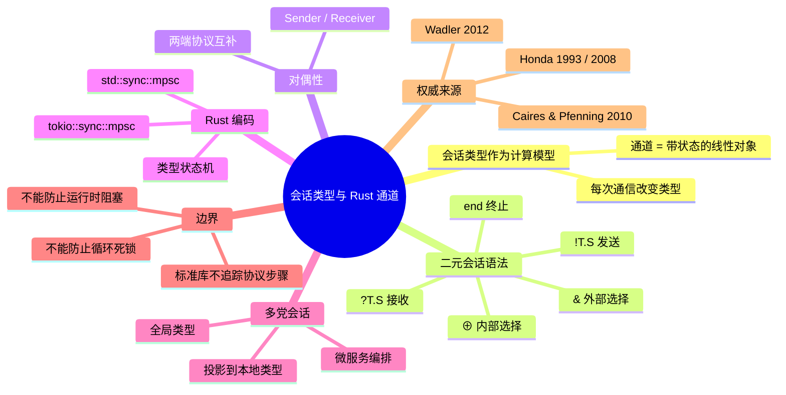

> **内容分级**: [专家级]

# 会话类型与 Rust 通道：作为计算模型的通信协议（Session Types and Rust Channels: Communication Protocols as a Computational Model）

> **EN**: Session Types and Rust Channels: Communication Protocols as a Computational Model
> **Summary**: Treats binary and multiparty session types as a computational model for Rust channel-based communication, mapping Honda's session type syntax, Wadler's propositions-as-sessions correspondence, and linear channel usage to Rust ownership channels, type-state enums, and deadlock-free protocol design.

> **Rust 版本**: 1.97.0+ (Edition 2024)
> **Bloom 层级**: L4-L5
> **权威来源**: 本文件为 `concept/` 权威页。
> **定位**: 从**计算模型**视角把会话类型当作 Rust 通信通道的**协议演算**：说明通道不仅是数据传输管道，而是带有状态演化的线性对象；把 Honda/Wadler 的形式语法投影到 Rust 的 `std::sync::mpsc`、`tokio::sync::mpsc` 以及基于所有权的状态机编码，并与 [线性逻辑与所有权](12_linear_logic_and_ownership.md) 形成「资源演算 → 协议演算」的递进。
> **前置概念**:
> [Linear Logic and Ownership](12_linear_logic_and_ownership.md) ·
> [Session Types](../07_concurrency_semantics/07_session_types.md) ·
> [Concurrency Models](09_concurrency_models_actors_csp.md) ·
> [Channels](../../03_advanced/00_concurrency/01_concurrency.md)
> **后置概念**:
> [Effect Handlers and Rust Limited Effects](14_effect_handlers_and_rust_limited_effects.md) ·
> [Algebraic Effects](../07_concurrency_semantics/04_algebraic_effects.md) ·
> [Async/Await](../../03_advanced/01_async/01_async.md)

---

## 📑 目录

- [会话类型与 Rust 通道：作为计算模型的通信协议（Session Types and Rust Channels: Communication Protocols as a Computational Model）](#会话类型与-rust-通道作为计算模型的通信协议session-types-and-rust-channels-communication-protocols-as-a-computational-model)
  - [📑 目录](#-目录)
  - [一、核心概念](#一核心概念)
    - [1.1 会话类型作为计算模型](#11-会话类型作为计算模型)
    - [1.2 二元会话类型语法](#12-二元会话类型语法)
    - [1.3 对偶性（Duality）](#13-对偶性duality)
    - [1.4 Rust 通道的线性基础](#14-rust-通道的线性基础)
    - [1.5 类型状态机：把协议步骤编码为类型](#15-类型状态机把协议步骤编码为类型)
    - [1.6 多党会话类型与 Rust 微服务编排](#16-多党会话类型与-rust-微服务编排)
    - [1.7 死锁自由与进度（Progress）](#17-死锁自由与进度progress)
  - [二、形式化属性矩阵](#二形式化属性矩阵)
  - [三、正向示例](#三正向示例)
    - [示例 1：!i32.?bool.end 的 Rust 编码](#示例-1i32boolend-的-rust-编码)
    - [示例 2：内部选择 ⊕ 作为枚举分支](#示例-2内部选择--作为枚举分支)
    - [示例 3：多党协议投影](#示例-3多党协议投影)
  - [四、反例与边界测试](#四反例与边界测试)
    - [反例 1：协议顺序错误（E0382）](#反例-1协议顺序错误e0382)
    - [反例 2：通道被克隆导致线性破坏](#反例-2通道被克隆导致线性破坏)
    - [反例 3：忘记接收导致死锁](#反例-3忘记接收导致死锁)
  - [五、反命题决策树](#五反命题决策树)
    - [命题：「Rust 标准库通道已经实现了会话类型」](#命题rust-标准库通道已经实现了会话类型)
    - [命题：「类型状态机能完全防止死锁」](#命题类型状态机能完全防止死锁)
  - [六、嵌入式测验（Embedded Quiz）](#六嵌入式测验embedded-quiz)
    - [测验 1：`!T.S` 在 Rust 中对应什么操作？](#测验-1ts-在-rust-中对应什么操作)
    - [测验 2：会话类型的对偶有什么用？](#测验-2会话类型的对偶有什么用)
    - [测验 3：多党会话类型的核心操作是什么？](#测验-3多党会话类型的核心操作是什么)
  - [七、权威来源 / International Authority References](#七权威来源--international-authority-references)
  - [八、🧭 思维导图（Mindmap）](#八-思维导图mindmap)
  - [来源与延伸阅读](#来源与延伸阅读)

---

## 一、核心概念

### 1.1 会话类型作为计算模型

会话类型（Session Types）把**通信通道**当作一种带有状态的线性资源。与传统的「通道只传数据」不同，会话类型把通道本身类型化：每次发送或接收后，通道的「剩余协议」都会发生变化，直到达到终止状态 `end`。

```text
会话类型作为计算模型
├── 通道 c: S  是一个类型为 S 的线性对象
├── !T.S:      发送 T 后，c 的类型变成 S
├── ?T.S:      接收 T 后，c 的类型变成 S
├── ⊕{lᵢ:Sᵢ}:  主动选择分支 lᵢ，c 的类型变成 Sᵢ
├── &{lᵢ:Sᵢ}:  被动接受对方选择的分支 lᵢ，c 的类型变成 Sᵢ
└── end:       协议终止，通道必须被关闭/消费
```

从计算模型视角，会话类型是一种**进程间计算的交互模型**：程序的行为不仅由输入输出函数决定，还由通信协议的状态机决定。这与 λ 演算、图灵机等「函数式」计算模型互补，专注于**并发进程如何通过受控消息传递进行计算**。

> **来源**: [Honda 1993, *Types for Dyadic Interaction*](https://doi.org/10.1007/3-540-58043-3_19) · [Honda, Yoshida & Carbone 2008, *Multiparty Asynchronous Session Types*](https://doi.org/10.1145/1328438.1328472)

---

### 1.2 二元会话类型语法

二元会话类型描述两个参与方之间的协议。设 `S` 为会话类型：

```text
S ::= !T. S          发送类型 T，然后继续 S
   |  ?T. S          接收类型 T，然后继续 S
   |  ⊕{l₁:S₁, ..., lₙ:Sₙ}   内部选择（主动选择分支）
   |  &{l₁:S₁, ..., lₙ:Sₙ}   外部选择（被动接受分支）
   |  end             协议终止
   |  μX.S            递归协议（如无限循环服务）
```

Rust 标准库不原生支持会话类型，但 Rust 的**所有权和 move 语义**提供了编码这些协议的理想基础设施：

- `Sender<T>` / `Receiver<T>` 是**单所有者**、不可复制的（除非实现 `Clone`，但这会破坏线性）。
- 通过把每一步封装成不同 Rust 类型，可以让协议错误变成**编译期类型错误**。

---

### 1.3 对偶性（Duality）

会话类型的核心性质是**对偶**（duality）：如果客户端遵守协议 `S`，服务端必须遵守 `S` 的对偶 `S̄`。

```text
对偶规则
  !T.S 的对偶 = ?T.S̄
  ?T.S 的对偶 = !T.S̄
  ⊕{lᵢ:Sᵢ} 的对偶 = &{lᵢ:S̄ᵢ}
  &{lᵢ:Sᵢ} 的对偶 = ⊕{lᵢ:S̄ᵢ}
  end 的对偶 = end
```

Rust 中，`std::sync::mpsc::channel::<T>()` 返回的 `(Sender<T>, Receiver<T>)` 天然构成一对对偶端点：一个只能发送，一个只能接收。

```rust
use std::sync::mpsc::channel;

fn main() {
    let (tx, rx) = channel::<i32>();
    // tx 是 !i32 端
    // rx 是 ?i32 端
    tx.send(42).unwrap();
    assert_eq!(rx.recv().unwrap(), 42);
}
```

> **关键洞察**: 对偶性是会话类型保证**通信匹配**的基础。在 Rust 中，这由通道 API 的静态类型部分保证：不能把 `Sender` 当 `Receiver` 用，但**不能**保证发送/接收的顺序或次数。

---

### 1.4 Rust 通道的线性基础

Rust 的通道端点（`Sender` / `Receiver`）默认是线性使用的良好候选：

| 性质 | 会话类型要求 | Rust 通道支持 |
|---|---|---|
| 不可复制 | 线性使用 | ✅ `Sender<T>` / `Receiver<T>` 不实现 `Copy` |
| 不可丢弃 | 协议必须完成 | ⚠️ 编译器不检查是否还有未接收消息 |
| 状态演化 | 每次操作后类型改变 | ❌ 标准库不追踪 |
| 对偶匹配 | 两端必须互补 | ✅ 静态类型保证消息类型匹配 |

标准库通道提供了「线性资源」的**部分**保证。要获得完整会话类型保证，需要使用**类型状态机**或外部库（如 `session_types`）。

---

### 1.5 类型状态机：把协议步骤编码为类型

通过把协议的每一步表示为不同的 Rust 类型，可以在编译期强制执行协议顺序：

```rust
use std::sync::mpsc::{channel, Receiver, Sender};

// 协议：Client: !String. ?i32. end
pub struct Chan<S, R> {
    tx: Sender<S>,
    rx: Receiver<R>,
}

// 步骤 1: 发送 String
pub struct SendName(Chan<String, i32>);

// 步骤 2: 接收 i32
pub struct RecvPrice(Chan<String, i32>);

impl SendName {
    pub fn send_name(self, name: String) -> RecvPrice {
        self.0.tx.send(name).unwrap();
        RecvPrice(self.0)
    }
}

impl RecvPrice {
    pub fn recv_price(self) -> i32 {
        self.0.rx.recv().unwrap()
    }
}

fn main() {
    let (tx1, rx1) = channel::<String>();
    let (tx2, rx2) = channel::<i32>();

    std::thread::spawn(move || {
        let name = rx1.recv().unwrap();
        assert_eq!(name, "apple");
        tx2.send(42).unwrap();
    });

    let client = SendName(Chan { tx: tx1, rx: rx2 });
    let client = client.send_name("apple".into());
    let price = client.recv_price();
    assert_eq!(price, 42);
}
```

> **关键点**: 通过 `self` 消费，`send_name` 之后无法再调用；协议错误变成编译期所有权错误 `E0382`。

---

### 1.6 多党会话类型与 Rust 微服务编排

当通信涉及 ≥3 个角色时，使用**多党会话类型**（Multiparty Session Types, MPST）。核心思想：

1. 用**全局类型**（global type）描述整体协议。
2. 通过**投影**（projection）得到每个参与者的本地类型。
3. 如果每个参与者都遵守本地类型，则全局协议不会出现角色混淆或特定类型的死锁。

```text
全局类型示例:
  A → B:〈String〉. B → C:〈i32〉. A → C:〈bool〉. end

投影到 A:
  !String to B. !bool to C. end

投影到 B:
  ?String from A. !i32 to C. end

投影到 C:
  ?i32 from B. ?bool from A. end
```

Rust 中典型的多党协议场景是**微服务编排**或 **actor 系统**。虽然没有原生 MPST 支持，但可以通过代码生成或类型状态机实现静态检查：

```rust
// 教学级：角色 B 的本地类型状态机
pub struct B_AwaitName;
pub struct B_SendPrice {
    to_c: Sender<i32>,
}

impl B_AwaitName {
    pub fn recv_name(self, from_a: Receiver<String>) -> (String, B_SendPrice) {
        let name = from_a.recv().unwrap();
        let (tx, _rx) = std::sync::mpsc::channel::<i32>();
        (name, B_SendPrice { to_c: tx })
    }
}

impl B_SendPrice {
    pub fn send_price(self, price: i32) {
        self.to_c.send(price).unwrap();
    }
}
```

> **来源**: [Honda, Yoshida & Carbone 2008](https://doi.org/10.1145/1328438.1328472) · [Scribble 项目](http://www.scribble.org/)

---

### 1.7 死锁自由与进度（Progress）

会话类型理论的一个重要结果是：**良类型的会话程序在满足特定条件时具有进度（progress）性质**，即不会陷入所有参与者都在等待接收的死锁状态。严格结果通常要求：

1. 每个通道最终都会被使用（线性消耗）。
2. 选择分支被双方同步理解。
3. 递归协议有正确的终止/继续条件。

Rust 的借用检查器和所有权系统保证了**通道端点的唯一性**，从而防止了某些类型的协议错误（如一个端点被多个线程同时写入）。但是：

- **不能防止循环等待死锁**：A 等待 B，B 等待 A。
- **不能防止协议未完成**：通道被 `drop` 但还有未处理消息。
- **不能防止运行时阻塞**：`recv()` 在空通道上永远阻塞。

因此，Rust + 会话类型编码提供了**强于普通通道、弱于完全形式化证明**的协议安全保证。

---

## 二、形式化属性矩阵

| 会话类型概念 | Rust 工程机制 | 形式化含义 | 权威来源 |
|:---|:---|:---|:---|
| `!T.S` | `tx.send(T)` | 发送后通道类型变为 S | Honda 1993 |
| `?T.S` | `rx.recv()` | 接收后通道类型变为 S | Honda 1993 |
| `⊕{lᵢ:Sᵢ}` | `enum` / 主动选择分支 | 内部选择 | Wadler 2012 |
| `&{lᵢ:Sᵢ}` | `match` / 被动处理分支 | 外部选择 | Wadler 2012 |
| `end` | 通道关闭 / 消费 | 协议终止 | Honda 1993 |
| 对偶 `S̄` | `(Sender, Receiver)` | 两端协议互补 | Honda 1993 |
| 线性使用 | `move` / 非 Copy | 端点不被复制 | Linear logic |
| 多党投影 | 本地类型状态机 | 全局协议分解 | Honda 2008 |
| 进度 | 协议无循环依赖 | 死锁自由（受限） | MPST 理论 |

---

## 三、正向示例

### 示例 1：!i32.?bool.end 的 Rust 编码

```rust
use std::sync::mpsc::{channel, Receiver, Sender};

struct SendInt(Sender<i32>);
struct RecvBool(Receiver<bool>);

impl SendInt {
    fn send(self, n: i32) -> RecvBool {
        self.0.send(n).unwrap();
        let (_, rx_bool) = channel::<bool>();
        RecvBool(rx_bool) // 教学级：实际应使用同一通道的对偶
    }
}

fn main() {
    let (tx, _) = channel::<i32>();
    let step = SendInt(tx);
    let _ = step.send(42);
}
```

### 示例 2：内部选择 ⊕ 作为枚举分支

```rust
use std::sync::mpsc::{channel, Sender};

enum Payment { Pay(String), Quit }

struct ChoosePayment(Sender<Payment>);

impl ChoosePayment {
    fn pay(self, card: String) {
        self.0.send(Payment::Pay(card)).unwrap();
    }
    fn quit(self) {
        self.0.send(Payment::Quit).unwrap();
    }
}

fn main() {
    let (tx, rx) = channel::<Payment>();
    let client = ChoosePayment(tx);
    client.pay("1234".into());
    match rx.recv().unwrap() {
        Payment::Pay(card) => println!("pay with {}", card),
        Payment::Quit => println!("quit"),
    }
}
```

### 示例 3：多党协议投影

```rust
// 角色 A: 先向 B 发 String，再向 C 发 bool
pub struct A_To_B(Sender<String>);
pub struct A_To_C(Sender<bool>);

impl A_To_B {
    pub fn send_to_b(self, msg: String, to_c: Sender<bool>) -> A_To_C {
        self.0.send(msg).unwrap();
        A_To_C(to_c)
    }
}

impl A_To_C {
    pub fn send_to_c(self, flag: bool) {
        self.0.send(flag).unwrap();
    }
}
```

---

## 四、反例与边界测试

### 反例 1：协议顺序错误（E0382）

```rust,compile_fail,E0382
use std::sync::mpsc::{channel, Receiver, Sender};

struct SendName(Sender<String>);
struct RecvPrice(Receiver<i32>);

impl SendName {
    fn send_name(self, name: String) -> RecvPrice {
        let (tx_i32, rx_i32) = channel::<i32>();
        self.0.send(name).unwrap();
        RecvPrice(rx_i32)
    }
}

fn main() {
    let (tx, _) = channel::<String>();
    let client = SendName(tx);
    client.send_name("apple".into());
    client.send_name("banana".into()); // ❌ client 已被消费
}
```

> **错误诊断**: `error[E0382]: use of moved value:`client``。类型状态机通过所有权消费防止协议步骤被重复执行。
> **修正**: 设计协议状态机使每一步只能转移到合法的下一步。

### 反例 2：通道被克隆导致线性破坏

```rust
use std::sync::mpsc::channel;

fn main() {
    let (tx, rx) = channel::<i32>();
    let tx2 = tx.clone(); // Sender<T> 实现 Clone
    tx.send(1).unwrap();
    tx2.send(2).unwrap();
    assert_eq!(rx.recv().unwrap(), 1);
    assert_eq!(rx.recv().unwrap(), 2);
}
```

> **错误诊断**: 代码可以编译并运行，但**破坏会话类型的线性假设**。多发送端意味着协议可以有多个「当前状态」，导致无法静态验证协议进度。
> **修正**: 对需要会话类型保证的通道，使用 `SendOnce` 包装器禁止 `Clone`，或选择 `session_types` 等库。

### 反例 3：忘记接收导致死锁

```rust
use std::sync::mpsc::channel;

fn main() {
    let (tx, rx) = channel::<i32>();
    tx.send(42).unwrap();
    // rx.recv() 被忘记；程序结束时通道被 drop，发送端收到 RecvError
    drop(rx);
}
```

> **错误诊断**: 运行时 `tx.send` 可能 panic（若发送端意识到接收端已关闭）。Rust 编译器**不会**检查协议是否完整执行。
> **修正**: 使用类型状态机确保 `end` 状态被显式消费，或在代码审查中保证每个 `send` 有对应 `recv`。

---

## 五、反命题决策树

### 命题：「Rust 标准库通道已经实现了会话类型」

```text
该命题成立吗？
├── 是 → 不完全。标准库通道提供了部分基础：
│   ├── Sender/Receiver 是单所有者（除非 Clone）
│   ├── 消息类型在编译期匹配
│   └── 不可在编译期混淆发送/接收方向
└── 否 → 更准确。标准库不追踪：
    ├── 协议步骤顺序（!T 后应该是 ?U 还是 end）
    ├── 通道是否被完整消费
    └── 多党协议的投影关系
```

### 命题：「类型状态机能完全防止死锁」

```text
该命题成立吗？
├── 是 → 错误。类型状态机可以防止协议步骤顺序错误，但无法防止：
│   ├── 循环等待（A 等 B，B 等 A）
│   ├── 运行时阻塞在空通道上
│   └── 协议设计本身的逻辑死锁
└── 否 → 正确。完整死锁自由需要形式化模型检测或 MPST 理论的额外约束。
```

---

## 六、嵌入式测验（Embedded Quiz）

### 测验 1：`!T.S` 在 Rust 中对应什么操作？

A. `rx.recv()`
B. `tx.send(T)`
C. `drop(channel)`
D. `clone(tx)`

<details>
<summary>✅ 答案</summary>

**B. `tx.send(T)`**。`!T.S` 表示发送类型 T 后协议继续为 S；Rust 中对应发送端操作。

</details>

### 测验 2：会话类型的对偶有什么用？

A. 让客户端和服务端使用相同代码
B. 保证通信两端互补匹配
C. 提高运行时性能
D. 自动生成文档

<details>
<summary>✅ 答案</summary>

**B. 保证通信两端互补匹配**。如果一个端点是 `!T.S`，对偶端点必须是 `?T.S̄`，从而确保发送有人接收、接收有人发送。

</details>

### 测验 3：多党会话类型的核心操作是什么？

A. 递归
B. 投影（projection）
C. Currying
D. 泛型实例化

<details>
<summary>✅ 答案</summary>

**B. 投影（projection）**。全局类型通过投影得到每个参与者的本地类型，从而把整体协议分解为可独立实现的模块。

</details>

---

## 七、权威来源 / International Authority References

| 来源 | 可信度 | 说明 |
|:---|:---:|:---|
| [Honda 1993, *Types for Dyadic Interaction*](https://doi.org/10.1007/3-540-58043-3_19) | ✅ 一级 | 二元会话类型奠基论文 |
| [Honda, Yoshida & Carbone 2008, *Multiparty Asynchronous Session Types*](https://doi.org/10.1145/1328438.1328472) | ✅ 一级 | 多党异步会话类型，POPL 2008 |
| [Wadler 2012, *Propositions as Sessions*](https://doi.org/10.1145/2103656.2103661) | ✅ 一级 | 线性逻辑与会话类型的 Curry-Howard 同构 |
| [Caires & Pfenning 2010, *Session Types as Intuitionistic Linear Propositions*](https://doi.org/10.1007/978-3-642-12032-9_3) | ✅ 一级 | 会话类型与直觉主义线性逻辑的形式对应 |
| [Rust Book — Message Passing](https://doc.rust-lang.org/book/ch16-02-message-passing.html) | ✅ P0 | Rust 官方通道教程 |
| [tokio::sync::mpsc](https://docs.rs/tokio/latest/tokio/sync/mpsc/index.html) | ✅ P0 | 异步多生产者单消费者通道 |
| [session_types on docs.rs](https://docs.rs/session_types/latest/session_types/) | ✅ P2 | Rust 会话类型库 |
| [Session Types Bibliography](http://groups.inf.ed.ac.uk/abcd/session-types-bibliography.html) | ✅ P2 | 会话类型文献索引 |

---

## 八、🧭 思维导图（Mindmap）



## 来源与延伸阅读

- [RustBelt: Securing the Foundations of Rust](https://plv.mpi-sws.org/rustbelt/popl18/)
- [Aeneas Project](https://aeneasverif.github.io/)
- [Flux Refinement Types](https://flux-rs.github.io/)
- [arXiv](https://arxiv.org/)
- [ACM Digital Library](https://dl.acm.org/)
