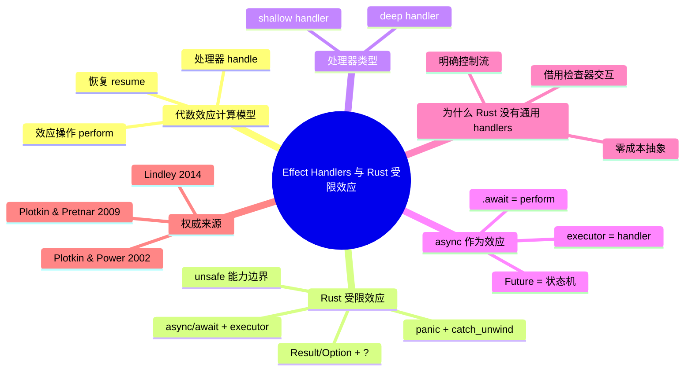

> **内容分级**: [专家级]

# Effect Handlers 与 Rust 的受限效应：作为计算模型的控制流抽象（Effect Handlers and Rust's Limited Effects: Control-Flow Abstractions as a Computational Model）

> **EN**: Effect Handlers and Rust's Limited Effects: Control-Flow Abstractions as a Computational Model
> **Summary**: Treats algebraic effects and handlers as a computational model for Rust's controlled effectful computations, mapping effect operations, resumptions, and handler framing to Rust's Result, Option, async/await, panics, unsafe, and scoped control-flow patterns, while explaining why Rust does not provide general effect handlers.

> **Rust 版本**: 1.97.0+ (Edition 2024)
> **Bloom 层级**: L4-L5
> **权威来源**: 本文件为 `concept/` 权威页。
> **定位**: 从**计算模型**视角把代数效应/处理器当作 Rust 中各类「受控效应」的统一语义框架：说明 `Result`、`Option`、`async/await`、`panic`、`unsafe` 都是**受限的效应实例**，而真正的代数效应处理器提供了更一般的「可恢复控制流」抽象；同时解释 Rust 语言设计为何止步于受限效应而非通用 effect handlers。
> **前置概念**:
> [Algebraic Effects](../07_concurrency_semantics/04_algebraic_effects.md) ·
> [Modal Logic and Rust Effects](11_modal_logic_and_rust_effects.md) ·
> [Category Theory and Rust](10_category_theory_and_rust.md) ·
> [Async/Await](../../03_advanced/01_async/01_async.md)
> **后置概念**:
> [Session Types and Rust Channels](13_session_types_and_rust_channels.md) ·
> [Refinement Types and Flux](15_refinement_types_and_flux.md) ·
> [Unsafe Rust](../../03_advanced/02_unsafe/01_unsafe.md)

---

## 📑 目录

- [Effect Handlers 与 Rust 的受限效应：作为计算模型的控制流抽象（Effect Handlers and Rust's Limited Effects: Control-Flow Abstractions as a Computational Model）](#effect-handlers-与-rust-的受限效应作为计算模型的控制流抽象effect-handlers-and-rusts-limited-effects-control-flow-abstractions-as-a-computational-model)
  - [📑 目录](#-目录)
  - [一、核心概念](#一核心概念)
    - [1.1 代数效应与处理器作为计算模型](#11-代数效应与处理器作为计算模型)
    - [1.2 效应操作与恢复（Resumption）](#12-效应操作与恢复resumption)
    - [1.3 处理器的结构：deep / shallow](#13-处理器的结构deep--shallow)
    - [1.4 Rust 的受限效应全景](#14-rust-的受限效应全景)
    - [1.5 Result / Option：可失败效应](#15-result--option可失败效应)
    - [1.6 async / await：并发/时态效应](#16-async--await并发时态效应)
    - [1.7 panic：非恢复性控制流效应](#17-panic非恢复性控制流效应)
    - [1.8 unsafe：能力/权限效应](#18-unsafe能力权限效应)
    - [1.9 为什么 Rust 没有通用 effect handlers](#19-为什么-rust-没有通用-effect-handlers)
  - [二、形式化属性矩阵](#二形式化属性矩阵)
  - [三、正向示例](#三正向示例)
    - [示例 1：用枚举模拟状态效应](#示例-1用枚举模拟状态效应)
    - [示例 2：Result 作为可失败效应](#示例-2result-作为可失败效应)
    - [示例 3：async 作为挂起/恢复](#示例-3async-作为挂起恢复)
  - [四、反例与边界测试](#四反例与边界测试)
    - [反例 1：把 panic 当作 effect handler 使用](#反例-1把-panic-当作-effect-handler-使用)
    - [反例 2：在 async 中跨 await 持有非 Send 值](#反例-2在-async-中跨-await-持有非-send-值)
    - [反例 3：试图用闭包实现通用 resumption](#反例-3试图用闭包实现通用-resumption)
  - [五、反命题决策树](#五反命题决策树)
    - [命题：「Rust 的 ? 就是 effect handler」](#命题rust-的--就是-effect-handler)
    - [命题：「async/await 已经是完整的代数效应」](#命题asyncawait-已经是完整的代数效应)
  - [六、嵌入式测验（Embedded Quiz）](#六嵌入式测验embedded-quiz)
    - [测验 1：代数效应处理器的核心能力是什么？](#测验-1代数效应处理器的核心能力是什么)
    - [测验 2：Rust 中哪个机制最接近「恢复 continuation」？](#测验-2rust-中哪个机制最接近恢复-continuation)
    - [测验 3：Rust 为什么没有通用 effect handlers？](#测验-3rust-为什么没有通用-effect-handlers)
  - [七、权威来源 / International Authority References](#七权威来源--international-authority-references)
  - [八、🧭 思维导图（Mindmap）](#八-思维导图mindmap)

---

## 一、核心概念

### 1.1 代数效应与处理器作为计算模型

**代数效应（Algebraic Effects）**把计算中的「副作用」显式建模为**效应操作（effect operations）**。例如，一个状态效应可以包含 `get()` 和 `set(v)` 两个操作；一个选择效应可以包含 `choose()` 操作。与单子把所有效应打包进一个类型构造子不同，代数效应把效应当作**可组合的原语**。

**效应处理器（Effect Handlers）**则是这些操作的解释器：它拦截效应操作，决定如何处理，并可以选择**恢复（resume）**被挂起的计算。

```text
代数效应计算模型
├── 值计算: 纯函数 f(x) = y
├── 效应操作: perform op(args) — 暂停当前计算，请求外部解释
├── 处理器: handle e with { op(args, resume) -> ... }
│            捕获效应，处理它，并可能 resume 继续执行
└── 恢复 continuation: resume(v) 把值 v 传回被挂起点
```

在 Rust 中，我们没有原生的 `perform` / `handle` 语法，但许多常见模式都是**受限的 effect handler**：

- `Result<T, E>` + `?`：可失败效应，处理器是调用者的 `match`。
- `Option<T>` + `?`：可空效应。
- `async/await`：挂起/恢复效应，处理器是异步执行器（executor）。
- `panic!` + `catch_unwind`：非恢复性控制流效应。
- `unsafe {}`：能力效应，处理器是程序员的手工证明责任。

> **来源**: [Plotkin & Power 2002, *Notions of Computation Determine Monads*](https://doi.org/10.1007/3-540-45931-6_24) · [Plotkin & Pretnar 2009, *Handlers of Algebraic Effects*](https://doi.org/10.1007/978-3-642-00590-9_7)

---

### 1.2 效应操作与恢复（Resumption）

通用 effect handler 的关键特性是**可恢复的 continuation**。当计算执行 `perform E(x)` 时，它被挂起，处理器拿到：

1. 效应参数 `x`。
2. 一个**恢复函数** `resume`，调用 `resume(v)` 会让被挂起的计算从 `perform` 处继续，并返回 `v`。

```text
可恢复控制流
  let result = handle {
    let a = perform Get() in
    perform Set(a + 1);
    a
  } with {
    Get(_, resume) -> resume(current_state)
    Set(v, resume) -> { current_state := v; resume(()) }
  }
```

Rust 没有原生的 `resume` 机制，但可以用**生成器（generators）**或**手动的状态机**模拟可恢复计算。async/await 的 `.await` 点本质上就是被挂起点，执行器通过 `Future::poll` 恢复执行。

---

### 1.3 处理器的结构：deep / shallow

- **Deep handler**：每个 resume 都会重新进入同一个处理器上下文，因此后续效应仍被同一处理器捕获。
- **Shallow handler**：只处理最近的效应，resume 后离开当前处理器。

Rust 的 `?` 操作符最接近 **shallow handler**：它只处理当前函数的 `Result` / `Option`，并把值返回给上一层调用栈。如果更深层调用再次失败，`?` 会再次传播，但那是外层调用者的 handler 责任。

```rust
fn may_fail(x: i32) -> Result<i32, &'static str> {
    if x > 0 { Ok(x * 2) } else { Err("negative") }
}

fn caller(x: i32) -> Result<i32, &'static str> {
    let a = may_fail(x)?; // shallow handler：只处理这一层的 Err
    let b = may_fail(a)?;
    Ok(b)
}

fn main() {
    assert_eq!(caller(3), Ok(12));
    assert_eq!(caller(-1), Err("negative"));
}
```

---

### 1.4 Rust 的受限效应全景

Rust 没有通用 effect handlers，但它把常见效应**特化**为语言内置机制：

| 效应 | 代数效应对应 | Rust 机制 | 是否可恢复 |
|---|---|---|---|
| 可失败 | Exception / Choice | `Result<T, E>` + `?` | 部分可恢复（通过 match） |
| 可空 | Option | `Option<T>` + `?` | 部分可恢复 |
| 状态 | State | `&mut T`、闭包捕获 | 不可跨调用恢复 |
| 非局部退出 | Escape | `panic!` / `catch_unwind` | 不可恢复到 panic 点 |
| 并发/挂起 | Async | `async/await` + executor | 可恢复（状态机） |
| 能力/权限 | Capabilities | `unsafe {}` / unsafe fn | 不可恢复，责任转移 |
| 日志/跟踪 | Writer | 宏 / 全局订阅者 | 不可恢复 |
| 选择/回溯 | Choice | 手动枚举 + match | 不可恢复 |

这种「受限效应」设计的优势是**零成本抽象**和**明确的控制流**：编译器知道每种效应的确切行为，可以生成高效代码。代价是**缺乏统一语法**：每种效应都有自己的语法和约定。

---

### 1.5 Result / Option：可失败效应

`Result<T, E>` 是最常见的受限效应。从 effect handler 视角：

- `Ok(v)` 是正常值。
- `Err(e)` 是触发了一个「失败效应」。
- `?` 是「如果触发失败效应，则传播给调用者」的语法糖。
- `match` / `if let` 是显式 handler。

```rust
fn safe_div(a: i32, b: i32) -> Result<i32, &'static str> {
    if b == 0 { Err("division by zero") } else { Ok(a / b) }
}

fn compute(a: i32, b: i32, c: i32) -> Result<i32, &'static str> {
    let x = safe_div(a, b)?; // 失败效应传播
    let y = safe_div(x, c)?;
    Ok(y)
}

fn main() {
    assert_eq!(compute(10, 2, 5), Ok(1));
    assert_eq!(compute(10, 0, 5), Err("division by zero"));
}
```

> **关键洞察**: `?` 是一个**受限制的 resume**：它只允许两种结果——成功继续或失败传播。通用 effect handler 允许处理器返回任意值并恢复执行。

---

### 1.6 async / await：并发/时态效应

`async/await` 是 Rust 中最接近通用 effect handler 的机制：

- `async fn` 定义了一个可能挂起的计算。
- `.await` 是效应操作：「我现在需要等待某个 Future 完成」。
- 异步执行器是 handler：它调度 Future，在就绪时恢复执行。
- `Future::poll` 的 `Poll::Pending` / `Poll::Ready` 就是「挂起 / 恢复」的接口。

```rust
use std::future::Future;
use std::pin::Pin;
use std::task::{Context, Poll, RawWaker, RawWakerVTable, Waker};

fn noop_waker() -> Waker {
    const VT: RawWakerVTable = RawWakerVTable::new(
        |_| RawWaker::new(std::ptr::null(), &VT),
        |_| {}, |_| {}, |_| {},
    );
    unsafe { Waker::from_raw(RawWaker::new(std::ptr::null(), &VT)) }
}

fn block_on<F: Future>(mut fut: F) -> F::Output {
    let waker = noop_waker();
    let mut cx = Context::from_waker(&waker);
    let mut pin = unsafe { Pin::new_unchecked(&mut fut) };
    loop {
        match pin.as_mut().poll(&mut cx) {
            Poll::Ready(v) => return v,
            Poll::Pending => {}
        }
    }
}

async fn step1() -> i32 { 10 }
async fn step2(x: i32) -> i32 { x + 1 }

async fn composed() -> i32 {
    let x = step1().await; // perform await
    step2(x).await
}

fn main() {
    assert_eq!(block_on(composed()), 11);
}
```

> **关键洞察**: async/await 把「时态挂起」这一效应当作一等公民，但只支持**单一效应**（挂起等待 Future），不支持自定义效应操作。

---

### 1.7 panic：非恢复性控制流效应

`panic!` 是 Rust 中最接近「异常」的机制，但它是**非恢复性**的：

- `panic!` 会展开（unwind）调用栈。
- `std::panic::catch_unwind` 可以捕获 panic，但**不能恢复**到 panic 点继续执行。

从 effect handler 视角，`panic` 是一个只允许「中止」处理的效应：处理器可以选择清理资源，但不能 `resume`。

```rust
use std::panic;

fn main() {
    let result = panic::catch_unwind(|| {
        panic!("boom");
    });
    assert!(result.is_err());
}
```

> **关键洞察**: panic 的不可恢复性使其语义简单，但也意味着它不能用于通用控制流。它是有意为之的设计：Rust 希望失败处理主要通过 `Result` 进行。

---

### 1.8 unsafe：能力/权限效应

`unsafe` 不是一种运行时效应，而是一种**静态能力效应**：

- `unsafe fn` 声明「调用此函数需要满足某些前置条件」。
- `unsafe {}` 块表示「在此区域内，程序员手动保证不变量」。
- 它可以被看作一种**能力（capability）**：拥有 `unsafe` 权限才能执行某些操作。

```rust
fn main() {
    let mut x = 5;
    let r = &mut x as *mut i32;
    unsafe {
        *r += 1; // 需要 unsafe 能力
    }
    assert_eq!(x, 6);
}
```

> **关键洞察**: `unsafe` 与 effect handler 不同，它不挂起计算也不恢复 continuation。它更像是一个**权限边界**：进入边界需要额外证明，离开边界时保证不变量未被破坏。

---

### 1.9 为什么 Rust 没有通用 effect handlers

Rust 语言设计 deliberate 地不提供通用 effect handlers，主要原因包括：

1. **零成本抽象**：通用 effect handlers 通常需要运行时支持（continuation 捕获、堆分配），与 Rust 的零成本原则冲突。
2. **明确的控制流**：`?`、async/await、panic 都有固定的、可预测的语义；通用 handlers 会引入隐式控制流转移。
3. **与借用检查器交互复杂**：可恢复 continuation 可能跨越生命周期边界，与 Rust 的线性借用模型难以调和。
4. **生态一致性**：Rust 已有成熟模式处理常见效应；引入通用 handlers 需要大规模生态迁移。

不过，社区和学术界仍在探索：

- `genawaiter`、`propane` 等库尝试用宏模拟效应。
- `effect-generic programming` 等研究提案探讨把 effect 作为类型系统扩展。

> **来源**: [Lindley 2014, *Algebraic Effects and Handlers*](https://doi.org/10.4230/LIPIcs.SNAPL.2019.7) · [Dolan et al. 2015, *Effective Concurrency with Algebraic Effects*](https://doi.org/10.1145/2858945)

---

## 二、形式化属性矩阵

| 效应概念 | Rust 工程机制 | 形式化含义 | 权威来源 |
|:---|:---|:---|:---|
| 效应操作 | `perform`（无原生语法） | 挂起计算请求解释 | Plotkin & Power 2002 |
| 处理器 | `match`、`?`、executor | 拦截并解释效应 | Plotkin & Pretnar 2009 |
| Resumption | async 状态机恢复 | 从挂起点继续 | Async 理论 |
| Deep handler | 递归错误处理 | resume 仍被同一 handler 捕获 | Handler 理论 |
| Shallow handler | `?` 单次传播 | 只处理当前层 | Handler 理论 |
| 可失败效应 | `Result<T, E>` + `?` | Exception monad / choice | Moggi 1991 |
| 可空效应 | `Option<T>` + `?` | Maybe monad | Moggi 1991 |
| 时态/并发效应 | `async/await` | 挂起/恢复状态机 | Rust async 语义 |
| 非恢复效应 | `panic!` | 中止计算 | Rust Reference |
| 能力效应 | `unsafe {}` | 权限边界 | Rust Reference |

---

## 三、正向示例

### 示例 1：用枚举模拟状态效应

```rust
enum StateOp<'a, T> {
    Get(&'a mut dyn FnMut() -> T),
    Set(T),
}

fn use_state() -> Vec<StateOp<'static, i32>> {
    vec![StateOp::Get(&mut || 0), StateOp::Set(42)]
}

fn main() {
    let ops = use_state();
    for op in ops {
        match op {
            StateOp::Get(f) => println!("get {}", f()),
            StateOp::Set(v) => println!("set {}", v),
        }
    }
}
```

### 示例 2：Result 作为可失败效应

```rust
fn parse(s: &str) -> Result<i32, &'static str> {
    s.parse().map_err(|_| "parse error")
}

fn compute(s: &str) -> Result<i32, &'static str> {
    let n = parse(s)?;
    Ok(n * 2)
}

fn main() {
    assert_eq!(compute("21"), Ok(42));
    assert_eq!(compute("abc"), Err("parse error"));
}
```

### 示例 3：async 作为挂起/恢复

```rust
use std::future::Future;
use std::pin::Pin;
use std::task::{Context, Poll, RawWaker, RawWakerVTable, Waker};

fn noop_waker() -> Waker {
    const VT: RawWakerVTable = RawWakerVTable::new(
        |_| RawWaker::new(std::ptr::null(), &VT),
        |_| {}, |_| {}, |_| {},
    );
    unsafe { Waker::from_raw(RawWaker::new(std::ptr::null(), &VT)) }
}

fn block_on<F: Future>(mut fut: F) -> F::Output {
    let waker = noop_waker();
    let mut cx = Context::from_waker(&waker);
    let mut pin = unsafe { Pin::new_unchecked(&mut fut) };
    loop {
        match pin.as_mut().poll(&mut cx) {
            Poll::Ready(v) => return v,
            Poll::Pending => {}
        }
    }
}

async fn async_add(a: i32, b: i32) -> i32 { a + b }

fn main() {
    assert_eq!(block_on(async_add(2, 3)), 5);
}
```

---

## 四、反例与边界测试

### 反例 1：把 panic 当作 effect handler 使用

```rust
use std::panic;

fn main() {
    let result = panic::catch_unwind(|| {
        let x = 42;
        panic!("abort");
        // x 永远不会被返回；不能 resume
        x
    });
    assert!(result.is_err());
}
```

> **错误诊断**: panic 是非恢复性效应。`catch_unwind` 只能捕获并处理 panic 后的状态，不能返回到 panic 点继续计算。
> **修正**: 使用 `Result<T, E>` 表达可恢复错误。

### 反例 2：在 async 中跨 await 持有非 Send 值

```rust,compile_fail
use std::rc::Rc;
use std::future::Future;
use std::pin::Pin;
use std::task::{Context, Poll, RawWaker, RawWakerVTable, Waker};

fn noop_waker() -> Waker {
    const VT: RawWakerVTable = RawWakerVTable::new(
        |_| RawWaker::new(std::ptr::null(), &VT),
        |_| {}, |_| {}, |_| {},
    );
    unsafe { Waker::from_raw(RawWaker::new(std::ptr::null(), &VT)) }
}

fn require_send(_: impl Send + Future) {}

fn main() {
    let fut = async {
        let rc = Rc::new(42);
        async {}.await; // 跨 await 持有 Rc
        drop(rc);
    };
    require_send(fut); // ❌ Future 不实现 Send
}
```

> **错误诊断**: `error[E0277]:`Rc<i32>`cannot be sent between threads safely`。async 状态机在挂起时可能跨线程迁移，因此跨 await 持用的值必须实现 `Send`。
> **修正**: 使用 `Arc` 替代 `Rc`，或限制 Future 在单线程执行器上运行。

### 反例 3：试图用闭包实现通用 resumption

```rust
// 教学级：Rust 没有原生 resumption，闭包捕获状态复杂且受限
fn handler<F, R>(mut f: F) -> Result<R, &'static str>
where F: FnOnce() -> Result<R, &'static str>,
{
    f()
}

fn main() {
    let r = handler(|| {
        let x = 1;
        if x == 0 { Err("fail") } else { Ok(x) }
    });
    assert_eq!(r, Ok(1));
}
```

> **错误诊断**: 闭包不能表达「从挂起点恢复并改变上下文」的通用 resumption。一旦返回，局部状态就丢失了。
> **修正**: 对复杂控制流使用显式状态机或 async/await。

---

## 五、反命题决策树

### 命题：「Rust 的 ? 就是 effect handler」

```text
该命题成立吗？
├── 是 → 不完全。? 确实执行了「捕获失败效应并传播」的 handler 功能：
│   ├── 拦截 Result/Option 的 Err/None
│   └── 提前返回给调用者
└── 否 → 更准确。? 是受限制的 shallow handler：
    ├── 只能处理 Result/Option
    ├── 不能 resume 并返回任意值
    └── 不能处理自定义效应操作
```

### 命题：「async/await 已经是完整的代数效应」

```text
该命题成立吗？
├── 是 → 不完全。async/await 提供了挂起/恢复机制：
│   ├── .await 是效应操作
│   ├── executor 是 handler
│   └── Future 状态机实现 continuation
└── 否 → 更准确。async/await 只支持单一内置效应：
    ├── 不能定义自定义效应操作
    ├── 不能选择 deep/shallow handler 语义
    └── resume 由执行器隐式管理
```

---

## 六、嵌入式测验（Embedded Quiz）

### 测验 1：代数效应处理器的核心能力是什么？

A. 提高运行时性能
B. 捕获效应操作并可能恢复被挂起的计算
C. 自动管理内存
D. 替代 trait 系统

<details>
<summary>✅ 答案</summary>

**B. 捕获效应操作并可能恢复被挂起的计算**。效应处理器拦截 `perform` 操作，并可以通过 `resume` 让计算从挂起点继续。

</details>

### 测验 2：Rust 中哪个机制最接近「恢复 continuation」？

A. `panic!`
B. `?`
C. `async/await` + executor
D. `unsafe {}`

<details>
<summary>✅ 答案</summary>

**C. `async/await` + executor**。`.await` 挂起计算，executor 在 Future 就绪时恢复执行，这是 Rust 中最接近通用 resumption 的机制。

</details>

### 测验 3：Rust 为什么没有通用 effect handlers？

A. 社区投票反对
B. 与零成本抽象和借用检查器冲突
C. 没有相关学术研究
D. 已有 panic 足够

<details>
<summary>✅ 答案</summary>

**B. 与零成本抽象和借用检查器冲突**。通用 effect handlers 通常需要运行时 continuation 捕获，会引入隐式控制流，并与 Rust 的线性资源模型难以调和。

</details>

---

## 七、权威来源 / International Authority References

| 来源 | 可信度 | 说明 |
|:---|:---:|:---|
| [Plotkin & Power 2002, *Notions of Computation Determine Monads*](https://doi.org/10.1007/3-540-45931-6_24) | ✅ 一级 | 代数效应理论基础 |
| [Plotkin & Pretnar 2009, *Handlers of Algebraic Effects*](https://doi.org/10.1007/978-3-642-00590-9_7) | ✅ 一级 | 效应处理器奠基论文 |
| [Lindley 2014, *Algebraic Effects and Handlers*](https://doi.org/10.4230/LIPIcs.SNAPL.2019.7) | ✅ 一级 | 代数效应综述 |
| [Dolan et al. 2015, *Effective Concurrency with Algebraic Effects*](https://doi.org/10.1145/2858945) | ✅ 一级 | Multicore OCaml 中的效应处理器 |
| [Moggi 1991, *Notions of Computation and Monads*](https://doi.org/10.1016/0890-5401(91)90052-4) | ✅ 一级 | 计算效应的单子模型 |
| [Rust Reference — async/await](https://doc.rust-lang.org/reference/expressions/await-expr.html) | ✅ P0 | Rust 异步表达式语义 |
| [Rust Reference — The ? operator](https://doc.rust-lang.org/reference/expressions/operator-expr.html#the-question-mark-operator) | ✅ P0 | ? 操作符语义 |
| [Rust RFC 2394 — async/await](https://rust-lang.github.io/rfcs/2394-async_await.html) | ✅ P0 | async/await 设计来源 |

---

## 八、🧭 思维导图（Mindmap）


