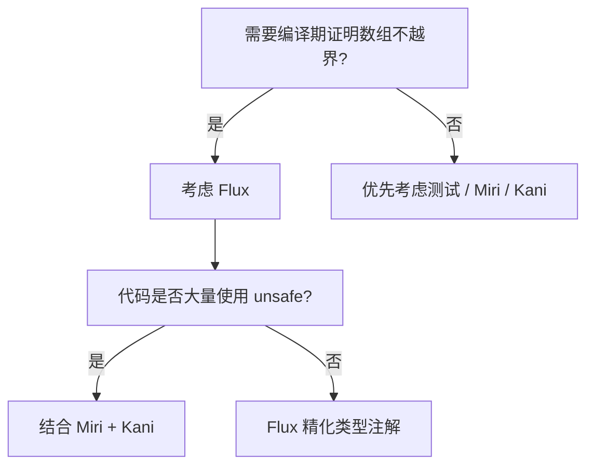

# 精化类型与 Flux

**EN**: Refinement Types and Flux
**Summary**: Explain refinement types as types constrained by logical predicates, and introduce Flux, a Rust refinement type verifier built on rustc's middle IR, for proving array bounds, overflow freedom, and contract compliance at compile time.

```mermaid
mindmap
  root((Refinement Types & Flux))
    Refinement types
      {v: T | P(v)}
      requires / ensures
      abstract refinements
    Flux toolchain
      rustc middle IR
      Liquid Fixpoint
      #[flux::sig]
    Proofs
      array bounds
      overflow freedom
      contract compliance
    Comparison
      Kani
      Verus
      Aeneas
```

> **Rust 版本**: 1.97.1+ (Edition 2024)；Flux 工具链需 nightly
> **Bloom 层级**: L4
> **权威来源**: 本文件为 `concept/` 权威页。
> **对齐来源**: [Flux OOPSLA 2023](https://flux-rs.github.io/flux/) · [Liquid Haskell (Vazou et al.)](https://ucsd-progsys.github.io/liquidhaskell-blog/) · [Refinement Types for ML (Freeman & Pfenning)](https://www.cs.cmu.edu/~fp/papers/pldi91.pdf) · [Rust Reference — Types](https://doc.rust-lang.org/reference/types.html) · [Flux GitHub](https://github.com/flux-rs/flux) · [Liquid Fixpoint](https://github.com/ucsd-progsys/liquid-fixpoint)
> **前置概念**: [`01_type_system.md`](../../01_foundation/02_type_system/01_type_system.md)、[`01_generics.md`](../../02_intermediate/01_generics/01_generics.md)、[`01_traits.md`](../../02_intermediate/00_traits/01_traits.md)、[`06_memory_model.md`](../../03_advanced/02_unsafe/06_memory_model.md)、[`02_interior_mutability.md`](../../02_intermediate/02_memory_management/02_interior_mutability.md)
> **后置概念**: [`16_rustbelt_ownership_logic.md`](16_rustbelt_ownership_logic.md)、[`17_aeneas_verification_pipeline.md`](17_aeneas_verification_pipeline.md)、[`08_separation_logic_for_rust.md`](08_separation_logic_for_rust.md)

---

## 1. 什么是精化类型

普通类型回答「值是什么形状」；精化类型进一步回答「值满足什么逻辑约束」。形式化地，精化类型写作 `{v: T | P(v)}`，表示类型为 `T` 且谓词 `P` 为真的所有值。

```rust
// 普通类型
fn head(arr: &[i32]) -> i32 { arr[0] } // 运行时可能 panic

// 精化类型（概念示意）
// head: {v: &[i32] | len(v) > 0} -> i32
```

精化类型的核心优势：在**编译期**证明数组访问不越界、整数不溢出、函数前置/后置条件成立。

---

## 2. Flux 简介

Flux 是 Rust 的精化类型验证器，由 UCSD ProgSys 小组开发，论文发表于 OOPSLA 2023。它：

- 基于 rustc 的 middle IR（THIR/MIR）工作，不修改 Rust 语法。
- 使用 **Liquid Fixpoint** 作为后端 SMT 求解器。
- 通过 `#[flux::sig(...)]` 等属性标注精化类型。
- 要求 **nightly toolchain**（截至 Rust 1.97.1）。

### 2.1 安装 Flux

```bash
rustup toolchain install nightly
rustup component add rustc-dev llvm-tools-preview --toolchain nightly
cargo install --git https://github.com/flux-rs/flux flux-bin
```

> 工具链状态为 nightly-only，属工具链事实陈述。

---

## 3. Flux 示例

### 3.1 数组访问安全

```rust
#![feature(register_tool)]
#![register_tool(flux)]

#[flux::sig(fn(&[i32] @ n) -> i32 requires n > 0)]
fn first(arr: &[i32]) -> i32 {
    arr[0]
}

fn main() {
    let v = vec![1, 2, 3];
    let x = first(&v); // ✅ 通过：长度 > 0

    let empty: Vec<i32> = vec![];
    // let y = first(&empty); // ❌ Flux 拒绝：长度不满足 requires
}
```

### 3.2 整数范围约束

```rust
#[flux::sig(fn(x: i32{x >= 0}) -> i32{x >= 0})]
fn abs(n: i32) -> i32 {
    if n >= 0 { n } else { -n }
}
```

### 3.3 向量追加后长度

```rust
#[flux::sig(fn(vec: Vec<i32> @ n) -> Vec<i32> @ n + 1)]
fn push_one(mut v: Vec<i32>) -> Vec<i32> {
    v.push(0);
    v
}
```

---

## 4. Flux 的精化类型系统

Flux 的精化由 **索引**（indices）和 **约束**（constraints）组成：

- `Vec<i32> @ n`：`Vec<i32>` 的长度索引为 `n`。
- `i32{x >= 0}`：`i32` 的值 `x` 非负。
- `requires P`：函数前置条件。
- `ensures P`：函数后置条件。

这些谓词属于 **逻辑约束语言**，通常支持：

- 线性算术（`+`, `-`, `>`, `>=`, `==`）
- 量词（隐式全称量词）
- 用户自定义抽象精化（abstract refinements）

---

## 5. 反例：未标注精化的越界访问

```rust,should_panic
fn buggy(arr: &[i32]) -> i32 {
    arr[arr.len()] // 越界：运行时 panic
}

fn main() {
    buggy(&[1, 2, 3]);
}
```

在 Flux 中，如果函数签名未证明 `arr.len() > 0` 且下标在范围内，验证会失败。精化类型将这类错误从运行时提前到编译期。

---

## 6. 能力边界

| 可证明 | 通常不可证明 |
|---|---|
| 数组越界 | 复杂循环不变式（需用户注解） |
| 整数溢出 | 外部 FFI 行为 |
| 函数前后条件 | 高阶函数 / 动态分发 |
| 简单递归终止 | 非线性算术 |

Flux 最适合 **数值密集型、数组操作密集** 的 Rust 代码，如系统编程、嵌入式驱动、密码学原语。

---

## 7. 与其他形式化工具对比

| 工具 | 方法 | 自动化程度 | 适用场景 |
|---|---|---|---|
| Flux | 精化类型 + SMT | 高（针对数组/数值） | 数组边界、溢出自由 |
| Kani | 有界模型检测 | 中 | 并发、unsafe、状态机 |
| Verus | 演绎验证 + SMT | 中（需循环不变式） | 算法正确性、系统代码 |
| Aeneas | 函数式翻译 + 证明助手 | 低（可交互证明） | 复杂数据结构、语义提取 |

---

## 8. 决策树：何时引入 Flux



---

## 9. 延伸阅读

- Flux 官方文档：<https://flux-rs.github.io/flux/>
- 论文：*Flux: Refinement Types for Rust* (OOPSLA 2023)
- 对比工具：[Kani](https://model-checking.github.io/kani/)、[Verus](https://verus-lang.github.io/verus/guide/)
