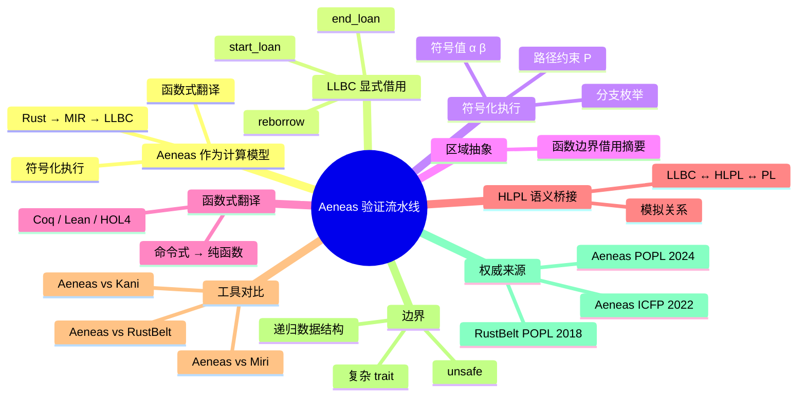

> **内容分级**: [专家级]

# Aeneas 验证流水线：作为计算模型的符号化借用演算（Aeneas Verification Pipeline: Symbolic Borrow Calculus as a Computational Model）

> **EN**: Aeneas Verification Pipeline: Symbolic Borrow Calculus as a Computational Model
> **Summary**: Treats Aeneas's symbolic semantics as a computational model for Rust verification, mapping LLBC's explicit borrow/loan calculus, symbolic execution, region abstractions, and functional translation to Rust's borrow checker and proof-assistant backends.

> **Rust 版本**: 1.97.0+ (Edition 2024)
> **Bloom 层级**: L4-L7
> **权威来源**: 本文件为 `concept/` 权威页。
> **定位**: 从**计算模型**视角把 Aeneas 当作 Rust 验证的**符号化借用演算**：说明 LLBC 如何把 Rust 的隐式借用显式化为 loan/borrow 指令，符号执行如何枚举所有路径并生成证明助手（Coq/Lean/HOL4）可验证的函数式规范，与 [RustBelt Ownership Logic](16_rustbelt_ownership_logic.md) 形成「分离逻辑证明 → 符号化翻译证明」的对比。
> **前置概念**:
> [Aeneas Symbolic Semantics](../03_operational_semantics/07_aeneas_symbolic_semantics.md) ·
> [RustBelt Ownership Logic](16_rustbelt_ownership_logic.md) ·
> [Separation Logic for Rust](08_separation_logic_for_rust.md) ·
> [Operational Semantics](../03_operational_semantics/03_operational_semantics.md)
> **后置概念**:
> [Formal Verification Tools](../../06_ecosystem/08_formal_verification/02_formal_verification_tools.md) ·
> [Refinement Types and Flux](15_refinement_types_and_flux.md) ·
> [Modern Verification Tools](../04_model_checking/04_modern_verification_tools.md) ·
> [Unsafe Rust](../../03_advanced/02_unsafe/01_unsafe.md) ·
> [Async/Await](../../03_advanced/01_async/01_async.md)

---

## 📑 目录

- [Aeneas 验证流水线：作为计算模型的符号化借用演算（Aeneas Verification Pipeline: Symbolic Borrow Calculus as a Computational Model）](#aeneas-验证流水线作为计算模型的符号化借用演算aeneas-verification-pipeline-symbolic-borrow-calculus-as-a-computational-model)
  - [📑 目录](#-目录)
  - [一、核心概念](#一核心概念)
    - [1.1 Aeneas 作为计算模型](#11-aeneas-作为计算模型)
    - [1.2 从 Rust 到 LLBC：显式借用演算](#12-从-rust-到-llbc显式借用演算)
    - [1.3 符号化执行语义](#13-符号化执行语义)
    - [1.4 区域抽象与函数边界](#14-区域抽象与函数边界)
    - [1.5 从命令式到函数式：Aeneas 翻译](#15-从命令式到函数式aeneas-翻译)
    - [1.6 HLPL 与底层指针语义桥接](#16-hlpl-与底层指针语义桥接)
    - [1.7 与 RustBelt、Miri、Kani 的关系](#17-与-rustbeltmirikani-的关系)
  - [二、形式化属性矩阵](#二形式化属性矩阵)
  - [三、正向示例](#三正向示例)
    - [示例 1：LLBC 中的可变借用](#示例-1llbc-中的可变借用)
    - [示例 2：符号值与路径约束](#示例-2符号值与路径约束)
    - [示例 3：Aeneas 风格函数式翻译](#示例-3aeneas-风格函数式翻译)
  - [四、反例与边界测试](#四反例与边界测试)
    - [反例 1：未初始化内存](#反例-1未初始化内存)
    - [反例 2：越界访问](#反例-2越界访问)
    - [反例 3：Aeneas 不支持的递归数据结构](#反例-3aeneas-不支持的递归数据结构)
  - [五、反命题决策树](#五反命题决策树)
    - [命题：「Aeneas 证明了 Rust 借用检查器正确」](#命题aeneas-证明了-rust-借用检查器正确)
    - [命题：「Aeneas 可以完全替代 RustBelt」](#命题aeneas-可以完全替代-rustbelt)
  - [六、嵌入式测验（Embedded Quiz）](#六嵌入式测验embedded-quiz)
    - [测验 1：LLBC 是什么的缩写？](#测验-1llbc-是什么的缩写)
    - [测验 2：Aeneas 的核心翻译是什么？](#测验-2aeneas-的核心翻译是什么)
    - [测验 3：Aeneas 与 RustBelt 的主要区别是什么？](#测验-3aeneas-与-rustbelt-的主要区别是什么)
  - [七、权威来源 / International Authority References](#七权威来源--international-authority-references)
  - [八、🧭 思维导图（Mindmap）](#八-思维导图mindmap)
  - [来源与延伸阅读](#来源与延伸阅读)
    - [P1（学术/形式化）](#p1学术形式化)
    - [P2（社区/生态）](#p2社区生态)

---

## 一、核心概念

### 1.1 Aeneas 作为计算模型

Aeneas 提供了一条**从 Rust 代码到证明助手规范**的自动化流水线。从计算模型视角看，它把 Rust 验证重新定义为：

```text
Aeneas 作为计算模型
├── 输入: Rust 源码（safe 子集）
├── 去糖: MIR（rustc 中间表示）
├── 核心演算: LLBC（Low-Level Borrow Calculus）
│   └── 借用、贷款、重借、生命周期结束显式化
├── 分析方法: 符号化执行（Symbolic Execution）
│   └── 符号值、路径约束、分支枚举
├── 桥接: HLPL（High-Level Pointer Language）
│   └── 把符号状态映射到底层指针语义
├── 输出: Coq / Lean / HOL4 的纯函数式规范
└── 目标: 验证函数正确性、内存安全、不变量
```

与 RustBelt 不同，Aeneas 的重点不是「证明整个语言安全」，而是**自动把单个 Rust 函数翻译成可证明的函数式等价物**，让用户在证明助手中验证具体函数规约。

> **来源**: [Ho & Protzenko, *Aeneas: Rust Verification by Functional Translation*, ICFP 2022](https://doi.org/10.1145/3547627) · [Ho et al., *Sound Borrow-Checking for Rust via Symbolic Semantics*, POPL 2024](https://doi.org/10.1145/3571192)

---

### 1.2 从 Rust 到 LLBC：显式借用演算

Rust 的借用是**隐式**的：编译器推导生命周期，自动插入 drop，borrow 结束时不显式标记。这对验证不友好，因为证明者需要手动重建借用状态。

LLBC 把借用显式化为一等指令：

```text
LLBC 核心指令（教学类比）
  x := &y           创建共享借用
  x := &mut y       创建可变借用
  start_loan(x, y)  开始贷款：y 进入 loan 状态，x 获得权限
  end_loan(x)       结束贷款：x 的权限归还 y
  reborrow(x, y)    重借：从已有借用创建新借用
```

例如：

```rust
let x = &mut v;
*x = 42;
// x 隐式结束
```

对应的 LLBC 风格：

```text
start_loan(x, v);  // v 进入 loan 状态
write x 42;        // 通过借用写入
end_loan(x);       // 显式结束借用，v 恢复
```

> **关键洞察**: LLBC 把「隐式的借用生命周期」变成**显式的 loan 状态机**。这是 Aeneas 能够自动分析 Rust 程序的关键第一步。

---

### 1.3 符号化执行语义

Aeneas 的符号化执行用**符号值**替代具体值，同时维护**路径约束**记录分支条件：

```text
符号状态 Σ ::= (M, P, B, L)
  M: 内存映射   Place → SymbolicValue
  P: 路径约束   PathCondition
  B: 借用集合   {(β, perm, ℓ)}
  L: 贷款集合   {(ℓ, β, x, v)}
```

当遇到分支时，符号执行会分裂成两条路径：

```text
if s then c₁ else c₂
  → 路径 1: P ∧ s,  c₁
  → 路径 2: P ∧ ¬s, c₂
```

```rust
fn abs(x: i32) -> i32 {
    if x >= 0 { x } else { -x }
}
```

符号执行会生成两条路径：

```text
路径 1: P = (α ≥ 0),  返回 α
路径 2: P = (α < 0),  返回 -α
```

其中 `α` 是 `x` 的符号值。

---

### 1.4 区域抽象与函数边界

函数调用是 Rust 验证的难点：调用者如何知道被调用者对借用做了什么？Aeneas 使用**区域抽象**（region abstraction）来概括函数边界上的借用效果。

```text
区域抽象
  函数签名: fn foo(x: &mut i32) -> &mut i32
  抽象: 输入区域 α 包含 x 的借用；输出区域 β 包含返回的借用
        调用后，原变量 x 的权限按 β 恢复或更新
```

区域抽象让调用者无需展开被调用函数的内部实现，只需依赖其规约。这与分离逻辑中的**框架规则**类似：函数只影响其接口声明的资源。

---

### 1.5 从命令式到函数式：Aeneas 翻译

Aeneas 的核心贡献是**把命令式 Rust 函数翻译成纯函数式规范**。例如：

```rust
fn sum(a: &[u32]) -> u32 {
    let mut s = 0;
    for i in 0..a.len() {
        s += a[i];
    }
    s
}
```

Aeneas 可能生成如下风格的函数式规范（教学类比）：

```text
sum(a) = foldl (+) 0 a
```

这个翻译保持函数语义，但消除了循环、可变引用和借用。证明者可以在 Coq/Lean 中证明：

```text
∀ a, sum(a) = Σ_{i=0}^{len(a)-1} a[i]
```

> **关键洞察**: Aeneas 把「命令式 Rust 函数」变成「纯函数式模型」，使得传统函数式证明技术可以直接应用。

---

### 1.6 HLPL 与底层指针语义桥接

HLPL（High-Level Pointer Language）是 Aeneas 中连接 LLBC 符号状态与底层指针语义的中间层。它的作用是：

1. 用**高层的所有权视角**描述指针（如「x 拥有位置 ℓ」）。
2. 证明 LLBC 的符号执行与 HLPL 语义之间满足**模拟关系**（simulation）。
3. 最终把 HLPL 映射到更底层的 PL（Pointer Language），连接真实内存模型。

```text
Aeneas 语义栈
  Rust 源码
    ↓ MIR
  LLBC 符号状态
    ↓ 模拟关系
  HLPL 高层指针语义
    ↓ 模拟关系
  PL  底层指针语义
```

这种分层设计让 Aeneas 既能处理 Rust 的高级借用抽象，又能最终连接到可执行的内存语义。

---

### 1.7 与 RustBelt、Miri、Kani 的关系

| 工具 | 方法 | 自动化程度 | 主要用途 |
|---|---|---|---|
| **RustBelt** | Iris 分离逻辑，机械证明 | 低 | 证明语言子集的安全性定理 |
| **Aeneas** | 符号化执行 + 函数式翻译 | 中 | 自动生成函数规约，在证明助手中验证 |
| **Miri** | 解释器级 UB 检测 | 高 | 运行时检测未定义行为 |
| **Kani** | 模型检测（CBMC） | 高 | 自动验证有限状态属性 |
| **Flux** | SMT 精化类型 | 高 | 自动验证数组边界、整数性质 |

Aeneas 与 RustBelt 是互补的：RustBelt 回答「Rust 语言为什么安全」，Aeneas 回答「这个具体 Rust 函数是否满足我的规约」。

---

## 二、形式化属性矩阵

| Aeneas 概念 | Rust 工程机制 | 形式化含义 | 权威来源 |
|:---|:---|:---|:---|
| LLBC | MIR 去糖 | 显式借用演算 | Aeneas ICFP 2022 |
| `start_loan` / `end_loan` | `&mut` 生命周期 | 显式权限转移 | Aeneas POPL 2024 |
| 符号值 α, β | 输入参数 | 抽象具体值 | Symbolic Execution |
| 路径约束 P | if/while 分支 | 分支条件合取 | Symbolic Execution |
| 区域抽象 | 函数签名生命周期 | 借用效果摘要 | Aeneas ICFP 2022 |
| 函数式翻译 | 命令式函数 → 纯函数 | 语义保持翻译 | Aeneas ICFP 2022 |
| HLPL | 所有权视角指针 | 高层指针语义 | Aeneas POPL 2024 |
| 模拟关系 | LLBC ↔ HLPL ↔ PL | 语义等价 | Aeneas POPL 2024 |
| 证明助手输出 | Coq/Lean/HOL4 | 可机械验证规范 | Aeneas ICFP 2022 |

---

## 三、正向示例

### 示例 1：LLBC 中的可变借用

```rust
fn main() {
    let mut v = 5;
    let r = &mut v;
    *r = 42;
    assert_eq!(v, 42);
}
```

LLBC 风格（教学类比）：

```text
v := 5;
start_loan(r, v);
write r 42;
end_loan(r);
assert_eq v 42;
```

### 示例 2：符号值与路径约束

```rust
fn max(a: i32, b: i32) -> i32 {
    if a > b { a } else { b }
}

fn main() {
    assert_eq!(max(3, 5), 5);
}
```

符号执行生成：

```text
路径 1: α > β,  返回 α
路径 2: α ≤ β, 返回 β
```

### 示例 3：Aeneas 风格函数式翻译

```rust
fn factorial(n: u32) -> u32 {
    let mut acc = 1;
    let mut i = 1;
    while i <= n {
        acc *= i;
        i += 1;
    }
    acc
}

fn main() {
    assert_eq!(factorial(5), 120);
}
```

函数式规范（教学类比）：

```text
factorial(n) = Π_{i=1}^{n} i
```

---

## 四、反例与边界测试

### 反例 1：未初始化内存

```rust,compile_fail,E0381
fn main() {
    let x: i32;
    let r = &x; // ❌ x 未初始化
    println!("{}", r);
}
```

> **错误诊断**: `error[E0381]: borrow of possibly-uninitialized variable:`x``.Aeneas/LLBC 要求在创建引用时位置必须已初始化。
> **修正**: 在使用前初始化变量。

### 反例 2：越界访问

```rust
fn main() {
    let a = [1, 2, 3];
    let i = 5;
    // println!("{}", a[i]); // ❌ 运行时 panic
    assert!(i < a.len());   // 必须显式检查
}
```

> **错误诊断**: `a[5]` 在运行时会 panic。Aeneas 会生成路径约束 `0 ≤ i < len(a)`，如果无法证明，则报告验证失败。
> **修正**: 添加边界检查或使用迭代器。

### 反例 3：Aeneas 不支持的递归数据结构

```rust
struct List {
    head: i32,
    tail: Option<Box<List>>,
}

impl List {
    fn len(&self) -> usize {
        match &self.tail {
            None => 1,
            Some(t) => 1 + t.len(),
        }
    }
}
```

> **错误诊断**: Aeneas 对递归数据结构和复杂所有权的支持仍在发展中。某些递归定义、自引用结构或复杂 trait 边界可能无法翻译。
> **修正**: 简化数据结构，或改用其他工具（如 RustBelt、Kani、Verus）验证递归属性。

---

## 五、反命题决策树

### 命题：「Aeneas 证明了 Rust 借用检查器正确」

```text
该命题成立吗？
├── 是 → 不完全。POPL 2024 论文证明了：
│   ├── LLBC 符号执行语义与 Rust 借用规则一致
│   └── 符号化执行能正确推理借用检查的声音性
└── 否 → 更准确。Aeneas 不证明真实 rustc：
    ├── 它分析的是 MIR/LLBC 模型
    ├── 只覆盖 safe Rust 子集
    └── 借用检查器本身的实现正确性不在其范围内
```

### 命题：「Aeneas 可以完全替代 RustBelt」

```text
该命题成立吗？
├── 是 → 错误。两者目标不同：
│   ├── Aeneas：函数级自动翻译 + 证明助手验证
│   └── RustBelt：语言级安全性定理的机械证明
└── 否 → 正确。它们是互补工具：
    ├── RustBelt 回答「语言为什么安全」
    ├── Aeneas 回答「这个函数是否满足规约」
    └── 不同场景选择不同工具
```

---

## 六、嵌入式测验（Embedded Quiz）

### 测验 1：LLBC 是什么的缩写？

A. Low-Level Borrow Calculus
B. Linear Logic Based Compiler
C. Liquid Language Backend Core
D. Lean Library for Borrow Checking

<details>
<summary>✅ 答案</summary>

**A. Low-Level Borrow Calculus**。LLBC 是 Aeneas 引入的显式借用演算，把 Rust 的隐式借用变成显式 loan/borrow 指令。

</details>

### 测验 2：Aeneas 的核心翻译是什么？

A. Rust → C
B. Rust → MIR → LLBC → 函数式规范
C. Rust → 汇编
D. Rust → SQL

<details>
<summary>✅ 答案</summary>

**B. Rust → MIR → LLBC → 函数式规范**。Aeneas 把 Rust 函数翻译成纯函数式模型，以便在 Coq/Lean/HOL4 中验证。

</details>

### 测验 3：Aeneas 与 RustBelt 的主要区别是什么？

A. Aeneas 用 SMT，RustBelt 用 Iris
B. Aeneas 是函数级自动翻译，RustBelt 是语言级机械证明
C. Aeneas 只能验证 unsafe，RustBelt 只能验证 safe
D. 没有区别

<details>
<summary>✅ 答案</summary>

**B. Aeneas 是函数级自动翻译，RustBelt 是语言级机械证明**。Aeneas 帮助验证具体函数的规约，RustBelt 证明 Rust 安全子集的整体安全性定理。

</details>

---

## 七、权威来源 / International Authority References

| 来源 | 可信度 | 说明 |
|:---|:---:|:---|
| [Ho & Protzenko, *Aeneas: Rust Verification by Functional Translation*, ICFP 2022](https://doi.org/10.1145/3547627) | ✅ 一级 | Aeneas 奠基论文 |
| [Ho et al., *Sound Borrow-Checking for Rust via Symbolic Semantics*, POPL 2024](https://doi.org/10.1145/3571192) | ✅ 一级 | LLBC 符号化执行与声音性 |
| [Aeneas GitHub](https://github.com/AeneasVerif/aeneas) | ✅ P0 | Aeneas 官方仓库 |
| [Aeneas Documentation](https://aeneasverif.github.io/aeneas/) | ✅ P0 | Aeneas 官方文档 |
| [Jung et al., RustBelt POPL 2018](https://doi.org/10.1145/3158154) | ✅ 一级 | Rust 安全性的 Iris 机械证明 |
| [Rust Reference — MIR](https://doc.rust-lang.org/rustc/mir/index.html) | ✅ P0 | Rust 中间表示 MIR |
| [Kani Rust Verifier](https://model-checking.github.io/kani/) | ✅ P2 | 与 Aeneas 互补的模型检测工具 |
| [Miri](https://github.com/rust-lang/miri) | ✅ P2 | Rust 解释器级 UB 检测 |

---

## 八、🧭 思维导图（Mindmap）



## 来源与延伸阅读

### P1（学术/形式化）

- [Ho & Protzenko, *Aeneas: Rust Verification by Functional Translation*, ICFP 2022](https://dl.acm.org/doi/10.1145/3547627) — Aeneas 奠基论文
- [Ho et al., *Sound Borrow-Checking for Rust via Symbolic Semantics*, POPL 2024](https://dl.acm.org/doi/10.1145/3571192) — LLBC 符号化执行与声音性
- [Aeneas Project](https://aeneasverif.github.io/aeneas/) — Aeneas 官方文档
- [Jung et al., *RustBelt*](https://dl.acm.org/doi/10.1145/3158154) — 互补的 Iris 分离逻辑证明（ACM）

### P2（社区/生态）

- [Aeneas GitHub](https://github.com/AeneasVerif/aeneas) — Aeneas 官方仓库
- [Verus](https://github.com/verus-lang/verus) — Rust 自动化验证工具
- [Creusot](https://github.com/creusot-rs/creusot) — Rust 演绎验证器
- [Rocq of Rust / formal.land](https://github.com/formal-land/coq-of-rust) — Rust → Rocq 形式化翻译
