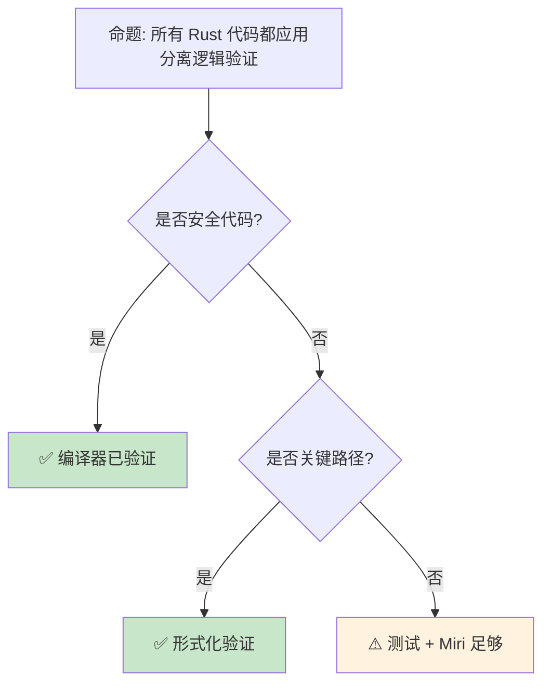

> **内容分级**: [专家级]

# 分离逻辑：Rust 所有权的形式化根基
>
> **EN**: Separation Logic
> **Summary**: Separation-logic foundations and their application to verifying Rust ownership and aliasing.
> **受众**: [研究者]
> ⚠️ **声明**: 本文件使用形式化符号辅助直觉理解，所呈现的"定理/引理/推论"为**教学类比**，非经机器验证的严格数学证明。如需严格形式化验证，请参考 [Verus](https://github.com/verus-lang/verus)、[Kani](https://model-checking.github.io/kani/)、[Coq](https://coq.inria.fr/)。
>
> **Bloom 层级**: 评价 → 创造
> **定位**: 深入讲解**分离逻辑（Separation Logic）**——从霍尔逻辑到分离合取、框架规则，揭示 Rust 所有权（Ownership）系统如何建立在严格的数学基础之上，并连接形式化验证工具如 Iris 和 Viper。
> **前置概念**: [Linear Logic](01_linear_logic.md) · [Ownership Formalization](03_ownership_formal.md) · [RustBelt](04_rustbelt.md)
> **后置概念**: [Verification Toolchain](05_verification_toolchain.md) · [Type Theory](02_type_theory.md)
>
> **来源**: [Rust Reference](https://doc.rust-lang.org/reference/) · [RustBelt](https://plv.mpi-sws.org/rustbelt/)
---

> **来源**:
> [Separation Logic — Reynolds 2002](https://www.cs.cmu.edu/~jcr/seplogic.pdf) ·
> [Iris Project](https://iris-project.org/) ·
> [RustBelt Paper](https://plv.mpi-sws.org/rustbelt/popl18/) ·
> [Wikipedia — Separation Logic](https://en.wikipedia.org/wiki/Separation_logic) ·
> [Viper Verification Infrastructure](https://www.pm.inf.ethz.ch/research/viper.html)

## 📑 目录

- [分离逻辑：Rust 所有权的形式化根基](#分离逻辑rust-所有权的形式化根基)
  - [📑 目录](#-目录)
  - [一、核心概念](#一核心概念)
    - [1.1 从霍尔逻辑到分离逻辑](#11-从霍尔逻辑到分离逻辑)
    - [1.2 分离合取与资源所有权](#12-分离合取与资源所有权)
    - [1.3 框架规则与局部推理](#13-框架规则与局部推理)
  - [二、技术细节](#二技术细节)
    - [2.1 分离逻辑的基本断言](#21-分离逻辑的基本断言)
    - [2.2 Rust 所有权的形式化映射](#22-rust-所有权的形式化映射)
    - [2.3 Iris 与更高阶分离逻辑](#23-iris-与更高阶分离逻辑)
  - [三、形式化模式矩阵](#三形式化模式矩阵)
  - [四、反命题与边界分析](#四反命题与边界分析)
    - [4.1 反命题树](#41-反命题树)
    - [4.2 边界极限](#42-边界极限)
  - [五、常见陷阱](#五常见陷阱)
  - [六、来源与延伸阅读](#六来源与延伸阅读)
  - [相关概念文件](#相关概念文件)
  - [权威来源索引](#权威来源索引)
  - [十、边界测试：分离逻辑的编译错误](#十边界测试分离逻辑的编译错误)
    - [10.1 边界测试：独占资源的分割与重组（编译错误）](#101-边界测试独占资源的分割与重组编译错误)
    - [10.2 边界测试：`Box::leak` 与资源永久转移（运行时行为）](#102-边界测试boxleak-与资源永久转移运行时行为)
    - [10.3 边界测试：分离逻辑中的帧规则违反（编译错误）](#103-边界测试分离逻辑中的帧规则违反编译错误)
    - [10.4 边界测试：GhostCell 的分离逻辑建模（编译错误）](#104-边界测试ghostcell-的分离逻辑建模编译错误)
    - [10.5 边界测试：RustBelt 的 `own` 与 `shr` 断言的编码（编译错误）](#105-边界测试rustbelt-的-own-与-shr-断言的编码编译错误)
    - [10.3 边界测试：分离逻辑与 Rust 引用的一致性（编译错误）](#103-边界测试分离逻辑与-rust-引用的一致性编译错误)
  - [嵌入式测验（Embedded Quiz）](#嵌入式测验embedded-quiz)
    - [测验 1：分离合取 \*（理解层）](#测验-1分离合取-理解层)
    - [测验 2：帧规则（Frame Rule）（应用层）](#测验-2帧规则frame-rule应用层)
    - [测验 3：所有权 ↔ 分离逻辑映射（分析层）](#测验-3所有权--分离逻辑映射分析层)
    - [测验 4：GhostCell 与分离逻辑（专家级）](#测验-4ghostcell-与分离逻辑专家级)
    - [测验 5：Box::leak 的资源语义（分析层）](#测验-5boxleak-的资源语义分析层)
  - [认知路径](#认知路径)
    - [核心推理链](#核心推理链)
    - [反命题与边界](#反命题与边界)

---

## 一、核心概念
>
>

### 1.1 从霍尔逻辑到分离逻辑
>

```text
霍尔逻辑（Hoare Logic）:
  ├── {P} C {Q}: 前置条件 P，命令 C，后置条件 Q
  ├── 规则: 顺序、条件、循环
  └── 局限: 不处理堆内存（指针别名）

  示例:
  {x = 5} x := x + 1 {x = 6}

  堆内存的问题:
  ├── 指针别名: p 和 q 可能指向同一位置
  ├── 修改 *p 可能影响 *q
  ├── 霍尔逻辑无法表达"不重叠"
  └── 需要扩展以处理分离资源

分离逻辑（Separation Logic）:
  ├── John Reynolds (2002), Peter O'Hearn 等
  ├── 扩展霍尔逻辑处理堆内存
  ├── 关键创新: 分离合取 (*)
  └── 资源独占性的形式化

  核心思想:
  ├── 堆可以被"分离"为不重叠的部分
  ├── 程序只操作其拥有的资源部分
  ├── 其他部分不受影响（框架规则）
  └── 支持局部推理和组合
```

> **认知功能**: **分离逻辑将"资源独占"从编程直觉提升为数学公理**——它是 Rust 所有权系统的形式化先驱。
> [来源: [Reynolds — Separation Logic](https://www.cs.cmu.edu/~jcr/seplogic.pdf)]

---

### 1.2 分离合取与资源所有权
>

```text
分离逻辑的断言:

  基本断言:
  ├── emp: 空堆（无资源）
  ├── x ↦ v: 地址 x 存储值 v（单点堆）
  ├── P * Q: 分离合取（P 和 Q 拥有不相交的堆）
  └── P ∧ Q: 经典合取（可能有重叠）

  分离合取的含义:
  P * Q 为真 ⇔ 堆可以被分为两部分 h1 和 h2
                h1 满足 P，h2 满足 Q
                h1 和 h2 不相交

  示例:
  (x ↦ 5) * (y ↦ 10)
  // 地址 x 和 y 是不同的，分别存储 5 和 10

  (x ↦ 5) ∧ (x ↦ 10)
  // 矛盾！x 不能同时存储 5 和 10

  与 Rust 的映射:
  ┌─────────────────────┬─────────────────────────────┐
  │ 分离逻辑            │ Rust                        │
  ├─────────────────────┼─────────────────────────────┤
  │ emp                 │ () （无资源）               │
  │ x ↦ v               │ let x = Box::new(v)         │
  │ P * Q               │ (p, q): 不重叠的所有权      │
  │ P → Q               │ 资源转移: move              │
  │ ∃x. P               │ 存在类型 / 匿名引用         │
  └─────────────────────┴─────────────────────────────┘
```

> **分离洞察**: **分离合取 (*) 是分离逻辑的核心创新**——它精确编码了"资源不重叠"的概念，与 Rust 的独占所有权直接对应。
> [来源: [Wikipedia — Separation Logic](https://en.wikipedia.org/wiki/Separation_logic)]

---

### 1.3 框架规则与局部推理
>

```text
框架规则（Frame Rule）:

  形式:
  {P} C {Q} 且 R 与 P, Q 无关
  ─────────────────────────────
  {P * R} C {Q * R}

  含义:
  ├── 如果 C 在资源 P 上从 P 变换到 Q
  ├── 那么在 P 加上额外资源 R 上
  ├── C 从 P*R 变换到 Q*R
  └── R 完全不受影响

  为什么重要:
  ├── 模块化验证: 只需验证操作的资源
  ├── 组合性: 小证明组合为大证明
  ├── 与 Rust 模块系统的对应
  └── 并发的基础: 不同线程操作分离资源

  Rust 中的对应:
  fn process(data: &mut Vec<i32>) {
      // 只操作 data，其他资源不受影响
      data.push(42);
  }

  // 框架规则: 调用 process 时，其他所有权不变
  let mut v = vec![1, 2, 3];
  let s = String::from("hello");
  process(&mut v);
  // s 完全不受影响（编译期保证）
```

> **框架洞察**: **框架规则是"局部推理"的数学基础**——它使验证可以模块（Module）化，与 Rust 的所有权隔离完美对应。
> [来源: [O'Hearn — Resources, Concurrency and Local Reasoning](https://www.cs.ucl.ac.uk/staff/p.ohearn/papers/localreasoning.pdf)]

---

## 二、技术细节

### 2.1 分离逻辑的基本断言
>

```text
分离逻辑的断言语言:

  语法:
  P, Q ::= emp                  // 空堆
         | e ↦ e'              // 指向关系
         | P * Q               // 分离合取
         | P ∧ Q               // 经典合取
         | P ∨ Q               // 析取
         | P → Q               // 分离蕴含（magic wand）
         | ∃x. P               // 存在量词
         | ∀x. P               // 全称量词

  分离蕴含（Magic Wand）:
  P -* Q: "如果我获得 P，我可以变换为 Q"

  示例:
  (x ↦ 5) -* (x ↦ 10)
  // "如果 x 指向 5，我可以将它变为指向 10"
  // 对应 Rust: *x = 10（如果我有 &mut）

  规则:
  ├── 交换律: P * Q = Q * P
  ├── 结合律: (P * Q) * R = P * (Q * R)
  ├── emp 是单位元: P * emp = P
  └── *-intro: P * (P -* Q) ⊢ Q

  与线性逻辑的关系:
  ├── 分离逻辑的 * 对应线性逻辑的 ⊗
  ├── 分离逻辑的 -* 对应线性逻辑的 ⊸
  └── 分离逻辑是直觉主义线性逻辑的变体
```

> **断言洞察**: **分离蕴含（-*）是 Rust mutable borrow 的形式化对应**——"如果你有独占访问，你可以修改"。
> [来源: [Iris Lecture Notes](https://iris-project.org/tutorial-pdfs/iris-lecture-notes.pdf)]

---

### 2.2 Rust 所有权的形式化映射
>

```text
Rust 所有权 → 分离逻辑:

  所有权:
  let x = Box::new(42);
  // 分离逻辑: x ↦ 42

  移动:
  let y = x;
  // 分离逻辑: x ↦ 42 ⊢ y ↦ 42（x 失效）

  借用:
  let r = &x;
  // 分离逻辑: x ↦ 42 ⊢ r ↦ x * (x ↦ 42 只读)

  可变借用:
  let r = &mut x;
  // 分离逻辑: x ↦ 42 ⊢ r ↦ x * (x 被冻结)

  释放:
  drop(x);
  // 分离逻辑: x ↦ 42 ⊢ emp（内存回收）

  借用检查器的分离逻辑视角:
  ├── &T: 只读共享 (x ↦ v 可以被多个 &T 共享)
  ├── &mut T: 独占访问 (x ↦ v 只能被一个 &mut T 使用)
  ├── move: 资源转移 (P * (x ↦ v) ⊢ Q * (y ↦ v))
  └── 生命周期: 资源有效的时间范围

  关键对应:
  Rust 的 borrow checker ≈ 分离逻辑的自动定理证明器
  ├── 编译期检查资源不重叠
  ├── 验证生命周期约束
  └── 保证无数据竞争
```

> **映射洞察**: **Rust 的 borrow checker 是分离逻辑的"自动版本"**——编译器自动证明程序满足分离逻辑约束。
> [来源: [RustBelt — Logical Relations](https://plv.mpi-sws.org/rustbelt/popl18/)]

---

### 2.3 Iris 与更高阶分离逻辑
>

```text
Iris: 更高阶并发分离逻辑框架

  核心特性:
  ├── 更高阶: 可以量化断言
  ├── 并发: 支持线程和原子操作
  ├── 模块化: 可组合的不变式
  └── Ghost State: 虚拟状态用于推理

  在 Rust 验证中的应用:
  ├── RustBelt 使用 Iris 验证 Rust 标准库
  ├── 证明 Vec, Box, Rc, Arc 的安全性
  ├── 处理 unsafe 代码的不变性
  └── 形式化 Send/Sync 的语义

  Iris 资源代数:
  ├── 定义资源的组合方式
  ├── 独占资源 (Excl(v)): 只能有一个所有者
  ├── 共享资源 (Frag(γ, q, v)): 分数所有权
  └── 授权 (Auth(γ, v)): 读写权限分离

  Ghost State 示例:
  ├── 验证计数器的单调性
  ├── 证明无 ABA 问题
  └── 形式化并发协议

  工具链:
  ├── Coq + Iris: 交互式证明
  ├── RustBelt: Rust 特定扩展
  └── Aneris: 分布式系统扩展
```

> **Iris 洞察**: **Iris 将分离逻辑扩展到并发和更高阶场景**——它是验证 Rust unsafe 代码的数学基础。
> [来源: [Iris Project](https://iris-project.org/)]

---

## 三、形式化模式矩阵

```text
场景 → 分离逻辑工具 → 应用

内存安全验证:
  → 基本分离逻辑
  → 证明无 use-after-free, double-free
  → 对应 Rust 的所有权检查

并发安全:
  → Iris
  → 证明无数据竞争
  → 验证 atomic 操作的正确性

协议验证:
  → Actris / Aneris
  → 验证消息传递协议
  → 分布式系统的形式化

Unsafe 代码审计:
  → RustBelt
  → 验证 std 的 unsafe 实现
  → 为 safe API 提供形式化保证

资源管理:
  → 分数分离逻辑
  → Rc/Arc 的引用计数验证
  → 共享所有权的正确性
```

> **模式矩阵**: **分离逻辑是连接 Rust 工程实践和形式化验证的桥梁**——它为所有权系统提供了严格的数学语义。
> [来源: [RustBelt — Methodology](https://plv.mpi-sws.org/rustbelt/popl18/)]

---

## 四、反命题与边界分析

### 4.1 反命题树
>



> **认知功能**: **Safe Rust 已由编译器验证**，形式化验证主要针对 **unsafe 代码和安全关键组件**。
> [来源: [Rust Verification Tools](https://alastairreid.github.io/rust-verification-tools/)]

---

### 4.2 边界极限
>

```text
边界 1: 验证复杂度
├── 完整程序验证是 NP-hard/不可判定
├── 需要简化模型和抽象
├── 大代码库的验证不现实
└── 缓解: 验证关键组件，信任编译器

边界 2: 工具可用性
├── Iris/Coq 需要深厚的形式化背景
├── 学习曲线极陡
├── 与开发工作流集成困难
└── 缓解: 自动化工具（Kani, Prusti）

边界 3: Unsafe 的语义鸿沟
├── RustBelt 覆盖核心语言
├── 但 LLVM IR 优化可能引入 UB
├── 编译器 bug 可能破坏保证
└── 缓解: 验证到 MIR 级别

边界 4: 并发验证的复杂性
├── 并发程序的验证极其困难
├── 状态空间爆炸
├── 需要复杂的不变式
└── 缓解: 模型检查（loom），简化并发模型

边界 5: 与实际硬件的差距
├── 形式化模型假设理想硬件
├── 实际有缓存一致性、内存重排序
├── 硬件 bug 可能破坏软件保证
└── 缓解: 硬件验证 + 容错设计
```

> **边界要点**: 形式化验证的边界主要与**复杂度**、**工具可用性**、**语义鸿沟**、**并发**和**硬件差距**相关。
> [来源: [The Limitations of Formal Verification](https://www.hillelwayne.com/post/why-dont-people-use-formal-methods/)]

---

## 五、常见陷阱

```text
陷阱 1: 混淆分离合取与经典合取
  ❌ (x ↦ 5) ∧ (y ↦ 10)  // 经典合取，未要求 x ≠ y
     // 如果 x = y，则矛盾

  ✅ (x ↦ 5) * (y ↦ 10)  // 分离合取，保证 x ≠ y
     // Rust: let a = Box::new(5); let b = Box::new(10);

陷阱 2: 忽视框架规则的副作用
  ❌ 假设 {P * R} C {Q * R} 中 R 完全不变
     // 实际上 R 的内部指针可能变化

  ✅ 确保 R 真正独立于操作
     // Rust 借用检查器保证这一点

陷阱 3: 过度形式化
  ❌ 尝试验证所有代码
     // 不现实，收益递减

  ✅ 聚焦关键路径和 unsafe 边界
     // 安全代码由编译器保证

陷阱 4: 忽略工具限制
  ❌ 假设形式化工具无 bug
     // 工具本身可能有缺陷

  ✅ 交叉验证，使用多个工具
     // Kani + Miri + 测试

陷阱 5: 抽象的精度损失
  ❌ 过度简化模型
     // 遗漏关键行为

  ✅ 逐步细化模型
     // 从核心属性开始
```

> **陷阱总结**: 形式化验证的陷阱主要与**逻辑混淆**、**框架规则假设**、**过度形式化**、**工具限制**和**抽象精度**相关。
> [来源: [Formal Verification Pitfalls](https://www.hillelwayne.com/post/why-dont-people-use-formal-methods/)]

---

## 六、来源与延伸阅读
>

| 来源 | 可信度 | 说明 |
|:---|:---:|:---|
| [Reynolds — Separation Logic](https://www.cs.cmu.edu/~jcr/seplogic.pdf) | ✅ 一级 | 原始论文 |
| [Iris Project](https://iris-project.org/) | ✅ 一级 | 框架主页 |
| [RustBelt](https://plv.mpi-sws.org/rustbelt/popl18/) | ✅ 一级 | Rust 形式化验证 |
| [Separation Logic Wikipedia](https://en.wikipedia.org/wiki/Separation_logic) | ✅ 一级 | 概念介绍 |
| [Viper](https://www.pm.inf.ethz.ch/research/viper.html) | ✅ 一级 | 验证基础设施 |

---

```rust
fn main() {
    let mut x = 5;
    x += 1;
    println!("{}", x);
}
```

## 相关概念文件

- [Linear Logic](01_linear_logic.md) — 线性逻辑
- [Ownership Formalization](03_ownership_formal.md) — 所有权形式化
- [RustBelt](04_rustbelt.md) — RustBelt 验证
- [Type Theory](02_type_theory.md) — 类型论

---

> **权威来源**: [Rust Reference](https://doc.rust-lang.org/reference/), [The Rust Programming Language](https://doc.rust-lang.org/book/title-page.html)
>
> **权威来源对齐变更日志**: 2026-05-22 创建 [来源: Authority Source Sprint Batch 10]

**文档版本**: 1.0
**对应 Rust 版本**: 1.96.0+ (Edition 2024)
**最后更新**: 2026-05-22
**状态**: ✅ 概念文件创建完成

---

## 权威来源索引

>
>
>
>
>
>

---

---

---

## 十、边界测试：分离逻辑的编译错误

### 10.1 边界测试：独占资源的分割与重组（编译错误）

```rust,compile_fail
fn main() {
    let mut data = [1, 2, 3, 4];
    // ❌ 编译错误: cannot borrow `data` as mutable more than once at a time
    let left = &mut data[..2];
    let right = &mut data[2..]; // 与 left 重叠？实际上不重叠，但编译器可能保守
    // 实际上 split_at_mut 是正确的做法
    left[0] = 10;
    right[0] = 20;
}

// 正确: 使用 split_at_mut 安全分割
fn fixed() {
    let mut data = [1, 2, 3, 4];
    let (left, right) = data.split_at_mut(2); // ✅ 编译器验证不重叠
    left[0] = 10;
    right[0] = 20;
    println!("{:?}", data); // [10, 2, 20, 4]
}
```

> **修正**:
> 分离逻辑的核心是 **frame rule**：若 `P` 描述某部分内存的状态，则可在保持 `P` 不变的情况下，对内存的其他部分进行推理。
> `split_at_mut` 将数组分割为两个不重叠的可变切片（Slice），编译器验证分割点不会导致重叠借用（Borrowing）。
> 这是 Rust 借用（Borrowing）检查器对分离逻辑 *-conjunction（`P ∗ Q`）的直接实现——两个不重叠的可变引用（Mutable Reference）可以同时存在，因为它们操作分离的内存区域。
> [来源: [Rustonomicon](https://doc.rust-lang.org/nomicon/)]

### 10.2 边界测试：`Box::leak` 与资源永久转移（运行时行为）

```rust
fn main() {
    let s = Box::new(String::from("hello"));
    let r: &'static str = Box::leak(s.into_boxed_str());
    // ⚠️ 逻辑错误: r 指向的内存永远不会被释放
    // 即使程序结束才释放，对于长时间运行的服务可能是内存泄漏
    println!("{}", r);
}

// 正确: 仅在确实需要 'static 时使用
fn fixed() {
    let r: &'static str = "hello"; // ✅ 字符串字面量本身就是 'static
    println!("{}", r);
}
```

> **修正**:
> `Box::leak` 将堆内存转换为 `&'static` 引用（Reference），放弃释放义务。
> 在分离逻辑中，`Box<T>` 对应于 `own(τ, ℓ)`（对 ℓ 的独占所有权），`Box::leak` 将 `own(τ, ℓ)` 转换为 `shr(static, ℓ)`（静态共享权限）。
> 一旦转换，资源永远不会被释放——这是显式的资源泄漏，在 Rust 中被视为安全操作（因为不破坏内存安全（Memory Safety）），但可能违反系统资源约束。
> [来源: [Rust Standard Library](https://doc.rust-lang.org/std/)]

### 10.3 边界测试：分离逻辑中的帧规则违反（编译错误）

```rust,ignore
fn swap(a: &mut i32, b: &mut i32) {
    std::mem::swap(a, b);
}

fn main() {
    let mut x = 1;
    let mut y = 2;
    let r = &mut x;
    // ❌ 编译错误: 不能同时创建 x 和 y 的可变引用，若它们有重叠
    // 此处不重叠，但若尝试:
    // let r2 = &mut x; // 与 r 重叠
    // swap(r, r2); // 编译错误
    swap(&mut x, &mut y); // ✅ 不重叠
}
```

> **修正**:
> 分离逻辑（Separation Logic）的**帧规则**（Frame Rule）：若 `{P} C {Q}` 成立，则对任意不相交的断言 `R`，`{P * R} C {Q * R}` 也成立。
> 在 Rust 中，这意味着操作一部分内存时，不影响其他不重叠的内存。
> 编译器通过借用检查验证不相交性：两个 `&mut T` 不能指向同一内存。
> `swap` 要求 `a` 和 `b` 不重叠——若重叠，交换会破坏数据。
> 这与 C 的 `swap`（无检查，重叠时 UB）或 Java 的引用（Reference）交换（总是安全，因为是交换引用而非值）不同——Rust 在编译期保证内存区域的不相交性，使分离逻辑的推理在实战中可行。
> [来源: [Separation Logic Tutorial](https://www.cs.cmu.edu/~jcr/seplogic.pdf)] ·
> [来源: [The Rust Programming Language](https://doc.rust-lang.org/book/ch04-02-references-and-borrowing.html)]

### 10.4 边界测试：GhostCell 的分离逻辑建模（编译错误）

```rust,compile_fail
use ghost_cell::GhostCell;

fn main() {
    let value = GhostCell::new(42);
    // ❌ 编译错误: GhostCell 的借用 token 是编译期品牌（brand），
    // 不能在无 token 时读取
    // let x = value.borrow(); // 需要 GhostToken

    GhostToken::new(|token| {
        let x = value.borrow(&token);
        println!("{}", x);
    });
}
```

> **修正**:
> `GhostCell`（基于 GhostCell paper）是 Rust 中**零运行时（Runtime）成本**的内部可变性抽象，使用分离逻辑建模：
> 每个 `GhostCell` 关联一个编译期品牌（brand，由 `GhostToken` 代表），同一品牌的所有 cell 共享一个可变借用（Mutable Borrow） token。
> 这与 `RefCell`（运行时引用计数）或 `Mutex`（运行时锁）不同——`GhostCell` 在编译期检查借用规则，无运行时开销。
> 代价：`GhostToken` 的生命周期（Lifetimes）约束要求所有相关操作在闭包（Closures）内完成，API  ergonomics 较差。
> 分离逻辑视角：`GhostToken` 是权限（capability），`GhostCell` 是资源，借用规则对应于权限的独占转移。
> 这是 Rust 类型系统（Type System）表达力的高级展示：将运行时检查迁移到编译期，同时保持零成本。
> [来源: [GhostCell Paper](https://plv.mpi-sws.org/rustbelt/ghostcell/)] ·
> [来源: [Rustonomicon](https://doc.rust-lang.org/nomicon/)]

### 10.5 边界测试：RustBelt 的 `own` 与 `shr` 断言的编码（编译错误）

```rust,ignore
// RustBelt 形式化中的概念，非实际 Rust 代码

// own(x, T): 拥有 x 处的 T 类型值
// shr(x, T): 共享读取 x 处的 T 类型值

fn swap_own(own(x, i32), own(y, i32)) {
    // 形式化: 交换两个拥有资源
    // temp = *x; *x = *y; *y = temp;
}

fn main() {
    // ❌ 形式化错误: 若尝试将 own 分裂为两个 own，违反线性逻辑
    // own(x, i32) 不能分裂为 own(x, i32) * own(x, i32)
    // 只能分裂为 shr(x, i32) * shr(x, i32)
}
```

> **修正**:
> RustBelt 使用分离逻辑建模 Rust 的所有权系统：`own(x, T)` 表示独占所有权（对应 `&mut T`），`shr(x, T)` 表示共享读取权（对应 `&T`）。
> 关键规则：
>
> 1) `own(x, T)` 可分裂为 `shr(x, T) * shr(x, T)`（多个只读引用）；
> 2) `own(x, T)` 不能分裂为 `own(x, T) * own(x, T)`（不能有两个可变引用（Mutable Reference））；
> 3) `shr(x, T)` 不能写入。这些规则在 RustBelt 中以**高阶协议**（higher-order protocol）编码，通过 Iris 框架证明。
> RustBelt 证明了：若 unsafe 代码满足其协议，则 safe Rust 代码不可能触发 UB。
> 这是 Rust 安全保证的形式化基础。这与 Hoare 逻辑的前置/后置条件（类似但非资源导向）或 C 的分离逻辑工具（VeriFast、VST）类似——RustBelt 是第一个为工业语言（Rust）提供完整内存安全（Memory Safety）形式化证明的项目。
> [来源: [RustBelt Paper](https://doi.org/10.1145/3158154)] · [来源: [Iris Framework](https://iris-project.org/)]

### 10.3 边界测试：分离逻辑与 Rust 引用的一致性（编译错误）

```rust,compile_fail
fn main() {
    let mut x = 5;
    let r1 = &mut x;
    let r2 = &mut x;
    // ❌ 编译错误: 两个 &mut 指向同一数据，违反独占性
    *r1 = 10;
    *r2 = 20;
}
```

> **修正**:
> 分离逻辑（Separation Logic）的核心公理：
>
> 1) **独占性**（exclusivity）：`own(x)` 表示对 `x` 的独占所有权，不可拆分；
> 2) **可分性**（separability）：`P * Q` 表示 `P` 和 `Q` 作用于**不相交**的内存区域；
> 3) **框架规则**（frame rule）：在 `P` 上验证的代码在 `P * R` 上也成立（不影响未提及的资源）。
> Rust 的 `&mut T` 对应分离逻辑的 `own(ℓ, τ)`——独占访问保证无别名。
> `&T` 对应 `shr(κ, ℓ)`（共享权限），允许多个读者但无写者。上述代码中，两个 `&mut x` 试图同时存在，违反 `own(ℓ, i32)` 的独占性。
> RustBelt 使用 Iris 分离逻辑框架证明：若程序通过 Rust 编译器的借用检查，则其执行在分离逻辑模型中是安全的。
> 这与 C 的指针（无独占性保证，需人工验证）或 Java 的引用（共享只读，无 `&mut` 等价物）不同——Rust 的编译器是分离逻辑的"自动证明器"。
> [来源: [RustBelt Paper](https://plv.mpi-sws.org/rustbelt/)] ·
> [来源: [Iris Project](https://iris-project.org/)]

## 嵌入式测验（Embedded Quiz）

### 测验 1：分离合取 *（理解层）

分离逻辑中 `P * Q` 的含义是什么？

- A. P 和 Q 同时成立，且其断言的内存区域可能重叠
- B. P 和 Q 同时成立，且其断言的内存区域**不重叠**
- C. P 或 Q 至少一个成立

<details>
<summary>✅ 答案</summary>

**B. P 和 Q 同时成立，且其断言的内存区域不重叠**。

分离合取 `P * Q` 是分离逻辑的核心创新：

- `ℓ ↦ v` 表示"位置 ℓ 存储值 v"
- `(ℓ₁ ↦ v₁) * (ℓ₂ ↦ v₂)` 要求 ℓ₁ ≠ ℓ₂（内存不重叠）
- 这与经典逻辑 ∧ 不同：`P ∧ Q` 允许 P 和 Q 引用同一内存

Rust 的所有权系统正是这种分离合取的编译器自动实现：`let (a, b) = split(v)` 对应分离合取的拆分规则。
</details>

---

### 测验 2：帧规则（Frame Rule）（应用层）

帧规则声明：若 `{P} C {Q}` 成立，则 `{P * R} C {Q * R}` 也成立（C 不触及 R）。这与 Rust 的哪条规则对应？

- A. 借用检查器允许函数使用未被参数引用的局部变量
- B. `unsafe` 代码可以绕过所有权规则
- C. 所有函数调用都必须转移所有权

<details>
<summary>✅ 答案</summary>

**A. 借用检查器允许函数使用未被参数引用的局部变量**。

帧规则 = **局部推理**：验证程序片段时，无需考虑不相关的内存区域。

Rust 编译器自动应用帧规则：

```rust
let mut x = 5;
let y = 3;
x += 1; // 编译器只需验证 x 的可变性，y 是"帧外"资源
```

函数契约也是如此：`fn foo(v: &mut Vec<i32>)` 的验证只需考虑 `v`，其他变量自动由帧规则保护。
</details>

---

### 测验 3：所有权 ↔ 分离逻辑映射（分析层）

以下 Rust 代码对应分离逻辑的哪个推理步骤？

```rust
let mut v = vec![1, 2, 3];
let first = &mut v[0];
*first = 10;
```

- A. 分离逻辑的"合并"（* 的消除）
- B. 分离逻辑的"拆分"（* 的引入）
- C. 分离逻辑的"框架规则"应用

<details>
<summary>✅ 答案</summary>

**B. 分离逻辑的"拆分"（* 的引入）**。

`Vec` 的分离逻辑模型：

- `own(Vec<i32>, ℓ) ≜ ℓ ↦ (cap, ptr, len) * own([i32; cap], ptr)`
- 借用（Borrowing） `&mut v[0]` 将数组权限拆分为：`ptr[0] ↦ 1 * ptr[1..3] ↦ [2, 3]`
- 修改 `*first = 10` 仅更新 `ptr[0]`，对应分离逻辑的局部更新
- 之后 `first` 被 drop，权限重新合并（* 的消除）

这正是 Rust 借用检查器的形式化基础。
</details>

---

### 测验 4：GhostCell 与分离逻辑（专家级）

`GhostCell` 如何实现"零运行时成本的内部可变性"？

- A. 使用 `unsafe` 绕过编译器检查
- B. 使用幽灵令牌（ghost token）在类型层面编码分离逻辑权限
- C. 使用原子操作（Atomic Operations）保证线程安全

<details>
<summary>✅ 答案</summary>

**B. 使用幽灵令牌（ghost token）在类型层面编码分离逻辑权限**。

`GhostCell` 的核心思想：

- 将分离逻辑的权限 `own(T, ℓ)` 编码为**类型参数**（幽灵令牌 `GhostToken<'id>`）
- `GhostCell::borrow(&self, token: &GhostToken<'id>) -> &T` —— 令牌证明你有权读取
- `GhostCell::borrow_mut(&self, token: &mut GhostToken<'id>) -> &mut T` —— 可变令牌证明独占访问
- 运行时成本为零（令牌是零大小类型 ZST）

这是"将逻辑证明编译为类型系统（Type System）"的典范。
</details>

---

### 测验 5：Box::leak 的资源语义（分析层）

`Box::leak` 在分离逻辑中对应什么操作？

- A. 资源永久丢失（内存泄漏）
- B. 资源从堆转移到静态存储，所有权永久放弃
- C. 资源被两个所有者共享

<details>
<summary>✅ 答案</summary>

**B. 资源从堆转移到静态存储，所有权永久放弃**。

```rust
let s: &'static str = Box::leak(String::from("hello").into_boxed_str());
```

分离逻辑视角：

- 之前：`own(String, ℓ)` —— 独占所有权，可 drop
- 之后：`shr(Static, ℓ)` —— 永久共享引用，无所有者，永不 drop
- 资源并未"丢失"，而是从"可管理"变为"不可回收"

这是 Rust 中唯一安全的"有意内存泄漏"方式，用于全局配置等场景。
</details>

---

## 认知路径

> **认知路径**: 从 L0 基础概念出发，经由本节的 **分离逻辑：Rust 所有权的形式化根基** 核心原理，通向 L2 进阶模式与 L3 工程实践。

### 核心推理链

| 定理 | 前提 | 结论 | 置信度 |
| :--- | :--- | :--- | :--- |
| 分离逻辑：Rust 所有权的形式化根基 基础定义 ⟹ 正确用法 | 理解语法与语义 | 能写出符合惯用法的代码 | 高 |
| 分离逻辑：Rust 所有权的形式化根基 正确用法 ⟹ 常见陷阱 | 忽略边界条件 | 编译错误或运行时 bug | 高 |
| 分离逻辑：Rust 所有权的形式化根基 常见陷阱 ⟹ 深度掌握 | 系统学习反模式 | 能进行代码审查与优化 | 高 |

> **过渡**: 掌握 分离逻辑：Rust 所有权的形式化根基 的基础语法后，下一步需要理解其在类型系统中的位置与与其他概念的交互关系。
> **过渡**: 在实践中应用 分离逻辑：Rust 所有权的形式化根基 时，务必关注边界条件与异常处理，这是从"能编译"到"能生产"的关键跃迁。
> **过渡**: 分离逻辑：Rust 所有权的形式化根基 的设计理念体现了 Rust 零成本抽象（Zero-Cost Abstraction）与安全保证的核心权衡，理解这一权衡有助于迁移到更高级的并发与形式化验证领域。

### 反命题与边界

> **反命题**: "分离逻辑：Rust 所有权的形式化根基 在所有场景下都是最佳选择" —— 错误。需要根据具体上下文权衡性能、可读性与安全性，某些场景下显式替代方案可能更优。
