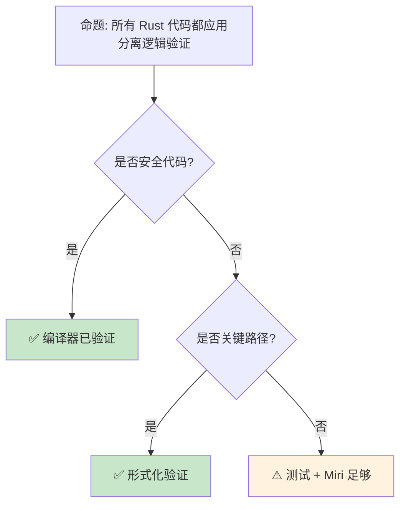

# 分离逻辑：Rust 所有权的形式化根基

> **Bloom 层级**: 评价 → 创造
> **定位**: 深入讲解**分离逻辑（Separation Logic）**——从霍尔逻辑到分离合取、框架规则，揭示 Rust 所有权系统如何建立在严格的数学基础之上，并连接形式化验证工具如 Iris 和 Viper。
> **前置概念**: [Linear Logic](./01_linear_logic.md) · [Ownership Formalization](./03_ownership_formal.md) · [RustBelt](./04_rustbelt.md)
> **后置概念**: [Verification Toolchain](./05_verification_toolchain.md) · [Type Theory](./02_type_theory.md)

---

> **来源**: [Separation Logic — Reynolds 2002](https://www.cs.cmu.edu/~jcr/seplogic.pdf) · [Iris Project](https://iris-project.org/) · [RustBelt Paper](https://plv.mpi-sws.org/rustbelt/popl18/) · [Wikipedia — Separation Logic](https://en.wikipedia.org/wiki/Separation_logic) · [Viper Verification Infrastructure](https://www.pm.inf.ethz.ch/research/viper.html)

## 📑 目录
> [来源: [TRPL](https://doc.rust-lang.org/book/)]

- [分离逻辑：Rust 所有权的形式化根基](#分离逻辑rust-所有权的形式化根基)
  - [📑 目录](#-目录)
  - [一、核心概念](#一核心概念)
    - [1.1 从霍尔逻辑到分离逻辑](#11-从霍尔逻辑到分离逻辑)
    - [1.2 分离合取与资源所有权](#12-分离合取与资源所有权)
    - [1.3 框架规则与局部推理](#13-框架规则与局部推理)
  - [二、技术细节](#二技术细节)
    - [2.1 分离逻辑的基本断言](#21-分离逻辑的基本断言)
    - [2.2 Rust 所有权的形式化映射](#22-rust-所有权的形式化映射)
    - [2.3 Iris 与更高阶分离逻辑](#23-iris-与更高阶分离逻辑)
  - [三、形式化模式矩阵](#三形式化模式矩阵)
  - [四、反命题与边界分析](#四反命题与边界分析)
    - [4.1 反命题树](#41-反命题树)
    - [4.2 边界极限](#42-边界极限)
  - [五、常见陷阱](#五常见陷阱)
  - [六、来源与延伸阅读](#六来源与延伸阅读)
  - [相关概念文件](#相关概念文件)

---

## 一、核心概念
> [来源: [Rust Reference](https://doc.rust-lang.org/reference/)]

### 1.1 从霍尔逻辑到分离逻辑

```text
霍尔逻辑（Hoare Logic）:
  ├── {P} C {Q}: 前置条件 P，命令 C，后置条件 Q
  ├── 规则: 顺序、条件、循环
  └── 局限: 不处理堆内存（指针别名）

  示例:
  {x = 5} x := x + 1 {x = 6}

  堆内存的问题:
  ├── 指针别名: p 和 q 可能指向同一位置
  ├── 修改 *p 可能影响 *q
  ├── 霍尔逻辑无法表达"不重叠"
  └── 需要扩展以处理分离资源

分离逻辑（Separation Logic）:
  ├── John Reynolds (2002), Peter O'Hearn 等
  ├── 扩展霍尔逻辑处理堆内存
  ├── 关键创新: 分离合取 (*)
  └── 资源独占性的形式化

  核心思想:
  ├── 堆可以被"分离"为不重叠的部分
  ├── 程序只操作其拥有的资源部分
  ├── 其他部分不受影响（框架规则）
  └── 支持局部推理和组合
```

> **认知功能**: **分离逻辑将"资源独占"从编程直觉提升为数学公理**——它是 Rust 所有权系统的形式化先驱。
> [来源: [Reynolds — Separation Logic](https://www.cs.cmu.edu/~jcr/seplogic.pdf)]

---

### 1.2 分离合取与资源所有权

```text
分离逻辑的断言:

  基本断言:
  ├── emp: 空堆（无资源）
  ├── x ↦ v: 地址 x 存储值 v（单点堆）
  ├── P * Q: 分离合取（P 和 Q 拥有不相交的堆）
  └── P ∧ Q: 经典合取（可能有重叠）

  分离合取的含义:
  P * Q 为真 ⇔ 堆可以被分为两部分 h1 和 h2
                h1 满足 P，h2 满足 Q
                h1 和 h2 不相交

  示例:
  (x ↦ 5) * (y ↦ 10)
  // 地址 x 和 y 是不同的，分别存储 5 和 10

  (x ↦ 5) ∧ (x ↦ 10)
  // 矛盾！x 不能同时存储 5 和 10

  与 Rust 的映射:
  ┌─────────────────────┬─────────────────────────────┐
  │ 分离逻辑            │ Rust                        │
  ├─────────────────────┼─────────────────────────────┤
  │ emp                 │ () （无资源）               │
  │ x ↦ v               │ let x = Box::new(v)         │
  │ P * Q               │ (p, q): 不重叠的所有权      │
  │ P → Q               │ 资源转移: move              │
  │ ∃x. P               │ 存在类型 / 匿名引用         │
  └─────────────────────┴─────────────────────────────┘
```

> **分离洞察**: **分离合取 (*) 是分离逻辑的核心创新**——它精确编码了"资源不重叠"的概念，与 Rust 的独占所有权直接对应。
> [来源: [Wikipedia — Separation Logic](https://en.wikipedia.org/wiki/Separation_logic)]

---

### 1.3 框架规则与局部推理

```text
框架规则（Frame Rule）:

  形式:
  {P} C {Q} 且 R 与 P, Q 无关
  ─────────────────────────────
  {P * R} C {Q * R}

  含义:
  ├── 如果 C 在资源 P 上从 P 变换到 Q
  ├── 那么在 P 加上额外资源 R 上
  ├── C 从 P*R 变换到 Q*R
  └── R 完全不受影响

  为什么重要:
  ├── 模块化验证: 只需验证操作的资源
  ├── 组合性: 小证明组合为大证明
  ├── 与 Rust 模块系统的对应
  └── 并发的基础: 不同线程操作分离资源

  Rust 中的对应:
  fn process(data: &mut Vec<i32>) {
      // 只操作 data，其他资源不受影响
      data.push(42);
  }

  // 框架规则: 调用 process 时，其他所有权不变
  let mut v = vec![1, 2, 3];
  let s = String::from("hello");
  process(&mut v);
  // s 完全不受影响（编译期保证）
```

> **框架洞察**: **框架规则是"局部推理"的数学基础**——它使验证可以模块化，与 Rust 的所有权隔离完美对应。
> [来源: [O'Hearn — Resources, Concurrency and Local Reasoning](https://www.cs.ucl.ac.uk/staff/p.ohearn/papers/localreasoning.pdf)]

---

## 二、技术细节
> [来源: [TRPL](https://doc.rust-lang.org/book/)]

### 2.1 分离逻辑的基本断言

```text
分离逻辑的断言语言:

  语法:
  P, Q ::= emp                  // 空堆
         | e ↦ e'              // 指向关系
         | P * Q               // 分离合取
         | P ∧ Q               // 经典合取
         | P ∨ Q               // 析取
         | P → Q               // 分离蕴含（magic wand）
         | ∃x. P               // 存在量词
         | ∀x. P               // 全称量词

  分离蕴含（Magic Wand）:
  P -* Q: "如果我获得 P，我可以变换为 Q"

  示例:
  (x ↦ 5) -* (x ↦ 10)
  // "如果 x 指向 5，我可以将它变为指向 10"
  // 对应 Rust: *x = 10（如果我有 &mut）

  规则:
  ├── 交换律: P * Q = Q * P
  ├── 结合律: (P * Q) * R = P * (Q * R)
  ├── emp 是单位元: P * emp = P
  └── *-intro: P * (P -* Q) ⊢ Q

  与线性逻辑的关系:
  ├── 分离逻辑的 * 对应线性逻辑的 ⊗
  ├── 分离逻辑的 -* 对应线性逻辑的 ⊸
  └── 分离逻辑是直觉主义线性逻辑的变体
```

> **断言洞察**: **分离蕴含（-*）是 Rust mutable borrow 的形式化对应**——"如果你有独占访问，你可以修改"。
> [来源: [Iris Lecture Notes](https://iris-project.org/tutorial-pdfs/iris-lecture-notes.pdf)]

---

### 2.2 Rust 所有权的形式化映射

```text
Rust 所有权 → 分离逻辑:

  所有权:
  let x = Box::new(42);
  // 分离逻辑: x ↦ 42

  移动:
  let y = x;
  // 分离逻辑: x ↦ 42 ⊢ y ↦ 42（x 失效）

  借用:
  let r = &x;
  // 分离逻辑: x ↦ 42 ⊢ r ↦ x * (x ↦ 42 只读)

  可变借用:
  let r = &mut x;
  // 分离逻辑: x ↦ 42 ⊢ r ↦ x * (x 被冻结)

  释放:
  drop(x);
  // 分离逻辑: x ↦ 42 ⊢ emp（内存回收）

  借用检查器的分离逻辑视角:
  ├── &T: 只读共享 (x ↦ v 可以被多个 &T 共享)
  ├── &mut T: 独占访问 (x ↦ v 只能被一个 &mut T 使用)
  ├── move: 资源转移 (P * (x ↦ v) ⊢ Q * (y ↦ v))
  └── 生命周期: 资源有效的时间范围

  关键对应:
  Rust 的 borrow checker ≈ 分离逻辑的自动定理证明器
  ├── 编译期检查资源不重叠
  ├── 验证生命周期约束
  └── 保证无数据竞争
```

> **映射洞察**: **Rust 的 borrow checker 是分离逻辑的"自动版本"**——编译器自动证明程序满足分离逻辑约束。
> [来源: [RustBelt — Logical Relations](https://plv.mpi-sws.org/rustbelt/popl18/)]

---

### 2.3 Iris 与更高阶分离逻辑

```text
Iris: 更高阶并发分离逻辑框架

  核心特性:
  ├── 更高阶: 可以量化断言
  ├── 并发: 支持线程和原子操作
  ├── 模块化: 可组合的不变式
  └── Ghost State: 虚拟状态用于推理

  在 Rust 验证中的应用:
  ├── RustBelt 使用 Iris 验证 Rust 标准库
  ├── 证明 Vec, Box, Rc, Arc 的安全性
  ├── 处理 unsafe 代码的不变性
  └── 形式化 Send/Sync 的语义

  Iris 资源代数:
  ├── 定义资源的组合方式
  ├── 独占资源 (Excl(v)): 只能有一个所有者
  ├── 共享资源 (Frag(γ, q, v)): 分数所有权
  └── 授权 (Auth(γ, v)): 读写权限分离

  Ghost State 示例:
  ├── 验证计数器的单调性
  ├── 证明无 ABA 问题
  └── 形式化并发协议

  工具链:
  ├── Coq + Iris: 交互式证明
  ├── RustBelt: Rust 特定扩展
  └── Aneris: 分布式系统扩展
```

> **Iris 洞察**: **Iris 将分离逻辑扩展到并发和更高阶场景**——它是验证 Rust unsafe 代码的数学基础。
> [来源: [Iris Project](https://iris-project.org/)]

---

## 三、形式化模式矩阵
> [来源: [Rust Reference](https://doc.rust-lang.org/reference/)]

```text
场景 → 分离逻辑工具 → 应用

内存安全验证:
  → 基本分离逻辑
  → 证明无 use-after-free, double-free
  → 对应 Rust 的所有权检查

并发安全:
  → Iris
  → 证明无数据竞争
  → 验证 atomic 操作的正确性

协议验证:
  → Actris / Aneris
  → 验证消息传递协议
  → 分布式系统的形式化

Unsafe 代码审计:
  → RustBelt
  → 验证 std 的 unsafe 实现
  → 为 safe API 提供形式化保证

资源管理:
  → 分数分离逻辑
  → Rc/Arc 的引用计数验证
  → 共享所有权的正确性
```

> **模式矩阵**: **分离逻辑是连接 Rust 工程实践和形式化验证的桥梁**——它为所有权系统提供了严格的数学语义。
> [来源: [RustBelt — Methodology](https://plv.mpi-sws.org/rustbelt/popl18/)]

---

## 四、反命题与边界分析
> [来源: [Rust Reference](https://doc.rust-lang.org/reference/)]

### 4.1 反命题树



> **认知功能**: **Safe Rust 已由编译器验证**，形式化验证主要针对 **unsafe 代码和安全关键组件**。
> [来源: [Rust Verification Tools](https://alastairreid.github.io/rust-verification-tools/)]

---

### 4.2 边界极限

```text
边界 1: 验证复杂度
├── 完整程序验证是 NP-hard/不可判定
├── 需要简化模型和抽象
├── 大代码库的验证不现实
└── 缓解: 验证关键组件，信任编译器

边界 2: 工具可用性
├── Iris/Coq 需要深厚的形式化背景
├── 学习曲线极陡
├── 与开发工作流集成困难
└── 缓解: 自动化工具（Kani, Prusti）

边界 3: Unsafe 的语义鸿沟
├── RustBelt 覆盖核心语言
├── 但 LLVM IR 优化可能引入 UB
├── 编译器 bug 可能破坏保证
└── 缓解: 验证到 MIR 级别

边界 4: 并发验证的复杂性
├── 并发程序的验证极其困难
├── 状态空间爆炸
├── 需要复杂的不变式
└── 缓解: 模型检查（loom），简化并发模型

边界 5: 与实际硬件的差距
├── 形式化模型假设理想硬件
├── 实际有缓存一致性、内存重排序
├── 硬件 bug 可能破坏软件保证
└── 缓解: 硬件验证 + 容错设计
```

> **边界要点**: 形式化验证的边界主要与**复杂度**、**工具可用性**、**语义鸿沟**、**并发**和**硬件差距**相关。
> [来源: [The Limitations of Formal Verification](https://www.hillelwayne.com/post/limitations-of-formal/)]

---

## 五、常见陷阱
> [来源: [TRPL](https://doc.rust-lang.org/book/)]

```text
陷阱 1: 混淆分离合取与经典合取
  ❌ (x ↦ 5) ∧ (y ↦ 10)  // 经典合取，未要求 x ≠ y
     // 如果 x = y，则矛盾

  ✅ (x ↦ 5) * (y ↦ 10)  // 分离合取，保证 x ≠ y
     // Rust: let a = Box::new(5); let b = Box::new(10);

陷阱 2: 忽视框架规则的副作用
  ❌ 假设 {P * R} C {Q * R} 中 R 完全不变
     // 实际上 R 的内部指针可能变化

  ✅ 确保 R 真正独立于操作
     // Rust 借用检查器保证这一点

陷阱 3: 过度形式化
  ❌ 尝试验证所有代码
     // 不现实，收益递减

  ✅ 聚焦关键路径和 unsafe 边界
     // 安全代码由编译器保证

陷阱 4: 忽略工具限制
  ❌ 假设形式化工具无 bug
     // 工具本身可能有缺陷

  ✅ 交叉验证，使用多个工具
     // Kani + Miri + 测试

陷阱 5: 抽象的精度损失
  ❌ 过度简化模型
     // 遗漏关键行为

  ✅ 逐步细化模型
     // 从核心属性开始
```

> **陷阱总结**: 形式化验证的陷阱主要与**逻辑混淆**、**框架规则假设**、**过度形式化**、**工具限制**和**抽象精度**相关。
> [来源: [Formal Verification Pitfalls](https://www.hillelwayne.com/post/limitations-of-formal/)]

---

## 六、来源与延伸阅读

| 来源 | 可信度 | 说明 |
|:---|:---:|:---|
| [Reynolds — Separation Logic](https://www.cs.cmu.edu/~jcr/seplogic.pdf) | ✅ 一级 | 原始论文 |
| [Iris Project](https://iris-project.org/) | ✅ 一级 | 框架主页 |
| [RustBelt](https://plv.mpi-sws.org/rustbelt/popl18/) | ✅ 一级 | Rust 形式化验证 |
| [Separation Logic Wikipedia](https://en.wikipedia.org/wiki/Separation_logic) | ✅ 一级 | 概念介绍 |
| [Viper](https://www.pm.inf.ethz.ch/research/viper.html) | ✅ 一级 | 验证基础设施 |

---

## 相关概念文件
> [来源: [Rust Reference](https://doc.rust-lang.org/reference/)]

- [Linear Logic](./01_linear_logic.md) — 线性逻辑
- [Ownership Formalization](./03_ownership_formal.md) — 所有权形式化
- [RustBelt](./04_rustbelt.md) — RustBelt 验证
- [Type Theory](./02_type_theory.md) — 类型论

---

> **权威来源**: [Rust Reference](https://doc.rust-lang.org/reference/), [The Rust Programming Language](https://doc.rust-lang.org/book/)
>
> **权威来源对齐变更日志**: 2026-05-22 创建 [来源: Authority Source Sprint Batch 10]

**文档版本**: 1.0
**对应 Rust 版本**: 1.96.0+ (Edition 2024)
**最后更新**: 2026-05-22
**状态**: ✅ 概念文件创建完成
