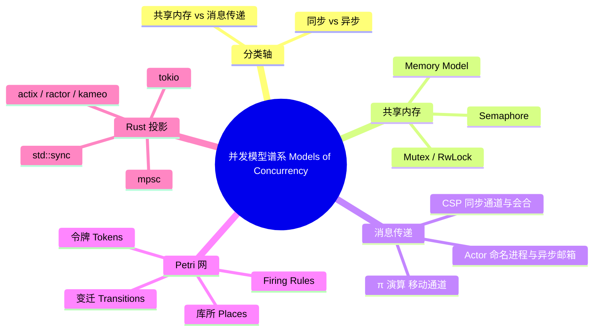

> **内容分级**: [专家级]

# 并发模型谱系（Models of Concurrency）

> **EN**: Models of Concurrency
> **Summary**: A formal taxonomy of concurrent computation models — shared memory, message passing, CSP, Actor, π-calculus, and Petri nets — with their Rust incarnations.
> **Rust 版本**: 1.97.0+ (Edition 2024)
> **Bloom 层级**: L4-L5
> **权威来源**: 本文件为 `concept/` 权威页。
> **定位**: 从**模型谱系**角度给出并发计算的形式分类：共享内存、消息传递（CSP/Actor/π）、Petri 网，并把它们映射到 Rust 的 `std::sync`、`mpsc`、异步运行时与 Actor 框架，避免把工程原语误当成理论模型的同构实现。
> **前置概念**:
> [L3 并发编程](../../03_advanced/00_concurrency/01_concurrency.md) ·
> [L4 进程代数与 Rust](../07_concurrency_semantics/01_process_calculi_for_rust.md) ·
> [L4 Actor 形式语义](../07_concurrency_semantics/03_actor_semantics.md) ·
> [L5 五模型定义矩阵](../../05_comparative/00_paradigms/04_five_models_definition_matrix.md)
> **后置概念**:
> [并发模型表达能力比较](02_expressiveness_of_concurrent_models.md) ·
> [五范式语义边界](03_parallel_concurrent_async_distributed_semantics.md) ·
> [分布式系统语义](../09_system_semantics/04_distributed_systems_semantics.md)

---

## 📑 目录

- [并发模型谱系（Models of Concurrency）](#并发模型谱系models-of-concurrency)
  - [📑 目录](#-目录)
  - [一、核心概念](#一核心概念)
    - [1.1 两条分类轴](#11-两条分类轴)
    - [1.2 共享内存模型](#12-共享内存模型)
    - [1.3 消息传递模型](#13-消息传递模型)
      - [CSP：同步通道与会合](#csp同步通道与会合)
      - [Actor：命名进程与异步邮箱](#actor命名进程与异步邮箱)
      - [π 演算：移动通道](#π-演算移动通道)
    - [1.4 Petri 网](#14-petri-网)
    - [1.5 Rust 中的投影](#15-rust-中的投影)
  - [二、反例与边界](#二反例与边界)
    - [反例："Rust mpsc 就是 CSP"](#反例rust-mpsc-就是-csp)
    - [反例："Actor 邮箱保证全局 FIFO"](#反例actor-邮箱保证全局-fifo)
    - [反例："Petri 网只是流程图"](#反例petri-网只是流程图)
    - [反例：async 块捕获局部引用逃逸作用域（E0373）](#反例async-块捕获局部引用逃逸作用域e0373)
    - [反例：通道类型协议错配（E0308）](#反例通道类型协议错配e0308)
  - [三、相关概念](#三相关概念)
  - [四、嵌入式测验（Embedded Quiz）](#四嵌入式测验embedded-quiz)
  - [五、🧭 思维导图（Mindmap）](#五-思维导图mindmap)
  - [International Authority References（国际权威来源）](#international-authority-references国际权威来源)

---

## 一、核心概念

并发计算不是单一模型，而是由若干**形式骨架**构成的谱系。本页从两条分类轴出发，把共享内存、消息传递（CSP/Actor/π）与 Petri 网放到同一张地图上，再映射到 Rust 的工程原语。

### 1.1 两条分类轴

| 轴 | 左端 | 右端 | 关键问题 |
|:---|:---|:---|:---|
| **通信介质** | 共享内存（shared memory） | 消息传递（message passing） | 进程间如何交换信息？ |
| **同步方式** | 同步（synchronous） | 异步（asynchronous） | 发送方是否等待接收方就绪/完成？ |

两条轴互相独立，产生四个象限：

```text
                    同步                  异步
                 ┌────────────┬────────────┐
    共享内存     │ 锁 + 条件量 │ 无锁结构   │
                 ├────────────┼────────────┤
    消息传递     │ CSP 会合    │ Actor 邮箱 │
                 └────────────┴────────────┘
```

π 演算位于「消息传递」象限但模糊了同步/异步边界：它先定义**名字传递**，同步/异步可通过编码相互导出（Sangiorgi & Walker, 2001）。Petri 网则不是按「进程」组织，而是按**状态/事件**组织，因此难以直接落在这两条轴上。

### 1.2 共享内存模型

共享内存把多个执行线程放进同一地址空间，通过显式同步原语协调对公共数据的访问。

**核心形式构件**：

```text
锁（Lock/Mutex）      : 互斥进入临界区
信号量（Semaphore）   : 计数器控制 n 个线程的通过
条件变量（Condvar）   : 线程等待某个谓词成立
内存模型（Memory Model）: 定义读写的可见顺序与重排约束
```

Rust 的 `std::sync::Mutex<T>` 把数据与锁封装在一起，依赖所有权与类型系统在编译期排除数据竞争：

```rust
use std::sync::{Arc, Mutex};
use std::thread;

fn main() {
    let counter = Arc::new(Mutex::new(0));
    let mut handles = vec![];

    for _ in 0..10 {
        let c = Arc::clone(&counter);
        handles.push(thread::spawn(move || {
            let mut num = c.lock().unwrap();
            *num += 1;
        }));
    }

    for h in handles { h.join().unwrap(); }
    assert_eq!(*counter.lock().unwrap(), 10);
}
```

共享内存模型的**关键风险**是死锁与数据竞争；Rust 的所有权系统消除了数据竞争（Herlihy & Shavit, 2011 将无数据竞争保证视为并发数据结构可组合性的核心前提），但**死锁仍是运行时性质**（例如两线程以不同顺序获取两把锁）。

下面的 `compile_fail` 反例说明 Rust 如何在编译期拦截跨线程类型错误与数据竞争模式：

```rust,compile_fail,E0277
use std::rc::Rc;
use std::thread;

fn main() {
    // Rc<T> 不是 Send，不能跨线程移动
    let data = Rc::new(42);
    thread::spawn(move || {
        println!("{}", *data);
    });
}
```

```rust,compile_fail,E0499
fn main() {
    let mut data = 0;
    let r1 = &mut data;
    let r2 = &mut data; // 第二次可变借用被禁止

    std::thread::scope(|s| {
        s.spawn(|| { *r1 += 1; });
        s.spawn(|| { *r2 += 1; });
    });
}
```

### 1.3 消息传递模型

消息传递模型把进程/线程视为自治实体，彼此不共享地址空间，通过发送/接收消息通信。它内部又可细分为三种经典骨架：CSP（Hoare, 1978; 1985）、Actor（Hewitt, 1973; Agha, 1986）与 π 演算（Milner, 1999）；CCS 作为 π 演算的直接前身由 Milner (1989) 系统阐述。

#### CSP：同步通道与会合

CSP（Communicating Sequential Processes, Hoare 1978/1985）的核心是**同步通道 + 会合（rendezvous）**：发送与接收必须同时就绪，通信本身即是同步点。选择算子 `[]` 让进程等待多个通道中**任意一个**就绪。

Rust 中只有在 `mpsc::sync_channel(0)` 时才复现真正的会合语义（详见 [L4 进程代数页](../07_concurrency_semantics/01_process_calculi_for_rust.md)）。

```rust
use std::sync::mpsc;
use std::thread;

fn main() {
    // sync_channel(0) 强制会合：发送阻塞直到接收发生
    let (tx, rx) = mpsc::sync_channel::<i32>(0);
    thread::spawn(move || {
        tx.send(42).unwrap(); // 握手发生前阻塞
    });
    assert_eq!(rx.recv().unwrap(), 42);
}
```

#### Actor：命名进程与异步邮箱

Actor 模型（Hewitt 1973; Agha 1986）把计算单元定义为 `⟨地址, 邮箱, 行为⟩`。进程通过**地址**发送异步消息到对方邮箱；每个 actor 一次处理一条消息，内部状态不共享。失败模型通过监督树实现（详见 [L4 Actor 形式语义](../07_concurrency_semantics/03_actor_semantics.md)）。

Rust 没有语言级 actor，但 `actix`、`ractor`、`kameo` 等 crate 在类型系统内重建了该模型：

```rust,ignore
// 概念示意：ractor 风格的 actor 三要素
// 地址   : ActorRef<CounterMsg>
// 邮箱   : 运行时提供的消息队列
// 行为   : async fn handle(&self, msg, state)
use ractor::{Actor, ActorRef};

enum CounterMsg { Increment, Get(ActorRef<i64>) }

struct Counter;
impl Actor for Counter {
    type Msg = CounterMsg;
    type State = i64;
    // ...
}
```

#### π 演算：移动通道

π 演算（Milner, Parrow & Walker 1992; Milner, 1999）在 CCS 之上增加**通道名作为消息传递**的能力，从而建模通信拓扑的动态变化——即**移动性（mobility）**。系统的通道结构在运行时演化。Milner (1992) 的 *Functions as Processes* 进一步证明函数式计算可编码为进程交互，这为 Rust 中把闭包/通道作为一等值传递提供了理论背景。

Rust 中最接近移动性的工程事实是 `Sender<T>` 本身可以作为消息被发送：

```rust
use std::sync::mpsc;
use std::thread;

fn main() {
    // 把新的工作通道发送给子线程：拓扑在运行时改变
    let (coord_tx, coord_rx) = mpsc::channel::<mpsc::Sender<i32>>();
    thread::spawn(move || {
        let (work_tx, work_rx) = mpsc::channel::<i32>();
        coord_tx.send(work_tx).unwrap();
        assert_eq!(work_rx.recv().unwrap(), 7);
    });

    let work_tx = coord_rx.recv().unwrap();
    work_tx.send(7).unwrap();
}
```

但 Rust 的所有权与生命周期约束会在通道移动性上附加额外限制：下面的 `compile_fail` 反例说明，如果试图通过通道发送一个指向局部值的借用名字，生命周期检查会阻止它逃逸作用域：

```rust,compile_fail,E0597
use std::sync::mpsc;

fn main() {
    let (tx, rx) = mpsc::channel::<&str>();
    let received: &str;
    {
        let local = String::from("mobility");
        tx.send(&local).unwrap(); // 想把局部名字作为消息传递
        received = rx.recv().unwrap();
    } // local 在此 drop，但 received 仍持有它的引用
    println!("{}", received);
}
```

在消息传递模型之上，**session types**（Honda 1993; Gay & Hole 2005; Wadler 2012）把通信协议本身编码为类型，保证通道两端在顺序、分支与递归上的一致性；**algebraic effects**（Plotkin & Pretnar 2009; Dolan et al. 2017）则把控制流与效应解释分离，可用来统一表达并发、异常、状态等语义。二者在 Rust 中尚未进入标准库，但为 `async/await`、类型化 actor 与 effect system 研究提供了形式语义背景。

### 1.4 Petri 网

Petri 网（Reisig 1985）以**库所（places）**、**变迁（transitions）**、**令牌（tokens）**、**firing rules** 描述并发系统，不区分「进程」与「通道」，而强调**状态与事件的局部因果结构**。

```text
形式骨架：
  库所 P : 状态/条件，用圆表示
  变迁 T : 事件/动作，用矩形表示
  流关系 F ⊆ (P × T) ∪ (T × P)
  标识 M : P → ℕ，表示每个库所中的令牌数

firing rule:
  变迁 t 在标识 M 下可触发，当且仅当 ∀p ∈ •t : M(p) ≥ 1
  触发后 M' = M − •t + t•
```

Petri 网特别适合表达**资源竞争、生产者-消费者缓冲、工作流并发**。与进程代数相比，它的优势是能直接刻画**冲突（conflict）**、**并发（concurrency）**与**因果依赖**三种结构关系，而不必先定义进程。

### 1.5 Rust 中的投影

| 形式模型 | 核心抽象 | Rust 工程载体 | 关键偏差 |
|:---|:---|:---|:---|
| 共享内存 | 锁、信号量、内存模型 | `std::sync::Mutex`, `std::sync::RwLock`, `std::sync::atomic` | Rust 用所有权排除数据竞争，但死锁仍存在 |
| CSP | 同步通道、会合、外部选择 | `mpsc::sync_channel(0)`, `crossbeam::select!`, `tokio::select!` | 默认 `mpsc::channel()` 是无界缓冲，不是会合 |
| Actor | 地址 + 邮箱 + 行为 + 监督 | `actix`, `ractor`, `kameo` | Rust 没有语言级 actor；消息类型由 trait/enum 保证 |
| π 演算 | 名字传递、移动性 | `Sender<T>` 作为消息传递 | π 是动态语义，Rust additionally 在类型层施加所有权约束 |
| Petri 网 | 库所/变迁/令牌 | 无直接标准库对应；可用状态机/工作流 crate 近似 | Rust 类型系统不直接表达 Petri 网 firing rule |

Rust 的并发设计是**多模型的混合投影**：`std::sync` 走共享内存路线，`mpsc` 提供 CSP 风格的 FIFO 通道，`async` 运行时提供协作式异步消息传递，生态 crate 提供 Actor。理解每种模型在 Rust 中的**精确边界**，是避免选型失误的前提。

---

## 二、反例与边界

### 反例："Rust mpsc 就是 CSP"

这是最常见的误读。CSP 的通道在语义层面是**无缓冲、会合式**的；Rust 的默认 `mpsc::channel()` 是**无界缓冲队列**，发送方在非内存耗尽场景下不会阻塞。

```rust
use std::sync::mpsc;

fn main() {
    let (tx, _rx) = mpsc::channel::<i32>();
    for i in 0..1_000_000 {
        tx.send(i).unwrap(); // ✅ 全部成功：无界缓冲，无背压
    }
    // 若按 CSP 直觉部署到生产环境，快生产者会导致 OOM。
}
```

**修正**：需要会合时用 `mpsc::sync_channel(0)`；需要背压时用 `mpsc::sync_channel(n)`。详见 [L4 进程代数页](../07_concurrency_semantics/01_process_calculi_for_rust.md) §六。

### 反例："Actor 邮箱保证全局 FIFO"

Actor 模型的在途消息在 Agha 形式化中是**多重集**，模型层不保证消息顺序。实现层面通常对**同一发送者**保持 FIFO，但多个发送者向同一 actor 发送时，消息交错顺序由调度器决定。

```rust,ignore
// ❌ 错误假设：A、B 同时向 C 发送 Init 与 Use，
// 认为 Init 一定先被处理。
actor_a.do_send(Init);
actor_b.do_send(Use); // 可能 Use 先于 Init 被处理
```

**修正**：用 request-response 或消息内序号建模因果依赖。详见 [L4 Actor 形式语义](../07_concurrency_semantics/03_actor_semantics.md) §六。

### 反例："Petri 网只是流程图"

流程图描述的是**顺序控制流**；Petri 网描述的是**分布式状态与事件的局部关系**，天然支持：

- **并发**：两个无共享输入库所的变迁可同时触发；
- **冲突**：两个变迁竞争同一令牌，只能触发一个；
- **同步**：一个变迁需要多个前置库所同时有令牌才能触发。

把 Petri 网当成流程图会忽略其**局部因果语义**与**可达性分析**能力。

### 反例：async 块捕获局部引用逃逸作用域（E0373）

`async` 块默认按引用捕获局部变量；若返回的 `Future` 超出被捕获变量的生命周期，编译器会报 E0373。这相当于把「并发/异步任务的生命周期」写进了类型系统：

```rust,compile_fail,E0373
fn make_future() -> impl std::future::Future<Output = ()> {
    let s = String::from("captured");
    async {
        println!("{}", s); // async 块按引用捕获 s，但 Future 试图逃逸作用域
    }
}

fn main() {}
```

**修正**：将 `s` 移入 `async` 块内部，或改用 `async move { ... }` 明确按值捕获。

### 反例：通道类型协议错配（E0308）

`mpsc::channel::<T>()` 把协议中的消息类型 `T` 编码为 Rust 类型参数。若发送端与接收端对 `T` 的约定不一致，编译器直接拒绝，这正是 session types「对偶类型在编译期匹配」思想的最朴素体现：

```rust,compile_fail,E0308
use std::sync::mpsc;

fn main() {
    let (tx, _rx) = mpsc::channel::<i32>();
    // Sender<i32> 与 String 不兼容：协议类型错配
    tx.send("hello".to_string()).unwrap();
}
```

**修正**：统一通道两端类型 `T`，或引入显式协议枚举（如 `enum Msg { Init, Data(i32), Done }`）。

---

## 三、相关概念

- [L4 进程代数与 Rust](../07_concurrency_semantics/01_process_calculi_for_rust.md) —— CSP/CCS/π 演算的深度形式骨架与 Rust 原语对应表
- [L4 Actor 形式语义](../07_concurrency_semantics/03_actor_semantics.md) —— Actor 三公理、监督树与 Rust 框架映射
- [L5 五模型定义矩阵](../../05_comparative/00_paradigms/04_five_models_definition_matrix.md) —— 同步/并发/并行/异步/分布式五范式的一页式导航
- [并发模型表达能力比较](02_expressiveness_of_concurrent_models.md) —— 模型间编码、互模拟与 Felleisen 表达力
- [五范式语义边界](03_parallel_concurrent_async_distributed_semantics.md) —— 同步、并发、并行、异步、分布式的精确语义边界
- [L6 分布式系统语义](../09_system_semantics/04_distributed_systems_semantics.md) —— 跨节点失败模型与共识语义

---

## 四、嵌入式测验（Embedded Quiz）

**1. 哪一项最接近 CSP 的 rendezvous（会合）语义？**

- A. `std::sync::mpsc::channel()`
- B. `std::sync::mpsc::sync_channel(0)`
- C. `std::sync::Mutex<T>`
- D. `tokio::sync::mpsc::unbounded_channel()`

> **答案：B**。`sync_channel(0)` 让发送方阻塞直到接收方取走消息，复现了无缓冲的 CSP 会合；默认 `channel()` 是无界缓冲队列。

**2. Actor 模型的「无共享状态」意味着什么？**

- A. Actor 之间不能通信
- B. Actor 之间只能通过消息通信
- C. Actor 使用共享锁保护状态
- D. 所有 Actor 按全局顺序执行

> **答案：B**。Actor 的三公理（send/create/become）禁止直接共享内存，所有信息交换都通过异步消息。

**3. π 演算的「移动性（mobility）」指的是什么？**

- A. 进程可以在不同 CPU 核心之间迁移
- B. 通道名本身可以作为消息在通道上传递
- C. 消息顺序可以随意改变
- D. 进程可以动态创建线程

> **答案：B**。移动性指通信拓扑在运行时演化——A 把私有通道名发送给 B 后，B 获得与 A 直接通信的能力。

**4. Petri 网中，一个变迁（transition）能够触发的前提条件是？**

- A. 所有输出库所都有令牌
- B. 所有输入库所都有至少一个令牌
- C. 所有变迁都没有冲突
- D. 网是强连通的

> **答案：B**。firing rule 要求每个输入库所 `•t` 都包含至少一个令牌；触发后消耗输入令牌并在输出库所产生新令牌。

**5. 关于 Rust `mpsc`，下列哪项陈述是错误的？**

- A. 支持多个生产者（multi-producer）
- B. 默认通道是无界缓冲的
- C. 默认通道提供 CSP 会合语义
- D. `sync_channel(n)` 可以显式限制缓冲大小

> **答案：C**。默认 `mpsc::channel()` 是无界缓冲，不提供会合语义；需要显式 `sync_channel(0)` 才能复现 CSP rendezvous。

---

## 五、🧭 思维导图（Mindmap）



> **认知功能**: 本 mindmap 从模型谱系的角度组织核心概念，帮助读者在「共享内存—消息传递—Petri 网」三维坐标中快速定位每个 Rust 并发原语的理论来源。

---

## International Authority References（国际权威来源）

- Hoare, C. A. R. *Communicating Sequential Processes*. Communications of the ACM 21(8), 1978, 666–677. [DOI](https://doi.org/10.1145/359576.359585) · [ACM DL](https://dl.acm.org/doi/10.1145/359576.359585)
- Hoare, C. A. R. *Communicating Sequential Processes*. Prentice Hall, 1985.
- Hewitt, C., Bishop, P., Steiger, R. *A Universal Modular ACTOR Formalism for Artificial Intelligence*. IJCAI 1973. [PDF（IJCAI 官方）](https://www.ijcai.org/Proceedings/73/Papers/027B.pdf)
- Hewitt, C. *Actor Model of Computation: Scalable Robust Information Systems*. arXiv:1008.1459. [arXiv](https://arxiv.org/abs/1008.1459)
- Milner, R. *Communication and Concurrency*. Prentice Hall, 1989. [DOI](https://doi.org/10.5555/28251)
- Milner, R., Parrow, J., Walker, D. *A Calculus of Mobile Processes*. Information and Computation 100(1), 1992. [DOI](https://doi.org/10.1016/0890-5401(92)90008-4)
- Milner, R. *Communicating and Mobile Systems: the π-Calculus*. Cambridge University Press, 1999.
- Honda, K. "Types for Dyadic Interaction." *CONCUR 1993*, LNCS 715, 1993, 509–523. [DOI](https://doi.org/10.1007/3-540-57208-2_35) · [Springer](https://link.springer.com/chapter/10.1007/3-540-57208-2_35)
- Gay, S. J., Hole, M. "Subtyping for Session Types in the Pi Calculus." *Acta Informatica* 42(2–3), 2005, 191–225. [DOI](https://doi.org/10.1007/s00236-005-0177-z)
- Wadler, P. "Propositions as Sessions." *ICFP 2012*, 2012, 273–286. [DOI](https://doi.org/10.1145/2364527.2364568)
- Plotkin, G. D., Pretnar, M. "Handlers of Algebraic Effects." *ESOP 2009*, LNCS 5502, 2009, 80–94. [DOI](https://doi.org/10.1007/978-3-642-00590-9_7)
- Dolan, S., Eliopoulos, S., Hillerström, D., Madhavapeddy, A., Sivaramakrishnan, K. C., White, L. "Concurrent System Programming with Effect Handlers." *TFP 2017*, LNCS 10788, 2017, 98–117. [DOI](https://doi.org/10.1007/978-3-319-89719-6_6)
- Herlihy, M., Shavit, N. *The Art of Multiprocessor Programming*. Morgan Kaufmann, 2011. [ScienceDirect](https://www.sciencedirect.com/book/9780123973375/the-art-of-multiprocessor-programming)
- Reisig, W. *Petri Nets: An Introduction*. Springer, 1985.
- [The Rust Async Book](https://rust-lang.github.io/async-book/) — Rust 异步并发模型官方指南
- [crossbeam-channel — docs.rs](https://docs.rs/crossbeam-channel/latest/crossbeam_channel/) — Rust 生态中 CSP 风格通道与 `select!` 的实现参考
- [std::sync::mpsc — Rust 标准库文档](https://doc.rust-lang.org/std/sync/mpsc/) · [std::sync::Mutex — Rust 标准库文档](https://doc.rust-lang.org/std/sync/struct.Mutex.html) · [The Rust Programming Language: Fearless Concurrency](https://doc.rust-lang.org/book/ch16-00-concurrency.html)

> **相关文件**: [L4 进程代数](../07_concurrency_semantics/01_process_calculi_for_rust.md) · [L4 Actor 语义](../07_concurrency_semantics/03_actor_semantics.md) · [并发模型表达能力比较](02_expressiveness_of_concurrent_models.md) · [五范式语义边界](03_parallel_concurrent_async_distributed_semantics.md)
>
> **文档版本**: 1.0 ｜ **最后更新**: 2026-07-28 ｜ **状态**: ✅ 新建（Rust 1.97 对齐）
