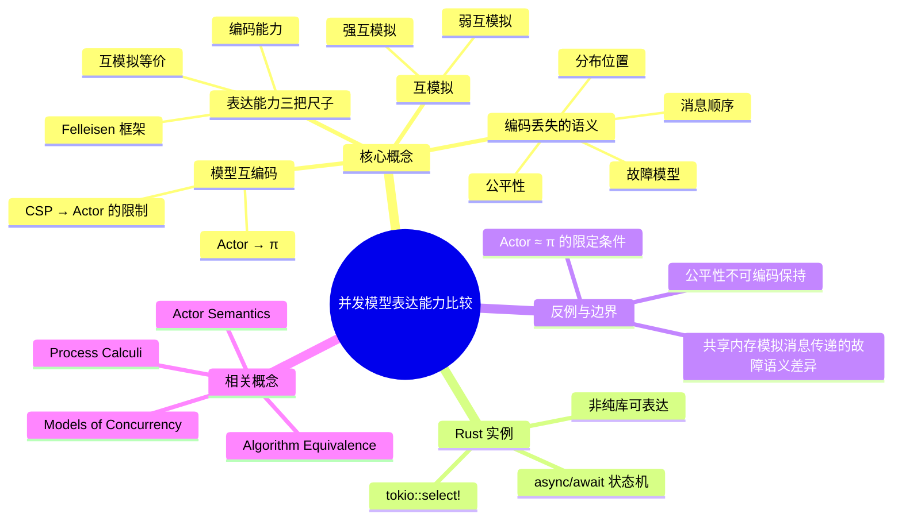

> **内容分级**: [专家级]

# 并发模型表达能力比较（Expressiveness of Concurrent Models）

> **EN**: Expressiveness of Concurrent Models
> **Summary**: Comparing the expressive power of concurrent models via encodings, bisimulation, and Felleisen's expressiveness framework.

> **Rust 版本**: 1.97.0+ (Edition 2024)
> **Bloom 层级**: L4-L5
> **权威来源**: 本文件为 `concept/` 权威页。
> **定位**: 从**编码、互模拟与 Felleisen 表达力框架**三个维度，比较共享内存、CSP、Actor、π 演算等并发模型的表达能力边界，并解释 Rust 的 `tokio::select!`、`async/await` 等原语在形式表达力坐标系中的位置。
> **前置概念**: [Async/Await](../../03_advanced/01_async/01_async.md) · [Models of Concurrency](01_models_of_concurrency.md) · [Process Calculi for Rust](../07_concurrency_semantics/01_process_calculi_for_rust.md) · [Actor Semantics](../07_concurrency_semantics/03_actor_semantics.md) · [Algorithm Equivalence](../08_algorithm_semantics/05_algorithm_equivalence.md)
> **后置概念**: [Distributed Systems Semantics](../09_system_semantics/04_distributed_systems_semantics.md) · [Reactive Systems Semantics](../09_system_semantics/05_reactive_systems_semantics.md) · [Five Models Definition Matrix](../../05_comparative/00_paradigms/04_five_models_definition_matrix.md)

---

> **来源**:
> [Felleisen, *On the Expressive Power of Programming Languages*, ESOP / LNCS 1990/1991](https://doi.org/10.1007/3-540-52592-0_60) ·
> [Sangiorgi & Walker, *The π-Calculus: A Theory of Mobile Processes*, Cambridge UP 2001](https://doi.org/10.1017/CBO9780511777683) ·
> [van Glabbeek, *The Linear Time – Branching Time Spectrum*, CONCUR 1990 / LNCS 458](https://doi.org/10.1007/BFb0030039) ·
> [Milner, *Communication and Concurrency*, Prentice Hall 1989](https://doi.org/10.5555/28251) ·
> [std::sync::mpsc — Rust 标准库文档](https://doc.rust-lang.org/std/sync/mpsc/) ·
> [Rust Reference — async blocks and closures](https://doc.rust-lang.org/reference/expressions/block-expr.html#async-blocks)
>
> ⚠️ **声明**: 本页讨论的是**形式模型之间的表达能力关系**，不是 Rust 编译器实现细节。「不可表达」指在 Felleisen 框架下需要改变语言语义或运行时观察集，而非单纯的"代码写起来麻烦"。

---

## 📑 目录

- [并发模型表达能力比较（Expressiveness of Concurrent Models）](#并发模型表达能力比较expressiveness-of-concurrent-models)
  - [📑 目录](#-目录)
  - [一、核心概念](#一核心概念)
    - [1.1 表达能力的三把尺子](#11-表达能力的三把尺子)
    - [1.2 模型互编码：Actor → π 与 CSP → Actor](#12-模型互编码actor--π-与-csp--actor)
    - [1.3 互模拟：强、弱与观察等价](#13-互模拟强弱与观察等价)
    - [1.4 编码中必然丢失的语义](#14-编码中必然丢失的语义)
    - [1.5 Felleisen 表达力框架](#15-felleisen-表达力框架)
  - [二、Rust 实例：`tokio::select!` 与状态机](#二rust-实例tokioselect-与状态机)
  - [三、反例与边界](#三反例与边界)
    - [反例："Actor 与 π 演算表达能力相同"](#反例actor-与-π-演算表达能力相同)
    - [反例："只要加锁，共享内存就能模拟任意消息传递"](#反例只要加锁共享内存就能模拟任意消息传递)
    - [边界：公平性与故障模型不可编码保持](#边界公平性与故障模型不可编码保持)
  - [四、定理链与相关概念](#四定理链与相关概念)
  - [五、认知路径](#五认知路径)
  - [权威来源索引](#权威来源索引)
  - [嵌入式测验（Embedded Quiz）](#嵌入式测验embedded-quiz)
    - [测验 1：编码与表达能力](#测验-1编码与表达能力)
    - [测验 2：强互模拟与弱互模拟](#测验-2强互模拟与弱互模拟)
    - [测验 3：`tokio::select!` 的表达力](#测验-3tokioselect-的表达力)
    - [测验 4：Actor 与 π 演算](#测验-4actor-与-π-演算)
    - [测验 5：共享内存模拟消息传递的边界](#测验-5共享内存模拟消息传递的边界)
  - [🧭 思维导图（Mindmap）](#-思维导图mindmap)

---

## 一、核心概念

### 1.1 表达能力的三把尺子

比较两个并发模型 "A 比 B 更具表达力" 之前，必须先固定**比较标准**。形式语义中常用三把尺子：

```text
1. 编码能力（Encodability）
   是否存在一个编译（编码）函数 ⟦·⟧，把模型 A 的任意进程 P 翻译成模型 B 的进程 ⟦P⟧，
   使得 A 中可观察的行为在 B 中保持（通常要求某种形式等价）。

2. 互模拟等价（Bisimulation）
   两个系统能否被环境无限期地混淆；强互模拟要求步数一一对应，弱互模拟允许忽略内部 τ 步。

3. Felleisen 表达力（Expressiveness Framework）
   语言 L₂ 比 L₁ 更具表达力，当且仅当：
   (a) 存在一个从 L₁ 到 L₂ 的*局部*翻译（不改变程序其余部分的语义）；
   (b) 存在 L₂ 程序，其在 L₁ 中*没有*行为等价的对应物（即 L₂ 能区分原 L₁ 程序无法区分的观察）。
```

> **关键区分**: 编码只要求"能翻译"；Felleisen 进一步要求"翻译是模块化的"且"新增了真实区分能力"。后者更贴近工程问题：把 `select!` 从 Rust 语言中拿掉，能否用纯库完全替代？

---

### 1.2 模型互编码：Actor → π 与 CSP → Actor

**Actor → π 演算**是教科书中经典的**保行为编码**（Sangiorgi & Walker 2001, §15）：

```text
actor 地址 a        ⟼  π 演算中的通道名 a
邮箱中的消息 m      ⟼  在途消息 ⟨a, m⟩，表示为在通道 a 上发送的消息包
行为 become b'      ⟼  递归进程定义 μX. 处理输入后重新展开为 X'
创建新 actor        ⟼  (νx) 新建私有通道名 x 并通知调度器
```

π 演算只有"通道"没有"进程名"，因此 actor 的**地址**被编码为一条通道：其他进程向该通道发送消息即相当于向 actor 发送。调度器（mail system）用一个中心进程或分布式规则把消息派送给对应的行为体。

**CSP → Actor** 的编码则**不对称**（更多限制）：

```text
CSP 通道 c          ⟼  一个"通道 actor" C，持有消息队列
进程 P 的输入 c?x   ⟼  P 向 C 发送 request，C 回复消息包
进程 P 的输出 c!v   ⟼  P 向 C 发送 v
外部选择 P [] Q     ⟼  P 与 Q 同时向多个通道 actor 发请求，取先到达者
```

这里的问题在于 CSP 的**会合（rendezvous）**要求发送与接收同步发生；Actor 模型是**异步邮箱**，消息发送后立即返回。要用 Actor 模拟一次 CSP 会合，必须引入 request-response（两次异步消息）加锁确认，这会改变故障语义：如果接收 actor 在确认前崩溃，发送方对"消息是否已被接收"的观测与 CSP 不同。

---

### 1.3 互模拟：强、弱与观察等价

互模拟回答"两个并发系统何时可互换"。设迁移系统状态为 `S`，动作标签为 `Act`（含内部动作 `τ`）：

```text
强互模拟（Strong Bisimulation）:
  R 是强互模拟 ⟺ 若 (s, t) ∈ R，且 s ─α→ s'，则存在 t' 使 t ─α→ t' 且 (s', t') ∈ R（反之亦然）。
  强互模拟等价 ~ 要求内部 τ 步也一一对应。

弱互模拟（Weak/Observational Bisimulation）:
  只要求*外部可见动作*匹配，τ 步可以任意插入或省略。
  弱互模拟等价 ≈ 是工程上更常用的"行为相同"。
```

在 Rust 语境中，

```rust
use std::sync::{Arc, Mutex};

fn main() {
    // 实现 A：显式锁
    let data = Arc::new(Mutex::new(0));
    let d1 = Arc::clone(&data);
    std::thread::spawn(move || { *d1.lock().unwrap() += 1; });
    *data.lock().unwrap() += 1;

    // 实现 B：通过 mpsc 串行化
    let (tx, rx) = std::sync::mpsc::channel::<i32>();
    std::thread::spawn(move || { tx.send(1).unwrap(); });
    let mut sum = 0;
    if let Ok(v) = rx.recv() { sum += v; }
    sum += 1;
}
```

如果观察集 `O` 只看"最终某个计数器是否增加了 2"，两个实现**可能**弱互模拟等价；但如果 `O` 包含"哪个线程先完成增量"或"是否发生锁竞争"，则不等价。互模拟不是实现本身的属性，而是**实现 + 观察集 + 等价关系**的三元关系。

---

### 1.4 编码中必然丢失的语义

即使存在从模型 A 到模型 B 的编码，以下语义性质通常**不能保持**：

| 性质 | 说明 | 例子 |
|:---|:---|:---|
| **公平性（Fairness）** | A 的调度假设消息最终会被处理 | Actor → π 编码若采用异步调度器，可能引入无限延迟 |
| **分布/位置（Distribution）** | A 中节点故障独立 | 编码到共享内存模型后，所有"节点"在同一个地址空间，故障不再独立 |
| **故障模型（Failure Model）** | A 中进程崩溃可观测 | CSP 经典语义没有崩溃；Rust 的 `SendError` 是一等可观测值 |
| **消息顺序（Message Order）** | A 中同一通道严格 FIFO | Actor 模型在途消息是多重集，编码后顺序必须由实现额外保证 |
| **同步/异步边界** | CSP 会合是原子握手 | 用异步消息 + 锁模拟时，握手被拆分为多步，原子性丢失 |

> **工程推论**: 当有人说"X 模型能表达 Y 模型"时，必须追问**保留了哪些观察集**；否则会把理论等价误解为工程可互换。

---

### 1.5 Felleisen 表达力框架

Felleisen（1991）提出：**比较两种语言/原语的表达力，要看"新增原语是否让语言能区分更多程序行为"**。形式化地，语言 `L'` 比 `L` 更具表达力，当且仅当：

```text
1. 存在从 L 到 L' 的局部翻译（local translation）⟦·⟧；
2. 存在 L' 程序 C' 与上下文 C[·]，使得：
     C[C'] 在 L' 中的行为无法被任何 L 程序在 L 的上下文中复现。
```

"局部"是关键：翻译只替换一个子表达式，不改变程序其余部分的控制结构。这正好对应工程问题——`tokio::select!` 是不是一个**纯宏**就能实现？如果不是，它就在 Felleisen 意义上增加了表达力。

---

## 二、Rust 实例：`tokio::select!` 与状态机

`tokio::select!` 等待多个异步操作中的**第一个就绪者**，并执行对应分支。它看起来像宏，但无法仅通过普通过程宏在不改变 Rust 语义的情况下实现：

```rust,ignore
// tokio::select! 的工程形态（需 tokio 依赖）
use tokio::select;

async fn demo(rx: &mut tokio::sync::mpsc::Receiver<i32>, timer: &mut tokio::time::Interval) {
    select! {
        Some(v) = rx.recv() => println!("channel: {}", v),
        _ = timer.tick()    => println!("timeout"),
    }
}
```

为什么纯库宏不够？因为 `select!` 需要：

1. **同时轮询多个 Future**：每次 `poll` 必须按某种策略检查所有分支；
2. **在分支返回前保存其他分支的中间状态**：如果分支 A 返回 `Pending`，分支 B 已部分推进的状态不能丢失；
3. **在编译期生成一个枚举状态机**：这是 `async/await` 的核心机制，由编译器把异步函数转换为 `Future` 状态机。

```rust,ignore
// 一个"手写"的近似 select! 会迅速陷入状态爆炸：
enum Select2State<A, B> {
    Start { a: A, b: B },
    ADone { b: B },       // A 已完成，等待 B
    BDone { a: A },       // B 已完成，等待 A
    Done,
}

// 每增加一个分支，枚举状态数翻倍；对泛型、生命周期、Pin 的处理必须由编译器完成。
```

因此，`tokio::select!` 在 Felleisen 意义上**增加了表达力**：它依赖 Rust 编译器提供的 `async/await` 状态机转换。没有这一语言级机制，相同的可观察行为（"等待多 Future 先完成者"）无法通过纯过程宏局部实现而不引入显式手动状态机枚举。

> 注意：`select!` 在 Rust 中**不是没有它就写不出来**——任何熟练开发者都可以手写状态机——而是"无法在保持原上下文结构不变的前提下，用一个局部宏调用替换"。这正是 Felleisen "局部翻译"条件的意义。

---

## 三、反例与边界

### 反例："Actor 与 π 演算表达能力相同"

这个命题在**纯语法编码**意义下**成立**：存在从 Actor 到 π 演算的合理编码，也存在反向编码（通过命名通道 + 调度器）。但在**工程语义**意义下**不成立**，因为：

```text
❌ 错误推论: "既然能互相编码，Actor 和 π 演算在 Rust 中可以互换。"

正确表述:
  • Actor 模型有内置的*命名进程*和*异步、无保证顺序*的邮箱语义；
  • π 演算有*命名通道*和*移动性*（通道作为一等值传递）；
  • 互相编码后，Actor 的"单个 actor 崩溃不影响其他 actor"故障隔离语义
    在 π 演算编码中需要额外引入 failure detector / 监督树才能复现；
  • π 演算中通道作用域的*词法限制* (νx) 在 Actor 编码中需要显式撤销/传递能力管理。
```

因此，"表达能力相同"只在忽略**故障模型、分布位置、调度公平性**的抽象层面成立；一旦把这些纳入观察集，两者立刻可区分。

---

### 反例："只要加锁，共享内存就能模拟任意消息传递"

这个命题在**单地址空间、无故障**假设下可以成立，但在真实 Rust 程序中**边界明显**：

```rust
use std::sync::{Arc, Mutex};
use std::thread;

fn main() {
    // 用共享内存 + 锁模拟"消息传递计数器"
    let counter = Arc::new(Mutex::new(0));
    let c = Arc::clone(&counter);
    thread::spawn(move || {
        let mut guard = c.lock().unwrap();
        *guard += 1;
        // 如果这里 panic，锁被 poison，共享状态语义与"消息已发送但未处理"不同
    });
    *counter.lock().unwrap() += 1;
}
```

当线程在持有锁时 panic，Rust 的 `Mutex` 会被**poison**——后续 `lock()` 返回 `PoisonError`。消息传递模型没有"锁 poison"这一概念；对应现象是"消息在途或处理者崩溃"，其观测方式（`RecvError`、`SendError`）完全不同。因此，共享内存编码**改变了故障观察集**。

---

### 边界：公平性与故障模型不可编码保持

| 原模型性质 | 编码后通常丢失 | 为什么重要 |
|:---|:---|:---|
| Actor 公平性：每条消息最终处理 | 在 π 编码中，调度器可能永远推迟某条消息 | 活性（liveness）证明失效 |
| CSP 同步会合 | 在 Actor 编码中拆分为 request-response | 原子性、故障原子性改变 |
| π 演算通道限制 `(νx)` | 在共享内存编码中，指针可任意泄漏 | 能力控制从类型/作用域退化为运行时约定 |
| Rust 线程 panic 传播 | 在经典进程代数中没有对应 | 失败模型是 Rust 独有的观测维度 |

> **边界总结**: 模型间编码保持的是**语法结构**和**某种弱行为等价**；公平性、分布、故障、消息顺序等"系统级语义"几乎必然需要在目标模型中重新建模。

---

## 四、定理链与相关概念

| 编号 | 命题 | 前提 | 结论 |
|:---|:---|:---|:---|
| T-ECM-01 | Actor 可编码入 π 演算 | Sangiorgi & Walker 的地址-as-通道编码 | Actor 计算模型的行为可由 π 演算模拟（在忽略故障模型时） |
| T-ECM-02 | CSP 会合不可由异步 Actor 直接保持 | CSP 会合是原子握手；Actor send 是非阻塞返回 | CSP → Actor 编码必须引入额外同步协议，改变故障语义 |
| T-ECM-03 | 强互模拟 ⟹ 弱互模拟 | 弱互模拟定义更宽松 | 若两系统强互模拟，则必然弱互模拟；反之不成立 |
| T-ECM-04 | `tokio::select!` 非纯库可表达 | 需要编译器生成 Future 状态机 + 同时保存多分支中间状态 | 在 Felleisen 框架下，`select!` 增加 Rust async 表达力 |
| T-ECM-05 | 编码不保公平性/故障模型 | 公平性与故障是目标模型未定义的额外假设 | 跨模型等价声明必须显式限定观察集 |

**相关概念**:

- [Models of Concurrency](01_models_of_concurrency.md) —— 并发模型谱系的形式骨架
- [Process Calculi for Rust](../07_concurrency_semantics/01_process_calculi_for_rust.md) —— CSP/CCS/π 演算与 Rust 原语的对应
- [Actor Semantics](../07_concurrency_semantics/03_actor_semantics.md) —— Actor 三公理、监督树与 Rust 映射
- [Algorithm Equivalence](../08_algorithm_semantics/05_algorithm_equivalence.md) —— 观察等价、精化序与等价判据
- [Distributed Systems Semantics](../09_system_semantics/04_distributed_systems_semantics.md) —— 分布式、故障模型与一致性
- [Five Models Definition Matrix](../../05_comparative/00_paradigms/04_five_models_definition_matrix.md) —— 同步/并发/并行/异步/分布式五范式一页式导航

---

## 五、认知路径

> **认知路径**: 模型谱系 ⟹ 编码能力 ⟹ 互模拟等价 ⟹ 编码丢失的语义 ⟹ Felleisen 框架 ⟹ Rust `select!` 实例 ⟹ 反例边界。

学习顺序建议：先读 [Models of Concurrency](01_models_of_concurrency.md) 建立各模型的形式骨架，再读本页理解它们之间的表达力关系；随后通过 [Process Calculi for Rust](../07_concurrency_semantics/01_process_calculi_for_rust.md) 与 [Actor Semantics](../07_concurrency_semantics/03_actor_semantics.md) 把理论落回 Rust 原语；最后在 [Five Models Definition Matrix](../../05_comparative/00_paradigms/04_five_models_definition_matrix.md) 中把五范式坐标补齐。

**核心推理链**: 编码存在 ⟹ 行为等价成立（在限定观察集下）⟹ 但公平性/故障/分布/顺序会丢失 ⟹ 工程选型时不能只看"能不能模拟"。

---

## 权威来源索引

- Felleisen, M. *On the Expressive Power of Programming Languages*. ESOP 1990 / LNCS 432, 1990, 351–375. [DOI](https://doi.org/10.1007/3-540-52592-0_60)（期刊版本：Science of Computer Programming 17(1–3), 1991, 35–75）
- Sangiorgi, D., Walker, D. *The π-Calculus: A Theory of Mobile Processes*. Cambridge University Press, 2001. [DOI](https://doi.org/10.1017/CBO9780511777683)
- van Glabbeek, R. J. *The Linear Time – Branching Time Spectrum*. CONCUR 1990 / LNCS 458, 1990, 278–297. [DOI](https://doi.org/10.1007/BFb0030039)
- Milner, R. *Communication and Concurrency*. Prentice Hall, 1989. [DOI](https://doi.org/10.5555/28251)
- Hoare, C. A. R. *Communicating Sequential Processes*. Prentice Hall, 1985.
- Hewitt, C. *Actor Model of Computation: Scalable Robust Information Systems*. arXiv:1008.1459, 2010. [arXiv](https://arxiv.org/abs/1008.1459)
- [std::sync::mpsc — Rust 标准库文档](https://doc.rust-lang.org/std/sync/mpsc/) —— Rust 通道语义与故障契约的官方来源
- [Rust Reference — async blocks and closures](https://doc.rust-lang.org/reference/expressions/block-expr.html#async-blocks) —— `async/await` 状态机转换的语言级说明
- [tokio::select! tutorial](https://tokio.rs/tokio/tutorial/select) —— `select!` 的工程用法（非官方 Rust，但为 tokio 生态权威文档）

> **相关文件**: [同层：Models of Concurrency](01_models_of_concurrency.md) · [同层 07：Process Calculi](../07_concurrency_semantics/01_process_calculi_for_rust.md) · [同层 07：Actor Semantics](../07_concurrency_semantics/03_actor_semantics.md) · [同层 08：Algorithm Equivalence](../08_algorithm_semantics/05_algorithm_equivalence.md)
>
> **文档版本**: 1.0 ｜ **最后更新**: 2026-07-28 ｜ **状态**: ✅ 新建权威页（Rust 1.97 对齐）

---

## 嵌入式测验（Embedded Quiz）

### 测验 1：编码与表达能力

"存在从模型 A 到模型 B 的编码"意味着：

- A. A 和 B 在所有观察集下行为等价
- B. A 的任意进程可以翻译成 B 的进程，并在某种限定观察集下保持行为
- C. B 一定比 A 更具 Felleisen 表达力

<details>
<summary>✅ 答案</summary>

**B. A 的任意进程可以翻译成 B 的进程，并在某种限定观察集下保持行为**。

编码只保证在特定等价关系/观察集下行为保持；公平性、故障模型、消息顺序等系统级语义通常会丢失。A 过于绝对；C 混淆了"可编码"与"Felleisen 表达力增加"，后者还要求局部翻译和新增区分能力。

</details>

---

### 测验 2：强互模拟与弱互模拟

若两个 Rust 异步服务在所有外部可见请求/响应序列上不可区分，但内部 `poll` 次数不同，则它们至少满足：

- A. 强互模拟
- B. 弱互模拟
- C. 两者都不满足

<details>
<summary>✅ 答案</summary>

**B. 弱互模拟**。

弱互模拟忽略内部 τ 步（如状态机内部的额外 `poll`），只要求外部可见动作匹配。强互模拟要求步数一一对应，因此内部 `poll` 次数不同会打破强互模拟。

</details>

---

### 测验 3：`tokio::select!` 的表达力

`tokio::select!` 无法仅用一个普通过程宏在 Rust 中完全替代，主要原因是：

- A. tokio 的 API 是私有的
- B. 它需要编译器把异步函数转换为 Future 状态机，以同时保存多个分支的中间状态
- C. `select!` 使用的语法 Rust 解析器不支持

<details>
<summary>✅ 答案</summary>

**B. 它需要编译器把异步函数转换为 Future 状态机，以同时保存多个分支的中间状态**。

`select!` 依赖 `async/await` 状态机转换；手写等价代码需要显式维护枚举状态。A 和 C 都不是本质原因——tokio API 是公开的，Rust 解析器也能处理宏语法。

</details>

---

### 测验 4：Actor 与 π 演算

"Actor 与 π 演算表达能力相同"在哪种意义下最合理？

- A. 在包含故障模型和分布位置的工程语义下
- B. 在忽略故障模型、公平性和消息顺序的纯语法编码层面
- C. 在 Rust 运行时实现层面

<details>
<summary>✅ 答案</summary>

**B. 在忽略故障模型、公平性和消息顺序的纯语法编码层面**。

Actor → π 的经典编码只保证结构可译；一旦纳入故障模型、分布位置或公平性，两者立刻可区分。Rust 运行时实现同时包含线程、通道、actor 框架等，无法直接对应单一形式模型。

</details>

---

### 测验 5：共享内存模拟消息传递的边界

用 `Arc<Mutex<T>>` 模拟跨线程消息传递时，以下哪项是共享内存模型**不直接提供**、而消息传递模型拥有的语义？

- A. 对 `T` 的独占访问
- B. 发送方在接收方崩溃时得到显式 `SendError`
- C. 通过锁保护数据的能力

<details>
<summary>✅ 答案</summary>

**B. 发送方在接收方崩溃时得到显式 `SendError`**。

`Arc<Mutex<T>>` 中线程崩溃会导致锁 poison，但发送方不会收到类似 `SendError` 的显式反馈；消息传递模型则把"对端消失"作为一等可观测错误。A 和 C 都是共享内存模型能提供的。

</details>

---

## 🧭 思维导图（Mindmap）



> **认知功能**: 本 mindmap 从本页章节结构提炼，一级分支对应核心主题，叶子节点为关键子概念，可作为本页的快速导航与复习索引。
