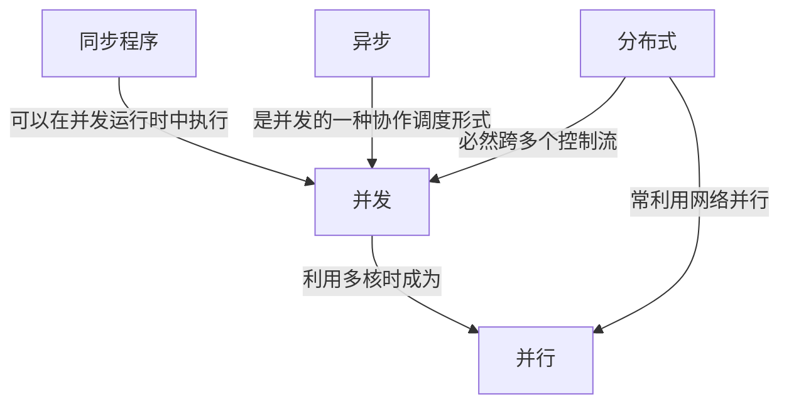
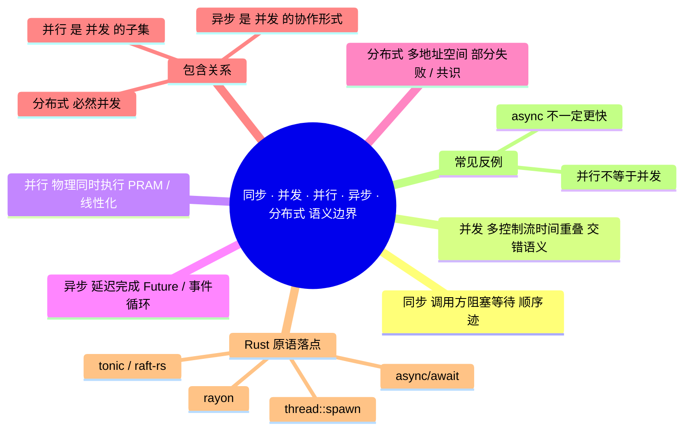

> **内容分级**: [专家级]

# 同步 · 并发 · 并行 · 异步 · 分布式的语义边界

> **EN**: Semantics Boundaries of Parallel, Concurrent, Async, and Distributed Computation
> **Summary**: Precise formal distinctions and overlaps among synchronous, concurrent, parallel, asynchronous, and distributed computation, mapped to Rust primitives.

> **Rust 版本**: 1.97.0+ (Edition 2024)
> **Bloom 层级**: L4-L5
> **权威来源**: 本文件为 `concept/` 权威页。
> **定位**: 在单一页中形式化区分「同步/并发/并行/异步/分布式」五种计算范式，标定它们的语义交集、包含关系与 Rust 原语的落点，避免把实现细节或性能目标当成范式定义。
> **前置概念**: [并发编程](../../03_advanced/00_concurrency/01_concurrency.md) · [Async/Await](../../03_advanced/01_async/01_async.md) · [并发模型谱系](01_models_of_concurrency.md) · [五模型定义矩阵](../../05_comparative/00_paradigms/04_five_models_definition_matrix.md)
> **后置概念**: [进程代数与 Rust](../07_concurrency_semantics/01_process_calculi_for_rust.md) · [Actor 形式语义](../07_concurrency_semantics/03_actor_semantics.md) · [分布式系统语义](../09_system_semantics/04_distributed_systems_semantics.md)

---

> **来源**:
> [std::thread — Rust 标准库文档](https://doc.rust-lang.org/std/thread/) ·
> [Asynchronous Programming in Rust Book](https://rust-lang.github.io/async-book/) ·
> [std::sync::mpsc — Rust 标准库文档](https://doc.rust-lang.org/std/sync/mpsc/) ·
> [rayon 文档](https://docs.rs/rayon/latest/rayon/) ·
> [tokio 文档](https://docs.rs/tokio/latest/tokio/)
>
> **学术来源**: E. A. Lee, "The Problem with Threads" (2006) · C. A. R. Hoare, *Communicating Sequential Processes* (1985) · L. Lamport, "Time, Clocks, and the Ordering of Events in a Distributed System" (1978)

---

## 📑 目录

- [同步 · 并发 · 并行 · 异步 · 分布式的语义边界](#同步--并发--并行--异步--分布式的语义边界)
  - [📑 目录](#-目录)
  - [一、核心概念：五种范式的精确定义](#一核心概念五种范式的精确定义)
  - [二、每种范式的形式模型](#二每种范式的形式模型)
    - [2.1 同步：顺序程序的迹（Trace）](#21-同步顺序程序的迹trace)
    - [2.2 并发：交错语义（Interleaving Semantics）](#22-并发交错语义interleaving-semantics)
    - [2.3 并行：PRAM 与线性化](#23-并行pram-与线性化)
    - [2.4 异步：Future 与事件循环](#24-异步future-与事件循环)
    - [2.5 分布式：偏序与共识](#25-分布式偏序与共识)
    - [2.6 进程代数与 session types 视角](#26-进程代数与-session-types-视角)
      - [2.6.1 进程代数：CSP、CCS、π 演算](#261-进程代数cspccsπ-演算)
      - [2.6.2 Session types：把协议写进类型](#262-session-types把协议写进类型)
      - [2.6.3 Algebraic effects 与 async/await 的表达能力对比](#263-algebraic-effects-与-asyncawait-的表达能力对比)
  - [三、语义交集与常见误解](#三语义交集与常见误解)
    - [3.1 包含关系](#31-包含关系)
    - [3.2 编程语言层面的常见误配](#32-编程语言层面的常见误配)
  - [四、Rust 原语的落点映射](#四rust-原语的落点映射)
    - [4.1 并发：线程与通道](#41-并发线程与通道)
    - [4.2 并行：rayon 数据并行](#42-并行rayon-数据并行)
    - [4.3 异步：Future 与状态机](#43-异步future-与状态机)
  - [五、反例与边界](#五反例与边界)
    - [反例：async 总是比 sync 快](#反例async-总是比-sync-快)
    - [反例：并行即并发](#反例并行即并发)
  - [六、相关概念](#六相关概念)
  - [七、International Authority References（国际权威来源）](#七international-authority-references国际权威来源)
  - [八、嵌入式测验（Embedded Quiz）](#八嵌入式测验embedded-quiz)
  - [🧭 思维导图（Mindmap）](#-思维导图mindmap)

---

## 一、核心概念：五种范式的精确定义

这五个词在日常讨论中常被混用。下面给出**互不兼容的语义特征**，作为后续讨论的公理化起点：

| 范式 | 核心语义 | 形式化关键词 | 与实现无关的关键问题 |
| :--- | :--- | :--- | :--- |
| **同步（Synchronous）** | 调用方在 callee 返回前**阻塞等待** | 调用/返回全序、调用栈、Hoare  triple | 是否必须等待结果才能继续？ |
| **并发（Concurrent）** | 多个控制流在**时间区间上重叠** | 交错语义（interleaving）、traces、 happens-before | 控制流之间是否共享状态？ |
| **并行（Parallel）** | **物理上同时**执行多个计算 | PRAM、work/span、线性化（linearizability） | 是否利用多核/多机物理资源？ |
| **异步（Asynchronous）** | 调用立即返回，**完成被推迟** | Future/Promise、事件循环、continuation | 完成通知机制是什么？ |
| **分布式（Distributed）** | 多个**独立地址空间/失败域**协同 | 部分失败、消息传递、共识、向量时钟 | 节点失败是否可被局部观测？ |

> **关键区分**：同步/异步描述的是**调用方与被调用方之间的时序契约**；并发/并行描述的是**执行结构**；分布式描述的是**部署拓扑与失败模型**。一个程序可以既是异步的又是分布式的，也可以是同步的并发的（例如线程池阻塞等待 I/O）。

---

## 二、每种范式的形式模型

### 2.1 同步：顺序程序的迹（Trace）

同步程序的状态转移可以写成最简单的**顺序迹**：

```text
σ₀ ─a₁→ σ₁ ─a₂→ ... ─aₙ→ σₙ
```

其中每一步 `aᵢ` 都是原子动作，调用方与被调用方共享同一条迹。

### 2.2 并发：交错语义（Interleaving Semantics）

并发模型把多个顺序迹**交错**成一条全局迹。给定两个进程 `P` 和 `Q`，它们的并发组合 `P || Q` 的语义是所有满足以下条件的迹的集合：

```text
trace(P || Q) = { t | t 在 P 的动作集上的投影 ∈ trace(P)
                     且 t 在 Q 的动作集上的投影 ∈ trace(Q) }
```

**重要结论**：并发本身不承诺任何两个动作会同时发生；它只承诺动作之间可能存在多种合法交错。

### 2.3 并行：PRAM 与线性化

并行计算的经典抽象是 **PRAM（Parallel Random Access Machine）**：多个处理器在**同一时刻**执行指令。在 Rust 的共享内存并行中，更实用的模型是 **linearizability**（Herlihy & Shavit, 2011）：每个并发操作看起来都在某个瞬间原子完成，且该瞬间落在调用与返回之间。

```text
P ─op▶ P'   且   Q ─op▶ Q'    可以在同一物理时刻发生
```

### 2.4 异步：Future 与事件循环

异步计算的语义核心是 **continuation**：

```text
async fn f() -> T   ≈   fn f(k: impl FnOnce(T) -> ())
```

调用 `f()` 不执行函数体，而是返回一个 `Future`；事件循环/执行器在 Future 就绪时调用其 `poll`，通过 waker 机制在 I/O 完成时恢复执行。

`async` 块对局部变量的捕获同样受编译期生命期约束。下面的 `compile_fail` 反例展示：若 `async` 块试图携带局部变量的引用逃逸当前函数，编译器会报 E0373：

```rust,compile_fail,E0373
fn make_future() -> impl std::future::Future<Output = ()> {
    let s = String::from("captured");
    async {
        println!("{}", s); // async 块捕获了局部变量 s 的引用
    }
}

fn main() {}
```

### 2.5 分布式：偏序与共识

分布式系统无法依赖全局时钟。Lamport 的 **happens-before** 关系 `→` 是事件之间的偏序：

```text
e₁ → e₂  当且仅当
  e₁ 与 e₂ 在同一进程且 e₁ 先于 e₂，或
  e₁ 是发送事件且 e₂ 是对应接收事件，或
  存在传递链 e₁ → e₃ → e₂。
```

当事件不可比较时，称它们**并发**——这是分布式语境下「并发」一词的另一种精确含义。

### 2.6 进程代数与 session types 视角

上面的五种范式可以从**进程代数**与**类型化通信协议**两个角度重新组织，这为 Rust 的 `mpsc`、`async/await` 以及更高级的类型系统扩展提供了形式语义背景。

#### 2.6.1 进程代数：CSP、CCS、π 演算

- **CSP（Communicating Sequential Processes）** — Hoare (1978, [Hoare 1985](http://www.usingcsp.com/cspbook.pdf))：以**同步会合（rendezvous）**为核心，进程通过命名通道交换事件；并行组合 `P || Q` 要求共享事件同步发生；外部选择 `[]` 让环境决定进程走向。Rust 的 `mpsc::sync_channel(0)` 与 `select!` 是其工程投影，但 Rust 默认 channel 是有缓冲的，二者并非同构（详见 [同层：进程代数与 Rust](../07_concurrency_semantics/01_process_calculi_for_rust.md)）。
- **CCS（Calculus of Communicating Systems）** — [Milner 1989](https://www.research.ed.ac.uk/en/publications/communication-and-concurrency/)：以极小语法（前缀、选择、并行、限制、重标记）定义带标签迁移系统，并给出**强/弱互模拟**作为行为等价标准。互模拟为比较并发实现是否可替换提供了方法论基准，但 Rust 程序本身没有标注迁移系统，因此不能直接套用等价证明。
- **π 演算** — [Milner, Parrow & Walker 1992](https://doi.org/10.1016/0890-5401(92)90008-4); Milner (1999)：在 CCS 基础上引入**通道名作为一等消息**，从而建模通信拓扑的动态变化（mobility）。Rust 中 `Sender<T>` 本身可作为值被移动或嵌入消息，正是这一思想的类型系统近似。Milner (1992) 的 *Functions as Processes* 进一步说明函数式计算可编码为进程交互，为 Rust 中把闭包/异步任务视为进程提供了理论支持。

> **小结**：三种演算共同把「并发」从实现细节提升为**交互模式**的研究对象；它们解释 Rust 通道与选择的血统，也标示出 Rust 所有权类型系统带来的额外静态约束。

π 演算的「移动性」允许通道名作为消息传递，但 Rust 的生命周期规则会阻止引用逃逸其作用域。下面的 `compile_fail` 反例展示：若试图通过通道发送局部值的引用，E0597 会在编译期拦截这一不安全的通道移动：

```rust,compile_fail,E0597
use std::sync::mpsc;

fn main() {
    let (tx, rx) = mpsc::channel::<&str>();
    let received: &str;
    {
        let local = String::from("mobility");
        tx.send(&local).unwrap(); // 把局部名字作为消息传递
        received = rx.recv().unwrap();
    } // local 在此 drop，但 received 仍持有它的引用
    println!("{}", received);
}
```

#### 2.6.2 Session types：把协议写进类型

Session types 将双向通信协议编码为类型，使得**顺序、分支、递归**等协议结构在编译期即可检验。

- [Honda 1993](https://doi.org/10.1007/3-540-57208-2_35) 提出二元会话类型（dyadic interaction types），用 `!T.S`（发送 `T` 后继续 `S`）、`?T.S`（接收 `T` 后继续 `S`）、`⊕{l:S, …}`（内部选择分支）、`&{l:S, …}`（外部选择分支）描述通信顺序。
- [Gay & Hole 2005](https://doi.org/10.1007/s00236-005-0177-z) 为 π 演算上的 session types 建立子类型关系，允许发送端比接收端更「具体」，同时保持通信安全。
- [Wadler 2012](https://doi.org/10.1145/2364527.2364568) 的 *Propositions as Sessions* 揭示 session types 与线性逻辑之间的 Curry-Howard 对应：通信的**对偶性**（duality）对应逻辑否定，**线性使用**对应资源不可复制。

Session types 保证协议安全的核心机制有三点：

1. **对偶性（Duality）**：通道两端的类型互为对偶，发送 `!T` 必须匹配接收 `?T`；若两端不一致，类型检查失败。
2. **线性（Linearity）**：会话端点不能被随意复制或丢弃，防止在错误状态下继续使用已关闭或已转换的通道。
3. **进展（Progress）**：良类型的进程网络不会出现死锁或协议状态错配（在理想演算中；工程实现还需额外条件）。

Rust 标准库并没有原生 session types，但 `mpsc::channel::<T>()` 的类型参数已经体现了最朴素的「对偶」思想：发送端 `Sender<T>` 与接收端 `Receiver<T>` 通过同一类型 `T` 耦合，任何类型错配都会在编译期被拒绝。

```rust
use std::sync::mpsc;

fn main() {
    let (tx, rx) = mpsc::channel::<i32>();
    // tx 与 rx 共享同一个类型参数 T = i32
    tx.send(42).unwrap();
    let v: i32 = rx.recv().unwrap();
    assert_eq!(v, 42);
}
```

下面的 `compile_fail` 反例说明：一旦把 `Sender<i32>` 与需要 `String` 的接收端混用，编译器立即拒绝。

```rust,compile_fail,E0308
use std::sync::mpsc;

fn main() {
    let (tx, _rx) = mpsc::channel::<i32>();
    // 类型不匹配：Sender<i32> 不能接受 String
    tx.send("hello".to_string()).unwrap();
}
```

#### 2.6.3 Algebraic effects 与 async/await 的表达能力对比

**Algebraic effects** — [Plotkin & Pretnar 2009](https://doi.org/10.1007/978-3-642-00590-9_7) 把「效应操作」的**签名**与**解释器（handler）**分离：程序调用如 `async` / `await` / `yield` / `fork` 等操作，但由外层 handler 决定这些操作的具体语义。这种分离使得同一套语法可以解释成协作式调度、异常、状态、非确定性等多种语义。

[Dolan et al. 2017](https://doi.org/10.1007/978-3-319-89719-6_6) 在 Multicore OCaml 中展示了如何用 effect handlers 实现 **async/await 式并发**：`Async` 与 `Await` 作为两个 effect 操作，由单个 handler 维护就绪队列与阻塞映射。这说明 async/await 可以被视为 algebraic effects 的一个**特化实例**。

与 Rust 的 `async/await` 相比：

| 维度 | Rust `async/await` | Algebraic effects |
|:---|:---|:---|
| 控制抽象 | 编译为状态机，隐式 `poll`/`Waker` | 通过 resumable continuation 显式捕获与恢复 |
| 可定制性 | 执行器可定制，但 `Future` 语义固定 | handler 可重新定义 `await`/`spawn` 的语义 |
| 与类型系统关系 | `Future<Output = T>` 是 trait，Send/Sync 边界约束跨任务移动 | 效应操作作为类型效果（effect system）的一部分 |
| 表达能力 | 足以为 I/O 密集型并发提供零成本抽象 | 更强，可统一表达异常、回溯、协程、并发等 |

> **边界**：Rust 目前（1.97）没有 language-level algebraic effects；`async/await` 是**单一、固定的效应解释**。若未来引入 effect system，才可能把 `await`、`?`、`yield` 等统一为可组合的效应操作。

---

## 三、语义交集与常见误解

### 3.1 包含关系



- **所有并行程序都是并发的**，但**并发程序不一定并行**（单核时间片调度）。
- **异步是并发的一个子类**：它通过协作式多任务让多个任务在时间上重叠，但通常不创建 OS 线程。
- **分布式系统一定是并发的**（多个节点），但不一定追求并行加速；它首先关注**容错与共识**。
- **同步与并发不互斥**：一个多线程程序可以并发地执行多个同步调用。

### 3.2 编程语言层面的常见误配

| 误配 | 问题 | 正确理解 |
| :--- | :--- | :--- |
| 把 `async/await` 当成并行 | `await` 交出控制权，但任务仍在**单个线程**上调度 | 并行需要数据并行（rayon）或多线程 |
| 把多线程当成并行 | 线程可能在单核上时间片切换 | 并行是运行时/硬件属性 |
| 把分布式 actor 当成本地并发 | 网络引入部分失败、消息丢失 | 必须引入超时、重传、共识 |
| 把同步 I/O 放在异步运行时 | 阻塞整个事件循环 | 异步要求非阻塞或 spawn_blocking |

---

## 四、Rust 原语的落点映射

| 范式 | Rust 原语/生态 | 语义落点 | 官方/生态文档 |
| :--- | :--- | :--- | :--- |
| 同步 | 普通函数调用、`std::io::Read` 阻塞读取 | 调用方等待 callee 完成 | [std::thread](https://doc.rust-lang.org/std/thread/) |
| 并发 | `std::thread::spawn`、`std::sync::Mutex`、`std::sync::mpsc` | OS 线程 + 共享内存/消息传递 | [std::sync::mpsc](https://doc.rust-lang.org/std/sync/mpsc/) |
| 并行 | `rayon::join`、`rayon::prelude::ParallelIterator` | 数据并行、work-stealing | [rayon docs](https://docs.rs/rayon/latest/rayon/) |
| 异步 | `async fn`、`Future`、`tokio::spawn`、`select!` | 协作式任务、状态机 | [async book](https://rust-lang.github.io/async-book/) |
| 分布式 | `tonic`、`raft-rs`、`ractor_cluster` | 跨节点 RPC、共识协议、actor 远程调用 | [tokio docs](https://docs.rs/tokio/latest/tokio/) |

### 4.1 并发：线程与通道

```rust
use std::sync::mpsc;
use std::thread;

fn main() {
    let (tx, rx) = mpsc::channel::<i32>();

    let handle = thread::spawn(move || {
        tx.send(42).unwrap();
    });

    assert_eq!(rx.recv().unwrap(), 42);
    handle.join().unwrap();
}
```

`thread::spawn` 创建的是**并发**控制流；只有在多核上实际同时执行时，它才转化为**并行**。

Rust 的类型系统还会拒绝两类常见并发错误。第一，`Send` 边界违反（E0277）：非 `Send` 类型不能跨线程移动。

```rust,compile_fail,E0277
use std::rc::Rc;
use std::thread;

fn main() {
    let data = Rc::new(42);
    thread::spawn(move || {
        println!("{}", *data);
    });
}
```

第二，数据竞争模式被借用检查器拦截（E0499）：同一作用域内不能对同一数据创建两个可变借用，即使它们被交给不同线程。

```rust,compile_fail,E0499
fn main() {
    let mut data = 0;
    let r1 = &mut data;
    let r2 = &mut data;

    std::thread::scope(|s| {
        s.spawn(|| { *r1 += 1; });
        s.spawn(|| { *r2 += 1; });
    });
}
```

### 4.2 并行：rayon 数据并行

```rust,ignore
use rayon::prelude::*;

fn main() {
    // 将迭代器自动拆分到多个 CPU 核心
    let sum: u64 = (0..1_000_000u64).into_par_iter().sum();
    println!("{sum}");
}
```

`rayon` 把顺序迭代器透明地转换成并行迭代器，但仍然是**确定性**的：结果与顺序执行相同，只是利用了并行硬件。

### 4.3 异步：Future 与状态机

```rust,ignore
async fn fetch(id: u32) -> u32 {
    // 在真实程序中，这里会执行非阻塞 I/O
    id * 2
}

#[tokio::main]
async fn main() {
    let a = fetch(1);
    let b = fetch(2);
    let (x, y) = tokio::join!(a, b);
    assert_eq!(x + y, 6);
}
```

`async/await` 在编译期被展开为状态机；运行时通过 `poll` 与 `Waker` 实现协作式调度。它**不保证并行**，只是允许单个线程在等待 I/O 时执行其他任务。

---

## 五、反例与边界

### 反例：async 总是比 sync 快

这是一个广泛传播但错误的直觉。异步的优势在于**等待 I/O 时复用线程**；如果任务本身受 CPU 限制，或者异步任务内部发生阻塞调用，异步框架会带来额外的调度、状态机和 `Waker` 开销，反而更慢。

```rust,ignore
use tokio::time::Instant;

#[tokio::main]
async fn main() {
    let start = Instant::now();

    // ❌ 错误：在 async 运行时中执行 CPU 密集型阻塞工作
    let handles: Vec<_> = (0..4)
        .map(|_| tokio::spawn(async {
            let mut s = 0u64;
            for i in 0..10_000_000 { s = s.wrapping_add(i); }
            s
        }))
        .collect();

    for h in handles {
        let _ = h.await;
    }

    println!("CPU-bound in async runtime took {:?}", start.elapsed());
}
```

修正方案：把 CPU 密集型工作移到 `tokio::task::spawn_blocking` 或 `rayon`。

> **边界**：异步是**并发模型**，不是**性能加速器**。它的收益取决于工作负载中 I/O 等待的比例。

### 反例：并行即并发

更准确的说法是：**并行 ⊆ 并发**。一个单核 CPU 上运行的多线程程序是并发的，但不是并行的。只有当两个线程真的在同一物理时刻占用不同核心时，才进入并行范畴。

```text
单核时间片调度：并发 ✓，并行 ✗
多核同时执行：   并发 ✓，并行 ✓
```

因此，「我的程序是并发的，所以它自动并行」是错误推理；并行性需要显式数据并行、任务并行或运行时/work-stealing 支持。

---

## 六、相关概念

- [并发模型谱系](01_models_of_concurrency.md) —— 共享内存、CSP、Actor、π、Petri 网的形式骨架
- [五模型定义矩阵](../../05_comparative/00_paradigms/04_five_models_definition_matrix.md) —— 一页式对照同步/并发/并行/异步/分布式
- [进程代数与 Rust](../07_concurrency_semantics/01_process_calculi_for_rust.md) —— CSP/CCS/π 与 `mpsc`/`select!` 的对应边界
- [Actor 形式语义](../07_concurrency_semantics/03_actor_semantics.md) —— 命名进程 + 邮箱的对偶模型
- [分布式系统语义](../09_system_semantics/04_distributed_systems_semantics.md) —— 部分失败、共识与一致性
- [Send/Sync 边界](../../03_advanced/00_concurrency/04_send_sync_boundaries.md) —— Rust 类型系统如何约束跨线程/异步任务的数据流动
- [并行与分布式模式谱系](../../03_advanced/00_concurrency/08_parallel_distributed_pattern_spectrum.md) —— 工程层面的选型地图

---

## 七、International Authority References（国际权威来源）

- [std::thread — Rust 标准库文档](https://doc.rust-lang.org/std/thread/)（P0 官方）
- [Asynchronous Programming in Rust Book](https://rust-lang.github.io/async-book/)（P0 官方 Rust 项目文档）
- [std::sync::mpsc — Rust 标准库文档](https://doc.rust-lang.org/std/sync/mpsc/)（P0 官方）
- [rayon docs.rs](https://docs.rs/rayon/latest/rayon/) · [tokio docs.rs](https://docs.rs/tokio/latest/tokio/)
- Lee, E. A. "The Problem with Threads." *IEEE Computer* 39(5), 2006, 33–42.
- Hoare, C. A. R. *Communicating Sequential Processes*. Communications of the ACM 21(8), 1978, 666–677. [DOI](https://doi.org/10.1145/359576.359585)
- Hoare, C. A. R. *Communicating Sequential Processes*. Prentice Hall, 1985. [作者授权电子版](http://www.usingcsp.com/cspbook.pdf)（项目记录：2026-07-12 本网络 DNS 未解析，保留备查）
- Lamport, L. "Time, Clocks, and the Ordering of Events in a Distributed System." *Communications of the ACM* 21(7), 1978, 558–565.
- Herlihy, M., Shavit, N. *The Art of Multiprocessor Programming*. Morgan Kaufmann, 2011. [ScienceDirect](https://www.sciencedirect.com/book/9780123973375/the-art-of-multiprocessor-programming)
- Milner, R. *Communication and Concurrency*. Prentice Hall, 1989. [Edinburgh Research Explorer](https://www.research.ed.ac.uk/en/publications/communication-and-concurrency/)
- Milner, R. *Communicating and Mobile Systems: the π-Calculus*. Cambridge University Press, 1999.
- Milner, R., Parrow, J., Walker, D. "A Calculus of Mobile Processes." *Information and Computation* 100(1), 1992, 1–77. [DOI](https://doi.org/10.1016/0890-5401(92)90008-4)
- Honda, K. "Types for Dyadic Interaction." *CONCUR 1993*, LNCS 715, 1993, 509–523. [DOI](https://doi.org/10.1007/3-540-57208-2_35)
- Gay, S. J., Hole, M. "Subtyping for Session Types in the Pi Calculus." *Acta Informatica* 42(2–3), 2005, 191–225. [DOI](https://doi.org/10.1007/s00236-005-0177-z)
- Wadler, P. "Propositions as Sessions." *ICFP 2012*, 2012, 273–286. [DOI](https://doi.org/10.1145/2364527.2364568)
- Plotkin, G. D., Pretnar, M. "Handlers of Algebraic Effects." *ESOP 2009*, LNCS 5502, 2009, 80–94. [DOI](https://doi.org/10.1007/978-3-642-00590-9_7)
- Dolan, S., Eliopoulos, S., Hillerström, D., Madhavapeddy, A., Sivaramakrishnan, K. C., White, L. "Concurrent System Programming with Effect Handlers." *TFP 2017*, LNCS 10788, 2017, 98–117. [DOI](https://doi.org/10.1007/978-3-319-89719-6_6)
- [ACM Digital Library — Hoare, "Communicating Sequential Processes" (CACM 1978)](https://dl.acm.org/doi/10.1145/359576.359585)（P1 学术）
- [IEEE Xplore — Lee, "The Problem with Threads" (IEEE Computer 2006)](https://ieeexplore.ieee.org/document/1635491)（P1 学术）
- [Springer — Honda, "Types for Dyadic Interaction" (CONCUR 1993)](https://link.springer.com/chapter/10.1007/3-540-57208-2_35)（P1 学术）
- [crates.io — rayon](https://crates.io/crates/rayon) · [crates.io — tokio](https://crates.io/crates/tokio)（P2 生态）

> **相关文件**: [同层：并发模型谱系](01_models_of_concurrency.md) · [同层：进程代数](../07_concurrency_semantics/01_process_calculi_for_rust.md) · [同层：Actor 语义](../07_concurrency_semantics/03_actor_semantics.md)
>
> **文档版本**: 1.1 ｜ **最后更新**: 2026-07-29 ｜ **状态**: ✅ Wave 2 增强（Rust 1.97 对齐）

---

## 八、嵌入式测验（Embedded Quiz）

**Q1**. 下列哪项说法是错误的？

- A. 所有并行程序都是并发程序。
- B. `async/await` 自动把任务映射到多个 CPU 核心上并行执行。
- C. 分布式系统一定涉及多个地址空间或失败域。
- D. 同步调用中调用方会阻塞直到被调用方返回。

<details>
<summary>答案</summary>

**B**。`async/await` 是协作式并发模型，默认在单个线程的事件循环上调度；并行需要数据并行（如 rayon）或多线程显式并行。

</details>

---

**Q2**. 单核 CPU 上通过时间片轮转运行多个线程，这种情况属于：

- A. 并发但不是并行
- B. 并行但不是并发
- C. 既是并发也是并行
- D. 既不是并发也不是并行

<details>
<summary>答案</summary>

**A**。并发关注控制流在时间上重叠；并行要求物理上同时执行。单核时间片调度只能交错执行。

</details>

---

**Q3**. 在 Rust 中，CPU 密集型计算最适合使用哪种原语？

- A. `tokio::spawn`
- B. `async fn` 配合 `await`
- C. `rayon::join` / `ParallelIterator`
- D. `std::sync::mpsc`

<details>
<summary>答案</summary>

**C**。`rayon` 专为数据并行设计；把 CPU 密集任务放进 async 运行时会阻塞事件循环或引入不必要的调度开销。

</details>

---

**Q4**. 分布式系统与本地并发系统的根本语义差异在于：

- A. 分布式系统必须比本地系统慢
- B. 本地并发不存在共享状态
- C. 分布式系统存在独立失败域和部分失败
- D. 分布式系统不能使用消息传递

<details>
<summary>答案</summary>

**C**。独立地址空间与部分失败是分布式系统的核心语义特征，必须由超时、重传、共识等协议处理。

</details>

---

**Q5**. 异步编程的主要收益来自：

- A. 自动并行化所有计算
- B. 减少 CPU 指令数
- C. 在等待 I/O 时让出线程，提高 I/O 密集型负载的吞吐量
- D. 消除所有数据竞争

<details>
<summary>答案</summary>

**C**。异步通过协作式调度复用线程，减少 I/O 等待期间的线程闲置；它既不自动并行，也不消除数据竞争。

</details>

---

## 🧭 思维导图（Mindmap）



> **认知功能**: 本 mindmap 从本页章节结构提炼，一级分支对应五种范式及其关系，二级分支为 Rust 原语与常见反例，可作为快速导航与复习索引。
