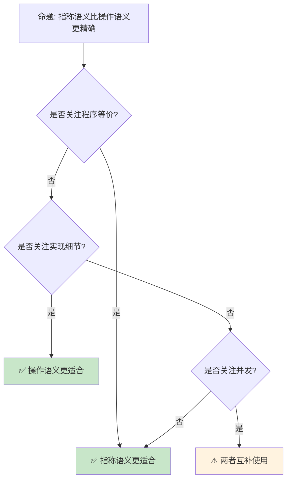

# 指称语义与领域理论

> **Bloom 层级**: 分析 → 评价
> **定位**: 探讨 Rust 的**指称语义**（Denotational Semantics）基础——从 Scott-Strachey 方法到完备偏序（CPO）、不动点理论，分析 Rust 类型如何通过数学对象赋予意义。
> **前置概念**: [Type Theory](./02_type_theory.md) · [Operational Semantics](./09_operational_semantics.md) · [Linear Logic](./01_linear_logic.md)
> **后置概念**: [Category Theory](./10_category_theory.md) · [RustBelt](./04_rustbelt.md)

---

> **来源**: [The Semantics of Programming Languages (Winskel)](https://www.cl.cam.ac.uk/~gw104/Semantics.pdf) · [Domain Theory (Abramsky & Jung)](https://www.cs.ox.ac.uk/people/samson.abramsky/dt.ps) · [Wikipedia — Denotational Semantics](https://en.wikipedia.org/wiki/Denotational_semantics) · [Wikipedia — Domain Theory](https://en.wikipedia.org/wiki/Domain_theory)

## 📑 目录
> [来源: [Rust Reference](https://doc.rust-lang.org/reference/)]
>
> [来源: [TRPL](https://doc.rust-lang.org/book/)]

- [指称语义与领域理论](#指称语义与领域理论)
  - [📑 目录](#-目录)
  - [一、核心概念](#一核心概念)
    - [1.1 指称语义原理](#11-指称语义原理)
    - [1.2 完备偏序（CPO）](#12-完备偏序cpo)
    - [1.3 不动点定理](#13-不动点定理)
  - [二、Rust 的指称解释](#二rust-的指称解释)
    - [2.1 类型即域](#21-类型即域)
    - [2.2 所有权即线性性](#22-所有权即线性性)
    - [2.3 生命周期即区域](#23-生命周期即区域)
  - [三、反命题与边界分析](#三反命题与边界分析)
    - [3.1 反命题树](#31-反命题树)
    - [3.2 边界极限](#32-边界极限)
  - [四、常见陷阱](#四常见陷阱)
  - [五、来源与延伸阅读](#五来源与延伸阅读)
  - [相关概念文件](#相关概念文件)

---

## 一、核心概念
> [来源: [Rust Reference](https://doc.rust-lang.org/reference/)]
>
> [来源: [Rust Reference](https://doc.rust-lang.org/reference/)]

### 1.1 指称语义原理

```text
指称语义（Denotational Semantics）:

  核心思想: 程序 = 数学函数
  ├── 语法 → 语义: 每个表达式映射到数学对象
  ├── 组合性: 复合表达式的语义由其部分的语义决定
  └── 抽象: 忽略实现细节，关注计算本质

  对比操作语义:
  ┌─────────────────┬─────────────────┬─────────────────┐
  │ 方面            │ 操作语义        │ 指称语义        │
  ├─────────────────┼─────────────────┼─────────────────┤
  │ 关注点          │ 如何计算        │ 计算什么        │
  │ 表示            │ 状态转换        │ 数学函数        │
  │ 等价证明        │ 模拟关系        │ 等式推导        │
  │ 类型安全        │ 逐步验证        │ 良定义性        │
  │ 并发            │ 交织序列        │ 幂域 / 余代数   │
  └─────────────────┴─────────────────┴─────────────────┘
> [来源: [TRPL](https://doc.rust-lang.org/book/)]

  基本框架:
  [[_]]: 语法 → 语义域
  [[x + y]] = plus([[x]], [[y]])
  [[if b then x else y]] = cond([[b]], [[x]], [[y]])
```

> **认知功能**: **指称语义回答"程序计算什么"而非"如何计算"**——通过数学抽象揭示程序的本质含义。
> [来源: [Winskel — Semantics of PL](https://www.cl.cam.ac.uk/~gw104/Semantics.pdf)]

---

### 1.2 完备偏序（CPO）

```text
完备偏序（Complete Partial Order）:

  定义: (D, ⊑) 满足:
  ├── 偏序: 自反、反对称、传递
  ├── 最小元 ⊥（bottom）: ∀d ∈ D, ⊥ ⊑ d
  └── 有向集上确界: 每个有向子集都有最小上界

  有向集: 任意两个元素都有上界
  ⊥ ⊑ d₁ ⊑ d₂ ⊑ ... ⊔dᵢ

  连续函数: 保持上确界的单调函数
  f(⊔dᵢ) = ⊔f(dᵢ)

  Rust 类型映射:
  ├── bool: 两元素格 {false ⊑ true} 加 ⊥
  ├── int: 离散集加 ⊥ 和 ⊤（如果有限）
  ├── Option<T>: ⊥ ⊑ None ⊑ Some(d)
  └── 函数类型: 逐点序 f ⊑ g iff ∀x, f(x) ⊑ g(x)
```

> **CPO 洞察**: **CPO 为递归和并发提供了数学基础**——递归函数的语义通过最小不动点定义。
> [来源: [Wikipedia — Domain Theory](https://en.wikipedia.org/wiki/Domain_theory)]

---

### 1.3 不动点定理

```text
Kleene 不动点定理:

  定理: 连续函数 f: D → D 在 CPO D 上有最小不动点
  fix(f) = ⊔{fⁿ(⊥) | n ≥ 0}

  证明:
  ├── ⊥ ⊑ f(⊓)（因为 ⊥ 是最小元）
  ├── 单调性: fⁿ(⊥) ⊑ fⁿ⁺¹(⊥)
  ├── 有向链: {⊥, f(⊥), f²(⊥), ...}
  └── 上确界存在（CPO 定义）

  递归函数:
  rec f(x) = if x == 0 then 1 else x * f(x-1)
  [[rec f]] = fix(λF.λx. if x==0 then 1 else x * F(x-1))

  在 Rust 中:
  ├── 递归函数对应不动点
  ├── 类型检查保证终止性（如果可能）
  └── 发散程序映射到 ⊥
```

> **不动点洞察**: **Kleene 不动点定理是递归的数学基础**——所有递归定义都可以通过最小不动点赋予语义。
> [来源: [Abramsky & Jung — Domain Theory](https://www.cs.ox.ac.uk/people/samson.abramsky/dt.ps)]

---

## 二、Rust 的指称解释
> [来源: [Rust Reference](https://doc.rust-lang.org/reference/)]
>
> [来源: [TRPL](https://doc.rust-lang.org/book/)]

### 2.1 类型即域

```text
Rust 类型的指称:

  基本类型:
  ├── bool: 两元素 CPO {⊥, false, true}
  ├── i32: 离散 CPO，含 ⊥（panic/发散）
  ├── (): 单元素域 {⊥, ()}
  └── ! (never): 空域 {⊥}

  复合类型:
  ├── (T, U): 乘积域 [[T]] × [[U]]
  ├── Option<T>: 提升域 [[T]]⊥
  ├── Result<T, E>: 和域 [[T]] + [[E]]
  └── Vec<T>: 列表域 [[T]]*

  函数类型:
  ├── T → U: 连续函数空间 [[T]] → [[U]]
  ├── 闭包: 环境与代码的配对
  └── 高阶函数: 函数空间的函数
```

> **类型洞察**: **Rust 的代数数据类型直接对应域论构造**——乘积、和、函数空间都是标准域论操作。
> [来源: [Rust Reference — Types](https://doc.rust-lang.org/reference/types.html)]

---

### 2.2 所有权即线性性

```text
所有权的指称语义:

  线性逻辑解释:
  ├── owned T: ![[T]] — 指数模态（可释放）
  ├── &T: [[T]] — 共享引用（只读）
  ├── &mut T: [[T]] — 唯一引用（排他）
  └── move: 资源转移 = 线性蕴含消去

  分离逻辑解释:
  ├── owned(x, T): x ↦ [[T]]
  ├── borrow(x, &T): ∃v. x ↦ v * readonly(v)
  └── borrow_mut(x, &mut T): x ↦ v * exclusive(v)

  内存模型:
  ├── 堆: Loc → Val（部分函数）
  ├── 栈: Var → Loc（变量到位置）
  └── 所有权: 堆的分离分解
```

> **所有权洞察**: **Rust 的所有权在指称语义中表现为资源分离**——线性逻辑和分离逻辑提供了精确的数学框架。
> [来源: [RustBelt](https://plv.mpi-sws.org/rustbelt/)]

---

### 2.3 生命周期即区域

```text
生命周期的指称解释:

  区域（Region）:
  ├── 时间区间: [birth, death]
  ├── 偏序: 包含关系 r₁ ⊆ r₂
  └── 交集: r₁ ∩ r₂

  生命周期约束:
  ├── 'a: 'b ↔ [[a]] ⊆ [[b]]
  ├── &'a T: T 在区域 'a 内有效
  └── &'a mut T: T 在区域 'a 内唯一有效

  子类型化:
  ├── &'static T <: &'a T（静态引用更通用）
  ├── &'a T <: &'b T if 'a: 'b
  └── 逆变: &'a T 对 'a 逆变

  区域推断:
  ├── HM 类型推断的扩展
  ├── 约束收集: 程序点产生区域约束
  └── 约束求解: 最小区域分配
```

> **生命周期洞察**: **生命周期是编译期的区域推断系统**——指称语义中表现为时间区间的集合包含关系。
> [来源: [Rust Reference — Lifetimes](https://doc.rust-lang.org/reference/lifetime-elision.html)]

---

## 三、反命题与边界分析
> [来源: [Rust Reference](https://doc.rust-lang.org/reference/)]
>
> [来源: [Rust Reference](https://doc.rust-lang.org/reference/)]

### 3.1 反命题树



> **认知功能**: **指称语义和操作语义各有优势**——等价证明用指称，实现分析用操作。
> [来源: [Winskel — Semantics](https://www.cl.cam.ac.uk/~gw104/Semantics.pdf)]

---

### 3.2 边界极限

```text
边界 1: 非终止性
├── 发散程序映射到 ⊥
├── 但 ⊥ 不区分不同原因的发散
└── 缓解: 使用幂域或余代数

边界 2: 并发
├── 交错语义复杂
├── 需要幂域（Powerdomain）
└── 缓解: 事件结构、余代数方法

边界 3: 状态与突变
├── 纯函数语义难以表达状态
├── 需要单子（Monad）或线性逻辑
└── 缓解: 状态单子、线性类型系统

边界 4: unsafe 代码
├── 类型系统保证失效
├── 需要外部逻辑验证
└── 缓解: 分离逻辑、Iris 框架

边界 5: 高阶类型
├── 依赖类型、GADTs 语义复杂
├── 需要超结构（Hyperdoctrine）
└── 缓解: 范畴语义、立方类型论
```

> **边界要点**: 指称语义的边界与**非终止性**、**并发**、**状态**、**unsafe** 和**高阶类型**相关。
> [来源: [PL Foundations](https://softwarefoundations.cis.upenn.edu/)]

---

## 四、常见陷阱
> [来源: [Rust Reference](https://doc.rust-lang.org/reference/)]
>
> [来源: [TRPL](https://doc.rust-lang.org/book/)]

```text
陷阱 1: 混淆语法与语义
  ❌ 将程序文本等同于其含义
     // 两个语法不同的程序可能有相同语义

  ✅ 区分表示层和含义层
     // [[x + y]] = [[y + x]]（如果 + 可交换）

陷阱 2: 忽略 ⊥ 的处理
  ❌ 假设所有程序都有定义值
     // 发散程序映射到 ⊥

  ✅ 显式处理部分性
     // 使用提升域（lifted domain）

陷阱 3: 混淆不同层级的语义
  ❌ 将操作语义的步骤与指称语义的等式混淆
     // 两者是不同抽象层级

  ✅ 明确使用的语义框架
     // 证明一致性时才关联两者

陷阱 4: 过度抽象
  ❌ 使用复杂数学表示简单概念
     // 增加理解成本

  ✅ 选择合适的抽象级别
     // 简单程序用简单模型
```

> **陷阱总结**: 指称语义的陷阱主要与**语法/语义混淆**、**⊥ 处理**、**语义层级**和**抽象过度**相关。
> [来源: [Semantics Course Notes](https://www.cl.cam.ac.uk/teaching/2021/Semantics/)]

---

## 五、来源与延伸阅读
> [来源: [Rust Reference](https://doc.rust-lang.org/reference/)]

| 来源 | 可信度 | 说明 |
|:---|:---:|:---|
| [Winskel — Semantics](https://www.cl.cam.ac.uk/~gw104/Semantics.pdf) | ✅ 一级 | 经典教材 |
| [Abramsky & Jung — Domain Theory](https://www.cs.ox.ac.uk/people/samson.abramsky/dt.ps) | ✅ 一级 | 领域理论 |
| [Wikipedia — Denotational Semantics](https://en.wikipedia.org/wiki/Denotational_semantics) | ✅ 二级 | 概述 |
| [Wikipedia — Domain Theory](https://en.wikipedia.org/wiki/Domain_theory) | ✅ 二级 | 领域理论 |
| [Software Foundations](https://softwarefoundations.cis.upenn.edu/) | ✅ 一级 | Coq 形式化 |

---

## 相关概念文件
> [来源: [Rust Reference](https://doc.rust-lang.org/reference/)]
>
> [来源: [Rust Reference](https://doc.rust-lang.org/reference/)]

- [Type Theory](./02_type_theory.md) — 类型论
- [Operational Semantics](./09_operational_semantics.md) — 操作语义
- [Linear Logic](./01_linear_logic.md) — 线性逻辑
- [Category Theory](./10_category_theory.md) — 范畴论
- [RustBelt](./04_rustbelt.md) — RustBelt

---

> **权威来源**: [Rust Reference](https://doc.rust-lang.org/reference/)
>
> **权威来源对齐变更日志**: 2026-05-22 创建 [来源: Authority Source Sprint Batch 11]

**文档版本**: 1.0
**对应 Rust 版本**: 1.96.0+ (Edition 2024)
**最后更新**: 2026-05-22
**状态**: ✅ 概念文件创建完成
