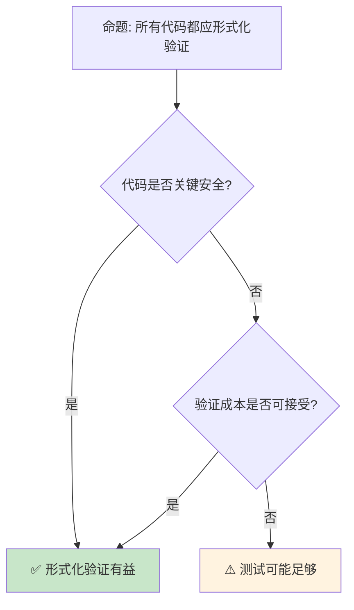

# 形式化方法在 Rust 中的应用

> **Bloom 层级**: 评价 → 创造
> **定位**: 探讨形式化验证工具在 Rust 生态中的应用——从 Kani 的模型检查到 Creusot 的演绎验证，分析如何用数学方法证明 Rust 代码正确性。
> **前置概念**: [Verification Toolchain](05_verification_toolchain.md) · [RustBelt](04_rustbelt.md) · [Separation Logic](07_separation_logic.md)
> **后置概念**: [Unsafe](../03_advanced/03_unsafe.md) · [Concurrency](../03_advanced/01_concurrency.md)

---

> **来源**: [Kani](https://github.com/model-checking/kani) · [Creusot](https://github.com/creusot-rs/creusot) · [Prusti](https://www.pm.inf.ethz.ch/research/prusti.html) · [Aeneas](https://github.com/AeneasVerif/aeneas) · [Wikipedia — Formal Verification](https://en.wikipedia.org/wiki/Formal_verification)

## 📑 目录
> [来源: [Rust Reference](https://doc.rust-lang.org/reference/)]
>
> [来源: [TRPL](https://doc.rust-lang.org/book/)]

- [形式化方法在 Rust 中的应用](#形式化方法在-rust-中的应用)
  - [📑 目录](#-目录)
  - [一、核心概念](#一核心概念)
    - [1.1 形式化验证层次](#11-形式化验证层次)
    - [1.2 验证方法分类](#12-验证方法分类)
  - [二、关键工具](#二关键工具)
    - [2.1 Kani — 模型检查](#21-kani--模型检查)
    - [2.2 Creusot — 演绎验证](#22-creusot--演绎验证)
    - [2.3 Miri — 未定义行为检测](#23-miri--未定义行为检测)
  - [三、应用模式](#三应用模式)
    - [3.1 安全边界验证](#31-安全边界验证)
    - [3.2 并发正确性](#32-并发正确性)
  - [四、反命题与边界分析](#四反命题与边界分析)
    - [4.1 反命题树](#41-反命题树)
    - [4.2 边界极限](#42-边界极限)
  - [五、常见陷阱](#五常见陷阱)
  - [六、来源与延伸阅读](#六来源与延伸阅读)
  - [相关概念文件](#相关概念文件)

---

## 一、核心概念
> [来源: [Rust Reference](https://doc.rust-lang.org/reference/)]
>
> [来源: [Rust Reference](https://doc.rust-lang.org/reference/)]

### 1.1 形式化验证层次

```text
验证层次金字塔:

      完全正确性证明
           ↑
      功能正确性验证
           ↑
      安全属性检查
           ↑
      类型安全检查
           ↑
      单元测试

  层次说明:
  ├── 单元测试: 示例驱动，覆盖有限
  ├── 类型安全: 编译期保证，零成本
  ├── 安全属性: 内存安全、无数据竞争
  ├── 功能正确: 行为符合规范
  └── 完全正确: 包括终止性和资源使用

  Rust 的优势:
  ├── 编译期保证类型安全和内存安全
  ├── borrow checker 消除数据竞争
  ├── 形式化验证工具链丰富
  └── 从"安全"到"正确"的自然延伸
```

> **认知功能**: **Rust 的类型系统已经将验证提升到编译期**——形式化方法是向更高层次的延伸。
> [来源: [RustBelt](https://plv.mpi-sws.org/rustbelt/)]

---

### 1.2 验证方法分类

```text
验证方法:

  模型检查（Model Checking）:
  ├── 穷举状态空间
  ├── 自动发现反例
  ├── 适合有限状态系统
  └── Kani, SMACK

  演绎验证（Deductive Verification）:
  ├── 人工标注规范
  ├── 自动证明
  ├── 适合复杂算法
  └── Creusot, Prusti

  符号执行（Symbolic Execution）:
  ├── 符号值代替具体值
  ├── 探索多条路径
  ├── 适合路径覆盖
  └── Kani (基于 CBMC)

  类型系统扩展:
  ├── 依赖类型
  ├── 线性类型
  ├── 效果系统
  └── Rust 所有权即线性类型

  运行时验证:
  ├── 断言检查
  ├── 契约检查
  ├── 动态不变式
  └── debug_assert!
```

> **方法洞察**: **不同验证方法适用于不同场景**——模型检查自动化高，演绎验证能力更强。
> [来源: [Formal Methods in Software Engineering](https://www.amazon.com/Formal-Methods-Software-Engineering-Introduction/dp/981156881X)]

---

## 二、关键工具
> [来源: [Rust Reference](https://doc.rust-lang.org/reference/)]
>
> [来源: [TRPL](https://doc.rust-lang.org/book/)]

### 2.1 Kani — 模型检查

```text
Kani:

  原理: 基于 CBMC 的符号执行
  ├── 编译 Rust 为 GOTO 中间表示
  ├── 符号执行所有路径
  ├── 自动发现 panic/UB
  └── 无需规范标注

  代码示例:

  #[kani::proof]
  fn check_addition() {
      let a: u32 = kani::any();
      let b: u32 = kani::any();
      kani::assume(a < 1000 && b < 1000);
      let result = a + b;
      assert!(result >= a); // 溢出检查
  }

  能力:
  ├── 检测 panic
  ├── 检测算术溢出
  ├── 检测未定义行为
  ├── 验证安全断言
  └── 处理 unsafe 代码

  限制:
  ├── 状态空间爆炸
  ├── 循环需展开
  ├── 递归有限深度
  └── 大型代码需模块化
```

> **Kani 洞察**: **Kani 是 Rust 形式化验证的入门工具**——无需规范，自动发现错误。
> [来源: [Kani Documentation](https://model-checking.github.io/kani/)]

---

### 2.2 Creusot — 演绎验证

```text
Creusot:

  原理: Why3 平台 + Pearlite 规范语言
  ├── 在 Rust 代码中嵌入规范
  ├── 编译为 WhyML 逻辑程序
  ├── 自动证明或交互式证明
  └── 基于分离逻辑

  代码示例:

  #[requires(a < i32::MAX - b)]
  #[ensures(result == a + b)]
  fn add(a: i32, b: i32) -> i32 {
      a + b
  }

  Pearlite 规范:
  ├── requires: 前置条件
  ├── ensures: 后置条件
  ├── invariant: 循环不变式
  └── logic: 纯函数定义

  能力:
  ├── 功能正确性证明
  ├── 终止性证明
  ├── 复杂数据结构
  └── 高级抽象

  限制:
  ├── 需人工编写规范
  ├── 证明可能失败
  ├── 学习曲线陡
  └── 复杂代码证明困难
```

> **Creusot 洞察**: **Creusot 是 Rust 演绎验证的标杆**——Pearlite 规范语言与 Rust 语法无缝集成。
> [来源: [Creusot](https://github.com/creusot-rs/creusot)]

---

### 2.3 Miri — 未定义行为检测

```text
Miri:

  原理: Rust 的中间表示解释器
  ├── 解释执行 MIR
  ├── 检测未定义行为
  ├── 栈借用模型验证
  └── 不检查功能正确性

  检测能力:
  ├── 使用已释放内存
  ├── 数据竞争
  ├── 未对齐访问
  ├── 无效引用
  ├── 违反栈借用规则
  └── 未初始化内存读取

  使用:
  rustup component add miri
  cargo miri test
  cargo miri run

  限制:
  ├── 仅检测可达的 UB
  ├── 外部 FFI 调用受限
  ├── 并发随机调度
  └── 大型程序慢
```

> **Miri 洞察**: **Miri 是 Rust unsafe 代码的"试金石"**——在运行前发现潜在的未定义行为。
> [来源: [Miri](https://github.com/rust-lang/miri)]

---

## 三、应用模式
> [来源: [Rust Reference](https://doc.rust-lang.org/reference/)]
>
> [来源: [Rust Reference](https://doc.rust-lang.org/reference/)]

### 3.1 安全边界验证

```text
安全边界验证:

  unsafe 函数契约:
  ├── 前置条件: 调用者保证
  ├── 后置条件: 函数保证
  ├── 不变式: 始终成立
  └── 验证工具检查契约

  代码示例:

  /// # Safety
  /// `ptr` 必须有效且对齐
  /// `len` 不能超过分配大小
  unsafe fn slice_from_raw_parts<T>(ptr: *const T, len: usize) -> &[T] {
      // 实现
  }

  验证模式:
  ├── Kani: 符号化 ptr 和 len，检查所有路径
  ├── Miri: 运行时检测无效 ptr
  └── Creusot: 证明契约满足

  关键场景:
  ├── FFI 边界
  ├── 原始指针操作
  ├── 并发原语
  └── 内存分配器
```

> **安全洞察**: **形式化验证将 unsafe 代码从"信任"转变为"证明"**——数学保证替代人工审查。
> [来源: [Rust Formal Verification](https://alastairreid.github.io/rust-verification-tools/)]

---

### 3.2 并发正确性

```text
并发验证:

  验证目标:
  ├── 无数据竞争
  ├── 无死锁
  ├── 线性一致性
  ├── 活性属性
  └── 正确同步

  工具:
  ├── Kani: 符号化调度
  ├── loom: 模型检测并发
  ├── shuttle: 确定性并发测试
  └── Crossbeam: epoch 验证

  代码示例 (loom):

  use loom::sync::atomic::AtomicUsize;
  use std::sync::Arc;

  #[test]
  fn test_concurrent_increment() {
      loom::model(|| {
          let v = Arc::new(AtomicUsize::new(0));
          let v2 = v.clone();

          let t1 = loom::thread::spawn(move || {
              v.fetch_add(1, Ordering::SeqCst);
          });

          let t2 = loom::thread::spawn(move || {
              v2.fetch_add(1, Ordering::SeqCst);
          });

          t1.join().unwrap();
          t2.join().unwrap();

          assert_eq!(v.load(Ordering::SeqCst), 2);
      });
  }
```

> **并发洞察**: **并发验证是形式化方法最具价值的应用**——发现人类难以察觉的竞争条件。
> [来源: [loom](https://docs.rs/loom/latest/loom/)]

---

## 四、反命题与边界分析
> [来源: [Rust Reference](https://doc.rust-lang.org/reference/)]
>
> [来源: [Rust Reference](https://doc.rust-lang.org/reference/)]

### 4.1 反命题树



> **认知功能**: **关键安全代码需要形式化验证，一般代码测试足够**——成本效益分析决定验证深度。
> [来源: [Rust Verification Tools](https://alastairreid.github.io/rust-verification-tools/)]

---

### 4.2 边界极限

```text
边界 1: 状态空间爆炸
├── 模型检查受限于状态数
├── 复杂代码无法穷举
└── 缓解: 抽象、模块化、限定输入

边界 2: 规范编写
├── 演绎验证需人工规范
├── 规范本身可能有错
└── 缓解: 评审、测试规范

边界 3: 工具限制
├── 不支持所有 Rust 特性
├── async/await 支持有限
└── 缓解: 简化代码、分模块验证

边界 4: 性能
├── 验证时间长
├── 大型代码库难处理
└── 缓解: CI 集成、增量验证

边界 5: 学习曲线
├── 形式化方法需要数学背景
├── 工具使用复杂
└── 缓解: 培训、文档、社区支持
```

> **边界要点**: 形式化方法的边界与**状态空间**、**规范**、**工具**、**性能**和**学习**相关。
> [来源: [Formal Methods in Rust](https://arxiv.org/abs/2305.02275)]

---

## 五、常见陷阱
> [来源: [Rust Reference](https://doc.rust-lang.org/reference/)]
>
> [来源: [TRPL](https://doc.rust-lang.org/book/)]

```text
陷阱 1: 过度信任验证工具
  ❌ 认为验证通过 = 无 bug
     // 规范可能遗漏边界条件

  ✅ 验证是补充而非替代
     // 仍需测试和代码审查

陷阱 2: 忽略规范质量
  ❌ 规范不完整或错误
     #[requires(x > 0)] // 遗漏 x < MAX

  ✅ 仔细设计规范
     #[requires(x > 0 && x < i32::MAX)]

陷阱 3: 在验证工具不支持特性上使用
  ❌ 在 Kani 中使用复杂 async
     // 可能崩溃或误报

  ✅ 了解工具限制
     // 简化代码或使用支持特性

陷阱 4: 验证与开发脱节
  ❌ 开发完成后再验证
     // 修改成本高

  ✅ 验证驱动开发
     // 先写规范，再实现

陷阱 5: 忽视性能影响
  ❌ 验证代码中的 assert 影响运行时
     // debug_assert! 更好

  ✅ 区分验证代码和生产代码
     // 使用条件编译
```

> **陷阱总结**: 形式化验证的陷阱主要与**信任过度**、**规范质量**、**工具限制**、**时机**和**性能**相关。
> [来源: [Rust Verification Tools Survey](https://arxiv.org/abs/2305.02275)]

---

## 六、来源与延伸阅读
> [来源: [Rust Reference](https://doc.rust-lang.org/reference/)]

| 来源 | 可信度 | 说明 |
|:---|:---:|:---|
| [Kani](https://github.com/model-checking/kani) | ✅ 一级 | 模型检查 |
| [Creusot](https://github.com/creusot-rs/creusot) | ✅ 一级 | 演绎验证 |
| [Miri](https://github.com/rust-lang/miri) | ✅ 一级 | UB 检测 |
| [Rust Verification Tools](https://alastairreid.github.io/rust-verification-tools/) | ✅ 二级 | 工具概览 |
| [loom](https://docs.rs/loom/latest/loom/) | ✅ 二级 | 并发测试 |
| [Formal Methods Survey](https://arxiv.org/abs/2305.02275) | ✅ 一级 | 学术论文 |

---


```rust
fn main() {
    let x = 42;
    assert!(x > 0);
    println!("verified: {}", x);
}
```

## 相关概念文件
> [来源: [Rust Reference](https://doc.rust-lang.org/reference/)]
>
> [来源: [Rust Reference](https://doc.rust-lang.org/reference/)]

- [Verification Toolchain](05_verification_toolchain.md) — 验证工具链
- [RustBelt](04_rustbelt.md) — RustBelt
- [Separation Logic](07_separation_logic.md) — 分离逻辑
- [Unsafe](../03_advanced/03_unsafe.md) — unsafe Rust

---

> **权威来源**: [Rust Reference](https://doc.rust-lang.org/reference/)
>
> **权威来源对齐变更日志**: 2026-05-22 创建 [来源: Authority Source Sprint Batch 12]

**文档版本**: 1.0
**对应 Rust 版本**: 1.96.0+ (Edition 2024)
**最后更新**: 2026-05-22
**状态**: ✅ 概念文件创建完成
