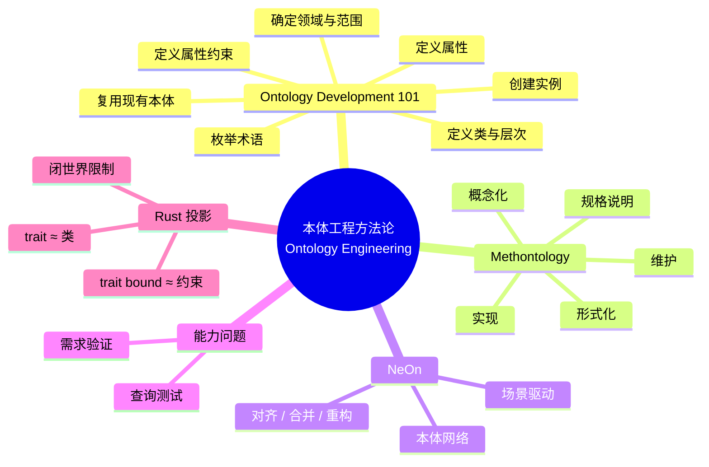

> **内容分级**: [专家级]

# 本体工程方法论（Ontology Engineering Methodologies）

> **EN**: Ontology Engineering Methodologies
> **Summary**: Survey of ontology engineering methodologies—Ontology Development 101, Methontology, and NeOn—with competency questions and a lightweight projection of classes and constraints onto Rust's type system.

> **Rust 版本**: 1.97.0+ (Edition 2024)
> **Bloom 层级**: L4-L5
> **权威来源**: 本文件为 `concept/` 权威页。
> **定位**: 从**方法论**角度比较三种经典本体工程方法，并给出把它们应用到 Rust 知识体系的具体步骤；避免把「本体」简单等同于「分类树」。
> **前置概念**: [语义工程目录 README](README.md) · [L4 形式化理论层](../README.md) · [类型系统](../../01_foundation/02_type_system/01_type_system.md) · [L3 类型擦除](../../03_advanced/06_low_level_patterns/03_type_erasure.md)
> **后置概念**: [描述逻辑与 OWL](02_description_logic_and_owl.md) · [知识图谱构建](03_knowledge_graph_construction.md) · [语义互操作](04_semantic_interoperability.md)

---

> **权威来源 / Provenance**: 本节本体工程方法论主要参考 Noy & McGuinness (2001) 的七步法、Methontology (Fernández-López et al., 1997) 与 NeOn (Suárez-Figueroa et al., 2012)；形式化基础参考 Baader et al. (2007) 的描述逻辑手册与 Hitzler, Krötzsch & Rudolph (2009)；知识图谱与互操作背景参考 Berners-Lee (2006) 的 Linked Data 原则、Hogan et al. (2021/2022) 的知识图谱综述、Wilkinson et al. (2016) 的 FAIR 原则，以及 W3C JSON-LD 1.1 与 RDF-star 规范。
>
> - **Noy & McGuinness (2001)** — *Ontology Development 101: A Guide to Creating Your First Ontology*. Stanford Knowledge Systems Laboratory Technical Report KSL-01-05. [https://doi.org/10.1007/978-3-540-92673-3_6](https://doi.org/10.1007/978-3-540-92673-3_6)
> - **Baader et al. (2007)** — *The Description Logic Handbook* (2nd ed.). Cambridge University Press. [https://doi.org/10.1017/9781139025355](https://doi.org/10.1017/9781139025355)
> - **Hitzler, Krötzsch & Rudolph (2009)** — *Foundations of Semantic Web Technologies*. CRC Press. [https://www.semantic-web-book.org/](https://www.semantic-web-book.org/)
> - **Berners-Lee (2006)** — *Linked Data*. W3C Design Issues. [https://www.w3.org/DesignIssues/LinkedData.html](https://www.w3.org/DesignIssues/LinkedData.html)
> - **Hogan et al. (2021/2022)** — *Knowledge Graphs*. ACM Computing Surveys, 54(4), 1–37. [https://doi.org/10.1145/3447772](https://doi.org/10.1145/3447772) · [arXiv:2003.02320](https://arxiv.org/abs/2003.02320)
> - **Wilkinson et al. (2016)** — *The FAIR Guiding Principles for Scientific Data Management and Stewardship*. Scientific Data 3, 160018. [https://doi.org/10.1038/sdata.2016.18](https://doi.org/10.1038/sdata.2016.18)
> - [W3C JSON-LD 1.1](https://www.w3.org/TR/json-ld11/)
> - [W3C RDF-star and SPARQL-star](https://www.w3.org/2021/12/rdf-star.html)
> - **Hogan et al. (2021/2022)** — ACM Computing Surveys. [https://dl.acm.org/doi/10.1145/3447772](https://dl.acm.org/doi/10.1145/3447772) · [Semantic Scholar arXiv:2003.02320](https://www.semanticscholar.org/paper/2003.02320)
> - **Fernández-López, Gómez-Pérez & Juristo (1997)** — *Methontology: From Ontological Art Towards Ontological Engineering*. [Semantic Scholar](https://www.semanticscholar.org/search?q=Methontology%3A%20From%20Ontological%20Art%20Towards%20Ontological%20Engineering&sort=relevance)
> - **Rust Reference — Traits** — Rust 类型系统中 trait、impl 与约束的权威定义。 [https://doc.rust-lang.org/reference/items/traits.html](https://doc.rust-lang.org/reference/items/traits.html)

---

## 📑 目录

- [本体工程方法论（Ontology Engineering Methodologies）](#本体工程方法论ontology-engineering-methodologies)
  - [📑 目录](#-目录)
  - [一、什么是本体？](#一什么是本体)
  - [二、Ontology Development 101 七步流程](#二ontology-development-101-七步流程)
  - [三、Methontology 生命周期](#三methontology-生命周期)
  - [四、NeOn 场景驱动方法](#四neon-场景驱动方法)
  - [五、能力问题（Competency Questions）](#五能力问题competency-questions)
  - [六、Rust 映射：类型系统作为轻量本体](#六rust-映射类型系统作为轻量本体)
  - [七、反命题与边界](#七反命题与边界)
    - [反命题："Rust trait 系统就是 OWL 本体语言"](#反命题rust-trait-系统就是-owl-本体语言)
    - [反命题："本体越大越好"](#反命题本体越大越好)
  - [八、嵌入式测验（Embedded Quiz）](#八嵌入式测验embedded-quiz)
  - [九、🧭 思维导图（Mindmap）](#九-思维导图mindmap)
  - [权威来源索引](#权威来源索引)
  - [补充国际权威来源（P1/P2 覆盖）](#补充国际权威来源p1p2-覆盖)

---

## 一、什么是本体？

在知识工程中，**本体（ontology）**是对某一领域**概念、关系、属性与约束**的显式、形式化、可共享的规范。它不是简单的词汇表，而是支持**推理**的语义结构：

| 本体构件 | 自然语言含义 | Rust 中的轻量投影 |
|:---|:---|:---|
| 类（Class） | 一组具有共同特征的个体 | `struct` / `enum` / `trait` |
| 属性（Property） | 类与类之间的二元关系 | trait 的关联类型、方法签名 |
| 实例（Instance） | 类的一个具体成员 | 类型的具体值 |
| 约束（Constraint） | 哪些关系/取值被允许 | `where` 子句、trait bounds |
| 推理（Reasoning） | 从显式知识推出隐式知识 | 类型推断、trait 求解 |

本体的核心价值在于**消歧与互操作**：当两个系统都使用同一个本体时，"所有权" 在不同文档、不同语言、不同工具之间具有相同的可机器验证含义。

---

## 二、Ontology Development 101 七步流程

Noy & McGuinness（2001）提出的七步法是学术界最广泛引用的入门级方法：

1. **确定领域与范围**（Determine the domain and scope）
   - 用能力问题明确边界：本体能回答什么问题？
2. **考虑复用现有本体**（Consider reusing existing ontologies）
   - 例如复用 schema.org、BFO、Dublin Core 等上层本体。
3. **枚举重要术语**（Enumerate important terms）
   - 列出所有关键概念，暂不做类/属性区分。
4. **定义类与类层次**（Define classes and the class hierarchy）
   - 选择 is-a 关系：subclass、part-of、or other?
5. **定义属性**（Define the properties of classes）
   - 区分对象属性（Object Property）与数据属性（Data Property）。
6. **定义属性的约束**（Define the facets of the properties）
   - 值域、基数、传递性、对称性等。
7. **创建实例**（Create instances）
   - 把具体个体填入本体。

在 Rust 知识体系中，第 3–6 步对应到 `concept/` 层每个文件的术语表、类层次、关系类型与 SHACL 形状定义。

---

## 三、Methontology 生命周期

Methontology（Fernández-López et al., 1997）强调**生命周期管理**，把本体开发分为五个交织阶段：

```text
1. 规格说明（Specification）
        ↓
2. 概念化（Conceptualization）
        ↓
3. 形式化（Formalization）
        ↓
4. 实现（Implementation）
        ↓
5. 维护（Maintenance）
```

每个阶段配套**评估活动**：

- **概念化阶段**：用表格、图表、能力问题验证概念模型。
- **形式化阶段**：选择 DL / OWL / FOL 等逻辑语言，并检查表达力与可判定性。
- **维护阶段**：版本化、变更追踪、影响分析。

对于 Rust 知识体系，`kg_ontology_v2.md` 处于形式化阶段，`kg_data_v3.json` 是阶段 4 的实现产物，而 `semantic_space.md` 与目录重编号流程则落在阶段 5 的维护活动。

---

## 四、NeOn 场景驱动方法

NeOn（Suárez-Figueroa et al., 2012）把本体工程从"瀑布式"转向**场景驱动、网络化协作**：

- **本体网络（Ontology Network）**：多个小型本体通过映射（mapping）组合，而非追求单一巨型本体。
- **场景（Scenarios）**：来自真实应用的问题驱动场景，用来裁剪方法步骤。
- **9 种情景（Situations）**：包括从零构建、复用、重构、对齐、合并、本地化等。

NeOn 对 Rust 知识体系的启示：

- `concept/01_foundation/`、`concept/02_intermediate/` 等目录可以视为**模块化本体网络**。
- 跨目录链接（例如所有权 → 生命周期 → 并发）就是**本体映射**。
- 当 Rust 版本更新时，不必重写整个本体，只需在相关模块中做**局部演化与对齐**。

---

## 五、能力问题（Competency Questions）

能力问题是检验本体是否足够表达应用需求的**测试用例**。示例：

| ID | 能力问题 | 对应本体查询 |
|:---|:---|:---|
| CQ-1 | 哪些 Rust 概念直接依赖于 `Ownership`？ | `?c ex:dependsOn ex:Ownership` |
| CQ-2 | `Send` 与 `Sync` 是否互斥？ | `ex:Send ex:mutexWith ex:Sync ?` |
| CQ-3 | `AffineLogic` 与 `Ownership` 是否等价？ | `ex:Ownership ex:equivalentTo ex:AffineLogic ?` |
| CQ-4 | 哪些 L4 形式化概念缺少反例小节？ | 对 `concept/04_formal/` 文件元数据的 SHACL 验证 |

好的能力问题应该**早于本体设计**出现，并在每个迭代中回归验证。

---

## 六、Rust 映射：类型系统作为轻量本体

Rust 的类型系统天然带有**闭世界、构造性、可判定**的约束语言，适合作为轻量级本体的实现层：

```rust
// 类：Resource 对应 OWL 中的类 ex:Resource
trait Resource {}

// 子类：OwnedResource ⊑ Resource
trait OwnedResource: Resource {}

// 属性约束：可被发送的资源必须同时是 OwnedResource + Send
fn transfer<T>(r: T) where T: OwnedResource + Send + 'static {
    // 概念上：把资源所有权跨线程转移
    std::mem::drop(r);
}

// 实例
struct FileHandle;
impl Resource for FileHandle {}
impl OwnedResource for FileHandle {}

fn main() {
    transfer(FileHandle);
}
```

| 本体构造 | Rust 表达 | 说明 |
|:---|:---|:---|
| 类 | `trait` / `struct` / `enum` | 类的内涵由实现集合决定 |
| 子类 | `trait Sub: Super` | 隐式 `Sub` 个体都是 `Super` |
| 属性 | trait 方法 / 关联类型 | 二元关系由类型签名编码 |
| 存在约束 | `T: Into<U>` | 存在 `into` 转换 |
| 全称约束 | `where T: Trait` | 对所有满足 `T` 的值生效 |

Rust 类型系统**不支持**开世界假设、否定即失败、析取约束，因此它只是**轻量本体**，不能替代 OWL / DL。

以下 `compile_fail` 示例展示 Rust 的闭世界 trait coherence 如何拒绝“同一概念的两个重叠实例化”——这与 OWL 开世界中允许存在未知实例形成对照：

```rust,compile_fail,E0119
// 概念：CanFly（会飞）
trait CanFly {}

// TBox： blanket impl —— 所有鸟类都会飞（简化假设）
impl<T: Bird> CanFly for T {}

pub trait Bird {}
struct Penguin;
impl Bird for Penguin {}

// ❌ 在 OWL 开世界中，Penguin 不飞可通过显式否定声明处理；
//    在 Rust 闭世界中，下面专门化 impl 与 blanket impl 冲突，触发 E0119。
impl CanFly for Penguin {} //~ ERROR E0119: conflicting implementations of trait `CanFly` for type `Penguin`

fn main() {}
```

> 边界结论：Rust 类型系统可以编码**受限的、可判定的**本体片段，但不能替代描述逻辑进行通用本体推理。

**SHACL 形状违规的 Rust 投影**：SHACL 按闭世界验证数据形状。把 `sh:minCount 1` 映射为 trait bound，缺失必需属性的"节点"会在编译期被判定为非法，对应 RDF 数据入图前的 shape violation。

```rust,compile_fail,E0277
// Shape：Person 必须具有 name（sh:minCount = 1）
trait HasName {
    fn name(&self) -> &str;
}

// 入图验证器：只接受满足 shape 的节点
fn publish_person<T: HasName>(_: T) {}

// 错误数据：缺少 name
struct Person {
    age: u32,
}

fn main() {
    publish_person(Person { age: 30 }); //~ ERROR E0277: the trait bound `Person: HasName` is not satisfied
}
```

> 边界结论：Rust 的类型约束提供的是**编译期、闭世界**的形状检查；它无法替代 SHACL 在 RDF 图上做的开放世界数据验证，但可作为工程侧的互补校验层。

---

## 七、反命题与边界

### 反命题："Rust trait 系统就是 OWL 本体语言"

**错误**。虽然两者都涉及"类"与"约束"，但根本差异如下：

| 特征 | OWL / DL | Rust trait 系统 |
|:---|:---|:---|
| 世界观 | 开世界（Open World） | 闭世界（Closed World） |
| 否定语义 | 否定即失败 / 经典否定 | 不能表达一般否定 |
| 析取 | 支持 `unionOf` | 不支持类型析取（除非 `enum`） |
| 推理复杂度 | 可判定，但复杂度从 PSpace 到 NExpTime | 类型推断是多项式时间可解 |
| 实例声明 | 显式 ABox 事实 | 值在运行时构造 |

**边界结论**：Rust 类型系统可以编码**受限的、可判定的**本体片段，但不能替代描述逻辑进行通用本体推理。

### 反命题："本体越大越好"

本体的可维护性与推理效率往往随规模指数下降。NeOn 的"本体网络"思想正是为了避免单一巨型本体。Rust 知识体系也采用**模块化目录**而非一个文件定义所有概念。

---

## 八、嵌入式测验（Embedded Quiz）

**1. Noy & McGuinness 的 Ontology Development 101 把本体开发分为几步？**

- A. 5 步
- B. 7 步
- C. 9 步
- D. 12 步

> **答案：B**。经典七步法：确定领域与范围、复用、枚举术语、定义类与层次、定义属性、定义属性约束、创建实例。

**2. Methontology 的五个生命周期阶段按正确顺序是？**

- A. 实现 → 形式化 → 概念化 → 规格说明 → 维护
- B. 规格说明 → 概念化 → 形式化 → 实现 → 维护
- C. 维护 → 实现 → 形式化 → 概念化 → 规格说明
- D. 概念化 → 规格说明 → 实现 → 形式化 → 维护

> **答案：B**。Methontology 强调规格说明 → 概念化 → 形式化 → 实现 → 维护的迭代生命周期。

**3. NeOn 方法最突出的特点是？**

- A. 强制使用单一巨型本体
- B. 场景驱动的本体网络构建
- C. 完全摒弃现有本体的复用
- D. 只关注本体的形式化证明

> **答案：B**。NeOn 以场景（scenarios）和网络化（ontology network）为核心，支持对齐、合并、重构等多种情境。

**4. 在本体工程中，"能力问题（competency questions）"的主要作用是？**

- A. 替代形式化推理
- B. 作为评估本体表达需求的测试用例
- C. 定义类的视觉样式
- D. 生成自然语言摘要

> **答案：B**。能力问题用来验证本体是否足以回答应用中的关键问题，是需求工程到本体设计的桥梁。

**5. 下列哪项是 Rust trait 系统与 OWL 的**本质差异**？**

- A. 两者都使用类层次
- B. Rust 是闭世界假设，OWL 通常采用开世界假设
- C. 两者都支持析取约束
- D. 两者都使用 URI 标识概念

> **答案：B**。Rust 类型系统按闭世界、构造性方式工作；OWL / DL 默认开世界语义，允许存在未被显式声明的个体。

---

## 九、🧭 思维导图（Mindmap）



> **认知功能**: 本 mindmap 把三种方法论与能力问题、Rust 投影并列，提示读者本体工程不仅是建模技术，更是需求驱动的迭代过程。

---

## 权威来源索引

- Noy, N. F. & McGuinness, D. L. (2001). *Ontology Development 101: A Guide to Creating Your First Ontology*. Stanford Knowledge Systems Laboratory Technical Report KSL-01-05.
- Fernández-López, M.; Gómez-Pérez, A. & Juristo, N. (1997). *Methontology: From Ontological Art Towards Ontological Engineering*. Proceedings of the 1997 AAAI Spring Symposium.
- Suárez-Figueroa, M. C. et al. (eds.) (2012). *NeOn Methodology for Building Ontology Networks*. Springer.
- [W3C OWL 2 Web Ontology Language](https://www.w3.org/TR/owl2-overview/)
- [Rust Reference — Traits](https://doc.rust-lang.org/reference/items/traits.html)

> **相关文件**: [目录 README](README.md) · [描述逻辑与 OWL](02_description_logic_and_owl.md) · [知识图谱构建](03_knowledge_graph_construction.md) · [语义互操作](04_semantic_interoperability.md)
>
> **文档版本**: 1.0 ｜ **最后更新**: 2026-07-28 ｜ **状态**: ✅ 新建（Rust 1.97 对齐）

## 补充国际权威来源（P1/P2 覆盖）

- [sophia on crates.io](https://crates.io/crates/sophia)
- [sophia docs](https://docs.rs/sophia/latest/sophia/)
