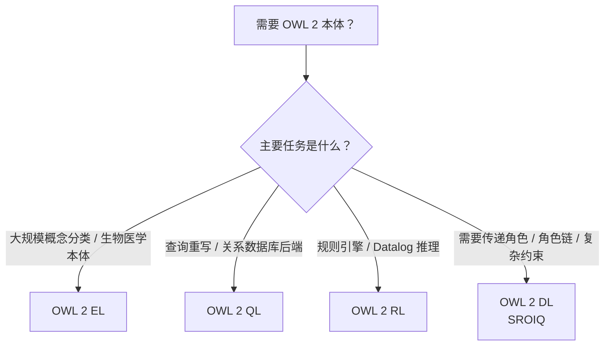
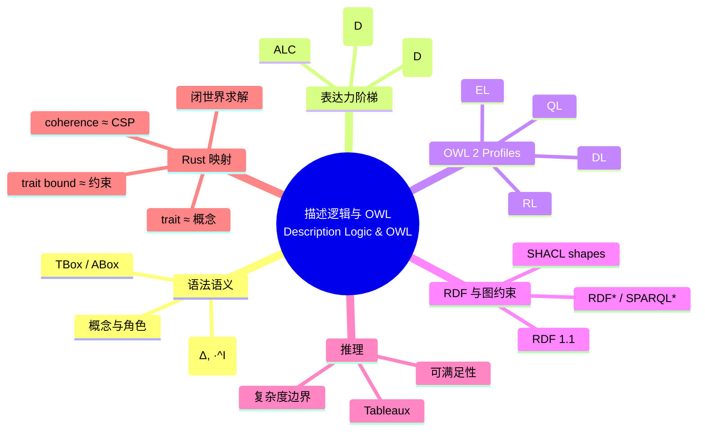

> **内容分级**: [专家级]

# 描述逻辑与 OWL（Description Logic and OWL）

> **EN**: Description Logic and OWL
> **Summary**: A survey of description logics from ALC to SROIQ, OWL 2 profiles (EL/QL/RL), tableaux reasoning, satisfiability, RDF 1.1 and RDF*/SPARQL* for property graphs, SHACL shape constraints, and a lightweight mapping to Rust trait coherence and type-level predicates.

> **Rust 版本**: 1.97.0+ (Edition 2024)
> **Bloom 层级**: L4-L5
> **权威来源**: 本文件为 `concept/` 权威页。
> **定位**: 从**形式逻辑**角度介绍描述逻辑家族与 OWL 2 profiles，帮助读者理解知识图谱本体的可判定推理边界，并把 trait 一致性求解类比为约束满足问题。
> **前置概念**: [语义工程目录 README](README.md) · [本体工程](01_ontology_engineering.md) · [类型系统](../../01_foundation/02_type_system/01_type_system.md) · [L3 内存模型](../../03_advanced/02_unsafe/06_memory_model.md)
> **后置概念**: [知识图谱构建](03_knowledge_graph_construction.md) · [语义互操作](04_semantic_interoperability.md)

---

> **权威来源 / Provenance**: 本文形式化基础参考 Baader et al. (2007) 的描述逻辑手册、Hitzler, Krötzsch & Rudolph (2009) 的语义网技术基础；本体工程方法参考 Noy & McGuinness (2001)；知识图谱与互操作背景参考 Berners-Lee (2006) 的 Linked Data 原则、Hogan et al. (2021/2022) 的知识图谱综述、Wilkinson et al. (2016) 的 FAIR 原则，以及 W3C JSON-LD 1.1 与 RDF-star 规范。
>
> - **Baader et al. (2007)** — *The Description Logic Handbook* (2nd ed.). Cambridge University Press. [https://doi.org/10.1017/9781139025355](https://doi.org/10.1017/9781139025355)
> - **Hitzler, Krötzsch & Rudolph (2009)** — *Foundations of Semantic Web Technologies*. CRC Press. [https://www.semantic-web-book.org/](https://www.semantic-web-book.org/)
> - **Noy & McGuinness (2001)** — *Ontology Development 101: A Guide to Creating Your First Ontology*. Stanford KSL Technical Report KSL-01-05. [https://doi.org/10.1007/978-3-540-92673-3_6](https://doi.org/10.1007/978-3-540-92673-3_6)
> - **Berners-Lee (2006)** — *Linked Data*. W3C Design Issues. [https://www.w3.org/DesignIssues/LinkedData.html](https://www.w3.org/DesignIssues/LinkedData.html)
> - **Hogan et al. (2021/2022)** — *Knowledge Graphs*. ACM Computing Surveys, 54(4), 1–37. [https://doi.org/10.1145/3447772](https://doi.org/10.1145/3447772)
> - **Wilkinson et al. (2016)** — *The FAIR Guiding Principles for Scientific Data Management and Stewardship*. Scientific Data 3, 160018. [https://doi.org/10.1038/sdata.2016.18](https://doi.org/10.1038/sdata.2016.18)
> - [W3C JSON-LD 1.1](https://www.w3.org/TR/json-ld11/)
> - [W3C RDF-star and SPARQL-star](https://www.w3.org/2021/12/rdf-star.html)

## 📑 目录

- [描述逻辑与 OWL（Description Logic and OWL）](#描述逻辑与-owldescription-logic-and-owl)
  - [📑 目录](#-目录)
  - [一、描述逻辑语法与语义](#一描述逻辑语法与语义)
  - [二、表达力阶梯：ALC → SHOIN → SROIQ](#二表达力阶梯alc--shoin--sroiq)
  - [三、OWL 2 profiles：EL / QL / RL](#三owl-2-profilesel--ql--rl)
    - [选型决策树](#选型决策树)
  - [四、RDF 1.1 与属性图扩展（RDF\*/ SPARQL\*）](#四rdf-11-与属性图扩展rdf-sparql)
  - [五、SHACL：RDF 图的形状约束](#五shaclrdf-图的形状约束)
    - [与 Rust 类型系统 / derive 宏的类比](#与-rust-类型系统--derive-宏的类比)
  - [六、Tableaux 推理](#六tableaux-推理)
  - [七、可满足性与复杂度](#七可满足性与复杂度)
  - [八、Rust 映射：trait 一致性作为约束满足](#八rust-映射trait-一致性作为约束满足)
    - [类型级谓词示例](#类型级谓词示例)
    - [trait coherence 作为约束满足问题](#trait-coherence-作为约束满足问题)
    - [TBox / ABox 对应关系](#tbox--abox-对应关系)
  - [九、反命题与边界](#九反命题与边界)
    - [反命题："OWL reasoner 可以用来检查 Rust 程序的类型安全"](#反命题owl-reasoner-可以用来检查-rust-程序的类型安全)
    - [反命题："选择 OWL 2 Full 总是最好的"](#反命题选择-owl-2-full-总是最好的)
    - [反命题："我可以为同一类型写两个重叠的 trait impl"](#反命题我可以为同一类型写两个重叠的-trait-impl)
  - [十、嵌入式测验（Embedded Quiz）](#十嵌入式测验embedded-quiz)
  - [十一、🧭 思维导图（Mindmap）](#十一-思维导图mindmap)
  - [权威来源索引](#权威来源索引)

---

## 一、描述逻辑语法与语义

**描述逻辑（Description Logic, DL）**是一族面向知识表示的 decidable 逻辑（Baader et al., 2007; Hitzler, Krötzsch & Rudolph, 2009）。一个 DL 知识库通常由两部分组成：

- **TBox（Terminological Box）**：概念定义与公理，例如 `Human ⊑ Animal ⊓ Mortal`。
- **ABox（Assertional Box）**：个体事实，例如 `Socrates : Human`。

基本语法构件：

| 构造子 | 符号 | 含义 |
|:---|:---|:---|
| 合取 | `C ⊓ D` | 同时满足 C 与 D |
| 析取 | `C ⊔ D` | 满足 C 或 D |
| 否定 | `¬C` | 不满足 C |
| 存在限制 | `∃r.C` | 存在 r 关系指向 C 个体 |
| 全称限制 | `∀r.C` | 所有 r 关系指向的个体都是 C |
| 角色包含 | `r ⊑ s` | 关系 r 是 s 的子关系 |

DL 的语义基于**解释** `I = (Δ^I, ·^I)`：论域与解释函数。概念被解释为论域的子集，角色被解释为二元关系。

---

## 二、表达力阶梯：ALC → SHOIN → SROIQ

描述逻辑家族按表达力递增命名：

| 逻辑 | 名称含义 | 关键能力 |
|:---|:---|:---|
| **ALC** | Attributive Language with Complement | 概念合取、析取、否定、量词限制 |
| **SHOIN(D)** | 在 ALC 上增加**S**（角色传递）、**H**（角色层次）、**O**（nominal/单例类）、**I**（逆角色）、**N**（基数限制）、**D**（数据类型） | 对应 OWL DL 的核心 |
| **SROIQ(D)** | 增加**R**（角色链）、更复杂的角色公理、自反性、互不相交角色等 | 对应 OWL 2 DL |

表达力每增加一步，推理复杂度通常也上升：

```text
ALC          概念可满足性 PSpace-完全
SHOIN(D)     概念可满足性 NExpTime-完全
SROIQ(D)     概念可满足性 2NExpTime-完全
```

在 Rust 知识体系本体 `kg_ontology_v2.md` 中，`ex:dependsOn` 被声明为传递关系，相当于 **S** 特征；`ex:refines` 的逆属性 `ex:refinedBy` 相当于 **I**；这些特征使项目本体落在 SHOIN 片段附近。

完整入门与教学示例可参考 W3C OWL 2 Primer：

- [W3C OWL 2 Primer](https://www.w3.org/TR/owl2-primer/)

---

## 三、OWL 2 profiles：EL / QL / RL

OWL 2 定义了三个可判定**片段（profiles）**，在表达力与推理效率之间做不同取舍：

| Profile | 目标 | 典型复杂度 | 适用场景 |
|:---|:---|:---|:---|
| **OWL 2 EL** | 以概念层次和属性链为主 | PTime | 大型生物医学本体（SNOMED CT） |
| **OWL 2 QL** | 面向基于数据库的查询重写 | AC0 数据复杂度 | 把 SPARQL 查询重写为 SQL |
| **OWL 2 RL** | 面向规则引擎 | PTime | 基于 Datalog 的规则推理 |

### 选型决策树



| 选择 | 核心取舍 | 推荐场景 |
|:---|:---|:---|
| **EL** | 牺牲部分表达力，换取多项式时间概念分类 | 百万级概念的本体层次推理 |
| **QL** | 保证数据查询复杂度在 AC0，便于映射到 RDBMS | 已有关系数据库，希望通过本体做 SPARQL 入口 |
| **RL** | 与 Datalog / 规则引擎语义对齐 | 流式推理、事件处理、可解释的业务规则 |
| **DL / Full** | 表达力最强，但 OWL 2 Full 不可判定 | 需要角色链、互斥角色、复杂数据类型约束 |

项目知识图谱 `kg_data_v3.json` 若以**查询与验证**为主，可映射到 QL/RL 风格；若以**概念推理**为主，则需 EL/SHOIN 能力。

---

## 四、RDF 1.1 与属性图扩展（RDF*/ SPARQL*）

RDF 1.1 将数据建模为 **(subject, predicate, object)** 三元组集合。RDF 图谱没有内置的"属性图"概念，但可以通过**具体化（reification）**或 **RDF/*** 扩展来表达带元数据的边。

- [W3C RDF 1.1 Concepts and Abstract Syntax](https://www.w3.org/TR/rdf11-concepts/)
- **RDF/***：允许三元组本身作为另一个三元组的主语或宾语，例如 `<<:s :p :o>> :probability 0.9`，从而直接在图谱边上附加属性。其查询扩展 **SPARQL/*** 支持嵌套三元组模式。
- 在属性图（Labeled Property Graph, LPG）与 RDF 之间，RDF* 提供了一种可互操作的折中：既保留 RDF 的开放世界语义，又能表达"边属性"这类知识图谱常见需求。

> **工程提示**：如果图谱需要频繁的"边上的时间戳/置信度/来源"，而底层存储又要求符合 RDF 标准，RDF* 是比传统 reification 更紧凑的建模方式。

---

## 五、SHACL：RDF 图的形状约束

SHACL（Shapes Constraint Language）用于声明 RDF 图必须满足的结构约束。

- [W3C SHACL — Shapes Constraint Language](https://www.w3.org/TR/shacl/)
- SHACL **shape** 定义了节点必须具有的属性、属性类型、基数、取值范围以及与其他节点的关系。Shape 本身也是 RDF，可以用 Turtle 编写。
- SHACL 与 OWL 互补：OWL 描述"应当为真"的蕴涵关系；SHACL 描述"必须为真"的数据形状。OWL 推理回答"可以推出什么"，SHACL 验证回答"数据是否符合模式"。

### 与 Rust 类型系统 / derive 宏的类比

| SHACL 概念 | Rust 对应 | 说明 |
|:---|:---|:---|
| `sh:NodeShape` | `struct` / `enum` 类型定义 | 声明一类节点的结构模板 |
| `sh:property` + `sh:datatype` | 字段类型（`name: String`） | 声明属性及其数据类型 |
| `sh:minCount 1` / `sh:maxCount 1` | 必填 / 单值约束 | 类似 JSON Schema 的 `required` |
| `sh:closed true` | 私有字段 / 穷尽匹配 | 禁止未在 shape 中声明的属性 |
| `sh:ValidationReport` | 编译器类型错误报告 | 指出哪些节点违反了哪些约束 |
| `sh:sparql` / `sh:js` | 自定义 trait bound / where 子句 | 表达超出基本类型的复杂约束 |

```turtle
ex:PersonShape
    a sh:NodeShape ;
    sh:targetClass ex:Person ;
    sh:property [
        sh:path ex:name ;
        sh:datatype xsd:string ;
        sh:minCount 1 ;
        sh:maxCount 1 ;
    ] ;
    sh:property [
        sh:path ex:age ;
        sh:datatype xsd:integer ;
        sh:minInclusive 0 ;
    ] ;
    sh:closed true .
```

这段 shape 类似于 Rust 中的：

```rust
struct Person {
    name: String,     // minCount=1, maxCount=1, datatype=string
    age: u32,         // datatype=integer, minInclusive=0
}
```

这个 `compile_fail` 示例把 SHACL 的闭世界 `sh:minCount` 约束映射为 Rust trait bound；缺失必需字段的"节点"在编译期即被判定为 shape violation（E0277），对应 RDF 数据入图前的验证失败。

```rust,compile_fail,E0277
// SHACL shape：Person 必须具有 name（sh:minCount = 1）
trait HasName {
    fn name(&self) -> &str;
}

// 验证入口：只接受满足 shape 的节点
fn validate_person<T: HasName>(_: T) {}

// 非法实例：缺少 name
struct Person {
    age: u32,
}

fn main() {
    validate_person(Person { age: 30 }); //~ ERROR E0277: the trait bound `Person: HasName` is not satisfied
}
```

SHACL 验证是**可判定的**，通常在多项式时间内完成；它补充了 OWL 推理，用于在数据入图前做结构校验（W3C SHACL）。

---

## 六、Tableaux 推理

**Tableaux（语义表）**是 DL 推理最经典的方法之一。其核心思想是：为了证明概念 `C` 可满足，尝试构造一个模型 `I` 使得 `C^I ≠ ∅`；如果构造失败，则 `C` 不可满足。

算法步骤：

1. 把 `C` 转换为**否定范式（NNF）**。
2. 对 `⊓`、`⊔`、`∃`、`∀` 等构造子应用展开规则。
3. 检测冲突（clash），例如同一个个体同时属于 `A` 与 `¬A`。
4. 若所有分支都 clash，则原概念不可满足；若存在完整无冲突分支，则可满足。

Tableaux 解释了为什么 OWL DL 推理在表达力强时会变得昂贵：复杂的嵌套量词与角色链会导致模型指数级膨胀。

---

## 七、可满足性与复杂度

描述逻辑的可判定性是其被用于 Web 本体的关键。主要推理任务：

| 任务 | 含义 | 复杂度（ALC / SHOIN / SROIQ） |
|:---|:---|:---|
| 概念可满足性 | 概念是否可为非空 | PSpace / NExpTime / 2NExpTime |
| 概念包含 | `C ⊑ D` 是否成立 | 同上（对偶） |
| 实例检查 | `a : C` 是否被蕴涵 | 数据复杂度通常更低 |
| 一致性 | 知识库是否存在模型 | 同概念可满足性 |

**工程启示**：

- 如果应用场景只需要**分类层次**推理，优先选择 OWL 2 EL。
- 如果需要**复杂约束**（传递闭包、逆角色、角色链），则必须承担更高推理成本或采用近似推理。

---

## 八、Rust 映射：trait 一致性作为约束满足

Rust 的 trait 求解器可以看作一种**闭世界、构造性**的约束满足过程。以下用标准 Rust 说明：

```rust
// 概念 C：Drawable
trait Drawable {}

// 概念 D：Clickable
trait Clickable {}

// 概念 C ⊓ D：同时是 Drawable 与 Clickable
trait Interactive: Drawable + Clickable {}

// 全称限制 ∀hasPart.Clickable：一个容器的所有部件都必须可点击
trait Container {
    type Part: Clickable;
}

// 实例：Button 是 Drawable + Clickable
struct Button;
impl Drawable for Button {}
impl Clickable for Button {}

fn draw_all<T: Drawable>(_: T) {}

fn main() {
    draw_all(Button);
}
```

当编译器求解 `Button: Drawable` 时，它在 trait 实现表里查找匹配项——这是一种**闭世界、表驱动的约束满足**，与 DL reasoner 的开世界模型构造形成对照。

### 类型级谓词示例

Rust 还可以用泛型与 trait 编码**类型级谓词**：

```rust
trait IsSend<T> {}
impl<T: Send> IsSend<T> for () {}

// 类型级断言：仅当 T: Send 时，Proof<T> 可被构造
struct Proof<T>(std::marker::PhantomData<T>);
impl<T: Send> Proof<T> {
    fn new() -> Self { Self(std::marker::PhantomData) }
}

fn main() {
    let _p: Proof<String> = Proof::new(); // String: Send
}
```

这相当于在类型层面声明了一个一元谓词 `Send(T)`，并通过 trait impl 提供构造规则。

### trait coherence 作为约束满足问题

Rust 的 **trait coherence** 规则确保：对任意具体类型和 trait，至多只有一组 applicable impl（Hitzler, Krötzsch & Rudolph, 2009; Baader et al., 2007）。把它抽象为**约束满足问题（CSP）**:

- **变量**：每个候选 `impl Trait for Type`；
- **论域**：{applicable, not-applicable}；
- **硬约束**：对任意具体类型 `T`，满足 `Trait(T)` 的 impl 集合大小 ≤ 1（orphan 规则与覆盖规则进一步约束）。

编译器求解这个 CSP 时采用**闭世界语义**：未显式实现即不可满足；若存在多个冲突 impl，则报告 `E0119`。

这与 DL reasoner 形成有趣对照：

| 维度 | DL 推理 | Rust trait coherence |
|:---|:---|:---|
| 世界观 | 开世界 | 闭世界 |
| 冲突处理 | 知识库不一致，需人工修正 | 编译错误 `E0119` |
| 目标 | 寻找模型 / 推导蕴涵 | 确定唯一的单态化方案 |
| 可判定性 | 依赖片段（EL/QL/RL/DL） | 由语言设计保证，编译器有限步骤内完成 |

### TBox / ABox 对应关系

| DL 组件 | Rust 对应 | 示例 |
|:---|:---|:---|
| TBox | trait 定义 + blanket / generic impl | `trait Drawable; impl<T: Clone> Drawable for T` |
| ABox | 具体 `impl Trait for Type` 事实 | `impl Drawable for Button {}` |
| 概念包含 `C ⊑ D` | trait 继承 `trait D: C {}` | `trait Animal {} trait Dog: Animal {}` |
| 实例检查 `a : C` | 类型检查 `Button: Drawable` | 编译期 bound 满足检查 |

`impl Trait for Type` 就是 ABox 断言：它声明"类型 `Type` 是概念 `Trait` 的实例"。而 trait 定义本身（含 super-trait、关联类型、where 子句）构成 TBox。

---

## 九、反命题与边界

### 反命题："OWL reasoner 可以用来检查 Rust 程序的类型安全"

**错误**。两者求解的问题域不同：

| 维度 | OWL reasoner | Rust trait 求解器 |
|:---|:---|:---|
| 输入 | TBox + ABox | crate 的 trait 实现与 where 子句 |
| 世界观 | 开世界 | 闭世界 |
| 目标 | 概念可满足性、包含、实例 | 类型良构性、trait bound 可满足 |
| 失败含义 | 知识库不一致 | 编译错误 |
| 输出 | 模型 / 蕴涵集合 | 单态化方案或错误 |

Rust 类型安全由**借用检查器 + trait 求解器 + 操作语义**共同保证，不能化约为 DL 可满足性。

### 反命题："选择 OWL 2 Full 总是最好的"

OWL 2 Full 表达力最高，但**不可判定**。工程上必须在表达力与可计算性之间取舍；否则推理器可能不终止或无法给出可靠答案。

### 反命题："我可以为同一类型写两个重叠的 trait impl"

**错误**。以下代码试图同时保留一个 blanket impl 和一个专门化 impl，导致冲突：

```rust,compile_fail,E0119
trait Drawable {}

// TBox：所有类型都满足 Drawable
impl<T> Drawable for T {}

// ABox：试图再次声明 u32 满足 Drawable
impl Drawable for u32 {} //~ ERROR E0119

fn main() {}
```

编译器报错 `E0119`（conflicting implementations of trait `Drawable` for type `u32`），因为 `u32` 已被 blanket impl 覆盖。这与 DL 中 ABox 断言不能违反 TBox 蕴涵形成对照：Rust 用 coherence 规则保证"每个类型对每个 trait 至多只有一个 impl 路径"。

---

## 十、嵌入式测验（Embedded Quiz）

**1. 描述逻辑中，TBox 与 ABox 分别表示什么？**

- A. TBox 存储个体事实，ABox 存储概念定义
- B. TBox 存储术语/概念定义，ABox 存储个体事实
- C. TBox 存储查询，ABox 存储结果
- D. TBox 与 ABox 没有区别

> **答案：B**。TBox（Terminological Box）包含概念层次与属性公理；ABox（Assertional Box）包含具体个体声明。

**2. OWL 2 的三个 profile 中，最适合基于关系数据库做查询重写的是？**

- A. OWL 2 EL
- B. OWL 2 QL
- C. OWL 2 RL
- D. OWL 2 Full

> **答案：B**。QL 的设计目标就是保证 SPARQL 查询可以重写为 SQL，从而直接利用关系数据库。

**3. SROIQ(D) 相比 SHOIN(D) 主要增加了哪类能力？**

- A. 删除所有角色能力
- B. 角色链（role chains）与更复杂的角色公理
- C. 完全放弃名词（nominals）
- D. 只支持数据类型

> **答案：B**。SROIQ 在 SHOIN 基础上引入角色链（R）和更丰富的角色公理，是 OWL 2 DL 的基础。

**4. Tableaux 算法中，若所有分支都出现 clash，说明什么？**

- A. 原概念一定可满足
- B. 原概念不可满足
- C. 算法需要无限运行
- D. 知识库是一致的

> **答案：B**。Tableaux 通过构造模型验证可满足性；所有分支冲突意味着不存在无冲突模型，即概念不可满足。

**5. Rust trait 求解器与 DL reasoner 的根本世界观差异是？**

- A. Rust 是开世界，DL 是闭世界
- B. Rust 是闭世界，DL 通常采用开世界
- C. 两者都是闭世界
- D. 两者都不处理约束

> **答案：B**。Rust 按闭世界编译：未实现的 trait 即不可用；DL reasoner 默认开世界，未显式声明的事实不一定为假。

---

## 十一、🧭 思维导图（Mindmap）



> **认知功能**: 本 mindmap 把 DL 的语法、表达力阶梯、OWL profiles、RDF/SHACL 与推理方法组织成从"能说什么"到"能算什么"的认知路径，并提示 Rust trait 系统的闭世界边界。

---

## 权威来源索引

- Baader, F.; Calvanese, D.; McGuinness, D.; Nardi, D. & Patel-Schneider, P. (eds.) (2007). [*The Description Logic Handbook*](https://dl.acm.org/doi/book/10.5555/1065378). Cambridge University Press, 2nd ed.
- [W3C OWL 2 Web Ontology Language — Document Overview](https://www.w3.org/TR/owl2-overview/)
- [W3C OWL 2 Primer](https://www.w3.org/TR/owl2-primer/)
- [W3C OWL 2 Profiles](https://www.w3.org/TR/owl2-profiles/)
- [W3C RDF 1.1 Concepts and Abstract Syntax](https://www.w3.org/TR/rdf11-concepts/)
- [W3C SHACL — Shapes Constraint Language](https://www.w3.org/TR/shacl/)
- Hartig, O. & Thompson, B. (2014). Foundations of an Alternative Approach to Reification in RDF. arXiv:1406.3399. <https://arxiv.org/abs/1406.3399>
- Hitzler, P.; Krötzsch, M. & Rudolph, S. (2009). *Foundations of Semantic Web Technologies*. CRC Press. <https://www.semantic-web-book.org/>
- Noy, N. F. & McGuinness, D. L. (2001). *Ontology Development 101: A Guide to Creating Your First Ontology*. Stanford KSL Technical Report KSL-01-05.
- Berners-Lee, T. (2006). *Linked Data*. W3C Design Issues. <https://www.w3.org/DesignIssues/LinkedData.html>
- Hogan, A. et al. (2021/2022). *Knowledge Graphs*. ACM Computing Surveys, 54(4), 1–37. <https://doi.org/10.1145/3447772>
- Wilkinson, M. D. et al. (2016). *The FAIR Guiding Principles for Scientific Data Management and Stewardship*. Scientific Data 3, 160018. <https://doi.org/10.1038/sdata.2016.18>
- [W3C JSON-LD 1.1](https://www.w3.org/TR/json-ld11/)
- [W3C RDF-star and SPARQL-star](https://www.w3.org/2021/12/rdf-star.html)
- [Rust Reference — Trait and Lifetime Bounds](https://doc.rust-lang.org/reference/trait-bounds.html)

> **相关文件**: [目录 README](README.md) · [本体工程](01_ontology_engineering.md) · [知识图谱构建](03_knowledge_graph_construction.md) · [语义互操作](04_semantic_interoperability.md)
>
> **文档版本**: 1.2 ｜ **最后更新**: 2026-07-30 ｜ **状态**: ✅ Rust 1.97 对齐
