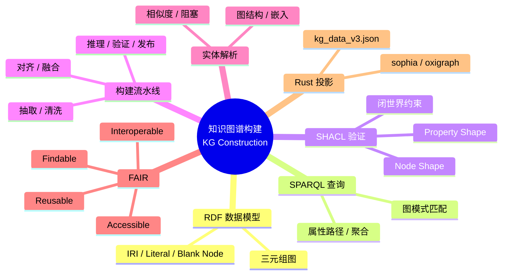

> **内容分级**: [专家级]

# 知识图谱构建（Knowledge Graph Construction）

> **EN**: Knowledge Graph Construction
> **Summary**: RDF data model, SPARQL query semantics, SHACL validation, KG construction pipelines, entity resolution, FAIR principles, and Rust projections using the project KG v3 and semantic-web crates.

> **Rust 版本**: 1.97.0+ (Edition 2024)
> **Bloom 层级**: L4-L5
> **权威来源**: 本文件为 `concept/` 权威页。
> **定位**: 从**工程实现**角度介绍如何把非结构化或多源数据转化为可查询、可验证的知识图谱，并把项目 KG v3 作为 Rust 知识体系持续演进的实例。
> **前置概念**: [语义工程目录 README](README.md) · [本体工程](01_ontology_engineering.md) · [描述逻辑与 OWL](02_description_logic_and_owl.md) · [L3 流处理语义](../../03_advanced/06_low_level_patterns/05_stream_processing_semantics.md)
> **后置概念**: [语义互操作](04_semantic_interoperability.md) · [知识图谱本体 v2](../../00_meta/knowledge_topology/kg_ontology_v2.md)
> **来源**: [W3C RDF 1.1 Concepts](https://www.w3.org/TR/rdf11-concepts/) · [W3C RDF 1.2](https://www.w3.org/TR/rdf12-concepts/) · [W3C SPARQL 1.1](https://www.w3.org/TR/sparql11-overview/) · [W3C SHACL](https://www.w3.org/TR/shacl/) · [Knowledge Graphs survey (arXiv)](https://arxiv.org/abs/2003.02320) · [KG Embeddings Survey (Wang et al., 2017)](https://arxiv.org/abs/1709.07604) · [Rust RFCs](https://github.com/rust-lang/rfcs) · [Oxigraph (Rust RDF store)](https://docs.rs/oxigraph/latest/oxigraph/)

---

> **权威来源 / Provenance**: 本文工程与数据模型基础参考 Berners-Lee (2006) 的 Linked Data 原则、Hogan et al. (2021/2022) 的知识图谱综述、Wilkinson et al. (2016) 的 FAIR 原则，以及 W3C RDF 1.1/1.2、SPARQL 1.1、SHACL、JSON-LD 1.1 与 RDF-star 规范；形式化基础参考 Baader et al. (2007) 与 Hitzler, Krötzsch & Rudolph (2009)；本体工程方法参考 Noy & McGuinness (2001)。
>
> - **Berners-Lee (2006)** — *Linked Data*. W3C Design Issues. [https://www.w3.org/DesignIssues/LinkedData.html](https://www.w3.org/DesignIssues/LinkedData.html)
> - **Hogan et al. (2021/2022)** — *Knowledge Graphs*. ACM Computing Surveys, 54(4), 1–37. [https://doi.org/10.1145/3447772](https://doi.org/10.1145/3447772)
> - **Wilkinson et al. (2016)** — *The FAIR Guiding Principles for Scientific Data Management and Stewardship*. Scientific Data 3, 160018. [https://doi.org/10.1038/sdata.2016.18](https://doi.org/10.1038/sdata.2016.18)
> - **Baader et al. (2007)** — *The Description Logic Handbook* (2nd ed.). Cambridge University Press. [https://doi.org/10.1017/9781139025355](https://doi.org/10.1017/9781139025355)
> - **Hitzler, Krötzsch & Rudolph (2009)** — *Foundations of Semantic Web Technologies*. CRC Press. [https://www.semantic-web-book.org/](https://www.semantic-web-book.org/)
> - **Noy & McGuinness (2001)** — *Ontology Development 101: A Guide to Creating Your First Ontology*. Stanford KSL Technical Report KSL-01-05. [https://doi.org/10.1007/978-3-540-92673-3_6](https://doi.org/10.1007/978-3-540-92673-3_6)
> - [W3C RDF 1.2 Concepts and Abstract Syntax](https://www.w3.org/TR/rdf12-concepts/)
> - [W3C SPARQL 1.1 Overview](https://www.w3.org/TR/sparql11-overview/)
> - [W3C SHACL — Shapes Constraint Language](https://www.w3.org/TR/shacl/)
> - [W3C JSON-LD 1.1](https://www.w3.org/TR/json-ld11/)
> - [W3C RDF-star and SPARQL-star](https://www.w3.org/2021/12/rdf-star.html)

## 📑 目录

- [知识图谱构建（Knowledge Graph Construction）](#知识图谱构建knowledge-graph-construction)
  - [📑 目录](#-目录)
  - [一、RDF 数据模型](#一rdf-数据模型)
  - [二、SPARQL 查询语义](#二sparql-查询语义)
  - [三、SHACL 验证](#三shacl-验证)
  - [四、KG 构建流水线](#四kg-构建流水线)
  - [五、实体解析（Entity Resolution）](#五实体解析entity-resolution)
  - [六、FAIR 原则](#六fair-原则)
  - [七、Rust 映射：项目 KG v3 与生态 crate](#七rust-映射项目-kg-v3-与生态-crate)
    - [项目 KG v3](#项目-kg-v3)
    - [用 Rust 表达最小三元组](#用-rust-表达最小三元组)
    - [生态 crate（概念示意）](#生态-crate概念示意)
  - [八、反命题与边界](#八反命题与边界)
    - [反命题："任何 JSON 文件都是知识图谱"](#反命题任何-json-文件都是知识图谱)
    - [反命题："SHACL 与 OWL 约束是同一件事"](#反命题shacl-与-owl-约束是同一件事)
  - [九、嵌入式测验（Embedded Quiz）](#九嵌入式测验embedded-quiz)
  - [十、🧭 思维导图（Mindmap）](#十-思维导图mindmap)
  - [权威来源索引](#权威来源索引)

---

## 一、RDF 数据模型

**资源描述框架（Resource Description Framework, RDF）**用**三元组**（subject, predicate, object）表达断言（Berners-Lee, 2006; W3C RDF 1.1/1.2）：

```text
<ex:Ownership> <ex:dependsOn> <ex:TypeSystem> .
<ex:Ownership> <skos:prefLabel> "所有权"@zh .
```

RDF 1.2 支持三种核心抽象：

| 元素 | 说明 |
|:---|:---|
| **IRI** | 全局唯一标识符，如 `https://rust-lang-knowledge-graph.org/Ownership` |
| **字面量（Literal）** | 带数据类型或语言标签的值 |
| **空白节点（Blank node）** | 局部匿名资源，用于存在性断言但不给出全局名 |

RDF 的图模型天然支持**合并**：两个 RDF 数据集可以简单地做集合合并，而不需要统一模式。

---

## 二、SPARQL 查询语义

**SPARQL** 是 RDF 的标准查询语言，语法类似 SQL，但操作的是图模式匹配：

```sparql
PREFIX ex: <https://rust-lang-knowledge-graph.org/>
PREFIX skos: <http://www.w3.org/2004/02/skos/core#>

SELECT ?label ?target
WHERE {
  ?concept ex:dependsOn ex:Ownership ;
           skos:prefLabel ?label .
  FILTER (lang(?label) = "zh")
}
```

SPARQL 查询的核心是**基本图模式（BGP）匹配**：把查询中的三元组模式与 RDF 图进行变量替换匹配。SPARQL 1.1 还扩展了属性路径、聚合、子查询、联邦查询等能力。

项目 KG v3 的维护者可使用 SPARQL 发现"哪些中文概念直接依赖 `Ownership`"，从而验证概念先修顺序。

---

## 三、SHACL 验证

**SHACL（Shapes Constraint Language）**用于验证 RDF 图是否满足给定的数据形状（W3C SHACL）。与 OWL 不同，SHACL 是**闭世界验证**：若某个节点缺少必需属性，即判定为非法。

典型 SHACL 约束：

```turtle
@prefix sh: <http://www.w3.org/ns/shacl#> .
@prefix ex: <https://rust-lang-knowledge-graph.org/> .

ex:ConceptShape
    a sh:NodeShape ;
    sh:targetClass ex:Concept ;
    sh:property [
        sh:path skos:prefLabel ;
        sh:minCount 2 ;
        sh:uniqueLang true ;
    ] ;
    sh:property [
        sh:path ex:confidence ;
        sh:datatype xsd:float ;
        sh:minInclusive 0 ;
        sh:maxInclusive 1 ;
    ] .
```

项目 KG 的 `kg_shapes.ttl` 用 SHACL 保证每个概念节点都有中英文 `skos:prefLabel`，且 `ex:confidence` 在 [0,1] 之间。

---

## 四、KG 构建流水线

从原始数据到可用 KG 的典型流水线（Hogan et al., 2021/2022）：

```text
1. 数据源（文档、API、数据库、人工编辑）
        ↓
2. 抽取（Extraction）
        ↓  实体、关系、事件
3. 清洗与规范化（Cleaning & Normalization）
        ↓  URI 分配、字面量标准化
4. 对齐 / 融合（Alignment & Fusion）
        ↓  实体解析、本体映射
5. 推理与补全（Reasoning & Completion）
        ↓  传递闭包、子类展开
6. 验证（Validation）
        ↓  SHACL / 自定义规则
7. 发布与服务化（Publication & Serving）
        ↓  SPARQL endpoint / RDF dump / JSON-LD API
```

Rust 知识体系中的对应物：

- 抽取：从 `concept/` Markdown 文件头解析元数据（`scripts/generate_kg_v3.py`）。
- 清洗：统一语言标签、规范化 `ex:dependsOn` 等关系 IRI。
- 对齐：通过 `concept/SUMMARY.md` 与跨文件链接保证概念 URI 一致。
- 验证：`scripts/check_kg_shapes.py --strict`。
- 发布：`kg_data_v3.json` + `kg_shapes.ttl`。

---

## 五、实体解析（Entity Resolution）

实体解析（ER）解决"不同数据源中的同一实体如何被识别为同一 URI"的问题。常用技术：

- **属性相似度**：编辑距离、Jaccard、余弦相似度。
- **阻塞（Blocking）**：先按名称首字母或嵌入向量分桶，减少比较次数。
- **图结构特征**：共同邻居、关系一致性。
- **机器学习模型**：实体对齐（entity alignment）模型，如 TransE、RotatE。

在 Rust 知识体系中，实体解析的挑战是：同一 Rust 概念可能在不同目录出现（例如 `Ownership` 在 L1、L2、L4 均有解释）。项目通过 **canonical 规则**（`AGENTS.md` §2）要求通用概念只有一个权威页，从而在源头上避免 ER 问题。

---

## 六、FAIR 原则

Wilkinson et al.（2016）提出的 FAIR 原则已成为科学数据治理的基准：

| 原则 | 含义 | 项目 KG 实践 |
|:---|:---|:---|
| **F**indable（可发现） | 分配持久标识符与丰富元数据 | 每个概念使用 `ex:` URI；`skos:prefLabel`/`skos:definition` |
| **A**ccessible（可访问） | 通过标准协议获取数据 | `kg_data_v3.json` 与 `kg_shapes.ttl` 纳入版本控制 |
| **I**nteroperable（可互操作） | 使用共享形式语言 | RDF 1.2、SKOS、OWL 2、SHACL |
| **R**eusable（可复用） | 明确的许可、来源与版本 | 关系边附加 `ex:source`、`ex:version`、`ex:confidence` |

---

## 七、Rust 映射：项目 KG v3 与生态 crate

### 项目 KG v3

`concept/00_meta/kg_data_v3.json` 是 Rust 知识体系知识图谱的当前版本。它由脚本从 `concept/` 文件头自动生成，包含：

- 实体（概念、理论、模型、属性、规则、原语）
- 关系（`dependsOn`、`entails`、`mutexWith`、`refines` 等）
- RDF-star 风格的来源、置信度、版本注解

### 用 Rust 表达最小三元组

在没有外部 crate 的情况下，可以用标准类型模拟 RDF 三元组：

```rust
#[derive(Debug, Clone)]
struct Iri(String);

#[derive(Debug, Clone)]
enum Term {
    Iri(Iri),
    Literal(String),
}

struct Triple {
    subject: Term,
    predicate: Iri,
    object: Term,
}

fn main() {
    let t = Triple {
        subject: Term::Iri(Iri("ex:Ownership".into())),
        predicate: Iri("ex:dependsOn".into()),
        object: Term::Iri(Iri("ex:TypeSystem".into())),
    };
    println!("{:?} {} {:?}", t.subject, t.predicate.0, t.object);
}
```

### 生态 crate（概念示意）

实际项目中可使用专门的 Rust 语义 Web crate：

```rust,ignore
// 概念示意：使用 sophia 解析 Turtle
use sophia::api::prelude::*;
use sophia::turtle::parser::turtle;

let graph: LightGraph = turtle::parse_str(turtle_data).collect_triples().unwrap();
```

```rust,ignore
// 概念示意：使用 oxigraph 进行 SPARQL 查询
use oxigraph::store::Store;

let store = Store::new().unwrap();
// 加载 RDF 数据后执行 SPARQL
let results = store.query("SELECT ?s WHERE { ?s a <ex:Concept> }")?;
```

这些 crate 需作为依赖引入；截至 Rust 1.97，`sophia` 与 `oxigraph` 均为活跃的 Rust 语义 Web 生态项目。

**Rust 投影：闭合世界约束与数据形状**：知识图谱采用开放世界语义，而 Rust 按闭世界拒绝不一致。以下两个 `compile_fail` 示例分别对应 trait coherence 冲突（E0119）与 SHACL 形状违规（E0277）。

```rust,compile_fail,E0119
// TBox：所有 Rust 概念都满足某个元数据 shape
trait HasMetadata {}
impl<T> HasMetadata for T {}

// 错误：试图为具体类型再写一个专门化 impl，触发 coherence 冲突
impl HasMetadata for String {} //~ ERROR E0119

fn main() {}
```

```rust,compile_fail,E0277
// SHACL shape：Concept 节点必须具有 name
trait HasName {
    fn name(&self) -> &str;
}

fn publish_concept<T: HasName>(_: T) {}

// 非法数据：缺少 name 字段
struct RawConcept { id: u32 }

fn main() {
    publish_concept(RawConcept { id: 42 }); //~ ERROR E0277
}
```

> 边界结论：Rust 的 trait coherence 与类型约束是**闭世界工程校验**的有力工具，但不能替代 RDF/SHACL 在开放世界知识图谱中的验证角色。

---

## 八、反命题与边界

### 反命题："任何 JSON 文件都是知识图谱"

JSON 文件可以是知识图谱的**序列化载体**，但知识图谱的核心特征是：

1. 使用**全局 URI** 标识实体；
2. 用**语义谓词**表达关系（而非任意字段名）；
3. 支持**链接**与**推理**。

一个只有嵌套键值、没有 URI 和共享词汇表的 JSON 文档只是结构化数据，不是知识图谱。

### 反命题："SHACL 与 OWL 约束是同一件事"

两者目标相反：

- **OWL**：开世界推理，回答"蕴涵什么"。
- **SHACL**：闭世界验证，回答"数据是否违规"。

在项目中，OWL 用于表达概念关系逻辑（如 `ex:dependsOn` 传递），SHACL 用于检查 `kg_data_v3.json` 的每个条目是否满足元数据形状。

---

## 九、嵌入式测验（Embedded Quiz）

**1. RDF 的最小断言单元是什么？**

- A. 表（table）
- B. 三元组（triple）
- C. 文档（document）
- D. 类（class）

> **答案：B**。RDF 用 subject-predicate-object 三元组作为最小断言单元，多个三元组组成有向标记图。

**2. SPARQL 查询的核心机制是什么？**

- A. 关系代数连接
- B. 图模式匹配
- C. 全文检索
- D. 正则表达式匹配

> **答案：B**。SPARQL 通过基本图模式（BGP）在 RDF 图上做变量替换匹配，类似于图同态搜索。

**3. SHACL 的主要作用是？**

- A. 进行开世界推理
- B. 验证 RDF 图是否满足给定数据形状
- C. 自动生成 SPARQL 查询
- D. 把 JSON 转换为 RDF

> **答案：B**。SHACL 是 RDF 数据形状约束语言，按闭世界方式检查数据违规。

**4. FAIR 原则中的 "I" 代表什么？**

- A. Identifiable
- B. Interoperable
- C. Immutable
- D. Indexed

> **答案：B**。FAIR = Findable, Accessible, Interoperable, Reusable；I 表示可互操作。

**5. 项目 KG v3 采用 RDF-star 风格边注解的主要目的是？**

- A. 删除所有关系
- B. 为每条关系附加来源、置信度、版本等元数据
- C. 把 RDF 转换为 JSON
- D. 减少实体数量

> **答案：B**。RDF-star 允许把三元组本身作为另一个三元组的主语或宾语，从而附加来源、置信度、版本等元数据。

---

## 十、🧭 思维导图（Mindmap）



> **认知功能**: 本 mindmap 把 KG 构建的"数据模型—查询—验证—流水线—治理"五层结构可视化，帮助读者理解从原始数据到可发布 KG 的完整路径。

---

## 权威来源索引

- [W3C RDF 1.2 Concepts and Abstract Syntax](https://www.w3.org/TR/rdf12-concepts/)
- [W3C SPARQL 1.1 Overview](https://www.w3.org/TR/sparql11-overview/)
- [W3C SHACL — Shapes Constraint Language](https://www.w3.org/TR/shacl/)
- [W3C JSON-LD 1.1](https://www.w3.org/TR/json-ld11/)
- [W3C RDF-star and SPARQL-star](https://www.w3.org/2021/12/rdf-star.html)
- Wilkinson, M. D. et al. (2016). *The FAIR Guiding Principles for Scientific Data Management and Stewardship*. Scientific Data 3, 160018.
- Berners-Lee, T. (2006). *Linked Data*. W3C Design Issues. <https://www.w3.org/DesignIssues/LinkedData.html>
- Hogan, A. et al. (2021/2022). *Knowledge Graphs*. ACM Computing Surveys, 54(4), 1–37. <https://doi.org/10.1145/3447772>
- Baader, F. et al. (eds.) (2007). *The Description Logic Handbook* (2nd ed.). Cambridge University Press. <https://doi.org/10.1017/9781139025355>
- Hitzler, P.; Krötzsch, M. & Rudolph, S. (2009). *Foundations of Semantic Web Technologies*. CRC Press. <https://www.semantic-web-book.org/>
- Noy, N. F. & McGuinness, D. L. (2001). *Ontology Development 101: A Guide to Creating Your First Ontology*. Stanford KSL Technical Report KSL-01-05. <https://doi.org/10.1007/978-3-540-92673-3_6>
- [sophia — Rust RDF toolkit](https://github.com/pchampin/sophia_rs)
- [Oxigraph — Rust SPARQL database](https://github.com/oxigraph/oxigraph)
- [项目 KG 本体 v2](../../00_meta/knowledge_topology/kg_ontology_v2.md)

> **相关文件**: [目录 README](README.md) · [本体工程](01_ontology_engineering.md) · [描述逻辑与 OWL](02_description_logic_and_owl.md) · [语义互操作](04_semantic_interoperability.md)
>
> **文档版本**: 1.1 ｜ **最后更新**: 2026-07-30 ｜ **状态**: ✅ Rust 1.97 对齐
