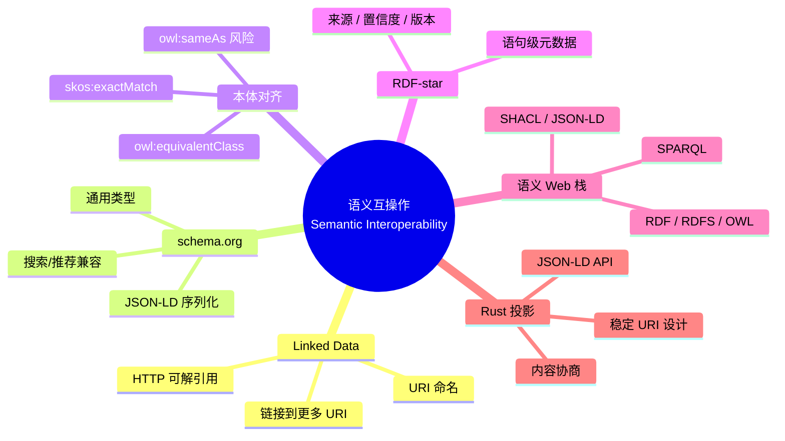

> **内容分级**: [专家级]

# 语义互操作（Semantic Interoperability）

> **EN**: Semantic Interoperability
> **Summary**: Linked Data principles, schema.org, ontology alignment, RDF-star for statement-level metadata, the semantic web stack, and Rust projections for JSON-LD, content negotiation, and API design.

> **Rust 版本**: 1.97.0+ (Edition 2024)
> **Bloom 层级**: L4-L5
> **权威来源**: 本文件为 `concept/` 权威页。
> **定位**: 从**互操作**角度介绍如何让不同系统、不同词汇表的语义资产相互理解，并给出 Rust 服务端与客户端场景下的工程映射。
> **前置概念**: [语义工程目录 README](README.md) · [知识图谱构建](03_knowledge_graph_construction.md) · [描述逻辑与 OWL](02_description_logic_and_owl.md) · [L3 网络编程](../../03_advanced/06_low_level_patterns/04_network_programming.md)
> **后置概念**: [知识图谱本体 v2](../../00_meta/knowledge_topology/kg_ontology_v2.md) · [语义空间](../../00_meta/00_framework/semantic_space.md)

---

## 📑 目录

- [语义互操作（Semantic Interoperability）](#语义互操作semantic-interoperability)
  - [📑 目录](#-目录)
  - [一、Linked Data 原则](#一linked-data-原则)
  - [二、schema.org](#二schemaorg)
  - [三、本体对齐](#三本体对齐)
  - [四、RDF-star 与语句级元数据](#四rdf-star-与语句级元数据)
  - [五、语义 Web 技术栈](#五语义-web-技术栈)
  - [六、Rust 映射：JSON-LD、内容协商与 API 设计](#六rust-映射json-ld内容协商与-api-设计)
    - [JSON-LD 结构示例](#json-ld-结构示例)
    - [Rust 中的内容协商（概念示意）](#rust-中的内容协商概念示意)
    - [API 设计原则](#api-设计原则)
  - [七、反命题与边界](#七反命题与边界)
    - [反命题："Linked Data 就是建立一个全局大 RDF 图"](#反命题linked-data-就是建立一个全局大-rdf-图)
    - [反命题："owl:sameAs 可以随便用"](#反命题owlsameas-可以随便用)
  - [八、嵌入式测验（Embedded Quiz）](#八嵌入式测验embedded-quiz)
  - [九、🧭 思维导图（Mindmap）](#九-思维导图mindmap)
  - [权威来源索引](#权威来源索引)

---

## 一、Linked Data 原则

Tim Berners-Lee 提出的 **Linked Data** 四条原则：

1. 使用 URI 作为事物的名称。
2. 使用 HTTP URI，使人们可以查到这些名称。
3. 当有人访问 URI 时，提供有用的信息，使用标准格式（如 RDF、JSON-LD）。
4. 在提供的信息中，包含指向其他事物的 URI，从而发现更多关联。

Linked Data 的核心不是"把所有数据放进一个图"，而是**通过 URI 链接把分布式图连接起来**。项目 KG 的 `ex:` URI 方案即是这一原则的应用：每个 Rust 概念都有全局唯一名，并可通过链接遍历到相关概念。

---

## 二、schema.org

**schema.org** 是一个被广泛采用的协同词汇表，由 Google、Bing、Yahoo、Yandex 等共同维护。它提供：

- 通用实体类型：`Person`、`Organization`、`CreativeWork`、`SoftwareApplication` 等。
- 通用属性：`name`、`author`、`datePublished`、`identifier` 等。
- 序列化格式：优先 JSON-LD，也支持 Microdata 与 RDFa。

对于 Rust 知识体系，schema.org 可作为**跨生态兼容层**：例如把每个 `concept/` 文件描述为 `schema:LearningResource`，从而被搜索引擎、学习平台、推荐系统直接消费。

---

## 三、本体对齐

当两个本体描述同一领域时，需要**本体对齐（ontology alignment / matching）**来桥接词汇差异。常用映射关系：

| 映射类型 | OWL 表达 | 含义 |
|:---|:---|:---|
| 等价类 | `A owl:equivalentClass B` | A 与 B 外延相同 |
| 子类 | `A rdfs:subClassOf B` | A 的所有实例都是 B 的实例 |
| 同义个体 | `a owl:sameAs b` | a 与 b 指同一现实世界实体 |
| 映射谓词 | `skos:exactMatch`, `skos:closeMatch` | 概念在意义上精确/近似匹配 |
| 属性映射 | `p owl:equivalentProperty q` | 两个属性表达同一关系 |

**风险**：`owl:sameAs` 的滥用会导致"同义爆炸"（sameAs explosion）——把本应区分的概念强行合并，进而传播错误推理。项目 KG 中优先使用 `skos:exactMatch` 表达跨本体的语义近似，避免不必要的同一性断言。

---

## 四、RDF-star 与语句级元数据

RDF 1.1 中，三元组本身不能作为另一个三元组的主语或宾语。RDF-star 扩展解决了这一问题：

```turtle
<< ex:Ownership ex:dependsOn ex:TypeSystem >>
    ex:source "TRPL Ch. 3-4" ;
    ex:confidence "1.0"^^xsd:float ;
    ex:version "1.97.0" .
```

项目 KG v2/v3 使用 RDF-star 为每条关系边附加：

- **来源（source）**：人工审校或脚本生成。
- **置信度（confidence）**：1.0 表示人工确认，0.6–0.9 表示自动推断。
- **版本（version）**：适用的 Rust 版本。

语句级元数据是语义互操作的关键：它让第三方消费者在合并多个来源的数据时，能够按置信度或版本过滤边。

---

## 五、语义 Web 技术栈

从下到上的经典语义 Web 栈：

```text
Unicode / URI
    ↑
XML / RDF
    ↑
RDF Schema (RDFS)
    ↑
OWL
    ↑
SPARQL
    ↑
RDF-star / SHACL / JSON-LD
    ↑
应用层（搜索、推荐、KG-RAG、智能问答）
```

项目 KG 的实践位于中上层：

- 数据层：RDF 1.2 / JSON-LD / Turtle。
- 模式层：RDFS + OWL 2（`kg_ontology_v2.md`）。
- 查询层：SPARQL（规划）。
- 验证层：SHACL（`kg_shapes.ttl`）。
- 元数据层：RDF-star。

---

## 六、Rust 映射：JSON-LD、内容协商与 API 设计

### JSON-LD 结构示例

JSON-LD 把普通 JSON 增强为 Linked Data，通过 `@context` 映射字段到 URI：

```json
{
  "@context": {
    "ex": "https://rust-lang-knowledge-graph.org/",
    "schema": "https://schema.org/",
    "skos": "http://www.w3.org/2004/02/skos/core#"
  },
  "@id": "ex:Ownership",
  "@type": ["ex:Concept", "schema:LearningResource"],
  "skos:prefLabel": [
    { "@value": "Ownership", "@language": "en" },
    { "@value": "所有权", "@language": "zh" }
  ],
  "ex:dependsOn": {
    "@id": "ex:TypeSystem"
  }
}
```

### Rust 中的内容协商（概念示意）

```rust,ignore
// 概念示意：axum handler 根据 Accept 头返回 JSON-LD 或 Turtle
use axum::{extract::Accept, response::Response};

async fn concept_handler(
    accept: Accept,
    uri: &str,
) -> Response {
    if accept.0.iter().any(|q| q.value == "application/ld+json") {
        jsonld_response(uri).await
    } else {
        turtle_response(uri).await
    }
}
```

### API 设计原则

1. **为资源分配稳定 URI**，避免路径中嵌入版本号。
2. **支持内容协商**：`Accept: application/ld+json`、`Accept: text/turtle`。
3. **使用共享词汇表**：`schema.org`、`skos`、`dcterms`。
4. **为关系附加来源与置信度**：RDF-star 或外部属性文件。
5. **提供 SHACL 形状文档**，让客户端能验证消费的数据。

---

## 七、反命题与边界

### 反命题："Linked Data 就是建立一个全局大 RDF 图"

**错误**。Linked Data 的核心是**链接**，不是集中：

- 数据可以保留在各自的域名、组织、服务器上。
- 通过 HTTP URI 和语义谓词相互引用。
- 联邦 SPARQL 查询可以在不搬运数据的情况下跨源查询。

项目 KG 也采用分布式策略：`concept/` 文件由不同目录维护，但共享 `ex:` URI 空间与 `kg_ontology_v2.md` 规范。

### 反命题："owl:sameAs 可以随便用"

`owl:sameAs` 表达**同一现实世界实体**。滥用会导致：

- 推理器把两个本不该合并的实体的外延合并。
- 错误传播：若 A sameAs B，则 A 的所有属性也适用于 B。

**边界建议**：仅在确认两 URI 指代同一实体时使用 `owl:sameAs`；一般情况下优先使用 `skos:exactMatch` 或 `skos:closeMatch`。

---

## 八、嵌入式测验（Embedded Quiz）

**1. Linked Data 的核心设计目标是什么？**

- A. 把所有数据存储在单一数据库
- B. 通过 URI 链接把分布式数据连接起来
- C. 替代 HTTP 协议
- D. 禁止机器访问数据

> **答案：B**。Linked Data 强调使用 HTTP URI 命名事物，并通过链接让分布式数据集相互关联。

**2. schema.org 最常用的序列化格式是？**

- A. XML Schema
- B. JSON-LD
- C. Protobuf
- D. CSV

> **答案：B**。schema.org 推荐以 JSON-LD 嵌入网页，便于搜索引擎和推荐系统消费。

**3. 下列哪种关系最适合表达"两个概念意义非常接近但不一定是同一实体"？**

- A. `owl:sameAs`
- B. `skos:exactMatch`
- C. `rdfs:subClassOf`
- D. `owl:disjointWith`

> **答案：B**。`skos:exactMatch` 表示跨词汇表的精确语义匹配，但不承诺两个 URI 指代同一现实世界实体；`owl:sameAs` 则是强同一性断言。

**4. RDF-star 的主要价值是？**

- A. 删除 RDF 三元组
- B. 为三元组本身附加元数据
- C. 把 RDF 转换为二进制
- D. 增加新的 URI 格式

> **答案：B**。RDF-star 允许把三元组作为另一个三元组的主语或宾语，从而附加来源、置信度、版本等语句级元数据。

**5. 在语义 Web 技术栈中，SHACL 位于哪一层？**

- A. 字符编码层
- B. 数据验证层
- C. 传输协议层
- D. 用户界面层

> **答案：B**。SHACL 用于验证 RDF 图是否满足给定数据形状，属于数据验证/质量控制层。

---

## 九、🧭 思维导图（Mindmap）



> **认知功能**: 本 mindmap 把语义互操作的"链接—对齐—元数据—栈—工程"四个维度可视化，提示读者互操作的关键不是统一所有数据，而是统一标识与关系语义。

---

## 权威来源索引

- [W3C Linked Data](https://www.w3.org/DesignIssues/LinkedData.html)
- [schema.org](https://schema.org/)
- [W3C RDF-star and SPARQL-star](https://www.w3.org/2021/12/rdf-star.html)
- [W3C JSON-LD 1.1](https://www.w3.org/TR/json-ld11/)
- [W3C OWL 2 Web Ontology Language](https://www.w3.org/TR/owl2-overview/)
- [W3C SHACL](https://www.w3.org/TR/shacl/)
- [Rust Reference — Crates and Source Files](https://doc.rust-lang.org/reference/items/modules.html)

> **相关文件**: [目录 README](README.md) · [本体工程](01_ontology_engineering.md) · [描述逻辑与 OWL](02_description_logic_and_owl.md) · [知识图谱构建](03_knowledge_graph_construction.md)
>
> **文档版本**: 1.0 ｜ **最后更新**: 2026-07-28 ｜ **状态**: ✅ 新建（Rust 1.97 对齐）
