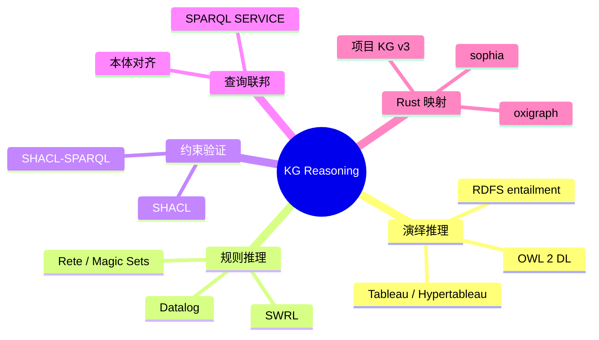

> **内容分级**: [专家级]

# 知识图谱推理（Knowledge Graph Reasoning）

**EN**: Knowledge Graph Reasoning
**Summary**: Formal foundations of knowledge graph reasoning — RDFS/OWL entailment, rule-based inference, SHACL validation, and query federation — with mappings to Rust semantic-web tooling and the project KG v3.

> **Rust 版本**: 1.97.0+ (Edition 2024)
> **Bloom 层级**: L4-L5
> **权威来源**: 本文件为 `concept/` 权威页。
> **定位**: 从**形式语义与推理算法**角度介绍知识图谱的演绎能力，补全「构建」与「互操作」之间的推理层，并以项目 KG v3 作为实例。
> **前置概念**: [Ontology Engineering](01_ontology_engineering.md) · [Description Logic and OWL](02_description_logic_and_owl.md) · [Knowledge Graph Construction](03_knowledge_graph_construction.md) · [Network Programming](../../03_advanced/06_low_level_patterns/04_network_programming.md)
> **后置概念**: [Semantic Interoperability](04_semantic_interoperability.md) · [RustBelt](../02_separation_logic/01_rustbelt.md) · [Category Theory](../00_type_theory/04_category_theory.md)

---

> **来源**: [W3C OWL 2 Web Ontology Language](https://www.w3.org/TR/owl2-overview/) · [W3C SHACL](https://www.w3.org/TR/shacl/) · [W3C SPARQL 1.1 Entailment Regimes](https://www.w3.org/TR/sparql11-entailment/) · [Hitzler, Krötzsch, Rudolph — *Foundations of Semantic Web Technologies*](https://www.semantic-web-book.org/) · [Oxigraph](https://docs.rs/oxigraph/latest/oxigraph/) · [The Rust Reference](https://doc.rust-lang.org/reference/)

---

## 🧠 知识结构图



---

## 一、权威定义

**知识图谱推理**（KG Reasoning）指从显式声明的三元组出发，通过形式语义规则导出隐式知识的过程。核心问题包括：

1. **演绎推理**（deductive reasoning）：基于模型论语义推导逻辑后承。
2. **规则推理**（rule-based inference）：基于 if-then 规则前向或后向链式推导。
3. **约束验证**（constraint validation）：检查图谱是否满足 SHACL/SHex 等形状约束。
4. **查询回答**（query answering）：在某种蕴涵机制下回答 SPARQL 查询。

### 1.1 推理的形式骨架

```text
知识库 K = (T, A)
  T：TBox（术语/本体）
  A：ABox（断言/实例数据）

K ⊨ φ  表示 φ 是 K 的逻辑后承。
```

在描述逻辑 ALC 中，TBox 包含概念包含 `C ⊑ D`，ABox 包含个体断言 `C(a)` 与 `R(a, b)`。

---

## 二、RDFS 与 OWL 推理

### 2.1 RDFS 蕴涵规则（示例）

```text
若  (?x, rdfs:subClassOf, ?y) 且 (?a, rdf:type, ?x)
则  (?a, rdf:type, ?y)

若  (?x, rdfs:domain, ?C) 且 (?a, ?x, ?b)
则  (?a, rdf:type, ?C)
```

这些规则可通过**饱和**（saturation）算法实现：反复应用规则直到无新三元组产生。

### 2.2 OWL 2 表达力谱系

| 片段 | 可表达 | 推理复杂度 | Rust 适用性 |
|---|---|---|---|
| OWL 2 EL | 大型本体、概念分层 | PTIME | 适合概念图谱 |
| OWL 2 QL | 基于查询重写 | AC0 数据复杂度 | 适合 SPARQL 端点 |
| OWL 2 RL | 规则化子集 | PTIME | 适合前向链推理 |
| OWL 2 DL | 完整描述逻辑 | N2EXPTIME | 需要专用推理机 |

> Rust 生态目前更适合 OWL 2 RL / RDFS 级别的规则推理；完整 Tableau 算法通常依赖外部 reasoner（如 HermiT、Pellet）。

---

## 三、规则推理与 Datalog

Datalog 是知识图谱规则推理的通用中间语言：

```text
ancestor(X, Y) :- parent(X, Y).
ancestor(X, Z) :- parent(X, Y), ancestor(Y, Z).
```

前向链（bottom-up）从事实出发迭代推导；后向链（top-down）从查询目标反向分解。Rust 实现通常采用：

- **朴素求值**（naïve evaluation）：每轮加入所有新事实。
- **半朴素求值**（semi-naïve evaluation）：只检查上一轮产生的新事实。

---

## 四、SHACL 约束验证

SHACL 不用于推导新知识，而是**检查已有数据是否满足形状约束**。

```turtle
ex:PersonShape a sh:NodeShape ;
    sh:targetClass ex:Person ;
    sh:property [
        sh:path ex:email ;
        sh:minCount 1 ;
        sh:datatype xsd:string ;
    ] .
```

> 与 OWL 的关键区别：OWL 中的 `minCardinality` 是**逻辑约束**（数据不满足则本体不一致），SHACL 中的 `sh:minCount` 是**验证规则**（产生验证报告，不修改语义）。

---

## 五、Rust 映射

### 5.1 项目 KG v3 中的推理实例

项目 KG v3 使用 RDF/JSON-LD 表示概念关系，并通过 `scripts/apply_kg_semantic_predicates.py` 把通用 `ex:relatedTo` 压缩为具体语义谓词（`dependsOn`、`entails`、`refines` 等）。这本质上是**规则驱动的关系精化**。

### 5.2 用 Rust 表达最小三元组

```rust
#[derive(Debug, Clone, PartialEq, Eq, Hash)]
pub struct Triple {
    subject: String,
    predicate: String,
    object: String,
}

pub struct SimpleReasoner {
    triples: std::collections::HashSet<Triple>,
}

impl SimpleReasoner {
    /// 简单 RDFS 子类规则饱和
    pub fn saturate(&mut self) {
        let sub_class_of = "rdfs:subClassOf".to_string();
        let type_pred = "rdf:type".to_string();
        loop {
            let mut new = vec![];
            for sub_class_triple in self.triples.iter()
                .filter(|t| t.predicate == sub_class_of)
            {
                let subclass = &sub_class_triple.subject;
                let superclass = &sub_class_triple.object;
                for type_triple in self.triples.iter()
                    .filter(|t| t.predicate == type_pred && &t.object == subclass)
                {
                    let inferred = Triple {
                        subject: type_triple.subject.clone(),
                        predicate: type_pred.clone(),
                        object: superclass.clone(),
                    };
                    if !self.triples.contains(&inferred) {
                        new.push(inferred);
                    }
                }
            }
            if new.is_empty() { break; }
            self.triples.extend(new);
        }
    }
}
```

---

## 六、反命题与边界

### 反例 1：把 SHACL 当作 OWL 使用

```text
# 错误理解：SHACL 会让 type 自动推导
ex:PersonShape sh:targetClass ex:Person .
ex:Alice ex:name "Alice" .
# 不会自动推出 ex:Alice rdf:type ex:Person
```

SHACL 需要**显式 target**（如 `sh:targetClass`、`sh:targetNode`）才能触发验证。

### 反例 2：期望 OWL 推理能处理任意规则

OWL 2 DL 基于描述逻辑，**不能表达**任意 Datalog 规则（例如需要函数符号的规则）。复杂业务规则应使用规则引擎而非 OWL reasoner。

### 边界：推理的可伸缩性

- 大型图谱的完全饱和可能爆炸；生产系统常采用**增量推理**或**物化视图**。
- Rust 的高性能特性使其适合实现自定义规则引擎，但完整 OWL 2 DL reasoner 仍建议复用成熟 Java/C++ 工具。

---

## 七、国际权威参考

- **P1 学术/形式化**
  - [Hitzler, Krötzsch, Rudolph — *Foundations of Semantic Web Technologies*](https://www.semantic-web-book.org/)
  - [Baader et al. — *The Description Logic Handbook*](https://doi.org/10.1017/9781139025355)
  - [OWL 2 Web Ontology Language — Direct Semantics](https://www.w3.org/TR/owl2-direct-semantics/)

- **P0 官方标准**
  - [W3C RDF 1.2](https://www.w3.org/TR/rdf12-concepts/)
  - [W3C OWL 2](https://www.w3.org/TR/owl2-overview/)
  - [W3C SHACL](https://www.w3.org/TR/shacl/)
  - [W3C SPARQL 1.1 Entailment Regimes](https://www.w3.org/TR/sparql11-entailment/)

- **P2 生态/社区**
  - [Oxigraph (Rust RDF store)](https://docs.rs/oxigraph/latest/oxigraph/)
  - [Sophia (Rust RDF library)](https://docs.rs/sophia/latest/sophia/)
  - [Apache Jena](https://jena.apache.org/)

---

## 嵌入式测验

> **Q1**. RDFS 推理通常采用什么算法导出所有隐式三元组？
>
> - A. 动态规划
> - B. 饱和（saturation）
> - C. 梯度下降
> - D. 回溯搜索
>
> <details><summary>答案</summary>B. 饱和算法反复应用推理规则直到不动点。</details>

> **Q2**. SHACL 与 OWL 的核心区别是什么？
>
> - A. SHACL 只能验证数据形状，OWL 用于逻辑蕴涵
> - B. SHACL 比 OWL 表达力更强
> - C. OWL 只能验证，SHACL 只能推理
> - D. 没有区别
>
> <details><summary>答案</summary>A. SHACL 是验证语言，OWL 是本体/逻辑语言。</details>

> **Q3**. OWL 2 RL 最适合哪类 Rust 实现？
>
> - A. 交互式定理证明
> - B. 规则化前向链推理
> - C. 神经网络训练
> - D. 图神经网络嵌入
>
> <details><summary>答案</summary>B. OWL 2 RL 是规则化子集，适合前向链实现。</details>
