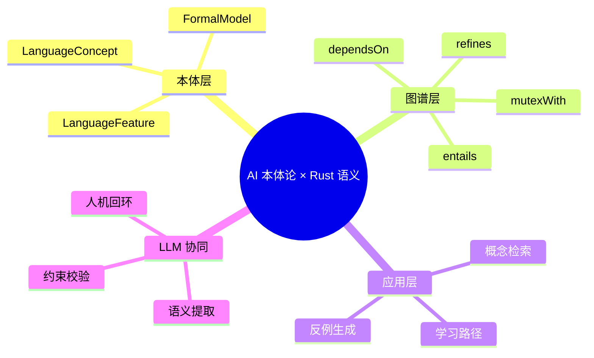

> **EN**: AI Ontology and Rust Semantics
> **Summary**: Bridging knowledge engineering, large language models, and formal Rust semantics: how ontologies, knowledge graphs, and LLM-assisted extraction can represent, reason about, and validate Rust language concepts.
>
> **Rust 版本**: 1.97.0+ (Edition 2024)
> **Bloom 层级**: L4-L6
> **权威来源**: 本文件为 `concept/` 权威页。
> **A/S/P 标记**: **S+P** — Structure + Procedure
> **前置概念**: [Knowledge Graph Ontology](../../00_meta/knowledge_topology/kg_ontology_v2.md) · [Semantic Model Atlas](../../00_meta/knowledge_topology/11_semantic_model_atlas.md) · [Linear Logic](../01_ownership_logic/01_linear_logic.md) · [Operational Semantics](../03_operational_semantics/03_operational_semantics.md)
> **后置概念**: [Formal Methods Industrialization](../../07_future/04_research_and_experimental/02_formal_methods.md) · [LLM System Architecture](../../07_future/04_research_and_experimental/08_llm_system_architecture.md)

---

## 📑 目录

- [📑 目录](#-目录)
- [一、为什么需要 AI 本体论来刻画 Rust 语义？](#一为什么需要-ai-本体论来刻画-rust-语义)
- [二、核心概念栈](#二核心概念栈)
  - [2.1 本体（Ontology）](#21-本体ontology)
  - [2.2 知识图谱（Knowledge Graph）](#22-知识图谱knowledge-graph)
  - [2.3 形式语义嵌入](#23-形式语义嵌入)
  - [2.4 LLM 辅助的语义提取](#24-llm-辅助的语义提取)
- [三、Rust 语义的 KG 建模实践](#三rust-语义的-kg-建模实践)
- [四、从自然语言到形式契约](#四从自然语言到形式契约)
- [五、反例与局限](#五反例与局限)
  - [反例 1：LLM 幻觉导致错误关系](#反例-1llm-幻觉导致错误关系)
  - [反例 2：形式化过度导致维护爆炸](#反例-2形式化过度导致维护爆炸)
  - [反例 3：把动态运行信息误认为静态语义](#反例-3把动态运行信息误认为静态语义)
- [六、关键属性](#六关键属性)
- [七、思维导图](#七思维导图)
- [八、国际权威来源](#八国际权威来源)
- [九、嵌入式测验](#九嵌入式测验)
  - [测验 1：本体作用](#测验-1本体作用)
  - [测验 2：谓词语义](#测验-2谓词语义)
  - [测验 3：LLM 局限](#测验-3llm-局限)
- [十、Rust 核心概念与国际顶层本体的对齐](#十rust-核心概念与国际顶层本体的对齐)
  - [10.1 核心概念映射表](#101-核心概念映射表)
  - [10.2 映射的工程意义](#102-映射的工程意义)
- [十一、Curry-Howard 视角：类型即命题、程序即证明](#十一curry-howard-视角类型即命题程序即证明)
  - [11.1 与 OWL 公理的对照](#111-与-owl-公理的对照)
  - [11.2 程序作为 OWL 实例](#112-程序作为-owl-实例)
  - [11.3 从 Curry-Howard 到 KG 质量门](#113-从-curry-howard-到-kg-质量门)

---

## 一、为什么需要 AI 本体论来刻画 Rust 语义？

Rust 的语义空间包含多个异构模型：

- **类型系统**（trait、lifetime、泛型）
- **所有权与借用**（线性/仿射逻辑、别名模型）
- **并发语义**（Send/Sync、Future、Waker）
- **unsafe 边界**（provenance、内存模型、FFI）
- **工程生态**（crate、macro、async runtime）

这些模型之间既有蕴含关系（如 `Send` 是类型系统的并发投影），也有互斥关系（如 `&mut T` 与同时存在的 `*mut T` 写操作）。传统的自然语言文档难以保证**一致性、可推理性、可扩展性**。AI 本体论提供：

1. **显式概念化**：把“所有权”“生命周期”“trait 对象”等定义为一阶类/关系；
2. **机器可推理**：通过描述逻辑（DL）或图神经网络发现隐含依赖与冲突；
3. **LLM 对齐**：让大语言模型在生成/回答时以本体为约束，降低幻觉；
4. **版本演化追踪**：当 Rust 新增 `unsafe extern` 或 `AsyncFn` 时，在本体中新增实体并自动重算影响面。

---

## 二、核心概念栈

### 2.1 本体（Ontology）

本体是对某一领域概念及其关系的**形式化、显式、共享**规约。Rust 语义本体至少包含：

| 类（Class） | 示例实例 | 关键属性 |
|:---|:---|:---|
| `LanguageConcept` | Ownership、Borrowing、Lifetime、Trait | `bloomLevel`, `edition`, `stableSince` |
| `LanguageFeature` | `async_fn_in_trait`, `let_chains`, `unsafe_extern` | `trackingIssue`, `rfcNumber`, `stableVersion` |
| `FormalModel` | Stacked Borrows、Tree Borrows、Oxide、RustBelt | `logicFoundation`, `soundnessClaim` |
| `Crate` | `tokio`、`serde`、`axum` | `domain`, `msrv`, `authoritySource` |
| `Relation` | `dependsOn`、`entails`、`mutexWith`、`refines` | `symmetry`, `transitivity` |

> 来源：[OWL 2 Web Ontology Language](https://www.w3.org/TR/owl2-overview/) · [Description Logic Handbook](https://dl.acm.org/doi/10.5555/1206588)

### 2.2 知识图谱（Knowledge Graph）

知识图谱是本体实例化的**具体图结构**。本项目 `concept/00_meta/knowledge_topology/` 中的 KG 把每个 Markdown 权威页视为节点，用具体谓词连接：

```turtle
ex:Ownership a ex:LanguageConcept ;
    ex:bloomLevel 1 ;
    ex:dependsOn ex:MoveSemantics ;
    ex:entails ex:Borrowing ;
    ex:mutexWith ex:GarbageCollection .
```

图谱推理可回答：

- “学习 `Pin` 之前必须掌握哪些概念？” → 沿 `dependsOn` 做逆向/正向遍历。
- “哪些概念与 `unsafe` 直接冲突？” → 查询 `mutexWith`。

### 2.3 形式语义嵌入

把 Rust 形式模型（如 Oxide 的类型规则、Tree Borrows 的权限转移）编码为可计算结构：

- **逻辑嵌入**：将 `&mut T` 的独占性表达为分离逻辑中的 `Own(x, T) * Own(x, T) ⊢ ⊥`；
- **图嵌入**：用 GNN 把概念节点映射为向量，预测概念间的 `entails`/`mutexWith` 关系；
- **证明助手嵌入**：在 Coq/Lean 中定义 Rust 子集的抽象语法树，并用 tactic 生成教学反例。

### 2.4 LLM 辅助的语义提取

LLM 可以从自然语言文档中提取结构化语义，但存在**幻觉**与**不一致**。工程化流程：

1. **提示工程**：给 LLM 本体 schema，要求以 JSON-LD/Turtle 输出；
2. **约束校验**：用 SHACL/OWL 约束过滤非法输出（如 `bloomLevel` 必须在 0–7）；
3. **人机回环**：由领域专家复核生成的关系，并入 KG；
4. **反向生成**：从 KG 生成自然语言解释，用于自动补全文档stub。

---

## 三、Rust 语义的 KG 建模实践

以 `unsafe extern` 为例，说明新增语言特性时如何在本体中落地：

```turtle
ex:UnsafeExtern a ex:LanguageFeature ;
    ex:stableSince "1.82.0" ;
    ex:rfcNumber 3484 ;
    ex:dependsOn ex:ExternBlock ;
    ex:dependsOn ex:UnsafeRust ;
    ex:entails ex:FFISafetyBoundary ;
    ex:refines ex:UnsafeAttributeSyntax .
```

当该实体加入后，自动推理可触发：

- 更新 [版本跟踪页](../../07_future/00_version_tracking/rust_1_90_stabilized.md)；
- 在 [FFI 权威页](../../03_advanced/04_ffi/05_unsafe_extern_blocks.md) 中添加前向链接；
- 检查是否有旧的 `ex:relatedTo` 可被具体化为 `dependsOn` 或 `refines`。

> 本项目已通过 `scripts/check_kg_relation_precision.py` 监控核心 50 个实体周围是否使用具体谓词而非通用 `ex:relatedTo`。

---

## 四、从自然语言到形式契约

LLM + 本体可用于把自然语言规范转换为 Rust 形式契约：

| 步骤 | 输入 | 输出 | 验证方式 |
|:---|:---|:---|:---|
| 1. 需求抽取 | “该函数不得返回悬垂引用” | 概念：`NoDanglingReturn` | 本体一致性检查 |
| 2. 语义映射 | `NoDanglingReturn` | 生命周期约束：`'a: 'b` | 借用检查器 |
| 3. 代码生成 | 约束集合 | `fn f<'a, 'b>(x: &'a T) -> &'b T where 'a: 'b` | `cargo check` |
| 4. 反例生成 | 同一约束 | `fn bad<'a, 'b>(x: &'a T) -> &'b T`（无 where） | 编译失败验证 |

---

## 五、反例与局限

### 反例 1：LLM 幻觉导致错误关系

LLM 可能生成：

```turtle
ex:Vec ex:entails ex:GarbageCollection .
```

这是**错误**的：`Vec` 使用 RAII/所有权，与 GC 是互斥而非蕴含。必须通过 SHACL 规则或人工复核过滤。

### 反例 2：形式化过度导致维护爆炸

试图把 Rust 1.97 全部语义一五一十地形式化为 DL 本体，会迅速超出推理器可处理规模。正确做法是**分层形式化**：核心 50 个概念精确建模，其余概念用摘要链接指向权威页。

### 反例 3：把动态运行信息误认为静态语义

`cargo` 解析器版本、crate 下载量等属于**元数据/生态数据**，不应与语言语义混在同一本体层；应放在独立的知识图谱（如 crates.io KG）中，通过 `ex:ecosystemMetric` 链接。

---

## 六、关键属性

| 属性 | 取值 / 判定 | 依据 |
|:---|:---|:---|
| 本体语言 | OWL 2 DL / SHACL | W3C 推荐标准 |
| 关系谓词 | `dependsOn`、`entails`、`mutexWith`、`refines`、`equivalentTo`、`counterExample` | 项目 KG 本体规范 |
| LLM 输出格式 | JSON-LD / Turtle | 语义网标准 |
| 校验工具 | `check_kg_shapes.py`、`check_kg_relation_precision.py` | 项目质量门 |
| 人工复核 | 核心概念变更必须人工确认 | AGENTS.md 治理机制 |

---

## 七、思维导图



---

## 八、国际权威来源

- [Rust Reference — Introduction](https://doc.rust-lang.org/reference/introduction.html)
- [Rust RFC Index — rust-lang.github.io](https://rust-lang.github.io/rfcs/)
- [W3C — OWL 2 Overview](https://www.w3.org/TR/owl2-overview/)
- [W3C — SHACL](https://www.w3.org/TR/shacl/)
- [Baader et al. — The Description Logic Handbook](https://dl.acm.org/doi/10.5555/1206588)
- [Hogan et al. — Knowledge Graphs](https://dl.acm.org/doi/10.1145/3418449)
- [RustBelt — POPL 2018](https://plv.mpi-sws.org/rustbelt/popl18/)
- [Oxide: The Essence of Rust](https://arxiv.org/abs/1903.00982)
- [Project KG Ontology — kg_ontology_v2.md](../../00_meta/knowledge_topology/kg_ontology_v2.md)
- [Basic Formal Ontology (BFO)](https://basic-formal-ontology.org/)
- [DOLCE — Descriptive Ontology for Linguistic and Cognitive Engineering](http://www.loa.istc.cnr.it/old/DOLCE.html)
- [SUMO — Suggested Upper Merged Ontology](https://www.ontologyportal.org/)
- [Curry-Howard Correspondence — Stanford Encyclopedia of Philosophy](https://plato.stanford.edu/entries/type-theory/)

---

## 九、嵌入式测验

### 测验 1：本体作用

AI 本体论在 Rust 知识体系中的主要价值是什么？

- A. 替代编译器进行类型检查
- B. 显式化概念与关系，支持机器推理和 LLM 约束
- C. 自动生成所有 crate 文档
- D. 把 Rust 代码翻译成 Python

<details>
<summary>✅ 答案</summary>

**B 正确**。本体不替代编译器，而是为概念、关系和演化提供形式化、可推理的模型；LLM 可在此基础上生成/校验内容。

</details>

### 测验 2：谓词语义

在 KG 中，`mutexWith` 表示什么？

- A. 两个概念可以互相推导
- B. 两个概念不能在同一程序上下文中同时成立
- C. 两个概念是同一概念的不同名称
- D. 一个概念是另一个概念的上位概念

<details>
<summary>✅ 答案</summary>

**B 正确**。`mutexWith` 表示互斥关系，例如 `&mut T` 的独占借用与通过裸指针的并发写操作在 Rust 安全模型下互斥。

</details>

### 测验 3：LLM 局限

以下哪项是 LLM 从文档中提取 KG 时的典型风险？

- A. 无法处理 UTF-8 文本
- B. 可能生成语义错误的关系（如 `Vec entails GC`）
- C. 会替换所有人工编写的权威页
- D. 只能理解 C 语言文档

<details>
<summary>✅ 答案</summary>

**B 正确**。LLM 可能产生幻觉式关系，因此需要 SHACL/OWL 约束和人工复核。

</details>

---

## 十、Rust 核心概念与国际顶层本体的对齐

将 Rust 语义概念映射到国际通用的顶层本体（upper ontology），可以在跨语言、跨项目的知识集成中保持语义稳定。以下选取三种影响力最大的顶层本体：

- **BFO（Basic Formal Ontology）**：以连续体（continuant）与发生（occurrent）为核心，强调实体在时间中的存在方式。
- **DOLCE（Descriptive Ontology for Linguistic and Cognitive Engineering）**：认知语言学导向，区分物理对象、非物理对象、抽象、质量、时间区间等。
- **SUMO（Suggested Upper Merged Ontology）**：面向推理的大型上层本体，包含 `Entity`、`Class`、`Attribute`、`Process` 等高层类。

### 10.1 核心概念映射表

| Rust concept | BFO class | DOLCE class | SUMO class | Notes |
|:---|:---|:---|:---|:---|
| `Type` | `bfo:GenericallyDependentContinuant`（作为 Information Content Entity） | `dolce:Abstract` | `sumo:SetOrClass` | 类型是规范/共相，具体值是它的实例；在 OWL 中对应一个 `owl:Class`。 |
| `Value` | `bfo:SpecificallyDependentContinuant` 或 `bfo:IndependentContinuant`（运行时对象） | `dolce:PhysicalObject` / `dolce:Quality` | `sumo:Entity` | 运行时类型的具体居民；原始值更像 `Quality`，堆分配值更像 `Object`。 |
| `Lifetime` | `bfo:TemporalRegion` | `dolce:TimeInterval` | `sumo:TimeInterval` | 借用/引用有效的时间区间；`'static` 对应整个程序执行时间。 |
| `Ownership` | `bfo:Role`（实现性关系） | `dolce:SocialObject` / `dolce:Quality` | `sumo:Property` | 值在任意时刻有且仅有一个所有者；所有者是可转让的 `Role`。 |
| `Borrow` | `bfo:RelationalQuality` 或 `bfo:Role` | `dolce:Perdurant` / `dolce:State` | `sumo:Permission` | 在作用域内临时获得访问权而不转移所有权；是一种受时间约束的许可。 |
| `Trait` | `bfo:GenericallyDependentContinuant` | `dolce:Abstract` | `sumo:Attribute` / `sumo:Class` | 行为约束的接口规范；`impl Trait for Type` 相当于把类型归入该属性类。 |
| `Function` | `bfo:GenericallyDependentContinuant`（ICE）；运行时可调用角色对应 `bfo:Function` | `dolce:Process` / `dolce:Abstract` | `sumo:Function` / `sumo:Procedure` | 函数体是信息内容实体；一次调用是一个 `Process`。 |
| `Module` | `bfo:GenericallyDependentContinuant`（ICE） | `dolce:NonPhysicalObject` / `dolce:Abstract` | `sumo:Collection` | 命名空间与可见性边界，本质上是 items 的集合。 |
| `Crate` | `bfo:GenericallyDependentContinuant`（ICE） | `dolce:NonPhysicalObject` / `dolce:Artifact` | `sumo:ComputerProgram` / `sumo:Artifact` | 编译与分发单元；作为可被版本化的工程制品。 |
| `Unsafe` | `bfo:Role` / `bfo:Disposition` | `dolce:Quality` | `sumo:Attribute` | 标记一段代码或操作的安全保证超出了类型系统可验证范围。 |

### 10.2 映射的工程意义

1. **跨项目对齐**：当把 Rust 知识与 C++/Java/Python 知识图谱合并时，顶层本体的映射减少了术语冲突。例如 Rust `Lifetime` 与 C++ 对象生存期都可落在 `bfo:TemporalRegion` 下。
2. **推理边界清晰化**：BFO 区分 `Continuant` 与 `Occurrent` 提醒我们：类型系统约束是静态的 ICE（continuant），而借用检查的实际执行是编译期过程（occurrent）。
3. **LLM 消歧**：在提示中给出 "map this Rust concept to BFO/DOLCE/SUMO" 的约束，可降低模型把 `Ownership` 与 `Borrow` 混为一谈的概率。

> 注意：任何跨本体的映射都是**近似**的。Rust 的 `Ownership` 并非法学意义上的财产权，也不是纯逻辑关系；它更接近一种编译期可静态检查的 **资源管理角色**。映射时应保留 `skos:scopeNote` 说明近似程度。

---

## 十一、Curry-Howard 视角：类型即命题、程序即证明

Rust 的类型系统与逻辑之间存在着深刻的 **Curry-Howard 对应**（Curry-Howard correspondence）：

| 逻辑侧 | 类型侧 / Rust 侧 |
|:---|:---|
| 命题（Proposition） | 类型 `T` |
| 证明（Proof） | 具有类型 `T` 的值/表达式 `e : T` |
| 蕴涵 `A ⇒ B` | 函数类型 `fn(A) -> B` |
| 合取 `A ∧ B` | 乘积类型 `(A, B)` |
| 析取 `A ∨ B` | 和类型 `enum { A, B }` |
| 矛盾 `⊥` | 空类型 `!`（never type） |
| 全称量词 `∀x. P(x)` | 泛型 `fn<T>(x: T) -> ...` |

### 11.1 与 OWL 公理的对照

在 OWL 中，一条公理如 `SubClassOf(A B)` 表示 "凡是 A 都是 B"，即 `A ⇒ B`。这与 Rust 中的 **子类型 / trait bound** 惊人地相似：

```turtle
# OWL：A 蕴涵 B
ex:A rdfs:subClassOf ex:B .

# Rust 对应：凡是实现 A 的类型也满足 B
fn use_a<T: A + B>(x: T) { }
```

更进一步的映射：

- **类型构造子** `fn(A) -> B` 对应 **逻辑蕴涵**；函数体就是一个从 `A` 的证明构造 `B` 的证明的变换。
- **生命周期约束** `'a: 'b` 对应 **时序逻辑的蕴含**："在 `'a` 有效的任何时刻，`'b` 都有效"。
- **编译错误** `E0308`（类型不匹配）对应 **证明失败**：程序无法构造出目标命题的证明。

### 11.2 程序作为 OWL 实例

把一个 Rust 程序看作 OWL 解释域中的个体（individual）：

```turtle
# 个体 my_vec 是 Vec<i32> 的一个实例，即 Vec<i32> 命题的一个证明
ex:my_vec rdf:type ex:Vec_i32 .

# 该实例同时满足 Clone trait，对应于一个额外的命题证明
ex:my_vec ex:instanceOf ex:Clone .
```

SHACL 的 `sh:NodeShape` 则可以看作 **证明义务（proof obligation）**：每个被验证的节点必须提供满足该 shape 的"证据"。例如，要求一个概念节点必须有 `ex:bloomLevel`，等价于要求"证明该节点确实属于某个 Bloom 层级"。

### 11.3 从 Curry-Howard 到 KG 质量门

本项目质量门 `check_kg_shapes.py` 与 `check_kg_relation_precision.py` 本质上是在做两类 **机械化证明检查**：

1. **Shape 检查**：每个实体是否携带了必需的属性（类比：类型构造是否正确）。
2. **谓词精度检查**：核心实体之间是否使用了具体语义谓词而非泛泛的 `relatedTo`（类比：证明中是否使用了有效的推理规则）。

> 因此，可以把 KG 的维护理解为一种 **大规模的形式化证明活动**：每个概念是一个命题，每条例关系是一道推理规则，每次质量门通过都是一次全局一致性证明的更新。

---

> **过渡**: 理解 AI 本体论、国际顶层本体映射与 Curry-Howard 视角后，可进一步学习 [Knowledge Graph Ontology](../../00_meta/knowledge_topology/kg_ontology_v2.md)、[KG OWL/SHACL 语义](./07_kg_owl_shacl_semantics.md) 与 [Formal Methods Industrialization](../../07_future/04_research_and_experimental/02_formal_methods.md)。
