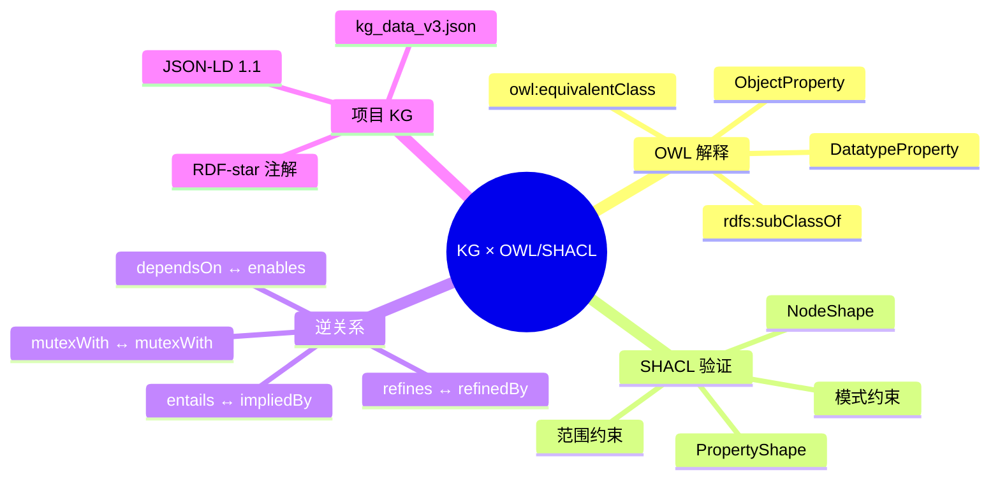

> **EN**: KG OWL/SHACL Semantics
> **Summary**: Formal interpretation of the project knowledge graph in OWL 2 and SHACL: class hierarchy, property axioms, inverse relations, and validation shapes over `concept/00_meta/kg_data_v3.json`.
>
> **Rust 版本**: 1.97.0+ (Edition 2024)
> **Bloom 层级**: L4-L6
> **权威来源**: 本文件为 `concept/` 权威页。
> **A/S/P 标记**: **S+P** — Structure + Procedure
> **前置概念**: [Knowledge Graph Ontology](../../00_meta/knowledge_topology/kg_ontology_v2.md) · [AI Ontology and Rust Semantics](./06_ai_ontology_and_rust_semantics.md) · [Semantic Model Atlas](../../00_meta/knowledge_topology/11_semantic_model_atlas.md)
> **后置概念**: [Formal Methods Industrialization](../../07_future/04_research_and_experimental/02_formal_methods.md) · [LLM System Architecture](../../07_future/04_research_and_experimental/08_llm_system_architecture.md)

---

## 📑 目录

- [📑 目录](#-目录)
- [一、为什么需要 OWL/SHACL 语义？](#一为什么需要-owlshacl-语义)
- [二、从 JSON-LD 到 OWL 解释](#二从-json-ld-到-owl-解释)
  - [2.1 概念层级：rdfs:subClassOf](#21-概念层级rdfssubclassof)
  - [2.2 跨语言映射：owl:equivalentClass](#22-跨语言映射owlequivalentclass)
  - [2.3 对象属性与数据属性](#23-对象属性与数据属性)
- [三、SHACL 验证形状](#三shacl-验证形状)
  - [3.1 sh:NodeShape](#31-shnodeshape)
  - [3.2 sh:PropertyShape](#32-shpropertyshape)
- [四、逆关系补全](#四逆关系补全)
- [五、项目 KG 的 JSON-LD 片段](#五项目-kg-的-json-ld-片段)
- [六、反例与局限](#六反例与局限)
  - [反例 1：滥用 `owl:equivalentClass`](#反例-1滥用-owlequivalentclass)
  - [反例 2：把数据属性当作对象属性](#反例-2把数据属性当作对象属性)
  - [反例 3：忽略逆关系的元数据](#反例-3忽略逆关系的元数据)
  - [局限](#局限)
- [七、关键属性](#七关键属性)
- [八、思维导图](#八思维导图)
- [九、国际权威来源](#九国际权威来源)
- [十、嵌入式测验](#十嵌入式测验)
  - [测验 1：OWL 类层级](#测验-1owl-类层级)
  - [测验 2：SHACL 形状](#测验-2shacl-形状)
  - [测验 3：逆关系](#测验-3逆关系)

---

## 一、为什么需要 OWL/SHACL 语义？

项目的 KG 数据 `concept/00_meta/kg_data_v3.json` 已经采用 JSON-LD 1.1 序列化，并复用了 `rdf`、`rdfs`、`skos`、`dcterms`、`prov` 等标准命名空间。然而，JSON-LD 本身只规定**数据模型**，不规定**推理语义**。为了：

1. 在通用推理器（如 HermiT、FaCT++、Pellet）中执行类层级推理；
2. 用 SHACL 引擎验证数据质量（如 `bloomLevel` 范围、必填标签）；
3. 与国际本体（BFO、DOLCE、SUMO）对齐；

需要把项目 KG 中的自定义谓词显式解释为 **OWL 2 公理**和 **SHACL 形状**。

---

## 二、从 JSON-LD 到 OWL 解释

### 2.1 概念层级：rdfs:subClassOf

项目 KG 中的每个实体都是某个类的实例（`ex:Concept`、`ex:Theory`、`ex:Model` 等），并且携带 `ex:layer`（L0–L7）。在 OWL 视角下，可以把每个实体同时视为一个**类**（class），并通过 `rdfs:subClassOf` 表达层级：

```turtle
ex:Ownership a owl:Class ;
    rdfs:subClassOf ex:LayerL1,
                    ex:MemoryManagementConcept .

ex:LayerL1 a owl:Class ;
    rdfs:subClassOf ex:LayerL0 .
```

**解释规则**：

- 每个 `ex:Concept` 实例可提升为一个 `owl:Class`；
- `ex:layer` 值 `Lk`（k > 0）导出 `rdfs:subClassOf ex:LayerL{k-1}`；
- 层类之间形成链 `L7 ⊑ L6 ⊑ ... ⊑ L0`，与认知层级一致。

> 这样，询问 "所有 L1 概念" 就可以通过 OWL 推理得到，而不仅是字符串匹配。

### 2.2 跨语言映射：owl:equivalentClass

当 KG 中声明 `ex:equivalentTo` 关系时，OWL 侧可以强化为 `owl:equivalentClass`（或 `owl:equivalentProperty`）。例如：

```turtle
ex:AffineLogic a owl:Class .
ex:Ownership a owl:Class .

ex:Ownership owl:equivalentClass ex:AffineLogic .
```

在描述逻辑中，`owl:equivalentClass` 表示两个类具有完全相同的实例集。对于跨语言映射（如 Rust `Ownership` ↔ 仿射逻辑 `AffineLogic`），这种等价关系可以触发**双向推理**：任何适用于 `Ownership` 的属性也适用于 `AffineLogic`，反之亦然。

> 注意：等价声明是**强语义**。在实际项目中，只有当两个概念经过人工审校且确实同延（co-extensional）时才应提升为 `owl:equivalentClass`；否则使用 `rdfs:seeAlso` 或 `skos:closeMatch` 更安全。

### 2.3 对象属性与数据属性

KG 中的关系分为两类：

| KG 表示 | OWL 解释 | 示例 |
|:---|:---|:---|
| 概念 → 概念 | `owl:ObjectProperty` | `ex:dependsOn`、`ex:entails`、`ex:mutexWith` |
| 概念 → 字面量 | `owl:DatatypeProperty` | `ex:bloomLevel`、`ex:rustVersion`、`ex:confidence` |

项目 KG 的 `properties` 数组已经显式声明了这些属性的 OWL 类型：

```json
{
  "@id": "ex:dependsOn",
  "@type": ["owl:ObjectProperty", "owl:TransitiveProperty"],
  "owl:inverseOf": "ex:enables",
  ...
}
```

数据属性示例：

```json
{
  "@id": "ex:bloomLevel",
  "@type": "owl:DatatypeProperty",
  "rdfs:range": "xsd:string",
  "rdfs:label": [
    { "@value": "Bloom level", "@language": "en" },
    { "@value": "Bloom 层级", "@language": "zh" }
  ]
}
```

---

## 三、SHACL 验证形状

SHACL（Shapes Constraint Language）用于验证 KG 中的每个节点是否符合预期形状。项目 KG 的验证入口规划在 `concept/00_meta/kg_shapes.ttl`。

### 3.1 sh:NodeShape

`sh:NodeShape` 定义了一类节点的整体约束。例如，每个概念节点必须有一个英文和一个中文首选标签：

```turtle
ex:ConceptShape a sh:NodeShape ;
    sh:targetClass ex:Concept ;
    sh:property [
        sh:path skos:prefLabel ;
        sh:minCount 2 ;
        sh:uniqueLang true ;
    ] ;
    sh:property [
        sh:path ex:bloomLevel ;
        sh:datatype xsd:string ;
        sh:pattern "^L[0-7]$" ;
        sh:minCount 1 ;
        sh:maxCount 1 ;
    ] .
```

### 3.2 sh:PropertyShape

`sh:PropertyShape` 专注于单个属性的约束。例如，`ex:confidence` 必须在 `[0,1]` 闭区间内：

```turtle
ex:ConfidenceShape a sh:PropertyShape ;
    sh:path ex:confidence ;
    sh:datatype xsd:float ;
    sh:minInclusive 0.0 ;
    sh:maxInclusive 1.0 ;
    sh:minCount 1 .
```

再如，验证 `ex:mutexWith` 不能自反：

```turtle
ex:MutexIrreflexiveShape a sh:PropertyShape ;
    sh:path ex:mutexWith ;
    sh:class ex:Concept ;
    sh:nodeKind sh:IRI ;
    sh:sparql [
        sh:message "mutexWith must be irreflexive" ;
        sh:select """
            SELECT $this
            WHERE { $this ex:mutexWith $this . }
        """
    ] .
```

---

## 四、逆关系补全

项目 KG 的 `properties` 数组已经定义了逆属性：

| 正向属性 | 逆属性 | OWL 特征 |
|:---|:---|:---|
| `ex:dependsOn` | `ex:enables` | Transitive |
| `ex:entails` | `ex:impliedBy` | Transitive |
| `ex:mutexWith` | `ex:mutexWith` | Symmetric, Irreflexive |
| `ex:refines` | `ex:refinedBy` | Transitive |

在图遍历场景（如 "哪些概念依赖我？"），显式补全逆边比运行时计算逆属性更高效。补全规则：

```turtle
# 原关系
ex:Ownership ex:dependsOn ex:MoveSemantics .

# 补全的逆关系
ex:MoveSemantics ex:enables ex:Ownership .
```

补全后的逆关系应保留与原关系相同的元数据（来源、置信度、版本），并在 `ex:source` 中标注 `inverse-of:<rel-id>` 以追踪来源。

---

## 五、项目 KG 的 JSON-LD 片段

以下片段展示如何将项目 KG 中的实体解释为 OWL/SHACL：

```json
{
  "@context": {
    "ex": "https://rust-lang-knowledge-graph.org/",
    "rdf": "http://www.w3.org/1999/02/22-rdf-syntax-ns#",
    "rdfs": "http://www.w3.org/2000/01/rdf-schema#",
    "owl": "http://www.w3.org/2002/07/owl#",
    "skos": "http://www.w3.org/2004/02/skos/core#",
    "sh": "http://www.w3.org/ns/shacl#",
    "xsd": "http://www.w3.org/2001/XMLSchema#"
  },
  "@graph": [
    {
      "@id": "ex:Ownership",
      "@type": ["ex:Concept", "owl:Class"],
      "rdfs:subClassOf": [
        { "@id": "ex:LayerL1" },
        { "@id": "ex:MemoryManagement" }
      ],
      "skos:prefLabel": [
        { "@value": "Ownership", "@language": "en" },
        { "@value": "所有权", "@language": "zh" }
      ],
      "ex:bloomLevel": "L1",
      "ex:dependsOn": {
        "@id": "ex:MoveSemantics",
        "@annotation": {
          "ex:source": "TRPL Ch. 4",
          "ex:confidence": { "@value": "1.0", "@type": "xsd:float" },
          "ex:version": "1.97.0",
          "ex:reviewed": true
        }
      }
    },
    {
      "@id": "ex:MoveSemantics",
      "@type": ["ex:Concept", "owl:Class"],
      "ex:enables": {
        "@id": "ex:Ownership",
        "@annotation": {
          "ex:source": "inverse-of:rel_ownership_depends_on_move",
          "ex:confidence": { "@value": "1.0", "@type": "xsd:float" },
          "ex:version": "1.97.0",
          "ex:reviewed": true
        }
      }
    },
    {
      "@id": "ex:ConceptShape",
      "@type": "sh:NodeShape",
      "sh:targetClass": "ex:Concept",
      "sh:property": [
        {
          "sh:path": "skos:prefLabel",
          "sh:minCount": 2,
          "sh:uniqueLang": true
        },
        {
          "sh:path": "ex:bloomLevel",
          "sh:datatype": "xsd:string",
          "sh:pattern": "^L[0-7]$",
          "sh:minCount": 1,
          "sh:maxCount": 1
        }
      ]
    }
  ]
}
```

**解释要点**：

- `ex:Ownership` 同时是 `ex:Concept` 实例和 `owl:Class`；
- `rdfs:subClassOf` 把概念挂到对应的认知层级；
- `ex:enables` 是 `ex:dependsOn` 的显式逆边；
- `ex:ConceptShape` 用 SHACL 约束每个概念节点。

---

## 六、反例与局限

### 反例 1：滥用 `owl:equivalentClass`

把 `ex:Ownership` 与 `ex:CPlusPlusRAII` 声明为 `owl:equivalentClass` 是错误的：两者只有部分相似实例，并非同延。应使用 `skos:closeMatch` 或 `ex:relatedTo`。

### 反例 2：把数据属性当作对象属性

将 `ex:bloomLevel` 指向一个 IRI 而非字符串字面量会导致 SHACL 验证失败：

```turtle
# 错误
ex:Ownership ex:bloomLevel ex:L1 .

# 正确
ex:Ownership ex:bloomLevel "L1"^^xsd:string .
```

### 反例 3：忽略逆关系的元数据

补全逆边时如果丢失 `ex:confidence` 和 `ex:reviewed`，会导致质量门 `check_kg_shapes.py` 报告缺失字段。

### 局限

- OWL 2 DL 对传递性、对称性、自反性组合有复杂限制；将 `ex:equivalentTo` 同时设为传递、对称、自反时，需确保不违反全局限制。
- SHACL 验证需要具体执行引擎（如 TopBraid、Apache Jena、pySHACL），目前项目质量门通过 Python 脚本近似检查，尚未接入完整 SHACL 引擎。

---

## 七、关键属性

| 属性 | 取值 / 判定 | 依据 |
|:---|:---|:---|
| 本体语言 | OWL 2 DL / SHACL | W3C 推荐标准 |
| 类层级 | `rdfs:subClassOf` | RDFS / OWL 2 |
| 等价映射 | `owl:equivalentClass` | OWL 2 |
| 属性类型 | `owl:ObjectProperty` / `owl:DatatypeProperty` | OWL 2 |
| 验证形状 | `sh:NodeShape` / `sh:PropertyShape` | SHACL |
| 逆属性 | `owl:inverseOf` | OWL 2 |
| KG 数据源 | `concept/00_meta/kg_data_v3.json` | 项目 KG v3 |

---

## 八、思维导图



---

## 九、国际权威来源

- [W3C — OWL 2 Web Ontology Language](https://www.w3.org/TR/owl2-overview/)
- [W3C — SHACL](https://www.w3.org/TR/shacl/)
- [W3C — RDF 1.2 Concepts and Abstract Syntax](https://www.w3.org/TR/rdf12-concepts/)
- [W3C — JSON-LD 1.1](https://www.w3.org/TR/json-ld11/)
- [W3C — SKOS Reference](https://www.w3.org/TR/skos-reference/)
- [Baader et al. — The Description Logic Handbook](https://dl.acm.org/doi/10.5555/1206588)
- [Hogan et al. — Knowledge Graphs (ACM Comput. Surv. 2021)](https://dl.acm.org/doi/10.1145/3418449)
- [Project KG Ontology — kg_ontology_v2.md](../../00_meta/knowledge_topology/kg_ontology_v2.md)

---

## 十、嵌入式测验

### 测验 1：OWL 类层级

在 KG 的 OWL 解释中，`rdfs:subClassOf` 最适合表达什么？

- A. 两个概念完全等价
- B. 一个概念是另一个概念的下位类或分层子类
- C. 两个概念互相排斥
- D. 一个概念是另一个概念的反例

<details>
<summary>✅ 答案</summary>

**B 正确**。`rdfs:subClassOf` 表达类层级，例如 L1 概念是 L0 元层概念的子类。

</details>

### 测验 2：SHACL 形状

`sh:PropertyShape` 的主要作用是？

- A. 定义整个本体的命名空间
- B. 对单个属性的取值类型、范围、基数等进行约束
- C. 自动从文本中提取三元组
- D. 替换 OWL 推理器

<details>
<summary>✅ 答案</summary>

**B 正确**。`sh:PropertyShape` 专注于属性的约束，如 `ex:confidence` 必须在 `[0,1]` 内。

</details>

### 测验 3：逆关系

`ex:dependsOn` 的逆属性是什么？

- A. `ex:impliedBy`
- B. `ex:enables`
- C. `ex:refinedBy`
- D. `ex:mutexWith`

<details>
<summary>✅ 答案</summary>

**B 正确**。`ex:dependsOn` 的逆属性是 `ex:enables`：若 A 依赖 B，则 B 使能 A。

</details>

---

> **过渡**: 掌握 KG 的 OWL/SHACL 解释后，可进一步学习 [AI Ontology and Rust Semantics](./06_ai_ontology_and_rust_semantics.md) 与 [Formal Methods Industrialization](../../07_future/04_research_and_experimental/02_formal_methods.md)。
