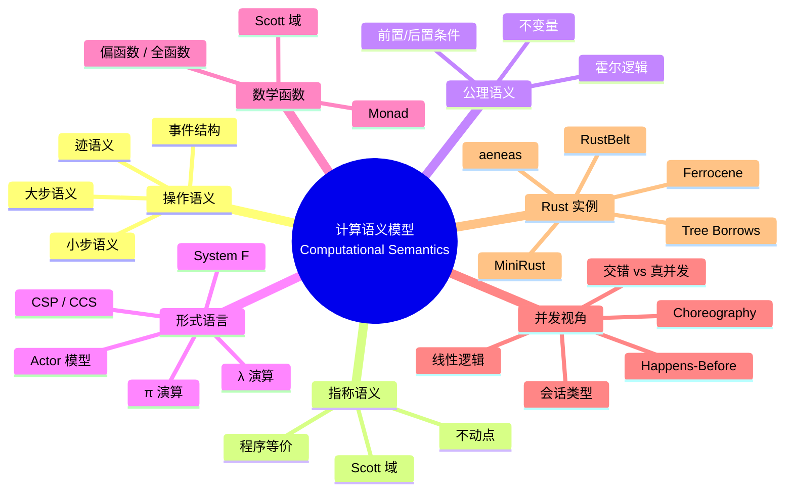

> **内容分级**: [专家级]

# 计算语义模型（Computational Semantic Models）

> **EN**: Computational Semantic Models
> **Summary**: A Rust-centric survey of computational semantic models spanning operational, denotational, and axiomatic semantics, equivalent formal languages, mathematical denotations, and semantic perspectives on parallelism, concurrency, asynchrony, and distribution.
>
> **Rust 版本**: 1.97.0+ (Edition 2024)
> **Bloom 层级**: L4-L6
> **权威来源**: 本文件为 `concept/` 权威页。
> **A/S/P 标记**: **S+P** — Structure + Procedure
> **定位**: 从**计算语义模型**角度回答：如何用形式化语言与数学结构精确刻画 Rust 程序的意义？如何把这些模型与 λ 演算、进程代数、Scott 域、并发内存模型及 Rust 专属形式化项目（RustBelt、MiniRust、Tree Borrows、aeneas）对齐？
> **前置概念**: [本体工程](01_ontology_engineering.md) · [描述逻辑与 OWL](02_description_logic_and_owl.md) · [知识图谱构建](03_knowledge_graph_construction.md) · [知识图谱推理](05_knowledge_graph_reasoning.md) · [AI 本体论与 Rust 语义](06_ai_ontology_and_rust_semantics.md) · [KG 的 OWL/SHACL 语义](07_kg_owl_shacl_semantics.md) · [操作语义](../03_operational_semantics/03_operational_semantics.md) · [类型论](../00_type_theory/01_type_theory.md) · [原子操作与内存序](../../03_advanced/00_concurrency/06_atomics_and_memory_ordering.md) · [内存模型](../../03_advanced/02_unsafe/06_memory_model.md)
> **后置概念**: [形式化方法工业化](../../07_future/04_research_and_experimental/02_formal_methods.md) · [RustBelt](../02_separation_logic/01_rustbelt.md) · [aeneas](../03_operational_semantics/07_aeneas_symbolic_semantics.md) · [MiniRust](../03_operational_semantics/10_minirust.md) · [Tree Borrows](../01_ownership_logic/05_tree_borrows_deep_dive.md)

---

> **权威来源 / Provenance**: 本页计算语义模型框架参考 Winskel (1993) *The Formal Semantics of Programming Languages*、Pierce (2002) *Types and Programming Languages*、Plotkin (1981) 结构化操作语义、Scott & Strachey 指称语义、Hoare (1969) 公理语义与 O'Hearn (2007) 分离逻辑；并发视角参考 Lamport (1978) happens-before、Herlihy & Shavit (2008) 多处理器编程、Milner (1980) CCS / (1989) π 演算、Hoare (1985) CSP；Rust 形式化项目参考 Jung et al. (2018) RustBelt、Weiss et al. (2019) Oxide、Krebbers et al. (2018) Iris、Ralf Jung 的 Stacked/Tree Borrows 系列、Ho & Dreyer (2021) 的 MiniRust 路线、Fromherz et al. (2021) aeneas。
>
> - [Winskel 1993 — The Formal Semantics of Programming Languages](https://mitpress.mit.edu/9780262731034)
> - [Pierce 2002 — Types and Programming Languages](https://www.cis.upenn.edu/~bcpierce/tapl/)
> - [Plotkin 1981 — A Structural Approach to Operational Semantics](https://homepages.inf.ed.ac.uk/gdp/publications/sos_jlap.pdf)
> - [Jung et al. 2018 — RustBelt: Securing the Foundations of Rust](https://doi.org/10.1145/3158154)
> - [Oxide: The Essence of Rust](https://arxiv.org/abs/1903.00982)
> - [Tree Borrows — PLDI 2025](https://perso.crans.org/vanille/treebor/)
> - [aeneas: Rust Verification by Functional Translation](https://aeneas-verif.org/)
> - [MiniRust — Ralf Jung](https://www.ralfj.de/blog/2022/04/11/minirust.html)
> - [Iris Project](https://iris-project.org/)
> - [Aeneas on GitHub](https://github.com/AeneasVerif/aeneas)
> - [Rust Reference](https://doc.rust-lang.org/reference/introduction.html)
> - [The Rustonomicon](https://doc.rust-lang.org/nomicon/index.html)
> - [crates.io — Rust 形式化与验证生态](https://crates.io/)

---

## 📑 目录

- [计算语义模型（Computational Semantic Models）](#计算语义模型computational-semantic-models)
  - [📑 目录](#-目录)
  - [一、计算语义模型总览](#一计算语义模型总览)
    - [1.1 操作语义](#11-操作语义)
    - [1.2 指称语义](#12-指称语义)
    - [1.3 公理语义](#13-公理语义)
    - [1.4 小步与大步、迹语义、事件结构](#14-小步与大步迹语义事件结构)
  - [二、计算等价的形式语言](#二计算等价的形式语言)
    - [2.1 λ 演算](#21-λ-演算)
    - [2.2 进程代数](#22-进程代数)
    - [2.3 Actor 模型](#23-actor-模型)
    - [2.4 到 Rust 的映射](#24-到-rust-的映射)
  - [三、计算等价的数学函数](#三计算等价的数学函数)
    - [3.1 偏函数与全函数](#31-偏函数与全函数)
    - [3.2 Scott 域与不动点](#32-scott-域与不动点)
    - [3.3 Monad 作为语义载体](#33-monad-作为语义载体)
  - [四、并行、并发、异步、分布式的语义视角](#四并行并发异步分布式的语义视角)
    - [4.1 交错与真并发](#41-交错与真并发)
    - [4.2 Happens-Before 与内存模型](#42-happens-before-与内存模型)
    - [4.3 会话类型与会话多态](#43-会话类型与会话多态)
    - [4.4 线性 / 仿射逻辑与所有权](#44-线性--仿射逻辑与所有权)
    - [4.5 Choreography](#45-choreography)
  - [五、Rust 语义实例](#五rust-语义实例)
    - [5.1 RustBelt 与 Iris](#51-rustbelt-与-iris)
    - [5.2 Stacked Borrows / Tree Borrows](#52-stacked-borrows--tree-borrows)
    - [5.3 MiniRust](#53-minirust)
    - [5.4 Ferrocene 与 aeneas](#54-ferrocene-与-aeneas)
    - [5.5 Rust 构造在模型中的位置](#55-rust-构造在模型中的位置)
  - [六、思维导图](#六思维导图)
  - [七、多维矩阵对比表](#七多维矩阵对比表)
  - [八、反例与边界](#八反例与边界)
  - [九、国际权威来源](#九国际权威来源)
  - [十、嵌入式测验](#十嵌入式测验)

---

## 一、计算语义模型总览

程序语言的**语义（semantics）**回答「一段程序是什么意思」。主流形式化框架分为三类：

| 框架 | 核心思想 | 典型表示 | 最适合回答的问题 |
|:---|:---|:---|:---|
| 操作语义 | 程序状态如何一步一步转换 | `(e, σ) → (e', σ')` | 某条语句执行后机器处于什么状态？ |
| 指称语义 | 程序指称（denotes）什么数学对象 | `〚e〛 : Env → Value` | 两个程序在数学上是否等价？ |
| 公理语义 | 执行前后断言的关系 | `{P} C {Q}` | 这段代码是否满足给定规约？ |

Rust 目前没有官方形式化语义，但社区与学术界已经围绕这三类框架形成了互补的验证生态。

### 1.1 操作语义

操作语义把程序执行建模为**配置（configuration）之间的转换**。对小步语义：

```text
⟨e, σ⟩ → ⟨e', σ'⟩
```

表示表达式 `e` 在存储 `σ` 下一步归约为 `e'`，存储变为 `σ'`。Rust 的借用检查、生命周期、所有权转移都可以在这种框架下用额外环境（如所有权映射、活跃借用集合）表达。

> 详见本目录前置概念 [操作语义](../03_operational_semantics/03_operational_semantics.md)。

### 1.2 指称语义

指称语义把每个程序构造映射到一个数学对象：

```text
〚fn(x: T) -> U { e }〛 = λv∈〚T〛. 〚e〛[x↦v]
```

函数被解释为集合之间的函数，循环被解释为最小不动点。Rust 的 `fn`、闭包、泛型都可以映射到 Scott 域或 CPO（complete partial order）中的元素。

### 1.3 公理语义

公理语义以霍尔三元组 `{P} C {Q}` 为中心：若前置条件 `P` 成立，执行 `C` 后后置条件 `Q` 成立。Rust 的工程验证工具（Prusti、Creusot、Verus）本质上都是把 Rust 代码翻译成带前置/后置/不变量的公理规约，再交给 SMT 或证明助手。

### 1.4 小步与大步、迹语义、事件结构

| 模型 | 特点 | Rust 映射 |
|:---|:---|:---|
| 小步语义 | 显式中间状态，适合并发交错 | RustBelt / Miri 的核心执行模型 |
| 大步语义 | 直接到结果，适合类型安全证明 | `eval(e) = v` 的教学模型 |
| 迹语义（Trace Semantics） | 程序 = 可观察动作序列 | 协议验证、I/O 行为规约 |
| 事件结构（Event Structures） | 真并发、冲突与因果关系 | 无锁数据结构正确性论证 |

迹语义把程序看作**可观察动作序列**（如内存读写、I/O、同步事件），天然适合刻画异步任务、网络协议与分布式 choreographies。事件结构进一步区分**因果关系**与**冲突关系**：两个事件可以并发（无因果也无冲突），也可以互斥（如一次 `&mut` 写与另一次写）。

---

## 二、计算等价的形式语言

### 2.1 λ 演算

λ 演算是可计算性的基础模型之一：

```text
λ→  （简单类型 λ 演算）:  类型构造子只有 →
λ2  （System F）         :  加入 ∀α.τ，参数多态
λω  （System Fω）        :  加入类型构造子抽象
λΠ  （依赖类型）         :  值可出现在类型中
```

Rust 的泛型 `fn<T>(x: T) -> T` 直接对应 System F 的 `ΛT. λx:T. x`；生命周期参数 `for<'a>` 是高阶全称量词在区域变量上的受限实例。详见 [类型论](../00_type_theory/01_type_theory.md)。

### 2.2 进程代数

进程代数刻画**交互式系统**：

| 演算 | 核心原语 | 与 Rust 的对应 |
|:---|:---|:---|
| CSP (Hoare, 1985) | 进程通过命名通道同步 | `std::sync::mpsc` / `crossbeam-channel` |
| CCS (Milner, 1980) | 动作前缀、并行组合、限制 | `tokio::sync` 中的同步原语 |
| π 演算 (Milner, 1989) | 通道本身可作为消息传递 | `std::sync::mpsc::Sender<Receiver<T>>` |

进程代数中的**互模拟（bisimulation）**是判断两个进程是否「行为等价」的标准：若两个进程在所有环境下都能互相模拟对方的动作，则它们语义等价。Rust 的 channel、async executor、锁都可用进程代数建模。

### 2.3 Actor 模型

Actor 模型把计算单元视为独立的 actor，通过异步消息传递通信。每个 actor 持有私有状态，一次只处理一条消息。Rust 中 `actix`、`tokio` 的任务模型、`wasmCloud` 的 actor 运行时都可看作该模型的工程实现。

### 2.4 到 Rust 的映射

```rust
// λ→: 简单函数
fn succ(x: i32) -> i32 { x + 1 }

// System F: 参数多态
fn identity<T>(x: T) -> T { x }

// 闭包: 捕获环境 λ
fn make_adder(n: i32) -> impl Fn(i32) -> i32 {
    move |x| x + n
}

// CSP 风格通道
use std::sync::mpsc;
let (tx, rx) = mpsc::channel::<i32>();
tx.send(42).unwrap();
let v = rx.recv().unwrap();

// async/await: 状态机 + 协同式多任务
async fn async_greet() { println!("hello"); }
```

| 形式语言 | Rust 语法构造 |
|:---|:---|
| λ 演算 | `fn`, `\|...\|`, 函数类型 `fn(A) -> B` |
| System F | 泛型 `<T>`、`for<'a>` |
| 进程代数 | `std::sync::mpsc`, `tokio::sync` |
| Actor | `actix::Actor`, `tokio::spawn` |

---

## 三、计算等价的数学函数

### 3.1 偏函数与全函数

在数学中，**全函数**对每个输入都有定义；**偏函数**对某些输入无定义。程序语义中：

- 全函数模型：每个 well-typed 程序都返回一个值（可能包含发散 `⊥`）。
- 偏函数模型：允许未定义行为（UB）对应「无定义」。

Rust 的安全子集更接近全函数模型：well-typed safe Rust 不会触发 UB。`unsafe` 块把程序员拉回偏函数世界，需要手动满足前置条件。

```rust,ignore
// 安全 Rust: 全函数视角，编译器保证无 UB
fn safe_div(a: i32, b: i32) -> Option<i32> {
    if b == 0 { None } else { Some(a / b) }
}

// unsafe: 偏函数视角，程序员负责定义域
unsafe fn raw_div(a: i32, b: i32) -> i32 {
    a / b // 若 b == 0 触发 panic，非 UB；但裸指针解引用可产生 UB
}
```

### 3.2 Scott 域与不动点

指称语义使用 **Scott 域（Scott domain）** 或 **CPO** 来处理递归与非终止：

```text
D = D⊥   （加底元素 ⊥ 表示发散或非定义）
```

递归函数 `f = λx. ... f ...` 的语义通过 **Kleene 不动点定理** 给出：

```text
〚f〛 = fix(λF. λx. ... F ...)
    = ⊔ₙ Fⁿ(⊥)
```

Rust 的递归 `fn`、循环 `loop {}`、自引用数据结构都依赖这种不动点语义。`loop {}` 对应 `⊥`（发散）。

### 3.3 Monad 作为语义载体

Monad 可以把副作用（状态、异常、I/O、非确定性）编码为纯函数构造。在语义工程中：

| Monad | 效应 | Rust 近似 |
|:---|:---|:---|
| `Maybe` / `Option` | 可失败计算 | `Option<T>` |
| `State` | 状态传递 | `&mut T`、状态机 |
| `IO` | 外部交互 | `std::io`、async I/O |
| `Future` (continuation monad) | 异步/挂起 | `std::future::Future` |

`async fn` 在语义上是一个** continuation monad**：调用者提供 `Context`（含 waker），`poll` 返回 `Poll<T>`，即 `Future<T>` 可看作 `T` 加上挂起/恢复的上下文。

```rust
use std::future::Future;
use std::pin::Pin;
use std::task::{Context, Poll};

// 语义上：Future<T> ≅ Context -> Poll<T>
fn poll_once<F: Future>(mut f: F, cx: &mut Context<'_>) -> Poll<F::Output> {
    // Pin::new_unchecked 仅作教学演示；生产请用 Pin::new
    unsafe { Pin::new_unchecked(&mut f).poll(cx) }
}
```

---

## 四、并行、并发、异步、分布式的语义视角

### 4.1 交错与真并发

经典并发语义有两种建模方式：

- **交错语义（interleaving semantics）**：多个线程的执行被建模为单个全局动作序列的交错。优点是与顺序语义兼容；缺点是无法表达「同时发生」。
- **真并发（true concurrency）**：用偏序事件结构、Petri 网、Hoare 幂域等刻画真正的同时性。

Rust 的 `std::thread::spawn` 在形式化中常用交错语义建模；但弱内存模型下的原子操作需要真并发视角（事件之间的因果/冲突关系）。

### 4.2 Happens-Before 与内存模型

**Happens-before** 是并发可见性的核心偏序关系（Lamport, 1978）：

```text
A happens-before B  ⟹  A 的效果对 B 可见
```

Rust 的内存模型（与 C++20 一致）采用 **SC-DRF（Sequential Consistency for Data-Race-Free programs）**：无数据竞争的程序表现得像顺序一致；有数据竞争则进入 UB。`Ordering::Release`/`Acquire`、`SeqCst`、`Relaxed` 在 happens-before 图上有不同的边强度。

> 详见 [原子操作与内存序](../../03_advanced/00_concurrency/06_atomics_and_memory_ordering.md)。

### 4.3 会话类型与会话多态

**会话类型（session types）** 把通信协议编码为类型：channel 的 send/receive 分支顺序被类型检查器验证。Rust 中 `mpst` 等库实现了多 party 会话类型；`async fn` 与 channel 的组合也天然带有会话结构。

```rust,ignore
// 会话类型直觉：Sender<i32>.Receiver<String>.End
// Rust 通道是单向、无会话分支的简化版本
let (tx, rx): (mpsc::Sender<i32>, mpsc::Receiver<i32>) = mpsc::channel();
```

### 4.4 线性 / 仿射逻辑与所有权

Rust 所有权系统对应**线性逻辑**或**仿射逻辑**：

| 逻辑连接词 | Rust 构造 | 含义 |
|:---|:---|:---|
| `A ⊗ B` | `(A, B)` | 同时拥有两个资源 |
| `A ⊸ B` | `fn(A) -> B` | 消耗 A 产生 B |
| `!A` | `T: Copy` | 资源可任意复制（weakening/contraction） |
| `A & B` | 共享引用 `&T` | 选择只读访问方式 |
| `A ⊕ B` | `enum { A, B }` | 二者择一 |

`&mut T` 的独占性在分离逻辑中写作：

```text
Own(x, T) * Own(x, T) ⊢ ⊥
```

即同一内存位置不能同时被两个独占所有权断言持有。

### 4.5 Choreography

**Choreography** 从全局视角描述分布式系统中多个参与方的交互协议，而非单独描述每个进程。与 Rust 的关联：

- 分布式 actor /微服务中，choreography 描述「谁向谁发送什么消息」。
- Rust 的 `tarpc`、`tonic`、WebAssembly 组件模型中的接口定义可视为 choreography 的工程近似。
- 与 session types 的关系：choreography 是全局规范，session types 是局部投影。

---

## 五、Rust 语义实例

### 5.1 RustBelt 与 Iris

[RustBelt](../02_separation_logic/01_rustbelt.md) 在 **Iris** 高阶并发分离逻辑框架中为 λRust 演算建立了 machine-checked 的 soundness 证明。它把 Rust 的：

- 所有权转移
- 共享/独占借用
- `unsafe` 原语（原始指针、transmute、alloc/dealloc）
- `Arc`/`Mutex` 等并发抽象

全部编码为 Iris 协议与 ghost state。核心洞察：生命周期可建模为**单调幽灵状态**，无需显式时间轴即可表达借用的时效性。

### 5.2 Stacked Borrows / Tree Borrows

Stacked Borrows 与 Tree Borrows 是 Rust 的别名模型候选：

| 模型 | 核心机制 | 对 unsafe 代码的影响 |
|:---|:---|:---|
| Stacked Borrows | 借用标签栈，严格追踪引用派生关系 | 对历史代码更严格，可能误报合法模式 |
| Tree Borrows | 基于树的权限传播，允许不重叠区域的独立访问 | 更宽容，Miri 默认已切换 |

> Tree Borrows 详见 [Tree Borrows](../01_ownership_logic/05_tree_borrows_deep_dive.md)。

### 5.3 MiniRust

MiniRust 是 Ralf Jung 提出的「最小可理解 Rust 语义」路线，目标是构造一个足够小、可直接阅读的 Rust 核心语言，作为：

- 教学材料
- Miri 等工具的规格基础
- 与编译器实现对齐的参考语义

它与 RustBelt 的区别：RustBelt 是证明框架，MiniRust 是规格语言。

### 5.4 Ferrocene 与 aeneas

| 项目 | 方法 | 关注点 |
|:---|:---|:---|
| Ferrocene | 认证工具链（rustc + LLVM 的限定配置） | ISO 26262 / IEC 61508 合规 |
| aeneas | 函数式翻译 + 分离逻辑验证 | 将 Rust 安全子集翻译为纯函数式语言再验证 |

aeneas 的核心思想：把 Rust 程序翻译成 LEAN 中的纯函数，利用函数式语言的成熟验证基础设施证明属性。详见 [aeneas](../03_operational_semantics/07_aeneas_symbolic_semantics.md) 与 [MiniRust](../03_operational_semantics/10_minirust.md)。

### 5.5 Rust 构造在模型中的位置

| Rust 构造 | 主要语义模型 | 形式化项目 |
|:---|:---|:---|
| `&T` / `&mut T` | 线性/仿射类型 + 别名模型 | RustBelt, Tree Borrows |
| `unsafe` 块 | 偏函数 + 分离逻辑契约 | RustBelt, Prusti, Kani |
| `async fn` / `.await` | 状态机 + continuation monad | a-mir-formality, async 操作语义 |
| `std::sync::Mutex` | 并发分离逻辑 + happens-before | RustBelt |
| `std::future::Future` | 事件结构 + 小步操作语义 | 形式化规范草案 |
| `std::sync::atomic::*` | 弱内存模型 + SC-DRF | C++20 / Rust 内存模型 |

```rust,ignore
// async fn 的语义：状态机，每次 poll 推进一个小步
async fn count_to(n: u32) -> u32 {
    let mut i = 0;
    while i < n {
        i += 1;
        // .await 是挂起点，对应状态机 Suspend_i
        tokio::task::yield_now().await;
    }
    i
}
```

---

## 六、思维导图



> **认知功能**: 本 mindmap 把「模型—语言—数学—并发—Rust」五个维度并列，提示读者计算语义不是单一理论，而是根据问题选择合适抽象层的工具箱。

---

## 七、多维矩阵对比表

| 维度 | 操作语义 | 指称语义 | 公理语义 |
|:---|:---|:---|:---|
| **核心对象** | 配置转换 `⟨e,σ⟩→⟨e',σ'⟩` | 数学函数 `〚e〛` | 霍尔三元组 `{P}C{Q}` |
| **典型用例** | 编译器正确性、运行时验证 | 程序等价、优化保持 | 函数契约、循环不变量 |
| **Rust 工具** | Miri, a-mir-formality | RustBelt（部分）、aeneas | Prusti, Creusot, Verus, Kani |
| **并发表达** | 小步交错 + 内存模型 | 幂域 / 事件结构 | 并发分离逻辑 |
| **主要局限** | 状态空间爆炸；UB 难以直接表达 | 高阶/非终止构造复杂 | 需要手写规约；覆盖范围受限 |
| **学习者入口** | [操作语义](../03_operational_semantics/03_operational_semantics.md) | [类型论](../00_type_theory/01_type_theory.md) | [形式化方法工业化](../../07_future/04_research_and_experimental/02_formal_methods.md) |

| 并发视角 | 交错语义 | 真并发 | Happens-Before | 会话类型 | Choreography |
|:---|:---|:---|:---|:---|:---|
| **建模粒度** | 全局动作序列 | 事件偏序 | 可见性偏序 | 协议类型 | 全局协议 |
| **Rust 映射** | `std::thread` | 弱内存原子 | `Ordering` | channel / RPC | 微服务接口 |
| **验证工具** | loom, Kani | Miri + 内存模型 | 形式化内存模型 | session-type 库 | 形式化协议验证 |
| **主要局限** | 无法表达同时性 | 工具链不成熟 | 只保证可见性，不保证活性 | 复杂协议难以扩展 | 缺乏工业级语言支持 |

---

## 八、反例与边界

### 反例 1：UB 不能被操作语义直接「捕获」

操作语义定义的是**合法程序**的行为。一旦进入 UB，语义不再约束实现：

```rust,ignore
fn main() {
    let mut x = 0;
    let r1 = &mut x as *mut i32;
    let r2 = &mut x as *mut i32;
    unsafe {
        *r1 = 1;
        *r2 = 2; // 可能违反别名规则，进入 UB
    }
}
```

Miri 可以动态检测部分 UB，但没有任何形式化工具能证明「所有 UB 都不存在」——RustBelt 通过分离逻辑证明 safe wrapper 的契约，但 unsafe 内部仍需信任。

### 反例 2：Relaxed 原子操作的非确定性

```rust,ignore
use std::sync::atomic::{AtomicUsize, Ordering};
use std::thread;

static A: AtomicUsize = AtomicUsize::new(0);
static B: AtomicUsize = AtomicUsize::new(0);

fn main() {
    thread::spawn(|| {
        A.store(1, Ordering::Relaxed);
        B.store(1, Ordering::Relaxed);
    });
    while B.load(Ordering::Relaxed) == 0 {}
    // A 可能是 0，因为 Relaxed 不建立 happens-before
    println!("{}", A.load(Ordering::Relaxed));
}
```

操作语义可以列出所有可能的交错，但**弱内存模型允许超出交错的可见性行为**（如 store buffering），必须用 happens-before / memory model 公理补充。

### 反例 3：`async fn` 的执行器语义不在语言规范中

Rust 语言规范定义了 `Future::poll` 的接口契约，但**执行器（executor）的调度策略**、任务队列、线程池大小都不在语言语义中：

```rust,ignore
async fn task() { /* ... */ }

fn main() {
    // tokio::main 选择多线程执行器；async-std 可能有不同调度
    // 这些差异不影响 async 程序的语义正确性，但影响性能与公平性
    tokio::runtime::Runtime::new().unwrap().block_on(task());
}
```

因此，验证 async 程序的活性（liveness）或实时性（timeliness）需要把执行器模型纳入假设。

### 反例 4：把形式语言等价直接等同于 Rust 程序等价

λ 演算中的 β 等价不能简单搬到 Rust：

```rust,ignore
// λ 演算中： (λx. x + x) 2  ≡  2 + 2
// Rust 中：以下两个程序不等价
fn call_twice(f: impl FnOnce() -> i32) -> i32 { f() + f() }
fn double_once(v: i32) -> i32 { v + v }

// call_twice 要求 f 可被调用两次；若 f 是闭包且移动捕获，则可能只应调用一次
```

Rust 的**所有权与效应**（panic、I/O、移动语义）使程序等价比纯 λ 演算更精细。

---

## 九、国际权威来源

### P0 官方文档

- [Rust Reference — Introduction](https://doc.rust-lang.org/reference/introduction.html)
- [The Rust Programming Language](https://doc.rust-lang.org/book/title-page.html)
- [The Rustonomicon](https://doc.rust-lang.org/nomicon/index.html)
- [Rust RFC Index](https://rust-lang.github.io/rfcs/)

### P1 学术论文与项目

- [RustBelt — POPL 2018](https://plv.mpi-sws.org/rustbelt/popl18/)
- [Iris Project](https://iris-project.org/)
- [Oxide: The Essence of Rust — arXiv:1903.00982](https://arxiv.org/abs/1903.00982)
- [Stacked Borrows — POPL 2019](https://plv.mpi-sws.org/rustbelt/stacked-borrows/)
- [Tree Borrows — PLDI 2025](https://perso.crans.org/vanille/treebor/)
- [MiniRust — Ralf Jung](https://www.ralfj.de/blog/2022/04/11/minirust.html)
- [aeneas: Rust Verification by Functional Translation](https://aeneas-verif.org/)
- [Ferrocene — Ferrous Systems](https://ferrocene.dev/)
- [a-mir-formality — GitHub](https://github.com/rust-lang/a-mir-formality)

### P1 经典教材

- [Winskel 1993 — The Formal Semantics of Programming Languages](https://mitpress.mit.edu/9780262731034)
- [Pierce 2002 — Types and Programming Languages](https://www.cis.upenn.edu/~bcpierce/tapl/)
- [Plotkin 1981 — A Structural Approach to Operational Semantics](https://homepages.inf.ed.ac.uk/gdp/publications/sos_jlap.pdf)
- [Hoare 1969 — An Axiomatic Basis for Computer Programming](https://doi.org/10.1145/363235.363259)
- [Milner 1989 — Communication and Concurrency](https://mitpress.mit.edu/9780262631336)

### P2 社区与工业资源

- [Ralf Jung's Blog](https://www.ralfj.de/blog/)
- [Rust Formal Methods Interest Group](https://rust-formal-methods.github.io/)
- [ACM Digital Library — Rust](https://dl.acm.org/action/doSearch?AllField=rust+programming+language)
- [IEEE Xplore — Rust](https://ieeexplore.ieee.org/search/searchresult.jsp?newsearch=true&queryText=rust%20programming%20language)
- [arXiv — cs.PL Rust](https://arxiv.org/search/cs?query=rust&searchtype=all)

---

## 十、嵌入式测验

### 测验 1：语义模型分类

下列哪种语义框架最适合证明「两个 Rust 函数在所有输入下行为等价」？

- A. 操作语义
- B. 指称语义
- C. 公理语义
- D. 迹语义

<details>
<summary>✅ 答案</summary>

**B 正确**。指称语义把程序映射为数学对象，程序等价转化为数学函数相等；操作语义更适合描述执行步骤，公理语义更适合验证规约。

</details>

### 测验 2：λ 演算与 Rust 泛型

Rust 的 `fn identity<T>(x: T) -> T { x }` 最接近哪种 λ 演算构造？

- A. λ→ 简单类型函数
- B. System F 的参数多态 `ΛT. λx:T. x`
- C. 依赖类型 `Πx:A. B(x)`
- D. 无类型 λ 演算

<details>
<summary>✅ 答案</summary>

**B 正确**。泛型参数 `<T>` 对应 System F 中的类型抽象 `ΛT`，函数体对应 `λx:T. x`，整体类型为 `∀T. T → T`。

</details>

### 测验 3：并发语义视角

关于交错语义与真并发，下列说法正确的是？

- A. 交错语义可以精确表达两个动作同时发生
- B. 真并发通常用事件结构或偏序动作建模
- C. Rust 的内存模型要求所有程序都呈现顺序一致行为
- D. Happens-before 只适用于单线程程序

<details>
<summary>✅ 答案</summary>

**B 正确**。交错语义把并发展开为全局动作序列，无法表达同时性（A 错）；Rust 内存模型采用 SC-DRF，仅对无数据竞争程序保证顺序一致（C 错）；happens-before 是跨线程可见性关系（D 错）。

</details>

### 测验 4：Rust 形式化项目

哪个项目主要关注「将 Rust 安全子集翻译为纯函数式语言以进行验证」？

- A. RustBelt
- B. Tree Borrows
- C. aeneas
- D. Miri

<details>
<summary>✅ 答案</summary>

**C 正确**。aeneas 通过函数式翻译把 Rust 代码转换为 LEAN 中的纯函数再验证；RustBelt 使用分离逻辑；Tree Borrows 是别名模型；Miri 是解释器/UB 检测器。

</details>

### 测验 5：反例边界

为什么说 `async fn` 的执行器调度策略不在 Rust 语言语义规范中？

- A. 因为 async 仍是实验特性
- B. 因为 `Future::poll` 接口已定义，但调度器实现由运行时库决定
- C. 因为 Rust 编译器不生成状态机
- D. 因为 async 代码没有语义

<details>
<summary>✅ 答案</summary>

**B 正确**。语言规范定义了 `Future` trait 与 `poll` 契约，但任务如何在线程池/队列中调度由 tokio/async-std 等运行时决定，属于库/生态层语义。

</details>

---

> **相关文件**: [本体工程](01_ontology_engineering.md) · [描述逻辑与 OWL](02_description_logic_and_owl.md) · [知识图谱构建](03_knowledge_graph_construction.md) · [知识图谱推理](05_knowledge_graph_reasoning.md) · [AI 本体论与 Rust 语义](06_ai_ontology_and_rust_semantics.md) · [KG 的 OWL/SHACL 语义](07_kg_owl_shacl_semantics.md) · [操作语义](../03_operational_semantics/03_operational_semantics.md) · [类型论](../00_type_theory/01_type_theory.md)
>
> **文档版本**: 1.0 ｜ **最后更新**: 2026-08-03 ｜ **状态**: ✅ 新建（Rust 1.97 对齐）
