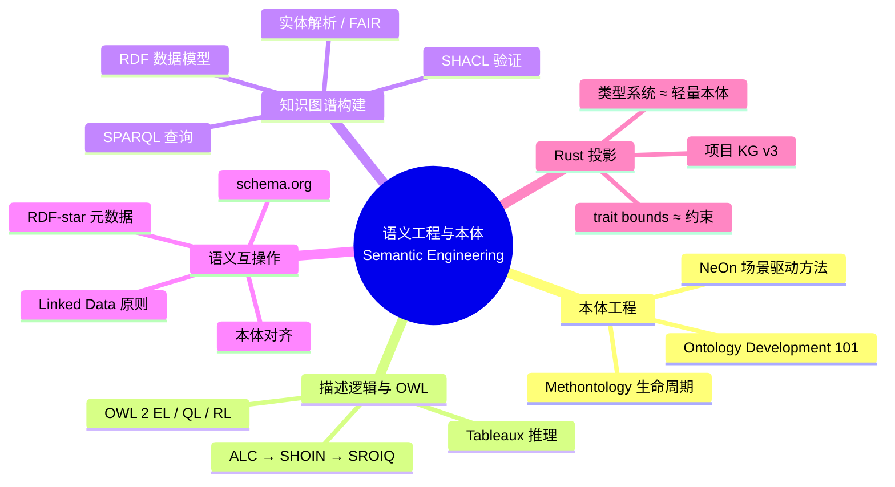

> **内容分级**: [专家级]

# 语义工程与本体（Semantic Engineering and Ontology）

> **EN**: Semantic Engineering and Ontology
> **Summary**: Methodologies for designing, formalizing, constructing, and interoperating semantic artifacts—ontologies, description logics, knowledge graphs, and Linked Data—and their lightweight projections onto Rust's type system and project KG.

> **Rust 版本**: 1.97.0+ (Edition 2024)
> **Bloom 层级**: L4-L5
> **权威来源**: 本目录为 `concept/` 权威层；与 `00_meta/00_framework/semantic_space.md`、`00_meta/knowledge_topology/kg_ontology_v2.md` 形成「工程方法 → 表征框架 → 形式本体」三层支撑结构。
> **定位**: 从**语义工程**角度回答：如何为 Rust 知识体系设计、构建、验证和维护可机器消费的语义资产？
> **前置概念**: [L4 形式化理论层](../README.md) · [知识图谱本体 v2](../../00_meta/knowledge_topology/kg_ontology_v2.md) · [语义空间](../../00_meta/00_framework/semantic_space.md)
> **后置概念**: [本体工程](01_ontology_engineering.md) · [描述逻辑与 OWL](02_description_logic_and_owl.md) · [知识图谱构建](03_knowledge_graph_construction.md) · [语义互操作](04_semantic_interoperability.md)

---

## 📑 目录

- [语义工程与本体（Semantic Engineering and Ontology）](#语义工程与本体semantic-engineering-and-ontology)
  - [📑 目录](#-目录)
  - [一、目录定位](#一目录定位)
  - [二、计划文件清单](#二计划文件清单)
  - [三、国际权威来源索引](#三国际权威来源索引)
  - [四、与 semantic\_space.md 的关系](#四与-semantic_spacemd-的关系)
  - [五、与 kg\_ontology\_v2.md 的关系](#五与-kg_ontology_v2md-的关系)
  - [六、🧭 思维导图（Mindmap）](#六-思维导图mindmap)
  - [七、反命题与边界](#七反命题与边界)
    - [反命题："有了 schema.org 标注就等于建了知识图谱"](#反命题有了-schemaorg-标注就等于建了知识图谱)
    - [反命题："本体工程只是给概念分分类"](#反命题本体工程只是给概念分分类)

---

## 一、目录定位

`concept/04_formal/` 的其它目录聚焦于**Rust 内部机制**的形式语义（类型论、所有权逻辑、操作语义、模型检验等）。本目录则上浮一层，关注**如何工程化地构建和维护这些概念的形式化表征**：

1. 如何用本体工程方法定义概念的类、属性、关系与约束？
2. 如何用描述逻辑 / OWL 表达概念之间的可判定推理关系？
3. 如何用 RDF / SPARQL / SHACL 构造可验证的知识图谱？
4. 如何用 Linked Data 与 schema.org 实现跨系统、跨语言的语义互操作？

Rust 投影层面，本目录把**类型系统**视为一种轻量级闭世界本体语言，把**trait bounds**视为约束表达，把**项目 KG v3** 视为工程化语义资产的实例。

---

## 二、计划文件清单

| # | 文件 | 主题 | 状态 |
|---:|---|---|---|
| 01 | `01_ontology_engineering.md` | 本体工程方法论：Ontology Development 101、Methontology、NeOn | ✅ 已创建 |
| 02 | `02_description_logic_and_owl.md` | 描述逻辑（ALC、SHOIN、SROIQ）与 OWL 2 profiles | ✅ 已创建 |
| 03 | `03_knowledge_graph_construction.md` | RDF/SPARQL/SHACL、知识图谱构建、实体解析、FAIR 原则 | ✅ 已创建 |
| 04 | `04_semantic_interoperability.md` | Linked Data、schema.org、本体对齐、RDF-star | ✅ 已创建 |
| 05 | `05_knowledge_graph_reasoning.md` | 知识图谱推理：本体推理、规则推理、Rust 投影 | ✅ 已创建 |
| 06 | `06_ai_ontology_and_rust_semantics.md` | AI 本体论 × Rust 语义工程（GraphRAG、Neuro-Symbolic、安全关键本体） | ✅ 已创建 |
| 07 | `07_kg_owl_shacl_semantics.md` | KG 的 OWL/SHACL 语义形式化 | ✅ 已创建 |

---

## 三、国际权威来源索引

- **P1 方法论**: Noy, N. F. & McGuinness, D. L. *Ontology Development 101: A Guide to Creating Your First Ontology*. Stanford KSL, 2001.
- **P1 方法论**: Fernández-López, M.; Gómez-Pérez, A. & Juristo, N. *Methontology: From Ontological Art Towards Ontological Engineering*. Proc. AAAI 1997.
- **P1 方法论**: Suárez-Figueroa, M. C. et al. (eds.) *NeOn Methodology for Building Ontology Networks*. Springer, 2012.
- **P1 形式化**: Baader, F.; Calvanese, D.; McGuinness, D.; Nardi, D. & Patel-Schneider, P. (eds.) *The Description Logic Handbook*. Cambridge University Press, 2nd ed., 2007.
- **P0 标准**: W3C. *RDF 1.2 Concepts and Abstract Syntax*. W3C Recommendation.
- **P0 标准**: W3C. *SPARQL 1.1 Overview*. W3C Recommendation.
- **P0 标准**: W3C. *SHACL — Shapes Constraint Language*. W3C Recommendation.
- **P0 标准**: W3C. *OWL 2 Web Ontology Language*. W3C Recommendation.
- **P2 生态**: schema.org — *Schemas for Structured Data on the Internet*.
- **P1 上层本体**: Arp, R.; Smith, B. & Spear, A. D. *Building Ontologies with Basic Formal Ontology (BFO 2020)*. MIT Press, 2015/2020.

---

## 四、与 semantic_space.md 的关系

`concept/00_meta/00_framework/semantic_space.md` 定义了 Rust 知识体系的**多维语义坐标**（层、Bloom 认知层级、来源、版本、交叉域）。本目录提供的是**建造和维护该空间的方法论与工具链**：

```text
semantic_space.md § 语义框架
    └── 语义工程层（本目录）
            ├── 本体工程：概念定义、类层次、属性约束
            ├── 描述逻辑 / OWL：可判定推理与一致性
            ├── 知识图谱构建：RDF/SPARQL/SHACL
            └── 语义互操作：Linked Data、schema.org、RDF-star
```

简言之：`semantic_space.md` 是“地图”，本目录是“制图学”。

---

## 五、与 kg_ontology_v2.md 的关系

`concept/00_meta/knowledge_topology/kg_ontology_v2.md` 是项目知识图谱的**形式本体规范**（RDF 1.2 / RDF-star / SKOS / SHACL）。本目录的本体工程与 KG 构建页是该规范落地的**工程方法说明**：

- 如何依据 Methontology / NeOn 方法重新评估 `ex:Concept`、`ex:Theory`、`ex:Property` 等类的边界？
- 如何用 SHACL 验证 `kg_data_v3.json` 中的每个实体都满足 `skos:prefLabel` 与 `ex:confidence` 约束？
- 如何用 SPARQL 查询 `ex:dependsOn` 关系的传递闭包，以发现概念间的隐藏依赖环？

---

## 六、🧭 思维导图（Mindmap）



> **认知功能**: 本 mindmap 把语义工程的四个方法论领域并列展示，并标明它们与 Rust 知识体系的工程映射关系，帮助读者从「造本体」到「用本体」建立整体视图。

---

## 七、反命题与边界

### 反命题："有了 schema.org 标注就等于建了知识图谱"

schema.org 标注（例如网页中的 JSON-LD）只是**实例层标注**；知识图谱还需要**统一标识符（URI）、可链接关系、可查询模式、可验证形状**。标注是入口，不是终点。

### 反命题："本体工程只是给概念分分类"

分类（taxonomy）只是本体工程的一个产出。完整的本体工程还需要定义**属性、约束、推理规则、应用能力问题（competency questions）**以及演化治理流程。缺少约束与推理能力的分类只是标签云。

> **相关文件**: [本体工程](01_ontology_engineering.md) · [描述逻辑与 OWL](02_description_logic_and_owl.md) · [知识图谱构建](03_knowledge_graph_construction.md) · [语义互操作](04_semantic_interoperability.md)
>
> **文档版本**: 1.0 ｜ **最后更新**: 2026-07-28 ｜ **状态**: ✅ 新建（Rust 1.97 对齐）
