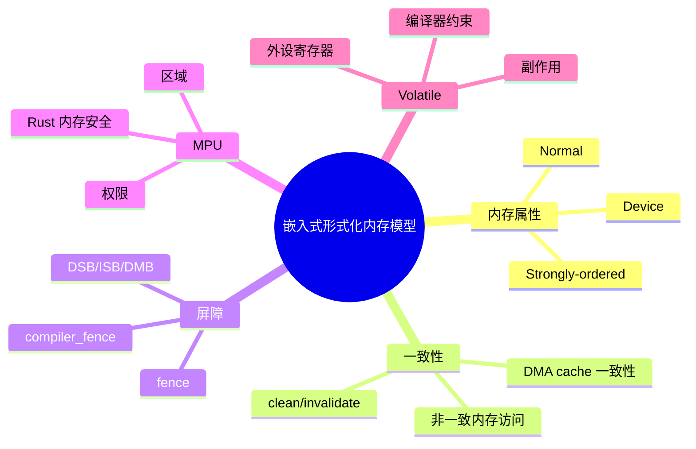

> **内容分级**: [研究者级]
> **代码状态**: ⚠️ 含平台相关与形式化示意代码，host 平台无法直接编译
> **定理链**: N/A — 教学类比形式化
>
# 嵌入式形式化内存模型
>
> **EN**: Embedded Formal Memory Model
> **Summary**: Device memory attributes (Device/Normal/Strongly-ordered), DMA/cache coherence, fence/compiler_fence, MPU regions and Rust memory safety, and the formalization of volatile peripheral-register semantics.
> **Rust 版本**: 1.97.0+ (Edition 2024)
>
> **受众**: [研究者]
> **Bloom 层级**: L5
> **权威来源**: 本文件为 `concept/` 权威页。
> **A/S/P 标记**: **P** — Procedure
> **双维定位**: P×Ana — 形式化分析嵌入式内存访问的可见性与安全性
> **前置概念**: [内存模型](../../04_formal/07_concurrency_semantics/02_linearizability_and_consistency.md) · [Unsafe Rust](../../03_advanced/02_unsafe/01_unsafe.md) · [裸机启动与链接脚本](../../06_ecosystem/05_systems_and_embedded/13_bare_metal_boot_linker_script.md)
> **后置概念**: [no_std 同步原语](../../06_ecosystem/05_systems_and_embedded/15_no_std_synchronization_primitives.md) · [PAC 与 HAL 实现](../../06_ecosystem/05_systems_and_embedded/17_pac_hal_implementation.md) · [嵌入式内存分配器](../../06_ecosystem/05_systems_and_embedded/16_embedded_memory_allocators.md)

---

> **来源**: [ARMv7-M Architecture Reference Manual](https://developer.arm.com/documentation/ddi0403/latest/) · [ARMv8-M Architecture Reference Manual](https://developer.arm.com/documentation/ddi0553/latest/) · [Rust Reference — Volatile](https://doc.rust-lang.org/reference/behavior-not-considered-unsafe.html#invalid-data) · [Rust Atomics and Locks](https://marabos.nl/atomics/) · [Ferrocene Language Specification](https://spec.ferrocene.dev/) · [RustBelt](https://plv.mpi-sws.org/rustbelt/) · [Tock Book](https://book.tockos.org/) · [The Embedonomicon](https://docs.rust-embedded.org/embedonomicon/) · [cortex-m crate](https://docs.rs/cortex-m/) · [critical-section crate](https://docs.rs/critical-section/) · [Rust Embedded WG](https://github.com/rust-embedded/wg)

---

## 🧠 知识结构图



## 📑 目录

- [嵌入式形式化内存模型](#嵌入式形式化内存模型)
  - [🧠 知识结构图](#-知识结构图)
  - [📑 目录](#-目录)
  - [一、权威定义](#一权威定义)
  - [二、ARM 内存属性](#二arm-内存属性)
    - [2.1 Normal Memory](#21-normal-memory)
    - [2.2 Device Memory](#22-device-memory)
    - [2.3 Strongly-ordered Memory](#23-strongly-ordered-memory)
  - [三、DMA 与 Cache 一致性](#三dma-与-cache-一致性)
  - [四、内存屏障：`fence` / `compiler_fence`](#四内存屏障fence--compiler_fence)
    - [4.1 `compiler_fence`](#41-compiler_fence)
    - [4.2 `core::sync::atomic::fence`](#42-coresyncatomicfence)
  - [五、MPU 区域与 Rust 内存安全](#五mpu-区域与-rust-内存安全)
  - [六、外设寄存器 volatile 语义形式化](#六外设寄存器-volatile-语义形式化)
  - [七、反例与失效模式](#七反例与失效模式)
  - [八、边界测试](#八边界测试)
    - [8.1 边界测试：普通读写设备寄存器](#81-边界测试普通读写设备寄存器)
    - [8.2 边界测试：DMA 缓冲区未做 cache 维护](#82-边界测试dma-缓冲区未做-cache-维护)
  - [九、相关概念](#九相关概念)
  - [🧭 思维导图（Mindmap）](#-思维导图mindmap)

---

## 一、权威定义

> **ARMv8-M Architecture Reference Manual**: Memory types define the permitted behavior of the memory system for accesses to a region. The memory types are Normal, Device, and Strongly-ordered.

**设备内存属性（Device/Normal/Strongly-ordered）**：ARM 架构对地址空间访问语义的分类。Normal Memory 允许缓存、预取和乱序访问；Device Memory 禁止缓存但允许有限重排；Strongly-ordered Memory 保证严格的程序顺序。

**嵌入式形式化内存模型**：把裸机程序对内存映射 I/O、DMA 缓冲区和 MPU 区域的访问抽象为具有可见性、顺序和权限约束的形式化结构，以解释 Rust `unsafe` 代码为何必须遵守 `volatile`、`fence` 和 cache 维护等规则。

判定依据：Rust 的内存安全模型主要描述堆/栈/静态内存的别名规则；设备寄存器、DMA 和 cache 的副作用超出该模型，需要额外形式化约束来保证正确性。

---

## 二、ARM 内存属性

### 2.1 Normal Memory

- 可缓存（cacheable）或不可缓存；
- 允许处理器对访问进行重排序、合并、预取；
- 适用于 RAM、Flash（只读 Normal）。

### 2.2 Device Memory

- 不可缓存，访问会到达外设；
- 禁止预取和跨访问合并；
- 允许有限重排（例如 Device-GRE、Device-nGRE 等子属性）。

### 2.3 Strongly-ordered Memory

- 不可缓存；
- 严格按程序顺序执行；
- 适用于系统控制寄存器、中断控制器等必须顺序访问的区域。

| 属性 | 缓存 | 预取 | 重排 | 典型用途 |
|:---|:---|:---|:---|:---|
| Normal | 可 | 可 | 可 | RAM、Flash |
| Device | 否 | 否 | 有限 | 外设寄存器 |
| Strongly-ordered | 否 | 否 | 否 | 系统控制寄存器 |

判定依据：把外设寄存器错误地标记为 Normal 会导致缓存或预取，从而丢失寄存器访问的副作用；这是 MPU/内存映射配置中的常见错误。

---

## 三、DMA 与 Cache 一致性

当 CPU 与 DMA 共享 RAM 缓冲区时，若 CPU 侧启用 cache，必须显式维护一致性：

- **CPU 写入后启动 DMA**：先 `clean` cache（把脏数据写回 RAM）；
- **DMA 写入后 CPU 读取**：先 `invalidate` cache（丢弃 cache 中的旧数据）。

```rust,ignore
use cortex_m::peripheral::SCB;

static mut DMA_BUF: [u8; 256] = [0; 256];

fn prepare_dma_tx() {
    unsafe {
        // CPU 填充缓冲区
        DMA_BUF.fill(0xAA);
        // 清 cache，使 DMA 看到最新数据
        SCB::clean_dcache_by_slice(&DMA_BUF);
    }
}

fn after_dma_rx() {
    unsafe {
        // DMA 写入后使 cache 失效
        SCB::invalidate_dcache_by_slice(&DMA_BUF);
        // 现在 CPU 读取的是 DMA 写入的数据
    }
}
```

判定依据：缺失 cache 维护会导致 DMA 读到旧数据或 CPU 读到 DMA 未写入的 cache 旧值；这类错误通常不会触发 fault，只会产生静默数据损坏。

---

## 四、内存屏障：`fence` / `compiler_fence`

### 4.1 `compiler_fence`

`core::sync::atomic::compiler_fence` 阻止编译器重排内存访问，但不生成 CPU 内存屏障指令。适用于单核上与外设寄存器交互、需要保证代码生成顺序的场景。

```rust,ignore
use core::sync::atomic::compiler_fence;
use core::sync::atomic::Ordering;

fn trigger_dma() {
    // 配置 DMA 寄存器
    configure_dma();
    compiler_fence(Ordering::SeqCst);
    // 使能 DMA
    enable_dma();
}
```

### 4.2 `core::sync::atomic::fence`

`fence(Ordering::SeqCst)` 既阻止编译器重排，也生成硬件内存屏障指令（ARM 上的 `DMB`/`DSB`），用于多核或多主设备之间同步。

```rust,ignore
use core::sync::atomic::{fence, Ordering};

static READY: AtomicBool = AtomicBool::new(false);

// 核 0
unsafe { *DATA.get() = 42; }
fence(Ordering::Release);
READY.store(true, Ordering::Relaxed);

// 核 1
while !READY.load(Ordering::Relaxed) {}
fence(Ordering::Acquire);
let v = unsafe { *DATA.get() };
```

判定依据：单核裸机中 `compiler_fence` 通常足够；涉及 DMA、cache 或多核时必须使用 `fence` 或显式 cache 维护指令。

---

## 五、MPU 区域与 Rust 内存安全

MPU（Memory Protection Unit）把地址空间划分为若干区域，分别设置读/写/执行权限。Rust 的内存安全在 MPU 协助下可以：

- 把栈标记为不可执行，防止代码注入；
- 把只读数据段标记为只读，防止意外写入；
- 检测空指针/越界访问（通过配置 background region 为 no-access）。

但 MPU 是**运行时**机制，Rust 编译器的借用检查器无法感知 MPU 配置；两者是互补而非替代关系。

```rust,ignore
// MPU 区域配置示意
fn mpu_configure_region(region: u8, base: u32, size: u32, attr: u32) {
    let mpu = unsafe { &*cortex_m::peripheral::MPU::ptr() };
    mpu.rnr.write(|w| unsafe { w.region().bits(region) });
    mpu.rbar.write(|w| unsafe { w.bits(base) });
    mpu.rasr.write(|w| unsafe { w.bits(attr) });
}
```

判定依据：MPU 可以在硬件层面捕获某些 Rust unsafe 错误（如写入只读区），但不能捕获所有别名违规；Rust 的内存安全仍需由类型系统和 unsafe 契约保证。

---

## 六、外设寄存器 volatile 语义形式化

可以把外设寄存器访问形式化为一个状态机：

- 寄存器 `R` 是地址 `A` 处的副作用单元；
- 普通加载/存储语义不能描述 `R`，因为读取 `R` 可能清除中断标志，写入 `R` 可能触发硬件动作；
- `volatile_read`/`volatile_write` 引入**不可省略、不可重排、不可合并**的访问约束。

形式化直觉：

```text
Normal load/store 语义:
  ⟹ 允许省略、合并、重排（只要数据依赖保持）

Volatile load/store 语义:
  ⟹ 每个 volatile 访问都是可观察事件 O_i
  ⟹ 程序顺序中 O_i ≺ O_{i+1} 不能被编译器或处理器破坏
  ⟹ 对同一地址的连续写不能合并；读不能预取或省略
```

```rust,ignore
// 使用 volatile 读写外设寄存器
let gpioa_odr = 0x4002_0014 as *mut u32;
unsafe { core::ptr::write_volatile(gpioa_odr, 1 << 5); }
let idr = unsafe { core::ptr::read_volatile(0x4002_0010 as *const u32) };
```

判定依据：所有内存映射 I/O 必须通过 `volatile` 访问；普通读写会被编译器优化掉或重排，导致外设行为不可预测。

---

## 七、反例与失效模式

| 失效模式 | 根因 | 修复方向 |
|:---|:---|:---|
| 外设寄存器读被优化掉 | 使用普通 `*ptr` 而非 `read_volatile` | 使用 `core::ptr::read_volatile` |
| 寄存器写入顺序被重排 | 缺少 `compiler_fence` 或 `fence` | 在关键位置插入屏障 |
| DMA 读到旧数据 | cache 未 clean | DMA 前调用 `SCB::clean_dcache_by_slice` |
| CPU 读到 DMA 旧数据 | cache 未 invalidate | DMA 后调用 `SCB::invalidate_dcache_by_slice` |
| 外设区被配置为 Normal | MPU/内存映射属性错误 | 配置为 Device 或 Strongly-ordered |
| 多核共享标志不同步 | 只使用 `compiler_fence` | 使用 `fence(Ordering::Acquire/Release)` |

---

## 八、边界测试

### 8.1 边界测试：普通读写设备寄存器

```rust,ignore
#![no_std]

const GPIOA_ODR: *mut u32 = 0x4002_0014 as *mut u32;

fn set_led() {
    // ❌ 错误：普通写可能被编译器优化或重排
    unsafe { *GPIOA_ODR = 1 << 5; }
}
```

> **修正**：

```rust,ignore
unsafe { core::ptr::write_volatile(GPIOA_ODR, 1 << 5); }
```

### 8.2 边界测试：DMA 缓冲区未做 cache 维护

```rust,ignore
static mut DMA_BUF: [u8; 256] = [0; 256];

fn start_dma() {
    unsafe { DMA_BUF.fill(0xAA); }
    // ❌ 错误：未 clean cache
    start_dma_transfer(DMA_BUF.as_ptr());
}
```

> **修正**：

```rust,ignore
unsafe {
    DMA_BUF.fill(0xAA);
    cortex_m::peripheral::SCB::clean_dcache_by_slice(&DMA_BUF);
}
start_dma_transfer(unsafe { DMA_BUF.as_ptr() });
```

---

## 九、相关概念

- [裸机启动与链接脚本](../../06_ecosystem/05_systems_and_embedded/13_bare_metal_boot_linker_script.md)
- [Cortex-M 异常模型](../../06_ecosystem/05_systems_and_embedded/14_interrupt_and_exception_model.md)
- [no_std 同步原语](../../06_ecosystem/05_systems_and_embedded/15_no_std_synchronization_primitives.md)
- [PAC 与 HAL 实现](../../06_ecosystem/05_systems_and_embedded/17_pac_hal_implementation.md)
- [Unsafe Rust](../../03_advanced/02_unsafe/01_unsafe.md)
- [线性化与一致性](../../04_formal/07_concurrency_semantics/02_linearizability_and_consistency.md)

---

> **权威来源**: [ARMv7-M Architecture Reference Manual](https://developer.arm.com/documentation/ddi0403/latest/) · [ARMv8-M Architecture Reference Manual](https://developer.arm.com/documentation/ddi0553/latest/) · [Rust Reference — Volatile](https://doc.rust-lang.org/reference/behavior-not-considered-unsafe.html#invalid-data) · [Rust Atomics and Locks](https://marabos.nl/atomics/) · [Ferrocene Language Specification](https://spec.ferrocene.dev/) · [RustBelt](https://plv.mpi-sws.org/rustbelt/) · [Tock Book](https://book.tockos.org/) · [The Embedonomicon](https://docs.rust-embedded.org/embedonomicon/)
>
> **权威来源对齐变更日志**: 2026-07-30 创建

**文档版本**: 1.0
**最后更新**: 2026-07-30
**状态**: ✅ 概念文件创建完成

---

## 🧭 思维导图（Mindmap）


> **认知功能**: 本 mindmap 从本页「嵌入式形式化内存模型」的章节结构提炼，一级分支对应核心主题，叶子节点为关键子概念，可作为本页的快速导航与复习索引。
