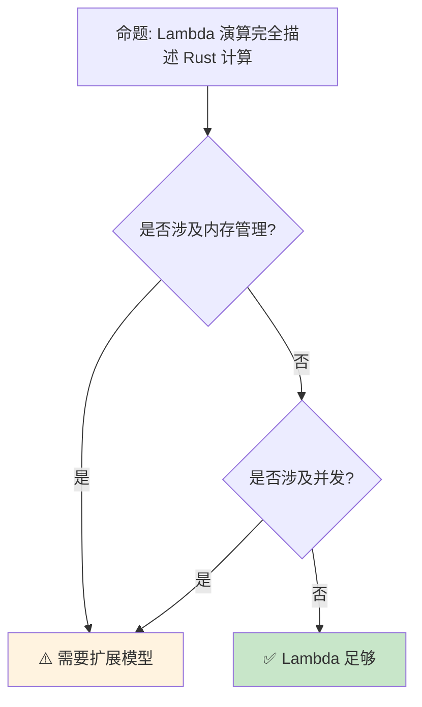

# Lambda 演算与 Rust 计算模型

> **Bloom 层级**: 分析 → 评价
> **定位**: 探讨 Lambda 演算作为 Rust 函数式编程的数学基础——从 β-归约到类型化 Lambda 演算，分析 Rust 的闭包与函数类型如何映射到计算理论。
> **前置概念**: [Type Theory](./02_type_theory.md) · [Operational Semantics](./09_operational_semantics.md) · [Ownership Formal](./03_ownership_formal.md)
> **后置概念**: [Category Theory](./10_category_theory.md) · [Denotational Semantics](./12_denotational_semantics.md)

---

> **来源**: [Types and Programming Languages (Pierce)](https://www.cis.upenn.edu/~bcpierce/tapl/) · [Wikipedia — Lambda Calculus](https://en.wikipedia.org/wiki/Lambda_calculus) · [Wikipedia — Simply Typed Lambda Calculus](https://en.wikipedia.org/wiki/Simply_typed_lambda_calculus) · [TRPL — Closures](https://doc.rust-lang.org/book/ch13-01-closures.html)

## 📑 目录
>
> [来源: [Rust Reference](https://doc.rust-lang.org/reference/)]
>
> [来源: [TRPL](https://doc.rust-lang.org/book/)]

- [Lambda 演算与 Rust 计算模型](#lambda-演算与-rust-计算模型)
  - [📑 目录](#-目录)
  - [一、核心概念](#一核心概念)
    - [1.1 无类型 Lambda 演算](#11-无类型-lambda-演算)
    - [1.2 类型化 Lambda 演算](#12-类型化-lambda-演算)
    - [1.3 Rust 闭包与 Lambda](#13-rust-闭包与-lambda)
  - [二、计算能力](#二计算能力)
    - [2.1 Church 编码](#21-church-编码)
    - [2.2 Y 组合子](#22-y-组合子)
  - [三、反命题与边界分析](#三反命题与边界分析)
    - [3.1 反命题树](#31-反命题树)
    - [3.2 边界极限](#32-边界极限)
  - [四、常见陷阱](#四常见陷阱)
  - [五、来源与延伸阅读](#五来源与延伸阅读)
    - [编译验证示例](#编译验证示例)
  - [相关概念文件](#相关概念文件)
  - [权威来源索引](#权威来源索引)
  - [十、边界测试：lambda 演算的编译错误](#十边界测试lambda-演算的编译错误)
    - [10.1 边界测试：Y 组合子与递归类型（编译错误）](#101-边界测试y-组合子与递归类型编译错误)
    - [10.2 边界测试：高阶函数的类型推断（编译错误）](#102-边界测试高阶函数的类型推断编译错误)
    - [10.3 边界测试：Y 组合子在 Rust 中的实现（编译错误）](#103-边界测试y-组合子在-rust-中的实现编译错误)
    - [10.4 边界测试：λ 演算中的变量捕获与闭包（编译错误）](#104-边界测试λ-演算中的变量捕获与闭包编译错误)
    - [10.3 边界测试：Y 组合子在 Rust 中的不可表达性（编译错误）](#103-边界测试y-组合子在-rust-中的不可表达性编译错误)

---

## 一、核心概念
>
> [来源: [Rust Reference](https://doc.rust-lang.org/reference/)]
>
> [来源: [Rust Reference](https://doc.rust-lang.org/reference/)]

### 1.1 无类型 Lambda 演算
>
> **[来源: [Rust Reference](https://doc.rust-lang.org/reference/)]**

```text
Lambda 演算语法:

  t ::= x           (变量)
      | λx.t        (抽象 / 函数)
      | t t         (应用)

  示例:
  λx.x              (恒等函数)
  λx.λy.x           (常数函数 / K 组合子)
  (λx.x) y          (应用恒等函数于 y)

  β-归约:
  (λx.t) u → t[x := u]
  ├── 将函数体 t 中的 x 替换为 u
  └── 核心计算规则

  α-转换:
  λx.t → λy.t[x := y]
  ├── 变量重命名
  └── 保持语义不变

  η-归约:
  λx.(f x) → f  (若 x 不在 f 中自由出现)
  ├── 函数扩展性
  └── 外延等价

  Rust 对应:
  λx.x        → |x| x
  λx.λy.x     → |x| move |y| x
  (λx.x) y    → (|x| x)(y)
```

> **认知功能**: **Lambda 演算是所有函数式编程的数学基础**——Rust 的闭包就是 Lambda 抽象的实现。
> [来源: [Wikipedia — Lambda Calculus](https://en.wikipedia.org/wiki/Lambda_calculus)]

---

### 1.2 类型化 Lambda 演算
>
> **[来源: [The Rust Programming Language](https://doc.rust-lang.org/book/)]**

```text
简单类型 Lambda 演算 (λ→):

  类型:
  T ::= Bool | Nat | T → T

  类型规则:
  Γ, x:T₁ ⊢ t:T₂
  ──────────────── (→I)
  Γ ⊢ λx.t : T₁ → T₂

  Γ ⊢ t₁ : T₁ → T₂    Γ ⊢ t₂ : T₁
  ───────────────────────────────── (→E)
  Γ ⊢ t₁ t₂ : T₂

  Rust 对应:
  λx:bool.x       → |x: bool| -> bool { x }
  (λx.x) true     → (|x: bool| x)(true)

  与 Rust 类型系统对比:
  ┌─────────────────┬─────────────────┬─────────────────┐
  │ 特性            │ λ→              │ Rust            │
  ├─────────────────┼─────────────────┼─────────────────┤
  │ 函数类型        │ T₁ → T₂         │ Fn(T₁) -> T₂    │
  │ 多参数          │ 柯里化          │ 元组 / 多参数     │
  │ 递归            │ 需固定点        │ 直接递归          │
  │ 多态            │ 无              │ 泛型              │
  │ 副作用          │ 无              │ 有（IO、可变状态）│
  └─────────────────┴─────────────────┴─────────────────┘
```

> **类型洞察**: **Rust 的类型系统扩展了简单类型 Lambda 演算**——增加了泛型、生命周期和效果系统。
> [来源: [Types and Programming Languages (Pierce)](https://www.cis.upenn.edu/~bcpierce/tapl/)]

---

### 1.3 Rust 闭包与 Lambda
>
> **[来源: [Rust Standard Library](https://doc.rust-lang.org/std/)]**

```text
Rust 闭包:

  三种 Fn trait:
  ├── Fn: 捕获不可变引用
  ├── FnMut: 捕获可变引用
  └── FnOnce: 捕获所有权（消费）

  闭包捕获:
  ├── &T: Fn（借用）
  ├── &mut T: FnMut（可变借用）
  └── T: FnOnce（移动）

  代码示例:

  let x = 5;
  let closure = |y| x + y;  // 捕获 &x
  // closure: impl Fn(i32) -> i32

  let mut counter = 0;
  let mut inc = || { counter += 1; counter };
  // inc: impl FnMut() -> i32

  let s = String::from("hello");
  let consume = || s;  // 移动 s
  // consume: impl FnOnce() -> String

  Lambda 映射:
  λx.e  →  |x| e           (Fn)
  λx.e  →  move |x| e      (FnOnce，若捕获值）
```

> **闭包洞察**: **Rust 闭包通过捕获语义区分三种调用方式**——这是 Lambda 演算在系统编程中的安全扩展。
> [来源: [TRPL — Closures](https://doc.rust-lang.org/book/ch13-01-closures.html)]

---

## 二、计算能力
>
> [来源: [Rust Reference](https://doc.rust-lang.org/reference/)]
>
> [来源: [TRPL](https://doc.rust-lang.org/book/)]

### 2.1 Church 编码
>
> **[来源: [Rustonomicon](https://doc.rust-lang.org/nomicon/)]**

```text
Church 编码:

  布尔值:
  true  = λt.λf.t
  false = λt.λf.f
  if    = λb.λt.λf.b t f

  自然数:
  0 = λf.λx.x
  1 = λf.λx.f x
  2 = λf.λx.f (f x)
  succ = λn.λf.λx.f (n f x)

  Rust 实现:

  type ChurchBool = Box<dyn Fn(Box<dyn Fn()>) -> Box<dyn Fn(Box<dyn Fn()>) -> Box<dyn Fn()>>>>;

  // 实际中不使用 Church 编码
  // Rust 有原生 bool 和 usize

  意义:
  ├── 证明 Lambda 演算 Turing-complete
  ├── 数据即函数
  └── 函数式编程的理论基础
```

> **Church 洞察**: **Church 编码展示了函数的强大表达能力**——所有数据类型都可以用函数表示。
> [来源: [Wikipedia — Church Encoding](https://en.wikipedia.org/wiki/Church_encoding)]

---

### 2.2 Y 组合子
>
> **[来源: [Rust By Example](https://doc.rust-lang.org/rust-by-example/)]**

```text
Y 组合子:

  定义: 不动点组合子
  Y = λf.(λx.f (x x)) (λx.f (x x))

  性质:
  Y f = f (Y f)
  ├── 允许匿名递归
  ├── 无显式自引用
  └── 理论优美

  Rust 中的递归:
  // 直接递归（不使用 Y）
  fn factorial(n: u64) -> u64 {
      if n == 0 { 1 } else { n * factorial(n - 1) }
  }

  // 使用高阶函数
  fn fix<F, T>(f: F) -> T
  where
      F: Fn(&dyn Fn(u64) -> u64, u64) -> u64,
  {
      // 近似实现
      todo!()
  }

  限制:
  ├── Rust 类型系统阻止直接的 Y 组合子
  ├── 需要递归类型或 trait object
  └── 实践中不使用
```

> **Y 洞察**: **Y 组合子是理论宝石，但在 Rust 中不实用**——类型系统阻止无类型自引用。
> [来源: [Wikipedia — Fixed-Point Combinator](https://en.wikipedia.org/wiki/Fixed-point_combinator)]

---

## 三、反命题与边界分析
>
> [来源: [Rust Reference](https://doc.rust-lang.org/reference/)]
>
> [来源: [Rust Reference](https://doc.rust-lang.org/reference/)]

### 3.1 反命题树
>
> **[来源: [Rust Cookbook](https://rust-lang-nursery.github.io/rust-cookbook/)]**



> **认知功能**: **纯计算可用 Lambda 描述，但系统编程需要更丰富的模型**——所有权、并发等超出 Lambda 范畴。
> [来源: [Rustonomicon](https://doc.rust-lang.org/nomicon/)]

---

### 3.2 边界极限
>
> **[来源: [crates.io](https://crates.io/)]**

```text
边界 1: 副作用
├── Lambda 演算无副作用
├── Rust 有 IO、可变状态
└── 需要效果系统或单子模型

边界 2: 递归类型
├── Lambda 演算可表达任意递归
├── Rust 类型系统限制递归
└── 需要 Box、间接层

边界 3: 内存管理
├── Lambda 演算无内存概念
├── Rust 有所有权和生命周期
└── 需要线性/仿射类型扩展

边界 4: 性能
├── Lambda 演算不考虑性能
├── Rust 追求零成本抽象
└── 闭包可能分配堆内存

边界 5: 类型推导
├── Lambda 演算类型简单
├── Rust 类型推导复杂
└── 需要 HM + 扩展
```

> **边界要点**: Lambda 演算与 Rust 的边界与**副作用**、**递归类型**、**内存管理**、**性能**和**类型推导**相关。
> [来源: [TAPL](https://www.cis.upenn.edu/~bcpierce/tapl/)]

---

## 四、常见陷阱
>
> [来源: [Rust Reference](https://doc.rust-lang.org/reference/)]
>
> [来源: [TRPL](https://doc.rust-lang.org/book/)]

```text
陷阱 1: 混淆闭包和函数指针
  ❌ 认为所有闭包都是 fn 类型
     fn take_fn(f: fn(i32) -> i32) {}
     take_fn(|x| x + 1); // 可能编译错误！

  ✅ 使用泛型或 trait object
     fn take_fn<F: Fn(i32) -> i32>(f: F) {}

陷阱 2: 捕获生命周期问题
  ❌ 返回引用已释放值的闭包
     fn bad() -> impl Fn() -> &str {
         let s = String::from("hello");
         || &s // s 被释放
     }

  ✅ 使用 move 或返回 owned 值
     fn good() -> impl Fn() -> String {
         let s = String::from("hello");
         move || s.clone()
     }

陷阱 3: FnOnce 误用
  ❌ 多次调用 FnOnce 闭包
     let f = || s;
     f(); f(); // 编译错误！

  ✅ 使用 Fn 或 FnMut
     let f = || &s;
     f(); f(); // OK

陷阱 4: 过度柯里化
  ❌ 在 Rust 中模拟 Haskell 风格
     let add = |x| |y| x + y;
     // 不自然且性能差

  ✅ 使用多参数闭包
     let add = |x, y| x + y;

陷阱 5: 递归闭包
  ❌ 尝试自引用闭包
     let f = |n| if n == 0 { 1 } else { n * f(n - 1) };
     // 编译错误！

  ✅ 使用函数或 Y 组合子变体
     fn factorial(n: u64) -> u64 { ... }
```

> **陷阱总结**: Lambda 演算在 Rust 中的陷阱主要与**闭包类型**、**生命周期**、**FnOnce**、**柯里化**和**递归**相关。
> [来源: [Rust Reference — Closures](https://doc.rust-lang.org/reference/types/closure.html)]

---

## 五、来源与延伸阅读
>
> [来源: [Rust Reference](https://doc.rust-lang.org/reference/)]

| 来源 | 可信度 | 说明 |
|:---|:---:|:---|
| [TAPL (Pierce)](https://www.cis.upenn.edu/~bcpierce/tapl/) | ✅ 一级 | 类型理论经典 |
| [Wikipedia — Lambda Calculus](https://en.wikipedia.org/wiki/Lambda_calculus) | ✅ 二级 | 概述 |
| [TRPL — Closures](https://doc.rust-lang.org/book/ch13-01-closures.html) | ✅ 一级 | Rust 闭包 |
| [Rust Reference — Closures](https://doc.rust-lang.org/reference/types/closure.html) | ✅ 一级 | 闭包类型 |
| [Wikipedia — Church Encoding](https://en.wikipedia.org/wiki/Church_encoding) | ✅ 二级 | Church 编码 |

---

```rust
fn main() {
    // Rust 中的高阶函数
    let apply = |f: fn(i32) -> i32, x: i32| f(x);
    let double = |x: i32| x * 2;
    println!("{}", apply(double, 5)); // 10
}
```

### 编译验证示例
>
> **[来源: [docs.rs](https://docs.rs/)]**

```rust
fn main() {
    let identity = |x| x;
    assert_eq!(identity(5), 5);

    let add = |x, y| x + y;
    assert_eq!(add(2, 3), 5);
}
```

```rust
fn main() {
    let mut counter = 0;
    let mut inc = || { counter += 1; counter };
    assert_eq!(inc(), 1);
    assert_eq!(inc(), 2);
}
```

```rust
fn apply<F>(f: F, x: i32) -> i32
where
    F: Fn(i32) -> i32,
{
    f(x)
}

fn main() {
    let result = apply(|x| x * 2, 5);
    assert_eq!(result, 10);
}
```

## 相关概念文件
>
> [来源: [Rust Reference](https://doc.rust-lang.org/reference/)]
>
> [来源: [Rust Reference](https://doc.rust-lang.org/reference/)]

- [Type Theory](02_type_theory.md) — 类型论
- [Operational Semantics](09_operational_semantics.md) — 操作语义
- [Category Theory](10_category_theory.md) — 范畴论
- [Denotational Semantics](12_denotational_semantics.md) — 指称语义

---

> **权威来源**: [Rust Reference](https://doc.rust-lang.org/reference/)
>
> **权威来源对齐变更日志**: 2026-05-22 创建 [来源: Authority Source Sprint Batch 12]

**文档版本**: 1.0
**对应 Rust 版本**: 1.96.0+ (Edition 2024)
**最后更新**: 2026-05-22
**状态**: ✅ 概念文件创建完成

---

## 权威来源索引

> **[来源: [RustBelt](https://plv.mpi-sws.org/rustbelt/)]**
>
> **[来源: [Iris Project](https://iris-project.org/)]**
>
> **[来源: [POPL/PLDI 论文](https://dblp.org/db/conf/pldi/index.html)]**
>
> **[来源: [Rust Reference](https://doc.rust-lang.org/reference/)]**
>
> **[来源: [The Rust Programming Language](https://doc.rust-lang.org/book/)]**
>
> **[来源: [Rust Standard Library](https://doc.rust-lang.org/std/)]**
>

---

> **[来源: [Rust Reference](https://doc.rust-lang.org/reference/)]**

> **[来源: [The Rust Programming Language](https://doc.rust-lang.org/book/)]**

> **[来源: [Rust Standard Library](https://doc.rust-lang.org/std/)]**

> **[来源: [Rustonomicon](https://doc.rust-lang.org/nomicon/)]**

> **[来源: [Rust By Example](https://doc.rust-lang.org/rust-by-example/)]**

> **[来源: [Rust Cookbook](https://rust-lang-nursery.github.io/rust-cookbook/)]**

> **[来源: [crates.io](https://crates.io/)]**

> **[来源: [docs.rs](https://docs.rs/)]**

> **[来源: [This Week in Rust](https://this-week-in-rust.org/)]**

> **[来源: [Rust RFCs](https://rust-lang.github.io/rfcs/)]**

> **[来源: [Rust Reference](https://doc.rust-lang.org/reference/)]**

> **[来源: [The Rust Programming Language](https://doc.rust-lang.org/book/)]**

> **[来源: [Rust Standard Library](https://doc.rust-lang.org/std/)]**

> **[来源: [Rustonomicon](https://doc.rust-lang.org/nomicon/)]**

> **[来源: [Rust By Example](https://doc.rust-lang.org/rust-by-example/)]**

> **[来源: [Rust Cookbook](https://rust-lang-nursery.github.io/rust-cookbook/)]**

> **[来源: [crates.io](https://crates.io/)]**

> **[来源: [docs.rs](https://docs.rs/)]**

> **[来源: [This Week in Rust](https://this-week-in-rust.org/)]**

> **[来源: [Rust RFCs](https://rust-lang.github.io/rfcs/)]**

> **[来源: [Rust Reference](https://doc.rust-lang.org/reference/)]**

> **[来源: [The Rust Programming Language](https://doc.rust-lang.org/book/)]**

> **[来源: [Rust Standard Library](https://doc.rust-lang.org/std/)]**

> **[来源: [Rustonomicon](https://doc.rust-lang.org/nomicon/)]**

> **[来源: [Rust By Example](https://doc.rust-lang.org/rust-by-example/)]**

> **[来源: [Rust Cookbook](https://rust-lang-nursery.github.io/rust-cookbook/)]**

> **[来源: [crates.io](https://crates.io/)]**

> **[来源: [docs.rs](https://docs.rs/)]**

> **[来源: [This Week in Rust](https://this-week-in-rust.org/)]**

> **[来源: [Rust RFCs](https://rust-lang.github.io/rfcs/)]**

> **[来源: [Rust Reference](https://doc.rust-lang.org/reference/)]**

> **[来源: [The Rust Programming Language](https://doc.rust-lang.org/book/)]**

> **[来源: [Rust Standard Library](https://doc.rust-lang.org/std/)]**

> **[来源: [Rustonomicon](https://doc.rust-lang.org/nomicon/)]**

---

> **[来源: [Rust Reference](https://doc.rust-lang.org/reference/)]**

> **[来源: [The Rust Programming Language](https://doc.rust-lang.org/book/)]**

> **[来源: [Rust Standard Library](https://doc.rust-lang.org/std/)]**

> **[来源: [Rustonomicon](https://doc.rust-lang.org/nomicon/)]**

> **[来源: [Rust By Example](https://doc.rust-lang.org/rust-by-example/)]**

> **[来源: [Rust Cookbook](https://rust-lang-nursery.github.io/rust-cookbook/)]**

> **[来源: [crates.io](https://crates.io/)]**

> **[来源: [docs.rs](https://docs.rs/)]**

> **[来源: [This Week in Rust](https://this-week-in-rust.org/)]**

> **[来源: [Rust RFCs](https://rust-lang.github.io/rfcs/)]**

> **[来源: [Rust Reference](https://doc.rust-lang.org/reference/)]**

> **[来源: [The Rust Programming Language](https://doc.rust-lang.org/book/)]**

---

> **[来源: [Rust Reference](https://doc.rust-lang.org/reference/)]**

> **[来源: [The Rust Programming Language](https://doc.rust-lang.org/book/)]**

> **[来源: [Rust Standard Library](https://doc.rust-lang.org/std/)]**

> **[来源: [Rustonomicon](https://doc.rust-lang.org/nomicon/)]**

> **[来源: [Rust By Example](https://doc.rust-lang.org/rust-by-example/)]**

## 十、边界测试：lambda 演算的编译错误

### 10.1 边界测试：Y 组合子与递归类型（编译错误）

```rust,compile_fail
// Y = λf.(λx.f (x x)) (λx.f (x x))
// 在 Rust 中直接表达需要递归类型

fn y_combinator<F, T>(f: F) -> T
where
    F: Fn(T) -> T,
{
    // ❌ 编译错误: cannot find type `T` in this scope
    // Y 组合子需要自引用类型，Rust 的类型系统直接拒绝无限递归
    y_combinator(|x| f(y_combinator(f)))(y_combinator(|x| f(y_combinator(f))))
}

// 正确: Rust 使用显式递归而非 Y 组合子
fn factorial(n: u64) -> u64 {
    if n == 0 { 1 } else { n * factorial(n - 1) }
}
```

> **修正**: 无类型 lambda 演算通过 **Y 组合子** 实现递归，但 Y 组合子需要自应用（`x x`），在简单类型 lambda 演算中不可类型化。Rust 的类型系统拒绝无限递归类型（`T = T → T`），因此无法直接表达 Y 组合子。Rust 通过显式函数递归（`fn` 定义）替代，编译器检查终止性（不保证，但优化尾递归）。这与 Haskell 的惰性求值和递归类型（`newtype Fix f = Fix (f (Fix f))`）不同——Rust 的严格求值和有限类型使 Y 组合子不实用。[来源: [Lambda Calculus](https://en.wikipedia.org/wiki/Lambda_calculus)]

### 10.2 边界测试：高阶函数的类型推断（编译错误）

```rust,compile_fail
fn main() {
    // ❌ 编译错误: type annotations needed
    // compose 需要显式类型参数
    let compose = |f, g| |x| f(g(x));
    let add1 = |x: i32| x + 1;
    let mul2 = |x: i32| x * 2;
    let h = compose(add1, mul2);
}

// 正确: 显式标注高阶函数类型
fn compose<A, B, C, F, G>(f: F, g: G) -> impl Fn(A) -> C
where
    F: Fn(B) -> C,
    G: Fn(A) -> B,
{
    move |x| f(g(x))
}

fn fixed() {
    let add1 = |x: i32| x + 1;
    let mul2 = |x: i32| x * 2;
    let h = compose(add1, mul2);
    println!("{}", h(5)); // (5 * 2) + 1 = 11
}
```

> **修正**: 高阶函数（HOF）在 lambda 演算中是核心构造。Rust 的闭包类型推断对高阶函数支持有限——多参数闭包的类型推断需要显式标注或使用泛型函数。`impl Fn(A) -> C` 返回类型（RPIT）在 Rust 1.75+ 中支持，但闭包本身的类型是匿名的，不能显式写出。这与 Haskell 的自动类型推断（Hindley-Milner）形成对比——Rust 的推断更保守，要求关键位置显式标注，以换取更清晰的错误信息。[来源: [The Rust Programming Language](https://doc.rust-lang.org/book/)]

### 10.3 边界测试：Y 组合子在 Rust 中的实现（编译错误）

```rust,compile_fail
fn y_combinator<F, T>(f: F) -> T
where
    F: Fn(T) -> T,
{
    // ❌ 编译错误: Rust 无无限类型，Y 组合子无法直接表达
    // Y = λf. (λx. f (x x)) (λx. f (x x))
    // 需要自引用类型，Rust 不允许
    f(y_combinator(f))
}
```

> **修正**: Y 组合子是 λ 演算中的不动点组合子，允许递归函数的定义而不显式自引用。Y 组合子需要**无限类型**（`T = T -> T`），Rust 的类型系统拒绝无限大小类型。间接实现：1) 使用 `Box` 打破循环（`Fn(Box<dyn Fn()>) -> Box<dyn Fn()>`）；2) 使用 trait object 延迟类型解析；3) 使用 `std::recursion`（不存在，需手动实现）。Rust 不支持 general recursion 的显式组合子，因为递归通过函数名直接自引用实现——这是设计的简化，而非限制。这与 Haskell 的 `fix`（`Data.Function.fix`，利用惰性求值实现 Y 组合子）或 Scheme 的 `letrec`（显式递归绑定）不同——Rust 的递归是直接的，无组合子抽象，但编译器可优化尾递归（虽不保证）。[来源: [Fixed-Point Combinator](https://en.wikipedia.org/wiki/Fixed-point_combinator)] · [来源: [The Rust Programming Language](https://doc.rust-lang.org/book/)]

### 10.4 边界测试：λ 演算中的变量捕获与闭包（编译错误）

```rust,ignore
fn make_adder(x: i32) -> impl Fn(i32) -> i32 {
    move |y| x + y
}

fn main() {
    let add5 = make_adder(5);
    // ❌ 逻辑注意: 闭包捕获 x 的值（move），不是引用
    // 这是词法作用域的变量捕获，与动态作用域不同
    println!("{}", add5(10)); // 15
}
```

> **修正**: Rust 的闭包实现**词法作用域**（lexical scoping）：捕获定义时环境中的变量，而非调用时的环境。这与 λ 演算的词法绑定一致（`λx.λy.x+y` 中 `x` 绑定到外层参数），与动态作用域（Lisp 早期版本、Bash 变量）不同。`move` 关键字改变捕获方式（按值而非按引用），但不改变作用域规则——仍绑定到定义时的值。Rust 的闭包类型（`Fn`、`FnMut`、`FnOnce`）根据捕获方式自动推断，是 λ 演算在系统编程语言中的实现。与 C++ 的 lambda（同样词法作用域，捕获列表 `[=]`/`[&]` 显式控制）或 JavaScript 的闭包（词法作用域，但 `this` 动态绑定）类似——Rust 的闭包设计兼顾了函数式编程的表达力和系统编程的性能。[来源: [Lambda Calculus](https://en.wikipedia.org/wiki/Lambda_calculus)] · [来源: [The Rust Programming Language](https://doc.rust-lang.org/book/ch13-01-closures.html)]

### 10.3 边界测试：Y 组合子在 Rust 中的不可表达性（编译错误）

```rust,ignore
// Y = λf.(λx.f (x x)) (λx.f (x x))
// 在 Rust 中，无类型 λ 演算的直接翻译无法编译

fn y_combinator<F, T>(f: F) -> T
where
    F: Fn(T) -> T,
{
    // ❌ 编译错误: Rust 需要递归类型，且 Y 组合子需要自应用 (x x)
    // 自应用要求 x 的类型是 X -> X 且 X 同时是函数类型，导致无限类型
    unimplemented!()
}

fn main() {}
```

> **修正**: Y 组合子（Y Combinator）是**无类型 λ 演算**中实现递归的固定点组合子：`Y f = f (Y f)`。它在有类型系统中**不可直接表达**，因为自应用 `x x` 要求 `x` 同时是函数和其参数的类型，导致类型 `X = X -> X`，这在简单类型系统中无解（不是 well-founded 类型）。Rust 中实现递归：1) `fn` 的显式递归（`fn factorial(n: u64) -> u64`）；2) `fix` 组合子使用 trait object（`Box<dyn Fn(Box<dyn Any>) -> Box<dyn Any>>`）；3) 高阶 trait（HRTB + 关联类型）。这与 Haskell 的 `fix`（`fix f = let x = f x in x`，惰性求值允许无限展开）或 Scheme 的 `letrec`（语言原生支持递归绑定）不同——Rust 的严格求值和类型系统排除了无类型的 Y 组合子，但显式递归更安全和高效。[来源: [Y Combinator](https://en.wikipedia.org/wiki/Fixed-point_combinator)] · [来源: [Lambda Calculus](https://en.wikipedia.org/wiki/Lambda_calculus)]
