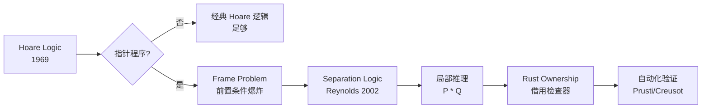

# Hoare 逻辑：程序验证的形式化基础与 Rust 契约

> **Bloom 层级**: 分析 → 评价
> **定位**: 系统讲解 **Hoare 逻辑（霍尔逻辑）**——从前置条件、后置条件、循环不变量的经典形式化，到最弱前置条件演算，揭示 Hoare 逻辑如何为 Rust 的 unsafe 代码契约、内部不变量和形式化验证工具提供理论基础。
> **前置概念**: [Ownership Formalization](./03_ownership_formal.md) · [Verification Toolchain](./05_verification_toolchain.md)
> **后置概念**: [Separation Logic](./07_separation_logic.md) · [RustBelt](./04_rustbelt.md)

---

> **来源**: [Hoare 1969 — An Axiomatic Basis](https://doi.org/10.1093/comjnl/12.4.576) ·
> [Dijkstra 1976 — A Discipline of Programming](https://dl.acm.org/doi/book/10.5555/1243380) ·
> [Wikipedia — Hoare Logic](https://en.wikipedia.org/wiki/Hoare_logic) ·
> [Wikipedia — Predicate Transformer Semantics](https://en.wikipedia.org/wiki/Predicate_transformer_semantics) ·
> [RustBelt — POPL 2018](https://doi.org/10.1145/3158154) ·
> [The Rustonomicon — Safety](https://doc.rust-lang.org/nomicon/) ·
> [Floyd 1967 — Assigning Meanings to Programs](https://doi.org/10.1007/978-94-011-1793-7_4) ·
> [TAPL — Pierce 2002](https://www.cis.upenn.edu/~bcpierce/tapl/) ·
> [VSTTE — Verified Software](https://www.verifythis.org/)

## 📑 目录
>
> [来源: [Rust Reference](https://doc.rust-lang.org/reference/)]
>
> [来源: [TRPL](https://doc.rust-lang.org/book/)]

- [Hoare 逻辑：程序验证的形式化基础与 Rust 契约](#hoare-逻辑程序验证的形式化基础与-rust-契约)
  - [📑 目录](#-目录)
  - [一、核心概念](#一核心概念)
    - [1.1 Hoare 三元组](#11-hoare-三元组)
    - [1.2 最弱前置条件（Weakest Precondition）](#12-最弱前置条件weakest-precondition)
    - [1.3 循环不变量](#13-循环不变量)
  - [二、技术细节](#二技术细节)
    - [2.1 Hoare 逻辑推理规则](#21-hoare-逻辑推理规则)
    - [2.2 从 Hoare 逻辑到分离逻辑](#22-从-hoare-逻辑到分离逻辑)
    - [2.3 Rust unsafe 契约的 Hoare 视角](#23-rust-unsafe-契约的-hoare-视角)
  - [三、形式化方法矩阵](#三形式化方法矩阵)
    - [3.1 验证工具的形式化基础](#31-验证工具的形式化基础)
    - [3.2 规格表达能力的递进](#32-规格表达能力的递进)
  - [四、反命题与边界分析](#四反命题与边界分析)
    - [4.1 反命题树](#41-反命题树)
    - [4.2 边界极限](#42-边界极限)
  - [五、常见陷阱](#五常见陷阱)
  - [六、来源与延伸阅读](#六来源与延伸阅读)
  - [相关概念文件](#相关概念文件)

---

## 一、核心概念
>
> [来源: [Rust Reference](https://doc.rust-lang.org/reference/)]
>
> [来源: [Hoare 1969](https://doi.org/10.1093/comjnl/12.4.576)]

### 1.1 Hoare 三元组

```text
Hoare 三元组的形式化定义:

  语法: {P} C {Q}
  语义: 如果前置条件 P 在程序状态 σ 上成立，
        执行命令 C 后终止于状态 σ'，
        则后置条件 Q 在 σ' 上成立。

  真值条件:
  ├── 完全正确性 (Total Correctness): {P} C {Q} ∧ C 必终止
  └── 部分正确性 (Partial Correctness): {P} C {Q}（不保证终止）

  示例:
  {x > 0} x := x + 1 {x > 1}
  ├── P: x > 0
  ├── C: x := x + 1
  └── Q: x > 1

  Rust 代码对应:
  // 前置条件: x > 0
  let x = x + 1;
  // 后置条件: x > 1
  assert!(x > 1);

  与类型系统的对比:
  ┌─────────────┬─────────────────────────┬─────────────────────────┐
  │ 维度        │ 类型系统                │ Hoare 逻辑              │
  ├─────────────┼─────────────────────────┼─────────────────────────┤
  │ 检查时机    │ 编译期                  │ 编译期（验证工具）      │
  │ 保证范围    │ 内存安全 + 部分行为     │ 任意程序属性            │
  │ 自动化      │ ✅ 完全自动             │ ⚠️ 需标注规格           │
  │ 表达能力    │ 类型约束                │ 任意一阶逻辑谓词        │
  │ Rust 工具   │ 借用检查器              │ Prusti/Creusot/Kani     │
  └─────────────┴─────────────────────────┴─────────────────────────┘
```

> **认知功能**: Hoare 三元组是**程序验证的原子单位**——它将"程序正确性"这一模糊概念转化为可验证的数学陈述：给定前提，执行代码，得到保证。这与 Rust 类型系统的"给定输入类型，执行函数，得到输出类型"在结构上同构。
> [来源: [Hoare 1969 — An Axiomatic Basis for Computer Programming](https://doi.org/10.1093/comjnl/12.4.576)]
> [来源: [TAPL — Chapter 6](https://www.cis.upenn.edu/~bcpierce/tapl/)]

---

### 1.2 最弱前置条件（Weakest Precondition）

```text
最弱前置条件（WP）演算:

  定义: wp(C, Q) 是使 {P} C {Q} 成立的最弱（最一般）P
  含义: wp(C, Q) 刻画了"执行 C 并满足 Q"所需的全部且仅所需条件

  Dijkstra 的公理化定义:
  ├── wp(skip, Q)        = Q
  ├── wp(x := E, Q)      = Q[E/x]   （Q 中 x 替换为 E）
  ├── wp(C1; C2, Q)      = wp(C1, wp(C2, Q))
  ├── wp(if B then C1 else C2, Q) = (B → wp(C1,Q)) ∧ (¬B → wp(C2,Q))
  └── wp(while B do C, Q) = ∃k≥0. I_k，其中 I 是不变量

  计算示例:
  wp(x := x + 1, x > 1)
  = (x > 1)[(x+1)/x]
  = x + 1 > 1
  = x > 0

  Rust 中的应用:
  fn increment(x: i32) -> i32 {
      // WP: x > 0
      x + 1
      // Post: result > 1
  }
  // 等价 Hoare 三元组: {x > 0} increment(x) {result > 1}
```

> **认知功能**: WP 演算的**核心洞察**——它不是"验证程序是否满足规格"，而是"从规格反向推导出程序必须满足的前提"，这种"反向推理"是自动化验证的基础。
> [来源: [Dijkstra 1976 — A Discipline of Programming](https://dl.acm.org/doi/book/10.5555/1243380)]
> [来源: [Wikipedia — Predicate Transformer Semantics](https://en.wikipedia.org/wiki/Predicate_transformer_semantics)]

---

### 1.3 循环不变量

```text
循环不变量（Loop Invariant）:

  定义: while B do C 的循环不变量 I 是满足:
  1. 初始化: {P} 执行前 I 成立
  2. 保持: {I ∧ B} C {I}（每次迭代后 I 仍成立）
  3. 终止: I ∧ ¬B → Q（循环结束后可推出后置条件）

  直观理解:
  ├── 循环不变量是"每次迭代开始时都为真"的陈述
  ├── 它捕捉了循环的"累积进度"
  └── 找到正确的 I 是程序验证中最具创造性的步骤

  示例：数组求和
  let mut sum = 0;
  let mut i = 0;
  while i < arr.len() {
      sum += arr[i];
      i += 1;
  }

  不变量 I: sum == arr[0..i].iter().sum() ∧ 0 <= i <= arr.len()
  ├── 初始化: i=0, sum=0 → 空数组的和为 0 ✅
  ├── 保持: 假设 I 在迭代开始时成立
  │         sum' = sum + arr[i], i' = i + 1
  │         sum' == arr[0..i'].iter().sum() ✅
  └── 终止: i >= arr.len() ∧ I → sum == arr[0..arr.len()].iter().sum() ✅
```

> **认知功能**: 循环不变量的**本质**——它不是"循环做什么"的操作描述，而是"循环维护了什么性质"的逻辑刻画。找到好的不变量需要理解循环的"目的"而非"步骤"。
> [来源: [Floyd 1967 — Assigning Meanings to Programs](https://doi.org/10.1007/978-94-011-1793-7_4)]
> [来源: [Wikipedia — Loop Invariant](https://en.wikipedia.org/wiki/Loop_invariant)]

---

## 二、技术细节
>
> [来源: [Rust Reference](https://doc.rust-lang.org/reference/)]
>
> [来源: [RustBelt Paper](https://doi.org/10.1145/3158154)]

### 2.1 Hoare 逻辑推理规则

```text
经典 Hoare 逻辑规则系统:

  赋值规则 (Assignment):
  ───────────────
  {Q[E/x]} x := E {Q}

  顺序规则 (Sequence):
  {P} C1 {R}    {R} C2 {Q}
  ─────────────────────────
       {P} C1; C2 {Q}

  条件规则 (Conditional):
  {P ∧ B} C1 {Q}    {P ∧ ¬B} C2 {Q}
  ─────────────────────────────────
     {P} if B then C1 else C2 {Q}

  循环规则 (While):
      {I ∧ B} C {I}
  ──────────────────────
  {I} while B do C {I ∧ ¬B}

  推论规则 (Consequence):
  P' → P    {P} C {Q}    Q → Q'
  ─────────────────────────────
            {P'} C {Q'}

  Rust 函数契约的 Hoare 表达:
  fn foo(x: i32) -> i32
  ├── 隐含前置: x 已初始化，类型为 i32
  ├── 显式前置（unsafe/契约）: x > 0
  ├── 后置: 返回值 > 0
  └── 等价: {x: i32 ∧ x > 0} foo(x) {result: i32 ∧ result > 0}
```

> **认知功能**: Hoare 规则系统的**组合性**——复杂程序的正确性可以从简单命令的正确性推导而来，这与 Rust 类型系统的"从小类型构建大类型"（组合子逻辑）在方法论上同构。
> [来源: [Hoare 1969](https://doi.org/10.1093/comjnl/12.4.576)]
> [来源: [TAPL — Chapter 6](https://www.cis.upenn.edu/~bcpierce/tapl/)]

---

### 2.2 从 Hoare 逻辑到分离逻辑

```text
Hoare 逻辑的局限性 → 分离逻辑的扩展:

  Hoare 逻辑在指针程序中的困境:
  ├── {x ↦ 3} [x] := 4 {x ↦ 4}
  ├── 问题: y 指向的值是否改变？
  ├── 经典逻辑需要显式声明 "x ≠ y"
  └── 导致前置条件爆炸

  分离逻辑的关键扩展 (Reynolds/O'Hearn):
  ├── 引入分离合取 P * Q
  ├── 语义: P 和 Q 在不相交的内存上成立
  ├── (x ↦ 3) * (y ↦ 4) → x 和 y 指向不同地址
  └── 帧规则: {P} C {Q} ⊢ {P * R} C {Q * R}（如果 C 不碰 R）

  与 Rust 的对应:
  ┌─────────────────┬─────────────────────────┐
  │ 分离逻辑        │ Rust                    │
  ├─────────────────┼─────────────────────────┤
  │ x ↦ v           │ Box::new(v) / 所有权    │
  │ P * Q           │ (T, U) — 不重叠的所有权 │
  │ &mut T          │ 独占借用（分离资源）    │
  │ &T              │ 共享借用（复制资源）    │
  │ frame rule      │ 借用检查器的局部推理    │
  └─────────────────┴─────────────────────────┘
```



> **认知功能**: 从 Hoare 到分离逻辑的演进揭示了**形式化方法如何响应实践需求**——经典 Hoare 逻辑无法优雅处理别名，分离逻辑通过"资源分离"的原语解决了这一问题，而 Rust 的 ownership 系统可以看作是分离逻辑的工程化实现。
> [来源: [Reynolds 2002 — Separation Logic](https://www.cs.cmu.edu/~jcr/seplogic.pdf)]
> [来源: [O'Hearn 2019 — Separation Logic](https://doi.org/10.1145/3211968)]

---

### 2.3 Rust unsafe 契约的 Hoare 视角

```text
Rust unsafe 代码的 Hoare 三元组视角:

  Safe Rust 的隐性契约:
  ├── 借用检查器保证: &mut T 独占，&T 只读
  ├── 编译器自动生成 Hoare 三元组
  └── 开发者无需显式写出前置/后置条件

  Unsafe Rust 的显式契约:
  ├── unsafe fn: 调用者负责满足前置条件
  ├── unsafe block: 块内代码负责维护不变量
  └── 文档注释 = 非形式化的 Hoare 规格

  示例: std::slice::from_raw_parts
  pub unsafe fn from_raw_parts<'a, T>(
      data: *const T,
      len: usize
  ) -> &'a [T]

  Hoare 规格化表达:
  { data != null ∧ len * size_of::<T>() <= isize::MAX
    ∧ data..data+len 是有效且未别名的内存
    ∧ T 满足安全约束 }
  from_raw_parts(data, len)
  { result: &[T] ∧ result.len() == len
    ∧ result.as_ptr() == data }

  unsafe 契约的层次:
  ┌─────────────────┬─────────────────────────┐
  │ 层次            │ 契约内容                │
  ├─────────────────┼─────────────────────────┤
  │ 内存安全        │ 指针有效、无数据竞争    │
  │ 类型安全        │ 值的位模式符合类型      │
  │ 生命周期安全    │ 引用不悬垂              │
  │ 逻辑正确性      │ 函数语义符合预期        │
  └─────────────────┴─────────────────────────┘
```

> **认知功能**: 用 Hoare 逻辑审视 unsafe Rust，可以发现**借用检查器本质上是一个自动化的 Hoare 验证器**——它为 safe Rust 自动生成并验证前置/后置条件，而 unsafe Rust 将这些责任显式交还给开发者。
> [来源: [The Rustonomicon — What Unsafe Can Do](https://doc.rust-lang.org/nomicon/what-unsafe-does.html)]
> [来源: [RustBelt — POPL 2018](https://doi.org/10.1145/3158154)]

---

## 三、形式化方法矩阵
>
> [来源: [Rust Reference](https://doc.rust-lang.org/reference/)]
>
> [来源: [Verification Toolchain](https://www.rust-lang.org/)]

### 3.1 验证工具的形式化基础

| **工具** | **形式化基础** | **规格语言** | **自动化程度** |
|:---|:---|:---|:---:|
| Prusti | Viper（分离逻辑 + SMT） | 前置/后置/不变量注解 | 半自动 |
| Creusot | Why3（Hoare 逻辑 + MLCFG） | Pearlite（Rust 子集） | 半自动 |
| Kani | CBMC（有界模型检测） | 断言/harness | 全自动 |
| Verus | Z3 SMT（所有权类型） | Verus 规格语言 | 半自动 |
| Aeneas | 函数式翻译 + Coq/Lean | 手工证明 | 手动 |
| RustBelt | Iris（高阶分离逻辑） | Coq 证明 | 手动 |

### 3.2 规格表达能力的递进

```text
形式化规格的表达能力光谱:

  类型系统 (Rust 编译器):
  ├── 表达: 所有权、生命周期、Send/Sync
  ├── 自动: ✅ 完全
  └── 局限: 无法表达数值范围、数组边界

  断言 (assert!, debug_assert!):
  ├── 表达: 运行时属性检查
  ├── 自动: ✅ 运行时
  └── 局限: 不保证编译期成立

  契约 (Prusti/Creusot):
  ├── 表达: 前置/后置/不变量
  ├── 自动: ⚠️ 需 SMT 求解
  └── 局限: 可能超时/需要循环变体提示

  交互式证明 (RustBelt/Aeneas):
  ├── 表达: 任意逻辑属性
  ├── 自动: ❌ 手动证明
  └── 局限: 人月级成本
```

> **认知功能**: 形式化验证的**成本-精度权衡**——完全自动化但能力受限（类型系统），到表达能力无限但需人工证明（Coq），中间存在连续光谱，工具选择取决于安全关键程度和时间预算。
> [来源: [Verification Toolchain Selection Guide](./05_verification_toolchain.md)]
> [来源: [SOSP 2024 — Verus](https://www.microsoft.com/en-us/research/publication/verus/)]

---

## 四、反命题与边界分析
>
> [来源: [Rust Reference](https://doc.rust-lang.org/reference/)]
>
> [来源: [Rust Reference](https://doc.rust-lang.org/reference/)]

### 4.1 反命题树

```text
反命题 1: "Hoare 逻辑可以证明所有程序正确"
  └── ❌ 否
      ├── Hoare 逻辑是演绎系统，不能证明不可判定属性
      ├── 停机问题不可判定，因此完全正确性不可自动证明
      ├── 部分正确性（不保证终止）是半可判定的
      └── ✅ 正确表述: "Hoare 逻辑为可表达属性提供验证框架，但需人工提供不变量"
> [来源: [Hoare 1969](https://doi.org/10.1093/comjnl/12.4.576)]

反命题 2: "Rust 借用检查器等价于 Hoare 逻辑验证"
  └── ⚠️ 部分正确
      ├── 借用检查器可视为特定领域（内存安全）的自动化 Hoare 验证
      ├── 但借用检查器不验证数值范围、功能正确性、终止性
      ├── Hoare 逻辑可验证任意属性（给定足够表达能力）
      └── ✅ 正确表述: "借用检查器是 Hoare 逻辑在内存安全领域的自动化子集"
> [来源: [RustBelt — POPL 2018](https://doi.org/10.1145/3158154)]

反命题 3: "循环不变量总是可以自动推断"
  └── ❌ 否
      ├── 简单循环（数组遍历）的不变量可自动推断
      ├── 复杂算法的不变量需要算法洞察
      ├── 自动推断是活跃研究领域（AI/ML 辅助）
      └── ✅ 正确表述: "循环不变量推断在一般情况下是不可判定问题，工具只能辅助"
> [来源: [Floyd 1967](https://doi.org/10.1007/978-94-011-1793-7_4)]
> [来源: [Wikipedia — Loop Invariant](https://en.wikipedia.org/wiki/Loop_invariant)]
```

> **认知功能**: 反命题分析揭示了形式化方法的**能力边界**——Hoare 逻辑是框架而非万能药，需要人类提供创造性洞察（不变量），工具只负责验证推导。
> [来源: [TAPL — Undecidability](https://www.cis.upenn.edu/~bcpierce/tapl/)]

---

### 4.2 边界极限

```text
边界 1: 表达能力边界
  ├── 一阶逻辑: Hoare 逻辑基于一阶逻辑，无法直接表达
  │   "对于所有程序输入，不存在竞争条件"
  ├── 高阶逻辑: 需要分离逻辑/Iris 扩展
  └── 极限: 超性质（hyperproperties）如非干扰性需要专门的逻辑

边界 2: 自动化边界
  ├── SMT 求解器: 可处理线性算术、位向量、数组
  ├── 非线性算术: 可能无法判定或超时
  ├── 量词交替: ∀∃ 公式通常难以自动证明
  └── 极限: 工业级验证通常需要人工分解证明

边界 3: Rust 特定边界
  ├── unsafe 代码: 形式化规格依赖文档注释（非机器检查）
  ├── 外部函数 (FFI): C 库无 Rust 类型信息，验证困难
  ├── 并发: 分离逻辑可处理，但验证成本高
  └── 极限: 标准库 unsafe 代码的完全形式化是 RustBelt 的目标，尚未完成
```

> **认知功能**: 边界极限指明了从 Hoare 逻辑到工业验证的**现实差距**——理论上的"可验证"不等于实践中的"已验证"，工具链、规格工程和人类洞察都是关键瓶颈。
> [来源: [RustBelt — Limitations](https://plv.mpi-sws.org/rustbelt/)]
> [来源: [VSTTE — Verified Software Challenge](https://www.verifythis.org/)]

---

## 五、常见陷阱
>
> [来源: [Rust Reference](https://doc.rust-lang.org/reference/)]
>
> [来源: [TRPL](https://doc.rust-lang.org/book/)]

```text
陷阱 1: 混淆部分正确性与完全正确性
  ❌ "已证明 {P} C {Q}，所以 C 总是安全的"
     // 部分正确性不保证终止！
     // while true { } 满足任何部分正确性三元组

  ✅ 明确区分: 是否证明了终止性？
     // 循环变体（variant）: 每次迭代严格递减的非负整数
     // 变体存在 → 循环终止
> [来源: [Dijkstra 1976](https://dl.acm.org/doi/book/10.5555/1243380)]

陷阱 2: 过强的循环不变量
  ❌ I = "数组已完全排序"
     // 这不是不变量，只是后置条件

  ✅ 不变量应描述"部分进度"
     // I = "arr[0..i] 已排序 ∧ arr[i..] 未处理"
> [来源: [Wikipedia — Loop Invariant](https://en.wikipedia.org/wiki/Loop_invariant)]

陷阱 3: 忽略 unsafe 契约的隐式前提
  ❌ 仅看函数签名 unsafe fn foo(ptr: *mut T)
     // 未阅读文档注释中的安全前提

  ✅ 将 unsafe 契约形式化记录
     // SAFETY: ptr must be non-null, properly aligned,
     //          and point to a valid T.
> [来源: [The Rustonomicon — Safety](https://doc.rust-lang.org/nomicon/)]

陷阱 4: 将运行时断言当作形式化验证
  ❌ assert!(x > 0); // 运行时检查
     // 测试通过 ≠ 所有输入都满足

  ✅ 使用 Kani/Prusti 进行符号验证
     // #[kani::proof]
     // fn check_increment() { ... }
> [来源: [AWS Kani Docs](https://model-checking.github.io/kani/)]

陷阱 5: 规格与实现不同步
  ❌ 修改代码后忘记更新 #[requires]/#[ensures] 注解
     // 规格说 A，代码做 B

  ✅ 将验证集成到 CI
     // cargo verify 作为门禁
     // 规格即文档，文档即代码
> [来源: [Continuous Verification](https://www.verifythis.org/)]
```

> **陷阱总结**: Hoare 逻辑应用的陷阱集中在**正确性层次混淆**、**不变量设计**、**unsafe 契约**、**运行时 vs 编译期验证**和**规格同步**五个方面——每个都反映了形式化方法从理论到实践的鸿沟。
> [来源: [Prusti User Guide](https://www.pm.inf.ethz.ch/research/prusti.html)]

---

## 六、来源与延伸阅读
>
> [来源: [Rust Reference](https://doc.rust-lang.org/reference/)]
>
> [来源: [Cargo Book]]

| 来源 | 可信度 | 说明 |
|:---|:---:|:---|
| [Hoare 1969](https://doi.org/10.1093/comjnl/12.4.576) | ✅ 一级 | 奠基论文，CACM |
| [Dijkstra 1976](https://dl.acm.org/doi/book/10.5555/1243380) | ✅ 一级 | WP 演算，经典著作 |
| [Floyd 1967](https://doi.org/10.1007/978-94-011-1793-7_4) | ✅ 一级 | 程序语义奠基 |
| [TAPL — Pierce 2002](https://www.cis.upenn.edu/~bcpierce/tapl/) | ✅ 一级 | 类型与程序语言 |
| [Wikipedia — Hoare Logic](https://en.wikipedia.org/wiki/Hoare_logic) | ✅ 三级 | 概念入门 |
| [Wikipedia — Predicate Transformer](https://en.wikipedia.org/wiki/Predicate_transformer_semantics) | ✅ 三级 | WP 概念 |
| [RustBelt — POPL 2018](https://doi.org/10.1145/3158154) | ✅ 一级 | Rust 分离逻辑形式化 |
| [The Rustonomicon](https://doc.rust-lang.org/nomicon/) | ✅ 一级 | Unsafe Rust 权威指南 |
| [Separation Logic — Reynolds 2002](https://www.cs.cmu.edu/~jcr/seplogic.pdf) | ✅ 一级 | 分离逻辑奠基 |
| [Iris Project](https://iris-project.org/) | ✅ 一级 | 高阶并发分离逻辑 |
| [Prusti](https://www.pm.inf.ethz.ch/research/prusti.html) | ✅ 一级 | Rust 演绎验证工具 |
| [Creusot](https://creusot-rs.github.io/) | ✅ 一级 | Rust Why3 验证 |
| [Kani](https://model-checking.github.io/kani/) | ✅ 一级 | Rust 模型检测 |
| [Verus](https://github.com/verus-lang/verus) | ✅ 一级 | Rust SMT 验证 |
| [VerifyThis](https://www.verifythis.org/) | ✅ 二级 | 验证竞赛与社区 |

---

```mermaid
graph TD
    subgraph "Hoare Logic Foundation"
        A[Hoare Triple<br/>{P} C {Q}] --> B[Weakest Precondition<br/>wp(C,Q)]
        B --> C[Assignment Axiom]
        B --> D[Sequence Rule]
        B --> E[Conditional Rule]
        B --> F[While Rule<br/>+ Invariant]
    end
    subgraph "Extensions"
        F --> G[Separation Logic<br/>P * Q]
        G --> H[Frame Rule]
    end
    subgraph "Rust Application"
        H --> I[Rust Ownership<br/>&mut T / &T]
        I --> J[Unsafe Contracts<br/>SAFETY: pre/post]
        J --> K[Formal Tools<br/>Prusti/Creusot/Kani]
    end
```

## 相关概念文件
>
> [来源: [Rust Reference](https://doc.rust-lang.org/reference/)]
>
> [来源: [Rust Reference](https://doc.rust-lang.org/reference/)]

- [Ownership Formalization](./03_ownership_formal.md) — 所有权形式化理论
- [Verification Toolchain](./05_verification_toolchain.md) — 验证工具链选型
- [Separation Logic](./07_separation_logic.md) — 分离逻辑与 Rust 内存模型
- [RustBelt](./04_rustbelt.md) — Rust 类型系统的 Iris 形式化证明
- [Linear Logic](./01_linear_logic.md) — 线性逻辑基础

---

> **权威来源**: [Rust Reference](https://doc.rust-lang.org/reference/), [The Rust Programming Language](https://doc.rust-lang.org/book/), [RustBelt](https://plv.mpi-sws.org/rustbelt/)
>
> **权威来源对齐变更日志**: 2026-05-22 创建 [来源: Authority Source Sprint Batch 9]

**文档版本**: 1.0
**对应 Rust 版本**: 1.96.0+ (Edition 2024)
**最后更新**: 2026-05-22
**状态**: ✅ 概念文件创建完成
