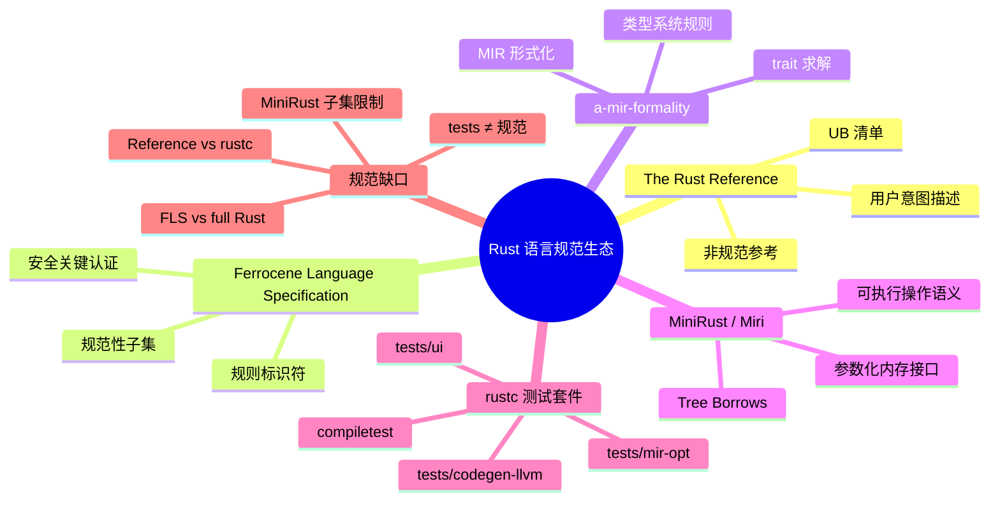

# Rust 语言规范生态总览

**EN**: Rust Language Specification Ecosystem Overview
**Summary**: Maps the layered Rust specification ecosystem—The Rust Reference, Ferrocene Language Specification, a-mir-formality, MiniRust/Miri, and the rustc test suite—into a single traceability framework.

> **Rust 版本**: 1.97.0+ (Edition 2024)
> **Bloom 层级**: L4-L5
> **权威来源**: 本文件为 `concept/` 权威页。

---

## 1. 规范谱系中的五个坐标

Rust 目前没有单一“圣经式”规范，而是由多个互补文档/工件共同定义语言含义。每个坐标回答不同问题：

| 坐标 | 回答的问题 | 当前角色 | 关键入口 |
|---|---|---|---|
| **The Rust Reference** | “Rust 应该怎么工作？” | 官方主要参考，但[明确声明 not normative](https://doc.rust-lang.org/reference/introduction.html) | https://doc.rust-lang.org/reference/introduction.html |
| **Ferrocene Language Specification (FLS)** | “安全关键子集被规范地禁止/允许什么？” | 已捐赠给 Rust Project 的规范性语言规范，带规则标识符与限制子集 | https://spec.ferrocene.dev/ |
| **a-mir-formality** | “类型系统、trait 求解、借用检查的形式化规则长什么样？” | Rust 官方的 MIR/类型系统形式化模型 | https://rust-lang.github.io/a-mir-formality/ |
| **MiniRust / Miri** | “如果按某一组规则执行，程序会触发什么 UB？” | 可执行操作语义与动态 UB 检测 | https://github.com/minirust/minirust · https://github.com/rust-lang/miri |
| **rustc 测试套件** | “编译器实际接受/拒绝哪些程序？” | 规范一致性证据库，非规范本身 | https://github.com/rust-lang/rust/tree/master/tests |

> **核心关系**：Reference 描述意图，FLS 在认证子集上增加规范性约束，a-mir-formality 与 MiniRust 提供形式化/可执行语义，rustc tests 提供经验证据。五者之间的不一致，正是“规范缺口”的精确位置。

---

## 2. 分层模型：从用户指南到可执行证据

```text
L1 用户参考        The Rust Programming Language / The Rust Reference
      │
      ▼
L2 技术规范        Ferrocene Language Specification（规则标识符 + 限制子集）
      │                    │
      ▼                    ▼
L3 形式化规约      a-mir-formality（类型系统、trait 求解、借用检查）
      │
      ▼
L4 可执行规约      MiniRust（抽象机 + 参数化内存接口）→ Miri（实现）
      │
      ▼
L5 经验证据        rustc tests（ui / mir-opt / codegen-llvm / compiletest）
```

工程决策时应按风险层级选择证据：

- 普通应用开发：Reference + `rustc` 即可。
- 安全关键/认证项目：FLS 子集 + Reference + 认证报告（[Ferrocene Public Docs](https://public-docs.ferrocene.dev/main/qualification/report/index.html)）。
- 形式化验证/替代实现：a-mir-formality + MiniRust/Miri + 相关测试。
- 编译器开发/ nightly 特性：rustc tests 是事实标准，但需意识到 `--bless` 会改写期望输出。

---

## 3. 来源对齐表

| 主题 | 权威来源 | URL | 在规范谱系中的位置 |
|---|---|---|---|
| 官方规范工作启动 | RFC 3355 — The Rust Specification | https://rust-lang.github.io/rfcs/3355-rust-spec.html | L2 技术规范的路线图 |
| 实验性规范 2026 目标 | Rust Project Goals 2026 | https://rust-lang.github.io/rust-project-goals/2026/experimental-language-specification.html | L1→L2 的演进计划 |
| FLS 上游化目标 | Rust Project Goals 2025H1 | https://rust-lang.github.io/rust-project-goals/2025h1/spec-fls-publish.html | L2 进入 rust-lang 基础设施 |
| 跟踪 issue | rust-lang/rust #113527 | https://github.com/rust-lang/rust/issues/113527 | 进度与依赖 PR |
| 非规范参考 | The Rust Reference | https://doc.rust-lang.org/reference/introduction.html | L1 用户参考 |
| 规范性安全关键规范 | Ferrocene Language Specification | https://spec.ferrocene.dev/ | L2 技术规范 |
| 类型系统形式化 | a-mir-formality | https://github.com/rust-lang/a-mir-formality | L3 形式化规约 |
| 可执行操作语义 | MiniRust | https://github.com/minirust/minirust | L4 可执行规约 |
| UB 动态检测 | Miri | https://github.com/rust-lang/miri | L4 的工具实现 |
| 操作语义共识 | Unsafe Code Guidelines | https://rust-lang.github.io/unsafe-code-guidelines/ | L1-L2 与 L3-L4 之间的桥梁 |
| 测试框架 | rustc-dev-guide — Compiletest | https://rustc-dev-guide.rust-lang.org/tests/compiletest.html | L5 证据方法论 |

---

## 4. 反命题与边界

### 4.1 常见过度概括

- ❌ “The Rust Reference 就是 Rust 规范。” → ✅ Reference 自身声明非规范；它是意图描述，不是最终裁决。
- ❌ “FLS 覆盖了全部 Rust。” → ✅ FLS 目前聚焦 Ferrocene 认证子集（core + 部分 alloc），并带有明确限制（如 `No unsafe`）。
- ❌ “MiniRust/Miri 通过即代表符合规范。” → ✅ Miri 是单路径解释执行，只检查实际执行到的分支；且 MiniRust 仍只覆盖核心子集。
- ❌ “rustc tests 就是规范。” → ✅ 测试是“实现实际接受什么”的证据，不能替代对“应当接受什么”的规范陈述。
- ❌ “a-mir-formality 已经完成。” → ✅ 截至 2026 年，核心类型系统与 trait solver 仍在推进，unsafe 动态语义尚未覆盖。

### 4.2 工程边界

- **规范优先 vs 实现优先**：Rust 社区当前倾向“实现优先”——当 Reference/FLS 与 `rustc` 不一致时，通常先修复文档；但 Ferrocene 等认证场景要求文档具有约束力，这正是 FLS 的价值。
- **nightly 与 stable 的鸿沟**：规范工作优先 stable 特性；nightly 特性可能未进入任何规范文档。
- **unsafe 语义未完全形式化**：Stacked/Tree Borrows 提供了别名模型，但完整 unsafe 语义仍需与 LLVM ABI、平台调用约定对齐。

---

## 5. 与其他概念的关系

- [MiniRust 操作语义](../03_operational_semantics/10_minirust.md) — 可执行规范的核心抽象。
- [RustBelt：分离逻辑基础](../02_separation_logic/01_rustbelt.md) — 所有权与借用的形式化证明。
- [验证工具链选型](../04_model_checking/01_verification_toolchain.md) — 规范与 Kani / Verus / Creusot 等工具的衔接。
- [编译器测试](../../06_ecosystem/00_toolchain/13_compiler_testing.md) — rustc 测试框架与 `compiletest` 细节。
- [rustc driver 与 Stable MIR](../../06_ecosystem/00_toolchain/10_rustc_driver_and_stable_mir.md) — 把 rustc 当库用，提取规范证据。

---

## 🧭 思维导图（Mindmap）


