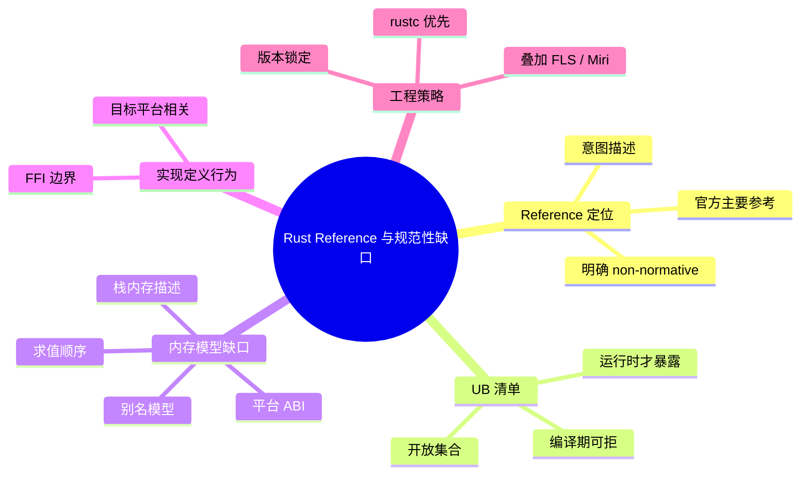

# Rust Reference 与规范性缺口

**EN**: The Rust Reference and the Normative Gap
**Summary**: Explains why The Rust Reference is the official but non-normative reference, and maps its known gaps around undefined behavior, the memory model, and implementation-defined behavior.

> **Rust 版本**: 1.97.0+ (Edition 2024)
> **Bloom 层级**: L3-L4
> **权威来源**: 本文件为 `concept/` 权威页。

---

## 1. Reference 的非规范性声明

[The Rust Reference](https://doc.rust-lang.org/reference/introduction.html) 开篇即声明：

> “This book is not normative. It may include details that are not precisely consistent with the current implementation of rustc, and it may lack details of the behavior of the current implementation of rustc.”

这意味着：

- Reference 是**意图描述**与**教学文档**，不是最终裁决。
- 当 Reference 与 `rustc` 行为冲突时，通常以 `rustc` 为准（“实现优先”）。
- 安全关键/认证项目不能仅依赖 Reference 作为合规证据。

RFC 3355 启动的官方规范工作，目标正是把 Reference 的意图逐步转化为可评审、可版本化的规范文本（[Rust Project Goals 2026 — Experimental Language Specification](https://rust-lang.github.io/rust-project-goals/2026/experimental-language-specification.html)）。

---

## 2. UB 清单与灰色地带

Reference 的 [Behavior Considered Undefined](https://doc.rust-lang.org/reference/behavior-considered-undefined.html) 列出了已知的 UB 类别，例如：

- 数据竞争
- 使用悬垂/未对齐/无效的引用或指针
- 读取未初始化内存
- 破坏 `Pin` 不变式
- 调用 ABI 不匹配的函数

但这些列表是**开放集合**：某些边缘行为（如特定别名模式在 Stacked/Tree Borrows 下的判定）尚未被 Reference 完全吸收。Unsafe Code Guidelines (UCG) 工作组持续把学术共识（如 Tree Borrows）反馈到 Reference 与 rustc 实现中。

```rust,compile_fail
fn main() {
    let mut x = 0;
    let r1 = &mut x;
    let r2 = &mut x; // ❌ Reference 已列 UB：同一位置的两个可变引用
    println!("{} {}", r1, r2);
}
```

> 编译器在这里直接拒绝；但 UB 清单中大量条目（如数据竞争、use-after-free）要到运行时（Runtime）才暴露，因此不能仅凭“通过编译”推断“符合 Reference”。

---

## 3. 内存模型与实现定义行为

Reference 的内存模型章节主要描述：

- 变量的表示、对齐与布局
- 引用与裸指针的有效值约束
- `unsafe` 块中程序员必须保持的不变式

但以下领域仍存在规范缺口：

| 领域 | Reference 状态 | 现实来源 | 风险 |
|---|---|---|---|
| 别名模型 | 描述借用规则，未精确到 Stacked/Tree Borrows | UCG / Miri / MiniRust | 同一代码在 Miri 新旧模型下结论不同 |
| 求值顺序 | 部分表达式未指定求值顺序 | `rustc` 实际行为 | 换编译器版本可能漂移 |
| 整数溢出 debug/release | 明确（release 下回绕） | Reference 已覆盖 | 低 |
| 栈内存描述 | 已知遗漏/bug（如 rust-lang/reference #1489） | 社区 issue | 依赖栈地址的 unsafe 代码不可移植 |
| 平台 ABI | 实现定义行为 | 目标平台文档 | FFI 跨平台差异 |

---

## 4. 版本化 URL 与引用稳定性

Reference 每个稳定版本都有带版本号的 URL，可用于锁定审计基线：

```rust
//! 审计基线示例：锁定 Rust 1.97.0 的 Reference URL
//! https://doc.rust-lang.org/1.97.0/reference/behavior-considered-undefined.html

fn main() {}
```

在合规文档中引用带版本号的 URL，可以避免“最新版 Reference 已修改相关条款”导致的基线失效。

---

## 5. 反命题与边界

### 5.1 常见过度概括

- ❌ “Reference 说了的才合法，没说的就不合法。” → ✅ Reference 是不完整的意图文档；大量合法程序依赖未文档化的实现行为。
- ❌ “Reference 的 UB 列表是穷尽的。” → ✅ UCG 与 Miri 仍在发现新的边缘 UB 模式；列表会随版本扩展。
- ❌ “编译通过 = 符合 Reference。” → ✅ Reference 描述的许多规则是动态语义，编译器无法在编译期全部检查。
- ❌ “Reference bug 会立即修复。” → ✅ 自然语言规范 bug 的修复需要社区共识，可能慢于编译器 bug 修复。

### 5.2 工程边界

- **不要以 Reference 作为安全关键项目的唯一合规依据**；应叠加 FLS、测试证据与形式化工具结果。
- **遇到 Reference 与 `rustc` 不一致时**，优先在 rust-lang/reference 提 issue；在 issue 解决前，以 `rustc` 实际行为作为工程事实标准。
- **版本锁定**：审计或认证时应引用带版本号的 Reference URL，并记录检查时的 `rustc --version`。

---

## 6. 国际权威来源

- [The Rust Reference — Introduction](https://doc.rust-lang.org/reference/introduction.html)
- [The Rust Reference — Behavior Considered Undefined](https://doc.rust-lang.org/reference/behavior-considered-undefined.html)
- [Unsafe Code Guidelines](https://rust-lang.github.io/unsafe-code-guidelines/)
- [rust-lang/reference issues](https://github.com/rust-lang/reference/issues)
- [RFC 3355 — The Rust Specification](https://rust-lang.github.io/rfcs/3355-rust-spec.html)
- [Ralf Jung — Tree Borrows](https://www.ralfj.de/blog/2023/06/02/tree-borrows.html)

---

## 7. 与其他概念的关系

- [可执行规范：MiniRust 与 Miri](03_executable_specification_minirust.md) — 把 Reference 的 UB 清单动态化。
- [Tree Borrows 深度解析](../01_ownership_logic/05_tree_borrows_deep_dive.md) — 别名模型的技术细节。
- [Behavior Considered Undefined](../01_ownership_logic/06_behavior_considered_undefined.md) — UB 清单的专门讨论。
- [内存模型](../../03_advanced/02_unsafe/06_memory_model.md) — Rust 内存模型的权威概念页。

---

## 🧭 思维导图（Mindmap）


