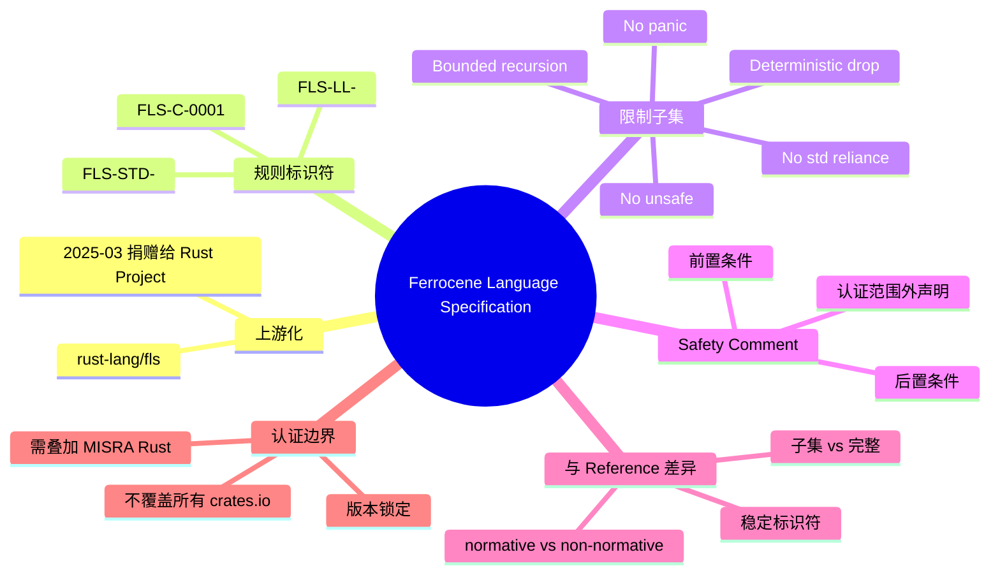

# Ferrocene 语言规范（FLS）

**EN**: Ferrocene Language Specification (FLS)
**Summary**: Describes the structure, rule identifiers, restricted subsets, and differences between the Ferrocene Language Specification and The Rust Reference, including its upstream donation to the Rust Project.

> **Rust 版本**: 1.97.0+ (Edition 2024)
> **Ferrocene 版本**: 26.02.0（基于 rustc 1.92）
> **Bloom 层级**: L4-L5
> **权威来源**: 本文件为 `concept/` 权威页。

---

## 1. FLS 的上游化与定位

[Ferrocene Language Specification](https://spec.ferrocene.dev/) 最初由 Ferrous Systems / AdaCore 为 Ferrocene 认证工具链编写，2025 年 3 月捐赠给 Rust Project（[Rust Project Goals 2025H1 — Publish first rust-lang-owned release of "FLS"](https://rust-lang.github.io/rust-project-goals/2025h1/spec-fls-publish.html)）。其定位是：

- **规范性文档**：与 Reference 的 non-normative 声明相反，FLS 的条款在安全关键认证范围内具有约束力。
- **子集规范**：明确列出 Ferrocene 支持的语言子集与限制。
- **规则标识符**：每条规则都有稳定标识符（如 `FLS-C-0001`），便于审计追踪与工具链检查。

源码仓库位于 [rust-lang/fls](https://github.com/rust-lang/fls)，认证证据链见 [Ferrocene Public Docs / Qualification Report](https://public-docs.ferrocene.dev/main/qualification/report/index.html)。

---

## 2. 规则标识符与文档结构

FLS 按主题组织章节，并给每条规则分配唯一标识符：

```text
FLS-XX-YYYY
  └── 前缀：C = 语言规则，STD = 标准库规则， etc.
  └── 数字：章节内唯一编号
```

常见前缀含义：

| 前缀 | 含义 | 示例场景 |
|---|---|---|
| `FLS-C-` | 核心语言规则 | 借用、所有权、类型系统 |
| `FLS-STD-` | 标准库相关规则 | `core`/`alloc` 契约 |
| `FLS-LL-` | 库限制（Library Limitations） | 未认证的标准库 API |
| `FLS-AS-` | 架构/平台相关规则 | 目标平台 ABI |

这种编号方式使认证审计能够精确引用“哪一条规则被违反/满足”。

---

## 3. 限制子集

FLS 为降低认证成本，对 Ferrocene 认证子集施加了明确限制。典型限制类别包括：

- **No unsafe**：认证代码不得使用 `unsafe` 块或 `unsafe fn`。
- **No panic**：程序必须被证明不会 panic（通过静态分析或运行时检查）。
- **Bounded recursion**：递归必须有可证明的上界。
- **Deterministic drop**：资源释放顺序必须可预测。
- **No std reliance**：仅依赖已认证的 `core`/`alloc` 子集，避免未经验证的 `std` API。

这些限制不是 Rust 语言本身的限制，而是**认证项目与 FLS 之间的合约**。超出子集的代码需要额外的安全论证与证据。

```rust,compile_fail
#![forbid(unsafe_code)]

fn main() {
    // ❌ 违反 FLS-C-0001 风格限制：该子集禁止 unsafe
    unsafe {
        println!("forbidden");
    }
}
```

> 上述代码会被 `rustc` 直接拒绝，因为 `#![forbid(unsafe_code)]` 是语言级属性；FLS 的子集限制则通过项目策略、静态检查或审计流程强制执行。

---

## 4. FLS 风格 Safety Comment

即使子集禁止 `unsafe`，FLS 仍要求对任何潜在不安全假设（如外部 FFI、硬件寄存器访问）提供 Safety Comment。典型格式如下：

```rust,ignore
/// # Safety
/// - `ptr` must be non-null, properly aligned, and valid for reads of `T`.
/// - The caller must ensure no data race occurs during the read.
/// - This function is outside the Ferrocene certified subset;
///   additional qualification evidence is required.
pub unsafe fn fls_style_read<T>(ptr: *const T) -> T {
    unsafe { ptr.read() }
}
```

> 该示例使用 `rust,ignore`，因为它包含 Miri/nightly 风格假设与 Ferrocene 子集注释，不适合在 stable rustc 1.97 下作为普通 crate 编译。

---

## 5. FLS 与 Reference 的差异

| 维度 | The Rust Reference | Ferrocene Language Specification |
|---|---|---|
| 规范性 | 明确 non-normative | 在认证范围内 normative |
| 覆盖范围 | 追求完整 Rust | 聚焦认证子集（core + 部分 alloc） |
| 规则标识 | 章节标题/段落 | `FLS-C-0001` 等稳定标识符 |
| unsafe | 描述规则与风险 | 子集可完全禁止 |
| panic | 描述机制 | 子集要求无 panic |
| std | 覆盖完整标准库 | 仅认证选定 API |
| 更新节奏 | 社区驱动 | 与 Ferrocene 发布周期绑定 |

FLS 不会替代 Reference；它把 Reference 中“意图”的部分条款提升为“必须遵守”的认证约束。

---

## 6. 反命题与边界

### 6.1 常见过度概括

- ❌ “Ferrocene 认证工具链 = 任何 crates.io 依赖都认证。” → ✅ 认证范围只覆盖 Ferrocene 验证过的 `rustc`、标准库子集与项目自身代码；第三方依赖需单独评估。
- ❌ “FLS 就是完整 Rust 规范。” → ✅ FLS 当前只覆盖认证所需子集，大量 nightly 特性、宏、部分 std API 不在范围内。
- ❌ “FLS 取代了 Reference。” → ✅ FLS 与 Reference 互补：Reference 描述意图，FLS 在子集上增加规范性约束。
- ❌ “通过 Ferrocene 编译器即自动通过认证。” → ✅ 认证还包括流程、文档、测试覆盖、安全分析等；编译器只是工具链一环。

### 6.2 工程边界

- **子集选择是项目决策**：是否禁止 `unsafe`、是否允许 panic，取决于认证等级（如 ISO 26262 ASIL）。
- **MISRA Rust 互补**：汽车/航空行业常把 FLS 与 [MISRA Rust Guidelines](https://misra.org.uk/) 叠加使用，形成编码规范 + 语言规范的双重约束。
- **FLS 规则会演进**：随着 FLS 上游化，规则编号、限制范围可能调整；认证基线需要版本锁定。

---

## 7. 国际权威来源

- [Ferrocene Language Specification](https://spec.ferrocene.dev/)
- [rust-lang/fls](https://github.com/rust-lang/fls)
- [Ferrocene Public Docs — Qualification Report](https://public-docs.ferrocene.dev/main/qualification/report/index.html)
- [Ferrocene 官网](https://ferrocene.dev/)
- [MISRA Rust Guidelines](https://misra.org.uk/)
- [Safety-Critical Rust Consortium](https://rustfoundation.org/safety-critical-rust-consortium/)
- [Rust Project Goals 2025H1 — FLS publish](https://rust-lang.github.io/rust-project-goals/2025h1/spec-fls-publish.html)

---

## 8. 与其他概念的关系

- [Rust Reference 与规范性缺口](01_rust_reference_and_normative_gap.md) — Reference 的非规范性与 FLS 的规范性对比。
- [验证工具链选型](../04_model_checking/01_verification_toolchain.md) — 认证项目如何组合 Kani / Verus / Miri。
- [编译器测试](../../06_ecosystem/00_toolchain/13_compiler_testing.md) — 认证证据链中的测试策略。
- [content/safety_critical/07_case_studies/01_case_study_01_ferrocene_certification.md](../../../content/safety_critical/07_case_studies/01_case_study_01_ferrocene_certification.md) — Ferrocene 认证专题案例（应用场景，非概念推导）。

---

## 🧭 思维导图（Mindmap）


