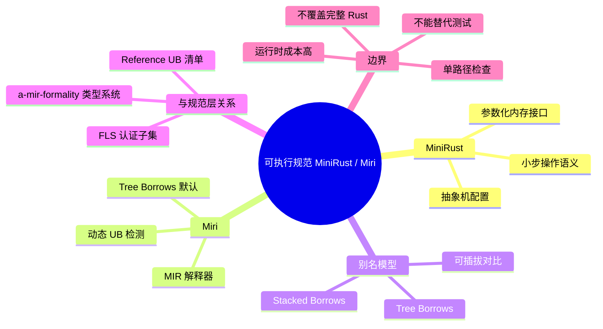

# 可执行规范：MiniRust 与 Miri

**EN**: Executable Specification: MiniRust and Miri
**Summary**: Positions MiniRust as an executable small-step operational semantics for a Rust core subset and Miri as its engineering implementation, clarifying their relationship to Reference, FLS, and the undefined-behavior boundary.

> **Rust 版本**: 1.97.0+ (Edition 2024)
> **Bloom 层级**: L4-L5
> **权威来源**: 本文件为 `concept/` 权威页。

---

## 1. 为什么需要可执行规范

自然语言规范（Reference、FLS）难以回答“这段代码在精确语义下会发生什么”。可执行规范通过**解释器**给出确定答案：

- **MiniRust**：Ralf Jung 等人提出的 Rust 核心语言可执行小步操作语义，显式维护抽象机状态（程序点、局部环境、内存、类型元数据、别名模型状态、调用栈）。
- **Miri**：Rust 官方的 MIR 解释器，动态检测 UB，是 MiniRust 思想在工程上的主要实现。

二者共同作用：MiniRust 定义“应当如何”，Miri 检查“实际代码是否偏离”。

---

## 2. MiniRust 抽象机

MiniRust 把程序状态表示为配置 `⟨P, ρ, σ, τ, A, κ⟩`：

| 分量 | 含义 |
|---|---|
| `P` | 当前待执行的程序点（MIR 语句/终结符） |
| `ρ` | 局部变量到内存位置的映射 |
| `σ` | 内存字节 |
| `τ` | 每个位置的类型元数据（对齐、有效值） |
| `A` | 别名模型状态（Stacked/Tree Borrows 的 tag 权限） |
| `κ` | 调用栈 / continuation |

核心设计是把**内存接口**参数化：

```rust,ignore
// MiniRust-style memory interface pseudocode
pub trait MemoryInterface {
    fn allocate(&mut self, size: usize, align: usize) -> Pointer;
    fn deallocate(&mut self, ptr: Pointer);
    fn load(&mut self, ptr: Pointer, ty: Type) -> Result<Value, Ub>;
    fn store(&mut self, ptr: Pointer, ty: Type, value: Value) -> Result<(), Ub>;
    fn retag(&mut self, ptr: Pointer, kind: RetagKind) -> Pointer;
}
```

通过替换 `MemoryInterface` 的实现，可以比较 Stacked Borrows、Tree Borrows 或未来别名模型对同一程序的判断。详见 [MiniRust GitHub](https://github.com/minirust/minirust)。

---

## 3. 别名模型：Stacked vs Tree Borrows

MiniRust 把别名模型做成可插拔模块。两种模型对同一程序的判定可能不同：

| 场景 | Stacked Borrows | Tree Borrows |
|---|---|---|
| 通过裸指针重借用后复用父引用 | ❌ 可能 UB | ✅ 父引用仍可读 |
| 子借用存活期间通过父指针写 | ❌ UB | ❌ UB |
| 共享引用后通过另一共享引用写 | ❌ UB | ❌ UB |
| 两阶段可变借用（reserved mutable） | 需特殊处理 | 原生支持 |

Tree Borrows 的论文与教学解释见 [Tree Borrows (PLDI 2025)](https://perso.crans.org/vanile/treebor/) 与 [Ralf Jung 博客](https://www.ralfj.de/blog/2023/06/02/tree-borrows.html)。

---

## 4. Miri：MiniRust 的工程实现

Miri 解释执行 Rust MIR，运行时检查 UB。它不是编译器，而是**动态语义探测器**。主要能力：

- 检测 use-after-free、数据竞争、未初始化读取、对齐违规等。
- 支持 Stacked Borrows 与 Tree Borrows（默认 Tree Borrows）。
- 覆盖 `std` 与 `core` 的标准库路径，常用于标准库 CI。

Miri 通过 = 程序在已覆盖路径上未触发 UB；Miri 未通过 = 存在明确 UB；Miri 未覆盖 ≠ 安全。

```rust,compile_fail
fn main() {
    let mut x = 0;
    let r1 = &mut x;
    let r2 = &mut x; // ❌ 编译器直接拒绝的别名违规
    println!("{} {}", r1, r2);
}
```

> 该 `compile_fail` 块展示编译期即可捕获的别名违规；Miri 处理的则是编译器无法静态发现的动态别名冲突。

以下代码**能通过 stable rustc 1.97 编译**，但在 Miri（Stacked Borrows 或 Tree Borrows）下会报告 UB：

```rust,ignore
fn main() {
    let mut x = 0;
    let r = &mut x as *mut i32;
    unsafe {
        let s = &mut *r; // 通过 r 重借用产生子可变引用
        *r = 1;          // 通过父指针写，而子借用 s 仍存活
        let _ = *s;      // 使用子借用
    }
}
```

> 该示例使用 `rust,ignore`，因为需要在 Miri 下运行才能观察到 UB；普通 `rustc` 编译会通过，但语义上存在冲突。

---

## 5. MiniRust/Miri 与 Reference/FLS 的关系

| 规范层 | 文档/工具 | 作用 |
|---|---|---|
| L1 参考 | The Rust Reference | 描述意图，列出 UB 类别 |
| L2 技术规范 | FLS | 在认证子集上给出规范性约束 |
| L3 形式化 | a-mir-formality | 类型系统与 trait 求解规则 |
| L4 可执行 | MiniRust / Miri | 动态语义、别名模型、UB 判定 |
| L5 证据 | rustc tests | 实现实际接受/拒绝的程序集合 |

当 Reference 与 Miri 结论冲突时，常见处理顺序：

1. 判断是 `rustc` bug、Miri bug 还是 Reference 描述不准确。
2. 如果是 `rustc` 对语义的偏离，修复编译器。
3. 如果是 Reference 遗漏，补充文档。
4. 如果涉及别名模型未决问题，提交到 UCG 讨论。

---

## 6. 反命题与边界

### 6.1 常见过度概括

- ❌ “MiniRust 已覆盖完整 Rust。” → ✅ MiniRust 目前聚焦核心子集（所有权、借用、裸指针、enum/struct），宏、trait 求解、增量编译等未纳入。
- ❌ “Miri 通过即代表规范合法。” → ✅ Miri 是单路径动态检查，只覆盖实际执行分支；且 Miri 自身也在演进（Stacked → Tree Borrows）。
- ❌ “MiniRust 是一个 Rust 编译器。” → ✅ MiniRust 是参考解释器/形式化基线，不生成机器码。
- ❌ “Miri 可以替代测试。” → ✅ Miri 找 UB 反例，但不能证明功能正确性；应与测试、模型检查组合使用。

### 6.2 工程边界

- **运行时成本**：Miri 解释执行比原生执行慢 10–100 倍，只能用于小测试与回归套件。
- **并发覆盖**：Miri 支持 `std::thread` 并检测数据竞争，但无法穷尽所有交错；需与 Loom 等工具互补。
- **std 覆盖**：Miri 能跑大部分标准库 unsafe 代码，但某些平台相关实现（如特定 OS 调用）可能无法解释。

---

## 7. 国际权威来源

- [MiniRust GitHub](https://github.com/minirust/minirust)
- [Tree Borrows — PLDI 2025](https://perso.crans.org/vanile/treebor/)
- [Ralf Jung — Tree Borrows blog](https://www.ralfj.de/blog/2023/06/02/tree-borrows.html)
- [Miri GitHub](https://github.com/rust-lang/miri)
- [Unsafe Code Guidelines](https://rust-lang.github.io/unsafe-code-guidelines/)
- [Rust Reference — Behavior Considered Undefined](https://doc.rust-lang.org/reference/behavior-considered-undefined.html)
- [Stacked Borrows — POPL 2020](https://plv.mpi-sws.org/rustbelt/stacked-borrows/)

---

## 8. 与其他概念的关系

- [MiniRust 操作语义](../03_operational_semantics/10_minirust.md) — MiniRust 抽象机与内存接口的深度解释。
- [Rust Reference 与规范性缺口](01_rust_reference_and_normative_gap.md) — Reference UB 清单与 Miri 发现的缺口。
- [Tree Borrows 深度解析](../01_ownership_logic/05_tree_borrows_deep_dive.md) — Tree Borrows 状态机细节。
- [Miri](../04_model_checking/08_miri.md) — Miri 工具链与使用方式。
- [Kani](../04_model_checking/09_kani.md) — 与 Miri 互补的有界模型检查。

---

## 🧭 思维导图（Mindmap）


