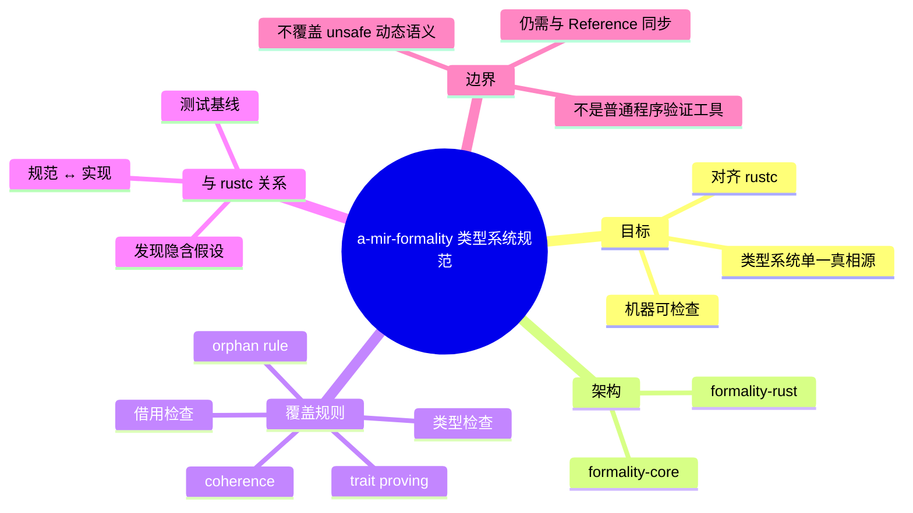

# a-mir-formality：MIR / 类型系统 / trait 求解的形式化模型

**EN**: a-mir-formality: A Formal Model of MIR, Type System, and Trait Solving
**Summary**: Positions a-mir-formality as the Rust project's machine-checkable formalization of MIR, type-checking, borrow-checking, coherence, and trait proving, and clarifies its scope relative to rustc and dynamic semantics.

> **Rust 版本**: 1.97.0+ (Edition 2024)
> **Bloom 层级**: L4-L5
> **权威来源**: 本文件为 `concept/` 权威页。
> **关联 L3 页**: [Unsafe Rust](../../03_advanced/02_unsafe/01_unsafe.md)

---

## 1. 为什么需要类型系统形式化

Rust 的类型系统规则目前分散在三处：

- `rustc` 源码（约 50 万行，隐含假设与实现细节交织）
- The Rust Reference（自然语言，存在歧义）
- RFC 文档（设计意图，非精确规格）

这种分散导致：第三方工具（rust-analyzer、Clippy）、替代实现（gccrs）、形式化验证工具各自对类型系统有独立理解，结果难以比较。

[a-mir-formality](https://github.com/rust-lang/a-mir-formality) 的目标是成为 Rust 类型系统的**单一、机器可检查的形式化规范**，覆盖 MIR 层面的类型检查、借用检查、coherence 与 trait 求解。

---

## 2. 架构：formality-core 与 formality-rust

a-mir-formality 由两个主要部分组成：

| 组件 | 职责 | 技术基础 |
|---|---|---|
| **formality-core** | 通用形式化基础设施：judgment、substitution、unification | 基于逻辑编程/规则引擎风格 |
| **formality-rust** | Rust 专用规则：类型检查、借用检查、trait proving、coherence | 小步操作语义 + 双向类型检查 |

整体流程：

```text
Rust 源代码
    ↓ rustc 前端
MIR
    ↓ 形式化翻译
a-mir-formality (formality-rust)
    ↓ 证明/检查
类型安全定理: ⊢ program → safe
```

[a-mir-formality Book](https://rust-lang.github.io/a-mir-formality/) 详细介绍了 workspace 结构与 judgment functions 的写法。

---

## 3. Judgment Functions 示例

a-mir-formality 使用 judgment function 表达类型规则。以下是用 Rust-like 伪代码展示的“可变引用类型检查”规则：

```rust,ignore
// a-mir-formality-style judgment (pseudocode)
fn type_check(env: &Env, expr: &Expr, expected: &Ty) -> Result<(), TypeError> {
    match expr {
        Expr::Var(x) => {
            let ty = env.lookup(x)?;
            ensure(subtype(ty, expected));
        }
        Expr::Ref(place, Mutability::Mut) => {
            let place_ty = place_ty(env, place)?;
            let ref_ty = Ty::Ref(Box::new(place_ty), Mutability::Mut);
            ensure(subtype(&ref_ty, expected));
            // borrow check produces additional lifetime constraints
        }
        Expr::Call(func, args) => {
            let func_ty = type_check_infer(env, func)?;
            let (param_tys, ret_ty) = func_ty.as_fn()?;
            for (arg, param) in args.iter().zip(param_tys) {
                type_check(env, arg, param)?;
            }
            ensure(subtype(ret_ty, expected));
        }
        // ...
    }
    Ok(())
}
```

> 该代码块使用 `rust,ignore`，因为 a-mir-formality 的真实规则使用专用 DSL/逻辑规则表示，而非可直接编译的 Rust。

---

## 4. 覆盖范围：borrow check / coherence / trait proving

a-mir-formality 当前重点覆盖：

- **类型检查**：MIR 层面的表达式、语句、终结符类型规则。
- **借用检查**：与 Polonius/NLL 对齐的生命周期约束。
- **Coherence**：impl 之间不重叠、orphan rule（孤儿规则）。
- **Trait proving**：where-clause 求解、关联类型规范化。

以下 `compile_fail` 示例展示违反 orphan rule 的代码，这正是 a-mir-formality 需要形式化判定的规则之一：

```rust,compile_fail
use std::fmt;

// ❌ E0117: cannot implement foreign trait `Display` for foreign type `Vec<i32>`
impl fmt::Display for Vec<i32> {
    fn fmt(&self, f: &mut fmt::Formatter<'_>) -> fmt::Result {
        write!(f, "{:?}", self)
    }
}

fn main() {}
```

orphan rule 保证：对于 trait `T` 与类型 `Ty`，至少 `T` 或 `Ty` 之一是本地定义的，以避免不同 crate 产生冲突 impl。形式化这一规则是 coherence 证明的基础。

---

## 5. 与 rustc 的关系

a-mir-formality 与 rustc 是“规范 ↔ 实现”关系：

| 方向 | 关系 |
|---|---|
| a-mir-formality → rustc | 为 rustc 提供类型系统规则的形式化参考，帮助发现实现中的隐含假设。 |
| rustc → a-mir-formality | 提供测试用例与行为基线；a-mir-formality 的定理需与 rustc 实际接受/拒绝的程序一致。 |

长期愿景是：a-mir-formality 中证明的类型安全定理，能够成为 rustc 编译正确性的形式化证据链一环（[Rust Project Goals #122](https://github.com/rust-lang/rust-project-goals/issues/122)）。

---

## 6. 反命题与边界

### 6.1 常见过度概括

- ❌ “a-mir-formality 是已完成的官方规范。” → ✅ 截至 2026 年，核心类型系统与 trait solver 仍在推进，unsafe 动态语义尚未纳入。
- ❌ “a-mir-formality 能验证任意 Rust 程序。” → ✅ 它验证类型系统规则本身，不是普通程序的验证工具（那是 Kani/Verus 的用途）。
- ❌ “a-mir-formality 覆盖 unsafe 语义。” → ✅ 当前重点在 safe/MIR 类型系统；unsafe 的操作语义由 MiniRust/UCG 处理。
- ❌ “形式化证明后 rustc 就不需要测试了。” → ✅ 形式化模型是对实现的抽象；实现是否忠实于模型仍需测试与审计。

### 6.2 工程边界

- **抽象层次**：a-mir-formality 工作在 MIR 层，比源码层更稳定，但仍需与 HIR→MIR  lowering 规则对齐。
- **人与机器可读**：规则需既能让证明助手检查，又能被编译器开发者理解与维护。
- **与 Reference 的同步**：当 a-mir-formality 发现 Reference 描述与自然语言不一致时，需要双向更新。

---

## 7. 国际权威来源

- [a-mir-formality GitHub](https://github.com/rust-lang/a-mir-formality)
- [a-mir-formality Book](https://rust-lang.github.io/a-mir-formality/)
- [Rust Project Goals #122 — Type system spec](https://github.com/rust-lang/rust-project-goals/issues/122)
- [Rust Project Goals 2026 — Experimental Language Specification](https://rust-lang.github.io/rust-project-goals/2026/experimental-language-specification.html)
- [rustc-dev-guide — Overview](https://rustc-dev-guide.rust-lang.org/overview.html)

---

## 8. 与其他概念的关系

- [可执行规范：MiniRust 与 Miri](03_executable_specification_minirust.md) — 动态语义与 a-mir-formality 的静态规则互补。
- [Rust Reference 与规范性缺口](01_rust_reference_and_normative_gap.md) — Reference 自然语言描述与形式化模型之间的缺口。
- [验证工具链选型](../04_model_checking/01_verification_toolchain.md) — a-mir-formality 在验证工具谱系中的位置。
- [类型论](../00_type_theory/01_type_theory.md) — 类型系统形式化的理论基础。

---

## 🧭 思维导图（Mindmap）


