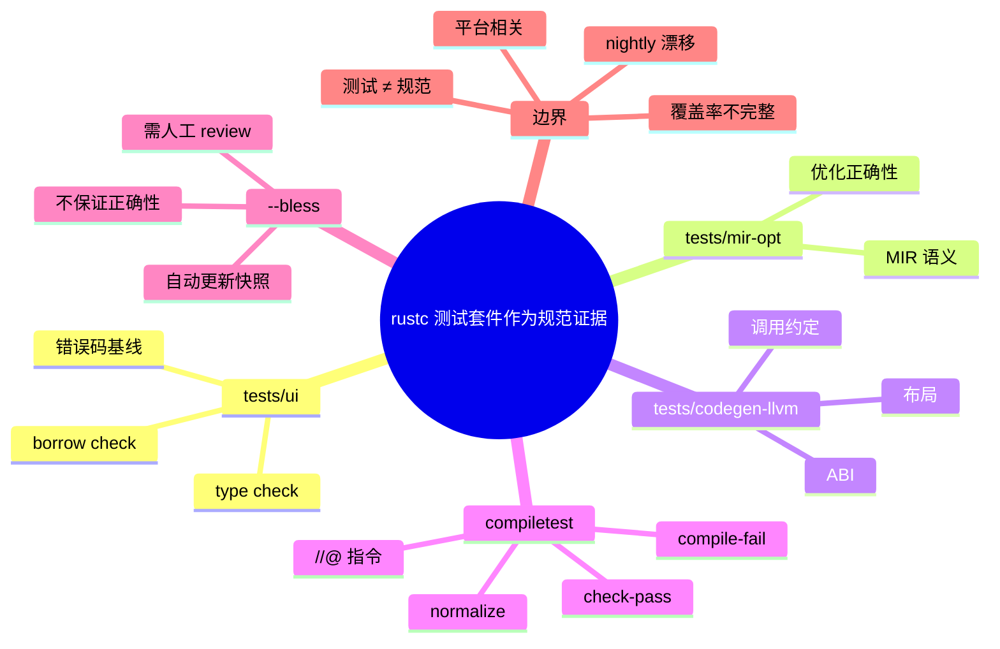

# 从 rustc 测试套件提取规范证据

**EN**: Specification Evidence from the rustc Test Suite
**Summary**: Describes how the rustc test suite—`tests/ui`, `tests/mir-opt`, `tests/codegen-llvm`, and the compiletest framework—serves as empirical specification evidence while distinguishing it from a normative specification.

> **Rust 版本**: 1.97.0+ (Edition 2024)
> **Bloom 层级**: L3-L4
> **权威来源**: 本文件为 `concept/` 权威页。

---

## 1. 测试套件作为规范证据

rustc 的“实现即规范”现状意味着：想了解 Rust 的精确行为，必须查看编译器实际接受/拒绝什么程序。rustc 测试套件因此成为**规范一致性证据库**，主要分为：

| 目录 | 内容 | 规范价值 |
|---|---|---|
| `tests/ui/` | UI 测试：编译错误、警告、borrow check、类型检查示例 | 错误码与报错 wording 的基线 |
| `tests/mir-opt/` | MIR 优化与生成基线 | 中间表示语义与优化正确性 |
| `tests/codegen-llvm/` | LLVM IR 生成检查 | ABI、布局、调用约定 |
| `tests/codegen/` / `tests/assembly/` | 汇编与目标代码检查 | 平台相关语义 |
| `tests/run-make/` | 构建流程测试 | 工具链集成行为 |

这些测试不是规范本身，而是**规范主张的实例化证据**：如果规范说“此程序应产生 E0502”，那么 `tests/ui/` 中对应测试就是该主张的证据。

---

## 2. compiletest 指令

compiletest 是 rustc 的测试框架，使用 `//@` 指令描述测试期望。典型指令包括：

```rust,ignore
//@ edition: 2024
//@ check-pass
//@ stderr-per-bitwidth
//@ normalize-stderr-test: "[0-9]+" -> "N"

fn main() {
    println!("hello, compiletest");
}
```

常用指令含义：

| 指令 | 含义 |
|---|---|
| `check-pass` | 编译通过即可，不运行 |
| `run-pass` | 编译并运行通过 |
| `compile-fail` | 编译失败，期望有特定错误 |
| `build-fail` | 构建失败 |
| `stderr-per-bitwidth` | 错误输出因指针宽度而异 |
| `normalize-stderr-test` | 归一化 stderr 以避免无关差异 |
| `edition: 2024` | 指定 Edition |

完整指令参考见 [rustc-dev-guide — Compiletest](https://rustc-dev-guide.rust-lang.org/tests/compiletest.html)。

---

## 3. 运行测试

在 rust-lang/rust 仓库中，典型命令如下：

```bash
# 运行全部 UI 测试（stage 1 编译器）
./x.py test tests/ui --stage 1

# 运行 MIR-opt 测试
./x.py test tests/mir-opt --stage 1

# 运行 codegen-llvm 测试
./x.py test tests/codegen-llvm --stage 1

# 仅运行与借用检查相关的测试
./x.py test tests/ui/borrowck --stage 1
```

> 这些命令需要在 rust-lang/rust 完整 checkout 中执行，并配置 `config.toml`；普通项目无需也无法直接运行。

---

## 4. `--bless` 的风险

当测试期望输出需要更新时，开发者使用 `--bless`：

```bash
./x.py test tests/ui --stage 1 --bless
```

`--bless` 会**自动重写** `.stderr`、`.stdout`、`.mir` 等期望文件。这意味着：

- 它只是更新快照，不验证新行为是否正确。
- 如果编译器引入了回归性变更， `--bless` 会让测试“看起来通过”。
- 因此， `--bless` 后的 diff 必须经过人工 review，不能作为质量保证的终点。

---

## 5. 反命题与边界

### 5.1 常见过度概括

- ❌ “测试覆盖率 = 规范完备性。” → ✅ 测试只覆盖已写入用例的行为；未测试的 corner case 仍可能无规范定义。
- ❌ “`--bless` 让测试通过 = 行为正确。” → ✅ `--bless` 只同步快照；正确性仍需语义审查。
- ❌ “rustc tests 是规范。” → ✅ 测试是证据，不是规范陈述；规范需要解释“为什么接受/拒绝”。
- ❌ “所有 rustc 行为都有测试覆盖。” → ✅ 许多实现细节依赖内部约定，测试并未穷尽。

### 5.2 工程边界

- **测试先于规范 vs 规范先于测试**：理想情况下，新特性稳定化时应同时附带规范章节与测试；但现实中常出现“实现 + 测试先行，规范滞后”。
- **nightly 特性**：nightly 特性可能快速变化，测试是其唯一稳定描述；但测试不会解释设计意图。
- **平台相关行为**：codegen/assembly 测试高度依赖目标平台，不能跨平台直接作为规范。

---

## 6. 国际权威来源

- [rustc-dev-guide — Compiletest](https://rustc-dev-guide.rust-lang.org/tests/compiletest.html)
- [rust-lang/rust tests/ui/](https://github.com/rust-lang/rust/tree/master/tests/ui)
- [rust-lang/rust tests/mir-opt/](https://github.com/rust-lang/rust/tree/master/tests/mir-opt)
- [rust-lang/rust tests/codegen-llvm/](https://github.com/rust-lang/rust/tree/master/tests/codegen-llvm)
- [Inside Rust — Test Infra Jan/Feb 2025](https://blog.rust-lang.org/inside-rust/2025/03/11/test-infra-jan-feb-2025.html)

---

## 7. 与其他概念的关系

- [编译器测试](../../06_ecosystem/00_toolchain/13_compiler_testing.md) — compiletest、UI tests、Crater、rustc-perf 的详细说明。
- [rustc driver 与 Stable MIR](../../06_ecosystem/00_toolchain/10_rustc_driver_and_stable_mir.md) — 把 rustc 当库用，提取规范证据。
- [Rust Reference 与规范性缺口](01_rust_reference_and_normative_gap.md) — 测试证据与自然语言规范的关系。
- [a-mir-formality：类型系统形式化](04_a_mir_formality_type_system_spec.md) — 形式化模型与测试基线如何互证。

---

## 🧭 思维导图（Mindmap）


