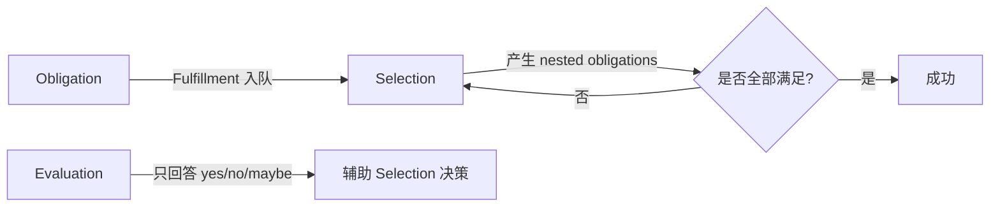

> **内容分级**: [综述级]

> **本节关键术语**: Trait Solver · Selection · Fulfillment · Evaluation · Obligation · Candidate · Winnowing · Coinduction · Next-Gen Solver — [完整对照表](../00_meta/terminology_glossary.md)
>
# rustc 中的 Trait Solver

> **EN**: The Trait Solver in rustc
> **Summary**: Explains how rustc resolves trait obligations through selection, fulfillment, and evaluation; covers the current solver, the next-generation solver, and coinduction.
> **受众**: [专家 / 研究者]
> **Bloom 层级**: 理解 → 分析
> **A/S/P 标记**: **F** — Formal
> **双维定位**: F×Type — 类型系统（Type System）与形式化方法
> **定位**: 把“这个类型是否实现了某 trait”这一核心问题，还原为候选装配、筛选、确认与约束求解的完整算法。
> **前置概念**: [Type System](../01_foundation/04_type_system.md) · [Traits](../02_intermediate/01_traits.md) · [Type Inference](./08_type_inference.md) · [Name Resolution and HIR](./25_name_resolution_and_hir.md)
> **后置概念**: [Rustc Query System](./19_rustc_query_system.md) · [Ownership Formal](./03_ownership_formal.md)

---

> **来源**: [Rustc Dev Guide — Trait Solving](https://rustc-dev-guide.rust-lang.org/traits/resolution.html) ·
> [Rustc Dev Guide — Next-gen trait solving](https://rustc-dev-guide.rust-lang.org/solve/the-solver.html) ·
> [Rustc Dev Guide — Trait Specialization](https://rustc-dev-guide.rust-lang.org/traits/specialization.html) ·
> [Rust Reference — Traits](https://doc.rust-lang.org/reference/items/traits.html)

## 📑 目录

- [rustc 中的 Trait Solver](#rustc-中的-trait-solver)
  - [📑 目录](#-目录)
  - [一、问题定义：Obligation](#一问题定义obligation)
  - [二、三大核心操作](#二三大核心操作)
  - [三、Selection：候选装配与筛选](#三selection候选装配与筛选)
    - [3.1 Candidate Assembly（候选装配）](#31-candidate-assembly候选装配)
    - [3.2 Winnowing（筛选）](#32-winnowing筛选)
    - [3.3 Confirmation（确认）](#33-confirmation确认)
  - [四、Fulfillment：约束求解工作队列](#四fulfillment约束求解工作队列)
  - [五、Evaluation：不约束推断变量的判断](#五evaluation不约束推断变量的判断)
  - [六、新一代 Trait Solver](#六新一代-trait-solver)
  - [七、Coinduction 与递归 Trait](#七coinduction-与递归-trait)
  - [嵌入式测验](#嵌入式测验)
    - [测验 1：什么是 obligation？](#测验-1什么是-obligation)
    - [测验 2：Selection 和 Evaluation 的主要区别是什么？](#测验-2selection-和-evaluation-的主要区别是什么)
    - [测验 3：Winnowing 解决什么问题？](#测验-3winnowing-解决什么问题)
    - [测验 4：新一代 trait solver 与旧 solver 相比，主要优势是什么？](#测验-4新一代-trait-solver-与旧-solver-相比主要优势是什么)
  - [权威来源索引](#权威来源索引)

---

## 一、问题定义：Obligation

Trait 求解的核心问题是：给定一个 **trait reference**（如 `i32: Clone`），判断它是否成立。`rustc` 把这样的待证目标称为 **obligation**（义务/约束）。

```rust,ignore
fn clone_slice<T: Clone>(x: &[T]) -> Vec<T> { ... }

let v = clone_slice(&[1, 2, 3]);
// 这里需要证明 obligation: i32 : Clone
```

在泛型（Generics）函数体内部，`T: Clone` 也是一个 obligation，但它不能被具体实现，而是由调用者保证。

> **关键洞察**: Trait 求解 = 为每个 obligation 找到一个“证据”：一个 impl、一个 where-clause、或一个内建规则。
>
> [来源: Rustc Dev Guide — Trait resolution (old-style)](https://rustc-dev-guide.rust-lang.org/traits/resolution.html)

---

## 二、三大核心操作

| 操作 | 作用 | 是否约束推断变量 |
|:---|:---|:---:|
| **Selection** | 决定如何满足一个 obligation（选哪个 impl / where-clause） | 是 |
| **Fulfillment** | 维护待处理 obligation 的工作队列，驱动 selection 直到全部满足 | 是 |
| **Evaluation** | 判断 obligation 是否成立，不修改推断变量 | 否 |



---

## 三、Selection：候选装配与筛选

### 3.1 Candidate Assembly（候选装配）

对于一个 obligation `T: Trait`，编译器收集所有可能适用的候选：

- `impl` 块；
- where-clause（如 `T: Trait` 参数约束）；
- 内建规则（如 `Sized`、`Copy`、`Unsize`）。

### 3.2 Winnowing（筛选）

如果多个候选都可能在语法上匹配，需要进一步筛选：

```rust,ignore
trait Get { fn get(&self) -> Self; }

impl<T: Copy> Get for T { ... }
impl<T: Get> Get for Box<T> { ... }

let x = Box::new(1_u16).get();
```

- 第一个候选要求 `Box<u16>: Copy` → 不成立；
- 第二个候选要求 `u16: Get` → 递归成立；
- 筛选后唯一剩下第二个候选。

### 3.3 Confirmation（确认）

确认阶段把 impl 的输出类型参数与 obligation 统一。如果统一失败（如下面例子），则报错：

```rust,ignore
trait Convert<Target> { fn convert(&self) -> Target; }
impl Convert<usize> for isize { ... }

let y: char = x.convert(); // ❌ confirmation 失败：impl 要求 Target=usize，但这里期望 char
```

---

## 四、Fulfillment：约束求解工作队列

Fulfillment 是一个工作队列算法：

1. 把初始 obligation 放入队列；
2. 取出队首 obligation，调用 selection；
3. 如果 selection 成功，把产生的 nested obligations 加入队列；
4. 重复直到队列为空；
5. 若过程中出现无法解决的 obligation，则报错。

```rust,ignore
fn foo<T: Clone + Debug>(x: T) {
    let _ = x.clone(); // obligation: T: Clone
    println!("{:?}", x); // obligation: T: Debug
}
```

这两个 obligation 都由调用者通过 where-clause 提供。

> **定理**: Fulfillment 结束时，所有类型检查阶段的 trait obligation 都必须被证明可解。
>
> [来源: Rustc Dev Guide — Trait resolution — Overview](https://rustc-dev-guide.rust-lang.org/traits/resolution.html#overview)

---

## 五、Evaluation：不约束推断变量的判断

Evaluation 只回答“这个 obligation 是否可能成立”，不会修改推断变量。它用于：

- Winnowing 阶段判断某个候选是否可被排除；
- 避免 selection 过早锁定推断变量。

返回值通常是：

- `Yes`：一定成立；
- `No`：一定不成立；
- `Maybe`：包含未推断变量，暂时无法确定。

---

## 六、新一代 Trait Solver

`rustc` 正在逐步替换旧的 trait solver，新 solver 基于更统一的设计：

| 维度 | 旧 Solver | 新 Solver（next-gen） |
|:---|:---|:---|
| 架构 | selection/fulfillment/evaluation 分离 | 统一的 canonical query + proof tree |
| 递归 trait | 需要特殊处理 | 通过 coinduction 更自然支持 |
| 缓存 | 较简单 | 更积极的缓存策略 |
| 共享 | 难与 rust-analyzer 共享 | 已与 rust-analyzer 共享核心逻辑 |
| 状态 | 当前默认 | nightly 可选，逐步稳定中 |

> **状态（截至 Rust 1.96）**: 新 solver 仍在 nightly 中迭代，尚未成为默认。可通过 `-Ztrait-solver=next` 尝试。
>
> [来源: Rustc Dev Guide — Next-gen trait solving](https://rustc-dev-guide.rust-lang.org/solve/the-solver.html)

---

## 七、Coinduction 与递归 Trait

Coinduction（余归纳）允许 solver 在证明循环目标时假设目标已经成立，只要最终能构造出一致解。这对递归 trait 非常有用：

```rust,ignore
// 递归 trait：一个列表的所有元素都满足 P
trait All<P> {
    fn check(&self);
}

impl<P> All<P> for () {}
impl<P, H, T> All<P> for (H, T)
where
    H: P,
    T: All<P>,
{}
```

新 solver 使用 coinduction 来处理这类递归约束，避免无限展开。

> [来源: Rustc Dev Guide — Coinduction](https://rustc-dev-guide.rust-lang.org/solve/coinduction.html)

---

## 嵌入式测验

### 测验 1：什么是 obligation？

<details>
<summary>✅ 答案与解析</summary>

Obligation 是需要被证明的 trait reference，例如 `i32: Clone` 或 `T: Debug`。Trait solver 的任务就是为每个 obligation 找到证据（impl、where-clause 或内建规则）。

</details>

---

### 测验 2：Selection 和 Evaluation 的主要区别是什么？

<details>
<summary>✅ 答案与解析</summary>

- Selection 会选择具体候选并可能约束推断变量；
- Evaluation 只回答 obligation 是否成立，不修改推断变量，常用于筛选候选。

</details>

---

### 测验 3：Winnowing 解决什么问题？

<details>
<summary>✅ 答案与解析</summary>

当多个 impl/候选在语法上都能匹配时，winnowing 利用 where-clause 等条件排除不可能成立的候选，直到只剩一个或为零/多个并报错。

</details>

---

### 测验 4：新一代 trait solver 与旧 solver 相比，主要优势是什么？

<details>
<summary>✅ 答案与解析</summary>

统一了 selection/fulfillment/evaluation，使用 proof tree 和更积极的缓存，天然支持 coinduction，并且核心逻辑已与 rust-analyzer 共享。

</details>

---

## 权威来源索引

| 来源 | 可信度 | 说明 |
|:---|:---:|:---|
| [Rustc Dev Guide — Trait resolution](https://rustc-dev-guide.rust-lang.org/traits/resolution.html) | ✅ 一级 | 旧 solver 官方文档 |
| [Rustc Dev Guide — Next-gen trait solving](https://rustc-dev-guide.rust-lang.org/solve/the-solver.html) | ✅ 一级 | 新 solver 官方文档 |
| [Rustc Dev Guide — Coinduction](https://rustc-dev-guide.rust-lang.org/solve/coinduction.html) | ✅ 一级 | Coinduction 官方文档 |
| [Rust Reference — Traits](https://doc.rust-lang.org/reference/items/traits.html) | ✅ 一级 | 语言层面 trait 规则 |

---

> **权威来源**: [Rustc Dev Guide](https://rustc-dev-guide.rust-lang.org/), [The Rust Reference](https://doc.rust-lang.org/reference/), [Rust Standard Library](https://doc.rust-lang.org/std/)
> **权威来源对齐变更日志**: 2026-06-21 创建，对齐 Rust 1.96.0 trait solver 文档

**文档版本**: 1.0
**对应 Rust 版本**: 1.96.0+ (Edition 2024)
**最后更新**: 2026-06-21
**状态**: ✅ 已对齐 Rust 1.96.0 trait solver 文档
