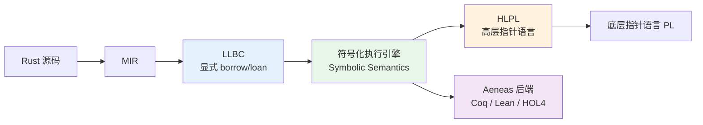

> **内容分级**: [专家级]

# Aeneas Symbolic Semantics（Aeneas 符号化语义）
>
> **EN**: Aeneas Symbolic Semantics
> **Summary**: POPL 2024 论文提出的符号化语义方法：通过 LLBC 显式建模借用（Borrowing）/贷款，用符号执行自动推理，再经 HLPL 桥接底层指针语义，最终在 Aeneas 工具中生成可证明的函数式规范。
> **受众**: [研究者]
> ⚠️ **声明**: 本文件使用形式化符号辅助直觉理解，所呈现的"定理/引理/推论"为**教学类比**，非经机器验证的严格数学证明。如需严格形式化验证，请参考 [Aeneas](https://github.com/AeneasVerif/aeneas)、[Coq](https://coq.inria.fr/)、[Lean](https://lean-lang.org/)。
>
> **Bloom 层级**: 分析 → 评价
> **A/S/P 标记**: **S+P** — Structure + Procedure
> **双维定位**: C×Eva — 评价符号化语义对借用（Borrowing）检查声音性证明的假设边界
> **前置依赖**: [L4 所有权（Ownership）形式化](03_ownership_formal.md) · L4 RustBelt · L4 分离逻辑 · L3 Unsafe
> **后置延伸**: [L6 形式化验证工具](../06_ecosystem/74_formal_verification_tools.md) · [L7 形式化方法](../07_future/02_formal_methods.md)
> **来源**: · [Rust Reference — Functions and Borrowing](https://doc.rust-lang.org/reference/items/functions.html) · [Brown University — Interactive Rust Book](https://rust-book.cs.brown.edu/) · [TRPL](https://doc.rust-lang.org/book/title-page.html) · [Itanium C++ ABI](https://itanium-cxx-abi.github.io/cxx-abi/abi.html)
>
> [POPL 2024 — Sound Borrow-Checking for Rust via Symbolic Semantics](https://doi.org/10.1145/3571192) ·
> [Aeneas 项目](https://github.com/AeneasVerif/aeneas) ·
> [Aeneas: Rust Verification by Functional Translation (ICFP 2022)](https://doi.org/10.1145/3547627)
> **前置概念**: N/A
> **后置概念**: N/A
---

> 本文内容来自已归档的 `docs/rust-ownership-decidability/formal-foundations/models/symbolic-borrow-checking.md`，经提炼后迁移。

## 📑 目录

- [Aeneas Symbolic Semantics（Aeneas 符号化语义）](#aeneas-symbolic-semanticsaeneas-符号化语义)
  - [📑 目录](#-目录)
  - [一、问题与动机（Problem \& Motivation）](#一问题与动机problem--motivation)
  - [二、核心结构总览（Overview）](#二核心结构总览overview)
  - [三、LLBC：显式借用演算](#三llbc显式借用演算)
    - [3.1 设计思想](#31-设计思想)
    - [3.2 核心构造](#32-核心构造)
    - [3.3 与 MIR 的关系](#33-与-mir-的关系)
  - [四、符号化执行语义](#四符号化执行语义)
    - [4.1 符号值与符号状态](#41-符号值与符号状态)
    - [4.2 路径约束](#42-路径约束)
    - [4.3 Borrow / Loan 规则（教学类比）](#43-borrow--loan-规则教学类比)
    - [4.4 状态重组（Reorganization）](#44-状态重组reorganization)
  - [五、HLPL：高层指针语言](#五hlpl高层指针语言)
  - [六、模拟关系与声音性](#六模拟关系与声音性)
    - [6.1 模拟关系](#61-模拟关系)
    - [6.2 声音性定理（教学类比）](#62-声音性定理教学类比)
    - [6.3 组合性](#63-组合性)
  - [七、Aeneas 工具链与验证流程](#七aeneas-工具链与验证流程)
    - [7.1 Aeneas 流程](#71-aeneas-流程)
    - [7.2 Rust / Aeneas 风格示例](#72-rust--aeneas-风格示例)
  - [八、与 Miri / BorrowSanitizer 的关系](#八与-miri--borrowsanitizer-的关系)
  - [九、认知路径（Cognitive Path）](#九认知路径cognitive-path)
  - [十、来源与延伸阅读](#十来源与延伸阅读)
  - [相关概念](#相关概念)

---

## 一、问题与动机（Problem & Motivation）

Rust 借用检查器在编译期拒绝大量内存不安全程序，但它本身的正确性如何证明？传统上有两条路：

| 路径 | 代表 | 优点 | 局限 |
|:---|:---|:---|:---|
| 手动分离逻辑证明 | RustBelt / Iris | 严格、可机械检验 | 人工成本高，难以自动化 |
| 类型系统（Type System）形式化 | 多种类型论模型 | 与编译器接近 | 规则复杂，难以处理优化和 unsafe 边界 |

POPL 2024 论文 *Sound Borrow-Checking for Rust via Symbolic Semantics* 提出第三条路：**用符号化执行语义自动推理借用检查的声音性**，将 Rust/MIR 翻译成显式借用演算 LLBC，再通过 HLPL 桥接到底层指针语义，最终由 Aeneas 生成可证明的函数式等价物。

核心洞察：把"隐式的借用生命周期（Lifetimes）"变成**显式的 loan/borrow 状态机**，用符号值替代具体值，路径约束记录分支条件，从而把声音性证明转化为可达性分析。

---

## 二、核心结构总览（Overview）



流程：Rust → MIR（rustc 去糖）→ LLBC（显式 borrow/loan）→ 符号化执行（探索所有符号路径）→ HLPL（模拟关系桥接）→ PL（底层指针语义）；同时符号状态序列被翻译成 Coq/Lean/HOL4 规范。

---

## 三、LLBC：显式借用演算

### 3.1 设计思想

LLBC 把 Rust 的隐式借用变成显式命令。

```rust,ignore
let x = &mut v;
*x = 42;
// x 隐式结束
```

对应的 LLBC 风格（教学类比）：

```text
borrow_mut x from v;   // 创建可变借用，v 进入 loan 状态
loan v to x;           // v 被冻结
write x 42;            // 通过借用写入
end_loan x;            // 显式结束借用，v 恢复
```

### 3.2 核心构造

```text
值 v ::= n | true | false | () | ptr(ℓ, β, perm) | ⊥
perm ::= Mutable | Shared
表达式 e ::= v | x | e₁ + e₂ | &p | &mut p | *e
命令 c ::= skip | x := e | c₁; c₂
        | if e then c₁ else c₂ | while e do c
        | start_loan(x, p) | end_loan(x) | reborrow(x, y)
位置 p ::= x | p.f | p[n]
```

### 3.3 与 MIR 的关系

| MIR 构造 | LLBC 构造 | 说明 |
|:---|:---|:---|
| `_1 = &_2` | `x := &y` | 共享借用显式化 |
| `_1 = &mut _2` | `x := &mut y` | 可变借用（Mutable Borrow）显式化 |
| `StorageDead` | `end_loan` | 生命周期（Lifetimes）结束显式化 |
| `Drop` | 隐式/显式 drop | 析构与贷款恢复联动 |

LLBC 显式维护 `B`（借用集合）和 `L`（贷款集合），而 MIR 把这些信息分散在借用检查器的分析结果中。

---

## 四、符号化执行语义

### 4.1 符号值与符号状态

```text
符号值 s ::= α | β | γ | ...     // 符号常量
         | n | true | false      // 具体值
         | s₁ + s₂ | f(s₁,...,sₙ) // 表达式 / 未解释函数

符号状态 Σ ::= (M, P, B, L)
  M: 内存映射   Place → SymbolicValue
  P: 路径约束   PathCondition
  B: 借用集合   {(β, perm, ℓ)}
  L: 贷款集合   {(ℓ, β, x, v)}
```

### 4.2 路径约束

```text
Γ ⊢ ((M, P, B, L), if s then c₁ else c₂)
  → 分支 1: ((M, P ∧ s, B, L), c₁)
     分支 2: ((M, P ∧ ¬s, B, L), c₂)
```

```rust,ignore
if x > 0 { y = 1; } else { y = 2; }
// 路径 1: P = (α > 0), y ↦ 1
// 路径 2: P = (α ≤ 0), y ↦ 2
```

### 4.3 Borrow / Loan 规则（教学类比）

**创建可变借用（Mutable Borrow）**：

```text
Σ(p) = loc(ℓ, v)     fresh α, β
─────────────────────────────────────────
Γ ⊢ (Σ, x := &mut p) → (Σ', skip)

Σ' = Σ[ x ↦ ptr(ℓ, β, Mutable),
        p ↦ loan(ℓ, β, x, α),
        B ↦ B ∪ {(β, Mutable, ℓ)},
        L ↦ L ∪ {(ℓ, β, x, v)} ]
```

**创建共享借用**（只需 `Shared` 权限）：

```text
Σ(p) = loc(ℓ, v)     fresh β
─────────────────────────────────────────
Γ ⊢ (Σ, x := &p) → (Σ', skip)

Σ' = Σ[ x ↦ ptr(ℓ, β, Shared),
        p ↦ loan(ℓ, β, x, v),
        B ↦ B ∪ {(β, Shared, ℓ)},
        L ↦ L ∪ {(ℓ, β, x, v)} ]
```

**写入借用**：

```text
Σ(x) = ptr(ℓ, β, Mutable)    (β, Mutable, ℓ) ∈ B
─────────────────────────────────────────
Γ ⊢ (Σ, *x := v) → (Σ[M(ℓ) ↦ v], skip)
```

### 4.4 状态重组（Reorganization）

Rust 的借用会在作用域结束时自动失效，LLBC 用非确定性重组规则模拟：

```text
(* Reorg-End-Loan: 贷款结束，恢复原始位置 *)
(ℓ, β, x, v) ∈ L    Σ(x) = ⊥
─────────────────────────────────────────
Σ ⇒ Σ[ p ↦ loc(ℓ, v),
       L ↦ L \\ {(ℓ, β, x, v)},
       B ↦ B \\ {(β, _, ℓ)} ]
```

> 重组选择的非确定性意味着某些错误选择会导致 stuck，对应于程序出现 UB。

---

## 五、HLPL：高层指针语言

HLPL 作为 LLBC 与底层指针语义 PL 之间的中间层：没有显式 `borrow`/`loan` 命令，保留抽象指针 `ptr(ℓ)` 和位置 `loc(ℓ, v)`，值与位置分离。

```text
Rust ──▶ MIR ──▶ LLBC ──▶ HLPL ──▶ PL
                          ↑
                          └── 桥接高层抽象与低层指针

Σ_H ::= (M, P)
  M: Map<Place, Value>
  Value ::= n | true | false | ptr(ℓ) | loc(ℓ, v)
```

HLPL 把 LLBC 中"借用是否有效"转换为"指针是否可解引用（Reference）"，复用传统指针语义理论。

---

## 六、模拟关系与声音性

### 6.1 模拟关系

定义 LLBC 状态与 HLPL 状态之间的对应关系（教学类比）：

```text
R ⊆ State_LLBC × State_HLPL

R(Σ_L, Σ_H) 当且仅当：
1. 路径约束等价：Σ_L.P ⟺ Σ_H.P
2. 内存内容一致（考虑 loan 中的冻结值）
3. 借用关系保持：B、L 中的信息在 M 中有对应投影
```

### 6.2 声音性定理（教学类比）

**定理（借用检查声音性）**：

```text
如果 Rust 程序 P 通过 rustc 借用检查，
则 P 在 LLBC 符号化语义下不会导致 UB（不会 stuck 在非法内存访问）。
```

**证明思路**：对每个 LLBC 小步规则构造 HLPL 对应执行序列；将 `ptr ℓ`/`loc ℓ v` 映射到具体地址与堆内存；由传递性 `LLBC ↝ HLPL ↝ PL` 得 well-typed Rust 程序在 PL 中安全。

```text
前向模拟（教学类比）:
∀ Σ₁, Σ₁', Σ₂.
  R(Σ₁, Σ₂) ∧ Σ₁ → Σ₁'
  ⇒ ∃ Σ₂'. Σ₂ →* Σ₂' ∧ R(Σ₁', Σ₂')
```

### 6.3 组合性

模块（Module）级别的验证结果可以组合：若模块 A 和 B 分别通过 LLBC 符号化执行验证，则 `A ∘ B` 在接口契约一致时也验证通过。这依赖分离逻辑的 frame rule：局部推理可扩展到全局上下文。

---

## 七、Aeneas 工具链与验证流程

### 7.1 Aeneas 流程

```text
Rust 源码
   ↓ (rustc)
MIR
   ↓ (Aeneas 前端)
LLBC
   ↓ (符号化执行)
符号化状态序列
   ↓ (后端翻译)
Coq / Lean / HOL4 代码
```

Aeneas 的特殊之处：不仅证明内存安全（Memory Safety），还生成纯函数式规范，使开发者可进一步证明功能正确性。

### 7.2 Rust / Aeneas 风格示例

**示例 1：简单求和**

```rust,ignore
fn sum(v: &[i32]) -> i32 {
    let mut s = 0;
    for x in v { s += x; }
    s
}
```

Aeneas 生成的目标（教学类比，Coq 风格）：

```coq
Definition sum (v: list i32) : i32 := fold_left Int.add v 0.

Theorem sum_llbc_pure : forall v, llbc_sum v = sum v.
Proof. (* Aeneas 生成的证明脚本 *) Qed.
```

**示例 2：可变借用与状态重组**

```rust,ignore
fn incr(v: &mut i32) { *v += 1; }

fn main() {
    let mut n = 0;
    incr(&mut n);
    assert_eq!(n, 1);
}
```

LLBC 风格（教学类比）：

```text
main:
  n := 0;
  borrow_mut r from n;     // r = &mut n, n 被 loan 冻结
  loan n to r;
  *r := *r + 1;             // 通过借用写入
  end_loan r;              // 贷款结束，n 恢复为 1
  assert n == 1;
```

符号化执行会验证：在 `end_loan r` 之后，`n` 的值从 `0` 变为 `1`，且没有非法别名访问。

---

## 八、与 Miri / BorrowSanitizer 的关系

| 工具 | 方法 | 检查目标 | 覆盖范围 | 保证强度 |
|:---|:---|:---|:---|:---|
| **Miri** | 解释执行 MIR | 动态语义、UB、Stacked/Tree Borrows | 运行到的路径 | 动态检测，不证明 |
| **BorrowSanitizer** | LLVM 插桩 | 别名模型违规 | 运行时（Runtime）执行路径 | 动态检测，面向 FFI |
| **Aeneas** | 符号化执行 + 函数式翻译 | 借用检查声音性 + 功能正确性 | 所有符号路径 | 数学证明（在模型内） |

**互补定位**：Miri 用于开发期快速发现 UB；BorrowSanitizer 面向 Rust/C/C++ 互操作的别名检测；Aeneas 对安全 Rust 子集给出功能正确性证明。Miri/BorrowSanitizer 问"这条路径是否违规"，Aeneas 问"对所有符号输入是否满足规范"。

---

## 九、认知路径（Cognitive Path）

```text
Aeneas 符号化语义五步认知路径
─────────────────────────────────────────────────────────
步骤1: "为什么不用 Iris 手动证明？"
   RustBelt 严格但人工成本高；符号化语义把 borrow/loan
   变成状态机，让 soundness 证明更可自动化。

步骤2: "LLBC 做了什么？"
   把 Rust 的隐式借用变成显式 borrow/loan/end_loan 命令，
   让生命周期分析变成显式状态转换。

步骤3: "符号化执行如何推理？"
   用符号值 α, β 替代输入，用路径约束 P 记录分支条件，
   探索所有可达状态。

步骤4: "HLPL 为什么存在？"
   在 LLBC 与底层指针语义之间搭一座桥，
   用模拟关系把高层抽象安全传递到底层内存。

步骤5: "Aeneas 能证明什么？"
   内存安全 + 功能正确性（在 accepted 子集内），
   输出到 Coq/Lean/HOL4，供进一步交互证明。
─────────────────────────────────────────────────────────
```

**类比**：如果把 Rust 验证比作建筑认证——RustBelt 是"手工结构力学验算"，Aeneas 符号化语义则是"计算机辅助有限元分析"，它把大量重复推理自动化，但仍需正确的模型假设（C1/C2 边界）。

---

## 十、来源与延伸阅读

| 来源 | 说明 |
|:---|:---|
| [Ho, Fromherz, Protzenko. *Sound Borrow-Checking for Rust via Symbolic Semantics*. POPL 2024](https://doi.org/10.1145/3571192) | 核心论文 |
| [Ho & Protzenko. *Aeneas: Rust Verification by Functional Translation*. ICFP 2022](https://doi.org/10.1145/3547627) | Aeneas 工具奠基论文 |
| [Aeneas GitHub](https://github.com/AeneasVerif/aeneas) | 工具实现与教程 |
| [RustBelt — POPL 2018](https://plv.mpi-sws.org/rustbelt/popl18/) | 手动 Iris 证明路线 |
| [Miri](https://github.com/rust-lang/miri) | Rust MIR 解释器 |
| BorrowSanitizer | 运行时（Runtime）别名模型检测 |

---

**文档版本**: 1.0
**对应 Rust 版本**: 1.96.0+ (Edition 2024)
**最后更新**: 2026-06-25
**状态**: ✅ 概念迁移完成

---

## 相关概念

- [L4 RustBelt](04_rustbelt.md)
- [L4 分离逻辑](11_separation_logic.md)
- [L4 所有权形式化](03_ownership_formal.md)
- [L3 Unsafe Rust](../03_advanced/03_unsafe.md)
- [L6 形式化验证工具](../06_ecosystem/74_formal_verification_tools.md)
- [BorrowSanitizer](34_borrow_sanitizer_in_formal.md)
