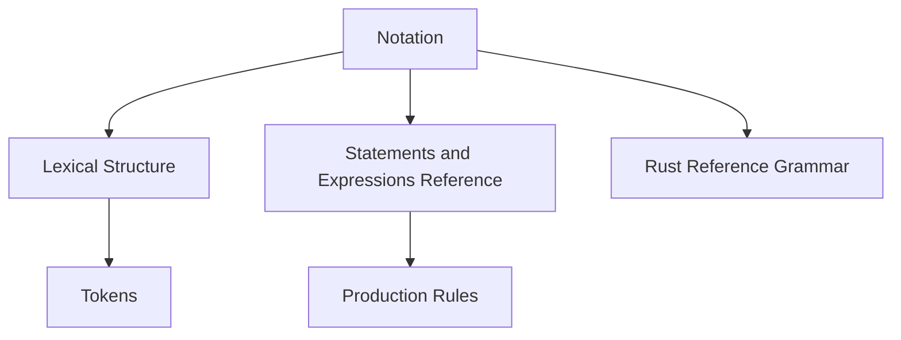

# 符号约定（Notation）

> **EN**: Notation
> **Summary**: Rust Reference 使用的形式化记法约定：BNF/EBNF 风格产生式、Unicode 属性、规则标识符与测试链接的解读方式。
>
> **受众**: [研究者]
> **内容分级**: [研究级]
> **Bloom 层级**: 记忆 → 理解
> **A/S/P 标记**: **S** — Specification
> **双维定位**: S×Ana — 规范分析
> **前置依赖**: [Programming Language Foundations](23_programming_language_foundations.md)
> **后置概念**: [Lexical Structure](45_lexical_structure.md)
> **定理链**: Syntax → Production Rule → Rust Grammar
>
> **来源**: [Rust Reference — Notation](https://doc.rust-lang.org/reference/notation.html)

---

## 一、产生式规则

Rust Reference 使用类似 BNF（Backus–Naur Form）的产生式描述语法。

```text
rule-name := expression
```

- `:=` 左侧为规则名，右侧为展开式。
- 规则名使用小写连字符形式，如 `identifier`。
- 多个产生式用竖线 `|` 分隔，表示“或”。

### 示例

```text
type := path
      | tuple-type
      | function-type
```

## 二、重复与可选

| 记法 | 含义 |
|:---|:---|
| `item*` | 零次或多次重复 |
| `item+` | 一次或多次重复 |
| `item?` | 可选（零次或一次） |
| `(item)*` | 对分组整体重复 |

## 三、终结符与非终结符

- **终结符**：用等宽字体表示的具体 token，如 `fn`、`;`、`{`。
- **非终结符**：用斜体或下划线表示的语法范畴，如 *expression*、*type*。
- **Unicode 属性**：产生式中可能引用 Unicode 标准属性，如 `XID_Start`、`XID_Continue`。

## 四、规则标识符

Rust Reference 为许多规则附加稳定标识符，形如：

```text
[notation.productions.repetition]
```

这些标识符用于：

1. 在文档内部交叉引用。
2. 链接到对应的编译器测试（Tests 链接）。
3. 在 RFC 或 issue 讨论中精确指代规则。

> **注意**：规则标识符当前仍处于稳定化过程中，版本间可能变动。

## 五、阅读策略

- 先查总览产生式，再深入具体子规则。
- 结合 [Lexical Structure](45_lexical_structure.md) 理解 token 级别规则。
- 结合 Rust Reference 的 Grammar Summary 附录获取完整语法概览。

---

## 六、与其他概念的关系



---

> **权威来源**: [Rust Reference — Notation](https://doc.rust-lang.org/reference/notation.html) · [Unicode Standard — Identifier and Pattern Syntax](https://unicode.org/reports/tr31/)
> **内容分级**: [研究级]
