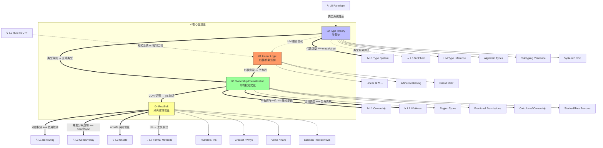

# L4 形式化理论层（Formal Methods）

> **定位**：Rust 概念体系的**数学根基**与形式化验证。本层为 L1-L3 的所有安全保证提供严格的数学证明，是知识体系的"地基"。
> **Bloom 层级**: 分析 → 评价
> **核心功能**: 为上层概念提供**可机械验证的**安全性证明

---

## 一、本层概念关系图（完整版）



### 1.1 概念间语义链接

| 关系 | 从 | 到 | 语义类型 | 说明 |
|:---|:---|:---|:---|:---|
| 1 | **Linear Logic** | **Ownership Formalization** | `==>` 形式化根基 | 线性逻辑中的资源不可复制性（`A ⊗ B`）直接对应所有权的"唯一拥有"语义。这是 L4→L1 的**核心映射**。 |
| 2 | **Type Theory** | **Ownership Formalization** | `==>` 形式化根基 | 区域类型（Region Types）是生命周期标注的数学模型；代数类型（和/积）是 enum/struct 的数学模型。 |
| 3 | **Ownership Formalization** | **RustBelt** | `==>` 验证实现 | COR（Calculus of Ownership and Resources）提供操作语义，RustBelt 在此基础上用 Iris 分离逻辑构建**机械可验证**的安全证明。 |
| 4 | **RustBelt** | **L3 Concurrency** | `==>` 验证覆盖 | RustBelt 证明了 Send/Sync 规则足以保证并发安全（无数据竞争）。 |
| 5 | **RustBelt** | **L3 Unsafe** | `==>` 边界明确 | RustBelt 的证明**不覆盖** unsafe 块。这是形式化保证的明确边界。 |

### 1.2 L4 → L1 的核心映射链

```text
[线性逻辑]                    [区域类型]                  [分离逻辑]
    │                            │                          │
    │ ⊗ 资源组合                  │ 'a 是区域变量             │ 分数权限
    │ !A 允许复制                 │ 偏序约束                  │ 共享读取 / 独占写入
    │                             │                          │
    ▼                             ▼                          ▼
[所有权]                      [生命周期]                  [借用规则]
    │                            │                          │
    │ 唯一 owner                  │ 引用存活期约束            │ &T / &mut T
    │ Copy trait = ! weakening    │ Elision = 约束推导        │ AXM 规则
    │                             │                          │
    └──────────────┬─────────────┴──────────────┬───────────┘
                   │                            │
                   ▼                            ▼
            [Move 语义安全]              [无悬垂指针]
                   │                            │
                   └──────────────┬─────────────┘
                                  │
                                  ▼
                    [RustBelt: 机械验证上述所有定理]
```

---

## 二、文件索引与关系

| 文件 | 概念 | 核心内容 | 状态 | 映射的上层概念 | 工具化输出 |
|:---|:---|:---|:---|:---|:---|
| [01_linear_logic.md](./01_linear_logic.md) | 线性/仿射逻辑 | 资源敏感逻辑、⊗/⅋/⊸、Girard 1987、 weakening | ✅ v1.0 | L1 Ownership (唯一性), L1 Move/Copy | — |
| [02_type_theory.md](./02_type_theory.md) | 类型论基础 | ADT、HM 推断、子类型、Variance、System F | ✅ v1.0 | L1 Type System, L2 Generics | L6 编译器类型检查 |
| [03_ownership_formal.md](./03_ownership_formal.md) | 所有权形式化 | COR、区域类型、分数权限、操作语义 | ✅ v1.0 | L1 Ownership + Borrowing + Lifetimes | — |
| [04_rustbelt.md](./04_rustbelt.md) | RustBelt 与验证 | Iris 分离逻辑、验证工具链、工业应用 | ✅ v1.0 | L3 Concurrency + Unsafe | L7 Creusot/Verus/Kani |
| [05_verification_toolchain.md](./05_verification_toolchain.md) | 验证工具链选型 | ROI 分析、决策树、分层验证策略 | ✅ v1.0 | L3-L6 验证实践 | — |

---

## 三、与上层概念的严格映射

### 3.1 映射精度评估

| L4 理论 | L1-L3 概念 | 映射类型 | 精度 | 说明 |
|:---|:---|:---|:---|:---|
| 线性逻辑 ⊗ | 所有权唯一性 | 双射 | **精确** | 所有权 ⟺ 线性资源 |
| 仿射逻辑 weakening | Copy trait | 特化 | **精确** | Copy = 显式允许 weakening |
| 区域类型 | 生命周期 'a | 嵌入 | **精确** | 生命周期 = 区域约束 |
| 分数权限 | 借用 &/&mut | 同态 | **近似** | 借用 ⊂ 分数权限（编译期子集） |
| 分离逻辑 | 并发安全 | 同态 | **近似** | Send/Sync ⟹ CSL 资源安全 |
| 代数类型 | enum/struct | 双射 | **精确** | sum/product 类型 ⟺ enum/struct |
| HM 推断 | 类型推断 | 双射 | **精确** | Rust 类型推断是 HM 的扩展 |
| System F | 泛型 | 嵌入 | **近似** | Rust 泛型 ≈ System F + 约束 |

### 3.2 映射的"损失"

```text
L4 → L1 映射中的信息损失:

┌─────────────────────────────────────────────────────────────┐
│ L4 理论                      L1 实践           损失内容       │
├─────────────────────────────────────────────────────────────┤
│ 线性逻辑（任意资源）           堆分配 + 变量      栈变量优化    │
│ 分数权限（连续值 0-1）         &/&mut（离散值）   部分共享缺失   │
│ 区域类型（全称量词 ∀）          'a（具体标注）    HRTB 表达局限   │
│ System F（无约束）             where 子句        约束求解复杂度   │
│ 分离逻辑（任意断言）            Send/Sync         细粒度权限缺失  │
└─────────────────────────────────────────────────────────────┘
```

---

## 四、形式化层级定位

| 概念 | 理论层 (Why) | 模型层 (What) | 实践层 (How) | 对应上层 |
|:---|:---|:---|:---|:---|
| **Linear Logic** | 资源敏感推理的元理论 | 线性/仿射证明系统 | Girard 的sequent calculus | L1 所有权语义 |
| **Type Theory** | 类型即命题 (Curry-Howard) | HM / System F / 代数类型 | 类型规则、推断算法 | L1-L2 类型系统 |
| **Ownership Formal** | 所有权操作语义 | COR、区域约束图 | 借用检查器算法 | L1 编译器核心 |
| **RustBelt** | 程序逻辑验证 | Iris 分离逻辑、Protocol | Kani/Creusot/Verus | L3 并发/unsafe 验证 |

---

## 五、本层定理一致性概览

| 定理 | 前提 | 结论 | 依赖的公理 | 失效条件 | 验证工具 |
|:---|:---|:---|:---|:---|:---|
| 线性资源 ⟹ 所有权安全 | 线性逻辑证明系统 | 无 use-after-move | 线性逻辑 ⊗ 规则 | 允许 weakening（Copy） | 逻辑推导 |
| 区域约束可满足 ⟹ 无悬垂指针 | 区域偏序约束 | 所有引用合法 | Tofte-Talpin 区域类型 | HRTB 不可判定片段 | 约束求解器 |
| 分数权限 ⟹ AXM | 分离逻辑框架 | &T 与 &mut T 不共存 | 分数权限分配规则 | UnsafeCell 绕过 | Iris 证明助手 |
| RustBelt ⟹ Safe Rust 无数据竞争 | λRust 操作语义 | 所有 safe 程序安全 | Iris 高阶分离逻辑 | unsafe 块、FFI | Coq 证明 |
| 单态化 ⟺ 参数多态实例化 | System F | 零运行时开销 | 参数性 (Parametricity) | dyn Trait（存在类型） | — |

---

## 六、认知路径

```text
直觉困惑                    具体场景                  模式抽象               形式规则              代码验证              边界测试
    │                         │                       │                     │                    │                    │
    ▼                         ▼                       ▼                     ▼                    ▼                    ▼
"为什么 Rust                  "其他语言用 GC/          "线性逻辑 =           "Girard              "借用检查器          "Copy trait
 不用 GC 也能                手动管理，Rust           资源不可              sequent              算法实现"           打破线性性
 安全？"                     怎么自动安全？"          复制性"               calculus"

"生命周期标注                "为什么编译器              "区域类型 =           "Tofte-Talpin        "NLL 约束求解"       "HRTB 的
 和数学有什么关系？"          能检查引用合法性？"       偏序约束"             1994"                                    可判定性"

"怎么证明并发                  "Send/Sync 的             "并发分离逻辑 =       "Iris Protocols      "RustBelt/           "unsafe impl
 代码无数据竞争？"             保证足够吗？"             线程间资源隔离"       · CSL"              Coq 证明"           需手动验证"
```

---

## 七、跨层出口

L4 的形式化成果输出到：

- **L1-L3**: 编译器借用检查器的算法根基、类型系统的一致性保证
- **L5 对比**: 形式系统 vs 机制工程的哲学论证（原 01.md 的核心论点）
- **L6 生态**: Clippy lint、Miri 动态检测（形式化理论的工程近似）
- **L7 前沿**: Kani/Creusot/Verus 工业验证工具、AI 形式化辅助证明
