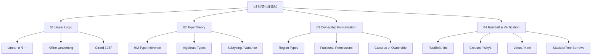

# L4 形式化理论层（Formal Methods）

> **定位**：Rust 概念体系的数学根基与形式化验证。本层内容对齐 RustBelt、COR、线性逻辑、类型论、分离逻辑等学术成果，以及 Creusot/Verus/Kani 等工业验证工具。

---

## 一、本层概念图谱



---

## 二、文件索引

| 文件 | 概念 | 核心内容 | 状态 |
|:---|:---|:---|:---|
| `01_linear_logic.md` | 线性/仿射逻辑 | 资源敏感逻辑、所有权数学根基 | ✅ v1.0 |
| `02_type_theory.md` | 类型论基础 | ADT、推断、子类型、Variance | ✅ v1.0 |
| `03_ownership_formal.md` | 所有权形式化 | COR、区域类型、分离逻辑 | ✅ v1.0 |
| `04_rustbelt.md` | RustBelt 与验证 | Iris 逻辑、验证工具链、工业应用 | ✅ v1.0 |

---

## 三、与上层概念的关系

```text
L4 形式化理论层
    ↓ 为...提供数学基础
L1-L3 语言概念层
    ↓ 为...提供验证对象
L6-L7 生态与前沿层
```

---

## 四、待创建内容（按 Phase 3 计划）

详见 [PLAN.md](../PLAN.md) Phase 3 部分。
