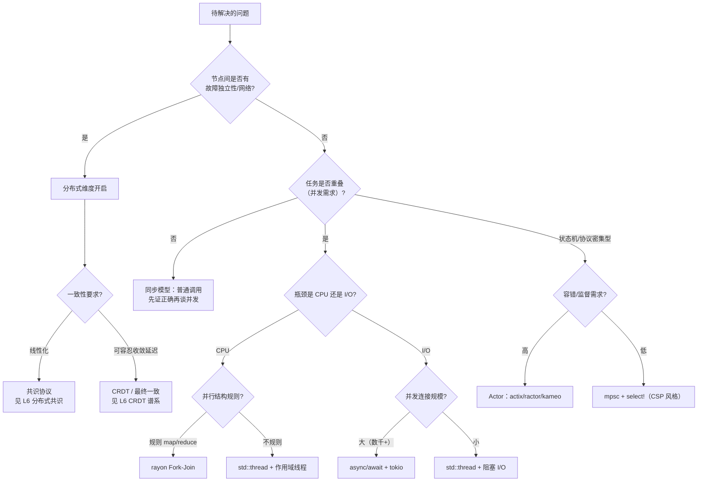
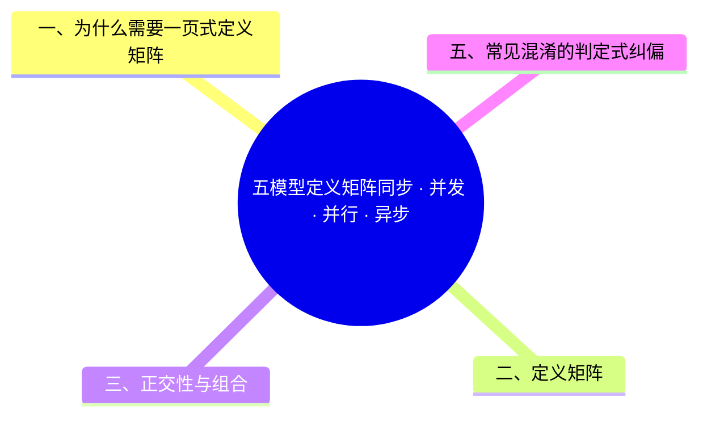

> **本节关键术语**: 同步（Synchronous） · 并发（Concurrency） · 并行（Parallelism） · 异步（Asynchronous） · 分布式（Distributed） · 定义矩阵（Definition Matrix） — [完整对照表](../../00_meta/01_terminology/01_terminology_glossary.md)

# 五模型定义矩阵：同步 · 并发 · 并行 · 异步 · 分布式

> **EN**: Five Execution Models Definition Matrix
> **Summary**: A one-page definition matrix of the five execution models (synchronous, concurrent, parallel, asynchronous, distributed) cross-referenced by definition, formal root, Rust vehicle, canonical primitives, failure modes, and links to their authoritative pages — plus a selection decision tree.
> **Rust 版本**: 1.97.0+ (Edition 2024)
> **受众**: [初学者 / 进阶]
> **内容分级**: [导航级]
> **Bloom 层级**: L2-L5
> **权威来源**: 本文件为 `concept/` 权威页（导航型）：五模型定义矩阵的唯一一页式入口；**各模型的概念正文以各自权威页为准，本页不复制正文**（AGENTS.md §2 Canonical 规则）。
> **A/S/P 标记**: **S** — Structure
> **双维定位**: R×Und — 建立五模型的区分性理解
> **前置概念**: [L3 并发编程](../../03_advanced/00_concurrency/01_concurrency.md) · [L4 进程代数与 Rust](../../04_formal/07_concurrency_semantics/01_process_calculi_for_rust.md)
> **后置概念**: [L5 执行模型同构性矩阵](02_execution_model_isomorphism.md) · [L4 线性化与一致性谱系](../../04_formal/07_concurrency_semantics/02_linearizability_and_consistency.md) · [L6 CRDT 谱系](../../06_ecosystem/06_data_and_distributed/08_crdt_type_zoo.md)

---

## 一、为什么需要一页式定义矩阵

「同步/并发/并行/异步/分布式」五个词在日常讨论中高度混用（「异步并发」「并行同步」），但每个词在形式文献中有**精确且互不相同的**定义。混用的代价是选型错误：把「需要并发」的问题用「并行」工具解（线程爆炸），或把「分布式」问题按「并发」假设建模（忽略部分失败）。

本页是**纯导航页**：每个模型给出定义、形式根基、Rust 载体、典型原语、失效模式各一行，全部深度内容链接到对应权威页。

> **过渡**: 矩阵按「定义精确度」而非学习难度排列；行与行之间是正交的——一个真实系统通常同时占据多行。

---

## 二、定义矩阵

| 维度 | 同步（Sync） | 并发（Concurrent） | 并行（Parallel） | 异步（Async） | 分布式（Distributed） |
|:---|:---|:---|:---|:---|:---|
| **定义** | 调用者阻塞直到被调用者返回；控制流串行 | 多个任务**在时间段上重叠**（逻辑同时性），可在单核交错 | 多个计算**在物理上同时**执行（需多核/多机） | 任务发起与完成解耦；发起方不阻塞，经回调/poll 获知结果 | 多个**故障独立**的节点经网络通信协作；无共享内存、无全局时钟 |
| **形式根基** | λ 演算求值序（见 [L4 求值策略](../../04_formal/03_operational_semantics/04_evaluation_strategies.md)） | 进程代数 CSP/CCS/π（见 [L4 进程代数](../../04_formal/07_concurrency_semantics/01_process_calculi_for_rust.md)）；线性化（见 [L4 一致性谱系](../../04_formal/07_concurrency_semantics/02_linearizability_and_consistency.md)） | 工作度量（Work-Span，Blelloch） | 无栈协程 / CPS（见 [L5 同构性矩阵 §11](02_execution_model_isomorphism.md)） | Lamport 偏序（见 [L6 因果序与向量时钟](../../06_ecosystem/06_data_and_distributed/09_causal_ordering_vector_clocks.md)）；CAP（见 [L4 一致性谱系 §4](../../04_formal/07_concurrency_semantics/02_linearizability_and_consistency.md)） |
| **判定问题** | 调用返回前调用者是否阻塞？ | 任务生命周期是否在时间段上重叠？ | 是否有 ≥2 个硬件执行单元同时推进计算？ | 发起方是否在结果就绪前继续执行？ | 节点是否可独立失败、通信是否必经网络？ |
| **Rust 载体** | 普通函数调用、`for` 循环 | `std::thread` + `Mutex`/`mpsc`（见 [L3 并发编程](../../03_advanced/00_concurrency/01_concurrency.md)） | `rayon` 并行迭代、`rayon::join` | `async fn` + `Future` + executor（tokio，见 [L3 异步编程](../../03_advanced/01_async/01_async.md)） | RPC/消息（tonic、ractor cluster）；CRDT（见 [L6 CRDT 谱系](../../06_ecosystem/06_data_and_distributed/08_crdt_type_zoo.md)） |
| **典型原语** | 调用栈、返回值 | `Mutex`/`RwLock`/`Atomic`、`mpsc::channel`、`select!` | `par_iter`、`join`、`scope` | `.await`、`Waker`、`Pin`、`select!` | 消息传递、向量时钟、共识（见 [L6 分布式共识](../../06_ecosystem/06_data_and_distributed/06_distributed_consensus.md)）、Actor（见 [L4 Actor 语义](../../04_formal/07_concurrency_semantics/03_actor_semantics.md)） |
| **失效模式** | 无并发错误；性能瓶颈 = 调用链延迟 | 数据竞争（Rust 中 ⟹ 编译期拒绝）、死锁、饥饿 | 任务粒度过细 ⟹ 调度开销反超；负载不均 | `!Send` 跨 `.await`、Waker 丢失 ⟹ 任务永不唤醒、取消语义误用 | 部分失败、网络分区、消息乱序/丢失、时钟漂移、并发写发散 |
| **权威页** | [L1 控制流](../../01_foundation/04_control_flow/01_control_flow.md) | [L3 并发编程](../../03_advanced/00_concurrency/01_concurrency.md) | [L3 谱系页 §3](../../03_advanced/00_concurrency/07_parallel_distributed_pattern_spectrum.md) | [L3 异步编程](../../03_advanced/01_async/01_async.md) | [L6 分布式共识](../../06_ecosystem/06_data_and_distributed/06_distributed_consensus.md) |

> **过渡**: 矩阵给出静态坐标；下一节的正交性分析回答「这些模型如何组合」——真实系统几乎从不只属于一行。

---

## 三、正交性与组合

五个模型**不是递进关系而是正交维度**：

```text
并发 ≠ 并行：并发是结构（重叠的任务），并行是执行（同时的硬件）。
  单核上可以并发（交错）；多核上跑单线程程序没有并发也没有并行。
异步 ≠ 并发：异步是发起/完成解耦；单线程事件循环的异步程序无任何并发任务。
分布式 ⊃ 并发：分布式系统必然并发（节点各自执行），但并发系统不必分布式。
同步/异步 是调用语义维度，与其余四维都可组合：
  同步分布式调用（阻塞 RPC）与异步分布式调用（消息投递）都存在。
```

> **过渡**: 正交性意味着选型是「逐维度决策」而非「五选一」——下面的决策树按实际工程问题的问法组织。

---

## 四、选型决策树



> **认知功能**: 决策树的每一层只问一个维度的问题（网络→一致性→瓶颈→规模→容错），对应 §三 的正交性；叶子节点全部指向权威页，本页不重复任何模型的用法正文。

---

## 五、常见混淆的判定式纠偏

| 编号 | 混淆主张 | 判定式纠偏 |
|:---|:---|:---|
| M-01 | 「async 就是并发」 | async 是调用语义；单线程 executor 上的 async 程序**零并发** ⟹ 混淆会导致用 async 解 CPU 密集问题（无加速且增加复杂度） |
| M-02 | 「并发就是并行」 | 并发 ⟹ 需要同步原语；并行 ⟹ 需要多核 ⟹ 混淆会在单核环境追求「并行度」（纯开销） |
| M-03 | 「分布式就是多线程的延伸」 | 分布式无共享内存、有部分失败 ⟹ 共享内存直觉（锁、happens-before）全部失效，需偏序/共识/CRDT |
| M-04 | 「同步等于慢」 | 同步无并发开销；瓶颈在 I/O 串行链时才需要异步 ⟹ 先把同步写对是正确性的最短路径 |

**定理链（定义矩阵一致性）**:

| 编号 | 命题 | 结论 |
|:---|:---|:---|
| T-FM-01 | 并发是结构、并行是执行 | 并发 ⟹̸ 并行；并行 ⟹̸ 并发（反例：SIMD 单指令并行无并发任务） |
| T-FM-02 | 异步与调用语义正交 | 同步/异步 × 并发/并行 四组合均可构造实例 ⟹ 选型须逐维度 |
| T-FM-03 | 分布式蕴含并发 | 多节点独立执行 ⟹ 事件偏序 ⟹ 分布式系统必为并发系统 |

---

## 六、认知路径

> **认知路径**: 五词定义 ⟹ 正交性 ⟹ 决策树 ⟹ 权威页分流。

本页是**入口而非终点**：读完矩阵后，按决策树命中的叶子进入对应权威页——并发走 [L3 并发编程](../../03_advanced/00_concurrency/01_concurrency.md) 与 [L4 进程代数](../../04_formal/07_concurrency_semantics/01_process_calculi_for_rust.md)；异步走 [L3 异步编程](../../03_advanced/01_async/01_async.md)；分布式走 [L6 分布式共识](../../06_ecosystem/06_data_and_distributed/06_distributed_consensus.md) → [L6 因果序](../../06_ecosystem/06_data_and_distributed/09_causal_ordering_vector_clocks.md) → [L6 CRDT](../../06_ecosystem/06_data_and_distributed/08_crdt_type_zoo.md)；对比视角走 [L5 执行模型同构性矩阵](02_execution_model_isomorphism.md)。

**核心推理链**: 精确定义 ⟹ 正交分解 ⟹ 逐维选型 ⟹ 权威页深入——一页之内不提供任何模型的完整解释，这是 Canonical 规则的要求，也是本页的设计原则。

---

## 权威来源索引

- [L4 进程代数与 Rust](../../04_formal/07_concurrency_semantics/01_process_calculi_for_rust.md)（CSP/CCS/π 权威源索引）
- [L4 线性化与一致性谱系](../../04_formal/07_concurrency_semantics/02_linearizability_and_consistency.md)（Herlihy-Wing、CAP 权威源索引）
- [L6 因果序与向量时钟](../../06_ecosystem/06_data_and_distributed/09_causal_ordering_vector_clocks.md)（Lamport/Fidge/Mattern 权威源索引）
- Lamport 1978 原文：[ACM DL](https://dl.acm.org/doi/10.1145/359545.359563)（ACM 反爬） · [作者主页 PDF](https://lamport.azurewebsites.net/pubs/time-clocks.pdf)
- [The Rust Programming Language §16 Concurrency](https://doc.rust-lang.org/book/ch16-00-concurrency.html) · [Rust Async Book](https://rust-lang.github.io/async-book/index.html) · [docs.rs/tokio](https://docs.rs/tokio/latest/tokio/)

> **相关文件**: [同层：执行模型同构性矩阵](02_execution_model_isomorphism.md) · [同层：范式矩阵](01_paradigm_matrix.md) · [L3 谱系页](../../03_advanced/00_concurrency/07_parallel_distributed_pattern_spectrum.md)
>
> **文档版本**: 1.0 ｜ **最后更新**: 2026-07-12 ｜ **状态**: ✅ W5-6 新建（Rust 1.97 对齐）

## ⚠️ 反例与陷阱

**反例：把 RAII 等同于垃圾回收（GC）。**

常见误述：「Rust 的内存管理是一种编译期 GC」。RAII/Drop 是**确定性**析构——对象在离开作用域的精确程序点被释放，无后台线程、无停顿、无回收器；GC 是**非确定性**回收——对象死亡时间不可预测，靠运行中的回收器扫描。

**修正对照**：判定一个模型属于哪类，问三个问题——

1. 释放时机是否由程序结构静态确定？（RAII：是；GC：否）
2. 是否存在运行时回收线程/写屏障开销？（RAII：否；GC：是）
3. 析构顺序是否可依赖？（RAII：可；GC：不可）

**陷阱要点**：矩阵中的五模型（手动/RAII/GC/RC/区域）是正交的资源管理策略；把 RAII 叫「静态 GC」会抹掉确定性这一最关键的工程差异（实时/嵌入式场景的可用性分界）。

---

## 🧭 思维导图（Mindmap）


