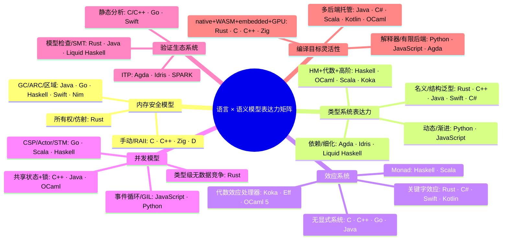

> **内容分级**: [参考级]
> **受众**: [专家]
> **A/S/P 标记**: **P** — Philosophy / 范式定位
> **双维定位**: C×Ana — 以语义模型维度对工业与研究语言进行形式化定位

# 统一语言 × 语义模型表达力矩阵

> **EN**: Unified Language × Semantic Model Expressiveness Matrix
> **Summary**: A canonical matrix mapping 23 industrial and research languages against six semantic-model dimensions, with per-cell ratings, canonical internal links, and a positioning quadrant diagram.
> **Rust 版本**: 1.97.0+ (Edition 2024)
> **Bloom 层级**: L5
> **权威来源**: 本文件为 `concept/` 权威页。
> **前置概念**: [Paradigm Matrix](01_paradigm_matrix.md) · [Type Theory](../../04_formal/00_type_theory/01_type_theory.md) · [Algebraic Effects](../../04_formal/07_concurrency_semantics/04_algebraic_effects.md) · [Dependent Types](../../04_formal/00_type_theory/10_dependent_refinement_types.md)
> **后置概念**: [Rust vs Haskell](../02_managed_languages/09_rust_vs_haskell.md) · [Rust vs OCaml](../02_managed_languages/10_rust_vs_ocaml.md) · [Rust vs Ada/SPARK](../01_systems_languages/07_rust_vs_ada_spark.md)
> **主要来源**: [Wikipedia: Comparison of programming languages](https://en.wikipedia.org/wiki/Comparison_of_programming_languages) · [Cardelli & Wegner 1985](https://doi.org/10.1145/6041.6042) · [Girard 1987 — Linear Logic](https://www.cs.cmu.edu/~fp/courses/15816-s12/misc/linearlogic.pdf) · [Plotkin & Pretnar 2009 — Algebraic Effects](https://www.cs.cmu.edu/~fp/courses/15816-s12/misc/algebraic-effects.pdf) · [Hoare 1978 — CSP](https://doi.org/10.1145/359576.359585) · [Jung et al. — RustBelt: Securing the Foundations of Rust](https://plv.mpi-sws.org/rustbelt/popl18/) · [SPARK Prover](https://docs.adacore.com/spark2014-docs/html/ug/en/source/spark_2014.html)

---

**变更日志**:

- v1.0 (2026-07-16): 初始版本，建立语言 × 语义模型表达力矩阵、六维度定义、定位象限图与反命题边界。

---

## 认知路径

```text
Step 1: 为什么需要“语义模型”矩阵，而不是仅看特性清单？
    └─⟹ 特性会变化，但底层语义模型（内存、类型、效应、并发、验证、目标）决定能力边界。
Step 2: 内存安全模型如何锁定适用域？
    └─⟹ 所有权/affine ⟹ 确定性 + 无 GC；GC ⟹ 简化但停顿；手动 ⟹ 灵活但易错。
Step 3: 类型系统表达力与工程成本的关系？
    └─⟹ HM+代数类型足以表达大多数领域；依赖/细化类型提供更强保证但提升证明成本。
Step 4: 效应系统与并发模型如何交叉？
    └─⟹ async/await 是“顺序化表达并发”的语法效应；代数效应处理器可统一异常、状态、非确定性。
Step 5: 验证生态决定“可信度上限”？
    └─⟹ 类型检查 ⟹ 消除 bug 类别；模型检查/SMT ⟹ 属性验证；ITP ⟹ 数学级证明。
Step 6: 编译目标灵活性如何影响语言生态位？
    └─⟹ native/WASM/embedded/GPU 的覆盖度决定语言能否从内核穿透到前端。
```

> **递进逻辑**: 从“语义模型为何重要”出发，依次理解六大维度的独立含义，再通过矩阵定位各语言，最后用反命题明确边界。

---

## 一、概述

本页是 Rust 知识库中 **“语言 × 语义模型表达力”的单一权威矩阵**。与 [Paradigm Matrix](01_paradigm_matrix.md) 不同，本页不罗列“支持哪些范式”，而是聚焦于**语义模型的形式化维度**：

- **内存安全模型** — 资源如何被分配、使用、释放；
- **类型系统表达力** — 能在编译期表达并证明多少程序性质；
- **效应系统** — 副作用（I/O、状态、异常、并发）如何被追踪与组合；
- **并发模型** — 多个计算单元如何协作与同步；
- **验证生态系统** — 语言配套的模型检查、SMT、交互式定理证明工具链；
- **编译目标灵活性** — 从裸机、嵌入式、桌面、服务器、浏览器到 GPU 的覆盖度。

矩阵覆盖 **23 种语言**：Rust、C、C++、Go、Java、C#、Python、JavaScript、Haskell、OCaml、F#、Scala、Swift、Kotlin、Ada/SPARK、D、Nim、Zig、Idris、Agda、Liquid Haskell、Koka、Eff。每一格给出**评级/标签 + 权威内部链接或外部权威来源**，便于从本页直接跳转到对应概念页或语言对比页。

> **Canonical 声明**: 根据 AGENTS.md §2，本页是“语言语义模型表达力矩阵”的唯一权威页。其他目录若需涉及同一主题，应使用摘要或重定向 stub，并链接到本页。

---

## 二、矩阵维度定义

六个维度彼此**正交**：一种语言可以在内存安全上得低分，却在类型系统或验证生态上得高分（例如 Agda）。评价标准以**工业可部署性**与**形式化强度**并重，而非纯粹的理论表达力。

### 2.1 内存安全模型（Memory Safety Model）

> **权威定义**: 内存安全模型规定对象生命周期、别名（aliasing）与释放策略，决定悬空指针、use-after-free、double-free 等错误能否在编译期或运行时被消除。

| 评级 | 标签 | 含义 |
|:---|:---|:---|
| **A** | 所有权 / 仿射 / 线性 | 编译期通过类型系统保证唯一所有权或可借用规则；无 GC；确定性析构。 |
| **B** | GC / ARC / 区域 | 自动回收或引用计数；无悬空指针但可能有停顿或循环引用风险。 |
| **C** | 手动 + 可选辅助 | RAII、显式分配器或可选 GC；安全依赖程序员纪律与工具。 |
| **D** | 完全手动 / 无保证 | 程序员直接管理内存；编译器仅提供最小检查。 |

> **形式化根基**: Girard 1987 线性逻辑为所有权/affine 类型奠基；Tofte & Talpin 1994 区域推断为 region-based 内存管理奠基；RustBelt (Jung et al., POPL 2018) 证明 Rust 核心语义的内存安全与线程安全。
> **来源**: [Girard 1987](https://www.cs.cmu.edu/~fp/courses/15816-s12/misc/linearlogic.pdf) · [Tofte & Talpin 1994](https://doi.org/10.1145/174675.177049) · [RustBelt](https://plv.mpi-sws.org/rustbelt/popl18/)

### 2.2 类型系统表达力（Type System Expressiveness）

> **权威定义**: 类型系统是“为程序项分配类型并规定合法操作的逻辑系统”；表达力越高，越能将领域不变式编码进类型，从而在编译期排除更多错误程序。

| 评级 | 标签 | 含义 |
|:---|:---|:---|
| **A** | 依赖 / 细化 / 线性 | 可用类型精确描述运行时性质（如长度索引向量、非零值、所有权）。 |
| **B+** | HM + 代数类型 + 高阶 | Hindley-Milner 推断、代数数据类型、高阶多态、GADTs。 |
| **B** | HM + 代数类型 | ML/Haskell/OCaml 经典组合。 |
| **C+** | 名义/结构 + 泛型 + 约束 | Java/C#/Swift/Kotlin/Scala 的主流静态类型。 |
| **C** | 结构类型 / 擦除泛型 / OO | Go 接口、Java 擦除、C++ 模板子类型。 |
| **D** | 动态 / 渐进 / 弱 | Python/JS/TypeScript 渐进类型、C 弱类型。 |

> **形式化根基**: Cardelli & Wegner 1985 建立参数/包含/特设多态分类；Hindley-Milner 类型推断；Martin-Löf 依赖类型理论；Pierce 《Types and Programming Languages》系统综述。
> **来源**: [Cardelli & Wegner 1985](https://doi.org/10.1145/6041.6042) · [Pierce TAPL](https://www.cis.upenn.edu/~bcpierce/tapl/) · [Dependent Types 权威页](../../04_formal/00_type_theory/10_dependent_refinement_types.md)

### 2.3 效应系统（Effect System）

> **权威定义**: 效应系统显式追踪或约束计算可能产生的副作用；从无效应标注，到用 Monad 编码，再到语言级关键字效应与代数效应处理器。

| 评级 | 标签 | 含义 |
|:---|:---|:---|
| **A** | 代数效应处理器 | 语言内置 `effect` / `handler` 构造，可组合 resume 与分支。 |
| **B** | Monad / 库级效应 | 通过类型类/Monad 将副作用建模为值（如 Haskell `IO`、Scala `ZIO`）。 |
| **C** | 关键字效应 / async-await | 语言对特定效应（异步、异常、迭代、unsafe）提供语法支持。 |
| **D** | 无显式效应系统 | 副作用不受类型系统追踪，依赖约定或运行时检查。 |

> **形式化根基**: Moggi 1989 用 Monad 统一计算效应；Wadler 将 Monad 引入函数式语言；Plotkin & Pretnar 2009 提出代数效应与操作语义；Koka 将效应类型与 handler 集成进 HM。
> **来源**: [Moggi 1989](https://www.cs.cmu.edu/~crary/819-f09/Moggi91.pdf) · [Plotkin & Pretnar 2009](https://www.cs.cmu.edu/~fp/courses/15816-s12/misc/algebraic-effects.pdf) · [Algebraic Effects 权威页](../../04_formal/07_concurrency_semantics/04_algebraic_effects.md)

### 2.4 并发模型（Concurrency Model）

> **权威定义**: 并发模型规定多个执行单元如何创建、通信、同步与共享状态；直接影响数据竞争、死锁、组合性与可扩展性。

| 评级 | 标签 | 含义 |
|:---|:---|:---|
| **A** | 类型级无数据竞争 | 编译期通过类型系统排除数据竞争（Rust `Send/Sync`）。 |
| **B+** | STM / Actor / CSP | 通过事务内存、actor 隔离或 channel 避免显式锁。 |
| **B** | Actor + 区域隔离 | 消息传递 + 所有权/区域隔离降低共享状态风险。 |
| **C+** | async/await + 任务调度 | 协程/任务抽象，仍需注意共享状态。 |
| **C** | 共享状态线程 + 锁 | 传统 pthreads/Java 线程模型。 |
| **D** | GIL / 单线程事件循环 | 真实并行受限（CPython GIL、JS 事件循环）。 |

> **形式化根基**: Hoare 1978 CSP 为 channel-based 并发奠基；Hewitt et al. 1973 Actor 模型；Herlihy & Moss 1993 STM；RustBelt 证明 `Send/Sync` 可消除数据竞争。
> **来源**: [Hoare 1978 CSP](https://doi.org/10.1145/359576.359585) · [Rust Concurrency 权威页](../../03_advanced/00_concurrency/01_concurrency.md) · [Async 权威页](../../03_advanced/01_async/01_async.md)

### 2.5 验证生态系统（Verification Ecosystem）

> **权威定义**: 验证生态包括类型检查器之外的工具链：模型检查、抽象解释、SMT 求解、交互式定理证明，用于证明程序满足规范或发现反例。

| 评级 | 标签 | 含义 |
|:---|:---|:---|
| **A** | 模型检查 + SMT + ITP 全覆盖 | 工业级形式化验证工具链成熟（SPARK、Coq 生态）。 |
| **A-** | ITP / 依赖类型证明 | 语言本身即证明辅助，可构造完全形式化证明。 |
| **B+** | 模型检查 / 分离逻辑 / 细化类型 | Rust (Kani/Prusti/Creusot)、LiquidHaskell 等。 |
| **B** | 部分形式化工具 | Java (KeY/JPF)、C# (Dafny)、Scala (Stainless)。 |
| **C** | 静态分析 / 测试 / 类型检查 | race detector、fuzzing、linters。 |
| **D** | 验证工具稀缺 | 主要依赖单元测试与人工审查。 |

> **来源**: [Formal Verification Tools 权威页](../../06_ecosystem/08_formal_verification/02_formal_verification_tools.md) · [Formal Ecosystem Tower 权威页](../../06_ecosystem/08_formal_verification/01_formal_ecosystem_tower.md) · [SPARK Prover](https://docs.adacore.com/spark2014-docs/html/ug/en/source/spark_2014.html)

### 2.6 编译目标灵活性（Compilation Target Flexibility）

> **权威定义**: 编译目标灵活性衡量同一语言源代码可部署到的平台范围：裸机 MCU、嵌入式 RTOS、桌面/服务器 native、浏览器 WASM、移动设备、GPU。

| 评级 | 标签 | 含义 |
|:---|:---|:---|
| **A** | native + WASM + embedded + GPU | 覆盖系统到前端，具备官方 tier 目标与 GPU 工具链。 |
| **A-** | native + WASM + embedded | 系统/嵌入式/WASM 全覆盖，但 GPU 依赖第三方。 |
| **B+** | native + bytecode + JS + WASM | 多后端成熟（OCaml、Nim、Haskell）。 |
| **B** | native + JVM/JS/WASM 选一或多个 | 主流托管语言的多平台方案。 |
| **C** | 解释器 / 单一运行时 / 有限后端 | Python/JS 主要依赖宿主，Agda 仅 Haskell/JS。 |
| **D** | 学术原型，目标有限 | 主要关注语义研究，编译后端不成熟。 |

> **来源**: [Rust Platform Support](https://doc.rust-lang.org/nightly/rustc/platform-support.html) · [Cross Compilation 权威页](../../06_ecosystem/05_systems_and_embedded/02_cross_compilation.md) · [Embedded Systems 权威页](../../06_ecosystem/05_systems_and_embedded/03_embedded_systems.md)

---

## 三、语言 × 语义模型矩阵

> **阅读约定**: 每格格式为 **评级** [标签](链接)。评级仅表示在该维度上的相对位置，不代表语言整体优劣。链接指向 `concept/` 权威页或语言对比页；无内部对比页的语言使用外部权威来源。

| 语言 | 内存安全模型 | 类型系统表达力 | 效应系统 | 并发模型 | 验证生态系统 | 编译目标灵活性 |
|:---|:---|:---|:---|:---|:---|:---|
| **Rust** | **A** [所有权 / 仿射类型](../../04_formal/01_ownership_logic/01_linear_logic.md) | **B+** [代数类型 + HM](../../04_formal/00_type_theory/01_type_theory.md) | **C+** [关键字效应 (`async` / `unsafe`)](../../03_advanced/01_async/01_async.md) | **A** [所有权 + `Send/Sync`](../../03_advanced/00_concurrency/01_concurrency.md) | **B+** [Kani / Prusti / Creusot](../../06_ecosystem/08_formal_verification/02_formal_verification_tools.md) | **A** [native / WASM / `no_std` / GPU](../../06_ecosystem/05_systems_and_embedded/02_cross_compilation.md) |
| **C** | **D** [完全手动](https://en.wikipedia.org/wiki/C_(programming_language)) | **D** [弱静态](https://en.wikipedia.org/wiki/C_(programming_language)) | **D** [无](https://en.wikipedia.org/wiki/C_(programming_language)) | **C** [Pthreads / 手动锁](https://en.wikipedia.org/wiki/POSIX_Threads) | **C** [Frama-C / Infer](https://en.wikipedia.org/wiki/Frama-C) | **A** [native / 嵌入式](https://en.wikipedia.org/wiki/C_(programming_language)) |
| **C++** | **C** [RAII + 手动](../01_systems_languages/01_rust_vs_cpp.md) | **C** [模板 + 子类型](../01_systems_languages/01_rust_vs_cpp.md) | **D** [无](../01_systems_languages/01_rust_vs_cpp.md) | **C** [共享状态线程 + 锁](../01_systems_languages/01_rust_vs_cpp.md) | **C** [Frama-C / CBMC](../01_systems_languages/01_rust_vs_cpp.md) | **A** [native / WASM](../01_systems_languages/01_rust_vs_cpp.md) |
| **Go** | **B** [GC](../01_systems_languages/03_rust_vs_go.md) | **C** [结构类型 + 接口](../01_systems_languages/03_rust_vs_go.md) | **D** [无](../01_systems_languages/03_rust_vs_go.md) | **B+** [CSP `channel`](../01_systems_languages/03_rust_vs_go.md) | **C** [race detector / fuzzing](../01_systems_languages/03_rust_vs_go.md) | **B** [native / WASM (TinyGo)](../01_systems_languages/03_rust_vs_go.md) |
| **Java** | **B** [GC](../02_managed_languages/01_rust_vs_java.md) | **C** [名义 OO + 擦除泛型](../02_managed_languages/01_rust_vs_java.md) | **D** [异常 / 无](../02_managed_languages/01_rust_vs_java.md) | **C** [共享状态线程 + JMM](../02_managed_languages/01_rust_vs_java.md) | **B** [KeY / Java PathFinder](../02_managed_languages/01_rust_vs_java.md) | **B** [JVM / native (GraalVM) / Android](../02_managed_languages/01_rust_vs_java.md) |
| **C#** | **B** [GC](../02_managed_languages/06_rust_vs_csharp.md) | **C+** [名义 OO + 真实泛型](../02_managed_languages/06_rust_vs_csharp.md) | **C** [`async` / `await`](../02_managed_languages/06_rust_vs_csharp.md) | **C+** [TPL / async / 锁](../02_managed_languages/06_rust_vs_csharp.md) | **B** [Dafny 生态](../02_managed_languages/06_rust_vs_csharp.md) | **B+** [.NET / native AOT / WASM](../02_managed_languages/06_rust_vs_csharp.md) |
| **Python** | **B** [GC + 引用计数](../02_managed_languages/02_rust_vs_python.md) | **D** [动态 + 渐进类型](../02_managed_languages/02_rust_vs_python.md) | **C** [异常 / 上下文管理器](../02_managed_languages/02_rust_vs_python.md) | **D** [GIL / 多进程 / asyncio](../02_managed_languages/02_rust_vs_python.md) | **C** [mypy / 测试](../02_managed_languages/02_rust_vs_python.md) | **C** [CPython / WASM (Pyodide)](../02_managed_languages/02_rust_vs_python.md) |
| **JavaScript** | **B** [GC](../02_managed_languages/03_rust_vs_javascript.md) | **D** [动态 + TS 渐进](../02_managed_languages/03_rust_vs_javascript.md) | **C** [Promise / `async`](../02_managed_languages/03_rust_vs_javascript.md) | **D** [事件循环 + 异步](../02_managed_languages/03_rust_vs_javascript.md) | **C** [TypeScript / ESLint](../02_managed_languages/03_rust_vs_javascript.md) | **C** [JS 引擎 / WASM](../02_managed_languages/03_rust_vs_javascript.md) |
| **Haskell** | **B** [GC](../02_managed_languages/09_rust_vs_haskell.md) | **A-** [HM + ADT + 高阶](../02_managed_languages/09_rust_vs_haskell.md) | **B** [Monad (`IO`)](../02_managed_languages/09_rust_vs_haskell.md) | **B+** [STM / green threads](../02_managed_languages/09_rust_vs_haskell.md) | **B+** [LiquidHaskell / Coq](../02_managed_languages/09_rust_vs_haskell.md) | **B** [native / WASM (GHC WASM)](../02_managed_languages/09_rust_vs_haskell.md) |
| **OCaml** | **B** [GC](../02_managed_languages/10_rust_vs_ocaml.md) | **B+** [HM + ADT + 模块](../02_managed_languages/10_rust_vs_ocaml.md) | **B-** [异常; 5.x 代数效应](../02_managed_languages/10_rust_vs_ocaml.md) | **C** [共享状态线程 + 锁](../02_managed_languages/10_rust_vs_ocaml.md) | **B** [Why3 / Coq 提取](../02_managed_languages/10_rust_vs_ocaml.md) | **B+** [native / bytecode / JS / WASM](../02_managed_languages/10_rust_vs_ocaml.md) |
| **F#** | **B** [GC (.NET)](../02_managed_languages/11_rust_vs_fsharp.md) | **B** [HM + OO](../02_managed_languages/11_rust_vs_fsharp.md) | **C** [计算表达式 / `async`](../02_managed_languages/11_rust_vs_fsharp.md) | **C+** [async / TPL](../02_managed_languages/11_rust_vs_fsharp.md) | **C** [有限](../02_managed_languages/11_rust_vs_fsharp.md) | **B+** [.NET / JS / native](../02_managed_languages/11_rust_vs_fsharp.md) |
| **Scala** | **B** [JVM GC](../02_managed_languages/05_rust_vs_scala.md) | **B** [HM + 子类型 + 高阶](../02_managed_languages/05_rust_vs_scala.md) | **B** [Cats Effect / ZIO](../02_managed_languages/05_rust_vs_scala.md) | **B** [Akka Actor / Futures](../02_managed_languages/05_rust_vs_scala.md) | **B** [Stainless](../02_managed_languages/05_rust_vs_scala.md) | **B** [JVM / JS / native](../02_managed_languages/05_rust_vs_scala.md) |
| **Swift** | **B+** [ARC + 所有权借用](../01_systems_languages/05_rust_vs_swift.md) | **C+** [名义 + 泛型 + 协议](../01_systems_languages/05_rust_vs_swift.md) | **C** [`async` / `await`](../01_systems_languages/05_rust_vs_swift.md) | **B** [Actor / Sendable](../01_systems_languages/05_rust_vs_swift.md) | **C** [有限](../01_systems_languages/05_rust_vs_swift.md) | **B** [native / Apple 生态](../01_systems_languages/05_rust_vs_swift.md) |
| **Kotlin** | **B** [JVM GC](../02_managed_languages/04_rust_vs_kotlin.md) | **C** [名义 OO + 泛型](../02_managed_languages/04_rust_vs_kotlin.md) | **C** [协程 / `suspend`](../02_managed_languages/04_rust_vs_kotlin.md) | **C+** [协程 + 共享内存](../02_managed_languages/04_rust_vs_kotlin.md) | **C** [有限](../02_managed_languages/04_rust_vs_kotlin.md) | **B** [JVM / JS / Native](../02_managed_languages/04_rust_vs_kotlin.md) |
| **Ada/SPARK** | **B+** [RAII + 契约](../01_systems_languages/07_rust_vs_ada_spark.md) | **C+** [强静态 + 契约](../01_systems_languages/07_rust_vs_ada_spark.md) | **C** [Ravenscar tasks](../01_systems_languages/07_rust_vs_ada_spark.md) | **B** [tasks / protected objects](../01_systems_languages/07_rust_vs_ada_spark.md) | **A** [SPARK Prover / SMT / ITP](../01_systems_languages/07_rust_vs_ada_spark.md) | **B+** [native / 嵌入式 / 认证](../01_systems_languages/07_rust_vs_ada_spark.md) |
| **D** | **C+** [GC 可选 / 手动](../01_systems_languages/08_rust_vs_d.md) | **C** [模板 + OO](../01_systems_languages/08_rust_vs_d.md) | **D** [无](../01_systems_languages/08_rust_vs_d.md) | **C** [线程 / 消息](../01_systems_languages/08_rust_vs_d.md) | **C** [测试 / 静态分析](../01_systems_languages/08_rust_vs_d.md) | **B** [native / WASM](../01_systems_languages/08_rust_vs_d.md) |
| **Nim** | **B+** [ARC/ORC 可选](../01_systems_languages/09_rust_vs_nim.md) | **B** [HM + 宏 + OO](../01_systems_languages/09_rust_vs_nim.md) | **C** [`async` / 迭代器](../01_systems_languages/09_rust_vs_nim.md) | **C+** [线程 / channel](../01_systems_languages/09_rust_vs_nim.md) | **C** [drnim / 测试](../01_systems_languages/09_rust_vs_nim.md) | **B+** [C/C++/JS/WASM/embedded](../01_systems_languages/09_rust_vs_nim.md) |
| **Zig** | **C+** [显式分配器 / 手动](../01_systems_languages/06_rust_vs_zig.md) | **C+** [comptime 泛型](../01_systems_languages/06_rust_vs_zig.md) | **D** [无](../01_systems_languages/06_rust_vs_zig.md) | **C** [线程 (无内置 async)](../01_systems_languages/06_rust_vs_zig.md) | **C** [Zig test / 编译期检查](../01_systems_languages/06_rust_vs_zig.md) | **A-** [native / WASM / embedded](../01_systems_languages/06_rust_vs_zig.md) |
| **Idris** | **B** [GC](https://www.idris-lang.org/) | **A** [全依赖类型](../../04_formal/00_type_theory/10_dependent_refinement_types.md) | **B** [Effects 库](https://www.idris-lang.org/) | **C** [有限](https://www.idris-lang.org/) | **A-** [ITP (依赖类型本身)](https://www.idris-lang.org/) | **B** [native / JS / C](https://www.idris-lang.org/) |
| **Agda** | **B** [GC (Haskell 后端)](https://wiki.portal.chalmers.se/agda/pmwiki.php) | **A** [全依赖类型](../../04_formal/00_type_theory/10_dependent_refinement_types.md) | **D** [无](https://wiki.portal.chalmers.se/agda/pmwiki.php) | **D** [有限](https://wiki.portal.chalmers.se/agda/pmwiki.php) | **A** [ITP (证明辅助)](https://wiki.portal.chalmers.se/agda/pmwiki.php) | **C** [Haskell / JS](https://wiki.portal.chalmers.se/agda/pmwiki.php) |
| **Liquid Haskell** | **B** [GC (Haskell)](https://ucsd-progsys.github.io/liquidhaskell-blog/) | **A-** [HM + 细化类型](../../04_formal/00_type_theory/10_dependent_refinement_types.md) | **B** [Monad](https://ucsd-progsys.github.io/liquidhaskell-blog/) | **B+** [STM (Haskell)](https://ucsd-progsys.github.io/liquidhaskell-blog/) | **A-** [SMT 细化检查](https://ucsd-progsys.github.io/liquidhaskell-blog/) | **B** [native / WASM](https://ucsd-progsys.github.io/liquidhaskell-blog/) |
| **Koka** | **B** [GC](https://koka-lang.github.io/koka/doc/index.html) | **B+** [HM + 效应类型](https://koka-lang.github.io/koka/doc/index.html) | **A** [代数效应处理器](../../04_formal/07_concurrency_semantics/04_algebraic_effects.md) | **C+** [async / tasks](https://koka-lang.github.io/koka/doc/index.html) | **C** [Perceus 引用计数证明](https://koka-lang.github.io/koka/doc/index.html) | **B** [C / JS / WASM](https://koka-lang.github.io/koka/doc/index.html) |
| **Eff** | **B** [GC (OCaml)](https://www.eff-lang.org/) | **B** [HM + 效应类型](https://www.eff-lang.org/) | **A** [代数效应处理器](../../04_formal/07_concurrency_semantics/04_algebraic_effects.md) | **C** [有限](https://www.eff-lang.org/) | **C** [ITP 提取可能](https://www.eff-lang.org/) | **C** [OCaml / JS](https://www.eff-lang.org/) |

> **过渡**: 静态矩阵给出坐标，下面通过“维度切片”与“定位象限图”揭示语言聚集模式与 Rust 的独特位置。

---

## 四、维度切片与关键洞察

### 4.1 内存安全维度切片

```text
编译期所有权/仿射 ─────┬───── Rust
                      │
可选 GC / ARC / 区域 ──┼───── Swift(ARC+借用) · Nim(ARC/ORC) · Ada/SPARK(契约+RAII)
                      │
全自动 GC ─────────────┼───── Java · C# · Go · Haskell · OCaml · F# · Scala · Kotlin · Idris · Agda · Koka · Eff · Liquid Haskell
                      │
手动 + RAII ───────────┼───── C++ · D · Zig
                      │
完全手动 ──────────────┴───── C
```

**关键洞察 1**: Rust 与 C/C++/Zig 同处“无 GC”阵营，但 Rust 通过仿射类型把内存安全证明前移到编译期；C++ 的 RAII 解决确定性释放但不解决 use-after-free，Zig 通过显式分配器提供可审计性但不提供编译期保证。

### 4.2 类型系统维度切片

```text
依赖/细化/线性类型 ─────┬───── Agda · Idris · Liquid Haskell
                       │
HM + 高阶 + GADT ───────┼───── Haskell · OCaml · F# · Scala · Koka · Eff
                       │
HM + 代数类型 ──────────┼───── OCaml(核心) · Haskell(核心)
                       │
名义/结构 + 泛型 ───────┼───── Rust · Swift · C# · Java · Kotlin · Go · C++ · D · Nim
                       │
动态/渐进 ──────────────┴───── Python · JavaScript · C
```

**关键洞察 2**: Rust 的类型系统处于“工业强静态”与“函数式代数类型”的交汇点：没有 Haskell 的高阶多态，也没有 Idris 的依赖类型，但 `enum`/`match`、`Option`/`Result`、trait bounds 足以在工业代码中表达“非法状态不可表示”。

### 4.3 效应与并发维度切片

```text
类型级无数据竞争 ───────┬───── Rust
                       │
Algebraic Effects ──────┼───── Koka · Eff · OCaml 5.x
                       │
Monad / 库级效应 ───────┼───── Haskell · Scala(Cats/ZIO)
                       │
关键字效应 (async) ─────┼───── Rust · C# · Swift · Kotlin · JavaScript · Nim
                       │
无显式效应系统 ─────────┼───── C · C++ · Go · Java · Python · D · Zig
```

**关键洞察 3**: Rust 的 `async`/`await` 是一种**语法关键字效应**：它在类型系统中留下 `Future<Output = T>` 轨迹，但不覆盖 I/O、异常等全部副作用。相比之下，Koka/Eff 的代数效应处理器将任意效果建模为操作-处理器对，表达力更强但工业生态尚小。

### 4.4 验证生态维度切片

```text
ITP 级证明辅助 ─────────┬───── Agda · Idris · Coq(提取) · SPARK(ITP桥接)
                       │
依赖/细化 + SMT ────────┼───── Liquid Haskell · SPARK Prover · Rust(Prusti/Creusot/Flux)
                       │
模型检查 / 分离逻辑 ────┼───── Rust(Kani) · Java(JPF) · C/C++(CBMC/Frama-C)
                       │
静态分析 + 测试 ────────┼───── C# · Scala · Go · Swift · Kotlin · Nim · D · Zig
                       │
类型检查为主 ───────────┴───── Python · JavaScript
```

**关键洞察 4**: Rust 的验证生态正在从“类型系统消除 bug 类别”向“模型检查 + 分离逻辑 + 细化类型”扩展，形成 **Kani (模型检查) → Prusti (分离逻辑) → Creusot (Why3) → Flux (细化类型)** 的层级塔。

---

## 五、定位象限图

下面的象限图以 **横轴 = 底层控制 / 运行时确定性**（左高右低）、**纵轴 = 抽象安全 / 类型表达力**（下低上高）定位语言。Rust 位于“高控制 + 高安全”的右上象限，是少数同时满足两者的工业语言。

```mermaid
quadrantChart
    title 语言定位：底层控制 vs 抽象安全
    x-axis 高运行时确定性（无 GC / 手动 / 所有权） --> 高抽象自动化（GC / 托管运行时）
    y-axis 低类型表达力 --> 高类型表达力
    quadrant-1 高控制 + 高安全
    quadrant-2 高自动化 + 高安全
    quadrant-3 高控制 + 低安全
    quadrant-4 高自动化 + 低安全
    Rust: [0.85, 0.75]
    Ada/SPARK: [0.70, 0.65]
    Swift: [0.60, 0.55]
    Zig: [0.80, 0.45]
    C++: [0.65, 0.40]
    D: [0.55, 0.40]
    Nim: [0.50, 0.55]
    C: [0.90, 0.15]
    Haskell: [0.30, 0.90]
    OCaml: [0.30, 0.80]
    F#: [0.30, 0.70]
    Scala: [0.25, 0.75]
    Liquid Haskell: [0.30, 0.95]
    Idris: [0.35, 0.95]
    Agda: [0.20, 1.00]
    Koka: [0.35, 0.80]
    Eff: [0.30, 0.75]
    Java: [0.25, 0.45]
    C#: [0.25, 0.50]
    Kotlin: [0.25, 0.45]
    Go: [0.40, 0.35]
    Python: [0.15, 0.20]
    JavaScript: [0.15, 0.20]
```

> **认知功能**: 象限图揭示“控制”与“安全”传统张力。Rust、Ada/SPARK、Swift 位于右上；研究语言（Agda/Idris/Liquid Haskell）位于顶部但控制侧偏弱；C 位于右下极致控制但低安全；Python/JS 位于左下。
> **来源**: [💡 原创分析](../../00_meta/00_framework/methodology.md)

---

## 六、关键定理链

```text
定理 (Rust 的语义模型不可压缩性):
在工业级系统编程语言中，Rust 是唯一同时满足:
  1. 内存安全由所有权/仿射类型在编译期保证
  2. 数据竞争由 Send/Sync 在编译期排除
  3. 无 GC，确定性析构
  4. 代数数据类型 + HM + trait 约束
  5. native / WASM / no_std / GPU 全覆盖
  6. 拥有模型检查 + 分离逻辑 + 细化类型的验证生态

证明对照:
  C/C++:   (1,2 ✗) · Zig: (1,2 ✗) · Go/Java/C#: (3 ✗) · Haskell/OCaml: (3 ✗) · Ada/SPARK: (4,5 弱于 Rust)
```

**定理链 1: 所有权 ⟹ 仿射类型 ⟹ 编译期内存安全**

```text
单一可变或多重只读 (Rust 所有权规则)
  └─⟹ 值的使用次数被类型系统约束 (affine typing)
      └─⟹ use-after-free / double-free 成为类型错误
          └─⟹ 无需 GC 即可保证内存安全
```

**定理链 2: Send/Sync ⟹ 类型级并发安全**

```text
Send (跨线程转移所有权) + Sync (只读共享安全)
  └─⟹ 线程安全语义被编码为 trait bound
      └─⟹ 编译期拒绝非线程安全值的跨线程使用
          └─⟹ 数据竞争在可执行程序生成前被排除
```

**定理链 3: 关键字效应 ⟹ 顺序化并发表达**

```text
async fn 返回 Future<Output = T>
  └─⟹ 异步计算被表示为可组合的状态机
      └─⟹ 单一控制流语法表达高并发 I/O
          └─⟹ 但 !Send 跨 .await 仍会在编译期被捕获
```

**定理链 4: 依赖/细化类型 ⟹ 规格即类型**

```text
长度索引向量 / 非零整数 / 排序不变式被编码进类型
  └─⟹ 运行时错误变为编译期类型错误
      └─⟹ 验证从“测试覆盖”转向“数学证明”
          └─⟹ 代价：证明辅助或 SMT 求解的自动化成本
```

---

## 七、反命题与边界分析

本节主动检验矩阵使用中容易出现的过度简化。

### 7.1 反命题: “内存安全模型决定一切”

**错误推论**: 既然 Rust 有编译期所有权，就适合所有系统场景。

**边界条件**:

- 需要 **硬实时形式化证明** 的场景，Ada/SPARK 的 SPARK Prover 提供更强的契约与 WCET 分析；
- 需要 **与现有 C 内核深度集成** 的场景，C 仍是驱动与内核子系统的首选；
- 需要 **脚本级开发速度** 的场景，Python/Go 的写时成本更低。

**矩阵证据**: Ada/SPARK 在“验证生态”维度得 **A**，C 在“编译目标/底层生态”维度仍居不可替代位置，Rust 在“效应系统”维度仅得 **C+**（不如 Koka 的代数效应）。

### 7.2 反命题: “类型系统越强越好”

**错误推论**: 依赖类型或细化类型应成为工业默认。

**边界条件**:

- **证明成本**: Agda/Idris 的程序开发时间显著高于 Rust，因为开发者需构造证明项；
- **推断可预测性**: HM 类型推断是principal且可判定的；依赖类型的推断通常需要显式标注；
- **生态成熟度**: Liquid Haskell 的 SMT 后端在工业代码库中仍面临与 GHC 扩展、外部库的兼容问题。

**矩阵证据**: Rust 故意停在 **B+** 类型系统（无高阶类型、无依赖类型），以换取可学习的类型推断与工业工具链。

### 7.3 反命题: “代数效应是未来，关键字效应是过渡”

**错误推论**: Rust 的 `async`/`unsafe`/`const` 关键字效应终将被代数效应取代。

**边界条件**:

- **工业稳定性**: 关键字效应（async/await）已被证明可在数百万行代码库中扩展；
- **表达范围**: 代数效应擅长统一异常、状态、非确定性，但与 Rust 的零成本抽象、确定性析构、FFI 兼容仍需大量设计工作；
- **迁移成本**: Rust 的 `async` 生态（tokio、async-std）已形成标准库级惯性。

**矩阵证据**: Koka/Eff 在“效应系统”维度得 **A**，但在“编译目标/生态”维度仅 **B/C**；Rust 用 **C+** 关键字效应覆盖了最大工业场景。

### 7.4 反命题: “验证生态越强，软件越可信”

**错误推论**: 只要使用 SPARK 或 Coq 提取，就能消除所有缺陷。

**边界条件**:

- **规格错误**: 形式化验证只能证明“程序符合规格”，若规格本身错误，证明无意义；
- **trusted computing base (TCB)**: 编译器、SMT 求解器、操作系统、硬件均可能成为信任缺口；
- **侧信道与安全**: 形式化验证通常不覆盖时序攻击、Spectre 等微架构侧信道。

**矩阵证据**: Ada/SPARK 得 **A** 验证生态，但“并发模型”仅 **B**；Rust 的 **B+** 验证生态配合 **A** 并发模型，可在系统软件中实现更高的端到端可信度。

### 7.5 反命题: “编译目标越多，语言越通用”

**错误推论**: Nim 或 OCaml 的多后端使其比 Rust 更通用。

**边界条件**:

- **目标质量**: Rust 的 `no_std` + 官方 target tier 支持意味着裸机 MCU 有可靠工具链；
- **运行时依赖**: OCaml/Haskell 的多后端通常仍依赖 GC 运行时，限制其在硬实时/内核场景的使用；
- **GPU**: 真正原生支持 GPU 着色器/计算的系统语言极少，Rust 通过 `wgpu`/`rust-gpu` 形成生态，但尚非语言核心。

**矩阵证据**: Rust 与 Nim 均得 **A/B+** 编译目标，但 Rust 在“内存安全”与“并发安全”维度同时领先。

---

## 八、来源与延伸阅读

### 8.1 学术与权威来源

- **Cardelli, L., & Wegner, P. (1985).** *On understanding types, data abstraction, and polymorphism.* ACM Computing Surveys, 17(4), 471-522. [ACM DL](https://doi.org/10.1145/6041.6042)
- **Girard, J.-Y. (1987).** *Linear Logic.* Theoretical Computer Science, 50(1), 1-101. [PDF](https://www.cs.cmu.edu/~fp/courses/15816-s12/misc/linearlogic.pdf)
- **Hoare, C. A. R. (1978).** *Communicating Sequential Processes.* Communications of the ACM, 21(8), 666-677. [CACM](https://doi.org/10.1145/359576.359585)
- **Jung, R., et al. (2018).** *RustBelt: Securing the Foundations of Rust.* POPL 2018. [RustBelt](https://plv.mpi-sws.org/rustbelt/popl18/)
- **Moggi, E. (1991).** *Notions of Computation and Monads.* Information and Computation, 93(1), 55-92. [PDF](https://www.cs.cmu.edu/~crary/819-f09/Moggi91.pdf)
- **Plotkin, G., & Pretnar, M. (2009).** *Handlers of Algebraic Effects.* ESOP 2009. [PDF](https://www.cs.cmu.edu/~fp/courses/15816-s12/misc/algebraic-effects.pdf)
- **Tofte, M., & Talpin, J.-P. (1994).** *Implementation of the Typed Call-by-Value λ-Calculus using a Stack of Regions.* POPL 1994. [ACM DL](https://doi.org/10.1145/174675.177049)
- **Pierce, B. C.** *Types and Programming Languages.* MIT Press, 2002. [TAPL](https://www.cis.upenn.edu/~bcpierce/tapl/)

### 8.2 官方与工业来源

- [The Rust Programming Language](https://doc.rust-lang.org/book/title-page.html)
- [Rust Reference](https://doc.rust-lang.org/reference/introduction.html)
- [Rust Async Book](https://rust-lang.github.io/async-book/index.html)
- [Rust Platform Support](https://doc.rust-lang.org/nightly/rustc/platform-support.html)
- [SPARK 2014 User's Guide](https://docs.adacore.com/spark2014-docs/html/ug/en/source/spark_2014.html)
- [Koka Language Documentation](https://koka-lang.github.io/koka/doc/index.html)
- [Eff Language](https://www.eff-lang.org/)
- [Liquid Haskell](https://ucsd-progsys.github.io/liquidhaskell-blog/)

### 8.3 相关概念链接

| 概念 | 文件 | 关系 |
|:---|:---|:---|
| Paradigm Matrix | [`01_paradigm_matrix.md`](01_paradigm_matrix.md) | 前置/宏观范式视角 |
| Type Theory | [`../../04_formal/00_type_theory/01_type_theory.md`](../../04_formal/00_type_theory/01_type_theory.md) | 类型系统维度形式化根基 |
| Dependent & Refinement Types | [`../../04_formal/00_type_theory/10_dependent_refinement_types.md`](../../04_formal/00_type_theory/10_dependent_refinement_types.md) | 最高表达力类型系统 |
| Algebraic Effects | [`../../04_formal/07_concurrency_semantics/04_algebraic_effects.md`](../../04_formal/07_concurrency_semantics/04_algebraic_effects.md) | 效应系统最高形态 |
| Concurrency | [`../../03_advanced/00_concurrency/01_concurrency.md`](../../03_advanced/00_concurrency/01_concurrency.md) | 并发模型权威页 |
| Async | [`../../03_advanced/01_async/01_async.md`](../../03_advanced/01_async/01_async.md) | Rust 关键字效应 |
| Formal Verification Tools | [`../../06_ecosystem/08_formal_verification/02_formal_verification_tools.md`](../../06_ecosystem/08_formal_verification/02_formal_verification_tools.md) | 验证生态工具链 |
| Rust vs Haskell | [`../02_managed_languages/09_rust_vs_haskell.md`](../02_managed_languages/09_rust_vs_haskell.md) | 后置对比 |
| Rust vs OCaml | [`../02_managed_languages/10_rust_vs_ocaml.md`](../02_managed_languages/10_rust_vs_ocaml.md) | 后置对比 |
| Rust vs Ada/SPARK | [`../01_systems_languages/07_rust_vs_ada_spark.md`](../01_systems_languages/07_rust_vs_ada_spark.md) | 后置对比 |

### 8.4 知识来源关系（Provenance）

| 论断 | 来源 | 可信度 |
|:---|:---|:---:|
| Rust 所有权/仿射类型保证内存安全 | RustBelt (Jung et al., POPL 2018) · TRPL | ✅ |
| Rust `Send/Sync` 排除数据竞争 | RustBelt · The Rust Programming Language | ✅ |
| 线性逻辑为所有权奠基 | Girard 1987 | ✅ |
| 代数效应处理器形式化 | Plotkin & Pretnar 2009 | ✅ |
| CSP 为 Go channel 奠基 | Hoare 1978 · Effective Go | ✅ |
| SPARK Prover 用于安全关键验证 | AdaCore SPARK 文档 | ✅ |
| 各语言评级 | 官方文档、学术论文、工业实践综合 | ⚠️ 主观但可复核 |

---

> **权威来源**: [Rust Reference](https://doc.rust-lang.org/reference/introduction.html) · [The Rust Programming Language](https://doc.rust-lang.org/book/title-page.html) · [Rustonomicon](https://doc.rust-lang.org/nomicon/index.html) · [RustBelt](https://plv.mpi-sws.org/rustbelt/popl18/)
> **文档版本**: 1.0
> **最后更新**: 2026-07-16
> **状态**: ✅ 权威页创建完成，待链接健康检查

---

> **相关文件**: [Paradigm Matrix](01_paradigm_matrix.md) · [Execution Model Isomorphism](02_execution_model_isomorphism.md) · [Five Models Definition Matrix](04_five_models_definition_matrix.md)

## 九、应用决策速查表

> **用途**: 根据项目约束快速缩小候选语言范围。每一行给出“首选 / 次选 / 避免”建议，并指出对应矩阵维度的决策依据。

| 应用场景 | 首选 | 次选 | 避免 | 决策维度 |
|:---|:---|:---|:---|:---|
| 操作系统/内核/驱动 | Rust · C | Zig · Ada/SPARK | Python · JavaScript | 内存安全 + 编译目标 + FFI |
| 游戏引擎/图形渲染 | C++ · Rust | Zig · D | Python · Haskell | 零成本抽象 + 编译目标 + 生态 |
| 嵌入式/IoT/实时控制 | Rust · Ada/SPARK · C | Zig · Nim | Python · JavaScript | 内存安全 + no_std + 验证生态 |
| Web 后端（高并发 I/O） | Rust · Go | C# · Java | Python · C | 并发模型 + 效应系统 + 编译目标 |
| Web 后端（计算密集） | Rust · C++ | Go · Java | Python · JavaScript | 零成本抽象 + 内存安全 |
| 分布式系统/云原生 | Rust · Go | Java · C# | C++ · Python | 并发模型 + 编译目标 + 生态 |
| 数据库引擎/存储 | C++ · Rust | Zig · Go | Python · JavaScript | 内存安全 + 零成本抽象 |
| 前端/WebAssembly | Rust · TypeScript | C# (Blazor) · Go (TinyGo) | Python · Java | 编译目标 + 包大小 |
| 函数式/学术研究 | Haskell · Agda · Idris | OCaml · F# · Koka | C · Go | 类型系统 + 效应系统 + 验证生态 |
| 金融/安全关键系统 | Ada/SPARK · Rust | Java · C# | Python · JavaScript | 验证生态 + 内存安全 + 并发 |
| AI/ML 推理/数值计算 | Rust · C++ · Python(原型) | Julia · Mojo | JavaScript · Go | 编译目标 + 性能 + 生态 |
| 区块链节点/智能合约 | Rust · C++ | Go · Haskell | Python · JavaScript | 内存安全 + 零成本抽象 |
| 移动应用（原生） | Swift · Kotlin | Rust(共享库) · C++ | Python · JavaScript | 编译目标 + 平台生态 |
| 脚本/快速原型 | Python · JavaScript | Go · Ruby | C++ · Rust | 开发速度 + 动态类型 |
| 形式化验证教学 | Agda · Idris · Coq | Lean · Isabelle | Python · C | 类型系统 + ITP |

> **速查原则**: 首选语言通常在关键维度上无 **D** 级弱点；避免语言通常在“内存安全”或“并发模型”维度存在不可接受的短板。

---

## 十、常见误读速查

| 误读 | 正解 | 矩阵证据 |
|:---|:---|:---|
| “Rust 的 `unsafe` 让所有权失效” | `unsafe` 是**局部、显式、可审计**的逃逸舱；离开 `unsafe` 块后所有权规则继续生效。 | Rust 内存安全仍评 **A**。 |
| “GC 语言无法做系统编程” | Go/Java 可做网络服务与云原生，但**硬实时/内核/无停顿场景**受限。 | GC 语言在“内存安全”得 **B**，在“编译目标”多受限。 |
| “Haskell 因为 GC 所以不适合系统编程” | GHC 可生成 native 代码，但 GC 停顿与惰性求值开销使其**不适合硬实时**。 | Haskell 内存安全 **B**、编译目标 **B**。 |
| “依赖类型能替代所有测试” | 依赖类型证明**类型级规格**，不覆盖规格错误、TCB、性能与侧信道。 | Agda/Idris 验证生态 **A**，但编译目标 **C/B**。 |
| “代数效应比 async/await 更好” | 表达力上更强，但工业成熟度、生态规模、编译目标仍落后于关键字效应。 | Koka/Eff 效应系统 **A**，编译目标 **B/C**。 |
| “C 是最快的语言” | C 提供底层控制，但现代 C++/Rust/Zig 在等价抽象下可生成同等或更优代码，且更安全。 | C 内存安全 **D**，类型系统 **D**。 |

---

## 十一、思维导图（Mindmap）



> **认知功能**: Mindmap 将六维度与代表语言同时呈现，作为快速检索与教学导航工具。根节点链接到本权威页，各分支应进一步进入对应权威页深化。
