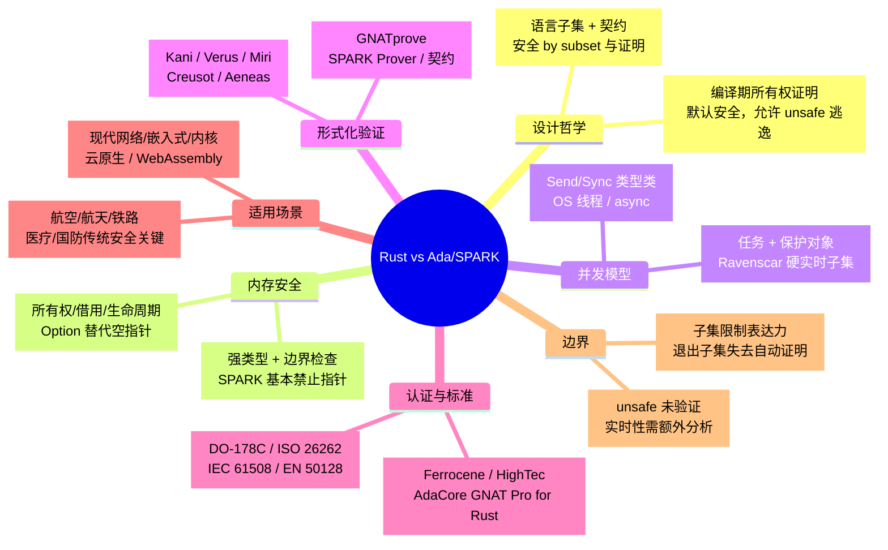

> **内容分级**: [对比级]
> **定理链**: N/A — 描述性/综述性/导航性文档，不涉及形式化定理链
>

# Rust vs Ada/SPARK：现代所有权类型系统与安全关键形式化子集的工程对比
>
> **EN**: Rust vs Ada/SPARK
> **Summary**: Comparative analysis of Rust and Ada/SPARK across memory safety, concurrency, formal verification, certification, and safety-critical engineering domains.
> **Rust 版本**: 1.97.0+ (Edition 2024)
> **受众**: [专家]
> **Bloom 层级**: L5
> **权威来源**: 本文件为 `concept/` 权威页。
> **定位**: 对比分析 **Rust** 与 **Ada/SPARK** 在系统编程、安全关键、形式化验证与认证工业中的设计本体论、实现机制与适用边界；通用安全关键工程实践与标准映射详见 [`content/safety_critical/`](../../../content/safety_critical/README.md)。
> **前置概念**: [Unsafe Rust](../../03_advanced/02_unsafe/01_unsafe.md) · [Formal Verification](../../07_future/04_research_and_experimental/02_formal_methods.md) · [Safety Boundaries](../03_domain_comparisons/01_safety_boundaries.md)
> **后置概念**: [Safety Critical Content](../../../content/safety_critical/README.md) · [Certified Toolchains](../../04_formal/04_model_checking/10_certified_toolchains_and_packages.md) · [Aerospace Certification & Formal Methods](../../04_formal/04_model_checking/03_aerospace_certification_formal_methods.md)
> **主要来源**: [Ada Reference Manual](https://www.adaic.org/resources/add_content/standards/22rm/html/RM-TOC.html) · [SPARK 2014 Reference Manual](https://docs.adacore.com/spark2014-docs/html/ug/index.html) · [SPARK Pro — AdaCore](https://www.adacore.com/about-spark) · [Ravenscar Profile](https://www.adaic.org/ada-resources/standards/ada-ravenscar/) · [Ferrocene](https://ferrocene.dev/) · [DO-178C / DO-333 — RTCA](https://my.rtca.org/) · [Rust Reference](https://doc.rust-lang.org/reference/introduction.html) · [Safety-Critical Rust Consortium](https://rustfoundation.org/safety-critical-rust-consortium/)
>
> **来源**: [Rust Reference](https://doc.rust-lang.org/reference/introduction.html) · [The Rust Programming Language](https://doc.rust-lang.org/book/title-page.html) · [Rustonomicon](https://doc.rust-lang.org/nomicon/index.html) · [Brown University — Interactive Rust Book](https://rust-book.cs.brown.edu/)
---

> **变更日志**:
>
> - v1.0 (2026-07-16): 初始版本；完成设计哲学、内存安全、并发模型、形式化验证、认证标准、生态场景、反命题边界与权威来源索引。

---

## 📑 目录

- [Rust vs Ada/SPARK：现代所有权类型系统与安全关键形式化子集的工程对比](#rust-vs-adaspark现代所有权类型系统与安全关键形式化子集的工程对比)
  - [📑 目录](#-目录)
  - [一、概述](#一概述)
    - [1.1 两种安全哲学的历史坐标](#11-两种安全哲学的历史坐标)
    - [1.2 核心命题](#12-核心命题)
    - [1.3 认知路径](#13-认知路径)
  - [二、核心维度对比](#二核心维度对比)
    - [2.1 设计哲学与语言本体论](#21-设计哲学与语言本体论)
    - [2.2 综合对比矩阵](#22-综合对比矩阵)
  - [三、内存安全](#三内存安全)
    - [3.1 Rust：所有权与借用检查](#31-rust所有权与借用检查)
    - [3.2 Ada/SPARK：强类型、约束与无指针子集](#32-adaspark强类型约束与无指针子集)
    - [3.3 内存安全机制矩阵](#33-内存安全机制矩阵)
    - [3.4 边界对比：显式逃逸 vs 子集限制](#34-边界对比显式逃逸-vs-子集限制)
  - [四、并发模型](#四并发模型)
    - [4.1 Rust：类型系统保证的并发安全](#41-rust类型系统保证的并发安全)
    - [4.2 Ada/SPARK：任务、保护对象与 Ravenscar](#42-adaspark任务保护对象与-ravenscar)
    - [4.3 并发模型矩阵](#43-并发模型矩阵)
  - [五、形式化验证](#五形式化验证)
    - [5.1 Rust：多工具、多层次的验证生态](#51-rust多工具多层次的验证生态)
    - [5.2 Ada/SPARK：语言集成的契约与自动证明](#52-adaspark语言集成的契约与自动证明)
    - [5.3 形式化验证工具矩阵](#53-形式化验证工具矩阵)
    - [5.4 关键差异：验证友好性 vs 表达力](#54-关键差异验证友好性-vs-表达力)
  - [六、认证与标准](#六认证与标准)
    - [6.1 标准映射概览](#61-标准映射概览)
    - [6.2 Rust 认证工具链现状](#62-rust-认证工具链现状)
    - [6.3 Ada/SPARK 认证优势](#63-adaspark-认证优势)
    - [6.4 认证成熟度对比表](#64-认证成熟度对比表)
  - [七、生态与适用场景](#七生态与适用场景)
    - [7.1 Rust 生态：现代系统与网络](#71-rust-生态现代系统与网络)
    - [7.2 Ada/SPARK 生态：受监管传统安全关键](#72-adaspark-生态受监管传统安全关键)
    - [7.3 场景决策矩阵](#73-场景决策矩阵)
  - [八、反命题/边界](#八反命题边界)
    - [8.1 Rust 的边界条件](#81-rust-的边界条件)
    - [8.2 Ada/SPARK 的边界条件](#82-adaspark-的边界条件)
    - [8.3 边界极限总结](#83-边界极限总结)
  - [九、来源与延伸阅读](#九来源与延伸阅读)
    - [9.1 权威外部来源](#91-权威外部来源)
    - [9.2 项目内部延伸阅读](#92-项目内部延伸阅读)
  - [🧭 思维导图（Mindmap）](#-思维导图mindmap)

---

## 一、概述

### 1.1 两种安全哲学的历史坐标

Rust 与 Ada/SPARK 都面向系统编程与安全关键领域，但诞生于截然不同的历史语境：

- **Ada** 由美国国防部于 20 世纪 80 年代主导设计，目标是统一高可靠嵌入式系统的编程语言，强调强类型、可读性、任务级并发与可审计性。其后续子集 **SPARK** 通过剔除不可验证的 Ada 特性（如无约束指针、非结构化控制、异常处理等），引入契约与自动定理证明，成为航空、航天、铁路、医疗等领域高安全软件的常用语言。
- **Rust** 由 Mozilla Research 于 2010 年启动，目标是“让每个人都能构建可靠且高效的软件”。它以**所有权（Ownership）**、**借用（Borrowing）**和**生命周期（Lifetime）**为核心，将内存安全与数据竞争自由编码进类型系统，无需垃圾回收即可实现零成本抽象。

> **来源**: [Wikipedia — Ada (programming language)](https://en.wikipedia.org/wiki/Ada_(programming_language)) · [Wikipedia — Rust (programming language)](https://en.wikipedia.org/wiki/Rust_(programming_language))

### 1.2 核心命题

| **维度** | **Rust** | **Ada/SPARK** |
|:---|:---|:---|
| **设计起点** | 用类型论在主流语言中消除整类内存与并发错误 | 用语言子集 + 契约 + 证明满足最高等级安全标准 |
| **安全保证单元** | safe Rust 子集在编译期排除 UB 与数据竞争 | SPARK 子集 + GNATprove 证明无运行时错误与功能正确性 |
| **对指针的态度** | 允许裸指针，但仅在 `unsafe` 块中；safe Rust 通过引用规则限制别名 | SPARK 基本禁止访问类型（access types），从根上消除别名与悬垂指针 |
| **并发抽象** | OS 线程 / async + `Send`/`Sync` 类型类 | 语言级任务（task）+ 保护对象（protected object）；Ravenscar 子集用于硬实时 |
| **形式化工具** | Kani、Verus、Miri、Creusot、Aeneas 等外部/研究工具 | GNATprove + SPARK Prover（Alt-Ergo、CVC5、Z3）内置集成 |
| **认证成熟度** | Ferrocene 等工具链正在获得 TÜV 认证；SCRC 推动工业标准 | 数十年 DO-178C、ISO 26262、IEC 61508、EN 50128 应用与证据积累 |

### 1.3 认知路径

```text
为什么对比 Rust 与 Ada/SPARK?
    └── 两者都追求高可信系统，但采用相反的策略
        └── Rust: 在通用类型系统中嵌入安全规则（默认安全，允许显式逃逸）
            └── Ada/SPARK: 先定义可证明的子集，再在此子集内编程（安全 by subset）
                └── 内存安全：所有权检查 vs 无指针/强约束
                    └── 并发模型：类型级线程安全 vs Ravenscar 确定性任务
                        └── 验证：外部工具生态 vs 语言集成证明
                            └── 认证：新兴证据 vs 历史先例
                                └── 适用边界：现代系统 vs 受监管传统安全关键
```

---

## 二、核心维度对比

### 2.1 设计哲学与语言本体论

| **对比项** | **Rust** | **Ada/SPARK** |
|:---|:---|:---|
| **编程即…** | 构造编译期可证明的安全程序 | 在受控子集中编写可审计、可证明的代码 |
| **信任边界** | 编译器（借用检查器）保证 safe Rust；`unsafe` 块由程序员负责 | 语言子集 + 工具（GNATprove）保证；超出子集需人工评审 |
| **抽象代价** | 零成本抽象：泛型单态化、确定性 Drop | 抽象经编译器优化，SPARK 子集可能要求显式循环不变式 |
| **错误处理** | `Result<T,E>` / `Option<T>` / panic，鼓励显式处理 | 异常机制在 SPARK 中受限或禁止；前置/后置条件替代部分错误路径 |
| **向后兼容** | Edition 机制（2015/2018/2021/2024） | Ada 2012/2022 标准演进，SPARK 子集逐步扩展但仍保守 |

> **来源**: [TRPL — What is Ownership?](https://doc.rust-lang.org/book/ch04-01-what-is-ownership.html) · [SPARK 2014 — Language Reference](https://docs.adacore.com/spark2014-docs/html/lrm/index.html)

### 2.2 综合对比矩阵

| **维度** | **Rust** | **Ada/SPARK** | **判定说明** |
|:---|:---|:---|:---|
| **内存安全保证** | safe Rust 编译期无 UAF/DF/悬垂/空指针/数据竞争 | SPARK 证明无运行时错误（AoRTE），无指针别名 | Rust 覆盖面更广但允许 `unsafe`；SPARK 子集更严格 |
| **实时确定性** | 无 GC，但 async/线程调度依赖 OS/运行时；WCET 需额外分析 | Ravenscar 提供静态可分析的任务集、优先级天花板协议 | Ada/SPARK 在硬实时分析上更成熟 |
| **并发形式化** | 类型系统保证 data-race free；活性/死锁需额外验证 | 任务/保护对象语言内置；Ravenscar 子集可调度分析 | Rust 防止数据竞争，Ada 提供实时调度保证 |
| **证明自动化** | Kani/Verus 需标注，工具链多样 | GNATprove 与编译器集成，SPARK 子集使证明更自动化 | SPARK 在子集内自动化程度更高 |
| **包生态/开放性** | crates.io 数十万包，开源活跃 | AdaCore 商业生态 + 开源库（Alire），规模小于 Rust | Rust 现代生态优势明显 |
| **认证先例** | Ferrocene（TÜV SÜD ASIL D/SIL3/Class C）等新兴证据 | 波音 787、空客 A380、铁路信号等数十年证据 | Ada/SPARK 在传统受监管行业更被接受 |
| **与 C/汇编互操作** | FFI + `unsafe` 自然但破坏安全保证 | Ada 可直接嵌入汇编/导入 C，但 SPARK 证明可能失效 | 两者在边界处都需额外验证 |
| **学习曲线** | 所有权/生命周期陡峭 | SPARK 契约与证明概念陡峭；Ada 语法较冗长 | 两者都需要专家级训练 |

---

## 三、内存安全

### 3.1 Rust：所有权与借用检查

Rust 将内存安全编码进类型系统：

- **唯一所有权**：任一时刻，每个值有且只有一个所有者；所有者离开作用域时自动 `Drop`。
- **借用规则**：在任一作用域内，对给定数据要么有一个可变引用，要么有多个不可变引用，二者不可兼得。
- **生命周期**：编译器通过生命周期参数确保引用不会比被引用数据活得更长。
- **Option 替代空指针**：`Option<T>` 强制调用者处理 `None`。
- **切片与边界**：索引越界在 safe Rust 中触发 panic 而非未定义行为。

> **来源**: [Rust Reference — Behavior Considered Undefined](https://doc.rust-lang.org/reference/behavior-considered-undefined.html) · [TRPL — References and Borrowing](https://doc.rust-lang.org/book/ch04-02-references-and-borrowing.html)

```rust
fn main() {
    let mut s = String::from("Ada/SPARK");
    let r1 = &s;          // 不可变借用
    let r2 = &s;          // 可同时存在多个不可变借用
    println!("{} {}", r1, r2);
    let r3 = &mut s;      // 此时 r1/r2 已不再使用，可变借用合法
    r3.push_str(" vs Rust");
    println!("{}", r3);
}
```

### 3.2 Ada/SPARK：强类型、约束与无指针子集

Ada 的内存安全策略与 Rust 不同：

- **强类型与范围约束**：数组索引、标量范围、记录字段在运行时可检查，也可在 SPARK 中通过证明消除检查。
- **访问类型（access types）受控**：完整 Ada 允许指针，但 SPARK 子集**基本禁止访问类型**，从而消除悬垂指针、别名和许多未定义行为。
- **Ravenscar 配置**：禁止动态内存分配（`new`）、动态任务创建、异常传播等，使内存与调度完全静态可分析。
- **契约前置/后置条件**：`Pre`/`Post` 在编译/证明阶段检查输入输出关系，替代部分运行时错误处理。

> **来源**: [SPARK 2014 User's Guide — Limitations](https://docs.adacore.com/spark2014-docs/html/ug/en/source/limitations.html) · [Ada Reference Manual — Access Types](https://www.adaic.org/resources/add_content/standards/22rm/html/RM-3-10.html)

```ada
package Bounded_Buffer is
   Capacity : constant Positive := 8;
   subtype Index_Type is Positive range 1 .. Capacity;
   subtype Count_Type is Natural  range 0 .. Capacity;
   type Item_Array is array (Index_Type) of Integer;

   type Buffer is record
      Data  : Item_Array;
      Head  : Index_Type := 1;
      Tail  : Index_Type := 1;
      Count : Count_Type := 0;
   end record;

   procedure Push (B : in out Buffer; Value : Integer) with
      Pre  => B.Count < Capacity,
      Post => B.Count = B.Count'Old + 1;

   function Pop (B : in out Buffer) return Integer with
      Pre  => B.Count > 0,
      Post => B.Count = B.Count'Old - 1;
end Bounded_Buffer;
```

### 3.3 内存安全机制矩阵

| **威胁** | **Rust 机制** | **Ada/SPARK 机制** | **说明** |
|:---|:---|:---|:---|
| Use-after-free | 所有权 + 生命周期 | 禁止指针；Ravenscar 禁止动态分配 | Rust 在 `unsafe` 中仍可能；SPARK 子集从语法上消除 |
| Double-free | 所有权唯一性 + RAII | 无显式 `free`；作用域结束自动释放 | Rust Drop 等价于 Ada 控制类型 Finalization |
| 悬垂指针 | 生命周期检查 | 禁止裸指针/访问类型 | Rust 引用等价于 Ada `access` 参数，但 SPARK 更严格 |
| 缓冲区溢出 | 切片索引运行时检查 + 类型化数组 | 数组边界检查 + 范围约束 | 两者 safe 子集均排除越界 UB |
| 空指针 | `Option<T>` | `not null` 访问类型约束；SPARK 中基本无指针 | Rust 编译期强制；Ada 运行时/类型约束 |
| 别名写入 | 借用 XOR 可变 | 无指针 → 无别名 | SPARK 的“无别名”是更强但限制更大的保证 |
| 内存泄漏 | 可能（`Rc` 循环、`mem::forget`） | Ravenscar 静态分配基本避免；完整 Ada 仍可能 | 都不是完整垃圾回收 |

### 3.4 边界对比：显式逃逸 vs 子集限制

Rust 的 `unsafe` 是**显式逃逸**：你可以写底层代码，但需自行维护不变量；编译器不再担保。SPARK 的边界则是**子集限制**：如果你需要的特性不在 SPARK 子集中（如复杂指针、动态分配、异常），你必须退出 SPARK 并使用完整 Ada 或外部代码，随之失去自动证明。

> **相关阅读**: 关于 Rust `unsafe` 边界的完整地图，见 [`Safety Boundaries`](../03_domain_comparisons/01_safety_boundaries.md) 与 [`Unsafe Rust`](../../03_advanced/02_unsafe/01_unsafe.md)。

---

## 四、并发模型

### 4.1 Rust：类型系统保证的并发安全

Rust 通过两个 marker trait 将并发安全编码进类型：

- `Send`：类型可以安全地在线程间转移所有权。
- `Sync`：类型可以安全地被多个线程同时引用。

编译器据此在编译期排除数据竞争；但**死锁、活锁、优先级反转**等活性问题仍需人工分析或运行时协议。

> **来源**: [TRPL — Extensible Concurrency with the Sync and Send Traits](https://doc.rust-lang.org/book/ch16-04-extensible-concurrency-sync-and-send.html)

```rust
use std::sync::{Arc, Mutex};
use std::thread;

fn main() {
    let counter = Arc::new(Mutex::new(0));
    let mut handles = vec![];

    for _ in 0..4 {
        let c = Arc::clone(&counter);
        handles.push(thread::spawn(move || {
            let mut n = c.lock().unwrap();
            *n += 1;
        }));
    }

    for h in handles { h.join().unwrap(); }
    assert_eq!(*counter.lock().unwrap(), 4);
}
```

### 4.2 Ada/SPARK：任务、保护对象与 Ravenscar

Ada 将并发作为语言一级特性：

- **Task**：独立的执行线程，可通过入口（entry）进行会合（rendezvous）。
- **Protected Object**：类似 monitor，提供互斥访问与条件同步，支持 Priority Ceiling Protocol。
- **Ravenscar Profile**：Ada 任务配置的**受控子集**，要求任务在库层级声明、禁止动态创建/终止、禁止 select/abort/requeue、禁止异常传播；使响应时间与调度可静态分析。

> **来源**: [Ada Reference Manual — Tasks and Synchronization](https://www.adaic.org/resources/add_content/standards/22rm/html/RM-9.html) · [Ravenscar Profile](https://www.adaic.org/ada-resources/standards/ada-ravenscar/)

```ada
protected Counter is
   procedure Increment;
   function Value return Natural;
private
   Count : Natural := 0;
end Counter;

protected body Counter is
   procedure Increment is
   begin
      Count := Count + 1;
   end Increment;

   function Value return Natural is (Count);
end Counter;
```

Ravenscar 周期性任务示例：

```ada
package Periodic is
   task type Worker with Priority => 10;
end Periodic;

package body Periodic is
   task body Worker is
      Period : constant Duration := 0.010; -- 10 ms
      Next   : Time := Clock;
   begin
      loop
         -- 安全关键工作负载
         Next := Next + Period;
         delay until Next;
      end loop;
   end Worker;
end Periodic;
```

### 4.3 并发模型矩阵

| **维度** | **Rust** | **Ada/SPARK** |
|:---|:---|:---|
| **核心抽象** | OS 线程 / async 任务 | 语言级 `task` + `protected` |
| **共享状态** | `Mutex`/`RwLock` + `Arc`；编译期 `Sync` 检查 | `protected object`；入口与优先级天花板协议 |
| **通信方式** | 消息传递（channel）+ 共享状态 | 会合（rendezvous）+ 保护对象 + 共享内存 |
| **数据竞争** | 编译期排除 | Ravenscar/SPARK 子集 + 保护对象规则排除 |
| **调度** | 依赖 OS 调度器或 Tokio 运行时 | Ravenscar 提供静态优先级、可调度性分析 |
| **实时性** | 无语言级实时保证；需 RTOS/分析 | 硬实时传统强项；可与 Rate Monotonic Analysis 结合 |
| **死锁** | 不保证；需协议/静态分析 | Ravenscar 限制降低死锁风险；仍需分析 |
| **形式化** | Verus/Kani 可验证并发协议 | 保护对象与 Ravenscar 结构更易进入模型检测 |

---

## 五、形式化验证

### 5.1 Rust：多工具、多层次的验证生态

Rust 的形式化验证呈现“分层光谱”：

- **Miri**：动态检测 safe/unsafe 边界的未定义行为，基于 Tree Borrows 内存模型。
- **Kani**：有界模型检测（CBMC 后端），验证 safe/unsafe 代码的内存安全与断言。
- **Verus**：微软的演绎验证器，在 Rust 语法内写规范与证明，适合并发算法与系统代码。
- **Creusot / Prusti / Aeneas**：基于 Why3、Viper、函数式翻译的验证工具。
- **RustBelt**：Coq/Iris 中对 Rust 类型系统可靠性的元理论证明。

> **来源**: [Formal Methods](../../07_future/04_research_and_experimental/02_formal_methods.md) · [Verification Toolchain](../../04_formal/04_model_checking/01_verification_toolchain.md)

```rust,ignore
// Kani 示例：验证有界缓冲区的不变式
#[kani::proof]
fn check_bounded_buffer() {
    let mut b = BoundedBuffer::<4>::new();
    b.push(1);
    b.push(2);
    assert!(b.len() == 2);
    assert_eq!(b.pop(), Some(1));
}
```

### 5.2 Ada/SPARK：语言集成的契约与自动证明

SPARK 的核心验证单元是**子程序契约**：

- `Pre` / `Post`：前置/后置条件。
- `Global` / `Depends`：副作用与数据依赖声明。
- `Type Invariant` / `Predicate`：类型级不变式。
- `Loop Invariant` / `Variant`：循环不变式与终止证明。
- `GNATprove` 将证明义务提交给 Alt-Ergo、CVC5、Z3 等 SMT 求解器。

SPARK 首先证明 **Absence of Run-Time Errors (AoRTE)**：无溢出、无除零、无数组越界、无断言失败。进一步可证明功能正确性。

> **来源**: [SPARK 2014 User's Guide — Proof](https://docs.adacore.com/spark2014-docs/html/ug/en/source/how_to_run_gnatprove.html)

```ada
package Int_Swap with
   SPARK_Mode
is
   procedure Swap (X, Y : in out Integer) with
      Pre  => True,
      Post => X = Y'Old and Y = X'Old;
end Int_Swap;

package body Int_Swap with SPARK_Mode is
   procedure Swap (X, Y : in out Integer) is
      Tmp : constant Integer := X;
   begin
      X := Y;
      Y := Tmp;
   end Swap;
end Int_Swap;
```

### 5.3 形式化验证工具矩阵

| **能力** | **Rust (Kani/Verus/Miri)** | **SPARK (GNATprove)** |
|:---|:---|:---|
| **证明对象** | Rust 程序（含 unsafe/FFI 边界） | SPARK Ada 子集 |
| **自动化程度** | Kani 自动但受状态空间限制；Verus 需大量标注 | SPARK 子集内高度自动化；复杂循环需不变式 |
| **内存模型** | Tree Borrows / Stacked Borrows（Miri） | 无指针/别名，简化内存模型 |
| **并发证明** | Verus 支持；Kani 部分支持 | Ravenscar/保护对象结构可进入模型检测 |
| **工业集成** | 新兴，CI/CD 集成逐步成熟 | AdaCore GNAT Pro 工具链内置，成熟 |
| **覆盖范围** | 可选择性验证关键模块 | 可对整个 SPARK 子集程序进行完整 AoRTE 证明 |
| **可组合性** | crate/模块级，依赖 unsafe 边界文档 | 子程序契约作为模块接口规范 |

### 5.4 关键差异：验证友好性 vs 表达力

SPARK 的证明优势来自**主动限制语言**：去掉指针、动态分配、异常、不受限任务等，使得内存模型和副作用可完全静态分析。Rust 的验证工具则需要处理更丰富的语言特性（所有权转移、生命周期、泛型单态化、async 状态机），因此工具更分散，证明成本更高，但**不需要离开主流语言子集**即可表达复杂系统。

---

## 六、认证与标准

### 6.1 标准映射概览

| **标准** | **Ada/SPARK 成熟度** | **Rust 成熟度** | **说明** |
|:---|:---|:---|:---|
| **DO-178C** | 成熟，大量 Level A/B 飞行软件证据 | 需 Ferrocene/AdaCore 等认证工具链补充 | DO-333 形式化方法补充对 SPARK 天然友好 |
| **ISO 26262** | 成熟，ASIL D 常见 | Ferrocene ASIL D / HighTec AURIX ASIL D 出现 | Rust 需工具链鉴定与 MC/DC 覆盖证据 |
| **IEC 61508** | 成熟，SIL 4 应用 | Ferrocene SIL 3；SIL 4 需形式化多样性 | 见 [`IEC 61508 实施指南`](../../../content/safety_critical/10_standards/02_iec_61508_rust_implementation_guide.md) |
| **EN 50128** | 铁路信号传统选择 | 新兴，案例增加 | 见 [`铁路信号案例`](../../../content/safety_critical/07_case_studies/05_case_study_05_railway_signaling.md) |
| **IEC 62304** | 医疗领域有先例 | Class C 可行，需流程证据 | 见 [`医疗设备案例`](../../../content/safety_critical/07_case_studies/04_case_study_04_medical_devices.md) |
| **MISRA** | SPARK Ada Coding Standard；无 MISRA Ada | MISRA C:2025 Addendum 6 映射 Rust 到 C 规则 | 见 [`MISRA C:2025 Addendum 6`](../../../content/safety_critical/10_standards/04_misra_c_2025_addendum_6_guide.md) |

### 6.2 Rust 认证工具链现状

- **Ferrocene**：Ferrous Systems 的 Rust 工具链，已通过 TÜV SÜD 鉴定，覆盖 ISO 26262 ASIL D、IEC 61508 SIL 3、IEC 62304 Class C；提供 Ferrocene Language Specification 作为安全关键开发的参考。
- **HighTec Rust Development Platform**：面向英飞凌 AURIX，TÜV NORD ASIL D 认证，集成 PXROS-HR RTOS。
- **AdaCore GNAT Pro for Rust**：商业支持路线，依赖 AdaCore 在受监管行业的服务与流程经验。
- **Safety-Critical Rust Consortium（SCRC）**：2024 年由 Rust Foundation、AdaCore、Ferrous Systems 等发起，推动编码指南、工具子委员会与标准对齐。

> **来源**: [Ferrocene Qualification Report](https://public-docs.ferrocene.dev/main/qualification/report/index.html) · [Ferrocene Language Specification](https://spec.ferrocene.dev/) · [Certified Toolchains](../../04_formal/04_model_checking/10_certified_toolchains_and_packages.md)

### 6.3 Ada/SPARK 认证优势

- **长期证据**：波音 787、空客 A380、铁路 ERTMS、航天器载荷软件等均有 Ada/SPARK 应用。
- **DO-178C + DO-333**：SPARK 的形式化证明可直接作为 DO-333 形式化方法证据，减少部分测试覆盖要求。
- **工具鉴定**：AdaCore GNAT Pro 与 SPARK Pro 提供 Qualification Kit，支持 DO-330 工具鉴定。

### 6.4 认证成熟度对比表

| **维度** | **Ada/SPARK** | **Rust** |
|:---|:---|:---|
| **飞行软件先例** | 大量（Level A/B） | 有限，正在积累 |
| **工具链鉴定包** | GNAT Pro/SPARK Pro Qualification Kit | Ferrocene Qualification Report；AdaCore 商业包 |
| **形式化方法证据** | SPARK 证明可直接用于 DO-333 | Kani/Verus 证据需按项目整理 |
| **标准覆盖完整度** | 覆盖航空、汽车、轨交、医疗、国防 | 汽车/工业进展快；航空仍需案例 |
| **MC/DC 覆盖** | 成熟工具链支持 | Rust 2024 增加 `#[coverage]`；仍需工具链支持 |

---

## 七、生态与适用场景

### 7.1 Rust 生态：现代系统与网络

Rust 的优势场景：

- **高性能网络服务**：Tokio、hyper、QUIC 实现（如 s2n-quic）。
- **操作系统与内核**：Redleaf、Theseus、Rust-for-Linux、驱动开发。
- **嵌入式与物联网**：`no_std` + Embassy、RTIC、smoltcp、defmt。
- **汽车**：AUTOSAR Adaptive、Ferrocene/HighTec 工具链、ECU 固件。
- **航空航天新兴**：NASA cFS Rust 绑定、F' 组件实验、卫星载荷软件。
- **WebAssembly 与云原生**：wasmtime、Kranelift、容器安全沙箱。

> **来源**: [Rust in Space](../../07_future/02_preview_features/30_rust_in_space.md) · [AUTOSAR and Rust](../../06_ecosystem/11_domain_applications/22_autosar_and_rust.md) · [Industrial Case Studies](../../06_ecosystem/11_domain_applications/14_industrial_case_studies.md)

### 7.2 Ada/SPARK 生态：受监管传统安全关键

Ada/SPARK 的传统强项：

- **商用航空**：飞控、导航、发动机控制（DO-178C Level A/B）。
- **航天**：卫星平台软件、星载计算机、深空探测器（PVS + SPARK）。
- **铁路信号**：ERTMS/ETCS、联锁系统（EN 50128 SIL 4）。
- **医疗设备**：起搏器、输液泵、影像设备（IEC 62304 Class C）。
- **国防与汽车**：武器系统、高完整性汽车 ECU。
- **工具链**：AdaCore GNAT Pro、SPARK Pro、QGen（Simulink→Ada/SPARK）、RTEMS/VxWorks 集成。

### 7.3 场景决策矩阵

| **场景** | **首选** | **理由** |
|:---|:---|:---|
| 新建高吞吐网络服务 | Rust | 所有权安全 + 丰富异步生态 + 零成本抽象 |
| 新型汽车 ECU（ASIL D） | Rust 或 Ada/SPARK | 依赖现有工具链认证与团队经验；两者均可用 |
| 民用飞机飞控（DO-178C Level A） | Ada/SPARK | 长期证据、DO-333 形式化支持、鉴定包 |
| 卫星载荷软件 | Ada/SPARK 或 Rust | 传统 SPARK+PVS；Rust 新兴，需补充证据 |
| 铁路信号 SIL 4 | Ada/SPARK | 强形式化历史与静态分析 |
| 物联网传感器节点 | Rust | `no_std` + 活跃开源 + 快速原型 |
| 医疗 Class C（新平台） | 两者皆可 | 依赖监管接受度与供应商支持 |
| 操作系统内核（新研究） | Rust | 所有权模型适合复杂内核不变量 |

---

## 八、反命题/边界

### 8.1 Rust 的边界条件

1. **`unsafe` 是未验证边界**：所有 safe Rust 保证在 `unsafe` 块中失效，需要人工证明 + Miri/Kani 等工具辅助。
2. **不保证实时性**：无 GC 不等于可预测的 WCET；`async` 运行时调度、锁竞争、内存分配仍可能导致非确定性。
3. **认证证据尚年轻**：虽有 Ferrocene 等认证，但 DO-178C Level A 飞行软件先例远少于 Ada/SPARK。
4. **并发活性不自动保证**：`Send`/`Sync` 防止数据竞争，但不防止死锁、优先级反转或饥饿。
5. **FFI 边界难证明**：与 C/汇编互操作时，Rust 的类型保证无法跨越语言边界。

### 8.2 Ada/SPARK 的边界条件

1. **子集限制可能冲突于现代库**：SPARK 禁止指针/动态分配，导致无法直接复用大量 Ada 或 C 库。
2. **退出 SPARK 即失去自动证明**：与 C/汇编/完整 Ada 的接口需要人工评审和传统测试。
3. **Ravenscar 限制表达能力**：禁止动态任务、异常、select 等，某些通信协议实现繁琐。
4. **包生态规模小**：Alire 与 AdaCore 生态远小于 crates.io；新算法、网络协议实现较少。
5. **工具链成本高**：GNAT Pro/SPARK Pro 商业授权对小型团队构成门槛。

### 8.3 边界极限总结

| **反命题** | **Rust 反例** | **Ada/SPARK 反例** |
|:---|:---|:---|
| 所有代码都可自动证明 | `unsafe` 块需要外部证明 | 超出 SPARK 子集的代码无法自动证明 |
| 编译安全 = 实时安全 | async 调度与锁不可预测 | Ravenscar 牺牲表达力换取可预测性 |
| 一种语言可覆盖所有 SIL/ASIL | 航空 Level A 证据不足 | 现代网络/IoT 生态不足 |
| 无数据竞争 = 无并发错误 | 死锁仍可能发生 | 优先级反转仍需 Ceiling Protocol 分析 |

---

## 九、来源与延伸阅读

### 9.1 权威外部来源

- [Ada Reference Manual (Ada 2022)](https://www.adaic.org/resources/add_content/standards/22rm/html/RM-TOC.html)
- [SPARK 2014 User's Guide](https://docs.adacore.com/spark2014-docs/html/ug/index.html)
- [SPARK 2014 Language Reference Manual](https://docs.adacore.com/spark2014-docs/html/lrm/index.html)
- [SPARK Pro — AdaCore](https://www.adacore.com/about-spark)
- [Ravenscar Profile](https://www.adaic.org/ada-resources/standards/ada-ravenscar/)
- [Ferrocene](https://ferrocene.dev/)
- [Ferrocene Language Specification](https://spec.ferrocene.dev/)
- [Ferrocene Qualification Report](https://public-docs.ferrocene.dev/main/qualification/report/index.html)
- [DO-178C / DO-333 — RTCA](https://my.rtca.org/)
- [Safety-Critical Rust Consortium](https://rustfoundation.org/safety-critical-rust-consortium/)
- [The Rust Programming Language](https://doc.rust-lang.org/book/title-page.html)
- [Rust Reference](https://doc.rust-lang.org/reference/introduction.html)
- [Rustonomicon](https://doc.rust-lang.org/nomicon/index.html)

### 9.2 项目内部延伸阅读

- [`content/safety_critical/README.md`](../../../content/safety_critical/README.md) — Rust 安全关键生态系统专题套件入口
- [`content/safety_critical/10_standards/01_do_178c_rust_compliance_pathway.md`](../../../content/safety_critical/10_standards/01_do_178c_rust_compliance_pathway.md) — DO-178C Rust 合规路径
- [`content/safety_critical/10_standards/02_iec_61508_rust_implementation_guide.md`](../../../content/safety_critical/10_standards/02_iec_61508_rust_implementation_guide.md) — IEC 61508 实施指南
- [`content/safety_critical/10_standards/03_iso_26262_rust_implementation_guide.md`](../../../content/safety_critical/10_standards/03_iso_26262_rust_implementation_guide.md) — ISO 26262 实施指南
- [`content/safety_critical/10_standards/04_misra_c_2025_addendum_6_guide.md`](../../../content/safety_critical/10_standards/04_misra_c_2025_addendum_6_guide.md) — MISRA C:2025 Addendum 6 Rust 应用指南
- [`concept/04_formal/04_model_checking/10_certified_toolchains_and_packages.md`](../../04_formal/04_model_checking/10_certified_toolchains_and_packages.md) — 认证工具链与认证包清单
- [`concept/04_formal/04_model_checking/03_aerospace_certification_formal_methods.md`](../../04_formal/04_model_checking/03_aerospace_certification_formal_methods.md) — 航空航天认证与形式化方法
- [`concept/07_future/04_research_and_experimental/02_formal_methods.md`](../../07_future/04_research_and_experimental/02_formal_methods.md) — 形式化方法工业化
- [`concept/07_future/02_preview_features/12_ferrocene_preview.md`](../../07_future/02_preview_features/12_ferrocene_preview.md) — Ferrocene 预览
- [`concept/07_future/02_preview_features/30_rust_in_space.md`](../../07_future/02_preview_features/30_rust_in_space.md) — Rust in Space
- [`concept/03_advanced/02_unsafe/01_unsafe.md`](../../03_advanced/02_unsafe/01_unsafe.md) — Unsafe Rust
- [`concept/05_comparative/03_domain_comparisons/01_safety_boundaries.md`](../03_domain_comparisons/01_safety_boundaries.md) — 安全边界全景

---

## 🧭 思维导图（Mindmap）



> **认知功能**: 将 Rust 与 Ada/SPARK 的对比折叠为“通用类型系统安全”与“安全关键子集证明”两条路线，帮助在不同工业语境下选择技术栈。
